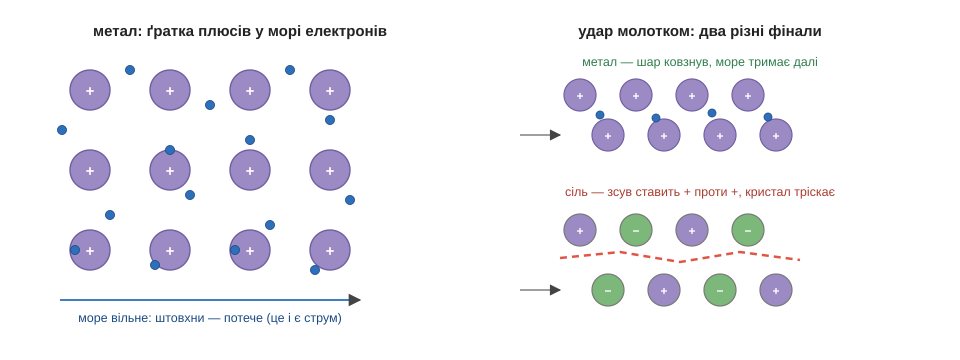

# Металічний зв'язок

Візьмемо залізо — метал, що радо віддає свої зовнішні електрони. А тепер уяви цілий шматок такого металу — скажімо, залізний цвях. У ньому стиснуті пліч-о-пліч мільярди мільярдів атомів феруму, і кожнісінький з них радий би зовнішні електрони комусь віддати. Та халепа в тому, що навколо — самі такі ж, як він: усі хочуть віддавати, і жодного, хто хотів би взяти. Здавалося б, глухий кут: стратегія «віддати» вимагає того, хто прийме, а приймати нікому.

> 🔗 Чи радо атом віддає електрони, підказує його місце в періодичній таблиці: метали зліва й знизу мають усього кілька зовнішніх електронів і легко їх відпускають. [читати](root:course/basic-chemistry/./formulas-valence-mole/valence/b)

Метали виплутуються з цього напрочуд винахідливо. Якщо немає кому віддати електрон особисто — то віддаймо його **не комусь одному, а всім одразу**. Кожен атом відпускає свої зовнішні електрони у спільне користування, і виходить картина з двох частин. З одного боку — рівна, упорядкована **ґратка** з позитивних іонів (адже кожен атом, віддавши електрони, став плюсовим іоном, як натрій у солі). А з іншого — ці звільнені електрони збираються в суцільне рухливе **«море»**, що вільно тече поміж іонами, не належачи нікому з них окремо й належачи всім разом. Позитивні іони ґратки притягуються до цього спільного моря мінусів з усіх боків — і саме це притягання тримає метал як єдине ціле. Так влаштований **металічний зв'язок**, третій і останній у нашій трійці.

Найгарніше в цій картині те, що з неї одразу, без жодних додаткових правил, випливають усі знайомі звички металів. Чому метал проводить струм? Бо електрони його моря ні до кого не прив'язані: підштовхни їх з одного кінця дроту — і вони потечуть, а потік електронів і є електричний струм. Чому метал не б'ється, а гнеться й кується? Бо удар молотка зсуває шари важких іонів один відносно одного, але рухливому морю однаково байдуже, як саме стоять плюси, — воно миттю перетікає слідом і знову їх стягує. Порівняй це із сіллю, де іони теж стоять ґраткою, але нерухомо й без жодного моря: там зсув шару підставляє плюс просто навпроти плюса, однакові заряди різко відштовхуються — і кристал розколюється. Ось чому залізо під молотком розплющується в лист, а кристалик солі розлітається на порох. А чому, нарешті, метал блищить дзеркальним блиском? Бо те саме вільне море електронів гойдається в такт світловій хвилі, що падає на поверхню, і відкидає світло назад майже повністю.

Металічний зв'язок — третій і останній спосіб із трійки, і варто глянути на неї згори, бо так вона запам'ятовується найкраще. Усі три зв'язки — це, по суті, три різні відповіді на одне-єдине питання: куди подіти неспокійні зовнішні електрони, щоб дістати жадану повну поличку. Можна передати їх конкретному сусідові — і вийде **іонний** зв'язок. Можна скласти їх із сусідом у спільну пару — **ковалентний**. А можна злити в спільне море на всіх — **металічний**. Яку саме стратегію обере атом, підказує його місце в таблиці: ліві й нижні віддають, праві й верхні забирають.

> 🔗 Іонний і ковалентний — два інші способи прилаштувати зовнішні електрони: іонний передає їх сусідові начисто, ковалентний складає в спільну пару двох атомів. [читати](root:course/basic-chemistry/./bonds/ionic-covalent/b)

*Ґратка позитивних іонів у морі спільних електронів: море тече — метал проводить струм; шари ковзають, а море тримає — метал кується; а в солі зсув ставить плюс проти плюса, і кристал тріскає.*

> 🏠 Мідний дріт у зарядці телефона — це і є ґратка позитивних іонів міді, зануреними в море електронів якої щовечора тече твій струм.
