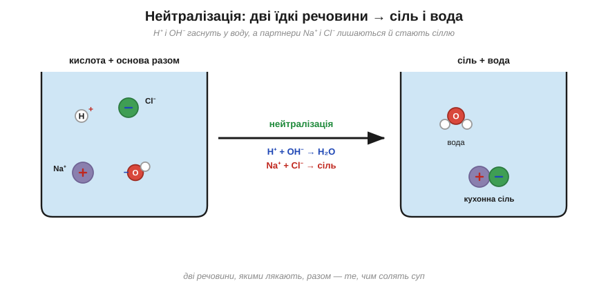
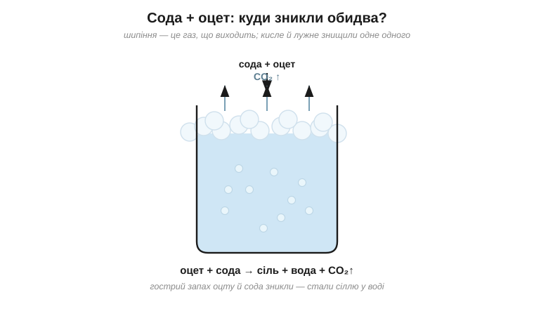

# Солі

Налий оцту на ложку соди — і вони скажено зашиплять, аж піна полізе через край склянки. А коли все стихне, придивися: у склянці немає вже ні гострого запаху оцту, ні білої соди. Двоє їдких речовин кудись поділися. Куди ж?

Розгадка в тому, що [кислоти й луги](root:basic-chemistry/acids) — це дві точні протилежності. Кислота віддає в розчин іон H⁺ (саме він робить смак кислим і роз'їдає), а луг навпаки постачає іон OH⁻ (він робить розчин слизьким і їдким). Щойно кислотний H⁺ зустрічає лужний OH⁻, вони складаються у звичайнісіньку воду й гаснуть одне в одному.

Саме це й сталося в склянці, і зветься воно **нейтралізацією**: кисле й лужне знищують одне в одному рівно те, що робило кожне з них їдким. Сильна кислота після цього вже не кисла, луг уже не слизький — у склянці лишається спокійна нейтральна вода.

Але придивімося уважніше, бо кожен із двох прийшов на зустріч не сам. Кислота — це ж не лише H⁺, а й його негативний «хвіст»: у хлоридної кислоти таким хвостом є Cl⁻. І основа — це не лише OH⁻, а й позитивний партнер при ньому: у їдкого натру це Na⁺. Тож коли H⁺ і OH⁻ пішли собі у воду, хвіст і партнер лишилися самі — а позитивний іон поряд із негативним і є **сіль**. І ось найкрасивіший приклад цього: люта хлоридна кислота плюс їдкий натр дають разом… звичайну кухонну сіль і воду. Дві речовини, якими в лабораторії лякають, з'єднавшись, перетворюються на те, чим ми щодня солимо суп. Спробуй угадати наперед, що ж лишилося в тій склянці після того, як сода з оцтом відшипіли своє?.. Солона вода: газ вийшов бульбашками, їдкість обопільно згасла, а від двох речовин лишилася розчинена у воді сіль.

*H⁺ і OH⁻ гаснуть у воду, а їхні партнери Na⁺ і Cl⁻ лишаються поряд і стають сіллю: з хлоридної кислоти й їдкого натру виходять кухонна сіль і вода.*

І тут варто наголосити: слово «сіль» у хімії означає геть не лише ту, що в сільничці. Це ціле велике сімейство речовин на той самий лад — «позитивний іон та негативний іон разом». Накип у чайнику, біла крейда на дошці, морська сіль, харчова сода — усе це солі, залишки давніх зустрічей кислот і основ (а трохи й зустрічей металів з оксидами). Накип і крейда — це взагалі та сама сіль, лише в дещо різному вигляді. Кислоти, основи, оксиди й солі сполучені родинними переходами (кислота + основа → сіль, метал + кислота → сіль, оксид + вода → кислота чи основа) і разом складаються в єдину [карту неорганічних речовин](root:basic-chemistry/inorganic-map).

*Шипіння соди з оцтом — це газ, що виходить; а гострий оцет і сода нейтралізують одне одного, лишаючи солону воду.*

> 🧪 **Спробуй сам.** Насип у склянку ложку харчової соди й лий потроху столовий оцет. Зашипить і спіниться — це виходить вуглекислий газ. Коли все стихне, обережно понюхай: гострий дух оцту зник. Кисле й лужне знищили одне одного, лишивши по собі трохи солоної води й газ, що вивітрився. ⚠️ Постав склянку в раковину, бо піна лізе через край, і не нахиляйся над нею обличчям.

> 🏠 Оцтом відмивають накип у чайнику саме тому: накип — це сіль, а кислота розчиняє його назад, з тим самим знайомим шипінням газу.
