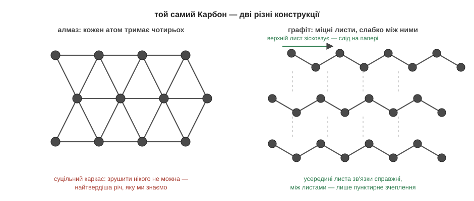

# Структура і властивості

Ось загадка, з якої видно всю силу однієї думки. Поклади поруч грифель простого олівця й діамант із каблучки і віддай обидва на хімічний аналіз. Відповідь прийде однаковісінька: і там, і там — чистий Карбон, одна-єдина клітинка таблиці, жодної домішки. Але ж грифель м'який, чорний і лишає слід на папері, а діамант прозорий, та такий твердий, що ним ріжуть скло. Як таке взагалі можливе — якщо речовина це сорт атомів, а сорт атомів тут той самий?

Відповідь криється в одному простому правилі: речовина — це сорт атомів **плюс конструкція**, і друга половина важить не менше за першу. В алмазі кожен атом Карбону тримає чотирьох сусідів усіма своїми чотирма руками, і виходить суцільний жорсткий каркас на всі боки, у якому жоден атом не може ані ворухнутися, ані вислизнути. Звідси й рекордна твердість. А в графіті — бо грифель олівця це і є графіт — ті самі атоми Карбону складені інакше: у міцні плоскі листи, де кожен Карбон тримає лише трьох сусідів у своєму шарі. Самі листи майже незнищенні, зате між собою сусідні листи зчеплені слабко, десь так само, як молекули у льоду. Тому, коли ти ведеш олівцем по паперу, верхні листи легко зісковзують і лишаються на ньому. Слід олівця — це буквально тоненькі злущені лусочки Карбону.

І цей принцип — що конструкція диктує характер — працює не лише для твердості, а геть для кожної властивості; варто лише придивитися до кожної окремо. Температура плавлення? Слабке зчеплення між молекулами розхитати легко, а суцільну ґратку доводиться плавити, рвучи зв'язки, — звідси й сотні градусів різниці. Твердість і крихкість? Іонна ґратка солі тверда, але від удару розколюється, бо зсув шарів підставляє плюс просто проти плюса; а метал від удару лише гнеться, бо його морю електронів байдуже, як саме стоять іони. Здатність проводити струм? У металі море електронів вільне — тому струм тече; а от у твердій солі заряджені іони начебто є, але кожен намертво прикутий до свого місця в ґратці, рушити не може — і твердий кристал солі струму не проводить. Щоб заряджені іони солі нарешті звільнилися й рушили, кристал треба якось розібрати на окремі іони — і саме це чудово вміє робити звичайнісінька вода, коли сіль у ній розчиняється.

> 🔗 Метал гнеться, а не кришиться від удару, бо його тримає рухливе «море» спільних електронів, якому байдуже, як саме зсунулися іони, — у цьому суть металічного зв'язку. [читати](root:basic-chemistry/metallic-bond)

> 🔗 Вода розчиняє сіль, обліплюючи кожен іон своїми полярними молекулами й відриваючи його від ґратки, — звільнені іони стають рухливими, і розчин уже проводить струм. [читати](root:basic-chemistry/dissolution)

Уся ця картина складається в напрочуд струнку послідовність, яку варто побачити цілою. Все починається з характеру атома, який вирішує його зовнішня поличка. Цей характер диктує, який зв'язок атом утворить — віддасть електрони, поділиться ними чи зіллє їх у спільне море. Зв'язки, своєю чергою, складають речовину в ту чи іншу конструкцію — окремі молекули або суцільну ґратку. А конструкція, нарешті, визначає геть усе, що ми в речовині бачимо й відчуваємо: тверда вона чи м'яка, плавиться від тепла руки чи тримається до тисяч градусів, проводить струм чи ні. Оце і є, можна сказати, уся «нерухома» хімія — хімія того, як речовини збудовані й стоять. Та речовини не лише стоять: вони перетворюються одна на одну, і ці перетворення — реакції — окрема велика історія.

> 🔗 Електрони в атомі стоять шарами, і саме крайній шар — його зовнішня поличка — вирішує хімічний характер атома: скільки на ній електронів, так атом і поводиться з іншими. [читати](root:basic-chemistry/inside-atom)

> 🔗 Атоми тримаються купи хімічним зв'язком, і залежно від свого характеру утворюють різний: одні віддають електрони, другі діляться ними, треті зливають у спільне море — звідси й різні речовини. [читати](root:basic-chemistry/why-bond)

> 🔗 Реакція — це перебудова, у якій атоми вихідних речовин роз'єднуються і складаються в нові речовини, тоді як самі атоми нікуди не зникають і не з'являються. [читати](root:basic-chemistry/reaction)

*В алмазі кожен атом тримає чотирьох сусідів — виходить суцільний каркас; у графіті міцні листи зчеплені між собою слабко, і саме їх ти розмазуєш по паперу, коли пишеш олівцем.*

> 🏠 Керамічна кружка, впавши, розбивається на друзки — її ґратка тверда, але крихка, як у солі; а алюмінієва ложка від удару лише зігнеться, бо її тримає поступливе море електронів.

> 💡 **Що про це скаже великий підручник.** Наші «конструкції» там називають кристалічними ґратками й розрізняють їх чотири різновиди — атомну, молекулярну, іонну та металічну. Випадок алмазу й графіту — коли той самий елемент дає різні прості речовини — зветься алотропією. А ще пошукай слово «аморфні речовини»: так називають тверді тіла без правильної ґратки, без ладу в розташуванні частинок, — як-от звичайне скло.
