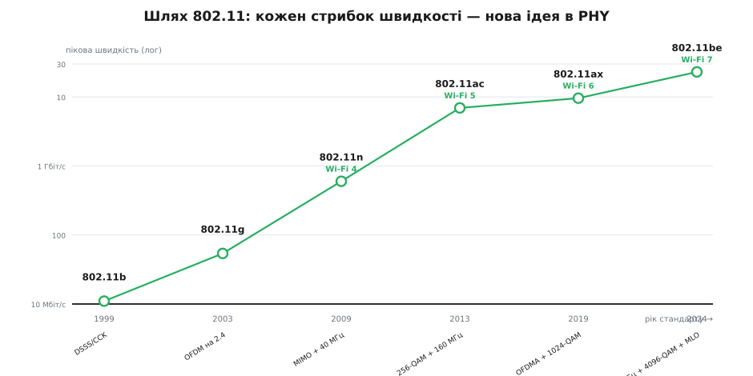
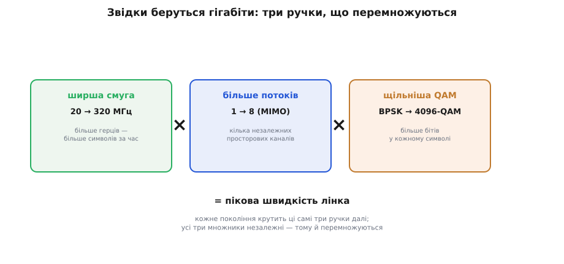
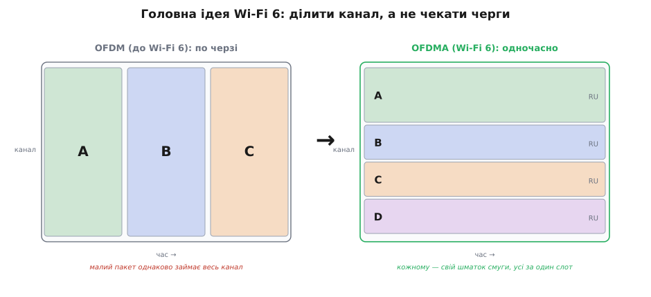

# Стандарти 802.11: від b/g/n до Wi-Fi 7

Ми вже знаємо [Wi-Fi як систему](book:communications/wifi): точка доступу, приєднання, дві адреси, неліцензовані смуги 2.4 і 5 ГГц. Але «Wi-Fi» — це не один протокол, а ціла **родина версій**, що тягнеться від 1999-го дотепер. На коробці роутера написано «Wi-Fi 6» або «802.11ax», у даташиті ESP32 — «802.11 b/g/n», а в магазині тобі пропонують «Wi-Fi 7 зі швидкістю 46 Гбіт/с». Що́ за цими буквами й цифрами стоїть насправді? І, головне для нас, **чому твій модуль підтримує саме b/g/n, а не be** — і що це означає для дальності, швидкості й сумісності твого пристрою?

Розібратися варто не заради колекціонування абревіатур. Кожна нова версія — це **відповідь на конкретну проблему** попередньої, і за всім розмаїттям стоять усього кілька повторюваних ідей. Зрозумівши їх раз, ти читатимеш будь-який рядок «802.11…» як відкриту книгу: одразу бачитимеш, на що здатен чіп, де його межа і чи поговорить він із сусіднім роутером.

### Один стандарт, багато поправок

Спершу — звідки взялася сама нумерація. Є базовий документ організації IEEE під номером **802.11** (це родина «802» — дротові й бездротові локальні мережі; «.11» — гілка бездротових). Сам по собі він застарів ще наприкінці 90-х. Далі його не переписували щоразу заново, а **доповнювали поправками** (*amendment*), і кожній давали літерний суфікс: 802.11**a**, 802.11**b**, 802.11**g**, далі двобуквені **n**, **ac**, **ax**, **be**. Літери йдуть приблизно за абеткою в порядку появи — тому за самим суфіксом уже видно, що новіше: `ax` молодше за `ac`, а `be` — наймолодше.

Літерні коди зручні інженерам, але незрозумілі покупцеві: що швидше — `ac` чи `ax`? Тому з 2018 року маркетингова організація Wi-Fi Alliance дала свіжим поколінням **прості номери**: 802.11n стало **Wi-Fi 4**, ac — **Wi-Fi 5**, ax — **Wi-Fi 6**, be — **Wi-Fi 7**. Два імені на ту саму річ — інженерне (802.11ax) і споживче (Wi-Fi 6) — відтоді живуть паралельно. Старі a/b/g номерів заднім числом не отримали; історію цього перейменування й давню ринкову плутанину «a проти b» розбираємо [окремо](root:embedded/802-11-versions/hist-wifi-generations.md).

> 📛 **Звідки взялися два імені.** Літерні суфікси (a/b/g/n/ac/ax/be) — це коди поправок IEEE, що йдуть за абеткою появи. Споживчі номери (Wi-Fi 4/5/6/7) запровадив Wi-Fi Alliance 2018 року, щоб покупець не мусив пам'ятати, що `ax` новіше за `ac`. Нумерувати почали лише з n (=Wi-Fi 4); старіші a/b/g лишилися без номера. Глибше — у [короткій історії поколінь](root:embedded/802-11-versions/hist-wifi-generations.md).

*Пікова швидкість лінка (логарифмічна шкала) від 802.11b до Wi-Fi 7. За двадцять п'ять років вона зросла з 11 Мбіт/с до десятків Гбіт/с. Поряд із кожним вузлом — ідея, що дала стрибок: OFDM, MIMO, ширші канали, OFDMA, MLO. Жоден стрибок не випадковий — щоразу додавали новий важіль.*

### Три ручки, що крутять усі версії

Перш ніж іти по версіях, варто побачити **спільну механіку**. Здається, ніби кожне покоління — це окремий клубок нових трюків. Насправді майже вся гонитва за швидкістю зводиться до **трьох незалежних важелів**, і кожна версія просто крутить їх трохи далі.

Перший важіль — **ширина каналу**. Дані несе шматок спектра; що він ширший, то більше символів за секунду в нього влізе. Wi-Fi почав із 20 МГц на канал, а Wi-Fi 7 дозволяє аж **320 МГц** — у шістнадцять разів ширше. Прямо пропорційно росте й швидкість.

Другий важіль — **число просторових потоків** (*spatial streams*), тобто **MIMO** (*multiple-input multiple-output*). Якщо поставити кілька антен з обох боків, у тому самому каналі можна гнати **кілька незалежних потоків даних одночасно** — кожен «їде» своїм просторовим шляхом, і приймач їх розплутує. Дві антени — приблизно вдвічі швидше, чотири — вчетверо. Це не магія, а використання того, що в кімнаті сигнал приходить багатьма шляхами: те, що для одного потоку є завадою-багатопроменевістю, для MIMO стає **корисним додатковим каналом**.

> 📡 **MIMO коротко.** Кілька антен на передавачі й приймачі дають змогу слати в одному частотному каналі кілька незалежних потоків даних разом. Приймач розрізняє їх тому, що кожен потік приходить своєю комбінацією відбиттів — своїм «просторовим підписом». Пікова швидкість множиться приблизно на число потоків. Та сама [багатопроменевість](book:communications/multipath-fading), що завмиранням псує одну антену, тут стає ресурсом. Wi-Fi 4 дозволив до 4 потоків, Wi-Fi 5 і пізніші — до 8.

Третій важіль — **щільність модуляції**, тобто скільки бітів несе один символ ([сузір'я QAM](book:communications/fsk-psk)). Проста модуляція кладе 1–2 біти на символ; щільна **256-QAM** — вісім, **1024-QAM** — десять, **4096-QAM** Wi-Fi 7 — дванадцять. Що щільніше «сузір'я», то більше даних у тому самому символі — але й точки в ньому тісніші, тож потрібен чистіший канал (вищий сигнал/шум). Тому щільну модуляцію реально ввімкнути лише зблизька й за доброго прийому.

*Пікова швидкість лінка — це добуток трьох незалежних множників: скільки герців у каналі, скільки просторових потоків MIMO і скільки бітів у символі QAM. Кожне нове покоління 802.11 крутить ці самі три ручки далі. Оскільки важелі незалежні, їхній виграш перемножується — звідси й вибуховий ріст цифр.*

> 🔧 **Навіщо це.** Ці три ручки — твоя «формула здорового глузду» для будь-якого Wi-Fi-чіпа. Побачив у даташиті «1×1, 20 МГц, до 64-QAM» (типовий ESP32) — одразу знаєш стелю: один потік, вузький канал, помірна модуляція, тобто десятки Мбіт/с, не гігабіти. І навпаки: коли роутер обіцяє «9.6 Гбіт/с», ти бачиш, що це 8 потоків × 160 МГц × 1024-QAM **разом** — число, якого жоден реальний телефон поряд не дасть. Формула одразу відділяє фізику від маркетингу.

Тепер пройдімо версії — і дивімося, який важіль кожна додала.

### b і g: повільний старт у тісній смузі 2.4 ГГц

Перша масова версія — **802.11b** (1999). Вона працювала лише на 2.4 ГГц, несла до **11 Мбіт/с** і користувалася не OFDM, а простішим [розширенням спектра прямою послідовністю (DSSS) з кодуванням CCK](root:embedded/jamming-fhss). Жодного MIMO, вузький канал, скромна модуляція — усі три ручки на мінімумі. Цього вистачало для тодішнього інтернету, і саме `b` зробила Wi-Fi масовим.

Цікавий момент: одночасно з `b` вийшла **802.11a** — швидша (54 Мбіт/с) і вже на OFDM, але на 5 ГГц. Здавалося б, краща в усьому — а ринок обрав повільнішу `b`. Чому? Бо 5 ГГц гірше проходить крізь стіни (коротша [довжина хвилі](book:communications/free-space-loss)), обладнання було дорожче, а 2.4 ГГц «добивав» далі за ті самі гроші. Так уперше проявилося правило, що супроводжує Wi-Fi досі: **нижча частота — більша дальність, вища — більша швидкість**, і ринок довго голосував за дальність.

**802.11g** (2003) розв'язала цю суперечку елегантно: вона взяла **OFDM від `a`** (звідси ті самі 54 Мбіт/с) і **повернула його в дальню смугу 2.4 ГГц**. Покоління отримало і пристойну швидкість, і добру дальність, до того ж лишилося сумісним зі старими `b`-пристроями. Ручку модуляції підкрутили (OFDM замість CCK), решта дві ще спали. Саме `g` стала «дефолтним Wi-Fi» на роки — і саме її разом із наступницею `n` ти бачиш у скромних модулях на кшталт ESP32.

> 🌀 **Що таке OFDM (нагадування).** Замість однієї несучої дані діляться на сотню вузьких піднесучих, що йдуть паралельно. Кожна повільна й вузька, тому стійка до [багатопроменевих відбиттів](book:communications/multipath-fading), які в місті розмивають швидкий одиночний сигнал. OFDM — фундамент усіх версій від `a`/`g` і донині; кожне нове покоління лише надбудовує над ним нові важелі. Деталі — у темі [модуляції](book:communications/why-modulation).

### n (Wi-Fi 4): прихід MIMO

**802.11n** (2009), він же **Wi-Fi 4**, — перший по-справжньому великий стрибок, бо вперше **смикнув одразу дві сонні ручки**. По-перше, він приніс **MIMO**: до чотирьох просторових потоків замість одного — і швидкість одразу зросла в кілька разів. По-друге, дозволив **склеювати два сусідні канали** в один удвічі ширший (40 МГц замість 20). Дві антени в каналі 40 МГц з модуляцією 64-QAM — і пікова швидкість підскочила до **600 Мбіт/с**, у понад десять разів проти `g`.

Не менш важливо, що `n` працює в **обох смугах** — і 2.4, і 5 ГГц. Це дало пристрою вибір: дальня тісна смуга чи швидша вільніша. Саме `n` остаточно зробила Wi-Fi придатним для відео й важкого трафіку. Для нас вона ще й найвища версія, яку розуміє базовий ESP32: рядок «802.11 b/g/n» у його даташиті означає рівно це — старі b/g для сумісності плюс MIMO-здатний n як стеля (щоправда, сам ESP32 використовує один потік, тож його реальна стеля — десятки Мбіт/с, а не 600).

### ac (Wi-Fi 5): ширші канали і перший багатокористувацький режим

**802.11ac** (2013), **Wi-Fi 5**, пішов углиб по всіх трьох важелях, але зосередився на **5 ГГц** (на 2.4 його просто немає). Канали стали ще ширші — до **80 і навіть 160 МГц**; потоків — до **восьми**; модуляцію ущільнили до **256-QAM** (вісім бітів на символ). Усе разом підняло пікову швидкість за межу гігабіта — теоретично майже **7 Гбіт/с**.

Але головна **ідейна** новинка `ac` була не в цих числах, а в **багатокористувацькому MIMO** (*MU-MIMO*, *multi-user MIMO*). Доти антенні потоки годували **одного** клієнта за раз. `ac` навчив точку доступу **формувати промені** й слати різні потоки **різним пристроям одночасно** — наче роздавати кілька незалежних розмов у різні кутки кімнати. Поки що лише «вниз», від точки до клієнтів (*downlink*), і лише на 5 ГГц — але це був перший крок від «швидше одному» до «ефективніше багатьом». Саме цей зсув акценту й розквітне у Wi-Fi 6.

### ax (Wi-Fi 6): не швидше, а ефективніше

Тут історія Wi-Fi робить різкий **поворот**. До `ac` кожне покоління змагалося за один показник — **пікову швидкість одного лінка**. Але в реального дому й офісу проблема вже була інша: не «мій ноутбук качає замало», а «**тридцять пристроїв** у квартирі — телефони, лампочки, колонки, годинники — і всі штовхаються в ефірі». Один швидкий лінк тут не рятує; рятує вміння **обслужити багатьох одночасно й охайно**. Саме на це й заточили **802.11ax** (2019), він же **Wi-Fi 6**.

Звісно, ручки покрутили теж: модуляція доросла до **1024-QAM** (десять бітів на символ), MIMO лишилося до восьми потоків, а пікова швидкість піднялася до **9.6 Гбіт/с**. Але це вже не суть покоління. Суть — кілька прийомів **ефективності**.

Головний із них — **OFDMA** (*orthogonal frequency-division multiple access*). Згадаймо: у звичайному OFDM **весь канал** дістається одному пакету за раз; навіть крихітне повідомлення розумної лампочки займає всю смугу, а решта чекає черги. OFDMA нарізає канал на дрібні **ресурсні блоки** (*resource unit*, RU) і роздає різні блоки **різним пристроям в одному часовому слоті**. Малому трафіку — малий блок, великому — великий, і всі обслужені разом. Це той самий крок від «по черзі» до «паралельно», що його MU-MIMO зробив у просторі, — тільки тепер **у частоті**.

*Зліва — OFDM до Wi-Fi 6: пристрої A, B, C ідуть по черзі, кожен на мить забирає весь канал, навіть під дрібний пакет. Справа — OFDMA: той самий канал у той самий слот поділено на ресурсні блоки, і A, B, C, D обслужені водночас, кожен своїм шматком смуги. У людному ефірі це різко скорочує чекання й накладні витрати.*

Поряд із OFDMA Wi-Fi 6 додав ще кілька важливих для нас речей. **MU-MIMO тепер працює в обидва боки** — не лише «вниз», а й «вгору» (*uplink*), тож кілька клієнтів можуть слати точці одночасно. **BSS coloring** (фарбування мереж) позначає кожну мережу «кольором»-міткою, щоб пристрій відрізняв свій трафік від сусідського й не замовкав даремно, почувши чужу передачу, — у багатоквартирному будинку це помітно піднімає пропускну здатність. А **Target Wake Time** (TWT, призначений час пробудження) дає точці й пристрою **домовитися про розклад**: коли саме пристроєві вийти в ефір, а решту часу — спати з вимкненим радіо.

> 🔋 **TWT — чому це важливо для embedded.** Радіо — найбільший пожирач струму в бездротовому пристрої на батарейках. У старому Wi-Fi клієнт мусив раз у раз будити приймач, аби не проґавити трафік. TWT дозволяє домовитися: «буди мене раз на 30 секунд на 5 мілісекунд» — і решту часу радіо повністю спить. Для давача чи розумного вимикача на 2.4-ГГц Wi-Fi 6 це різниця між тижнем і роком життя від однієї батарейки. Тому свіжі чіпи на кшталт ESP32-C6 вже підтримують Wi-Fi 6 саме заради TWT, а не заради гігабітів. Логіка енергоощадного радіо — це той самий [бюджет споживання, що ми рахували для лінка](root:embedded/link-budget), лише з боку струму.

Окремо варто назвати **Wi-Fi 6E** — це не нова поправка, а **розширення** (*extension*) Wi-Fi 6 на цілком **нову смугу 6 ГГц**. Сенс простий: 2.4 і 5 ГГц за чверть століття стали тісні й засмічені, а свіжа смуга 6 ГГц — широка й майже порожня, бо в ній поки що лише новітні пристрої. Та сама технологія `ax`, але в чистому ефірі, де є де розгорнути широкі канали без штовханини.

### be (Wi-Fi 7): межа всіх трьох важелів

Найновіше покоління — **802.11be** (2024), **Wi-Fi 7**, офіційно зване *Extremely High Throughput*, «надзвичайно висока пропускна здатність». Воно докручує всі три ручки до краю можливого: канали до **320 МГц** (удвічі ширші за Wi-Fi 6, можливі лише в просторій смузі 6 ГГц), модуляція до **4096-QAM** (дванадцять бітів на символ), MIMO до восьми потоків. Звідси й приголомшливі числа — теоретична стеля близько **23 Гбіт/с** у звичайних конфігураціях і навіть до 46 Гбіт/с у граничних лабораторних.

Але справді нова ідея Wi-Fi 7 — інша, і вона цікавіша за чергові гігабіти. Це **робота на кількох смугах одночасно** (*multi-link operation*, MLO). Доти пристрій сидів в одній смузі за раз: або 2.4, або 5, або 6 ГГц. MLO дозволяє **тримати кілька з'єднань у різних смугах разом** і користуватися ними як одним каналом. Це дає дві різні переваги, залежно від задачі: можна **скласти смуги** заради ще більшої швидкості, а можна **дублювати** той самий трафік двома смугами заради **надійності й малої затримки** — якщо в одній смузі завмирання чи завада, дані прийдуть іншою. Для відеодзвінків, ігор і керування в реальному часі важлива саме друга грань: не пікова цифра, а те, що зв'язок **не моргає**.

> 🔧 **Навіщо це.** Wi-Fi 7 — гарна ілюстрація, що «новіше» не завжди означає «потрібніше тобі». Якщо твій пристрій — давач чи контролер, йому ні до чого 23 Гбіт/с; йому важливі дальність, енергоощадність і сумісність із наявним роутером — а це чудово дає Wi-Fi 4 чи 6 на 2.4 ГГц. MLO й 320-МГц канали світять там, де треба гнати важке відео без затримок: AR/VR, ігри, бездротовий монітор. Обирай покоління **за задачею**, а не за номером на коробці: зайвий стандарт — це зайва ціна й споживання без зиску.

### Сумісність: чому старе й нове все одно говорять

Залишається питання, без якого картина неповна: якщо версій стільки, як вони **уживаються**? Адже до твого роутера Wi-Fi 6 під'єднуються і новий ноутбук, і стара лампочка на `g`.

Рятує **зворотна сумісність** (*backward compatibility*) — наскрізне правило родини 802.11. Кожна нова версія **зберігає вміння старих**: роутер Wi-Fi 7 розуміє і `be`, і `ax`, і `n`, аж до старезної `b`. Коли підключається пристрій, вони **домовляються про найкращий спільний режим** — найвищий, який підтримують обидва. Новий телефон і новий роутер увімкнуть Wi-Fi 7 на повну; та сама точка зі старою лампочкою спокійно перейде на `g`. Тому твій ESP32 з його «b/g/n» **під'єднається до будь-якого сучасного роутера** — просто на спільному знаменнику, тобто на `n`, без жодних гігабітних розкошів старшого стандарту.

Ось чому в даташиті чіпа перелік версій (як «802.11 b/g/n») читається тепер прозоро: це не довільний набір, а **сходинки сумісності** — найстаріша задля універсальності й найновіша задля стелі швидкості. Уся еволюція 802.11 — це історія про те, як до незмінного фундаменту OFDM крок за кроком докручували ті самі три ручки, а коли впиралися в їхню межу — додавали нову ідею ефективності: спершу багатокористувацький режим, потім поділ каналу, потім роботу на кількох смугах. Знаючи цей кістяк, ти більше не загубишся в літерах і номерах — і завжди зможеш сказати, на що здатен конкретний Wi-Fi-чіп і чи годиться він саме для твого пристрою.
