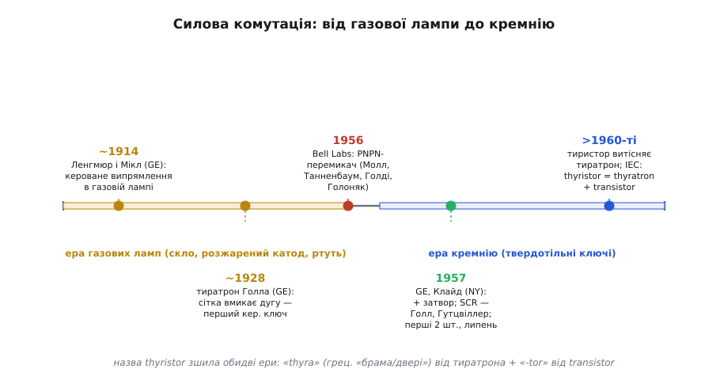
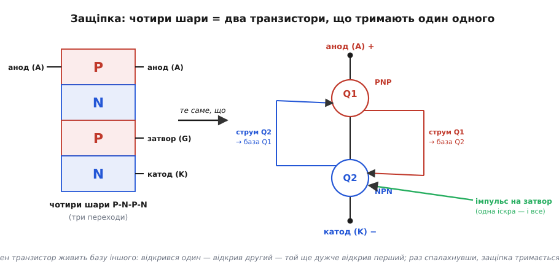

# 📜 Від тиратрона до тиристора: як одна іскра приручила силу

> Ця історія — про ключі, що вмикають не світлодіод і не моторчик, а кіловати: лампи, нагрівачі, насоси, цілі цехи. Звичайні транзистори — і [біполярний як ключ](topic:electronics/bjt-switch), і [польовий силовий](topic:electronics/mosfet-power-switch) — на таку роль у мережі [не годяться](root:embedded/ac-switch-need), тож знадобився прилад іншої породи — **тиристор**. Та перш ніж він став кремнієвим, силу майже сорок років комутувала розжарена скляна лампа з ртутною парою всередині. І, як це майже завжди в електроніці, теперішній маленький чорний компонент із трьома ніжками — не винахід однієї людини в одну мить, а естафета: від фізиків газового розряду через теоретиків Bell Labs до інженерів General Electric, які за тисячу доларів і три літні місяці 1957 року відкрили еру силової електроніки.
>
> Це історія про те, як **назву** нового приладу склали з двох старих слів — і чому в цій назві захована вся його родовідна.


*Дорога була не стрибком, а естафетою через дві технологічні ери. Спершу силу комутувала газова лампа (тиратрон Голла, GE, ~1928), де керуюча сітка підпалювала дугу; потім Bell Labs описала твердотільний PNPN-перемикач (1956), а GE додала йому третій вивід-затвор і випустила кремнієвий ключ — SCR (1957). Сама назва «thyristor» зшила обидві ери: «thyra» — від газового тиратрона, «-tor» — від transistor.*

---

## Чому проста лампочка не вмикається сама

Почнімо з проблеми, заради якої все це затівалося, бо без неї історія розсипається на дати. Уявімо найпростіше завдання: вимкнути й увімкнути лампу або нагрівач, що живиться від мережі. Здавалося б, є вимикач — і годі. Але механічний контакт має прикрі вади: він **іскрить** щоразу, як розмикає струм (та сама [іскра, що вистрілює котушка](topic:electronics/inductor-kickback) при розмиканні), його контакти підгоряють, він **повільний** і не вміє вмикатися тисячу разів на секунду, а головне — ним не покерувати слабким електричним сигналом здалеку, без міцної руки чи громіздкого реле.

Потрібен був **електрично керований ключ для великого струму**: щоб маленький сигнал умикав велику потужність, щоб робив це без рухомих контактів і щоб витримував сотні вольт мережі. Перша відповідь на цей запит прийшла задовго до напівпровідників — і була вона скляною, гарячою та світилася блакитним.

## Тиратрон: розжарена лампа, яку відмикала сітка

На зорі XX століття силу вже вміли випрямляти газовими приладами. У General Electric **Ірвінг Ленгмюр** (*Irving Langmuir*) і **Дж. С. Мікл** (*G. S. Meikle*) ще близько 1914 року взялися вивчати, як керувати випрямленням у газонаповненій лампі — їх часто й називають першими, хто на це поглянув системно. Сам прилад дозрів пізніше, у руках іншого фізика GE — **Альберта Голла** (*Albert W. Hull*). У середині 1920-х Голл узяв газову (ртутну чи інертну) лампу й додав до неї **керуючу сітку** (*grid*), як у радіоламп. Так народився **тиратрон** (*thyratron*); перші комерційні зразки GE з'явилися приблизно **1928 року**.

Працював тиратрон на ефекті, від якого й піде вся наша розповідь, — на **защіпуванні**. Поки на сітку подано замикаючу напругу, газ не пробитий, струму нема. Та варто сітці на мить «дозволити» — і в газі спалахує дуга, лампа різко відмикається й проводить великий струм. А далі — найцікавіше: **сітка більше нічим не керує**. Дуга, раз запалена, живе сама, і загасити її сіткою вже неможливо; щоб вимкнути тиратрон, треба прибрати або обнулити сам струм через нього. Один короткий імпульс відмикає прилад — і той «защіпується» у ввімкненому стані. Запам'ятаймо цю поведінку: за тридцять років вона дослівно повториться в кремнії.

Походження самого слова варто знати, бо воно — ключ до всієї історії. **Thyratron** склали з грецького **θύρα** (*thyra*) — «двері», «брама», «ворота» — і закінчення **-tron**, тим самим, що й у назвах інших ламп тієї доби (магнетрон, клістрон). Виходила «лампа-брама»: пристрій, що відчиняє й зачиняє дорогу великому струмові. Назва описувала суть — кероване відмикання — і саме від неї за десятиліття народиться ім'я твердотільного нащадка.

Тиратрони чесно відпрацювали свою епоху. Ними керували електродвигунами, регулювали зварювальні апарати, живили перші телетайпи й радіопередавачі — усюди, де треба було вмикати чималу потужність електричним сигналом. Найважливіше, що вони вміли вже тоді: **фазове керування**. Запускаючи дугу не на початку півперіоду, а трохи згодом — скажімо, посеред синусоїди, — тиратрон пропускав у навантаження лише хвіст кожної півхвилі, і так плавно регулював середню потужність на лампі чи в моторі. Та сама ідея (тільки кремнієвими ключами) живе сьогодні у [фазовому регуляторі-димері](topic:electronics/phase-control-dimmer) — і коріння її саме тут, у газовій лампі 1930-х.

Та вади скляної лампи нікуди не дівалися. Вона **гріла катод**: на саме розжарення нитки, що постачала електрони, постійно йшла енергія — лампа марнувала ват ще до того, як щось увімкнула. Вона була **крихкою** й **громіздкою**, недовговічною, «прокидалася» не миттєво, а ще й мала помітне падіння напруги на дузі (десяток-другий вольт), що на великих струмах оберталося неабияким теплом. На керовану дугу в склі чекала та сама доля, що спіткала радіолампи з [приходом транзистора](topic:electronics/transistor-idea): її мав замінити холодний, маленький і довговічний шматочок кремнію, який не треба розжарювати.

## PNPN: чотири шари, що тримають самі себе (Bell Labs, 1956)

Поки інженери крутили тиратрони, у Bell Labs наприкінці 1940-х і в 1950-х творили твердотільну революцію — саме там 1947 року винайшли [транзистор](topic:electronics/transistor-idea). І саме там визріла структура, що стане серцем тиристора.

Ідею **чотиришарового приладу** P-N-P-N подав **Вільям Шоклі** (*William Shockley*) — той самий, чия теорія [PN-переходу](topic:physics/pn-junction) лежить в основі всіх напівпровідникових приладів. Шоклі мріяв про твердотільний прилад, що сам «защіпується», — електронний відповідник тиратронного реле для телефонних станцій; цю двовивідну чотиришарову структуру донині звуть **діодом Шоклі** (*Shockley diode*).

Та від ідеї до зрозумілого, описаного приладу довів справу не сам Шоклі, а команда колег. У вересні **1956 року** в *Proceedings of the IRE* вийшла стаття «**P-N-P-N Transistor Switches**» — і під нею стояли імена **Джона Молла** (*John Moll*), **Морріса Танненбаума** (*Morris Tanenbaum*), **Джеймса Голді** (*James Goldey*) і **Ніка Голоняка** (*Nick Holonyak*). Саме вони пояснили, **чому** чотиришаровий бутерброд поводиться як защіпка, і показали, як його робити. (Той-таки Голоняк за кілька років збудує перший видимий [світлодіод](topic:electronics/led-photodiode).)


*Уся фізика приладу — в одній картинці. Чотири шари P-N-P-N (ліворуч) подумки розрізають по діагоналі на два транзистори: верхній PNP (Q1) і нижній NPN (Q2). Колектор кожного живить базу іншого — це додатний зворотний зв'язок. Один імпульс на затвор відмикає Q2, той відмикає Q1, а Q1 ще дужче відмикає Q2: защіпка спалахує й тримається сама, доки тече струм.*

Інтуїцію тут можна вхопити без жодної формули, і вона прекрасна. Чотири шари P-N-P-N подумки розрізають навскіс на **два звичайні транзистори**: верхній PNP і нижній NPN, причому вони **переплетені** — колектор одного є базою другого, і навпаки. Це і є рецепт защіпки. Дай маленький імпульс у базу нижнього транзистора — він відімкнеться й потягне струм через базу верхнього; той відімкнеться й своїм струмом ще дужче відімкне нижній. Виходить **лавина додатного зворотного зв'язку**: кожен транзистор підганяє іншого, доки обидва не розчахнуться навстіж. А коли обидва відкриті, їм уже **не потрібен** жоден сигнал на затворі — вони тримають один одного самі. Точнісінько як дуга в тиратроні: одна іскра відмикає, і ключ защіпується. Вимкнути його можна лише одним способом — обнулити струм, що тече крізь нього.

І ось де дрімала тиха магія для мережі змінного струму: у розетці струм **сам** проходить через нуль сто разів на секунду (двополярна [синусоїда](topic:physics/sine-wave)). Тобто защіпка, відімкнувшись від короткого імпульсу, сама й погасне наприкінці кожного півперіоду — без жодної додаткової схеми вимикання. Кремнієвий прилад на цій структурі ідеально пасував саме мережі. Лишалося його зробити.

## General Electric, Клайд, 1957: третій вивід і тисяча доларів

Коли восени 1956-го Bell Labs опублікувала роботу про PNPN-перемикач, її прочитали уважно — зокрема група силових інженерів General Electric у містечку **Клайд, штат Нью-Йорк** (*Clyde, NY*). Очолював її **Гордон Голл** (*Gordon Hall*). Ці люди роками шукали саме такий прилад — твердотільну заміну тиратрона — і миттю впізнали в публікації Bell Labs те, що шукали.

Командна робота тут варта окремого слова, бо легенда любить спрощувати «винайшов один». GE не просто повторила діод Шоклі — вона зробила те, що перетворило лабораторну цікавинку на керований ключ: **додала третій вивід**. До анода й катода чотиришарової структури підвели окремий керуючий контакт — **затвор** (*gate*), — крізь який короткий імпульс і запускав защіпку точно в потрібну мить кожного періоду мережі. Це й була родзинка: не просто «вмикається сам», а «вмикається тоді, коли накажеш».

За переказами про ті події (їх зберіг IEEE як віху «**SCR/Thyristor, 1957**»), уся розробка трималася на смішному бюджеті — близько **тисячі доларів**, які виділив керівник на ім'я **Рей Йорк** (*Ray York*); а **перші два робочі прилади** зійшли зі столу в **липні 1957 року**. Дорогою інженери набили й кілька важливих, характерних для напівпровідників синців. По-перше, з'ясувалося, що матеріал має бути **кремній**, а не германій (та сама перемога [«піску»](topic:physics/semiconductor)): германій надто «плив» від нагріву, а в силовому приладі, який сам грітиметься, це вирок. По-друге, прилад спершу страждав на **хибні запуски** — защіпувався сам від нагріву чи від різкого стрибка напруги, без жодного імпульсу на затворі; це та сама проблема [dv/dt і паразитного відмикання](topic:electronics/snubbers-dvdt), що дожила й до сучасних симісторів. Тут спрацьовує інтуїція з малюнка вище: защіпку запускає будь-що, що дасть пусковий струм у базу внутрішнього транзистора, — а швидкий стрибок напруги протікає крізь паразитні ємності переходів і теж виглядає для приладу як такий струм. Боротьба з мимовільним защіпуванням — підбір домішок, геометрії, додаткові «стоки» для паразитного струму — і зробила прилад придатним для життя в брудній мережі, де стрибків напруги вистачає.

Комерціалізацію й застосування потягнув далі **Френк В. «Білл» Гутцвіллер** (*Frank W. «Bill» Gutzwiller*): він багато зробив, щоб SCR не лишився лабораторним зразком, а перетворився на сімейство серійних приладів із зрозумілими інженерові правилами застосування — як його запускати, як гасити, як захищати. Саме завдяки цій роботі тиристор за кілька років розійшовся приводами, регуляторами й випрямлячами по всій промисловості.

Промислове ім'я приладу дала сама GE: **SCR** — *silicon controlled rectifier*, «кремнієвий керований випрямляч». Спочатку «SCR» було **торговою назвою** General Electric на її версію приладу — так само, як «[Supercapacitor](topic:electronics/supercapacitor)» колись був маркою NEC, а «[HEXFET](topic:electronics/rds-on)» — маркою International Rectifier. А **узагальнену**, незалежну від виробника назву для всього класу таких приладів пізніше закріпила Міжнародна електротехнічна комісія (IEC) — і це слово ми вживаємо донині: **тиристор** (*thyristor*).

## Слово, у якому захована вся історія

Ось де сходяться всі нитки нашої розповіді. Назву **thyristor** склали з двох слів:

```
thyristor  =  thyra  +  (transi)stor
              від «тиратрон»   від «транзистор»
              (грец. θύρα —    (твердотільний
               «брама/двері»)   прилад)
```

Тобто в самому імені приладу зашита його **родовідна**: «брама» — від газового тиратрона, чию поведінку защіпки він успадкував, і «-тор» — від транзистора, бо зроблений він твердотільно, з тих самих PN-переходів. Тиристор — це буквально «транзисторний тиратрон»: керована брама для струму, але вже без розжареного скла, без ртуті й без крихкої лампи. Уся ця історія — від Голлового тиратрона ~1928 року до Голлового ж (іншого Голла!) кремнієвого SCR 1957-го — запакована в одне слово, яке інженер бачить у даташиті щодня.

Збіг прізвищ, до речі, чистий і кумедний: газову лампу-тиратрон довів до пуття **Альберт Голл** у GE 1920-х, а кремнієвий тиристор — група **Гордона Голла** в тій самій GE 1950-х. Двоє різних Голлів, одна компанія, одна ідея керованої брами — тільки матеріал змінився зі скла на кремній.

## Чому з цього виросла ціла галузь

З цього маленького приладу 1957 року виросла ціла **силова електроніка** — галузь, що керує великими потоками енергії напівпровідниками. Уже до 1960-х тиристори почали витісняти тиратрони звідусіль: з приводів двигунів, регуляторів освітлення, зарядних пристроїв, систем живлення. Та сама поведінка защіпки, що описана вище, лежить в основі цілої родини силових ключів: [**симістор**](topic:electronics/triac) — це, по суті, два зустрічні тиристори в одному корпусі для обох півхвиль; [**фазове керування димера**](topic:electronics/phase-control-dimmer) — це гра з тим, у яку мить кожного півперіоду подати імпульс на затвор; [**твердотільне реле**](topic:electronics/solid-state-relay) ховає всередині оптично запущений симістор; а проблеми [хибних запусків і dv/dt](topic:electronics/snubbers-dvdt) — це прямі нащадки тих самих синців, що їх набили в Клайді 1957-го.

І головний урок — той самий, що й у решти історій електроніки. Тиристор не «винайшла одна людина». Його зліпили з ідей кількох поколінь: фізики газового розряду (Ленгмюр, Голл) дали саму поведінку керованої защіпки; теоретики Bell Labs (Шоклі, а далі Молл, Танненбаум, Голді, Голоняк) пояснили, як зробити її твердотільною; інженери General Electric (Гордон Голл, Рей Йорк, Френк «Білл» Гутцвіллер) додали третій вивід, перемогли хибні запуски й випустили прилад у світ. Кожен крок був потрібен, жоден не був достатній — і вся ця колективна праця згорнулася в один маленький компонент, що відчиняє й зачиняє браму силі від одного-єдиного імпульсу.
