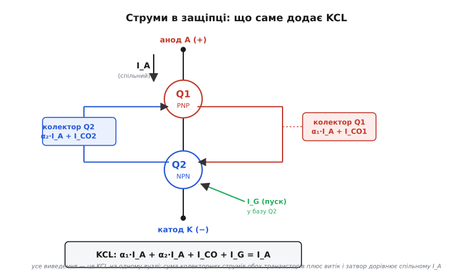
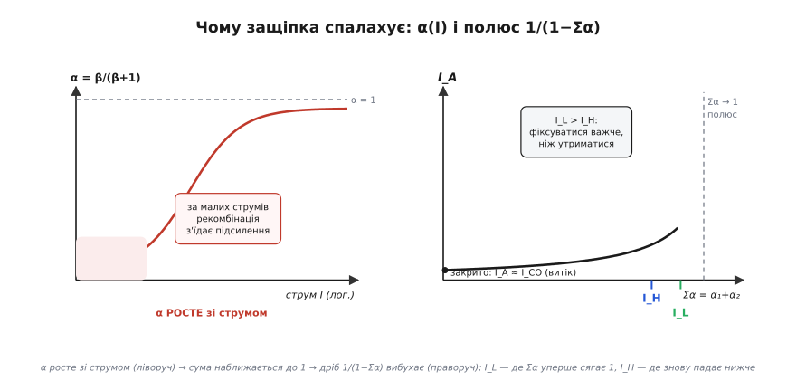

# 🧮 Механіка защіпки, порахована до кінця

У детальному кроці ми записали серцевину тиристора однією дробом — I_A = I_CO/(1 − (α₁ + α₂)) — і сказали, що повне виведення чекає тут. Ось воно. Але це не «те саме, лише з проміжними рядками». Дріб — це тільки двері; за ними ховаються три речі, яких у формулі не видно, а вони й вирішують долю ключа в реальному колі:

- **звідки** в тому знаменнику взявся саме додаток α₁ + α₂, а не добуток чи щось інше — і чому це складання двох транзисторів, а не один прилад;
- **чому** α росте зі струмом — бо без цієї залежності защіпка ніколи б не спалахнула, і вся її поведінка (латч-струм, холд-струм, зрив на індуктивності) випливає саме з форми кривої α(I);
- **як** та сама дріб керує паразитним відмиканням: швидкий стрибок напруги dV/dt і надто крутий фронт струму di/dt діють на неї з двох різних боків, і сплутати їх — типова й дорога помилка.

Ця вставка — про **число за фізикою защіпки**. Якісну картину (чотири шари = два переплетені транзистори, «спалахнув і тримається сам») ми вже маємо; тут — апарат, яким її рахують, і три місця, де він тихо каже більше, ніж наївна інтуїція.

## Відправна точка: транзистор у спільній базі й струм витоку

Усе виведення стоїть на одному означенні біполярного транзистора, і варто записати його чесно, бо саме звідти виросте вся дріб. Для транзистора в схемі зі **спільною базою** *(common-base)* колекторний струм пов'язаний з емітерним не через знайоме β, а через коефіцієнт передачі струму емітера α:

```
I_C = α · I_E + I_CBO
```

Тут два доданки, і кожен нам знадобиться окремо. Перший, α·I_E, — це та частка емітерного струму, що **дійшла** до колектора: не всі носії, впорснуті емітером, доживають до колектора, частина рекомбінує дорогою в базі. Тому α трохи менше одиниці; його зв'язок зі знайомим коефіцієнтом підсилення в спільному емітері прямий:

```
α = β / (β + 1)
```

Для β = 100 виходить α = 0.990; для β = 20 — уже α = 0.952; для β = 2 — лише α = 0.667. Запам'ятаймо цю таблицю подумки: **мале β → помітно менше за одиницю α**. За мить це стане ключем до всього.

Другий доданок, I_CBO, — це **зворотний струм витоку** колекторного переходу *(collector-base leakage, при розімкненому емітері)*: крихітний струм, що тече крізь замкнений у зворотному напрямку перехід сам по собі, без жодного емітерного струму. У звичайному підсилювачі ним нехтують — він мізерний. Але в защіпці саме він грає роль «іскри, що завжди тліє»: це той затравковий струм, з якого лавина може початися. Тому ми його не викидаємо.

> 🔧 **Навіщо це.** Обидва доданки формули спільної бази — не абстракція. α трохи менше одиниці — це причина, чому защіпка взагалі має поріг (якби α = 1 точно й завжди, вона б защіпувалася від найменшого дотику). А I_CBO — це причина, чому тиристор чутливий до **температури**: витік подвоюється приблизно кожні 10 °C, і гарячий прилад защіпується сам, без затвора. Обидві риси прямо ростуть із цих двох доданків.

## Складаємо два транзистори: звідки береться дріб

Тепер — сам прилад. Чотири шари P-N-P-N подумки розрізаємо навскіс на верхній PNP (назвемо його Q1) і нижній NPN (Q2), причому вони **переплетені**: колектор кожного слугує базою іншого. Це не аналогія для краси — це буквальна тотожність структур, і саме вона дозволяє порахувати прилад як пару звичайних транзисторів.

Домовмося про струми. Крізь весь прилад від анода до катода тече спільний **анодний струм I_A**. Ось перший і найважливіший факт бухгалтерії: **емітер кожного з двох транзисторів несе саме цей спільний I_A**. У верхнього PNP емітер — це сам анод, тож I_E1 = I_A. У нижнього NPN емітер — це катод, і весь струм, що виходить із приладу в катод, теж дорівнює I_A, тож I_E2 = I_A. Обидва транзистори «нанизані» на один і той самий наскрізний струм — це і є те, що робить їх защіпкою, а не двома окремими приладами.

Тепер запишімо колекторний струм кожного за нашою формулою спільної бази:

```
I_C1 = α₁ · I_A + I_CBO1        (колектор PNP)
I_C2 = α₂ · I_A + I_CBO2        (колектор NPN)
```


*Усе виведення — це закон струмів Кірхгофа на одному вузлі. Крізь прилад тече спільний анодний струм I_A, він же емітерний для обох транзисторів. Колектор Q1 віддає α₁·I_A + I_CO1, колектор Q2 — α₂·I_A + I_CO2, а затвор може докинути I_G у базу Q2. Сума всіх цих струмів мусить дорівнювати тому самому I_A.*

Лишилося застосувати [закон струмів Кірхгофа](topic:hw-analog/kcl) — суму струмів у вузлі. Подивімося на внутрішній вузол, де сходяться колектор одного транзистора й база іншого. Логіка проста: **весь** струм, що входить у прилад анодом (I_A), мусить кудись піти. А йде він двома колекторними шляхами — крізь колектор Q1 і крізь колектор Q2, бо ці два колекторні струми разом і живлять наскрізний тракт. Прирівняймо:

```
I_A = I_C1 + I_C2
```

Це і є стрижень усього. Підставмо колекторні струми:

```
I_A = (α₁ · I_A + I_CBO1) + (α₂ · I_A + I_CBO2)
```

Тепер — звичайна алгебра, але зробімо її повільно, бо в кожному кроці видно фізику. Позначмо сумарний витік I_CO = I_CBO1 + I_CBO2 (два крихітні струми зливаються в один затравковий). Зберімо всі доданки з I_A ліворуч:

```
I_A = α₁·I_A + α₂·I_A + I_CO
I_A − α₁·I_A − α₂·I_A = I_CO
I_A · (1 − α₁ − α₂) = I_CO
```

Поділивши на дужку, дістаємо ту саму формулу, що стояла в детальному кроці готовою:

```
        I_CO
I_A = ───────────────
       1 − (α₁ + α₂)
```

Ось звідки береться **додавання** α₁ + α₂ у знаменнику, а не щось інше: воно з'явилося тому, що обидва колекторні струми тягнуться з **одного й того самого** I_A й додаються в тому самому вузлі. Сума коефіцієнтів передачі — це «сумарне підсилення петлі», і тепер видно, чому вона стоїть саме там, де стоїть.

### Той самий вивід із затвором — і чому після спалаху затвор зайвий

Ми поки що не додали струм затвора, а він у реальному приладі є — це ним ми запускаємо защіпку. Внесімо його чесно. Затвор тиристора під'єднаний до бази нижнього NPN (Q2), тож струм затвора I_G додається до того, що втікає в цей вузол. Перепишімо KCL на катодному вузлі з урахуванням I_G — тепер сума струмів, що приходять у катод, це два колекторні плюс затворний:

```
I_A = α₁·I_A + I_CBO1 + α₂·I_A + I_CBO2 + I_G
```

Та сама алгебра, лише в чисельнику додається I_G:

```
       I_CO + I_G
I_A = ───────────────
       1 − (α₁ + α₂)
```

Ця повніша формула (її дають усі підручники силової електроніки) розкриває механізм запуску **точно**. Дай на затвор струм I_G — чисельник підскочив, за ним підскочив I_A, а більший I_A підняв обидва α (чому — за мить), знаменник поповз до нуля, і струм **вибухнув**. Ось запуск.

А тепер — найкрасивіше. Коли прилад уже спалахнув, обидва α великі, і сума α₁ + α₂ тримається біля одиниці **сама, за рахунок великого I_A**. Знаменник близький до нуля вже **без** жодного I_G. Тобто затвор можна прибрати — дріб лишиться величезною, прилад лишиться відкритим. Ось математичний доказ того, що ми в детальному кроці стверджували словами: **один короткий імпульс відмикає, далі затвор не потрібен**. І зворотне: раз знаменник тримає себе анодним струмом, жодним сигналом на затворі його вже не «відчинити назад» — вимкнути тиристор затвором **неможливо** в принципі, це видно з формули.

## Чому α росте зі струмом — без цього не було б защіпки

Уся поведінка приладу висить на одному факті, який ми вжили вже двічі, а тепер мусимо довести: **α біполярного транзистора зростає з робочим струмом**. За малих струмів α мале; зі зростанням струму воно підповзає до одиниці. Це не другорядна деталь — це **єдина** причина, чому защіпка має поріг і взагалі вмикається керовано, а не або «завжди відкрита», або «завжди закрита». Розберімо механізм, бо він гарний.

Пригадаймо, що таке α: це частка носіїв, упорснутих емітером, які дожили до колектора. Втрачаються вони на **рекомбінації** — у базі й, головне, у збідненому шарі емітерного переходу. І ось ключ: струм рекомбінації в збідненому шарі й корисний струм інжекції ростуть із напругою на переході **по-різному**.

Запишімо це якісно, але точно. Корисний струм (той, що несе носії крізь базу до колектора) росте з напругою переходу як exp(qV/kT) — повна експонента [PN-переходу](topic:ph-condensed/pn-junction). А паразитний струм рекомбінації в збідненому шарі росте повільніше — приблизно як exp(qV/2kT), із двійкою в показнику. Ця двійка — уся суть. За **малих** напруг (малих струмів) повільніша експонента з двійкою може бути **співмірною** з корисною або й більшою, і рекомбінація з'їдає велику частку інжектованих носіїв — α мале. Зі зростанням струму корисна експонента (без двійки) росте **швидше** й лишає рекомбінацію позаду; частка втрачених носіїв падає, α росте до свого «дорослого» значення.

```
I_корисн  ∝  exp(qV/kT)      ← росте швидше
I_реком   ∝  exp(qV/2kT)     ← росте повільніше (двійка!)

малий струм:  I_реком співмірний з I_корисн  →  багато втрат  →  α мале
великий струм: I_корисн ≫ I_реком            →  мало втрат    →  α → «доросле»
```


*Дві половини одного явища. Ліворуч: коефіцієнт передачі α малий за малих струмів (рекомбінація з'їдає підсилення) і росте до одиниці зі струмом. Праворуч: підставлений у дріб 1/(1 − (α₁+α₂)), цей ріст дає вибух анодного струму, коли сума сягає одиниці. Струм фіксації I_L — де сума вперше доходить до одиниці на підйомі; струм утримання I_H — де вона знову падає нижче на спаді.*

Ось тепер защіпка складається в цілісну картину. За малих струмів (сам лише витік I_CO) α₁ і α₂ малі, їхня сума далеко менша за одиницю, знаменник близький до одиниці — і I_A ≈ I_CO, тобто крихітний витік. Прилад **закритий**. Штовхнімо струм угору імпульсом на затвор — α обох транзисторів підростуть за нашим механізмом, сума посунеться до одиниці, знаменник кинеться до нуля — і струм **вибухне лавинно**. Умова спалаху записується в один рядок:

```
α₁ + α₂ → 1     ⟺  защіпка вмикається (лавинно)
```

Це і є той поріг, заради якого все затівалося. І він існує **лише тому**, що α залежить від струму: якби α було сталим і меншим за ½ завжди — прилад не ввімкнувся б ніколи; якби сталим і близьким до одиниці — увімкнувся б від першого-ліпшого витоку й не вимикався. Керована защіпка можлива саме через **підйом** α(I) від малого до великого.

## Два пороги струму: фіксація й утримання — і чому I_L > I_H

З тієї самої дробі й тієї самої кривої α(I) випливають **два** практичні пороги струму, які плутають найчастіше, а вони різні за фізикою й за величиною. Тепер, маючи апарат, виведемо різницю між ними строго.

**Струм утримання** *(holding current, I_H)* — це найменший анодний струм, за якого вже замкнена защіпка ще тримає себе. Умова утримання — щоб сума α все ще дотягувала до одиниці. Опустімо струм: α обох транзисторів **сповзають** донизу за кривою α(I), сума падає, і в якусь мить вона переходить нижче одиниці — знаменник перестає бути близьким до нуля, додатний зворотний зв'язок розсипається, прилад гасне. I_H — це рівно той струм, на якому

```
α₁(I_H) + α₂(I_H) = 1        (на СПАДІ струму)
```

**Струм фіксації** *(latching current, I_L)* — це найменший анодний струм, якого треба **досягти під час запуску**, щоб защіпка замкнулася сама на себе й затвор став непотрібним. Формально умова та сама — сума α доходить до одиниці, — але тепер ми йдемо по кривій α(I) **знизу вгору**, з боку малих струмів:

```
α₁(I_L) + α₂(I_L) = 1        (на ПІДЙОМІ струму, під час пуску)
```

Здавалося б, умова однакова — чому ж тоді I_L і I_H різні? Ось тонкість, і вона фізична, а не формальна. Крива α(I) — не миттєва: під час **запуску** прилад ще не «розігнався», носії щойно почали заповнювати базові області, і ефективні α на старті **нижчі** за ті, що встановляться в усталеному відкритому стані при тому самому струмі. Іншими словами, на підйомі, щоб дотягти суму до одиниці, потрібен **більший** струм, ніж на спаді вже прогрітого приладу. Тому:

```
I_L  >  I_H     (звичайно у 2–3 рази)
```

Це підтверджують і даташити, і апноути виробників: типове відношення I_L/I_H — від приблизно 2 до 3 (для конкретних приладів буває й менше — скажімо, ~1.7 у BT152, — але як робоче припущення беруть ×2 при 25 °C). Інтуїція за числом проста: **зафіксуватися важче, ніж утриматися**. На старті лавині треба «розгорнутися» проти ще малих α, а вже відкритий прилад тримається легко за рахунок великих α. Обидва пороги — це та сама точка «сума = 1» на кривій 1/(1 − (α₁+α₂)), лише пройдена в різних напрямках і за різних умов розігріву приладу.

> 🔧 **Навіщо це.** Плутанина I_L з I_H — класичне джерело «то вмикається, то ні». Якщо навантаження **мале** (великий послідовний опір, слабкий струм), пусковий струм може перевищити I_H, але не дотягти до I_L: імпульс на затвор є, прилад начебто ввімкнувся — а щойно імпульс зник, згас, бо не встиг зафіксуватися. Лікування пряме: **подовжити імпульс затвора** (щоб струм устиг дорости до I_L, поки затвор ще тримає) або підняти пусковий струм. Для індуктивного навантаження, де струм наростає повільно, довгий чи повторюваний імпульс на затвор — обов'язковий.

### Наслідок для мережі: зрив на індуктивності посеред півперіоду

Тепер видно, чому саме I_H кусає в мережевому колі, — і це прямий наслідок виведеного. У мережі струм сам проходить через нуль щопівперіоду; на резистивному навантаженні струм і напруга йдуть у фазі, тож наприкінці кожної півхвилі струм плавно падає нижче I_H, і защіпка гасне сама — рівно тоді, коли й треба. Це зручно: тиристор не треба вимикати схемою, мережа гасить його даром.

Але для **індуктивного** навантаження (мотор, трансформатор, котушка клапана) струм **відстає** від напруги за фазою. Це означає, що в певні миті струм малий не тому, що напруга близька до нуля, а через зсув фаз — і він може провалитися **нижче I_H посеред півперіоду**, коли напруга ще велика. Наш критерій α₁(I) + α₂(I) = 1 спрацьовує зарано: сума впала нижче одиниці, знаменник ожив, зворотний зв'язок розсипався — защіпка гасне, ключ «відпускає» навантаження раніше, ніж мала б. Керування розсипається, і навіть гірше: одразу після цього передчасного гасіння до приладу різко прикладається велика напруга мережі, і ми потрапляємо в наступну біду — паразитне відмикання від dV/dt, до якого зараз і перейдемо.

## dV/dt: як ємнісний струм відмикає прилад без затвора

Тепер найтонше місце всієї механіки — і те, заради чого тиристору потрібен [снабер](topic:hw-power/snubbers-dvdt). Ми довели, що защіпку запускає **будь-який** струм у базу внутрішнього транзистора, не лише свідомо поданий на затвор. А тепер покажемо, що швидкий стрибок напруги на закритому приладі **сам створює** такий струм — і відмикає тиристор без жодної команди.

Річ у внутрішній будові. Коли на закритий тиристор подано пряму напругу (анод плюс, катод мінус), два зовнішні переходи зміщені прямо, а **середній** перехід (той, що між базами двох транзисторів) — зміщений **зворотно**. А зворотно зміщений перехід — це заряджений збіднений шар, тобто фізично **конденсатор** з деякою ємністю переходу C_j. Не «наче конденсатор» — він і є конденсатор, бо має два шари заряду, розділені збідненою областю.

А тепер згадаймо означення струму крізь конденсатор — те саме, що ми вже вживали для снабера й для котушки, лише тут воно грає проти нас:

```
i = C · dV/dt
```

Струм крізь ємність пропорційний **швидкості зміни** напруги на ній. Якщо напруга на аноді стрибає різко — крутий dV/dt, — то крізь ємність середнього переходу тече відчутний струм заряджання. І ось пастка: цей струм тече **точно туди, куди ми подаємо струм затвора** — у базу внутрішнього транзистора. Для приладу він **нерозрізнимий** від пускового. Механізм защіпки одну від одної не відрізняє: усе, що дає струм у базу, підганяє α до одиниці. Тому достатньо крутого фронту напруги — і тиристор защіпнеться сам:

```
i_C = C_j · dV/dt   ≥   I_G(поріг)     ⟹   прилад відмикається БЕЗ затвора
```

Звідси видно все практичне. По-перше, чутливість до dV/dt — це не дефект окремого приладу, а **неминучий** наслідок того, що середній перехід має ємність, а защіпку запускає струм у базу. По-друге, з формули видно **ліки**: щоб хибний струм i_C не дотяг до порога, треба зменшити або C_j (це робить виробник геометрією приладу), або dV/dt (це робить схемотехнік). Саме друге й робить [RC-снабер](topic:hw-power/snubbers-dvdt): паралельний конденсатор не дає напрузі на приладі стрибати миттєво, розтягує фронт у часі зі сталою τ = R·C — і крутий dV/dt перетворюється на пологий, ємнісний струм падає нижче порога, хибного відмикання нема.

**Умова: оцінити, який dV/dt відімкне тиристор із ємністю переходу C_j = 20 пФ і порогом запуску I_G = 5 мА.**

```
i_C = C_j · dV/dt = I_G(поріг)
dV/dt = I_G / C_j = 0.005 / (20·10⁻¹²) = 0.005 / 2·10⁻¹¹
dV/dt = 2.5·10⁸ В/с = 250 В/мкс
```

Двісті п'ятдесят вольт за мікросекунду — і це для приладу з паспортним порогом. Здається багато? У мережі після передчасного гасіння на індуктивності напруга здатна прикладатися саме з такою крутістю; а вже 50–100 В/мкс — типова паспортна межа реальних симісторів, нижча за наш приклад, бо реальний прилад ще й нагрітий і з залишковим зарядом, тож поріг у нього менший. Ось чому число «dV/dt = кілька десятків В/мкс» стоїть у кожному даташиті мережевого ключа окремим рядком: воно прямо каже, наскільки крутий фронт напруги прилад стерпить, перш ніж защіпнутися сам.

> 🔧 **Навіщо це.** Формула i_C = C_j·dV/dt — це весь снабер в одному рядку. Вона каже, що боротьба з хибним відмиканням — це боротьба зі **швидкістю** наростання напруги, а не з її величиною. Тому снабер ставлять **паралельно** приладу (щоб керувати dV/dt на ньому), а не послідовно; і тому його рахують під конкретний паспортний dV/dt конкретного симістора. Прилад із високим паспортним dV/dt (безснаберний, logic-level) має менше C_j або кращі внутрішні «стоки» для цього струму — і терпить крутіші фронти без зовнішнього снабера.

## di/dt: інший бік тієї самої монети — коли гине сам прилад

Поряд із dV/dt у даташиті завжди стоїть друге число тієї ж форми — гранична **di/dt**, максимальна швидкість наростання **струму**. Його плутають із dV/dt через схожий запис, а це геть інша фізика й інша небезпека. dV/dt відмикає прилад **без команди**; di/dt, навпаки, стосується моменту, коли ми **свідомо** й правильно вмикаємо тиристор — і здатний його при цьому **вбити**. Розберімо, бо ця пара — «dV/dt відмикає, di/dt вбиває» — і є повний портрет швидкісних меж защіпки.

Пригадаймо, як защіпка вмикається фізично. Імпульс на затвор запускає провідність **не одразу по всій площі** кристала, а спершу в маленькій області **біля затвора**. Далі провідна зона **розповзається** звідти на весь переріз — але не миттєво, а зі скінченною швидкістю (носії мусять фізично заповнити площу, це мікросекунди). І ось конфлікт: якщо зовнішнє коло **жене струм угору надто швидко** — великий di/dt, — то весь цей струм у перші миті мусить протиснутися крізь ту **крихітну** ділянку біля затвора, яка ще не встигла розширитися. Густина струму в цій плямці підскакує до величезної, локальна потужність на крихітній площі перегріває кристал у одній точці — і прилад вигоряє **локально**, хоча середній струм ще цілком у межах норми.

```
di/dt завеликий  →  весь струм тисне крізь малу зону біля затвора
                 →  величезна локальна густина струму
                 →  локальний перегрів  →  проплавлення кристала
```

Ось чому di/dt — це **межа руйнування при вмиканні**, а не механізм хибного запуску. І ліки тут протилежні до снаберних. Проти dV/dt ми ставили паралельний конденсатор, щоб **сповільнити напругу**; проти di/dt ставлять **послідовну індуктивність** (часто крихітну — намистину чи кілька витків), щоб **сповільнити струм**. Знову те саме означення, лише тепер для котушки й на нашу користь:

```
V_L = L · di/dt   ⟹   послідовна L обмежує швидкість наростання струму
```

Індуктивність за означенням опирається різкій зміні струму (це означало б велику напругу на ній), тож змушує струм наростати **пологіше** — рівно настільки, щоб провідна зона встигла розповзтися на всю площу, перш ніж струм досягне повної величини. Тоді густина струму ніде не зашкалює, і локального перегріву нема.

**Умова: тиристор терпить di/dt = 50 А/мкс; навантаження вмикається на пік мережі U₀ = 325 В через опір R = 20 Ом. Чи потрібна послідовна L?**

```
Струм в усталеному стані:  I = U₀ / R = 325 / 20 = 16.25 А
Без обмеження струм наростає майже стрибком (за одиниці нс) —
ефективний di/dt = десятки-сотні А/мкс, ЛЕГКО за межею 50 А/мкс.

Щоб утримати di/dt ≤ 50 А/мкс при стрибку напруги 325 В:
L ≥ U₀ / (di/dt) = 325 / (50·10⁶) = 6.5·10⁻⁶ Гн = 6.5 мкГн
```

Кілька мікрогенрі послідовно — і швидкість наростання струму падає нижче паспортної межі. Часто цю індуктивність дає сам монтаж (індуктивність дротів навантаження), тож окрему котушку ставлять лише при різкому вмиканні на низькоомне навантаження чи великий струм. Але механізм той самий: L проти di/dt — дзеркало C проти dV/dt.

> 🔧 **Навіщо це.** Тримайте в голові пару як єдине ціле: **dV/dt відмикає прилад без затвора (лікує паралельний C-снабер), di/dt вбиває прилад при чесному вмиканні (лікує послідовна L)**. Обидва числа стоять у даташиті поруч і обидва мають однаковий вигляд «щось за мікросекунду», але це різні біди з протилежними ліками. Сплутати їх — означає поставити снабер туди, де потрібна індуктивність, і навпаки, і не зрозуміти, чому прилад усе одно гине.

## Зведення: одна дріб і три її наслідки

Зберімо апарат до того, чим реально користуються, розуміючи тепер, **звідки** кожен рядок.

```
Означення транзистора (спільна база):  I_C = α·I_E + I_CBO,   α = β/(β+1)
KCL на приладі (I_E1 = I_E2 = I_A):     I_A = I_C1 + I_C2
Струм защіпки (без затвора):            I_A = I_CO / (1 − (α₁+α₂))
Струм защіпки (із затвором):            I_A = (I_CO + I_G) / (1 − (α₁+α₂))
Умова вмикання:                          α₁ + α₂ → 1
Пороги струму:                           I_L > I_H  (звичайно ×2…×3)
Хибне відмикання напругою:               i_C = C_j · dV/dt ≥ I_G(поріг)
Межа руйнування струмом:                 обмежити di/dt послідовною L (V_L = L·di/dt)
```

Три тонкощі, заради яких варто було виводити, а не списати готову дріб.

Перша: **знаменник 1 − (α₁ + α₂) — це і є весь тиристор**. Сума α, а не добуток, — бо обидва колекторні струми тягнуться з одного наскрізного I_A. Прилад закритий, поки сума мала (I_A ≈ витік), і вибухає, коли сума сягає одиниці. Усе інше — наслідки поведінки цього знаменника.

Друга: **защіпка можлива лише тому, що α росте зі струмом**. Це не деталь, а фундамент: підйом α(I) від малого до великого (бо рекомбінація з двійкою в показнику відстає від корисної інжекції) дає і поріг вмикання, і різницю I_L проти I_H (та сама точка «сума = 1», пройдена вгору проти вниз, за різного розігріву приладу), і температурну чутливість (через I_CO у чисельнику).

Третя: **dV/dt і di/dt — дзеркальна пара, не синоніми**. Обидва ростуть із того самого приладу, але діють з різних боків: ємнісний струм C_j·dV/dt **відмикає** закритий прилад без затвора (ліки — паралельний C-снабер, що гасить швидкість напруги), а завеликий di/dt **пропалює** прилад при чесному вмиканні, поки провідна зона не розповзлася (ліки — послідовна L, що гасить швидкість струму).

Уся вставка зводиться до однієї думки, якої не видно в готовій формулі: **тиристор — це не «поганий транзистор», а транзисторна пара, навмисне заведена в додатний зворотний зв'язок**, і кожна його дивна риса — самоутримання, два різні пороги струму, зрив на індуктивності, відмикання від dV/dt, загибель від di/dt — це не окремі капризи, а прямі наслідки однієї дробі 1/(1 − (α₁ + α₂)) та однієї кривої α(I). Хто бачить за приладом саме цей знаменник і цю криву, той добирає мережевий ключ і його обв'язку (снабер, послідовну індуктивність, довжину імпульсу затвора) не «на око», а з розуміння — і не дивується, коли прилад защіпується сам чи гасне зарано.
