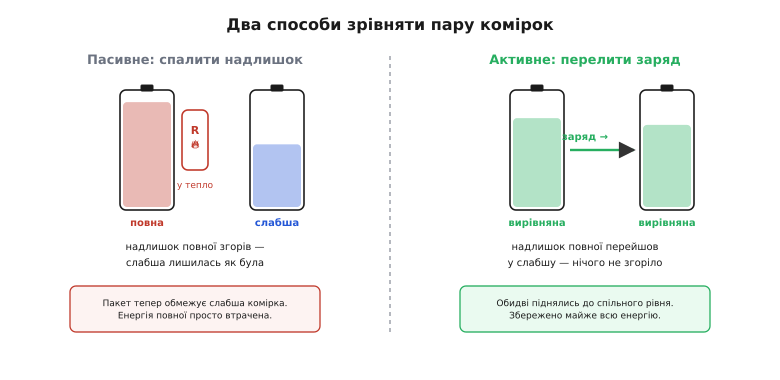
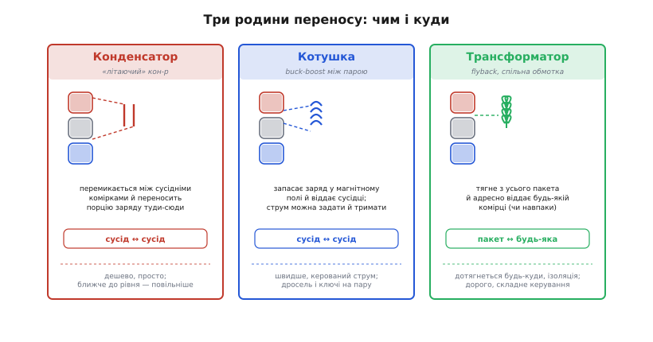
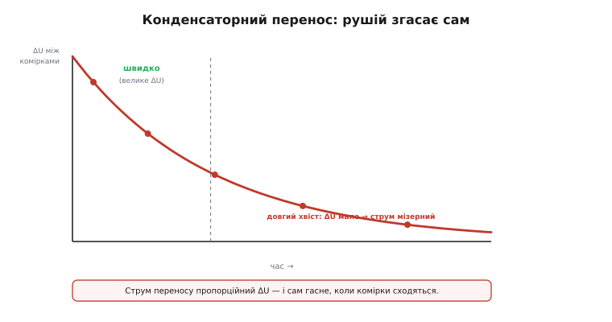
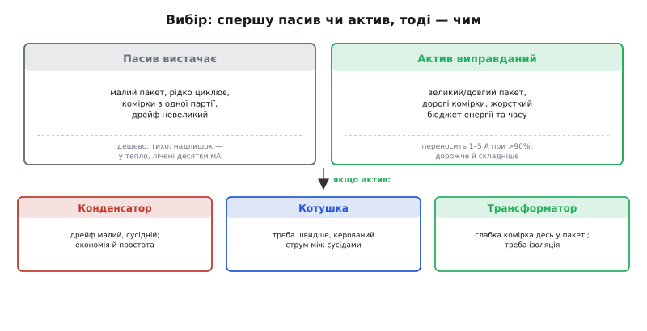

# Активне балансування: топології і вибір

<preknowlist>
- [Залишок заряду (SOC)](topic:hw-power/state-of-charge) — скільки ампер-годин ще лишилось у комірці; головне — вміти відрізняти цей запас від напруги на клемах, бо це різні речі.
- [Старіння комірки](topic:hw-power/battery-aging) — чому глибший розряд і вищі температури пришвидшують знос; на цьому тримається доказ, що розкид комірок сам себе підсилює.
</preknowlist>

Складаючи батарею з кількох комірок послідовно, ми мовчки припускаємо, що вони однакові. Вони не однакові. Навіть комірки з однієї партії трохи різняться ємністю, внутрішнім опором і швидкістю саморозряду — а з кожним циклом ця різниця тільки росте. Монітор пакета, який ми зібрали в кроці про [архітектуру BMS](root:embedded/bms-architecture), бачить це на власні очі: напруги комірок поволі розповзаються. У цьому кроці розберемося, що з цим розповзанням робити — і чому проста відповідь («спалити надлишок») часто програє розумнішій («перелити надлишок»).

### Чому розкид комірок крадне весь пакет

Спершу варто відчути, чому кілька десятків мілівольтів різниці — це не дрібниця, а проблема, що з'їдає і ємність, і ресурс. Корінь у тому, що комірки з'єднані **послідовно**: через них тече один спільний струм, і захист пакета мусить оглядатися на **найслабшу** з них.

Уявімо пакет 4S, де одна комірка має трохи меншу ємність. На заряді вона наповнюється першою — і коли вона дійшла до стелі 4.2 В, заряд мусить спинитися, хоч решта три ще не добрали. На розряді та сама комірка порожніє першою — і коли вона провалилась до нижньої межі 3.0 В, розряд теж мусить спинитися, хоч у сусідок ще лишився заряд. Виходить пастка з двох боків: зверху недобираємо, знизу недовіддаємо.


*Дві відповіді на ту саму перекошену пару. Ліворуч — пасивне: надлишок повної комірки спалюємо на резисторі в тепло, слабша лишається як була, і пакет надалі обмежує саме вона. Праворуч — активне: той самий надлишок переливаємо в слабшу, обидві сходяться до спільного рівня, і майже вся енергія збережена.*

Наслідок прямий: **корисна ємність послідовного пакета дорівнює ємності найслабшої комірки**, а не середній. Один відстаючий елемент тягне вниз усі. Гірше того — без втручання розкид сам себе підсилює: слабша комірка щоразу глибше розряджається й сильніше нагрівається, а глибший розряд і вищі температури [пришвидшують її старіння](topic:hw-power/battery-aging). Вона деградує швидше за сусідок, відстає ще більше — і пакет в'яне нерівномірно, з одного кінця.

> 🔧 **Навіщо це.** Балансування — це не «вирівняти красиві числа на екрані», а буквально повернути собі ємність і роки служби пакета. У дрона це зайві хвилини польоту, у сонячній системі — зайвий рік до заміни дорогого набору. Тому будь-який серйозний багатокоміркний пакет має вузол балансування; питання лише — який саме.

Балансувати треба, отже, не для краси, а щоб **підтягнути відстаючих до спільного рівня** й не дати найслабшій диктувати всім. Лишається вирішити, як саме підтягувати. І тут є дві принципово різні філософії.

### Дві філософії: спалити надлишок чи перелити його

Найпростіша думка — раз одна комірка «забагато повна», заберімо з неї зайве. Це **пасивне балансування**: до кожної комірки під'єднано резистор через ключ, і коли монітор бачить, що ця комірка вибилась уперед, він вмикає її резистор. Комірка тихо розряджається крізь нього, перетворюючи свій надлишок на тепло, доки не зрівняється з рештою. Це той самий принцип, що й [бовтанка надлишку в лінійному стабілізаторі](root:embedded/linear-vs-switching): зайве — у грілку.

Пасивне приваблює простотою: один резистор і один ключ на комірку, ніякої магії в керуванні. Але платить воно одразу двома мінусами. По-перше, енергія повної комірки **просто гине** — ми зрівнюємо пакет, спускаючи кращі комірки до рівня гіршої, а не навпаки. По-друге, гасити заряд швидко означає гасити багато тепла, а тепло на платі — це те, чого якраз хочеться менше. Тому пасивні струми тримають скромними — типово **десятки мілівольтів** на резисторі дають лише **50–100 мА** балансувального струму. Зрівняти так помітний розкид у великому пакеті може забрати години, і то лише поки пакет на заряді.

Розумніша думка — а навіщо взагалі щось палити? Якщо в одній комірці заряду забагато, а в сусідній замало, то логічно не спалити надлишок, а **перенести** його туди, де бракує. Це **активне балансування**: між комірками ставлять елемент, здатний тимчасово прийняти заряд і віддати його далі — конденсатор, котушку чи трансформатор. Енергія не гине в теплі (хіба невеликі неминучі втрати на переносі), а мандрує з повних комірок до порожніх.

Різниця у двох числах. Пасивне зрівнює пакет **вниз**, до найслабшої; активне підтягує слабших **угору** коштом сильніших, зберігаючи майже всю енергію. І струми переносу в активному не зв'язані тепловим бюджетом резистора: типово це **1–5 А** при коефіцієнті корисної дії переносу **понад 90%**. Тому активне і вирівнює швидше (десятки хвилин проти годин), і — головне — вміє вирівнювати **навіть під час розряду**, а не лише на заряді: воно адресно підкидає заряд слабшій комірці саме тоді, коли вона починає провалюватись, не даючи їй упертися в нижню межу раніше за інших.

За це доводиться платити складністю й ціною — і про цю плату чесно поговоримо наприкінці. А спершу розберемо головне питання активного балансування: **чим саме переносити заряд**. Бо тут є три різні відповіді, і вони визначають усе — швидкість, ціну, складність керування й те, як далеко по пакету заряд узагалі може дотягтися.

### Чим переносити: конденсатор, котушка, трансформатор

Перенести порцію заряду з однієї комірки в іншу — це за суттю **мікроперетворювач**, що працює короткими циклами «взяв тут — віддав там». А перетворювач завжди будується навколо елемента, який уміє тимчасово запасати енергію: ємність у полі конденсатора, струм у полі котушки чи зв'язок через осердя трансформатора. Звідси й три родини топологій.


*Чим і куди переносять заряд. Конденсатор «літає» між двома сусідніми комірками — дешево й просто, але рушій згасає під кінець. Котушка переносить між парою з керованим струмом — швидше, ціною дроселя й ключів. Трансформатор тягне з усього пакета й адресно віддає будь-якій комірці — дотягнеться будь-куди й дає ізоляцію, але дорожчий і складніший у керуванні.*

**Конденсатор — «літаючий» (flying capacitor).** Найпростіший перенос. Конденсатор ключами під'єднують спершу до повнішої комірки — він підхоплює від неї порцію заряду, бо його напруга нижча; тоді ключі перекидають його до сусідньої, біднішої — і він віддає їй цю порцію, бо тепер уже його напруга вища. Туди-сюди, такт за тактом, заряд перетікає від багатшого до біднішого. Схема дешева, ключів небагато, керування примітивне — просто рівно перемикай. Але в ній схована фундаментальна вада, до якої повернемось окремо: рушієм переносу є **сама різниця напруг** між комірками, тож що ближче пакет до рівноваги, то млявіший перенос.

**Котушка — buck-boost між парою.** Замість конденсатора ставлять дросель і пару ключів — виходить маленький знижувально-підвищувальний перетворювач між двома сусідніми комірками. Спершу повніша комірка «накачує» струм у котушку, запасаючи енергію в її магнітному полі; тоді ключі перемикаються, і котушка віддає цей струм у біднішу комірку. Виграш проти конденсатора в тому, що **струм переносу тут можна задати й тримати** — він визначається індуктивністю й тактами ключів, а не миттєвою різницею напруг. Тому котушковий перенос лишається бадьорим навіть тоді, коли комірки вже майже зрівнялись, і загалом працює швидше. Ціна — дросель на кожну пару (а він займає місце) і трохи мудріше керування ключами.

**Трансформатор — flyback зі спільною обмоткою.** Найгнучкіша, але й найдорожча родина. Тут є спільне магнітне ядро з обмотками, і заряд переноситься через нього — за принципом [перетворювача flyback](root:embedded/linear-vs-switching), що спершу запасає енергію в осерді, а тоді віддає її в потрібну вторинну обмотку. Це знімає головне обмеження двох попередніх: трансформатор не прив'язаний до сусідів. Він уміє тягнути заряд **з усього пакета одразу** й адресно віддавати його будь-якій окремій комірці (схема «pack-to-cell»), або навпаки — забрати з однієї перевантаженої й влити в спільну шину («cell-to-pack»). До того ж обмотки дають **гальванічну ізоляцію** між боками. Платня сувора: трансформатори (а їх може бути багато) дорогі, громіздкі, а керування таким перенесенням — найскладніше з трьох.

Помітна закономірність: рухаючись від конденсатора до трансформатора, ми виграємо **досяжність і керованість**, а програємо **ціну й простоту**. Це і є головна вісь вибору топології — але перш ніж скласти карту, треба зрозуміти ще одну річ, яка пояснює, чому конденсаторний перенос, попри дешевизну, не завжди годиться.

### Чому «куди дотягується» — окрема вісь

Назви «сусід ↔ сусід» і «пакет ↔ будь-яка» — не дрібниця, а те, що визначає, чи впорається топологія з конкретним розкладом несправності. Бо несправність буває різна.

Конденсатор і котушка переносять заряд **між сусідніми комірками** в стеку. Якщо відстає комірка, а сусідня — повна, перенос робиться за один крок. Але якщо слабка комірка опинилась **посеред** пакета, а зайвий заряд є на іншому кінці, заряду доведеться «крокувати» від сусіда до сусіда через увесь стек — а кожен крок має свої втрати й свій час. Чим довший пакет і чим далі рознесені «багата» й «бідна» комірки, тим повільніше й марнотратніше дотягується сусідський перенос.

Трансформаторна ж родина б'є точно в ціль: вона тягне заряд із пакета як цілого й вливає його **прямо** в потрібну комірку, хоч би де та сиділа — без проміжних кроків. Тому для довгих пакетів (десятки комірок послідовно, як у тяговій батареї), де одна комірка може просісти будь-де, саме адресний перенос «пакет ↔ будь-яка» часто єдиний практичний, попри ціну.

Отже, вибираючи топологію, дивимось не лише «як швидко», а й «звідки куди»: чи розкид рівномірний і дрібний (вистачить сусідського переносу), чи в пакеті бувають окремі провальні комірки далеко від багатих (потрібен адресний). Тепер — обіцяна вада конденсатора, яка цю картину доповнює.

### Довгий хвіст конденсатора

У конденсаторного переносу є особливість, через яку він рідко буває остаточною відповіддю для серйозного пакета, і варто зрозуміти її механізм, а не просто запам'ятати «повільний».

Згадаймо, як «літаючий» конденсатор працює: він підхоплює заряд від повнішої комірки й віддає біднішій, бо між ними є різниця напруг ΔU. Саме ця ΔU і є рушієм: що вона більша, то більший заряд перескакує за один такт. А тепер простежмо, що буде далі. Кожен такт переносу **зменшує** ΔU — комірки сходяться. А менша ΔU означає менший заряд за наступний такт. Тобто перенос **сам гасить власний рушій**.


*Конденсаторний перенос згасає сам. Струм переносу пропорційний різниці напруг ΔU між комірками, а ця різниця з кожним тактом меншає — тож вирівнювання починається швидко (велике ΔU), а закінчується довгим хвостом, коли комірки майже зрівнялись і рушія майже не лишилось.*

Математично ΔU спадає приблизно експоненційно — швидко на початку, дедалі повільніше під кінець:

```
ΔU(t) ≈ ΔU₀ · e^(−t/τ)        струм переносу  I ≈ ΔU / R_перен

велике ΔU на старті  →  жвавий перенос
мале ΔU під кінець   →  струм мізерний, вирівнювання тягнеться
```

Практичний наслідок подвійний. По-перше, конденсаторне балансування ніколи не «дотискає» комірки до ідеалу — останні мілівольти воно ліквідує нескінченно довго, тож на ділі його спиняють на якомусь «достатньо близько». По-друге, чим більший потрібен балансувальний струм, тим це гірше: щоб дати велике I при малій ΔU, треба нездоланно малий опір переносу. Саме тому котушку й трансформатор, де струм **задається керуванням**, а не різницею напруг, вважають серйознішими: їхній перенос не видихається біля рівноваги. Конденсатор лишається вибором там, де розкид дрібний і його треба лише тримати в шорах, а не там, де комірку треба швидко витягти з глибокої ями.

Тепер у нас є всі три осі — швидкість, досяжність і поведінка біля рівноваги. Лишилось найважче інженерне питання: а чи варта вся ця складність витрат, чи дешевий резистор зробить роботу не гірше?

### Коли активне справді варте грошей

Тут легко піддатися спокусі «активне ж розумніше, отже завжди краще». Це пастка. Активне балансування — це додаткові котушки чи трансформатори, більше ключів, складніше керування й помітно вища ціна: якщо пасивний вузол додає до пакета умовні десятки доларів, то активний — нерідко сотні. За цю різницю треба отримати щось реальне, інакше вона викинута.

Реальний виграш активного з'являється, коли збігаються кілька умов. Перенос замість спалювання повертає **енергію** — це важить, коли бюджет кожної ват-години жорсткий (мобільний, літаючий пристрій) або коли пакет **великий і дорогий**, і вирівнювати його «вниз» означає щоразу недовикористовувати дорогий набір. Здатність вирівнювати **під розрядом** важить, коли пристрій працює довгими сеансами без підзаряду, і чекати «вирівняємось на наступному заряді» не випадає. А вищий струм переносу й відсутність теплового хвоста важать, коли пакет **довгий** (багато комірок послідовно), розкид встигає накопичитись, а часу на вирівнювання мало.


*Вибір у два кроки. Спершу: пасив чи актив — за масштабом пакета, ціною комірок і жорсткістю бюджету енергії та часу. Якщо актив виправданий — далі топологія: конденсатор при дрібному сусідньому дрейфі, котушка коли треба швидше з керованим струмом, трансформатор коли слабка комірка ховається десь у довгому пакеті й потрібна ізоляція.*

І навпаки — пасивного цілком досить, коли пакет **малий** (одна-дві комірки послідовно майже не дрейфують), коли комірки взяті **з однієї партії** й добре підібрані, коли пристрій **рідко циклює** й має вдосталь часу вирівнятись на заряді. У більшості споживчої електроніки на 1–4 комірки пасивне балансування — правильна, чесна відповідь, і городити активне там означало б платити за складність, яка не окупиться. Розумний інженер не питає «що технічно крутіше», а питає «що мій пакет реально втрачає без переносу» — і чи варта повернута ним ємність ціни й ризику зайвих компонентів.

Окремо варто тримати в голові: балансування будь-якого ґатунку лише **доповнює**, а не заміняє захист. Вузол, що стежить за межами напруги, струму й температури комірок, лишається обов'язковим — балансир тільки зводить комірки докупи, а вберігає їх від виходу за межі саме [монітор-захист комірок](topic:hw-power/cell-monitor-ic). Це дві різні роботи в одному BMS, і плутати їх не можна.

### Балансувати до напруги чи до заряду

Залишилось одне тонке, але вирішальне місце, де початківці регулярно ламають собі пакет, — **за чим** вирівнювати комірки. Очевидна відповідь «за напругою» здається бездоганною: монітор міряє напруги, тож зводьмо їх докупи. Для деяких хімій це справді працює. Для інших — обманює.

Згадаймо з кроку про [хімії батарей](root:embedded/battery-chemistries) форму кривої розряду. У Li-ion напруга **похило** сповзає від повного до порожнього, тож вона досить чесно відображає [залишок заряду](topic:hw-power/state-of-charge) — зрівняв напруги, вважай, зрівняв і заряди. А от у LiFePO4 крива має довге **пласке плато**: майже весь діапазон напруга стоїть майже незмінна. На такій хімії дві комірки з однаковою напругою можуть мати помітно різний реальний заряд — напруга просто «не бачить» цієї різниці на плато. Балансувати LFP «за напругою» на плато — це ганяти заряд туди-сюди наосліп, реагуючи на шум, а не на справжній розкид.

Звідси практичне правило. На **похилій** хімії (Li-ion) балансувати за напругою прийнятно, і це роблять найчастіше — на верхньому, крутішому кінці заряду, де напруга добре розрізняє комірки. На **пласкій** (LiFePO4) надійніше балансувати **за оцінкою заряду** (SOC), яку дає облік відданих і прийнятих ампер-годин, або ловити момент **у самому кінці заряду**, коли пласке плато нарешті переходить у крутий злам і напруга знову стає інформативною. Інакше кажучи, вибір моменту й критерію балансування — продовження вибору хімії, а не окреме технічне налаштування.

### Логіка рішення в прошивці

Зведімо принцип у код. Незалежно від топології, контролер балансира щоразу мусить вирішити: чи вмикати перенос, з якої комірки в яку, і коли спинятись. Покажемо серцевину цієї логіки — поріг із гістерезисом, щоб балансир не сіпався туди-сюди на дрібному шумі біля рівноваги (тому самому довгому хвості, що ми бачили в конденсатора).

**Приклад (рішення про балансування за порогом із гістерезисом).** Маємо виміряні напруги комірок; вирішуємо, котру розвантажувати (пасивно) або з котрої в котру переливати (активно). Пороги: вмикати від 30 мВ розкиду, вимикати на 10 мВ — щоб не деренчати.

```c
#define N_CELLS        4
#define BAL_START_MV   30      // вмикати баланс від цього розкиду
#define BAL_STOP_MV    10      // вимикати, коли зійшлись тісніше (гістерезис)

// Знайти найповнішу й найбіднішу комірку та розкид між ними.
typedef struct { int hi, lo; uint16_t spread_mv; } imbalance_t;

static imbalance_t find_imbalance(const uint16_t mv[N_CELLS])
{
    int hi = 0, lo = 0;
    for (int i = 1; i < N_CELLS; i++) {
        if (mv[i] > mv[hi]) hi = i;   // найповніша — найвища напруга
        if (mv[i] < mv[lo]) lo = i;   // найбідніша — найнижча
    }
    imbalance_t r = { hi, lo, (uint16_t)(mv[hi] - mv[lo]) };
    return r;
}

// Один такт керування балансиром. balancing — стан між викликами (гістерезис).
void balance_step(const uint16_t mv[N_CELLS], bool *balancing)
{
    imbalance_t im = find_imbalance(mv);

    if (!*balancing && im.spread_mv >= BAL_START_MV)
        *balancing = true;                 // розкид виріс — вмикаємось
    else if (*balancing && im.spread_mv <= BAL_STOP_MV)
        *balancing = false;                // зійшлись — спиняємось

    if (!*balancing) { balancer_off(); return; }

    // Пасивний вузол: розряджаємо найповнішу крізь її резистор.
    // Активний вузол: переносимо заряд із найповнішої в найбіднішу.
    transfer_charge(im.hi, im.lo);         // для пасиву lo ігнорується
}
```

Логіка навмисне проста, і це навмисно: складність активного балансування — у силовій частині (ключі, котушка, трансформатор) і в часовому керуванні ними, а не в рішенні «кого з ким». Зверніть увагу на дві речі. По-перше, гістерезис (30 мВ увімкнути / 10 мВ вимкнути) рятує саме від довгого хвоста: без нього балансир біля рівноваги вмикався б і вимикався на кожному мілівольті шуму. По-друге, на пласкій хімії порівняння варто вести не за сирою напругою `mv[]`, а за оцінкою заряду — інакше, як ми бачили, на плато LFP ця логіка ганяла б заряд за шумом. Повнішу версію — із вибором критерію за хімією, обмеженням струму й балансуванням під розрядом — винесено в окрему вставку-розбір [керування балансиром у прошивці](root:embedded/active-balancing/proj-balancer-control.md): там і кінцевий автомат станів, і захист від перегріву силового вузла.

Коли комірки нарешті зведено докупи, лишається подбати, щоб увесь пакет не перегрівся під навантаженням, — а це вже [тепловий менеджмент батарейного пакета](root:embedded/battery-pack-thermal).
