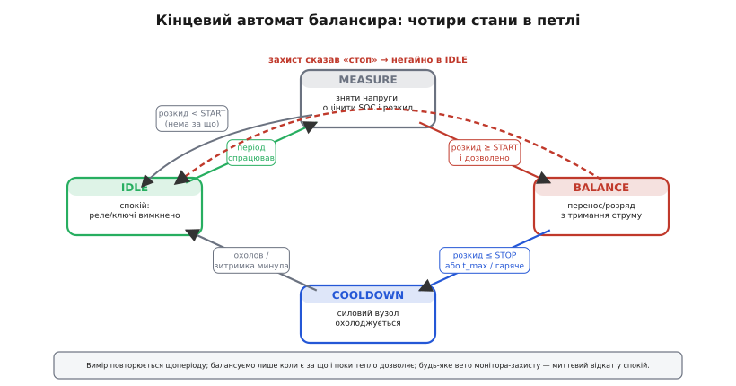
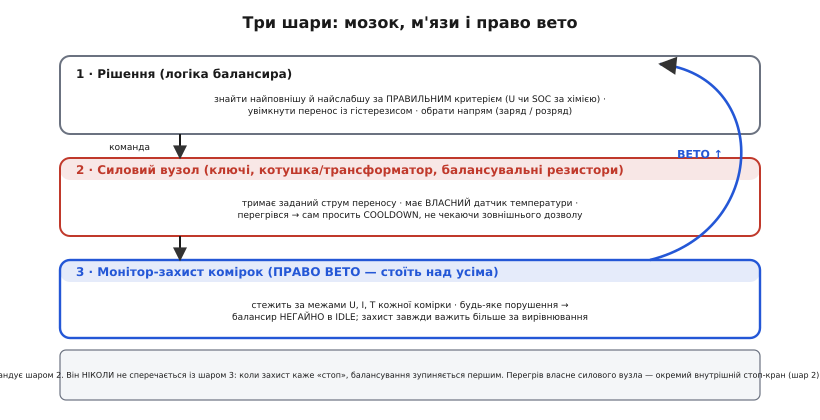
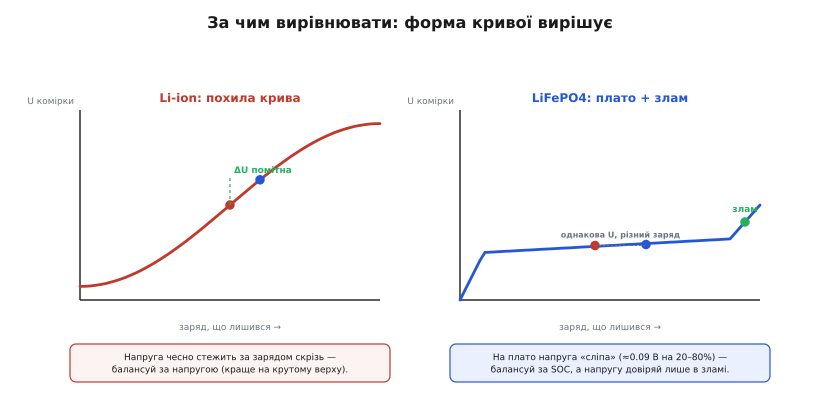

# ⚙️ Керування балансиром у прошивці

У самій темі ми звели рішення балансира до десятка рядків: знайти найповнішу й найбіднішу комірку, ввімкнути перенос із гістерезисом, спинитись, коли зійшлись. Це чесне ядро — але ядро. У реальній прошивці навколо нього наростає все те, що відрізняє іграшку від вузла, якому можна довірити дорогий пакет: коли взагалі дивитись на комірки, за яким числом їх рівняти (а воно різне для різних хімій), як не дати силовій частині згоріти й — найголовніше — як ужитися з монітором-захистом, що будь-якої миті може сказати «годі». Розберемо це шар за шаром і складемо прошивку, яку не соромно прошити.

### Задача

Уявімо конкретно. На платі — стек комірок (хай 4S, але код писатимемо для довільного `N`), [монітор комірок](topic:hw-power/cell-monitor-ic) щомиті віддає нам їхні напруги, а силовий вузол балансира (байдуже, [конденсаторний, котушковий чи трансформаторний](root:embedded/active-balancing)) уміє за командою переносити заряд з однієї комірки в іншу або просто розряджати обрану крізь резистор. Наше завдання — **мозок** цього вузла: щоразу вирішувати, чи балансувати, кого з ким, як сильно й коли спинитись.

> 🔌 **Монітор комірок (cell-monitor IC).** Мікросхема, що сидить просто на стеку, по черзі міряє напругу кожної комірки відносно сусідньої, віддає ці напруги контролеру шиною (SPI/I²C) і сама стежить за межами. У багатьох таких мікросхем усередині є й балансувальні ключі — але вмикає їх усе одно наша логіка. Деталі — [монітор-захист комірок](topic:hw-power/cell-monitor-ic).

Здавалося б, ядро з теми це вже робить. Але воно мовчки припускає три речі, які в полі не виконуються. По-перше, що балансувати треба **весь час** — а насправді ганяти заряд щомілісекунди безглуздо й шкідливо, вимірювати й вирішувати треба з розумним періодом. По-друге, що рівняти комірки можна **за сирою напругою** — а для пласкої хімії це прямий шлях зіпсувати пакет. По-третє, що силовий вузол **витримає** будь-який наш наказ — а він гріється, і його тепло доводиться тримати в шорах. І над усім цим висить четверте: балансир ділить пакет із захистом, і коли той каже «стоп», сперечатися не можна.

Отже, справжня задача — не «знайти max і min», а **вписати це рішення в кінцевий автомат**, що працює періодами, рахує правильний критерій за хімією, тримає струм і температуру в межах і беззастережно слухається захисту. Саме це й напишемо.

### Ідея

Перше, що дає лад, — оформити балансир як **кінцевий автомат** (англ. *finite state machine*, FSM — пристрій зі скінченним набором станів і переходами між ними; формалізували це Джордж Мілі 1955-го та Едвард Мур 1956-го). Чому автомат, а не «лінійний» код? Бо балансування — процес у часі з різними фазами, у яких на ті самі події треба реагувати **по-різному**. Поки ми ще нічого не вмикали, перегрів силового вузла неможливий, і питати про нього нема сенсу; а от поки перенос триває — це найважливіша подія. Лінійний код тут перетворюється на купу прапорців `is_balancing`, `is_cooling`, `was_measured`, які рано чи пізно входять у суперечність між собою. Автомат натомість каже просто: «у стані X на подію Y зроби Z», і кожна фаза знає лише свої переходи.

Станів рівно чотири, і кожен відповідає на одне зрозуміле питання:

- **`IDLE`** — спокій. Силова частина вимкнена, нічого не гріється, ми просто чекаємо чергового періоду, щоб поглянути на пакет.
- **`MEASURE`** — зняти свіжі напруги, оцінити заряд кожної комірки за **правильним критерієм** (про нього нижче) і порахувати розкид. Це точка рішення: є за що балансувати чи розійтись.
- **`BALANCE`** — власне перенос: тримаємо заданий струм, доки комірки сходяться або доки не впремось у час чи температуру.
- **`COOLDOWN`** — пауза, щоб силовий вузол охолов, перш ніж знову вмикатись. Без неї балансир на жвавому розкиді гнав би струм безперервно й пік сам себе.


*Чотири стани в петлі. Період спрацював — із IDLE йдемо в MEASURE; є помітний розкид і дозвіл — у BALANCE; зійшлись, вийшов час або стало гаряче — у COOLDOWN; охололи — назад у IDLE. А над усім — червона пунктирна дуга: будь-яке вето монітора-захисту миттєво скидає автомат у IDLE, хоч би де він був.*

Друга ідея — **відокремити «коли і як» від «за чим»**. Автомат відповідає за порядок дій і за струм; а от чим саме міряти розкид — сирою напругою чи оцінкою заряду — вирішує окрема функція, яку легко поміняти під хімію пакета, не чіпаючи перевіреної логіки переходів. Це той самий поділ, що рятував нас у [машині станів PD-sink](root:embedded/pd-sink-design/proj-pd-state-machine.md): автомат веде розмову, політика вибирає зміст.

Третя ідея — **три шари відповідальності**, і балансир займає лише верхній.


*Мозок, м'язи і право вето. Шар 1 — логіка балансира (наш автомат): кого з ким, із яким критерієм, з гістерезисом. Шар 2 — силовий вузол: тримає струм і має власний датчик температури, тож перегрівся — сам проситься в COOLDOWN. Шар 3 — монітор-захист комірок: стоїть над усіма й будь-якої миті може накласти вето, від якого балансир негайно падає в IDLE.*

Цей поділ — не бюрократія, а запобіжник від найгіршої помилки в BMS: щоб балансування ненароком не штовхнуло комірку за межу, від якої її мав уберегти захист. Тому захист завжди важить більше, і код це робитиме явним.

Тепер по черзі наповнимо кожен шар реальним C.

### Критерій вирівнювання: за напругою чи за зарядом

Почнемо з того, що ламає пакети найчастіше, — **за чим** рівняти. У темі ми вже бачили суть: у Li-ion напруга похило сповзає від повного до порожнього й чесно стежить за зарядом, а в [LiFePO4](root:embedded/battery-chemistries) крива має довге пласке плато, де напруга майже не міняється. Тепер подивимось на це очима прошивки.


*Форма кривої диктує критерій. Ліворуч Li-ion: різниця зарядів дає помітну ΔU будь-де — рівняти за напругою можна (краще на крутому верху заряду). Праворуч LiFePO4: на плато дві комірки з відчутно різним зарядом мають майже однакову напругу — рівняти за напругою тут означає ганятись за шумом; довіряти напрузі можна лише в крутому зламі наприкінці заряду.*

Число, яке варто запам'ятати: на плато LFP напруга між 20% і 80% заряду міняється всього приблизно на **0.09 В** — дев'яносто мілівольтів на шістдесят відсотків ємності. А типовий шум та похибка вимірювання монітора — одиниці мілівольтів. Тобто на плато «розкид напруг» — це більше про шум АЦП, ніж про реальну нерівність зарядів. Балансувати за ним — як вирівнювати рівень води в бочках, дивлячись не на воду, а на брижі від вітру.

Звідси прошивкове правило з двома гілками. Для **похилої** хімії порівнюємо комірки прямо за напругою — і робимо це на верхньому, крутішому кінці заряду, де ΔU найкраще розрізняє комірки. Для **пласкої** порівнюємо за **оцінкою заряду** (SOC), яку дає [облік ампер-годин](topic:hw-power/state-of-charge), а сирій напрузі довіряємо лише тоді, коли пакет дійшов до зламу наприкінці заряду й плато скінчилось.

> 🔧 **Навіщо це.** Той самий код, перемкнутий з «за напругою» на «за SOC», перетворює балансир із шкідника на помічника для LFP-пакета. Помилитись тут — означає роками ганяти заряд туди-сюди, гріючи плату й стираючи ресурс, і дивуватись, чому «балансир працює, а пакет не сходиться».

Оформимо критерій окремо від автомата — як набір налаштувань хімії плюс одну функцію, що повертає **порівнянну величину** для кожної комірки. Решта коду працюватиме з цією величиною, не знаючи, звідки вона.

```c
#include <stdint.h>
#include <stdbool.h>

#define N_CELLS   4

// Профіль хімії пакета — задається один раз під конкретні комірки.
typedef enum { CHEM_SLOPED, CHEM_FLAT } chem_kind_t;

typedef struct {
    chem_kind_t kind;        // похила (Li-ion) чи пласка (LiFePO4)
    uint16_t    knee_mv;     // напруга «зламу»: вище за неї напрузі можна вірити
    uint16_t    start_mv;    // поріг УВІМКНЕННЯ балансу (розкид criteria)
    uint16_t    stop_mv;     // поріг ВИМКНЕННЯ (гістерезис, < start_mv)
} chem_cfg_t;

// Приклади. Числа орієнтовні — під свої комірки уточнюй за даташитом.
static const chem_cfg_t CFG_LIION = {
    .kind = CHEM_SLOPED, .knee_mv = 0,    .start_mv = 30, .stop_mv = 10,
};
static const chem_cfg_t CFG_LFP = {
    .kind = CHEM_FLAT,   .knee_mv = 3450, .start_mv = 20, .stop_mv = 8,
};

// Стан вимірів: напруги комірок і поточна оцінка SOC (0..1000 = 0..100.0%).
typedef struct {
    uint16_t mv[N_CELLS];        // напруги, мВ
    uint16_t soc[N_CELLS];       // оцінка заряду, ‰ (проміле для цілочисельності)
    uint16_t pack_max_mv;        // найвища напруга в пакеті — щоб знати «де ми на кривій»
} pack_state_t;

// Порівнянна величина однієї комірки — те, що рівнятимемо між собою.
// Для похилої — це напруга в мВ. Для пласкої — SOC, перерахований у ту ж шкалу,
// щоб пороги start/stop лишались у звичних «мілівольтах розкиду».
static uint16_t cell_metric(const chem_cfg_t *c, const pack_state_t *p, int i)
{
    if (c->kind == CHEM_SLOPED)
        return p->mv[i];                       // напрузі віримо завжди

    // Пласка хімія: на плато напруга «сліпа» — беремо SOC.
    // Але якщо пакет дійшов до зламу, напруга знову інформативна й точніша.
    if (p->pack_max_mv >= c->knee_mv)
        return p->mv[i];                       // ми в зламі — повертаємось до напруги
    return p->soc[i];                          // на плато — рівняємо за зарядом
}
```

Тонкощів тут дві, і обидві варто проговорити. Перша: на пласкій хімії ми **не порівнюємо сирі напруги взагалі**, поки не дійшли до зламу, — інакше потрапили б у ту саму пастку шуму. Друга: щойно пакет дотягся до зламу (`pack_max_mv >= knee_mv`), напруга стає не просто прийнятною, а **точнішою** за лічильник ампер-годин, бо лічильник встиг накопичити похибку, а злам — це жорстка «реперна точка», де заряд однозначний. Тому в зламі ми свідомо повертаємось до напруги. Це не суперечність, а використання кожного джерела там, де воно сильне.

Зверніть ще увагу: пороги `start_mv`/`stop_mv` я лишив у спільній шкалі для обох гілок. Для похилої це буквально мілівольти розкиду напруг; для пласкої — ті самі числа, але вже в шкалі SOC-проміле, де «20» означає два відсотки заряду. Так автомат щоразу порівнює `розкид` з одним порогом, не знаючи, чим саме той розкид виміряно. Один поріг — одне правило, менше місць помилитись.

### Кінцевий автомат: серцевина керування

Тепер — сам автомат. Він зберігає стан між викликами, його смикають з фіксованим періодом (скажімо, кожні 100 мс із головного циклу або таймера), і він сам веде пакет крізь фази. Спершу заведемо тип стану й контекст, що живе між тактами.

```c
typedef enum {
    BAL_IDLE,        // спокій: силова частина вимкнена
    BAL_MEASURE,     // зняти виміри, вирішити
    BAL_BALANCE,     // перенос/розряд триває
    BAL_COOLDOWN,    // силовий вузол охолоджується
} bal_state_t;

typedef struct {
    bal_state_t  state;
    const chem_cfg_t *chem;     // профіль хімії пакета

    int      src, dst;          // індекси: з якої комірки в яку переносимо
    uint16_t spread_mv;         // поточний розкид у шкалі критерію (U-мВ або SOC-‰)
    uint32_t t_state_ms;        // скільки вже в поточному стані
    uint32_t t_balance_ms;      // загальний час безперервного балансу
} balancer_t;

// Граничні часи й періоди — теж під свій силовий вузол.
#define MEASURE_PERIOD_MS   2000     // як часто прокидатись дивитись на пакет
#define BAL_MAX_MS          60000    // максимум безперервного балансу (захист від перегріву за часом)
#define COOLDOWN_MS         15000    // скільки остигати перед новим заходом
#define TICK_MS             100      // період виклику balancer_tick()
```

Тепер головна функція — `balancer_tick()`. Її викликають щотакту (`TICK_MS`), вона дивиться на стан і вирішує, що робити й куди перейти. Ключ до читабельності — кожен стан окремою гілкою, а спільні небезпеки (вето захисту) перевіряємо **до** розбору станів, бо вони важать понад усе.

```c
// Платформозалежні заглушки — реалізуєш під свій вузол:
extern void     read_pack(pack_state_t *p);          // зняти напруги + оновити SOC
extern bool     protection_ok(void);                 // монітор-захист НЕ заперечує?
extern bool     power_node_too_hot(void);            // датчик температури силового вузла
extern void     balancer_off(void);                  // зняти всі ключі/розряди
extern void     transfer_begin(int src, int dst);    // почати перенос (актив) / розряд src (пасив)
extern void     transfer_hold(void);                 // підтримати заданий струм цей такт

// Те саме find_imbalance, що в темі (структура imbalance_t { int hi, lo; uint16_t spread_mv; }),
// але порівнює комірки за cell_metric() — тобто за ПРАВИЛЬНИМ для хімії критерієм, не за сирою mv[].
static imbalance_t find_imbalance_metric(const balancer_t *b, const pack_state_t *p);

void balancer_tick(balancer_t *b)
{
    b->t_state_ms += TICK_MS;

    // ── НУЛЬОВИЙ пріоритет: захист над усім ───────────────────────────────
    // Будь-яке вето монітора-захисту — миттєвий безумовний відкат у спокій.
    if (!protection_ok()) {
        balancer_off();
        b->state = BAL_IDLE;
        b->t_state_ms = 0;
        b->t_balance_ms = 0;
        return;
    }

    switch (b->state) {

    case BAL_IDLE:
        // Чекаємо період, тоді йдемо знімати виміри.
        if (b->t_state_ms >= MEASURE_PERIOD_MS) {
            b->state = BAL_MEASURE;
            b->t_state_ms = 0;
        }
        break;

    case BAL_MEASURE: {
        pack_state_t p;
        read_pack(&p);                              // свіжі напруги + SOC
        imbalance_t im = find_imbalance_metric(b, &p);
        b->spread_mv = im.spread_mv;

        if (im.spread_mv >= b->chem->start_mv) {       // є за що балансувати
            b->src = im.hi;                         // з найповнішої…
            b->dst = im.lo;                         // …у найбіднішу
            transfer_begin(b->src, b->dst);
            b->state = BAL_BALANCE;
            b->t_state_ms = 0;
            b->t_balance_ms = 0;
        } else {
            b->state = BAL_IDLE;                    // розкид < start — нема за що
            b->t_state_ms = 0;
        }
        break;
    }

    case BAL_BALANCE: {
        b->t_balance_ms += TICK_MS;

        // Перегрів силового вузла АБО вичерпаний бюджет часу → остигати.
        if (power_node_too_hot() || b->t_balance_ms >= BAL_MAX_MS) {
            balancer_off();
            b->state = BAL_COOLDOWN;
            b->t_state_ms = 0;
            break;
        }

        // Переміряти й перевірити, чи вже зійшлись (гістерезис: stop < start).
        pack_state_t p;
        read_pack(&p);
        imbalance_t im = find_imbalance_metric(b, &p);
        b->spread_mv = im.spread_mv;

        if (im.spread_mv <= b->chem->stop_mv) {        // зійшлись тісно
            balancer_off();
            b->state = BAL_COOLDOWN;
            b->t_state_ms = 0;
            break;
        }

        // Найбідніша могла змінитись (особливо під розрядом) — переадресуємо.
        if (im.hi != b->src || im.lo != b->dst) {
            b->src = im.hi;
            b->dst = im.lo;
            transfer_begin(b->src, b->dst);         // перенаціляємо перенос
        }
        transfer_hold();                            // тримаємо струм цей такт
        break;
    }

    case BAL_COOLDOWN:
        // Силова частина вже знята; просто остигаємо потрібний час.
        if (b->t_state_ms >= COOLDOWN_MS) {
            b->state = BAL_IDLE;
            b->t_state_ms = 0;
        }
        break;
    }
}
```

Зупинімось на кількох рішеннях, бо в них уся суть.

**Захист — нульовим пріоритетом, до switch.** Це найважливіший рядок усього файлу. `protection_ok()` питаємо **перш ніж** дивитись на власний стан, і якщо монітор-захист заперечує — байдуже, що ми робили, негайно гасимо силову частину й падаємо в `IDLE`. Так реалізовано «право вето» з нашої трирівневої схеми. Спокуса перевіряти захист лише у стані `BALANCE` оманлива: уявімо, що захист спрацював на перевищенні струму розряду, поки ми сиділи в `COOLDOWN` з уже знятими ключами, — формально нам нічого вимикати, але автомат **усе одно мусить лишитись у безпечному `IDLE`**, а не повернутись за 15 секунд до балансу так, ніби нічого не сталося. Єдина точка перевірки на вході гарантує це для всіх станів одразу.

**Перевимір у `BALANCE`, а не один раз на старті.** Поки перенос триває, ми щотакту знову знімаємо напруги й рахуємо розкид. Це коштує трохи шини до монітора, але дає дві важливі речі: ми бачимо момент, коли комірки зійшлись (і спиняємось за гістерезисом), і — головне — бачимо, що **найбідніша комірка могла змінитись**. Саме на цьому стоїть балансування під розрядом, до якого зараз дійдемо.

**Гістерезис як `stop < start`.** Вмикаємось від `start_mv`, вимикаємось аж на меншому `stop_mv`. Це той самий запобіжник від «деренчання», що й у ядрі з теми, але тут він захищає ще й силовий вузол: без гістерезису балансир біля рівноваги вмикав би й вимикав ключі на кожному мілівольті шуму, а кожне ввімкнення котушкового чи трансформаторного переносу — це кидок струму й окрема порція тепла на ключах.

**Бюджет часу `BAL_MAX_MS` поряд із датчиком температури.** Може здатись, що раз є `power_node_too_hot()`, то ліміт часу зайвий. Це не так: датчик може брехати, відклеїтись, бути не там, де насправді гаряче. Ліміт часу — груба, але незалежна страховка: навіть якщо термодатчик мовчить, балансир не молотитиме безперервно довше за хвилину без паузи на остигання. Два незалежні запобіжники на ту саму небезпеку — правильна параноя в силовій електроніці.

### Балансування під розрядом: гнатись за слабшою

Тепер найцінніше вміння активного балансира, заради якого його часто й беруть, — рівняти **під час розряду**, а не лише на заряді. Розберемо, що тут міняється в коді, бо це не «той самий алгоритм, тільки струм тече з пакета».

Під навантаженням картина інша, ніж у спокої. Коли пакет віддає струм, **найслабша комірка просідає першою й найглибше** — у неї менша ємність і часто більший внутрішній опір, тож під тим самим струмом її напруга падає швидше за сусідок. Якщо нічого не робити, вона перша впреться в нижню межу — і захист обірве розряд усього пакета, хоч у решти комірок ще є заряд. Це та сама пастка «найслабша диктує всім», тільки тепер вона спрацьовує **тут і зараз**, у середині сеансу, а не «колись на заряді».

Активний балансир під розрядом робить розумну річ: він **адресно підкидає заряд саме тій комірці, що провалюється**, з тих, які ще тримаються. Не «вирівнює пакет узагалі», а гасить конкретний провал, не даючи слабшій упертися в підлогу раніше за інших. Фактично він трохи продовжує сеанс, перетягуючи запас зі здорових комірок у відстаючу.

Що це означає для коду? Дві речі, і обидві вже закладені вище — проговоримо чому.

Перше: ціль переносу `dst` під розрядом **рухається**. У спокої найбідніша комірка лишається найбіднішою хвилинами; під розрядом провал може перескочити — особливо якщо навантаження міняється. Саме тому в `BALANCE` ми щотакту переміряємо й, якщо `im.lo` змінилась, **перенаціляємо** перенос на нову слабшу комірку (`transfer_begin(b->src, b->dst)` усередині `BALANCE`). Без цього балансир уперто лив би заряд у комірку, що вже перестала бути найслабшою.

Друге, тонше: під розрядом критерій «за напругою» поводиться інакше, ніж у спокої, і це треба врахувати. Просіла під струмом напруга — це сума двох доданків: реального меншого заряду **і** падіння на внутрішньому опорі (I·R). Комірка з більшим опором покаже нижчу напругу навіть за однакового заряду — і балансир, що рівняє за сирою напругою під навантаженням, гнатиме заряд у неї, реагуючи на опір, а не на заряд. Тому під розрядом надійніше рівняти **за оцінкою SOC** (лічильник ампер-годин на I·R не ведеться), а до напруги вертатись лише у спокої або в кінці заряду. Додамо це в критерій явно — нехай функція знає, чи пакет зараз під навантаженням.

```c
// Розширюємо профіль: чи дозволяти напругу-критерій під навантаженням.
// Під розрядом сира напруга змішує заряд із падінням I·R — для рівняння це шум.
static uint16_t cell_metric_loaded(const chem_cfg_t *c, const pack_state_t *p,
                                    int i, bool under_load)
{
    if (under_load)
        return p->soc[i];          // під навантаженням — ТІЛЬКИ за зарядом, байдуже хімія

    return cell_metric(c, p, i);   // у спокої / на заряді — як домовлялись (U чи SOC)
}
```

Тобто правило критерію стає двовимірним: спокій чи навантаження × похила чи пласка хімія. Під навантаженням завжди SOC — бо I·R обманює будь-яку хімію. У спокої — за хімією: похилій вірим напрузі, пласкій на плато ні. Це невелика правка, але без неї балансир під розрядом «лікував би» комірки з високим опором, заливаючи в них заряд, якого їм не бракувало.

> 🔧 **Навіщо це.** У дроні чи польовому приладі, що працює довгими сеансами без розетки, саме балансування під розрядом дає ті зайві хвилини роботи: слабша комірка не обриває весь пакет передчасно, бо їй вчасно підкинули заряду. Але якщо переплутати критерій і рівняти за просілою напругою — балансир під навантаженням робитиме шкоду, а не користь.

### Тримання балансувального струму

Ми весь час кажемо «тримати заданий струм» — варто пояснити, чому це окрема робота й чому її не можна звести до «ввімкнув ключ і забув».

У **пасивному** вузлі все просто: струм задає резистор. Монітор вмикає балансувальний ключ комірки, і вона розряджається крізь резистор струмом приблизно `I = U / R`. У багатьох [моніторів комірок](topic:hw-power/cell-monitor-ic) ці ключі вбудовані, а струм обмежений номіналом внутрішніх резисторів, щоб мікросхема сама не перегрілась; коли треба більше — ставлять зовнішні польові ключі з потужнішими резисторами. Тут «тримати струм» — це просто тримати ключ увімкненим, і вся хитрість у тому, щоб не задати більший струм, ніж витримає тепловий бюджет плати.

В **активному** вузлі (котушка чи трансформатор) струм переносу задається **ключуванням**: ми керуємо ключами з певною шпаруватістю (ШІМ), і середній струм через котушку залежить від цієї шпаруватості, індуктивності й напруг комірок. Це той самий принцип, що в [керуванні потужністю через ШІМ](root:embedded/pwm-power-control): не «вмикаємо назавжди», а швидко перемикаємо й керуємо середнім. `transfer_hold()` у нашому автоматі — це і є місце, де щотакту відпрацьовує цей регулятор струму: міряє струм через котушку (зазвичай по шунту), порівнює з ціллю й підправляє шпаруватість.

Чому це важливо тримати, а не пустити «як піде»? Бо саме керований струм відрізняє активний перенос від конденсаторного. Згадаймо з теми: у конденсатора рушій — сама різниця напруг ΔU, і біля рівноваги струм видихається в довгий хвіст. Котушка й трансформатор тим і кращі, що струм у них **заданий і тримається** навіть тоді, коли комірки майже зрівнялись, — але тільки якщо прошивка справді його тримає. Покажемо серцевину такого регулятора — простий пропорційно-інтегральний крок по струму.

```c
// Простий ПІ-регулятор струму переносу: тримати I_meas біля I_target.
typedef struct {
    uint16_t target_ma;     // бажаний струм переносу, мА
    int32_t  integ;         // накопичена інтегральна складова
    uint16_t duty;          // поточна шпаруватість ШІМ, 0..DUTY_MAX
} current_loop_t;

#define DUTY_MAX     1000
#define KP_NUM       3       // пропорційний коеф. (чисельник/знаменник — цілочисельно)
#define KP_DEN       10
#define KI_NUM       1
#define KI_DEN       50

extern uint16_t read_transfer_current_ma(void);   // струм по шунту
extern void     set_transfer_duty(uint16_t duty); // задати шпаруватість ключів

void current_loop_step(current_loop_t *cl)
{
    int32_t meas = read_transfer_current_ma();
    int32_t err  = (int32_t)cl->target_ma - meas;        // як далеко від цілі

    cl->integ += err;
    // анти-windup: не даємо інтегралу розпухнути за межі корисного діапазону
    if (cl->integ >  (int32_t)DUTY_MAX * KI_DEN) cl->integ =  (int32_t)DUTY_MAX * KI_DEN;
    if (cl->integ < -(int32_t)DUTY_MAX * KI_DEN) cl->integ = -(int32_t)DUTY_MAX * KI_DEN;

    int32_t duty = (err * KP_NUM) / KP_DEN + (cl->integ * KI_NUM) / KI_DEN;

    if (duty < 0)         duty = 0;
    if (duty > DUTY_MAX)  duty = DUTY_MAX;
    cl->duty = (uint16_t)duty;
    set_transfer_duty(cl->duty);
}
```

`transfer_hold()` з автомата — це і є виклик `current_loop_step()` під капотом. Дві деталі, які легко проґавити. По-перше, **анти-windup**: якщо ціль струму недосяжна (наприклад, напруги комірок майже зрівнялись і котушка фізично не проганяє стільки), інтегральна складова без обмеження розпухає до величезних чисел, і коли струм нарешті піде — регулятор довго «відригує» цей накопичений надлишок, перестрілюючи ціль. Обмеження інтегралу це гасить. По-друге, **цілочисельність**: на дешевому МК без апаратного float коефіцієнти даємо дробами чисельник/знаменник, а не `float`, — і швидше, і без сюрпризів із точністю.

### Складність і пастки на МК

Тепер чесно про те, де ця прошивка кусається. Усе вище — каркас; біда зазвичай ховається в дрібницях, які видно лише на живому пакеті.

- **Захист — нульовим пріоритетом, без винятків.** Це повторю, бо це найважливіше. `protection_ok()` перевіряємо **до** будь-якої логіки балансу, у кожному стані. Балансир, що сперечається із захистом чи «дороблює перенос, поки можна», — це шлях загнати комірку за межу, від якої її мав уберегти монітор. Захист завжди важить більше. Якщо сумніваєшся, як повестись, — гаси силову частину й падай у `IDLE`.

- **Не балансуй за сирою напругою на плоскій хімії.** Найчастіша й найдорожча помилка. На плато LFP напруга міняється на копійки (ті ~0.09 В на 20–80%), а АЦП шумить на одиниці мілівольтів — балансир ганяє заряд за шумом, гріє плату, стирає ресурс і «ніяк не зведе» пакет. Рівняй за SOC, а напрузі вір лише в зламі.

- **Не балансуй за просілою напругою під розрядом.** Друга пастка напруги. Під навантаженням напруга = заряд + I·R, і комірка з більшим опором виглядає «слабшою», ніж є. Балансир заллє в неї заряд, якого їй не бракувало. Під навантаженням — завжди SOC, байдуже хімія.

- **Гонитва за шумом біля рівноваги.** Без гістерезису (`stop < start`) балансир біля зведеного пакета вмикається й вимикається на кожному мілівольті шуму — це і деренчання логіки, і зайве зношення силових ключів кидками струму. Гістерезис обов'язковий, і `stop_mv` має бути відчутно меншим за `start_mv`, а не «трохи».

- **Перегрів силового вузла — два незалежні запобіжники.** Датчик температури (`power_node_too_hot()`) **і** ліміт часу (`BAL_MAX_MS`) разом, не замість одне одного. Термодатчик може відклеїтись, стояти не там, де гаряче, чи просто брехати; ліміт часу — груба, але незалежна страховка. У силовій електроніці краще дві перевірки, що зрідка спрацюють даремно, ніж одна, що одного разу не спрацює.

- **Перевід `dst` під розрядом — обов'язковий.** Якщо в `BALANCE` не переміряти й не переадресовувати на нову найслабшу комірку, балансир під розрядом ллє заряд у комірку, що вже перестала бути слабшою. Ціль мусить рухатись за провалом.

- **Анти-windup у регуляторі струму.** Якщо ціль струму недосяжна (комірки майже зрівнялись), необмежений інтеграл ПІ-регулятора розпухає й потім перестрілює. Обмежуй інтегральну складову — інакше дістанеш кидки струму саме там, де хотів плавності.

- **Період вимірів — не «якомога частіше».** Смикати `MEASURE` щомілісекунди безглуздо: комірки міняються поволі, а шина до монітора й сам АЦП мають свій час перетворення. Розумний період (одиниці секунд для рішення, частіший перевимір лише під час активного `BALANCE`) бережe і шину, і живлення самого контролера.

- **`transfer_begin` ≠ «вмикай і йди».** Для пасивного вузла `dst` ігнорується — розряджаємо `src` крізь резистор. Для активного `transfer_begin` піднімає перенос, а далі щотакту `transfer_hold()` тримає струм. Плутати ці дві ролі (один раз «увімкнути» активний перенос і не тримати струм) — означає або кидок струму, або млявий перенос, що видихнеться, як конденсаторний.

- **Стан — у структурі, не в стеку.** `balancer_t` живе між викликами в статичній чи виділеній пам'яті, `balancer_tick()` не блокує й не чекає в циклі. Це звичайна гігієна подієвого коду на МК: автомат крутиться на тактах таймера, а не сидить у `busy-wait`, інакше вб'є решту роботи прошивки.

Підсумково: рішення «кого з ким» справді тривіальне — це десяток рядків з теми. Уся інженерія балансира — навколо нього: правильний критерій за хімією та режимом, тримання струму й температури, рухлива ціль під розрядом і беззастережна покора захисту. Зробиш ці чотири речі чесно — і простенький автомат на чотири стани надійно вестиме дорогий пакет роками; зекономиш на котрійсь — і балансир тихо псуватиме те, що мав берегти. Коли комірки зведено, лишається подбати, щоб увесь пакет не перегрівся під навантаженням, — а це вже [тепловий менеджмент пакета](root:embedded/battery-pack-thermal).
