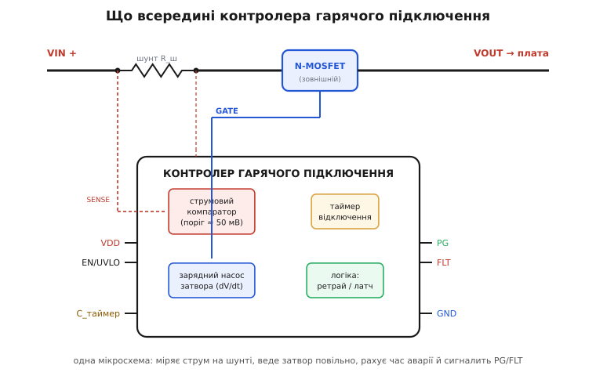
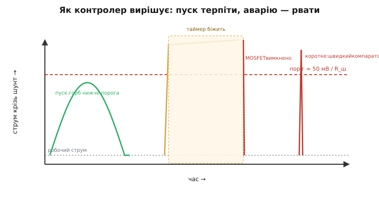

# 🔌 Контролер гарячого підключення: одна мікросхема замість обв'язки

У темі ми звели плавний пуск до простої RC-ланки на затворі: великий резистор повільно заливає заряд у ємність затвора, канал прочиняється поступово, і струм заряду тримається в межах, бо ми керуємо швидкістю наростання виходу. Для дрібного навантаження цього досить. Але ми ж бачили й тіньовий бік цієї простоти: половина енергії заряду неминуче виділяється в самому транзисторі, і робочу точку «повна напруга × піковий струм × час» доводиться вручну зводити з безпечною областю. А ще RC-ланка вміє рівно одне — повільно ввімкнути. Вона не знає, чи зарядилися конденсатори, не помічає, що навантаження раптом почало жерти втричі більше, не вміє відрубати коротке замикання й не скаже мікроконтролеру жодного слова про те, що сталося.

Щойно навантаження стає серйозним, цих «не вміє» назбирується забагато, і їх збирають в одну мікросхему — **контролер гарячого підключення** (англ. *hot-swap controller*, від *hot* «гарячий, під напругою» + *swap* «заміна»: спершу так називали вставляння плат у працюючу стійку, не вимикаючи її). Назва історична, але клас давно ширший: будь-який вузол, де живлення на велику ємність треба подати плавно, а далі — стерегти. Ще цей самий клас звуть *inrush controller* (контролер пускового струму) або *electronic circuit breaker* (електронний запобіжник) — залежно від того, який бік його роботи виходить на перший план.

Уся ця вставка — про **узагальнений клас** таких мікросхем: що в ньому всередині, які в нього ніжки, як його ставлять на плату й на чому на ньому найчастіше обпікаються. Без жодного партномера: конкретні моделі різняться напругою, струмом і дрібницями, але кістяк і ніжки в усіх той самий, і саме його варто тримати в голові.

## Що це за клас

Голий MOSFET з RC-ланкою робить одну справу — повільно вмикає. Контролер бере той самий силовий MOSFET (майже завжди **зовнішній** — щоб струм і напругу під задачу добирав інженер, а не виробник чипа), але керує його затвором розумно й заразом стереже силовий тракт. Інженерно це той самий патерн «ніжка → затвор → силовий ключ», що ми вже не раз зустрічали, тільки роль «ніжки» грає не GPIO, а спеціалізована аналогова мікросхема, яка робить п'ять речей, яких RC не вміє:

- **веде затвор із заданою швидкістю** — не абияк, а так, щоб dV/dt на виході (а отже й пік струму заряду) лежав у заданих межах;
- **міряє струм** через невеликий шунт у силовому тракті — увесь час, не лише на пуску;
- **рве коло за надструмом**, але не миттєво на кожен сплеск, а з витримкою часу, узгодженою з безпечною областю транзистора;
- **окремо ловить коротке замикання** — тут уже без витримки, бо коротке вбиває MOSFET за мікросекунди;
- **сигналить назовні** — каже «живлення в нормі» (PG) і «сталася аварія» (FLT), щоб решта системи й мікроконтролер знали стан шини.

Контрольне питання класу — те саме, що відрізняє RC-обмежувач від контролера: чи треба вам після пуску ще й **стерегти**? Якщо ні — лишіть RC, не плодіть деталей. Якщо так (велике навантаження, дорога плата, шина, яку смикають часто, вимога відрубати коротке й доповісти про це) — це робота контролера, і саме він точно тримає транзистор у [безпечній робочій області](book:electronics/soa-power-devices) на кожному пуску, чого вручну зробити надійно важко.

> 🔧 **Навіщо це.** Межа проста й корисна на практиці. Поки навантаження дрібне й вмикається зрідка — досить копійчаної RC-обв'язки з MOSFET, як у темі. Щойно з'являється бодай одне з трьох — великий струм (одиниці-десятки ампер), вимога вижити при короткому замиканні на виході, потреба доповісти системі про стан шини — ставлять контролер. Він коштує дорожче за резистор з конденсатором, але один його корпус замінює обмежувач, електронний запобіжник і давач стану шини разом, та ще й гарантує, що транзистор не вийде за SOA на жодному пуску.

## Блок-схема: що всередині

Щоб не плутатися в ніжках, тримаймо в голові картину силового тракту й того, що до нього під'єднано. Силовий струм іде по верхній лінії: вхід **VIN** → невеликий **шунт** → **зовнішній N-MOSFET** → вихід **VOUT** на плату й на її великі вхідні конденсатори. Контролер сидить збоку й чіпляється до цього тракту трьома щупами: двома вимірює спад на шунті (це його струмомір) і одним керує затвором MOSFET.


*Кістяк класу. Угорі — силовий тракт: вхід, струмовий шунт, зовнішній MOSFET, вихід на плату з її ємністю. Контролер чіпляється до тракту трьома щупами — двома міряє спад на шунті (струм), одним веде затвор. Усередині чотири блоки: струмовий компаратор з порогом близько 50 мВ, таймер відключення, зарядний насос затвора (задає dV/dt пуску) і логіка, що після аварії або вічно тримає ключ закритим (латч), або періодично пробує знову (ретрай). Назовні — живлення VDD, дозвіл EN/UVLO, конденсатор таймера, сигнали PG/FLT і земля.*

Усередині — чотири блоки, і кожен закриває одну з тих «не вміє» голого RC:

**Зарядний насос затвора.** Тут ховається одна гарна апаратна хитрість. MOSFET у силовому тракті майже завжди N-канальний (бо в N-каналу опір у відкритому стані менший за той самий розмір кристала, ніж у P-каналу — більше тепла зекономиш). Але N-канальний верхній ключ вимагає на затворі напруги **вищої за вихід**: щоб він відкрився навстіж, між затвором і витоком треба тримати, скажімо, 10 В, а витік сидить уже на повному виході. Звідки взяти напругу, вищу за живлення? Контролер містить **зарядний насос** — крихітний перетворювач, що накачує внутрішній вузол на десяток вольт вище за VIN. (Сам принцип, як ємностями підняти напругу вище за живлення, розбирає [зарядний насос](book:electronics/charge-pump).) І ось ключове для нашої теми: насос навмисне слабенький — він віддає в затвор **малий сталий струм** (одиниці мікроампер). Згадаймо зв'язок із теми: ємність затвора, заряджана сталим струмом, дає лінійне наростання напруги dV/dt = I/C. Тобто контролер задає dV/dt пуску **не зовнішнім R**, а власним струмом насоса й ємністю на затворі — повільність уже «вшита» в чип. Це той самий м'який старт, що в темі, тільки повільність задає не резистор, а каліброване джерело струму всередині.

**Струмовий компаратор.** Контролер увесь час міряє спад напруги на шунті — а спад на шунті прямо пропорційний струму (U = I·R_шунта). Усередині стоїть компаратор з фіксованим **порогом близько 50 мВ**: щойно спад перевищить цей поріг, контролер вважає, що струм надмірний. Це наскрізна константа всього класу — поріг майже в усіх контролерів лежить близько 50 мВ (у різних моделей буває 25, 50 чи трохи більше). Вона й диктує номінал шунта, до чого ми ще повернемось.

**Таймер відключення.** Сам факт, що струм перевищив поріг, ще не привід рубати: на пуску струм заряду законно великий, і короткий сплеск від увімкнення сусіднього вузла теж не аварія. Тому контролер не реагує миттєво — він **відлічує час**, поки струм над порогом. Реалізовано це звичайним зарядом конденсатора сталим струмом (та сама фізика, що й у м'якого старту, тільки тут — як годинник): поки струм перевищує поріг, контролер заряджає зовнішній конденсатор таймера; набіжить напруга на ньому до внутрішнього порогу (звично близько 1.2 В) — таймер «вистрілив», і контролер закриває MOSFET. Місткість цього конденсатора **ви задаєте самі** — нею ви ставите, скільки мілісекунд терпіти перевантаження, перш ніж рубати, і саме цей час має лягти в SOA транзистора.

**Логіка реакції.** Коли таймер вистрілив, контролер вимикає ключ — а далі поводиться одним із двох способів, заданим перемичкою чи варіантом мікросхеми. **Латч** (англ. *latch* — «засувка»): ключ лишається закритим назавжди, аж поки систему не скинуть (зняти й подати живлення або смикнути EN). **Ретрай** (англ. *retry* — «повторна спроба», ще *auto-restart*): контролер витримує паузу (звично — кілька десятків циклів заряду-розряду таймера) і пробує ввімкнути знову; якщо аварія лишилась — знову вимкне, і так по колу. Між цими двома стилями — серйозний інженерний вибір, до якого ми дійдемо в граблях.

Ці два блоки — компаратор і таймер — разом і дають головну кмітливість класу: відрізнити законний сплеск від справжньої біди. На пуску струм заряду законно сидить трохи нижче порога; коротке перевантаження тримається над порогом, але контролер дає йому фору в кілька мілісекунд, перш ніж рубати; а коротке замикання — це окрема, **швидка** гілка без витримки взагалі.


*Як контролер вирішує долю струму. Зелений горб — нормальний пуск: струм заряду піднявся нижче порога й короткий, контролер його не чіпає. Жовтий — перевантаження: струм переліз поріг і тримається, контролер не рубає одразу, а відлічує задану конденсатором таймера витримку; не вщухло — закриває ключ (червоний обрив). Окремий випадок праворуч — коротке замикання: різкий пік, який не можна терпіти жодної мілісекунди, ловить **швидкий** компаратор і вимикає ключ миттєво, без таймера. Саме ця пара «терпи пуск — рви аварію» й робить контролер розумнішим за просту RC-ланку.*

Поверх усього цього — те, чого RC не вміє в принципі: **сигнали назовні**. PG («живлення в нормі») піднімається, коли вихід доріс до робочого й ключ повністю відкритий; FLT («аварія») активується, коли таймер вистрілив. Обидва — вікно, крізь яке мікроконтролер бачить стан силової шини.

## Типова розпіновка

Корпуси різні — від крихітного шестиногого до більших, з лічильниками енергії та шиною I²C, — але набір ніжок у простого контролера на диво сталий. Бачитимеш приблизно такий список (назви в різних виробників різняться, суть однакова):

```
Силовий тракт (товсті ніжки / широкі доріжки):
  VIN / SENSE+   вхід живлення; верхній край шунта
  SENSE− / OUT   нижній край шунта (з нього починається MOSFET)
  GATE           до затвора зовнішнього MOSFET
  SOURCE / FB    витік MOSFET = вихід VOUT (контролер стежить за виходом)

Керування й живлення (сигнальні ніжки):
  VDD / VCC      живлення самої мікросхеми
  EN / UVLO      дозвіл + поріг увімкнення (ділник на цю ніжку = з якої напруги стартувати)
  TIMER / CT     конденсатор таймера відключення (його місткість = час витримки)
  ISET / ILIM    (опційно) задати поріг струму резистором, якщо він не фіксований 50 мВ
  GND            земля

Сигнали стану (відкритий стік — потрібна підтяжка):
  PG / PGOOD     "живлення в нормі": активне, коли вихід піднявся й ключ відкритий
  FLT / FAULT    "аварія": активне, коли таймер вистрілив і ключ закрито
```

Три речі тут варто прочитати уважно. По-перше, **SENSE+ і SENSE− — це два кінці шунта**, і їх ведуть до контролера окремою парою тонких доріжок просто від виводів резистора (так зване кельвінівське під'єднання — щоб у вимір не вліз спад на силовій доріжці; чому це принципово для точних вимірів струму, розбирає [кельвінівський шунт](book:electronics/kelvin-shunt)). По-друге, **EN/UVLO** — це не просто «вимикач»: на цю ніжку звично вішають дільник від VIN, і поріг спрацювання дільника задає, **з якої вхідної напруги** контролер дозволить пуск (англ. *UVLO* — *Under-Voltage Lock-Out*, блокування за зниженою напругою). Не доросло живлення до робочого — контролер тримає ключ закритим і не пускає плату на голодному пайку. По-третє, **PG і FLT — майже завжди з відкритим стоком** (англ. *open-drain*): усередині це просто транзистор, що замикає ніжку на землю, а підтягувати її до живлення треба зовнішнім резистором. Це зроблено навмисне — щоб один сигнал можна було завести на будь-яку логіку (хоч 3.3 В, хоч 5 В) і щоб кілька таких сигналів збиралися на одну лінію (детальніше про сам прийом — [вихід з відкритим колектором](book:electronics/open-collector)).

## Підключення на платі

Зберімо вузол. Силовий тракт іде «в розрив» плюсової шини: вхід → шунт → стік MOSFET, витік MOSFET → вихід на плату з її великими конденсаторами. Шунт і MOSFET — товстими доріжками під повний струм; від двох кінців шунта — окрема тонка пара на SENSE+/SENSE−. GATE контролера — на затвор MOSFET (часто через невеликий резистор у затвор, що гасить паразитний дзвін, як і в темі). Витік MOSFET заводять ще й назад на ніжку, якою контролер стежить за виходом (SOURCE/FB) — так він знає, доріс вихід чи ще ні.

Сигнальний бік скромніший: VDD на живлення мікросхеми, GND на землю, конденсатор таймера з ніжки TIMER на землю (його місткість — з розрахунку SOA, нижче), дільник із VIN на EN/UVLO (задає поріг старту). PG і FLT — кожен через свій підтягувальний резистор на ту логічну напругу, у якій їх читатиме мікроконтролер. PG зручно завести й на EN сусіднього, нижчого по черзі вузла — і дістати **автоматичну послідовність живлення** без жодного коду: поки перша шина не встала (PG не піднявся), друга навіть не починає пуск. Це апаратний близнюк того почергового пуску, що в темі ми робили затримками в мікроконтролері, тільки тут черговість тримає сам кремній.

І — найважча, найдорожча у разі помилки частина, до якої веде вся тема: **вибір самого MOSFET**. Контролер навмисне жене транзистор глибоко в SOA — велика напруга й помітний струм одночасно протягом усього пуску, — тож ключ беруть **за імпульсною SOA на час пуску**, а не за струмом і опором у відкритому стані. Це та сама перевірка, що в темі: точку «повне VIN × піковий струм заряду × час наростання» зводять із паспортним графіком SOA транзистора, і час наростання тут задає не зовнішнє R, а внутрішній струм зарядного насоса з ємністю затвора. Якщо точка за межею — беруть транзистор із ширшою SOA або ділять пуск, але **ніколи** не лишають MOSFET, обраний лише за опором: він чудово ввімкне навантаження раз і згорить на іншому пуску.

> 🔧 **Навіщо це.** Найчастіша й найдорожча помилка з контролером — поставити «хороший» MOSFET з мінімальним опором каналу, не глянувши в його SOA. У ролі простого ключа він ідеальний, а в ролі обмежувача гине, бо в нього вузька імпульсна SOA — не тримає велику напругу зі струмом разом. Правило тверде: для контролера транзистор добирають **за SOA на час пуску**, опір каналу — справа десята (він важить лише для тепла в роботі, а не для виживання на пуску). Це єдина перевірка, що відрізняє вузол, який працює роками, від ефектного диму при першому ж серйозному пуску.

## «Перший байт»: як зрозуміти, що він живий

Простий контролер — не шина й не протокол, у нього немає реєстрів і «першого байта» в буквальному сенсі. Його «розмова» з рештою плати — це **аналогові й логічні рівні на ніжках**, і перша ознака життя читається не кодом, а вольтметром та парою ніжок мікроконтролера. Порядок дій при першому ввімкненні:

1. **Подай VDD, EN тримай неактивним.** Контролер живий, але ключ закритий: на VOUT нуль, на затворі нуль. Це правильний стан спокою — якщо на виході вже є напруга, поки EN не активний, значить MOSFET пробитий (закорочений) і його треба міняти.
2. **Активуй EN (чи доведи VIN вище порога UVLO).** Тепер має початися м'який пуск: на осцилографі VOUT плавно повзе від нуля до VIN за ті десятки мілісекунд, що задає зарядний насос. Жодного кидка струму на вході — лише плавний, скромний струм заряду. Якщо вихід стрибає різко — на затворі завеликий струм або замала ємність; якщо не росте зовсім — або EN не активний, або таймер одразу рве пуск (струм заряду перевищує поріг — замалий час витримки).
3. **Дочекайся PG.** Коли вихід доріс, ніжка PG змінює стан — це і є «перший байт» у переносному сенсі: контролер каже «шина готова». Саме за цим фронтом мікроконтролер і вмикає решту логіки.

```c
// Найпростіша "розмова" з контролером: дозволити пуск і дочекатися PG.
// EN — вихід МК на ніжку дозволу; PG — вхід МК від power-good (open-drain + підтяжка).
#define HS_EN   25   // ніжка "дозвіл пуску" контролера
#define HS_PG   26   // ніжка power-good (HIGH = шина встала)
#define HS_FLT  27   // ніжка fault   (LOW  = сталася аварія, open-drain)

bool hotswap_power_up(uint32_t timeout_ms)
{
    gpio_set(HS_EN);                       // дозволили пуск; далі контролер веде затвор сам
    uint32_t t0 = millis();
    while (!gpio_get(HS_PG)) {             // чекаємо, поки вихід доросте до робочого
        if (gpio_get(HS_FLT) == 0)        // аварія під час пуску (коротке / перевантаження)
            return false;                 // ключ уже закрито контролером — далі не йдемо
        if (millis() - t0 > timeout_ms)   // вихід так і не встав за відведений час
            return false;
    }
    return true;                          // PG активний — шина готова, вмикаємо решту плати
}
```

Зверни увагу, чого тут **немає**: жодного керування струмом чи затвором із коду. Мікроконтролер лише дає «дозвіл» і слухає два сигнали — увесь м'який пуск, вимір струму й захист робить сам контролер апаратно, у реальному часі, швидше, ніж устигла б будь-яка програма. Код тільки питає «готово?» і дізнається «аварія?».

## Типові граблі класу

Ці помилки повторюються з контролера в контролер, незалежно від виробника, бо ростуть із самої фізики класу, а не з примх конкретної моделі.

- **MOSFET обраний за опором, а не за SOA.** Головна й найдорожча. Ключ із чудовим R у відкритому стані, але вузькою імпульсною SOA вмикає навантаження раз, а на більшій ємності чи вищій напрузі пробивається тепловим шляхом і **замикається накоротко** — а закорочений ключ у силовій шині це вже не захист, а аварія, що пускає весь струм у плату. Перевіряй точку «VIN × піковий струм × час пуску» по SOA, завжди.

- **Шунт не того номіналу.** Поріг ≈ 50 мВ означає, що шунт задає, при якому струмі контролер вважає це перевантаженням: I_поріг = 50 мВ / R_шунта. Узяв замалий опір — поріг злетів над реальним коротким, контролер не рве аварію. Узяв завеликий — поріг упав під робочий струм або під законний пік заряду, і контролер рубає пуск чи нормальну роботу. Рахуй R_шунта = 50 мВ / I_спрацювання й перевіряй, що пік струму заряду нижчий за цей поріг, інакше контролер заріже власний м'який старт.

- **Завеликий пік на затворі при ручній RC.** Якщо контролер дозволяє вести затвор зовнішньою ланкою, а не лише внутрішнім насосом, легко помилитися: замала ємність на затворі чи замалий резистор → крутий dV/dt → великий пік струму заряду → таймер одразу вистрілює, і пуск зривається ще на старті. Лікується тим самим важелем із теми: повільніше наростання (більша ємність на затворі), доки пік струму не сяде під поріг шунта.

- **Сплутали латч і ретрай.** Це не дрібниця, а вибір стратегії з наслідками. **Латч** безпечніший для дорогої апаратури: спрацював раз — стоїть, поки людина не розбереться; нічого не «жариться» в повторних спробах. Але якщо аварія була випадкова (короткий просад, наводка), пристрій так і лежить мертвим до перезапуску. **Ретрай** живучіший: сам відновиться, щойно причина зникне; але якщо коротке стале (а не випадкове), контролер вічно пробує ввімкнутись на нього, і MOSFET циклічно гріється кожною спробою — повільне самознищення. Правило: стале відповідальне живлення — частіше латч; автономний пристрій без людини поруч, де треба самовідновлення, — ретрай із достатньою паузою між спробами, щоб транзистор устигав охолонути.

- **PG/FLT забули підтягнути.** Виходи з відкритим стоком самі вгору не тягнуться: без підтягувального резистора PG ніколи не покаже «готово», а FLT — «аварію», і мікроконтролер читатиме сміття. Кожному — свій резистор на потрібну логічну напругу.

- **Поспішили з навантаженням, не дочекавшись PG.** Дзеркало тієї ж помилки, що в темі з PD-тригером: якщо ввімкнути решту плати, поки вихід ще наростає, вона стартує на просілій напрузі й може зависнути або смикнути струм у найгірший момент. Вмикай навантаження **за фронтом PG**, не раніше.

- **Шунт зміряли «силовою» доріжкою.** Якщо SENSE+/SENSE− завести не прямо на виводи шунта, а десь на силовій доріжці, у вимір улізе спад на міді доріжки, і поріг попливе — контролер рватиме не там, де треба. Тягни сенсорну пару кельвінівськи, від самих виводів резистора.

## Варіації класу

Кістяк один, а втілень багато — корисно бачити осі, по яких клас розходиться.

**За інтеграцією MOSFET.** Більшість контролерів керують **зовнішнім** транзистором — це гнучко: під будь-який струм і напругу береш свій ключ із потрібною SOA. Є й варіанти з **інтегрованим** MOSFET усередині корпусу: простіше розводити, менше деталей, але стеля струму нижча й SOA задана виробником, не тобою. Для невеликих шин інтегрований зручніший; для потужних — майже завжди зовнішній.

**За захистом.** Простий контролер тільки рве за надструмом із витримкою таймера. Складніший додає **обмеження струму** (англ. *current limit*, *foldback*): замість одразу рубати, контролер активно тримає струм на стелі, підкручуючи затвор, — навантаження працює на зниженому струмі, поки причина не зникне чи поки не вистрілить таймер. Це лагідніше за різке відключення, але важче для транзистора (він довше сидить у важкому режимі), тож знову впирається в SOA.

**За напругою.** Окрема гілка — **високовольтні** контролери для шин у десятки вольт (телеком −48 В, промислові 24/48 В): та сама ідея, але з вищими вимогами до ізоляції й до SOA транзистора, бо енергія заряду росте як квадрат напруги. Низьковольтні (5/12 В на платі) простіші.

**За «розумом».** Базовий контролер — суто аналоговий, без жодної шини. Просунутий несе ще й **лічильник струму, напруги та енергії з виходом по I²C/PMBus** — тоді мікроконтролер не лише чує «готово/аварія», а й читає точні ватти й ампери шини в реальному часі, веде телеметрію живлення й діагностику. Це вже не просто запобіжник, а давач і запобіжник в одному корпусі.

**За напрямком струму.** Якщо до виходу під'єднана батарея або інше джерело, треба ще й **не пускати струм назад** у вхід. Тоді в тракт ставлять не один MOSFET, а пару спина-до-спини, і контролер керує обома (чому саме пара і як вона блокує зворотний струм — [MOSFET спина-до-спини](book:electronics/mosfet-back-to-back)). Це межа з сусіднім класом — **контролером ідеального діода**, що пропускає струм лише в один бік; часто обидві функції живуть в одному корпусі, і вузол одночасно й плавно вмикає, і стереже, і не дає струму потекти назад.

> 🔧 **Навіщо це.** Обираючи контролер під задачу, ставлять три питання по черзі: який струм і напруга шини (звідси — зовнішній чи інтегрований MOSFET і яка потрібна SOA); чи треба самовідновлення (ретрай) чи безпечний стоп (латч); чи потрібна телеметрія живлення (простий аналоговий чи з I²C). Відповіді на ці три й звужують увесь зоопарк до кількох придатних моделей — а кістяк, який ми розібрали, лишається той самий у будь-якій із них: шунт міряє струм, насос веде затвор, таймер відлічує витримку, логіка вирішує долю ключа, PG/FLT доповідають назовні.
