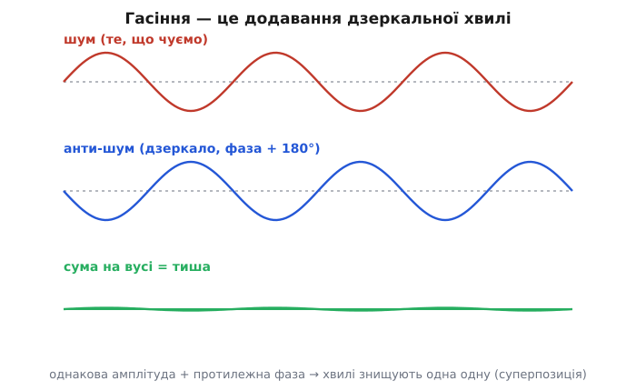
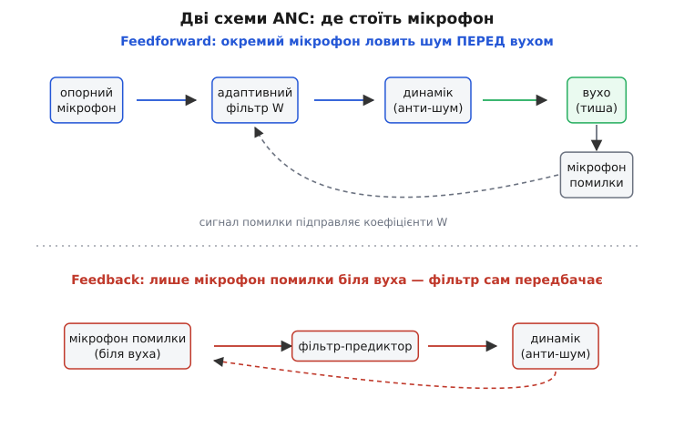
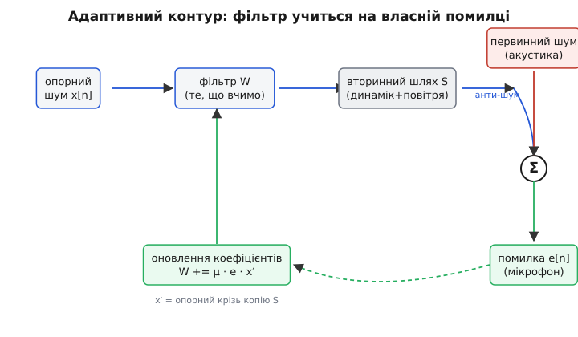

# Активне гасіння шуму: тиша, яку рахує процесор

Усі фільтри, що ми зібрали в цьому модулі, борються з шумом одним способом — **відкидають**. [КІХ і БІХ](root:embedded/fir-vs-iir) ріжуть непотрібні частоти, медіана вибиває викиди, ковзне середнє розмиває дрібне тремтіння. Спільне в них одне: вони бачать суміш «корисне + шум» і намагаються **прибрати** зайве з потоку чисел. Це робота ножиць — відрізати смугу спектра й викинути.

Активне гасіння шуму (англ. *active noise cancellation, ANC*; «активне» — бо система сама породжує сигнал, а не просто поглинає) робить дещо геть інакше, аж до парадоксу: воно бореться зі звуком, **додаючи ще звук**. Не відрізає — а доливає. І від цього в потрібній точці простору стає **тихіше**. Звучить як магія, але це чиста фізика, і весь фокус у тому, як ми її прирекаємо процесору. Розберімо, чому додавання звуку дає тишу, чому це працює лише для частини шуму, і як зчепити докупи все, що ми вже вміємо — фільтр, зворотний зв'язок, передбачення — щоб ця тиша справді з'явилася.

## Чому додавання звуку дає тишу

Звук — це коливання тиску повітря. У кожній точці простору тиск то росте над атмосферним, то падає під нього, і саме ці гойдання вухо чує як звук. Тепер ключове: якщо в одній точці зустрічаються **дві** звукові хвилі, повітря не може коливатися двома способами одразу — воно коливається на **суму** двох тисків. Це [суперпозиція хвиль](topic:ph-waves/wave-superposition): миттєвий тиск у точці дорівнює сумі тисків від кожної хвилі окремо.

> 📎 **Що треба знати про суперпозицію.** Дві хвилі, що зустрілися в одній точці, не зливаються в нову сутність — повітря просто рухається на їхню **суму** в кожну мить. Збіг гребенів підсилює (конструктивна [інтерференція](topic:ph-waves/wave-interference)), а гребінь однієї проти западини іншої — гасить. Після зустрічі хвилі розходяться незмінними: накладання локальне, у точці й миті.

Звідси випливає весь метод. Уявімо шум — скажімо, гудіння двигуна. У точці біля вуха його тиск гойдається за якоюсь хвилею. А тепер пустимо туди **другу** хвилю — точно таку саму за формою й амплітудою, але **перевернуту**: де шум жене тиск угору, наша хвиля тягне його вниз рівно настільки ж. Сума двох у кожну мить — нуль. Повітря не коливається. Вухо чує тишу.


*Згори — хвиля шуму, яку ми чуємо. Посередині — анти-шум: та сама амплітуда, фаза зсунута на 180°. Унизу — їхня сума на барабанній перетинці: майже пряма лінія, бо в кожну мить плюс одного гасить мінус другого. Тиша — це не відсутність хвиль, а дві хвилі, що знищують одна одну.*

Оце і є вся ідея активного гасіння: спіймати шум, **виготовити його дзеркальну копію** (та сама форма, протилежний знак) і відтворити динаміком саме там, де він має зустрітися з оригіналом. У точці зустрічі суми гасяться — народжується **зона тиші**. Англійською цю дзеркальну хвилю звуть *anti-noise*, анти-шум, і назва точна: це шум зі знаком мінус.

Аналогія тут майже досконала — як на терезах докласти на легшу шальку рівно стільки, щоб зрівноважити. Але вона ламається в одному важливому місці, і саме воно зробить усю решту статті цікавою: терези зрівноважуються **скрізь і назавжди**, а звукове гасіння — лише **в одній точці** й лише **поки збігаються форма й фаза**. Варто зсунути голову на десяток сантиметрів або змінитися шуму — і дзеркало вже не дзеркало. Тиша виходить вузька й крихка, і вся інженерія ANC — це боротьба за те, щоб утримати її в потрібній точці попри рух і зміну.

> 🔧 **Навіщо це.** Перш ніж писати бодай рядок коду, закарбуйте фізичну межу: ANC створює тишу **локально**, у малому об'ємі біля мікрофона помилки (а в навушниках — біля перетинки). Це не «вимикач звуку для кімнати». Тому ANC геніально працює в навушниках (зона тиші — саме там, де вухо) і важко дається у відкритому просторі: рухома ціль, безліч точок, і в кожній потрібна своя дзеркальна хвиля.

## Найважче — знати шум наперед

Тепер найтонше місце, через яке ANC і складне. Щоб динамік видав анти-шум **точно в ту мить**, коли до вуха долетить шум, систему треба зробити швидшою за звук — або хоча б не повільнішою. А між «мікрофон почув шум» і «динамік випустив дзеркало» лежить ланцюжок: оцифрувати звук, порахувати анти-сигнал, перетворити назад у звук. Кожна ланка з'їдає час. Якщо разом вони запізнюються, дзеркальна хвиля прийде **не в тій фазі** — і замість гасіння ми отримаємо... підсилення (адже зсунута на пів-періоду копія в сумі з оригіналом дає не нуль, а подвоєння).

Тут на нас працює одна щаслива обставина фізики. **Звук повільний** — близько 343 м/с у повітрі, тоді як сигнал у дроті й обчислення в процесорі біжать у мільйони разів швидше. Тож якщо опорний мікрофон стоїть **попереду** на шляху шуму — біля джерела або хоча б на кілька сантиметрів ближче до нього, ніж вухо, — у нас з'являється **фора в часі**. Поки звукова хвиля долітає ці сантиметри, процесор устигає її обробити й підготувати анти-шум до моменту зустрічі. Ця фора — серце так званого **feedforward**-підходу (англ. «вперед-подача»): спіймати шум **до того**, як він дійде до вуха, і встигнути вистрелити дзеркалом назустріч.

Зробімо фору відчутною на числах.

**Скільки часу дають сантиметри.** Опорний мікрофон на 10 см ближче до джерела, ніж вухо. Скільки секунд процесору на всю роботу?

```
запас часу = відстань / швидкість звуку
           = 0.10 м / 343 м/с
           ≈ 2.9 · 10⁻⁴ с
           = 0.29 мс ≈ 290 мкс
```

290 мікросекунд. Для процесора, що тактується десятками мільйонів разів на секунду, це ціла вічність — тисячі тактів. Цілком досить, щоб оцифрувати відлік, прогнати його крізь фільтр і вивести анти-шум. Ось чому feedforward-навушники мають **зовнішній** мікрофон (на чашці, обличчям до світу): він ловить вуличний гул на ті самі частки секунди раніше, ніж гул просочиться крізь чашку до вуха.

А тепер зворотний бік тієї самої монети — і він пояснює головне обмеження ANC. Та сама повільність звуку, що дає нам фору, обертається пасткою на **високих** частотах. Високий тон — це коротка хвиля; період її — крихітна частка мілісекунди. Щоб гасити, фазу треба влучити з точністю до малої долі цього періоду, а наші 290 мкс затримки на високій частоті — це вже **не частка**, а кілька повних періодів. Дзеркало приходить «не туди», і гасіння перетворюється на лотерею.

**Де проходить межа за частотою.** Хай уся затримка тракту (мікрофон → АЦП → обчислення → ЦАП → динамік) — 100 мкс. До якої частоти цей зсув ще менший за чверть періоду (груба межа, де гасіння переходить у псування)?

```
період на межі: T = 4 · затримка = 4 · 100 мкс = 400 мкс
гранична частота: f = 1 / T = 1 / 0.0004 с ≈ 2500 Гц
```

Вище ~2.5 кГц цей тракт уже не гасить надійно. Тому реальні системи активного гасіння **впевнено працюють лише на низах** — приблизно до 1–2 кГц: гул двигуна, рокіт кондиціонера, монотонне «у-у-у» літака. А ось дзвін ключів, шипіння, людський голос — це для ANC зависоко; високі частоти давлять **пасивно**, самою конструкцією (щільні амбушури, поролон). Звідси й практичне правило: активне гасіння й пасивна ізоляція — не суперники, а **напарники**, кожен у своїй смузі. Низи бере електроніка, верхи — поролон.

> 🔧 **Навіщо це.** Бюджет затримки — головний параметр проєкту ANC, важливіший за «потужність» чи «розрядність». Кожна ланка тракту (буфер АЦП, довжина фільтра, буфер ЦАП) додає мікросекунди, а мікросекунди прямо опускають **стелю частоти**, яку ви здатні гасити. Тому в ANC живуть [короткі фільтри й низька латентність](root:embedded/filter-latency-budget): тут затримка не косметична незручність, а різниця між тишею й виттям.

## Шум змінюється — отже, фільтр має вчитися

Спіймати шум і перевернути знак — половина справи. Друга половина в тому, що **проста зміна знака не годиться**. Між опорним мікрофоном і вухом звук проходить не порожнечу, а реальний світ: відбивається від чашки навушника, огинає голову, по-різному затримує різні частоти. Коли шум дійде до вуха, він уже **не той самий**, що його почув мікрофон, — він спотворений цим шляхом. Якщо ми просто перевернемо те, що почув мікрофон, дзеркало не збіжеться з тим, що насправді прилетить до перетинки.

Отже, нам потрібен не «мінус», а **перетворювач**: пристрій, що бере опорний шум і виправляє його так, щоб на виході вийшла точна анти-копія того, що долетить до вуха. А «пристрій, що бере вхідний сигнал і видає потрібним чином змінений» — це рівно те, чим є **цифровий фільтр**. Усе коло замкнулося: гасіння шуму — це задача про фільтр. Той самий [КІХ](root:embedded/fir-vs-iir), що ми вже вміємо рахувати, тільки тепер його коефіцієнти мусять задавати не «зрізати таку-то смугу», а «перетвори опорний шум на його дзеркало в точці вуха».

Лишається питання на мільйон: **звідки взяти ці коефіцієнти?** І ось де ховається справжня краса ANC. Шлях звуку від мікрофона до вуха ми наперед не знаємо — він залежить від форми голови, від того, як сидить навушник, від того, чи людина повернулася до вікна. Більше того, він **змінюється** просто під час носіння. Жоден фіксований набір коефіцієнтів, прорахований на заводі, не вгадає це для всіх і назавжди.

Тому коефіцієнти не задають — їх **учать прямо на ходу**. Біля вуха ставлять ще один мікрофон — **мікрофон помилки** — і він слухає те, що лишилося **після** гасіння: залишковий шум. Логіка проста до геніальності: якщо в мікрофоні помилки ще щось гуде — отже, наше дзеркало неточне, і коефіцієнти треба підкрутити так, щоб гуло **тихіше**. Підкрутили — послухали — ще підкрутили. Фільтр сам, відлік за відліком, намацує коефіцієнти, які роблять залишок мінімальним. Це й називається [адаптивний фільтр](topic:com-signal/adaptive-filter): фільтр, що **сам налаштовує власні коефіцієнти**, женучи якусь міру помилки до нуля.

> 📎 **Що треба знати про адаптивний фільтр.** Це звичайний КІХ, але його коефіцієнти не зашиті наперед, а **повзуть** із кожним відліком у бік меншої помилки. Класичний закон підстроювання — **LMS** (*least mean squares*, «найменші квадрати»): кожен коефіцієнт зсувають на крихту, пропорційну добутку поточної помилки на відповідний вхідний відлік. Багато крихітних кроків — і фільтр сходиться до набору коефіцієнтів, що мінімізує середній квадрат помилки, **навіть якщо середовище повільно змінюється**. Швидкість навчання задає один параметр — крок μ.

Помітьте, що ми тут природно повернулися до старого знайомого з цього ж модуля — [зворотного зв'язку](root:embedded/open-vs-closed-loop). Мікрофон помилки замикає **петлю**: вихід системи (залишковий шум) повертається й керує її ж налаштуванням. Тільки якщо [ПІД-регулятор](root:embedded/pid-tuning-cascade) підправляє **одне число** (керівний вплив), то адаптивний фільтр підправляє **весь набір** коефіцієнтів. Це той самий принцип «дій → виміряй похибку → виправся», піднятий на рівень вище: керуємо не величиною, а формою цілої хвилі.

## Дві схеми: де поставити мікрофон

З цього випливають **дві** великі архітектури ANC, і відрізняє їх одне-єдине рішення — **де стоїть мікрофон, що ловить шум**.


*Згори feedforward: окремий зовнішній мікрофон ловить шум до того, як він дійде до вуха, фільтр устигає підготувати анти-шум; мікрофон помилки лише підкручує коефіцієнти. Знизу feedback: зовнішнього мікрофона нема, система слухає лише залишок біля вуха й мусить передбачити шум із нього самого. Те саме гасіння, але різна ціна й різні слабкості.*

**Feedforward** — те, що ми описали вище. Окремий **опорний** мікрофон попереду ловить шум заздалегідь, фільтр перетворює його на анти-шум, а мікрофон помилки лише підстроює коефіцієнти. Сильний бік — фора в часі: шум відомий до того, як прилетить, тож можна гасити вищі частоти. Слабкий — потрібен окремий мікрофон саме там, де шум, і система гасить **тільки** той шум, що цей мікрофон чує; звук, який обійшов його збоку, лишиться.

**Feedback** — економніша й хитріша схема: зовнішнього мікрофона **немає взагалі**, є лише мікрофон помилки біля вуха. Система чує тільки залишковий шум — і з нього самого мусить **відновити**, який анти-сигнал випустити. Це наче гасити пожежу, бачачи лише дим, а не вогонь. Сильний бік — простота й те, що гаситься будь-який шум, що дійшов до вуха (не лише спійманий зовнішнім мікрофоном). Слабкий — без фори в часі смуга гасіння вужча (тільки найнижчі частоти), і петлю легше розхитати до нестійкості — рівно та сама [межа стійкості](root:embedded/loop-stability), що ми бачили в регуляторах: завеликий «коефіцієнт» — і система замість гасіння починає сама себе розгойдувати й свистіти.

На практиці хороші навушники роблять **гібрид** — і опорний мікрофон, і мікрофон помилки разом: feedforward бере ширшу смугу й діє швидше, feedback добирає те, що перший проґавив, і компенсує неточності. Два недосконалі методи, складені докупи, дають кращий результат, ніж кожен окремо, — знайомий мотив з усього цього модуля: один інструмент рідко закриває задачу, силу дає поєднання.

## Підступ, через який наївний LMS не працює: вторинний шлях

Тепер — найважливіша тонкість, яку **обов'язково** треба знати, інакше код не запрацює, хоч би яким правильним здавався. Згадаймо закон навчання: «дивимось на помилку й підкручуємо коефіцієнти так, щоб помилка падала». Він мовчки припускає, що сигнал з фільтра потрапляє в мікрофон помилки **миттєво й незмінним**. Але між виходом фільтра й мікрофоном помилки стоїть... ще один шлях: цифро-аналоговий перетворювач, підсилювач, **динамік** і ділянка повітря до мікрофона. Цей шлях — його звуть **вторинним** (англ. *secondary path*, бо первинний — це шлях самого шуму) — теж **затримує й спотворює** наш анти-сигнал, поки той дістанеться до точки гасіння.

І ось наслідок, від якого ламається наївний алгоритм: коли LMS бачить помилку й вирішує «треба зсунути коефіцієнт у такий бік», цей вторинний шлях може **перевернути або затримати** дію настільки, що поправка прийде не туди й не вчасно. Алгоритм тягне кермо праворуч, а машина через затримку у вторинному шляху повертає ліворуч. Замість сходитися до тиші, фільтр **розбігається** й розгойдує систему. Класичний LMS у задачі ANC просто **нестійкий**.

Рятунок елегантний: треба **врахувати вторинний шлях у самому навчанні**. Якщо ми (хоча б приблизно) знаємо, як вторинний шлях S перекручує сигнал, то перед тим, як підкручувати коефіцієнти, пропускаємо **опорний** сигнал крізь **копію** цього шляху — і вже цим «профільтрованим опорним» правимо коефіцієнти. Тоді поправка враховує затримку й переворот динаміка наперед, і навчання знову стає стійким. Цей виправлений алгоритм називають **filtered-x LMS** (FxLMS) — «LMS із профільтрованим x», де x — традиційна назва опорного сигналу.


*Опорний шум x[n] проходить фільтр W (його ми вчимо) і вторинний шлях S (динамік + повітря), стаючи анти-шумом; у точці гасіння він додається до первинного шуму, і мікрофон помилки чує залишок e[n]. Оновлення коефіцієнтів бере не сам опорний, а опорний, пропущений крізь копію S (позначено x′) — саме це робить навчання стійким попри затримку динаміка.*

Звідки беруть копію вторинного шляху? Її **вимірюють заздалегідь** — на етапі калібрування: пускають у динамік відомий шум (наприклад, короткий тріск або тихий «білий» шум), слухають мікрофоном помилки й тим самим LMS визначають фільтр, що описує шлях «динамік → мікрофон». Цей вимір роблять раз при ввімкненні (або зрідка підновлюють), а далі він служить тією «копією S», крізь яку проганяють опорний сигнал у бойовому циклі.

Повний робочий код FxLMS — з вимірюванням вторинного шляху, обома буферами й захистом від розгойдування — винесено окремо, [у код-проєкт](root:embedded/active-noise-cancellation/proj-fxlms-firmware.md), бо там багато інженерних дрібниць, важливих саме для прошивки. Тут же розберімо **серце** алгоритму — крок навчання — на коротенькому, але реальному C.

> 🔧 **Навіщо це.** Якщо ваш ANC «майже працює, але іноді зривається у виття» — на 90% винен **невраховний вторинний шлях**. Наївний LMS без фільтрації опорного приречений: динамік і повітря перевертають фазу поправки, і петля розгойдується. Перше, що треба зробити в реальній прошивці, — виміряти вторинний шлях і перейти на FxLMS. Це не «оптимізація», а умова, без якої система просто не стоїть.

## Серце алгоритму на C

Анти-шум — це звичайна згортка КІХ: береш останні `N` відліків опорного шуму, множиш на коефіцієнти `w[]` і додаєш. А навчання — один прохід по тих самих `N` коефіцієнтах, де кожен зсувається на крок, пропорційний помилці й **профільтрованому** опорному відліку. Покажемо обидві дії на нормованому варіанті (NLMS — *normalized LMS*), де крок ділять на енергію вхідного вікна: так навчання не залежить від гучності й не вибухає на гучних ділянках.

**Один такт FxLMS: видати анти-шум і підкрутити фільтр.** `x[]` — опорний шум, `xs[]` — той самий опорний, уже пропущений крізь копію вторинного шляху (для навчання), `e` — щойно зчитана помилка з мікрофона. Усе у float для ясності; у бойовій прошивці беруть fixed-point.

```c
#define N 64                 // довжина адаптивного фільтра (відводів)

static float w[N]  = {0};    // коефіцієнти — те, що вчимо
static float x[N]  = {0};    // вікно опорного шуму (новіший — у x[0])
static float xs[N] = {0};    // опорний, профільтрований копією S (filtered-x)

// викликається на КОЖЕН відлік (наприклад, 8 кГц), у перерві АЦП
float anc_step(float ref, float ref_filt, float err)
{
    // 1) зсунути обидва вікна, вставити нові відліки попереду
    for (int i = N - 1; i > 0; --i) { x[i] = x[i-1]; xs[i] = xs[i-1]; }
    x[0]  = ref;             // свіжий опорний шум
    xs[0] = ref_filt;        // він же крізь копію вторинного шляху

    // 2) анти-шум = згортка опорного з поточними коефіцієнтами
    float y = 0.0f;
    for (int i = 0; i < N; ++i)
        y += w[i] * x[i];

    // 3) навчання (NLMS): крок ділимо на енергію profiltered-вікна
    float energy = 1e-6f;                 // мала добавка, щоб не ділити на 0
    for (int i = 0; i < N; ++i)
        energy += xs[i] * xs[i];

    const float mu = 0.5f;                // 0 < mu < 2 для стійкості NLMS
    float step = mu * err / energy;       // нормований крок
    for (int i = 0; i < N; ++i)
        w[i] += step * xs[i];             // тягнемо кожен коеф. до меншої помилки

    return y;                             // це піде в ЦАП → динамік (анти-шум)
}
```

Прочитаймо, що тут діється, бо кожен рядок — пряме втілення фізики вище. Крок 2 — це фільтр-перетворювач: він ліпить анти-шум з опорного. Крок 3 — навчання: знак і величина поправки задаються добутком `err * xs[i]`, тобто «наскільки цей вхідний відлік винен у поточній помилці». Дільник `energy` — нормування: на гучному шумі поправки самі меншають, на тихому — більшають, тож фільтр сходиться рівно незалежно від рівня. А головне — у поправці стоїть **`xs`** (filtered-x), а не сирий `x`: саме ця дрібна заміна й рятує петлю від розгойдування через вторинний шлях.

Один прихований підступ варто назвати прямо. Зсув вікон циклом `for` на кожен відлік — це `O(N)` зайвих копіювань; на 8 кГц і `N=64` це 512 тисяч пересувань за секунду на самий лише зсув. У реальній прошивці вікно роблять **кільцевим буфером** (рухається індекс, а не дані) — це і є одна з тих інженерних дрібниць, що чекають у [код-проєкті](root:embedded/active-noise-cancellation/proj-fxlms-firmware.md). Тут ми лишили наївний зсув заради читабельності: видно **що** робиться, а як зробити це швидко — окрема, суто реалізаційна розмова.

**Швидка перевірка стійкості.** Скільки множень на відлік коштує цей фільтр і чи влізе він у бюджет на 8 кГц?

```
на відлік: згортка N + енергія N + оновлення N ≈ 3·N = 3·64 = 192 множення
за секунду: 192 · 8000 = 1.54 млн множень/с
```

Півтора мільйона множень на секунду — для будь-якого сучасного мікроконтролера з апаратним множенням це майже непомітне навантаження. ANC упирається не в обчислення, а, як ми бачили, в **затримку** й у вірність моделі вторинного шляху. Тому борються тут не за такти, а за мікросекунди тракту й за чесне калібрування — рівно те, на що наївний погляд уваги не звертає.

## Де воно живе і де безсиле

Звідки взялася ця ідея — гасити звук звуком — і чому до споживача вона дійшла лише через десятиліття після першого патенту, розказано окремо, [в історичній вставці](root:embedded/active-noise-cancellation/hist-anc-origins.md): від винаходу до робочих навушників пролягла дорога завдовжки в життя кількох поколінь інженерів. А тут підіб'ємо практичний підсумок — де ANC справді змінює гру, а де на нього шкода й сил.

Активне гасіння **сяє** там, де шум **низькочастотний, монотонний і де є мала зона, яку треба втихомирити**. Навушники в літаку — канонічний випадок: гул двигунів якраз на низах, а зона тиші потрібна точно біля перетинки. Те саме — в автомобілях (гасіння гулу салону через штатні динаміки), у промислових повітроводах (гудіння вентиляторів давлять зустрічним динаміком у трубі), у гарнітурах зв'язку, де треба прибрати фоновий рокіт, лишивши голос.

І воно **безсиле** (або майже) там, де порушено хоч одну з умов. Високочастотний шум — зась, бо затримка тракту не дає влучити у фазу короткої хвилі. Великий відкритий простір — зась, бо зона тиші мала, а точок, де хочеться тиші, безліч, і кожна вимагає свого дзеркала. Раптовий, непередбачуваний звук (плеск, удар) — теж погано: адаптивний фільтр не встигає підлаштуватися під те, що сталося й минуло швидше, ніж він зійшовся. Тому ANC ніколи не замінює пасивну ізоляцію, а **доповнює** її: поролон і щільні амбушури глушать верхи, електроніка добиває низи. Розуміючи цей поділ праці, ви не проситимете від активного гасіння неможливого — і не дивуватиметеся, чому воно блискуче вбиває гул літака, але безсиле проти дитячого вереску в сусідньому кріслі.

> 🔧 **Навіщо це.** Беручи ANC у проєкт, спершу чесно спитайте: чи шум **низькочастотний**, чи зона тиші **мала й відома**, чи шум **сталий** настільки, що фільтр устигне навчитися? Три «так» — ANC окупиться. Хоч одне «ні» — або зміщуйте задачу до пасивних методів, або готуйтеся до того, що активне гасіння дасть скромний виграш ціною неспівмірної складності. Активне гасіння — потужний інструмент із вузькою, але чітко окресленою нішею; цінувати його треба саме за неї, а не за міф про «кнопку тиші».

## Що з цього забрати

Активне гасіння шуму звело докупи майже все, що ми проходили в цьому модулі, й показало це під новим кутом. Фільтр тут не ріже спектр, а **ліпить дзеркальну хвилю**; коефіцієнти не задані наперед, а **виучуються** на ходу; а вчить їх **зворотний зв'язок** через мікрофон помилки — той самий принцип «виміряй похибку й виправся», що рухав і ПІД-регулятор, лише піднятий з одного числа до цілої форми хвилі. Фізична основа проста — суперпозиція: дві дзеркальні хвилі в сумі дають нуль. А вся інженерія — це боротьба за те, щоб дзеркало збіглося з оригіналом у потрібній точці й вчасно: звідси і бюджет затримки, що визначає стелю частоти, і filtered-x, без якого петля розгойдується через вторинний шлях. Тиша, виявляється, — не відсутність звуку, а звук, точно прорахований процесором, щоб погасити інший. І як кожен інструмент у цьому курсі, вона сильна не всюди, а саме там, де її межі збігаються з задачею.
