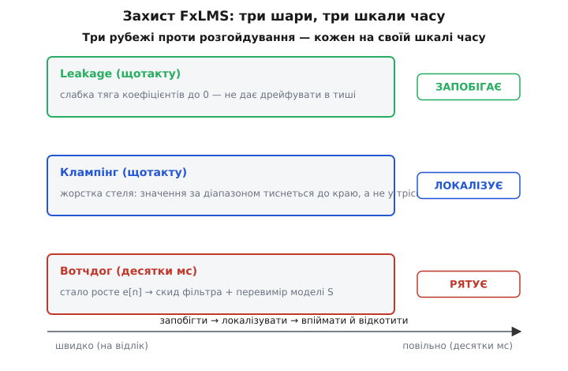

# ⚙️ FxLMS у прошивці: повний робочий код

**Задача.** У самому кроці ми розібрали *серце* алгоритму — один такт FxLMS на float, де опорний шум проходить фільтр, а профільтрований опорний править коефіцієнти. Цей такт показує **думку**. Але між думкою й кодом, який можна залити в мікроконтролер і лишити гасити гул місяцями, лежить довга й підступна дорога — і саме на ній ANC найчастіше зривається у виття. Хто **подає** відліки у фільтр і коли? Звідки взяти копію [вторинного шляху](root:embedded/active-noise-cancellation) S, без якої петля розгойдується, — і як виміряти її **самій прошивці** на старті? Як прибрати ті `O(N)` зсувів масиву, що ми лишили заради читабельності? Що станеться, коли множення двох 16-бітних чисел **переповнить** акумулятор? Чому фільтр, який щойно гарно гасив, раптом за хвилину **розбігається** до краю діапазону — і як це впіймати **до** того, як у вухах загуде?

Цей крок доводить FxLMS до робочої прошивки. Ми зберемо **офлайн-ідентифікацію** вторинного шляху коротким білим шумом, переведемо обидва вікна на **кільцеві буфери** (рухається індекс, а не дані), перепишемо оновлення коефіцієнтів у **fixed-point** з чесним 64-бітним акумулятором, навісимо **три рубежі захисту** від розгойдування (leakage, клампінг коефіцієнтів і виходу, детектор розбіжності за зростанням `e[n]`), а тоді вкладемо все це в **обробник переривання АЦП** на 8 кГц із подвійним буфером і виміром завантаження процесора. Мета — не переказати алгоритм (його інтуїція й виведення — у самому кроці), а показати, **як зі стійкого на папері FxLMS зробити вузол прошивки, якому можна довірити вуха людини**.

> 🔧 **Навіщо це.** Різниця між «гасить на столі у float» і «гасить у виробі» для ANC — це майже завжди не математика, а *обв'язка*: чесна модель S, цілочислова арифметика без переповнень, жорсткі запобіжники й залізний бюджет часу в перериванні. Зібравши це руками раз, ви розумієте, що ховається за рядком «active noise cancellation» у специфікації будь-яких навушників — і чому одні «душать» гул, а інші ледь шепочуть.

## План: дві фази життя прошивки

Перш ніж писати, варто побачити, що прошивка ANC живе у **двох різних режимах**, і плутати їх не можна.

Перший — **калібрування** (його роблять раз при ввімкненні, поки навушник уже на голові, але гасіння ще не почалося). Тут ми пускаємо у динамік відомий тестовий сигнал, слухаємо його мікрофоном помилки й тим самим LMS вимірюємо фільтр `Ŝ`, що описує шлях «динамік → повітря → мікрофон». Це триває частку секунди й закінчується назавжди (точніше — до наступного ввімкнення).

Другий — **бойовий цикл** (далі він крутиться без кінця, на кожен відлік АЦП). Тут опорний шум `x[n]` проходить адаптивний фільтр `W`, стає анти-шумом, іде в динамік; копія `Ŝ` слугує лише для того, щоб пропустити крізь неї опорний і дістати `x′[n]` (filtered-x), яким ми правимо `W`.

```
ФАЗА 1 (раз на старті):  динамік ← білий шум →  Ŝ  (LMS вчить модель S)
ФАЗА 2 (кожен відлік):   x → W → анти-шум → динамік
                         x → Ŝ → x′ →  оновлення W  ←  e (мікрофон помилки)
```

Чому саме так, а не виміряти S раз на заводі й зашити в прошивку? Бо S — це не лише динамік, а **весь шлях разом із повітрям**: як щільно сіла амбушура, чи притиснута чашка до голови, де саме опинився мікрофон помилки відносно перетинки. У різних людей і навіть у тієї самої людини в різні дні це різне. Завчасна заводська модель схибить — а схибила модель S **за фазою** означає, як ми бачили в самому кроці, що петля стає нестійкою. Тому модель вторинного шляху прошивка вимірює **сама**, кожен раз, на тому самому залізі й у тих самих умовах, у яких далі гаситиме.

## Фаза 1: офлайн-ідентифікація вторинного шляху

Ідея ідентифікації проста до краси. Ми не знаємо фільтр S, що сидить між нашим виходом і мікрофоном помилки, — то поставмо **поряд із ним порожній адаптивний фільтр** `Ŝ` (теж КІХ) і нагодуймо обидва **однаковим** входом: відомим тестовим сигналом `u[n]`. Справжній S перетворить `u` на те, що почує мікрофон (назвімо це `d[n]` — «бажане»). Наш `Ŝ` перетворить той самий `u` на свою оцінку `ŷ[n]`. Різниця `ε = d − ŷ` — це наскільки `Ŝ` ще не схожий на S; женемо її в нуль звичайним LMS — і `Ŝ` стає копією S.

Це той самий [адаптивний фільтр](topic:com-signal/adaptive-filter), що й у бойовому циклі, але в **найпростішому** його втіленні — без жодного filtered-x, бо тут немає вторинного шляху *за* нашим фільтром: ми міряємо шлях **напряму**, вихід `Ŝ` порівнюємо просто з тим, що почув мікрофон. Класичний LMS тут стійкий і збігається сам.

Тестовий сигнал має бути **білим** — рівномірно «гучним» на всіх частотах смуги. Інакше на частотах, яких у тесті мало, `Ŝ` лишиться невивченим, а саме на них потім схибить. Найдешевший білий шум у прошивці — псевдовипадкова послідовність зі зсувного регістра ([LFSR](topic:hw-digital/lfsr)): кілька рядків коду, жодних таблиць, рівний спектр.

> 📎 **Що треба знати про LFSR-шум.** Лінійний зсувний регістр зі зворотним зв'язком (англ. *linear-feedback shift register*) — це двійкове число, яке щотакту зсувається, а новий біт народжується як XOR кількох визначених розрядів («відводів»). Підібравши відводи правильно, дістаємо **максимальну** послідовність: вона пробігає всі ненульові стани перш ніж повторитися (для 16 біт — 65535 кроків), а її спектр практично рівний — це й є дешевий «білий» шум. Беремо молодший біт як ±1 — і маємо генератор шуму на три інструкції.

Ось генератор тестового шуму й один крок ідентифікації. Довжину моделі `M` беремо коротшою за бойовий фільтр — вторинний шлях у навушнику це переважно затримка динаміка плюс короткий «хвіст» відлунь у малому об'ємі, 32 відводи на 8 кГц (це 4 мс луни) з запасом вистачає.

```c
#include <stdint.h>

#define M  32                     // довжина моделі вторинного шляху Ŝ (відводів)

static float s_hat[M] = {0};      // оцінка вторинного шляху — її ми вчимо
static float u_buf[M] = {0};      // вікно тестового сигналу u[n] (для згортки Ŝ)

// --- дешевий «білий» шум: 16-бітний LFSR з відводами 16,14,13,11 ---
static uint16_t lfsr = 0xACE1u;   // будь-який ненульовий стан

static inline float white_noise(void)
{
    uint16_t bit = ((lfsr >> 0) ^ (lfsr >> 2) ^ (lfsr >> 3) ^ (lfsr >> 5)) & 1u;
    lfsr = (lfsr >> 1) | (bit << 15);
    return (lfsr & 1u) ? 0.25f : -0.25f;   // ±чверть шкали: тихий тест, щоб не глушити вухо
}

// один такт ідентифікації: подали u в динамік, прочитали відгук d з мікрофона
// повертає поточну похибку моделі (щоб бачити збіжність)
static float ident_step(float u, float d)
{
    // зсув вікна u — поки наївно; у фазі 2 покажемо кільцевий буфер
    for (int i = M - 1; i > 0; --i) u_buf[i] = u_buf[i-1];
    u_buf[0] = u;

    // оцінка відгуку: ŷ = Ŝ ⊛ u
    float y_hat = 0.0f;
    for (int i = 0; i < M; ++i) y_hat += s_hat[i] * u_buf[i];

    float eps = d - y_hat;                  // наскільки Ŝ ще не схожий на S

    // звичайний LMS — женемо eps у нуль (без filtered-x: міряємо шлях напряму)
    const float mu_id = 0.01f;
    for (int i = 0; i < M; ++i)
        s_hat[i] += mu_id * eps * u_buf[i];

    return eps;
}
```

Як прошивка розуміє, що ідентифікація **завершилась**? Слідкуємо за енергією похибки `eps`. Спочатку `Ŝ` порожній, `ŷ = 0`, і `eps = d` — повна. У міру навчання `eps` спадає й виходить на «полицю»: глибше вже не стане, бо лишилися шум мікрофона й нелінійності, яких лінійна модель не схопить. Коли спад зупинився — модель готова.

```c
#define IDENT_SAMPLES  4096       // ~0.5 с на 8 кГц — досить для 32 відводів

// викликати раз на старті; повертає 1, коли Ŝ виміряно
int identify_secondary_path(void)
{
    float err_energy = 0.0f;

    for (uint32_t n = 0; n < IDENT_SAMPLES; ++n) {
        float u = white_noise();
        dac_write(u);                       // штовхнули тест у динамік
        float d = adc_read_error_mic();     // що з нього почув мікрофон помилки
        float eps = ident_step(u, d);

        // ковзна оцінка енергії похибки (для логу / критерію зупинки)
        err_energy += 0.001f * (eps * eps - err_energy);
    }

    // err_energy тепер «полиця» — глибина моделі. Дуже велика → шлях не зловився
    // (динамік мовчить? мікрофон не той? рівень тесту нульовий?) — це сигнал не вмикати гасіння
    return (err_energy < IDENT_FAIL_LEVEL) ? 1 : 0;
}
```

> 🔧 **Навіщо це.** Цей `return 0` — не дрібниця, а запобіжник проти найгіршого. Якщо модель S **не виміряли** (динамік від'єднано, мікрофон помилки заглушений долонею, рівень тесту випадково нульовий), а ви все одно ввімкнете гасіння, бойовий цикл правитиме `W` крізь **сміттєву** `Ŝ` — і петля майже напевне розгойдається. Краще лишитися без ANC (просто пропускати звук), ніж зірватися у виття. Промислові навушники роблять цю перевірку при кожному ввімкненні; невдала ідентифікація = «активне гасіння недоступне».

## Фаза 2: кільцевий буфер замість зсуву масивів

Тепер бойовий цикл — і перше, що треба прибрати, це наївний зсув вікна. У самому кроці ми лишили `for (i…) x[i] = x[i-1]` заради читабельності й одразу назвали ціну: на 8 кГц і `N = 64` це **півмільйона** пересувань пам'яті за секунду на один лише зсув, ще до корисної роботи. У перериванні, де кожна інструкція на рахунку, це марнотратство неприпустиме.

Рятунок — **кільцевий буфер**: дані лежать нерухомо, рухається лише **індекс** запису. Новий відлік не «вштовхуємо попереду, всіх посунувши» — а просто кладемо на місце найстарішого, бо найстаріший нам уже не потрібен. Індекс іде по колу: дійшов до кінця масиву — повернувся на початок. Жодного копіювання: вставка нового відліку — одне присвоєння й один інкремент.

> 📎 **Що треба знати про кільцевий буфер.** Це звичайний масив `buf[N]` плюс індекс `head`, що вказує, **куди класти наступний** елемент. Записали — посунули `head` уперед по колу (`head = (head + 1) % N`). Найновіший елемент — щойно записаний, найстаріший — рівно той, що зараз під `head` (його ось-ось перезапишемо). «Кільце» — бо кінець масиву зшито з початком: фізично пам'ять лінійна, логічно вона замкнена в коло. Заміна `O(N)` зсуву на `O(1)` вставку — основний прийом будь-якої потокової обробки на ходу.

Один тонкий момент. Згортка КІХ хоче відліки **в порядку давнини**: коефіцієнт `w[0]` множиться на найновіший відлік, `w[1]` — на попередній, і так углиб. У кільцевому буфері «найновіший» — це не `buf[0]`, а `buf[head-1]`, і далі назад по колу. Тож у згортці індекс буфера треба **відмотувати** від `head`, обертаючи через нуль. Замість дорогого `%` у гарячому циклі беремо **степінь двійки** для `N` і маскування `& (N-1)` — це одна інструкція замість ділення.

```c
#define N      64                 // довжина адаптивного фільтра — СТЕПІНЬ ДВІЙКИ
#define NMASK  (N - 1)            // маска для обмотки індексу (працює лише для 2^k)

static float w[N]  = {0};         // коефіцієнти бойового фільтра — те, що вчимо
static float xr[N] = {0};         // кільце опорного шуму x[n]
static float xs[N] = {0};         // кільце filtered-x (опорний крізь Ŝ)
static int   head  = 0;           // куди класти наступний відлік (спільний для xr, xs)

// один бойовий такт FxLMS на кільцевих буферах. Повертає анти-шум у ЦАП.
static float fxlms_step(float ref, float err)
{
    // 1) спершу прожену опорний крізь копію вторинного шляху → filtered-x.
    //    Це теж згортка (Ŝ ⊛ x), і їй потрібне СВОЄ вікно опорного.
    //    Щоб не тримати третій буфер, рахуємо x′ просто тут, по кільцю xr.
    float xprime = 0.0f;
    for (int i = 0; i < M; ++i) {
        int idx = (head - 1 - i) & NMASK;     // i-й за давниною опорний
        xprime += s_hat[i] * xr[idx];
    }

    // 2) кладемо нові відліки в кільця (O(1): одне присвоєння, без зсуву)
    xr[head] = ref;
    xs[head] = xprime;
    head = (head + 1) & NMASK;                 // посунули по колу

    // 3) анти-шум = згортка опорного з поточними коефіцієнтами:
    //    w[0]·(найновіший) + w[1]·(попередній) + …
    float y = 0.0f;
    for (int i = 0; i < N; ++i) {
        int idx = (head - 1 - i) & NMASK;
        y += w[i] * xr[idx];
    }

    // 4) навчання: кожен коеф. тягнемо кроком ∝ err · (filtered-x тієї ж давнини)
    const float mu = 0.02f;
    for (int i = 0; i < N; ++i) {
        int idx = (head - 1 - i) & NMASK;
        w[i] += mu * err * xs[idx];
    }

    return y;                                   // піде в ЦАП → динамік (анти-шум)
}
```

Зверніть увагу: `head` посунули **раз** (крок 2), а всі три згортки відмотують від нього однаково. Спершу — `xprime` (крок 1) по **старому** вікну, ще без нового відліку; це правильно, бо filtered-x для оновлення має відповідати тому опорному, що вже у фільтрі. Якщо подумки переставити кроки місцями, зсунеться відповідність давнини між `x` та `x′`, і навчання почне правити «не ті» коефіцієнти. Порядок тут — частина коректності, не випадковість.

Дрібний, але дратівливий капкан: маска `& (N-1)` працює **тільки** коли `N` — степінь двійки. Поставив `N = 60` «бо так захотілося» — і маскування мовчки бере не ті індекси (60 у двійковій — не суцільні одиниці), згортка читає сміття, фільтр не вчиться, а компілятор жодного слова не скаже. Тому `N` тут — `64`, `128`, `256`; це не забаганка, а умова, від якої залежить, чи взагалі коректний весь модуль.

## Fixed-point: те саме навчання в цілих числах

float у наведеному коді — заради ясності. Багато дешевих мікроконтролерів не мають апаратного float узагалі, і тоді кожне `w[i] += mu * err * xs[idx]` перетворюється на десятки тактів програмної емуляції — у перериванні на 8 кГц це смерть бюджету. Вихід — **fixed-point**: тримати дробові числа як цілі з домовленою «уявною комою».

> 📎 **Що треба знати про Q-формат.** [Фіксована кома](topic:hw-arch/fixed-point) — це угода: ціле число трактуємо як дріб, домовившись, скільки молодших бітів — дробова частина. Формат **Q15** означає 16-бітне ціле, де 15 бітів — дробові: значення = `ціле / 32768`, діапазон [−1, +1). Додавання й віднімання — звичайні цілочислові. А ось **множення** двох Q15 дає Q30 (подвоєну кількість дробових бітів) і **широкий** результат — тому добуток рахують у ширшому регістрі й зсувають назад на 15. Уся арифметика DSP-фільтрів десятиліттями жила саме у Q15.

Перенесімо бойовий такт у Q15. Коефіцієнти, відліки, помилка — `int16_t` у Q15. Згортка накопичує в `int64_t` (про те, чому саме 64 біти, — наступний розділ, це найгостріша пастка). Крок μ зручно тримати як степінь двійки `mu = 2⁻ᵏ`: тоді множення на μ — це **зсув** `>> k`, найдешевша операція, яка є.

```c
#include <stdint.h>

typedef int16_t q15_t;            // Q15: значення = x / 32768, діапазон [−1, +1)
#define Q              15
#define MU_SHIFT       9          // крок μ = 2⁻⁹ ≈ 0.002 (degree of learning)

static q15_t  wq[N]  = {0};       // коефіцієнти у Q15
static q15_t  xrq[N] = {0};       // кільце опорного, Q15
static q15_t  xsq[N] = {0};       // кільце filtered-x, Q15
static int    head_q = 0;

// насичувальне зведення 32-біт → Q15: за межами [−1,+1) тиснемо до краю,
// а НЕ обрізаємо біти (обрізання = перестрибування через діапазон, тріск)
static inline q15_t sat_q15(int32_t v)
{
    if (v >  32767) return  32767;
    if (v < -32768) return -32768;
    return (q15_t)v;
}

static q15_t fxlms_step_q15(q15_t ref, q15_t err)
{
    // 1) filtered-x: Ŝ ⊛ опорний, акумулятор 64-бітний
    int64_t accx = 0;
    for (int i = 0; i < M; ++i) {
        int idx = (head_q - 1 - i) & NMASK;
        accx += (int32_t)s_hat_q[i] * (int32_t)xrq[idx];   // Q15·Q15 = Q30
    }
    q15_t xprime = sat_q15((int32_t)(accx >> Q));          // Q30 → Q15

    // 2) кладемо нові відліки (O(1))
    xrq[head_q] = ref;
    xsq[head_q] = xprime;
    head_q = (head_q + 1) & NMASK;

    // 3) анти-шум: W ⊛ опорний
    int64_t accy = 0;
    for (int i = 0; i < N; ++i) {
        int idx = (head_q - 1 - i) & NMASK;
        accy += (int32_t)wq[i] * (int32_t)xrq[idx];        // Q30
    }
    q15_t y = sat_q15((int32_t)(accy >> Q));               // Q30 → Q15

    // 4) навчання у Q15 з leakage (про λ — нижче, у захисті):
    //    w ← w·(1 − leak)  +  μ · err · x′
    for (int i = 0; i < N; ++i) {
        int idx = (head_q - 1 - i) & NMASK;
        // крок: err·x′ це Q30; зводимо до Q15 (>>Q) і множимо на μ=2⁻ᵏ (>>MU_SHIFT)
        int32_t grad = ((int32_t)err * (int32_t)xsq[idx]) >> Q;   // Q15
        int32_t neww = (int32_t)wq[i] + (grad >> MU_SHIFT);       // + крок
        neww -= (neww >> LEAK_SHIFT);                             // − leakage (тяга до 0)
        wq[i] = sat_q15(neww);                                    // КЛАМП коефіцієнта
    }

    return y;
}
```

Тут уже видно два із трьох рубежів захисту — `sat_q15` на коефіцієнті й на виході, і `LEAK_SHIFT`-витік. Розберімо їх окремо, бо це і є та частина, що відрізняє прошивку, яка стоїть, від прошивки, яка зривається.

## Захист від розгойдування: три рубежі

Адаптивний фільтр у задачі ANC завжди ходить по краю. Він **сам** змінює власні коефіцієнти, женучи помилку вниз, — а отже, за певних умов може загнати себе в розгін: коефіцієнти ростуть → вихід гучнішає → помилка (через неточність моделі S) росте теж → коефіцієнти ростуть іще. Це додатний зворотний зв'язок, і кінчається він краєм діапазону й огидним виттям у вухах. Три механізми не дають цьому статися — кожен закриває свій бік загрози.

**Рубіж 1 — leakage (витік).** До звичайного LMS додаємо крихітну тягу кожного коефіцієнта **до нуля**: замість `w ← w + крок` беремо `w ← w·(1 − λ) + крок`, де λ дуже мале (наприклад, 2⁻¹⁰). Сенс: якщо корисний сигнал зник (стало тихо), звичайний LMS нічим не стримуваний дрейфує куди завгодно й нагромаджує величезні коефіцієнти на самому шумі мікрофона; витік же постійно «здуває» їх назад, тож без свіжого сигналу фільтр сам згасає до нуля. Це **leaky-LMS**, і його стійкість строго доведена за умови λ у [0, 1] — λ діє як тертя, що з'їдає накопичену «енергію» розгону. У коді це один рядок `neww -= (neww >> LEAK_SHIFT)`: зсув на 10 — це віднімання тисячної частки, тобто λ ≈ 2⁻¹⁰.

```c
#define LEAK_SHIFT  10            // λ = 2⁻¹⁰ ≈ 0.001 — слабке «тертя» проти дрейфу
```

> 🔧 **Навіщо це.** Leakage — найдешевша страховка ANC від найковзкішого збою: **тихих пауз**. Коли шум зник, гасити нічого, але мікрофон помилки все одно чує власний шумок; чистий LMS на ньому повільно «божеволіє», нарощуючи коефіцієнти в нікуди, — і коли шум повертається, фільтр стартує вже з безглуздого стану й може зірватися. Один зсув на такт коштує копійки, а прибирає цілий клас «раптом завило в тиші».

**Рубіж 2 — клампінг (насичення).** Кожен коефіцієнт і вихід **тиснемо** до меж діапазону, а не даємо їм переповнитися. Це робить `sat_q15`: значення, що вилізло за [−1, +1), стає рівно краєм. Чому це критично саме в fixed-point: якщо просто **обрізати** старші біти (як робить цілочислове переповнення в C для беззнакових і UB для знакових), число не «впирається в стелю», а **перестрибує** з великого додатного в велике від'ємне — у звуці це різкий «клац» на повну гучність. Насичення натомість дає м'яке плато: гірше за чистий сигнал, але не катастрофа. Клампимо у двох місцях — на коефіцієнті (щоб фільтр не розпух) і на виході `y` (щоб у динамік фізично не пішло більше за шкалу ЦАП).

**Рубіж 3 — детектор розбіжності.** Перші два рубежі стримують, але не помічають, що щось пішло не так фундаментально — скажімо, модель S **застаріла** (амбушуру зрушили, і реальний S тепер з іншою фазою). Тоді фільтр може повзти до розгону **повільно**, лишаючись формально в межах. Ловимо це за **симптомом**: при здоровому гасінні енергія помилки `e[n]` тримається низькою; якщо вона стало й помітно **росте** кілька десятків мілісекунд поспіль — навчання розбігається. Реакція проста й рятівна: **скинути коефіцієнти** (і за змогою перезапустити ідентифікацію S).

```c
// детектор розбіжності: стежимо за повільним зростанням енергії помилки
static int32_t err_pow_ema = 0;       // ковзне середнє e², Q-масштаб умовний
static int     diverge_cnt = 0;

static void watchdog(q15_t err)
{
    int32_t e2 = ((int32_t)err * (int32_t)err) >> Q;     // миттєва e², Q15
    // EMA: err_pow += (e² − err_pow) / 64
    err_pow_ema += (e2 - err_pow_ema) >> 6;

    if (err_pow_ema > DIVERGE_LEVEL) {
        if (++diverge_cnt > DIVERGE_HOLD) {              // тримається довго → це розгін
            for (int i = 0; i < N; ++i) wq[i] = 0;      // АВАРІЙНИЙ скид фільтра
            diverge_cnt = 0;
            request_reidentify();                        // попросити перевиміряти S
        }
    } else {
        diverge_cnt = 0;                                 // помилка спала — все гаразд
    }
}
```

Три рубежі працюють шарами: leakage **запобігає** найчастішому дрейфу, клампінг **локалізує** будь-який сплеск у м'яке плато замість тріску, а детектор розбіжності **ловить** глибокий збій (стара модель S) і відкочує систему в безпечний стан. Жоден поодинці не закриває всі діри; разом вони роблять петлю такою, що навіть зірвавшись, вона себе **впіймає** й перезапустить, а не лишить людину з виттям у вухах.


*Три рубежі проти розгойдування, кожен на своїй шкалі часу. Leakage (щотакту) — слабка постійна тяга коефіцієнтів до нуля, що не дає їм дрейфувати в тиші. Клампінг (щотакту) — жорстка стеля: значення за діапазоном тиснеться до краю, а не перестрибує у тріск. Вотчдог (десятки мс) — стежить за енергією помилки й при сталому зростанні скидає фільтр і просить перевиміряти S. Перший запобігає, другий локалізує, третій рятує.*

## Найгостріша пастка fixed-point: переповнення акумулятора

Тепер найтонше місце цілочислового FxLMS, на якому ламаються навіть досвідчені. Згортка `N = 64` доданків, кожен — добуток двох Q15. Один добуток Q15·Q15 — це Q30, до ±2³⁰. Складаємо 64 таких. У найгіршому разі сума сягає 64·2³⁰ = 2³⁶ — а це **далеко** за межу 32-бітного цілого (±2³¹). Якби ми накопичували в `int32_t`, акумулятор би **тихо переповнився** на гучному шумі: жодної помилки компіляції, жодного попередження — просто згортка раптом видасть число з протилежним знаком, анти-шум смикнеться в інший бік, і фільтр зірветься. Збій, який не відтворюється на тихому столі й виповзає рівно тоді, коли шум найгучніший — тобто коли гасіння найпотрібніше.

Саме тому в коді вище акумулятори — **`int64_t`**. Перевірмо запас на числах, щоб побачити, що 64 біти — не перестраховка.

**Чи переповниться акумулятор згортки.** `N = 64` відводів, кожен доданок — Q15·Q15 = Q30. Який максимум суми й чи влізе він у `int32_t`?

```
один доданок (макс):   |w|·|x| ≤ (2¹⁵)·(2¹⁵) = 2³⁰ ≈ 1.07·10⁹
сума 64 доданків:       64 · 2³⁰ = 2⁶ · 2³⁰ = 2³⁶ ≈ 6.9·10¹⁰
межа int32_t:           2³¹ − 1 ≈ 2.1·10⁹
2³⁶ більше за 2³¹ у:    2³⁶ / 2³¹ = 2⁵ = 32 рази
```

Акумулятор переповнив би 32-бітне ціле в **32 рази** на піку. `int64_t` (межа 2⁶³) тримає такий результат із колосальним запасом — 2³⁶ менше за 2⁶³ у 2²⁷ ≈ 134 мільйони разів. Висновок: **акумулятор згортки в fixed-point — завжди ширший за добуток**; для Q15-фільтра довжини до тисяч відводів `int64_t` закриває питання раз і назавжди. Економити тут на типі — значить підкласти собі збій, що вистрелить у найгірший момент.

Друга, дрібніша пастка цього ж класу — **проміжок** `err · x′` у навчанні. Це теж Q15·Q15 = Q30, до ±2³⁰; воно ще лізе в `int32_t` (2³⁰ < 2³¹), але **впритул**, без запасу на жодне додавання. Тому в коді ми спершу зсуваємо його назад у Q15 (`>> Q`), а вже потім додаємо до коефіцієнта — додавання робимо над безпечними Q15-числами, не над «розбухлим» Q30. Порядок «спершу звузь, тоді додай» тут не косметика, а захист від переповнення в один біт.

## Каркас в ISR АЦП: подвійний буфер і вимір CPU

Лишилося вкласти бойовий такт туди, де він живе насправді, — у переривання [АЦП](topic:hw-analog/adc) (того самого, що оцифровує і опорний мікрофон, і мікрофон помилки). На 8 кГц новий відлік приходить кожні 125 мкс, і обробник **зобов'язаний** завершитися до приходу наступного, інакше відлік загубиться, у звуці буде діра, а навчання — стрибок. Тут діє той самий залізний закон, що й у будь-якій швидкій периферії: [у перериванні — лише найнеобхідніше](topic:hw-arch/isr/proj-deferred-work.md).

Класичний спосіб не загубити жодного відліку й водночас не робити все «в лоб у перериванні» — **подвійний буфер** (англ. *double buffering*, або *ping-pong*). Заводимо два однакові буфери; поки контролер прямого доступу до пам'яті (DMA) наповнює один блоком свіжих відліків, прошивка спокійно обробляє **інший**, уже наповнений. Заповнився поточний — DMA мовчки перемикається на сусідній і смикає переривання «блок готовий»; ми міняємо буфери ролями й беремося за щойно наповнений, а DMA тим часом ллє у вже звільнений. Дані ніколи не «з-під ніг»: читаємо один, пишеться інший.

```c
#include <stdint.h>

#define BLK  16                    // відліків у блоці DMA (8 кГц / 16 ≈ 2 мс на блок)

// два буфери опорного й помилки: поки DMA пише один, ми рахуємо інший
static q15_t buf_ref[2][BLK];
static q15_t buf_err[2][BLK];
static volatile int  ready_idx = -1;    // який блок готовий до обробки (-1 = жодного)
static volatile uint32_t overruns = 0;  // лічильник пропущених блоків (для діагностики)

// --- ISR: викликається DMA, коли черговий блок наповнено. КОРОТКА. ---
void DMA_ADC_IRQHandler(void)
{
    int just_filled = dma_completed_buffer();   // 0 або 1 — який щойно повний

    if (ready_idx >= 0)            // попередній блок ще не обробили?!
        overruns++;                // ми не вклалися в бюджет — фіксуємо й їдемо далі

    ready_idx = just_filled;       // позначити готовий, головний цикл його забере
    dma_clear_flag();
    // більше в ISR нічого: жодних згорток. Лише «блок готовий».
}
```

Чому **не** рахувати FxLMS прямо в цьому перериванні? Можна було б — на блок усього 16 відліків. Але обробка блока — це 16 повних тактів FxLMS (три згортки `N` кожна), і її тривалість **коливається** (вотчдог іноді скидає фільтр, ідентифікація має інший шлях). Змінна за часом важка робота в ISR ризикує перекрити наступне переривання DMA. Тому ISR робить мінімум — «блок готовий», — а самі такти перемелює головний цикл, що неспішно розгрібає готові блоки. Розбіжність у тривалості він проковтне без втрати відліків, бо DMA тим часом ллє у другий буфер незалежно від нас.

```c
// головний цикл: чекає готовий блок і перемелює його такт за тактом
void anc_main_loop(void)
{
    if (!identify_secondary_path()) {
        anc_set_passthrough();     // S не виміряли — гасіння НЕ вмикаємо
        return;
    }

    for (;;) {
        if (ready_idx < 0) { cpu_idle(); continue; }   // блоку нема — поспати до IRQ

        int idx = ready_idx;
        uint32_t t0 = cycle_counter();                 // ← заміряти завантаження CPU

        for (int k = 0; k < BLK; ++k) {
            q15_t ref = buf_ref[idx][k];
            q15_t err = buf_err[idx][k];
            q15_t y   = fxlms_step_q15(ref, err);      // бойовий такт
            watchdog(err);                             // рубіж 3
            dac_write_q15(y);                          // анти-шум у динамік
        }

        uint32_t dt = cycle_counter() - t0;            // тактів на весь блок
        update_cpu_load(dt);                           // ← оцінка завантаження

        ready_idx = -1;            // блок оброблено, ISR може дати наступний
    }
}
```

Останнє — **вимір завантаження процесора**, без якого бюджет реального часу лишається здогадкою. Беремо апаратний лічильник тактів (на Cortex-M це `DWT->CYCCNT`), знімаємо його на вході в обробку блока й на виході; різниця — скільки тактів пішло на блок. Поділивши на бюджет (скільки тактів припадає на блок між перериваннями), дістаємо частку зайнятості. Якщо вона повзе до 100% — ми на межі, і будь-яке збільшення `N` чи `M` почне губити відліки.

```c
static uint32_t cpu_load_pct = 0;

static void update_cpu_load(uint32_t dt_cycles)
{
    // бюджет: за час одного блоку (BLK відліків) ядро встигає стільки тактів
    const uint32_t budget = (uint32_t)((float)CPU_HZ * BLK / 8000.0f);
    uint32_t pct = (dt_cycles * 100u) / budget;
    // ковзне згладжування, щоб число не миготіло
    cpu_load_pct += ((int32_t)pct - (int32_t)cpu_load_pct) >> 3;
}
```

**Скільки відсотків ядра з'їдає ANC.** Ядро 72 МГц, `N = 64`, `M = 32`, 8 кГц. Влізаємо?

```
множень на відлік:  filtered-x M + анти-шум N + навчання N
                  = 32 + 64 + 64 = 160 множень
тактів на відлік:   ~160 множень-додавань ≈ 320 тактів (груба оцінка ~2 такти/MAC)
бюджет на відлік:   72 000 000 / 8000 = 9000 тактів
завантаження:       320 / 9000 ≈ 3.6 %
```

Менше чотирьох відсотків ядра. Підтверджується те, що ми бачили в самому кроці: **ANC дешевий за обчисленнями**. Запас — десятки разів; навіть `N = 256` лишив би ядро вільним більш ніж наполовину. Упирається ANC, як ми вже знаємо, не в такти, а в **затримку** тракту (вона задає стелю частоти, яку годен гасити цей вузол — окрема розмова про [бюджет затримки](root:embedded/filter-latency-budget)) і в **вірність моделі S**. Вимір CPU тут — не щоб «встигнути порахувати», а щоб **бачити запас**: поки завантаження мале, ви вільні подовжити фільтр заради глибшого гасіння; коли воно під стелею — будь-яке ускладнення вже коштуватиме загублених відліків.

> 🔧 **Навіщо це.** Лічильник тактів навколо гарячого блока — найдешевший і найчесніший прилад у вашому ANC. Він одразу показує, скільки **запасу** лишилось: можна подовжити фільтр заради кращого гасіння — чи ви вже на межі й треба різати. Без нього бюджет реального часу — це віра; з ним — число на екрані. А `overruns`, що тихо росте, — найрання ознака, що ви вже не вкладаєтесь, ще до того, як це почується вухом.

## Складність і пастки — підсумок

FxLMS у float на столі й FxLMS у виробі — це, як ми пройшли, два дуже різні звірі. Алгоритм лишився той самий, але навколо нього виросла обв'язка, без якої він не стоїть. Зберімо пастки докупи — кожну з механізмом і ціною.

**Переповнення в fixed-point.** Згортка `N` доданків Q15·Q15 сягає `N·2³⁰` — на `N = 64` це 2³⁶, у 32 рази за межу `int32_t`. Накопичуй у **`int64_t`**; добуток `err·x′` зводь до Q15 **перед** додаванням. Симптом недогляду — фільтр зривається саме на гучному шумі (бо тільки там акумулятор переливає), а на тихому столі бездоганний. Це найпідступніша пастка: вона невидима, поки не стане критичною.

**Надто великий μ.** Завеликий крок навчання — і фільтр перестрибує мінімум помилки замість сходитися до нього, розгойдуючись дедалі сильніше. Тримай μ малим (як степінь двійки — щоб був дешевий зсув), починай із завідомо безпечного (2⁻¹⁰) і піднімай, лише поки гасіння глибшає без ознак розгону. Нормування на енергію вікна (NLMS, як у самому кроці) робить безпечний μ менш залежним від гучності — це наступний крок, коли базовий fixed-point уже стоїть.

**Застаріла модель S.** Виміряв `Ŝ` раз і думаєш, що вона вічна, — а амбушура зрушила, фаза реального S поїхала. Похибка моделі понад ±90° за фазою робить навчання **нестійким** (це строгий результат: за фазою модель критичніша, ніж за амплітудою — амплітудну ваду ще можна вкрити меншим μ, фазову вже ні). Тому: міряй `Ŝ` при кожному ввімкненні, тримай **детектор розбіжності**, що перевиміряє S, коли `e[n]` стало росте, і не вмикай гасіння взагалі, якщо ідентифікація провалилась.

**Зсув масивів у гарячому циклі.** `O(N)` копіювань на відлік — мовчазний пожирач бюджету (півмільйона пересувань/с на `N = 64`, 8 кГц). Кільцевий буфер робить вставку `O(1)`; але `N` **мусить** бути степенем двійки, інакше маскування `& (N-1)` бере не ті індекси — теж мовчки, без жодної помилки.

**Важка робота в ISR.** Переривання АЦП жорстке — мусить устигнути до наступного відліку. Тримай у ньому мінімум («блок готовий»), важке винось у головний цикл через подвійний буфер, а `overruns` лічи й показуй — це найрання ознака, що ти вже не вкладаєшся.

Якщо звести все до одного речення: **обчислень ANC майже не коштує, але кожна дрібниця обв'язки — модель S, тип акумулятора, степінь двійки, бюджет ISR, три рубежі захисту — це різниця між тишею й виттям.** Алгоритм дає тишу лише тоді, коли вся ця обв'язка зроблена чесно; зекономиш на будь-якій — і петля, що так гарно гасила на столі, рано чи пізно зірветься у вухах людини, причому в найгучніший, найнепідходящий момент.
