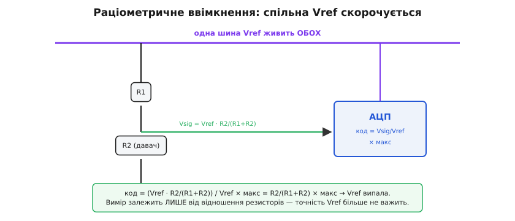

# Калібрування АЦП зовнішньою опорою: лагодимо лінійку, якою міряємо

Ми вже не раз заводили аналоговий сигнал на [АЦП](book:electronics/adc) — і при [зчитуванні сигналу взагалі](root:embedded/signal-acquisition), і коли [читали ногу CC через дільник](root:embedded/usb-cc-adc-circuit). Щоразу ми мовчки припускали, що коли АЦП повертає код, то цей код чесно перекладається у вольти. Настав час спинитися на цьому припущенні, бо саме в ньому ховається похибка, через яку добрий прилад показує погані числа. Питання просте на вигляд і глибоке по суті: **проти чого** АЦП міряє — і що робити, коли ця мірка сама бреше.

## АЦП не міряє вольти — він міряє частку

Найперше, що треба перелаштувати в голові: АЦП **не вміє** міряти вольти в абсолюті. Усе, що він робить, — порівнює вхідну напругу з [опорною напругою (*reference*, Vref)](book:electronics/voltage-reference) і каже, **яку частку** від неї становить вхід. Уся його робота вкладається в одне відношення:

```
код = (Vin / Vref) × макс
```

де `макс` — найбільший код (для 12-бітного АЦП це 4095). Звідси випливає річ, повз яку легко проскочити: **Vref — це лінійка, якою АЦП міряє світ**, а код — лише число поділок. Якщо ти не знаєш довжини лінійки точно, то код у тебе є, а перевести його у вольти ти не можеш — бракує самої одиниці виміру.

Тепер уявімо, що лінійка не та, за яку ми її маємо. Прошивка свято вірить, що Vref = 3.30 В, і ділить на це число. А насправді опора в цьому конкретному чипі — 3.47 В. Що станеться? Той самий вхід дасть той самий код (АЦП однаково порівняв із реальною опорою), але наш переклад коду у вольти буде зсунутий — і зсунутий **однаково для кожного коду по всій шкалі**.


*Та сама нога, той самий код 2048 — але з реальною опорою 3.47 В замість заявлених 3.30 В переклад у вольти зсунутий на +5 % по всій шкалі. Помилка Vref — це не випадковий шум, а систематичний нахил лінійки: однаковий і внизу, і вгорі діапазону.*

Ось чому ця похибка така підступна. Вона не «шумить» — її не прибереш [усередненням](root:embedded/noise-interference), бо вона стала. Вона тихо зсуває **кожен** твій вимір на 5 %, і на макеті це непомітно, бо немає з чим звірити. А потім готовий прилад показує напругу батареї «4.0 В» замість 3.81 В, термометр на тому самому АЦП дає +26°C замість +25, і ти годинами шукаєш помилку в коді, якої там нема: помилка — у лінійці.

> 🔧 **Навіщо це.** Будь-який вимір абсолютної величини через АЦП — напруги живлення, струму через шунт, температури з аналогового давача — точний рівно настільки, наскільки точно відома Vref. Дешевий мікроконтролер на кшталт ESP32 живить АЦП внутрішньою опорою, заявленою як 1.1 В, а реально вона гуляє від чипа до чипа в межах **1.0…1.2 В** — це до ±10 % розкиду «з коробки». Поки не приборкаєш Vref, твій 12-бітний АЦП дає точність гірше за 4-бітну незалежно від кількості розрядів.

## Дві дороги до правди: знати опору або обійтися без неї

Якщо вся біда в лінійці, то й рішень логічно два, і вони принципово різні.

**Перша дорога — зробити лінійку точною.** Замінити неточну внутрішню опору на зовнішню, спеціально для цього зроблену мікросхему опорної напруги — і тоді знаменник у нашій формулі стає твердим числом, якому можна вірити. Це шлях туди, де потрібен **абсолютний** вимір: «скільки саме вольтів на вході».

**Друга дорога — побудувати вимір так, щоб лінійка випала з відповіді взагалі.** Звучить як фокус, але це найелегантніший прийом у всій аналоговій практиці: якщо і сигнал, і АЦП беруть **ту саму** Vref, вона входить і в чисельник, і в знаменник — і скорочується. Тоді точність опори перестає важити зовсім. Це шлях туди, де нам потрібне **відношення**, а не абсолют.

Розберімо обидві — спершу як домогтися хорошої опори, тоді як від неї звільнитися, і насамкінець що робити, коли поміняти опору не можна й лишається лагодити її програмно.

## Перша дорога: зовнішня опора замість внутрішньої

Зовнішня опорна напруга — це окрема [мікросхема, єдине завдання якої — тримати на виході незмінну, точно відому напругу](book:electronics/voltage-reference) попри зміни живлення, навантаження й температури. Замість того щоб ділити на хитку внутрішню опору, ми заводимо вихід такої мікросхеми на спеціальний вивід `VREF+` (або `AREF`) мікроконтролера й кажемо АЦП: «ось твоя лінійка». Тепер `Vref` у формулі — це не «десь біля 1.1 В», а, скажімо, 2.500 В із похибкою 0.05 % і дрейфом одиниці частин на мільйон на градус.

Що це міняє на практиці? Переклад коду у вольти стає прямим і чесним:

```c
// Зовнішня опора 2.500 В на VREF+, 12-бітний АЦП.
#define VREF_MV   2500U      // паспортне значення мікросхеми опори, мВ
#define ADC_MAX   4095U

uint32_t adc_code_to_mv(uint16_t code) {
    return ((uint32_t)code * VREF_MV) / ADC_MAX;   // прямий переклад у мВ
}
```

Тут немає жодного калібрування — і саме в цьому суть. Ми не виправляємо лінійку, ми **поставили завідомо точну**. Платимо за це грошима (мікросхема опори коштує) і місцем на платі, а ще тим, що така опора часто нижча за живлення (2.5 В при 3.3 В живлення), тож частина діапазону входу втрачається. Натомість дістаємо вимір, який сходиться між різними платами однієї партії без жодного підлаштування кожної окремо.

Окрема тонкість, про яку легко забути: опора має бути **тихою**. Будь-який [шум на лінії Vref прямо домішується до результату](book:electronics/voltage-reference), бо ми ділимо саме на неї — і тремтіння опори стає тремтінням кожного коду. Тому вихід опорної мікросхеми завжди шунтують конденсатором поруч із виводом `VREF+`, а саму опору тримають подалі від імпульсних перетворювачів. Лінійка має бути не лише точною, а й нерухомою.

## Друга дорога: раціометричний вимір, де Vref випадає

Тепер найкрасивіше. Дуже часто нам **не потрібна** абсолютна напруга — нам потрібне відношення. Класичний приклад — резистивний давач у [дільнику](book:electronics/voltage-divider): терморезистор, фоторезистор, тензодавач у мості. Його опір змінюється від вимірюваної величини, і ми хочемо знати саме цю зміну, а не абсолютні вольти на середньому вузлі.

І ось ключове спостереження. Напруга на дільнику — це `Vsig = Vref · R2/(R1+R2)`, **якщо живити дільник від тієї самої Vref, що й АЦП**. Підставмо її в формулу АЦП і подивімося, що буде:



*Якщо і дільник давача, і АЦП беруть опору з однієї шини, Vref входить у чисельник і знаменник — і випадає з відповіді. Код залежить тільки від R2/(R1+R2), тобто від самого давача. Точність і дрейф опори більше не впливають на результат узагалі.*

```
код = Vsig / Vref × макс
код = (Vref · R2/(R1+R2)) / Vref × макс
код = R2/(R1+R2) × макс          ← Vref скоротилася
```

Vref зникла. Код тепер залежить **лише** від відношення резисторів — тобто від самого давача — і йому байдуже, чи опора рівно 3.30 В, чи 3.47 В, чи навіть повільно пливе з температурою. Поки дільник і АЦП живляться з однієї точки, їхній спільний дрейф гаситься сам собою. Це й зветься **раціометричним** вимірюванням (лат. *ratio* — відношення): міряємо не абсолют, а частку, і частці однаково, якою лінійкою її прикладати.

> 🔧 **Навіщо це.** Раціометрія — це безкоштовне калібрування, вбудоване в саму схему. Замість того щоб ставити дорогу точну опору заради терморезистора, ти живиш його дільник від того самого `3V3`, що годує АЦП, — і похибка опори, яка мучила б абсолютний вимір, просто зникає з рівняння. Більшість промислових мостових давачів (тензо, тиску) для цього й розраховані: їхній вихід — це частка живлення, і читати їх треба раціометрично. Помилка новачка — завести такий давач на точну окрему опору й здивуватися, чому покази «плавають» від коливань живлення моста.

Межа в раціометрії одна, і її варто назвати чесно: вона рятує лише тоді, коли вимірювана величина **справді** є відношенням до Vref. Виміряти так напругу батареї не вийде — батарея живе своїм життям, її вольти не прив'язані до опори АЦП. Для абсолютних величин повертаємося до першої дороги: точна відома опора.

## Третя дорога: поміняти опору не можна — калібруємо програмно

Найчастіший у житті випадок: плата вже є, зовнішньої опори на ній не передбачено, АЦП живиться внутрішньою — хиткою — опорою, і додати мікросхему нікуди. Лишається третій шлях: **виміряти, наскільки лінійка крива, і виправити це в коді**. Це і є калібрування у вузькому сенсі.

Працює воно тому, що похибка Vref — **систематична**: вона стала й однакова від виміру до виміру. Раз виміривши, наскільки реальна опора відрізняється від заявленої, ми можемо вносити поправку в кожен наступний код назавжди. Спосіб — **калібрування за двома точками**.

Подаємо на вхід АЦП дві **точно відомі** напруги — скажімо, 0.500 В і 3.000 В з еталонного джерела чи перевіреного дільника — і читаємо, які сирі коди видав АЦП. Якби лінійка була ідеальна, ці коди лягли б точно на теоретичну пряму. А вони лягають трохи інакше: зсунуто й з іншим нахилом. Через дві виміряні точки проводимо пряму — і ця пряма стає нашим чесним перекладом «код → вольти».


*Дві відомі напруги дають дві точки на характеристиці; пряма крізь них задає переклад код→вольти. Її вільний член лагодить зсув нуля, а нахил — похибку масштабу (саме її дає неточна Vref). Дві точки виправляють обидві систематичні похибки разом.*

Чому саме дві точки, а не одна? Бо насправді ми лагодимо одразу дві [систематичні похибки АЦП](book:electronics/adc-errors): **зсув нуля** (характеристика починається не з нуля) і **похибку масштабу** (неправильний нахил — а саме його й дає крива Vref). Пряму однозначно задають рівно дві точки: одна полагодила б лише зсув, лишивши нахил кривим. Дві точки беруть, по змозі, ближче до країв робочого діапазону — тоді пряма найточніше лягає там, де ти реально міряєш.

Сам розрахунок — це проста лінійна алгебра. Маємо дві пари (код, істинна напруга) і шукаємо нахил `k` та зсув `b` прямої `вольти = k · код + b`:

```c
// Калібрування за двома точками. Пари виміряні раз і збережені (напр. у NVS/flash).
//   (code_lo, V_LO) і (code_hi, V_HI) — сирий код і ВІДОМА напруга в мВ.
typedef struct { int32_t k_num, k_den, b_mv; } adc_cal_t;   // k як дріб, щоб без float

void adc_cal_build(adc_cal_t *c, int32_t code_lo, int32_t V_LO,
                                  int32_t code_hi, int32_t V_HI) {
    c->k_num = V_HI - V_LO;            // приріст напруги
    c->k_den = code_hi - code_lo;      // приріст коду
    c->b_mv  = V_LO - (c->k_num * code_lo) / c->k_den;   // зсув: де пряма січе нуль коду
}

int32_t adc_cal_apply(const adc_cal_t *c, int32_t code) {
    return (c->k_num * code) / c->k_den + c->b_mv;       // сирий код → калібровані мВ
}
```

Виміряні `code_lo` і `code_hi` записують **раз** — на конвеєрі або при першому ввімкненні — у незалежну пам'ять (flash чи NVS), і далі кожен робочий вимір проганяють через `adc_cal_apply`. Лінійку ми не випрямили фізично, але тепер **знаємо**, наскільки вона крива, і вносимо точну поправку.

**Worked-приклад. На скільки бреше неоткалібрований АЦП ESP32.**

```
АЦП ESP32, 12 біт (макс = 4095), заявлена Vref = 1.100 В.
Подаємо точно відомі 0.800 В і читаємо сирий код.

Якби Vref була рівно 1.100 В:
   очікуваний код = 0.800 / 1.100 × 4095 ≈ 2978

Але в цьому чипі реальна Vref = 1.060 В (типовий розкид).
АЦП ділить на СВОЮ реальну опору, тож код виходить:
   код = 0.800 / 1.060 × 4095 ≈ 3090

Прошивка ж вірить у 1.100 В і перекладає назад:
   «напруга» = 3090 / 4095 × 1.100 = 0.830 В

Помилка = 0.830 − 0.800 = +0.030 В = +3.8 %  ← на КОЖНОМУ вимірі.

Калібрування за двома точками виправляє це назавжди:
   знаючи реальну пару (код 3090 ↔ 0.800 В), будуємо пряму,
   яка перекладає 3090 у точні 0.800 В — і так по всьому діапазону.
```

Висновок: +3.8 % систематичної брехні з'являються не через шум і не через поганий код, а лише через те, що реальна опора на 40 мВ нижча за заявлену. Один раз виміряти й полагодити — і той самий АЦП починає давати числа, яким можна вірити.

## Виробники це знають: заводське калібрування

Тут варто додати важливу річ, яка економить багато роботи: серйозні виробники мікроконтролерів **уже** виміряли опору кожного чипа на заводі й поклали поправку всередину.

ESP32 несе своє калібрування в одноразово програмованій пам'яті чипа (eFuse — крихітні плавкі біти, які прошивають раз на заводі): там записано або справжню Vref конкретного чипа, або пару точок (заводські покази на 150 мВ і 850 мВ), і драйвер `esp_adc_cal` бере точніше з доступного, відкочуючись на типові 1100 мВ лише там, де заводських даних нема. STM32 робить інакше, але в тому ж дусі: на заводі він міряє сирий код своєї внутрішньої опори `VREFINT` за відомих умов (живлення `VREF+` 3.0 В для нових сімейств, 30°C) і кладе це число `VREFINT_CAL` за фіксованою адресою у flash. Прошивка потім читає `VREFINT` у роботі й через відношення до заводського значення обчислює **реальне** живлення `VDDA` — фактично безкоштовну зовнішню опору з самого чипа. Звідки взялася сама ідея класти точну опору в кремній і чому це виявилося складною задачею — у [нарисі про опорну напругу й винахід bandgap-опори](book:electronics/voltage-reference/hist-bandgap.md).

Звідси практичне правило, з якого варто починати завжди: **спершу ввімкни заводське калібрування, яке вже є**. На ESP32 — користуйся `adc_cali`-драйвером, а не сирим кодом; на STM32 — рахуй напругу через `VREFINT_CAL`. Своє калібрування за двома точками лишай на випадки, коли заводського нема (дешеві 8-бітні чипи) або коли потрібна точність вища за паспортну.

## Як обрати дорогу

Три шляхи — не альтернативи на смак, а відповіді на різні запитання, і вибір диктує сама задача.

Якщо вимірюване — **відношення до живлення** (резистивний давач, міст), бери раціометрію: живи давач і АЦП з однієї точки, і Vref випаде з відповіді сама. Це найдешевше й найнадійніше, коли підходить.

Якщо потрібен **абсолютний** вимір помірної точності й на платі є заводське калібрування, увімкни його — і цього зазвичай досить. Якщо заводського нема або точність потрібна вища, додай **калібрування за двома точками** й тримай поправку в пам'яті.

Якщо ж потрібен абсолютний вимір **високої** точності, що сходиться між платами без підлаштування кожної, став **зовнішню опорну мікросхему** на `VREF+` — і плати за це грошима, місцем і частиною діапазону. Лінійка, у яку віриш, або робиться точною, або скорочується з рівняння; третього не дано.

І остання межа цієї теми. Усе сказане лагодить **сам АЦП** — його лінійку. Але між фізичною величиною (температурою, тиском, силою) і ногою АЦП стоїть ще давач зі своєю окремою кривизною: його нуль зсунутий, його чутливість не паспортна, його характеристика гнеться. Калібрований АЦП дає чесні **вольти** — але перевести ці вольти в чесні **градуси чи паскалі** — це вже інша задача, [калібрування самого давача](root:embedded/calibration-procedure), яку ми візьмемо наступним кроком. Тут ми випрямили лінійку; далі навчимо її показувати правильні одиниці.
