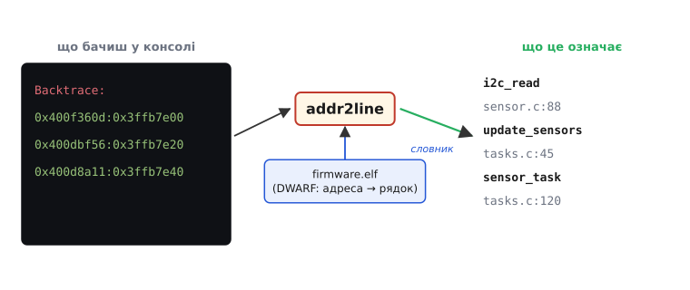
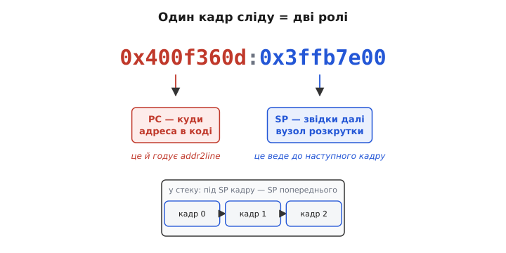
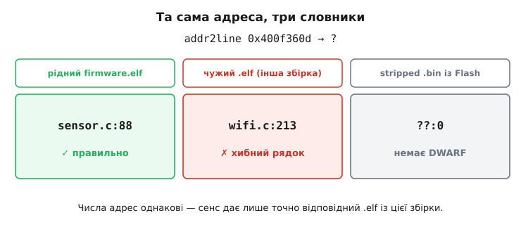
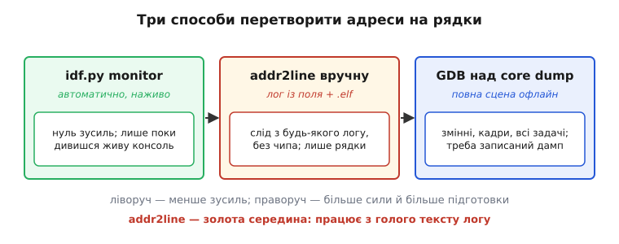

# Декодування адрес аварії: addr2line та символи

Уявімо найчастіший спосіб, у який вбудований пристрій повідомляє про свою смерть. Не елегантна GDB-сесія з кадрами й змінними, а кілька рядків голих чисел у моніторі порту:

```
Guru Meditation Error: Core 0 panic'ed (StoreProhibited). Exception was unhandled.
Backtrace: 0x400f360d:0x3ffb7e00 0x400dbf56:0x3ffb7e20 0x400d8a11:0x3ffb7e40
```

І все. Жодного імені функції, жодного рядка коду — самі шістнадцяткові адреси. Пристрій упав, виплюнув цей слід у UART і перезавантажився. Питання просте й невідкладне: **де саме в коді ховається ця аварія?** Числа `0x400f360d` нікому ні про що не говорять; треба перетворити їх назад на «функція `i2c_read`, файл `sensor.c`, рядок 88». Інструмент, що робить рівно це, зветься **addr2line** (англ. *address to line*, «адреса в рядок») — і він стане нашим містком від мертвого числа до живого коду.

Ми вже бачили дві важчі машини для розслідування аварій. [Жива сесія OpenOCD і GDB](root:embedded/openocd-gdb) дає зазирнути в чип на ходу — але вимагає зонда, підключеного саме в мить збою. [Посмертний core dump](root:embedded/core-dump) відв'язує розбір від збою в часі — але вимагає заздалегідь налаштованого розділу у Flash і місця, куди дамп устигне записатися. А що, коли нічого з цього нема? Пристрій у полі, зонда поряд немає, core dump не ввімкнули — і єдине, що лишилося, — ось цей рядок `Backtrace:`, який система друкує **завжди й безкоштовно**. Саме тут addr2line незамінний: він видобуває максимум сенсу з мінімуму даних — з одного рядка тексту, скопійованого з логу.

## Чому адреса, а не ім'я

Спершу варто зрозуміти, **чому** пристрій узагалі друкує числа, а не одразу імена. Здавалося б, нехай би сам сказав `i2c_read`, і морока зникла б. Але імен функцій усередині працюючого чипа просто **немає**.

Коли тулчейн [збирає прошивку](topic:sf-lang/compilation), імена функцій і змінних потрібні лише компілятору й компонувальнику — щоб з'єднати шматки коду між собою. У готовому машинному коді на їхньому місці лишаються самі **адреси**: процесор не знає слова `i2c_read`, він знає «перейти за адресою `0x400f360d` і виконувати код звідти». У Flash лягає `.bin` — голий образ із машинних кодів і числових адрес, без жодного символу. Тож обробник паніки, який друкує слід, **фізично не має чим** назвати функцію: у нього під рукою лише адреси з регістрів процесора. Він і друкує те, що має.

Сенс не зник — він просто живе не в чипі, а в окремому файлі. Поряд із `.bin` тулчейн лишає `.elf` (англ. *Executable and Linkable Format*) — той самий код, але з повною **таблицею символів** і відлагоджувальною інформацією: яка адреса якій функції належить, якому рядку якого `.c`-файлу відповідає. Цей зв'язок — `.elf` як словник для мертвих чисел — ми вже бачили в [роботі OpenOCD і GDB](root:embedded/openocd-gdb); addr2line користується тим самим словником, тільки без живого чипа й без GDB взагалі.

> 🔧 **Навіщо це.** Розуміння «у Flash — числа, сенс — в `.elf`» рятує від першої й найдурнішої пастки: спроби «прочитати» імена прямо з пристрою. Їх там нема й бути не може. Усе, що пристрій може дати в полі, — це адреси; робота інженера — зберегти `.elf` кожної випущеної збірки, щоб було чим ці адреси розшифрувати. Викинув `.elf` — і слід аварії назавжди лишиться купою чисел.



*Уся ідея в одному кадрі. Ліворуч — те, що дає пристрій: рядок `Backtrace:` з пар голих адрес, жодного сенсу. По центру — addr2line, що бере цей рядок і `.elf` тієї самої збірки за словник (DWARF перекладає адресу на рядок коду). Праворуч — той самий слід, уже розшифрований на функції та файли з номерами рядків. Чип для цього не потрібен — лише текст логу й правильний `.elf`.*

## Що таке DWARF і чому без `-g` нічого не вийде

Таблиця символів дає лише імена функцій. Щоб дістати ще й **номер рядка** у `.c`-файлі, потрібна окрема, набагато детальніша мапа — і вона зветься **DWARF** (жартівлива назва-перевертень до формату об'єктних файлів *ELF*: «ельф» і «гном» поряд; розшифрування *Debugging With Attributed Record Formats* придумали згодом, щоб абревіатура щось значила). DWARF — це стандартний формат відлагоджувальних даних, який компілятор кладе в `.elf`, коли його про це попросити. Усередині — докладна відповідність: діапазон адрес `0x400f3600…0x400f3620` відповідає рядкам 86–90 файлу `sensor.c`, ось ця змінна лежить за таким зсувом у стеку, ця функція вбудована (inlined) ось у ту. Саме цей шар читає addr2line, обертаючи адресу на «файл:рядок».

Звідси випливає **умова без винятків**: DWARF з'являється в `.elf`, лише якщо код зібрано з прапорцем `-g` (від англ. *generate debug info*). Зберете без нього — `.elf` матиме хіба голі імена функцій, і addr2line на запит про рядок чесно відповість порожнечею:

```
?? ??:0
```

Подвійний знак питання замість імені, нуль замість рядка — це addr2line каже «у мене немає DWARF для цієї адреси». Та сама відповідь чекає, якщо `.elf` **обрізали** від відлагоджувальних даних (англ. *stripped*, «обчищений») заради меншого розміру. Хороша новина: DWARF лежить **тільки в `.elf` на хості** й **не потрапляє у Flash** — він нічого не коштує пристрою. Тому правило просте: збирай завжди з `-g`, у Flash однаково їде голий `.bin`, а товстий `.elf` з усім DWARF дбайливо клади в архів. В ESP-IDF про це турбуватися майже не треба — стандартна збірка вже містить відлагоджувальну інформацію, а `.elf` лежить у теці `build/`.

## Анатомія сліду: чому в кадрі два числа

Повернімося до рядка з прикладу й роздивімося його уважніше:

```
Backtrace: 0x400f360d:0x3ffb7e00 0x400dbf56:0x3ffb7e20 0x400d8a11:0x3ffb7e40
```

Кожен кадр (англ. *frame*, один щабель у ланцюгу викликів) записано **парою** чисел через двокрапку. Чому двома, а не одним? Бо кожне відповідає на своє питання, і обидва потрібні, щоб розмотати стек до кінця.

Перше число пари — **PC** (англ. *program counter*, «лічильник команд»): адреса в коді, де перебувало виконання на цьому щаблі. Це і є те, що годує addr2line, — саме PC він перекладає на функцію й рядок. Друге число — **SP** (англ. *stack pointer*, «вказівник стека»): де в той момент стояла вершина стека цього кадру. Сам собою для пошуку рядка SP не потрібен; addr2line його ігнорує. Але він — **вузол розкрутки** (англ. *unwinding*, «розмотування» стека назад): саме завдяки ланцюжку SP обробник паніки взагалі зміг пройти стеком від місця збою назад до входу в задачу й зібрати весь слід.

Тут варто знати особливість процесора Xtensa, на якому стоїть класичний ESP32. Він має **віконний регістровий ABI** (англ. *windowed register ABI*): при виклику функції процесор не зберігає регістри в пам'ять, а «прокручує» апаратне вікно регістрів — швидко й дешево. Адреса повернення лежить у регістрі `a0`, вказівник стека — в `a1` (він же `sp`). Платою за швидкість є те, що зберігач стека стає тоншим: вказівник на стек **попереднього** кадру кладеться в пам'ять **під поточним SP**. Тому, щоб розмотати стек, обробник іде по SP від кадру до кадру — і якщо SP десь зіпсовано (наприклад, [переповненням стека задачі](topic:sf-devices/hardfault)), ланцюг обривається або веде в нікуди, а слід виходить неповним чи відверто хибним. Знати це корисно: «дивний» backtrace, що впирається в безглузду адресу, часто означає не загадковий баг, а просто розтрощений стек.

> 🔧 **Навіщо це.** На практиці з пари беруть **ліве** число — PC. Саме його суне в addr2line; праве (SP) у щоденній роботі не потрібне. Та коли слід раптом «не сходиться» — функції в ньому не викликають одна одну за логікою програми, — пам'ятай про SP і віконний ABI: найімовірніша причина не в addr2line, а в тому, що стек було пошкоджено ще до друку, і обробник розмотав уже сміття.



*Чому в кадрі два числа. Ліва половина пари — PC, адреса в коді: це й годує addr2line, обертаючись на функцію та рядок. Права — SP, вузол розкрутки: під ним у стеку лежить SP попереднього кадру, і саме цей ланцюжок дозволяє обробнику паніки пройти стек назад. Для пошуку рядка потрібен лише PC; SP важливий тоді, коли слід обірвався, — зіпсований SP розриває розкрутку.*

## Ручний прохід: від рядка логу до рядка коду

Тепер найголовніше — як це робиться руками, бо саме цей шлях рятує, коли пристрій далеко. Інструмент addr2line — частина **GNU binutils**, набору утиліт тулчейну; для кожного цільового процесора є своя збірка під відповідним префіксом. Для класичного ESP32 це `xtensa-esp32-elf-addr2line`, для ESP32-S3 — `xtensa-esp32s3-elf-addr2line`, для процесорів RISC-V (ESP32-C3, C6) — `riscv32-esp-elf-addr2line`. Префікс важливий: інструмент мусить розуміти архітектуру того `.elf`, який йому дають. Походження самого addr2line — окрема невелика історія, варта погляду: [хто й навіщо зробив addr2line](root:embedded/addr2line-workflow/hist-binutils-addr2line.md).

Найпростіший виклик — одна адреса з кадру:

```bash
xtensa-esp32-elf-addr2line -e build/firmware.elf 0x400f360d
```

Прапорець `-e` (від англ. *executable*) каже, який файл узяти за словник. Відповідь — рядок коду:

```
/home/dev/proj/main/sensor.c:88
```

Уже корисно, але голо. На практиці addr2line викликають із жменею прапорців, що роблять вивід насправді читабельним. Той самий набір, який ESP-IDF використовує автоматично, — `-pfiaC`:

```bash
xtensa-esp32-elf-addr2line -pfiaC -e build/firmware.elf 0x400f360d
```

Кожна літера додає свій шар сенсу:

```
-p   pretty-print: один охайний рядок на адресу замість двох
-f   function: показати ще й ім'я функції, не лише файл
-i   inlined: розгорнути вбудовані функції (інакше їх не видно)
-a   address: повторити саму адресу на початку — щоб не загубитись
-C   demangle: розплутати «понівечені» імена C++ назад у людські
```

Тепер вивід самодостатній:

```
0x400f360d: i2c_read at /home/dev/proj/main/sensor.c:88
```

Окремо вартий уваги прапорець `-i` (розгортання вбудованих функцій). Компілятор часто **вставляє** тіло маленької функції прямо в місце виклику (англ. *inlining*) заради швидкості. Без `-i` addr2line покаже лише ту функцію, у яку вбудовано, — і ти шукатимеш баг не там. З `-i` він чесно розгорне весь ланцюг вставлянь, додавши рядки `(inlined by)`, і ти побачиш справжнє місце. На оптимізованій прошивці (а вбудований код майже завжди зібрано з оптимізацією) це різниця між «знайшов за хвилину» і «півдня дивлюся не в той файл».

Декодувати ввесь слід за раз так само просто — addr2line бере хоч скільки адрес поспіль:

```bash
xtensa-esp32-elf-addr2line -pfiaC -e build/firmware.elf \
    0x400f360d 0x400dbf56 0x400d8a11
```

```
0x400f360d: i2c_read at main/sensor.c:88
0x400dbf56: update_sensors at main/tasks.c:45
0x400d8a11: sensor_task at main/tasks.c:120
```

Ось і ввесь ланцюг аварії, від місця збою донизу: `i2c_read` (де впало) ← `update_sensors` (хто покликав) ← `sensor_task` (звідки все почалося). Числа з логу стали зрозумілою історією — без чипа, без зонда, без GDB. Лише текст і `.elf`.

> 🔧 **Навіщо це.** Запам'ятай `-pfiaC` як одне слово — це робочий набір addr2line для розбору будь-якої аварії. У реальному баг-репорті з поля клієнт надсилає тобі саме рядок `Backtrace:` із логу; ти береш `.elf` тієї версії прошивки з архіву, згодовуєш addr2line ліві числа пар — і за секунди маєш стек із рядками коду. Це найдешевший спосіб розслідування з усіх: ні відрядження, ні відтворення збою на столі.

## Той самий `.elf` — або хибна відповідь

Є одна пастка, що нищить увесь метод тихо й підступно, і про неї треба знати твердо. addr2line **сліпо вірить** тому `.elf`, який йому дали. Він не перевіряє, чи відповідає цей файл прошивці, з якої прилетів слід, — просто бере адресу, шукає її в DWARF цього файлу й видає те, що знайшов. А це означає: дати **не той** `.elf` — не помилка, а **тиха брехня**.

Уявімо ланцюг подій. Прошивку версії, що стоїть у клієнта, зібрали місяць тому. Відтоді код правили, додавали функції — і адреси всіх функцій **з'їхали**: те, що колись було за `0x400f360d`, тепер лежить деінде, а за цією адресою тепер зовсім інша функція. Береш свіжий `.elf`, згодовуєш стару адресу — і addr2line бадьоро відповідає `wifi.c:213`. Рядок існує, виглядає переконливо, ти йдеш його дивитися — і марнуєш години, бо аварія була зовсім не там. Жодного попередження не було: addr2line зробив рівно те, що вмів, над хибним словником.

Звідси **залізне правило**: addr2line має дістати **рівно той `.elf`, що відповідає прошивці у клієнта** — байт у байт тієї збірки. Не «схожий», не «той самий код, перезібраний учора» — саме той. Це той самий зв'язок «образ прошивки ↔ його символи», що критичний і для [посмертного аналізу](root:embedded/core-dump): дамп без рідного `.elf` — купа чисел, а зі схожим-але-не-тим — гірше, ніж купа чисел, бо виглядає правдоподібно.



*Чому словник мусить бути саме той. Та сама адреса, три різні `.elf`. Рідний (тієї самої збірки) дає правильний рядок. Чужий `.elf` з іншої збірки дає рядок, що існує й виглядає переконливо, — але хибний: адреси з'їхали, і це найнебезпечніший випадок, бо нічого не попереджає про обман. Stripped `.bin`, той самий образ, що у Flash, не має DWARF узагалі — чесне `??:0`. Числа адрес скрізь однакові; сенс дає лише точна відповідність.*

Практичний висновок звідси — дисципліна зберігання символів. Кожна збірка, що поїхала до клієнта, мусить лишити по собі заархівований `.elf`, прив'язаний до версії прошивки. Як це організувати по-дорослому — щоб за версією з логу автоматично знаходити потрібні символи й ніколи не плутати збірки, — окрема інженерна тема: [сервер символів і дисципліна збереження `.elf`](root:embedded/addr2line-workflow/proj-symbol-server.md).

## Три способи розшифрувати — і де серед них addr2line

Ручний addr2line — не єдиний спосіб обернути адреси на рядки; це одна точка на смузі за зростанням сили й мороки. Бачити її цілою корисно, щоб у кожній ситуації брати найдешевший достатній інструмент.

На найлегшому кінці — **автоматичне декодування монітором**. Коли дивишся живу консоль через `idf.py monitor`, він робить усю роботу сам: щойно в потоці з'являється шістнадцяткова адреса коду виду `0x4_______`, монітор під капотом кличе той самий `addr2line -pfiaC` із правильним `.elf` із `build/` і дописує розшифровку прямо під слідом, жовтим. Нуль зусиль — але працює, **лише поки ти підключений до живого пристрою** і дивишся його вивід просто зараз.

Посередині — **ручний addr2line**, який ми щойно пройшли. Він потрібен рівно тоді, коли автоматичного декодування не сталося: слід прийшов **текстом** — у баг-репорті, у файлі логу, у месенджері від клієнта, — а живого монітора в той момент не було. Ти береш цей текст і `.elf` із архіву й декодуєш офлайн. Це універсальний робочий інструмент поля: він не потребує ні чипа, ні дампа, лише рядки й словник.

На важкому кінці — **повна GDB-сесія над core dump**. Вона дає не самі рядки, а всю сцену: значення змінних, аргументи кадрів, стан інших задач. Але за це треба платити підготовкою: заздалегідь увімкнений розділ дампа, місце, куди він устиг записатися, і сам файл дампа на руках. addr2line же бере мінімум — голий текст сліду — і дає максимум, що з нього взагалі можна витягти: ланцюг функцій із рядками.



*Три способи перетворити адреси на рядки, від найлегшого до найпотужнішого. Зліва — `idf.py monitor`: декодує сам, наживо, нуль зусиль, але лише поки дивишся живу консоль. По центру — ручний addr2line: працює з голого тексту логу, без чипа, дає рядки коду; це робочий інструмент поля. Справа — GDB над core dump: повна сцена зі змінними й кадрами, але потрібен заздалегідь записаний дамп. Праворуч більше сили — і більше підготовки; addr2line — золота середина, що не вимагає нічого, крім логу й `.elf`.*

## RISC-V: коли рядка `Backtrace:` немає

Усе вище — про Xtensa-ESP32 з його зручним рядком `Backtrace:`. На процесорах RISC-V (ESP32-C3, C6) картина інша, і це варто знати, щоб не розгубитися. Через відмінності архітектури обробник паніки **не друкує** готового рядка пар PC:SP. Замість нього в консоль іде дамп регістрів — найважливіші тут `MEPC` (англ. *machine exception program counter*, адреса інструкції, на якій сталася аварія) і `MTVAL` (адреса, що спричинила збій, — аналог «куди намагалися записати») — а далі сирий вміст стека.

Декодувати окрему адресу однаково просто, лише інструмент інший:

```bash
riscv32-esp-elf-addr2line -pfiaC -e build/firmware.elf 0x42007988
```

`MEPC` дає верхній кадр — місце аварії — за один виклик. Відновити ж повний ланцюг викликів складніше: його доводиться вишукувати серед адрес у дампі стека. На щастя, у щоденній роботі це знову бере на себе `idf.py monitor`: він розбирає дамп стека RISC-V і сам збирає читабельний слід із функціями. Тож для нас практичний висновок такий: інструмент addr2line і набір прапорців `-pfiaC` ті самі на обох архітектурах; різниця лише в **формі сліду**, який пристрій друкує, та в тому, що на RISC-V повний backtrace доводиться відновлювати, а не читати готовим.

> 🔧 **Навіщо це.** Побачивши в логу ESP32-C3 не звичний `Backtrace:`, а дамп регістрів із `MEPC`/`MTVAL` і стовпчик стека, не лякайся, що «слід кудись зник». Він не зник — просто на RISC-V його формат інший. Бери `MEPC`, декодуй `riscv32-esp-elf-addr2line` — і одразу маєш місце аварії; решту ланцюга або витягне монітор, або доведеться пройтися адресами стека вручну.

---

Addr2line закриває останню, найдешевшу ланку інструментарію відлагодження. [Жива сесія GDB](root:embedded/openocd-gdb) потребує зонда в мить збою; [core dump](root:embedded/core-dump) — заздалегідь налаштованої чорної скриньки; а addr2line бере те, що пристрій дає завжди й задарма, — голий рядок адрес у логу — і обертає його на ланцюг функцій із рядками коду. Усі три методи спираються на той самий `.elf` як словник між числом і сенсом, тож над усіма ними висить одне правило: бережи символи кожної випущеної збірки. Знайти, **де** впало, — лише перший крок; що з цим робити далі — як прошивка має реагувати на саму паніку й відновлюватися безпечно — належить уже до [відмовостійкої обробки помилок](topic:sf-apps/error-handling).
