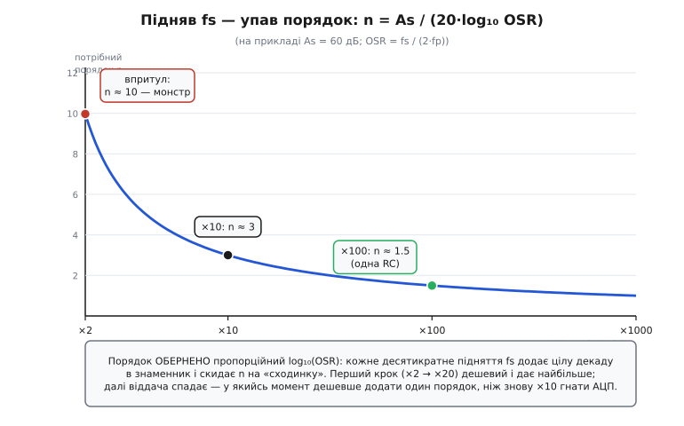
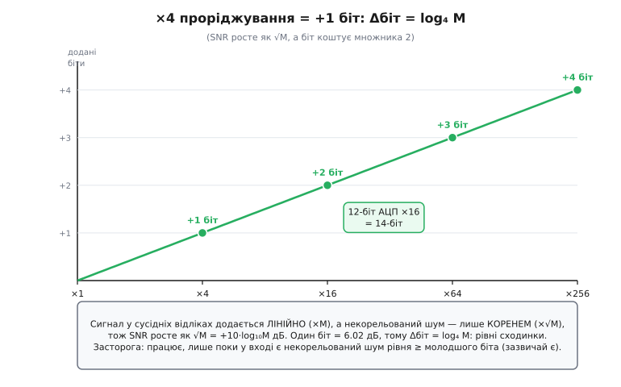

# 🧮 Децибели на стіні Найквіста: порядок, передискретизація і зріз RC у числах

У самому кроці ми домовилися про головне якісно: антиаліасний фільтр мусить дати потрібне придушення **As на стіні Найквіста fs/2 і вище**, а найрозумніший хід — не робити аналогову стіну крутішою, а **відсунути** її, піднявши частоту дискретизації. Ми бачили це на пальцях: «одна декада до стіни — мінус двадцять децибелів, дві декади — мінус сорок». І пообіцяли собі окрему викладку: де саме «декади до стіни» перетворюються на конкретний As, як відношення передискретизації керує потрібним порядком, і за якою формулою ставити зріз єдиної RC-ланки.

Ось вона. Мета не вивчити три формули напам'ять — вони прості, — а **побачити крізь них** один-єдиний важіль. У [формулі порядку](root:embedded/filter-specification/math-order-formula.md) ми вже з'ясували, що порядок шалено чутливий до ширини переходу, бо вона сидить у знаменнику під логарифмом. Тут ми візьмемо той самий апарат, повернемо його тим боком, що дивиться на стіну Найквіста, і доведемо строго те, що в кроці було обіцянкою: **кожне підняття fs дешевшає фільтр**, і дешевшає кількісно передбачувано. А наприкінці порахуємо приємний побічний виграш — скільки «чесних бітів» роздільності докидає проріджування.

> 🔧 **Навіщо це.** Коли ви прикидаєте антиаліас, у голові має бути не «начебто вистачить», а число: стіна на стільки-то декад вище зрізу дає рівно стільки-то децибелів. Маючи ці формули, ви за хвилину на папері скажете, чи закриває задачу одна RC, чи треба піднімати fs, чи вже неминучий активний фільтр — **ще до** того, як відкрити калькулятор фільтрів або запаяти бодай резистор. Це та сама прикидка «на серветці», що в кроці, тільки тепер із виведеним коефіцієнтом, а не з гаслом.

## Означення: придушення на стіні як функція n і fs

Домовмося спершу, про яке саме число йдеться, бо в антиаліасі воно особливе. У звичайній специфікації фільтра ми питаємо: «скільки децибелів дає фільтр на краю затримання fs?» — і край затримання вибираємо самі. В антиаліасі край затримання **прибитий** до стіни Найквіста: усе вище fs/2 складеться вниз і отруїть сигнал, тож саме там і тільки там вимога стає жорсткою. Тому центральна величина всієї цієї вставки — **придушення фільтра на стіні Найквіста**, позначмо його As(fs/2): на скільки децибелів послаблено сигнал на частоті рівно fs/2 порівняно зі смугою пропускання.

Чому ця величина залежить аж від двох речей — і від порядку n, і від самої частоти дискретизації fs? Бо обидві рухають криву фільтра відносно стіни, але **по-різному**. Порядок n задає **крутість** спаду: скільки децибелів крива набирає на кожну декаду частоти. А fs визначає, **де стоїть стіна** — на скільки декад вище від точки зрізу фільтра вона опинилася. Придушення на стіні — це добуток крутості на відстань: «скільки децибелів за декаду» помножити на «скільки декад до стіни». Дві ручки, що множаться, а не додаються, — звідси й уся сила передискретизації.

> 🔧 **Навіщо це.** Тримайте в голові цей образ множення. Збільшити порядок — це наростити крутість (дорого: ланки, ОП, деталі). Підняти fs — це відсунути стіну далі по тій самій кривій (дешево: цифра в таймері). Оскільки результат — добуток, бракуючі децибели можна добрати **будь-яким** із двох множників, і майже завжди дешевший — другий. Уся інженерія антиаліасу — це вибір, котрий множник крутити.

Перш ніж писати формули, згадаймо одну цеглинку, на якій усе стоїть, — звідки взялося саме «20·n децибелів на декаду».

## Інтуїція: чому один порядок — це рівно 20 дБ на декаду

Ми вже зустрічали це число двічі — і в [родинах фільтрів](root:embedded/filter-families), і у виведенні порядку, — але тут воно стає робочим інструментом, тож варто побачити його корінь, а не взяти гаслом. Звідки береться, що **кожен** порядок додає саме 20 дБ за декаду, ні більше ні менше?

Візьмімо найпростіший фільтр — одну [RC-ланку](topic:electronics/rc-filter), порядок 1. Її коефіцієнт передачі за модулем — це знайомий з [дільника напруги](root:embedded/signal-acquisition) поділ між опором і реактивним опором конденсатора. Реактивний опір конденсатора падає з частотою як 1/(ω·C), тож на високій частоті майже все падіння лягає на резистор, а на конденсатор (тобто на вихід) доходить дедалі менше. Запишімо модуль точно:

```
            1
|H(f)| = ───────────────
         √( 1 + (f/fc)² )      де fc = 1/(2π·R·C) — точка зрізу
```

Прочитаймо її поведінку далеко за зрізом, де й живе вся антиаліасна робота. Коли f ≫ fc, одиниця під коренем стає нехтовною проти (f/fc)², і модуль спрощується до чистої гіперболи:

```
|H(f)| ≈ fc / f          (для f ≫ fc)
```

Ось і вся причина «двадцяти децибелів». Подесятерили частоту — модуль |H| упав удесятеро. А децибел амплітуди — це 20·log₁₀ відношення, тож падіння в десять разів — це рівно −20 дБ. **Одна** декада частоти → −20 дБ. Це не емпіричне правило, а пряме читання формули: модуль за зрізом обернено пропорційний частоті, а кожна декада — це множник десять.

> Чому 20, а не 10. Децибел амплітуди (напруги) — це 20·log₁₀, а децибел потужності — 10·log₁₀, бо потужність ~ квадрат амплітуди й логарифм подвоює показник. Фільтр ми міряємо за амплітудою сигналу, тож наша монета — 20·log₁₀; падіння амплітуди вдесятеро = −20 дБ. Звідки взялася сама одиниця й чому множників два — [децибели](topic:electronics/decibels).

Тепер крок до довільного порядку. Фільтр порядку n далеко за зрізом поводиться так, ніби його модуль ~ (fc/f)ⁿ — степінь n замість першого степеня (це видно вже з [означення Баттерворта |H|² = 1/(1+(f/fc)^(2n))](root:embedded/filter-specification/math-order-formula.md): далеко за зрізом одиниця зникає, лишається (fc/f)ⁿ під коренем потужності). А степінь n у логарифмі виходить множником:

```
20·log₁₀( (fc/f)ⁿ ) = n · 20·log₁₀(fc/f)
```

Тобто кожен порядок просто **домножує** нахил на себе: один порядок — 20 дБ/декаду, два — 40, чотири — 80, вісім — 160. Звідси й беруть гасло «20·n дБ/декаду». Важлива засторога, яку ми вже зробили в [специфікації](root:embedded/filter-specification): це **асимптота** — нахил *далеко* за зрізом. Поблизу зрізу крива ще полога й реальне придушення менше за асимптотичне. Для антиаліасу це нам зазвичай на руку: стіну ми ставимо на цілі декади вище зрізу, де фільтр давно вийшов на асимптоту, і гасло працює чесно. Але якщо стіна близько до зрізу — пам'ятайте, що формула трохи завищить придушення, і беріть запас.

## Формальний апарат: придушення на стіні в децибелах

Тепер зберімо означення й інтуїцію в одну формулу. Введімо одну зручну величину — **число декад від зрізу до стіни Найквіста**. Зріз фільтра стоїть на fc, стіна — на fs/2, відстань між ними в декадах — це десятковий логарифм їхнього відношення:

```
D = log₁₀( (fs/2) / fc )        // скільки декад від зрізу до стіни
```

Це і є «скільки декад до стіни» з кроку, тепер записане числом. Одна декада — D = 1, дві декади — D = 2, півтори — D = 1.5. Помножмо число декад на крутість 20·n дБ за декаду — і отримаємо придушення фільтра порядку n на стіні Найквіста:

```
As(fs/2) ≈ 20 · n · D = 20 · n · log₁₀( (fs/2) / fc )      [дБ]
```

Ось вона, центральна формула вставки, і в ній — обидві ручки, про які ми говорили. Множник **n** — крутість; множник **D = log₁₀((fs/2)/fc)** — відстань до стіни, і саме в нього входить fs. Підняли fs — стіна fs/2 поїхала вище, D зріс, придушення зросло, **тим самим фільтром** (той самий n, той самий fc). Це і є строге формулювання «відсунути стіну»: As на стіні росте з логарифмом частоти дискретизації.

Перевірмо формулу на двох числах із кроку, щоб переконатися, що вона дає рівно те, що ми там прикидали на пальцях. Одна RC (n = 1), зріз fc = 100 Гц:

```
fs = 2 кГц,  стіна fs/2 = 1000 Гц:
   D = log₁₀(1000/100) = log₁₀(10) = 1.0 декади
   As = 20 · 1 · 1.0 = 20 дБ              ← рівно як у кроці: одна декада, −20 дБ

fs = 20 кГц,  стіна fs/2 = 10000 Гц:
   D = log₁₀(10000/100) = log₁₀(100) = 2.0 декади
   As = 20 · 1 · 2.0 = 40 дБ             ← рівно як у кроці: дві декади, −40 дБ
```

Формула відтворює обидва числа кроку до децибела. Але тепер у нас не два окремі приклади, а **закон**, який працює на будь-яких n, fc і fs. Наприклад, активний фільтр четвертого порядку (n = 4) із зрізом fc = 100 Гц і скромною стіною fs/2 = 1000 Гц (лише одна декада!) дасть As = 20·4·1 = 80 дБ — там, де одна RC дала б лише 20. Крутість і відстань множаться: чотири порядки витискають із однієї декади стільки, скільки одна ланка — з чотирьох.

> 🔧 **Навіщо це.** Ця формула — ваш кишеньковий антиаліасний калькулятор. Знаєте троє з чотирьох — четверте випадає одразу. «Маю одну RC і стіну на півтори декади — скільки дам?» → 20·1·1.5 = 30 дБ. «Треба 60 дБ однією ланкою — на скільки декад відсунути стіну?» → D = 60/20 = 3 декади, тобто fs/2 = 1000·fc. «Стіна стоїть на дві декади, треба 80 дБ — який порядок?» → n = 80/(20·2) = 2. Жодного калькулятора фільтрів — три множники й ділення.

## Розв'язуємо формулу в обидва боки: потрібний порядок і потрібна стіна

Корисність формули в тому, що її легко розгорнути під будь-яке з трьох невідомих. Інженер рідко питає «скільки дасть фільтр»; частіше він знає **потрібний** As і шукає, чим його дати — порядком чи частотою. Розв'яжімо обидва практичні випадки.

**Який порядок потрібен**, якщо стіна вже стоїть (fs і зріз fc задані), а треба досягти заданого As. Ділимо формулу на крутість і беремо стелю до цілого, бо порядок мусить бути цілим:

```
        As
n ≥ ────────────         і округлюємо вгору (стеля)
     20 · D

   де D = log₁₀( (fs/2) / fc )
```

**Яку стіну** (а отже, яку fs) треба поставити, щоб обійтися заданим — зазвичай малим — порядком n (часто n = 1, одна RC). Розв'язуємо відносно D, тоді відновлюємо fs:

```
        As
D ≥ ────────────         (потрібно стільки декад від зрізу до стіни)
     20 · n

стіна:   fs/2 ≥ fc · 10^D          отже   fs ≥ 2 · fc · 10^(As/(20·n))
```

Ці дві формули — два боки одного вибору. Перша каже, **скільки коштуватиме залізо**, якщо ви не хочете чіпати частоту дискретизації. Друга каже, **наскільки треба пришвидшити АЦП**, якщо ви хочете залишити залізо найдешевшим. Майже завжди дешевша друга: підняти fs — це число в регістрі таймера, а наростити порядок — це гора деталей. Тому в антиаліасі правильний рефлекс — розв'язувати формулу відносно fs, а не відносно n.

**Приклад в обидва боки.** Повільний давач, корисна смуга fp = 20 Гц, наводка сильна — треба As = 60 дБ на стіні. Хочемо обійтися однією RC (n = 1) зі зрізом fc = 60 Гц (утричі вище сигналу — сигнал цілий). Питаємо: яка fs потрібна?

```
n = 1,  As = 60 дБ:
   D = As/(20·n) = 60/20 = 3 декади
   стіна fs/2 = fc · 10³ = 60 · 1000 = 60 000 Гц
   fs = 120 кГц
```

Сто двадцять кілогерц заради давача на 20 Гц виглядає дико — але це чесна ціна вимоги «60 дБ однією RC». Якщо такий fs зависокий для нашого АЦП, формула одразу показує альтернативу: лишити помірний fs = 6 кГц (стіна 3 кГц, D = log₁₀(3000/60) = 1.7 декади) і добрати порядком — n ≥ 60/(20·1.7) ≈ 1.76, тобто **n = 2** (дві RC або активний фільтр другого порядку). Одна формула, дві дороги, і ви бачите ціну кожної: або вчетверо-вп'ятеро швидший АЦП, або вдвічі складніший фільтр. Що дешевше у вашій системі — те й беріть; головне, що вибір тепер не на око, а в числах.

## Відношення передискретизації: чому підняття fs опускає порядок

Тепер найважливіше — зв'язати все це з тим, чим інженери справді оперують у проєктуванні антиаліасу: з **відношенням передискретизації** OSR (англ. *oversampling ratio*). Ми вели лінію через зріз fc, бо так наочніше для однієї RC. Але fc — це деталь конкретного фільтра, а от ширина перехідної смуги, у яку фільтр мусить упасти, задається двома **зовнішніми** частотами: краєм корисного сигналу fp і стіною fs/2. Їхнє відношення й називають передискретизацією.

**Відношення передискретизації** — це у скільки разів стіна Найквіста вища за край корисної смуги:

```
OSR = (fs/2) / fp = fs / (2·fp)
```

Сенс прямий: OSR = 1 означає, що ми оцифровуємо рівно на межі теореми Котельникова (fs = 2·fp), стіна стоїть впритул до сигналу — затиск максимальний. OSR = 10 означає, що стіна вдесятеро вище краю сигналу — між корисним і стіною океан місця. Це те саме «відсунути стіну» з кроку, але виражене безрозмірним числом, яке зручно тримати в голові як міру комфорту антиаліасу.

> 🔧 **Навіщо це.** OSR — перше число, яке варто порахувати, щойно ви взялися за антиаліас. OSR близьке до одиниці — готуйтеся до високого порядку або одразу шукайте, як підняти fs. OSR у десятки — задача тривіальна, вистачить RC. Один поділ fs на 2·fp одразу каже, монстр у вас вийде чи дрібничка; це той самий «погляд на відношення», що ми радили в кроці, тепер з іменем і формулою.

Тепер свяжімо OSR із потрібним порядком — і побачимо строго, **чому** підняття fs опускає n. Ключ у тому, що перехідна смуга фільтра тягнеться від fp до fs/2, тобто її ширина в **декадах** — це логарифм відношення країв, а це відношення і є рівно OSR:

```
ширина переходу в декадах = log₁₀( (fs/2) / fp ) = log₁₀(OSR)
```

Підставмо це в нашу формулу порядку. Якщо ми ставимо зріз фільтра на самому краю смуги (fc ≈ fp, типовий вибір — щоб не псувати сигнал, але й не марнувати перехід), то число декад від зрізу до стіни D ≈ log₁₀(OSR), і потрібний порядок стає:

```
        As                  As
n ≥ ──────────── = ──────────────────
     20 · D          20 · log₁₀(OSR)
```

Ось де народжується вся магія передискретизації, тепер уже строго. Потрібний порядок **обернено пропорційний логарифму OSR**. Подивіться, що це означає в числах:

```
OSR = 2   (fs впритул, ×2):   log₁₀(2)  = 0.30   →  n ≥ As/(20·0.30) = As/6.0
OSR = 10  (×10):              log₁₀(10) = 1.00   →  n ≥ As/20
OSR = 100 (×100):             log₁₀(100)= 2.00   →  n ≥ As/40
```

Для типового As = 60 дБ це дає n ≥ 10 при OSR = 2, але n ≥ 3 при OSR = 10 і n ≥ 1.5 (тобто n = 2) при OSR = 100. **Десятикратне підняття fs обвалює потрібний порядок утричі** — бо воно додає цілу декаду в знаменник. Це той самий механізм, що ми бачили у [формулі порядку](root:embedded/filter-specification/math-order-formula.md): порядок чутливий до ширини переходу, бо вона в знаменнику під логарифмом. Тільки там ми рухали fs обережно й через [скривлення осі тангенсом](root:embedded/filter-specification/math-order-formula.md); тут, для аналогового антиаліасного фільтра перед АЦП, скривлення немає (фільтр аналоговий, його вісь частот пряма), і зв'язок ще чистіший: гола OSR під логарифмом.


*Чому підняття fs опускає порядок. По горизонталі — відношення передискретизації OSR = fs/(2·fp) у лог-шкалі; по вертикалі — найменший порядок n, що дає As = 60 дБ на стіні. Крива — гіпербола n = As/(20·log₁₀OSR): біля OSR = 2 (оцифровуємо впритул) порядок злітає за десяток, а кожне десятикратне підняття fs скидає його на цілу «сходинку» (÷ зростання логарифма). Праворуч, де OSR у сотні, досить однієї RC. Сама лиш частота дискретизації, а не якість деталей, вирішує, який фільтр вам потрібен.*

Тут варто чесно назвати й **межу** цього важеля, бо в кроці ми лише натякнули на неї. Логарифм росте повільно: щоб скинути порядок на одну ланку (одну декаду D), треба підняти fs **вдесятеро**. Перший крок передискретизації дешевий і дає величезний виграш (з OSR = 2 до OSR = 20 — порядок падає вчетверо), але далі віддача спадає: з OSR = 100 до OSR = 1000 порядок упаде лише ще на третину. Тому передискретизація — чудовий перший хід, але не безмежний: у якийсь момент дешевше додати один порядок аналогового фільтра, ніж знову вдесятеро гнати АЦП. Формула n ≥ As/(20·log₁₀OSR) показує цю точку перелому точно: рахуйте обидві ціни й беріть меншу.

## Зріз однієї RC під заданий As на стіні

Спустімося тепер до найконкретнішого — до номіналів єдиної RC-ланки, бо це той випадок, який трапляється найчастіше (повільний давач, сигма-дельта АЦП). У кроці ми ставили зріз «на око» — вище сигналу, нижче стіни. Тепер виведемо для нього **точну** формулу, що дає зріз fc прямо під заданий As на стіні fs/2.

Беремо нашу формулу для n = 1 і розв'язуємо її відносно fc. Маємо As = 20·log₁₀((fs/2)/fc), звідки:

```
As/20 = log₁₀( (fs/2) / fc )
10^(As/20) = (fs/2) / fc

           fs/2
fc = ─────────────         // зріз RC під заданий As на стіні Найквіста
       10^(As/20)
```

Прочитаймо її. Знаменник 10^(As/20) — це потрібний As, перекладений з децибелів у **рази по амплітуді** (бо саме амплітуду міряє 20·log): As = 20 дБ → знаменник 10, As = 40 дБ → 100, As = 60 дБ → 1000. Тобто зріз fc просто **в стільки разів нижчий** за стіну fs/2, у скільки разів треба придушити сигнал на стіні. Хочете −40 дБ (×100) на стіні — ставте зріз у сто разів нижче стіни. Логіка кришталева: одна RC падає лінійно з частотою (за зрізом |H| ≈ fc/f), тож щоб упасти у 100 разів, треба піднятися від зрізу у 100 разів за частотою — рівно до стіни.

Маючи fc, номінали R і C дістаємо з [означення зрізу RC](topic:electronics/rc-filter):

```
fc = 1/(2π·R·C)      →      R·C = 1/(2π·fc)
```

Це дає **добуток** R·C; конкретні R і C розділяють уже за [імпедансом джерела](root:embedded/signal-acquisition), як ми обговорювали в кроці: резистор RC додається до вихідного опору джерела, а конденсатор АЦП заряджається крізь їхню суму, тож R беруть помірним (одиниці-десятки кілоом), а зріз доганяють конденсатором.

**Зріз RC під As = 40 дБ.** Повільний давач тиску, fp = 10 Гц, оцифровуємо на fs = 8 кГц (стіна fs/2 = 4 кГц). Треба −40 дБ на стіні однією RC. Рахуємо зріз і номінали:

```
потрібне придушення:   As = 40 дБ  →  10^(40/20) = 10² = 100 разів
зріз:                  fc = (fs/2) / 100 = 4000 / 100 = 40 Гц
перевірка сигналу:     fc = 40 Гц > fp = 10 Гц — сигнал не зачеплено (вчетверо вище) ✓
добуток:               R·C = 1/(2π·40) ≈ 3.98 мс
вибір номіналів:       R = 10 кОм  →  C = 3.98e-3 / 10000 ≈ 0.40 мкФ  → беремо 0.39 мкФ (ряд E12)
```

Готово: 10 кОм і 0.39 мкФ біля ніжки АЦП дають −40 дБ на стіні Найквіста й не чіпають корисні 10 Гц. Увесь «розрахунок фільтра» — три рядки арифметики, і кожне число має зрозуміле походження. А якщо перевірка `fc > fp` провалилася б (зріз виходить нижчий за сигнал — тобто щоб дотиснути As, довелося б різати корисне), це сигнал, що OSR замала: або піднімайте fs (стіна вище → fc вище), або беріть n = 2. Формула сама ловить недосяжну вимогу.

> 🔧 **Навіщо це.** Запам'ятайте один образ замість формули: **зріз RC нижчий за стіну рівно в стільки разів, скільки разів треба придушити** (10^(As/20)). −40 дБ — зріз у 100 разів нижче стіни; −20 дБ — у 10 разів. Тоді R·C = 1/(2π·fc), R помірний, C добираєте. І завжди перевіряйте fc > fp: якщо зріз поліз нижче сигналу, однієї RC замало — піднімайте fs або порядок. Це закриває 90% антиаліасу повільних давачів за п'ять хвилин на папері.

## Виграш роздільності від проріджування: √M і ≈ log₄(M) біт

Лишилася остання обіцянка кроку — порахувати приємний побічний виграш. Ми згадували: оцифрувавши швидше й **проріджуючи** (усереднюючи групи відліків), ви не лише спрощуєте антиаліас, а й додаєте «чесних бітів» [роздільності](topic:electronics/adc-resolution). Виведемо, скільки саме, бо це той рідкісний випадок, коли передискретизація платить двічі.

Нехай ми оцифровуємо в M разів швидше за потрібну вихідну частоту (це і є коефіцієнт проріджування M, той самий, на який ділимо потік) і усереднюємо кожні M сусідніх відліків в один. Що відбувається з корисним сигналом і що — з шумом? Тут спрацьовує фундаментальна різниця між ними, яку ми вже [знаємо з усереднення](topic:electronics/adc-resolution) і з [центральної граничної теореми](topic:math/central-limit): сигнал у сусідніх відліках майже однаковий і при додаванні зростає **лінійно** (множник M), а шум випадковий і **некорельований** від відліку до відліку, тож його не амплітуди, а **потужності** додаються — стандартне відхилення суми росте лише як корінь:

```
корисний сигнал у сумі M відліків:   зростає у M разів    (когерентне додавання)
шум (станд. відхилення) у сумі:       зростає у √M разів   (некорельоване додавання)

відношення сигнал/шум після усереднення:   M / √M = √M
```

Ось воно, серце виграшу: **усереднення M відліків покращує відношення сигнал/шум у √M разів**. Усереднили 4 — SNR кращий удвічі; усереднили 16 — учетверо; усереднили 256 — у шістнадцять. Шум не зникає, але тоне швидше, ніж росте сигнал, бо випадковість додається коренем, а не прямо.

Тепер перекладімо цей виграш SNR у **біти роздільності**, бо інженера цікавить саме «скільки чесних бітів я виграв». Один біт АЦП — це подвоєння роздільної здатності, тобто +6.02 дБ SNR (бо кожен біт додає множник 2 до амплітудної шкали, а 20·log₁₀2 ≈ 6.02). Виграш від усереднення в децибелах:

```
виграш SNR = 20·log₁₀(√M) = 10·log₁₀(M)   [дБ]

у бітах:   Δбіт = виграш / 6.02 = 10·log₁₀(M)/6.02 = log₂(M)/2 = log₄(M)
```

Звідси й знаменита формула: **проріджування з коефіцієнтом M додає приблизно log₄(M) біт роздільності**. log₄(M) — це «скільки разів M ділиться на 4», тож правило в голові ще простіше: **кожне чотирикратне передискретизування додає один біт**. Учетверо швидше — +1 біт; у 16 разів — +2 біти; у 256 разів — +4 біти. Те саме видно й через децибели: кожне ×4 додає 10·log₁₀4 ≈ 6.02 дБ, рівно один біт.


*Подвійна плата передискретизації. По горизонталі — коефіцієнт проріджування M у лог-шкалі; по вертикалі — додані біти роздільності, Δбіт = log₄(M). Сходинки рівні: кожне множення M на 4 додає рівно один біт (×4 → +1, ×16 → +2, ×256 → +4), бо SNR росте як √M, а біт коштує множника 2. Та сама швидка вибірка, що відсунула стіну Найквіста й спростила антиаліас, заразом докидає й точності — якщо шум некорельований і є чим усереднювати.*

Тут потрібна **чесна засторога**, без якої формула обманює. Виграш у √M справджується, лише поки шум **некорельований** від відліку до відліку (білий) і його розмах **щонайменше з молодший біт** — інакше усереднювати нічого: якщо вхід ідеально тихий і завжди дає той самий код, скільки його не додавай, нових бітів не з'явиться. На щастя, у реальному тракті майже завжди є [тепловий шум](root:embedded/noise-interference) і наводка рівня одного-двох молодших бітів, які й виконують роль природного «розколихування» (дізерингу), тож формула працює. Але якщо вхід надто чистий, інженери навмисно додають крихітний шумовий дізер, щоб увімкнути цей механізм. І ще: M-кратне усереднення коштує **затримки** — щоб видати один вихідний відлік, треба зібрати M вхідних; це той самий компроміс «точність проти швидкості», що переслідує нас усюди. *(Зв'язок √M ↔ +1 біт на ×4 — усталений факт цифрової обробки сигналів і стандартна практика виробників АЦП; його прямо описують у нотах застосування ST, Silicon Labs, Microchip про передискретизацію.)*

> 🔧 **Навіщо це.** Коли вибираєте fs для антиаліасу «з запасом», порахуйте заразом і другий виграш: на скільки бітів підніметься роздільність, якщо ви проріджуватимете назад до робочої частоти. Часто це вирішальний аргумент — наприклад, 12-бітний АЦП із передискретизуванням ×16 і проріджуванням працює як 14-бітний (+2 біти), і вам не треба дорожчого чипа. Швидша вибірка платить **двічі**: простішим антиаліасом і точнішим числом. Тільки переконайтеся, що у вхідному сигналі є хоч трохи некорельованого шуму (зазвичай є), бо саме він живить цей виграш.

## Що з усього цього лишається в руках

Зведімо нитку, бо в трьох формулах цієї вставки сходиться вся арифметика антиаліасу. Ми взяли якісне «відсунути стіну» з кроку й перетворили на числа — і дорогою стало видно один-єдиний важіль під різними масками.

Центральна формула — **As(fs/2) ≈ 20·n·log₁₀((fs/2)/fc)**: придушення на стіні Найквіста є добутком крутості (20·n дБ за декаду — ми вивели це з гіперболічного спаду RC за зрізом) на відстань до стіни в декадах (log₁₀ від відношення стіни до зрізу). Два множники, що множаться, — звідси й сила передискретизації: бракуючі децибели добирають **будь-яким**, і дешевший — підняти fs, бо стіна їде по тій самій кривій без жодної нової деталі. Розв'язана відносно порядку через **відношення передискретизації**, та сама формула дає **n ≥ As/(20·log₁₀OSR)**, де OSR = fs/(2·fp): порядок обернено падає з логарифмом передискретизації, тож десятикратне підняття fs обвалює n утричі — строге доведення обіцянки кроку, що швидша вибірка опускає порядок. Для єдиної RC формула розгортається в **fc = (fs/2)/10^(As/20)**: зріз нижчий за стіну рівно в стільки разів, у скільки треба придушити, а R·C = 1/(2π·fc) дає номінали. І нарешті проріджування платить другим виграшем — **√M у SNR, тобто ≈ log₄(M) біт**, бо сигнал додається лінійно, а некорельований шум лише коренем; правило в голові — «×4 = +1 біт».

Тепер «підняти fs майже завжди дешевше за крутіший фільтр» з гасла кроку стало трьома числами, які можна назвати на папері за п'ять хвилин: порахуй OSR, дістань потрібний n або потрібну fs, постав зріз RC — і заразом полічи, скільки бітів докине проріджування. Та сама [специфікація з п'яти чисел](root:embedded/filter-specification), та сама [формула порядку](root:embedded/filter-specification/math-order-formula.md), що ми опанували раніше, тут повернулися тим боком, де край затримання прибитий до стіни Найквіста, — і виявилося, що в цьому найгострішому випадку головну роботу робить не якість аналогового заліза, а одне число в таймері АЦП.
