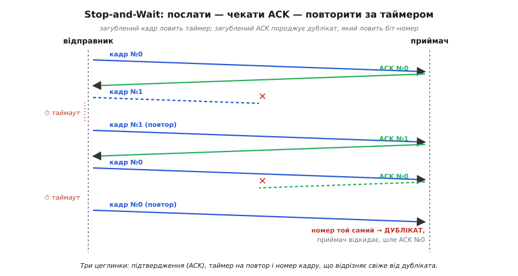
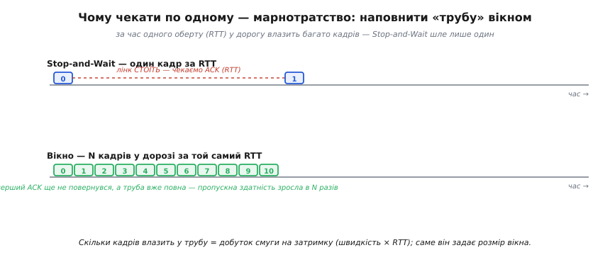
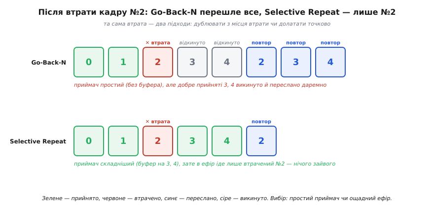

# Стратегії ARQ

Коли ми розкладали [надійність даних](root:embedded/data-reliability) на дві великі стратегії, одна з них звучала майже як побутова порада: якщо кадр зіпсувався, а перепитати дешево, — просто **попроси надіслати ще раз**. Це ARQ (англ. *automatic repeat request* — «автоматичний запит на повтор»). Тоді ми спинилися на самій ідеї: дешевий код виявлення згори, зворотний канал, повтор за потреби. Тепер настав час відкрити коробку й подивитися, **як саме** машини це роблять, — бо за невинним «надішли ще раз» ховається кілька зовсім не очевидних інженерних рішень, і кожне неправильне з них породжує тихий, але злий баг.

Питання, яких не уникнути, такі. Звідки відправник дізнається, що кадр **дійшов**, а не загубився дорогою? Скільки **чекати**, перш ніж вирішити, що пора повторювати? І найпідступніше: якщо повторений кадр усе ж дійде разом зі своїм «загубленим» оригіналом — як приймач зрозуміє, що це **той самий** кадр, а не новий? Відповіді на ці три питання й перетворюють розпливчасту ідею «перепитати» на робочий протокол. Розберімо їх на найпростішій схемі, а тоді побачимо, чому її доводиться вдосконалювати.

### Три цеглинки: підтвердження, таймер і номер

Почнімо з найменшого працездатного зерна. Відправник шле один кадр і **зупиняється** — далі нічого не надсилає, поки не дістане відповіді. Приймач, отримавши кадр і переконавшись за [контрольною сумою](topic:communications/checksums) чи [CRC](topic:communications/crc), що той цілий, шле назад крихітну **квитанцію** — підтвердження (англ. *acknowledgement*, скорочено ACK — «підтвердження»). Дістав відправник ACK — добре, шле наступний. Не дістав — повторює. Ця схема так і зветься: **зупинись-і-чекай** (англ. *stop-and-wait* — «зупинись і чекай»).

Уся хитрість — у словах «не дістав». Звідки відправник знає, що ACK **не прийде**? Адже він не може чекати вічно: і кадр, і ACK можуть загубитися безслідно, і тоді обидва боки застигнуть назавжди, чекаючи один одного. Рятує **таймер**. Надіславши кадр, відправник заводить годинник; якщо ACK не повернувся за відведений час (англ. *timeout* — «вичерпання часу»), він **вважає кадр утраченим і шле його знову**. Таймер — це той єдиний механізм, що виводить систему зі ступору: без нього одна-єдина загублена квитанція вішає зв'язок намертво.

І ось тут зачаїлася найкоротша дорога до баґа. Уяви: кадр дійшов чудово, приймач його прийняв і відіслав ACK — але **сам ACK загубився**. Відправник квитанції не дочекався, таймер спрацював, і він чесно шле кадр **удруге**. Тепер приймач отримує **другу копію того, що вже прийняв**. Якщо нічого не зробити, він прийме її як новий кадр — і в потоці даних виникне **дублікат**, фантомний зайвий байт, якого ніхто не надсилав. Загублений ACK перетворився на зіпсовані дані — рівно те, від чого ми захищалися.

Ліки прості й геніальні: до кожного кадру чіпляють **номер** (англ. *sequence number* — «порядковий номер»). Приймач запам'ятовує, який номер чекає наступним. Прийшов кадр із **очікуваним** номером — це свіжі дані, бери. Прийшов кадр із номером, який уже прийнято, — це **дублікат**, відкинь його, але **все одно надішли ACK** (бо саме втрата попереднього ACK і спричинила повтор — треба підтвердити ще раз). Для stop-and-wait вистачає **одного біта** номера, що чергується 0, 1, 0, 1: відправник тримає одночасно лише один неквитований кадр, тож сплутати можна тільки сусідні, а їх однобітний лічильник уже розрізняє.


*Три цеглинки в дії. Угорі — нормальний обмін: кадр №0, у відповідь ACK №0. Посередині — кадр №1 гине дорогою; ACK не приходить, спрацьовує таймер, кадр №1 іде повторно й цього разу квитується. Унизу — кадр №0 дійшов, але загубився вже ACK; таймер змушує відправника повторити кадр №0, і приймач бачить той самий номер — упізнає дублікат, відкидає дані, але знову шле ACK №0, щоб розблокувати відправника.*

Зведімо це в робочий код. Ось серце приймача stop-and-wait — як він за одним бітом номера відрізняє свіжий кадр від повтору:

```c
#include <stdint.h>
#include <stdbool.h>

// Стан приймача: який номер чекаємо наступним (0 або 1).
static uint8_t expected_seq = 0;

// Виклик на кожен цілий (CRC зійшовся) кадр. Повертає true, якщо це
// СВІЖІ дані, які слід віддати застосунку; false — якщо це дублікат.
bool rx_accept(uint8_t frame_seq, const uint8_t *payload, int len) {
    send_ack(frame_seq);                 // ACK шлемо ЗАВЖДИ — і на дублікат теж
    if (frame_seq != expected_seq)       // номер не той, що чекали → це повтор
        return false;                    // дані вже маємо, мовчки відкидаємо
    deliver_to_app(payload, len);        // свіжий кадр — віддаємо вище
    expected_seq ^= 1;                   // чекаємо наступний: 0→1, 1→0
    return true;
}
```

> 🔧 **Навіщо це.** Цей крихітний шматок — основа надійного обміну між двома платами по UART чи радіо, і саме на ньому найчастіше спотикаються. Дві типові пастки видно прямо в коді. Перша: легко забути слати ACK на дублікат — і тоді відправник вічно повторює кадр, бо його повтори щоразу породжують нові дублікати без квитанції. Друга: легко переплутати, **коли** зсувати очікуваний номер — зсунеш до перевірки, приймеш дублікат як свіжий кадр. Тримай у голові інваріант: ACK підтверджує **факт отримання**, а номер відповідає на питання «це вперше чи вже бачив».

### Чому чекати по одному — марнотратство

Stop-and-wait працює бездоганно, але має одну ваду, яка на коротких дротах непомітна, а на радіолінку дрона стає вироком. Відправник **простоює** весь час, поки кадр летить до приймача й ACK повертається назад. На столі між двома платами цей оберт — частки мілісекунди, дрібниця. Але на лінку «дрон за десять кілометрів» сигнал лише в один бік іде десятки мікросекунд, а з обробкою й чергами повний оберт (англ. *round-trip time*, RTT — «час оберту») розтягується на мілісекунди. І весь цей час швидкий радіоканал, здатний пропхати тисячі байтів, **везе один-єдиний кадр і мовчки чекає**.

Уяви канал як **трубу** між відправником і приймачем. Скільки даних може бути «в дорозі» одночасно — це довжина труби, помножена на її товщину, тобто **швидкість каналу, помножена на RTT**. Цю величину звуть **добутком смуги на затримку** (англ. *bandwidth-delay product* — «добуток смуги пропускання на затримку»). Якщо труба вміщає десять кадрів, а ми шлемо по одному й чекаємо, ми використовуємо **десяту частину** каналу — решта дев'ять «місць у трубі» їдуть порожні.


*Угорі stop-and-wait: один кадр, потім лінк стоїть цілий оберт, чекаючи ACK, і лише тоді йде наступний — канал працює крихітну частку часу. Унизу — вікно: кадри йдуть один за одним, не чекаючи квитанцій, і поки перший ACK ще в дорозі, труба вже повна. Пропускна здатність зростає рівно в стільки разів, скільки кадрів уміщає труба — тобто як добуток смуги на час оберту.*

Висновок напрошується сам: треба **не зупинятися** після кожного кадру, а тримати в дорозі стільки, скільки вміщає труба. Дозволимо відправникові надіслати кілька кадрів **наперед**, не чекаючи на ACK кожного, — і квитанції повертатимуться вже тоді, коли наступні кадри в польоті. Канал наповнюється, простій зникає. Цю кількість «дозволених у польоті без квитанції» кадрів називають **вікном** (англ. *window* — «вікно»), а саму техніку — **рухомим вікном** (англ. *sliding window* — «вікно, що ковзає»): у міру того як надходять квитанції на старі кадри, вікно **сповзає** вперед, відкриваючи дозвіл на нові.

> 🔧 **Навіщо це.** Розмір вікна — це не абстракція, а конкретне число, яке ти рахуєш перед налаштуванням лінка, і рахуєш так само, як [запас бюджету радіолінії](root:embedded/link-budget): бери швидкість каналу, помнож на типовий час оберту — стільки даних має «висіти в трубі». Постав вікно меншим — канал недовантажений, швидкість просідає дарма. Постав надмірним — роздуєш буфери й затримку, а на втраті доведеться перешивати завелику пачку. На реальному телеметричному лінку це різниця між «гладкий потік» і «смикається й відстає».

Рухоме вікно прибирає простій, але народжує нове питання, на яке є **дві різні відповіді**, — і саме вони дають дві класичні стратегії ARQ. Питання таке: ми надіслали, скажімо, п'ять кадрів поспіль, а **третій загубився**. Що робити з четвертим і п'ятим, які вже в дорозі або вже прийняті? Перешивати все від третього — чи якось вициганити повтор **лише** третього? Перший шлях простіший для приймача, другий — ощадніший для ефіру.

### Go-Back-N: відкотитися й перешити все

Перша відповідь груба, зате дешева в реалізації. Приймач погоджується брати кадри **тільки строго за порядком** і не тримає для них буфера: прийшов очікуваний номер — бери, прийшов будь-який інший — **викинь**. Квитанції він шле **накопичувальні** (англ. *cumulative ACK* — «накопичувальне підтвердження»): «ACK 5» означає не «прийняв п'ятий», а «маю все включно до п'ятого, шли далі». Одна квитанція підтверджує цілу пачку — і якщо котрась загубиться, наступна її перекриє.

Що ж буде на втраті? Загубився кадр №2. Кадри №3 і №4 уже летять услід — але приймач їх **відкидає**, бо чекав №2, а не №3. Квитанцій на них він не шле (точніше, повторює стару «маю до №1»). У відправника спрацьовує таймер на №2, і він **відкочується** до нього й шле **заново все, починаючи з №2**: №2, №3, №4 — хоча №3 і №4 насправді долетіли були чудово. Звідси й назва — **повернутися на N** (англ. *go-back-N* — «відкотитися на N кадрів»): на одній втраті відправник вертається назад і перешиває весь хвіст вікна.

Платою тут є **марно перешите**: добре прийняті кадри №3 і №4 викинули й відправили вдруге без потреби. Що довше вікно й що частіші втрати, то більше ефіру з'їдає це перешивання. Натомість виграш — **простота приймача**: жодних буферів для кадрів не за порядком, жодного складного обліку, що прийнято, а що ні. Він тримає одне-єдине число — який номер чекає, — і це робить Go-Back-N привабливим там, де приймач мусить бути крихітним, а втрати рідкі.

### Selective Repeat: долатати тільки дірку

Друга відповідь розумніша, але коштує приймачеві складності. Тепер приймач **погоджується приймати кадри не за порядком** і складати їх у **буфер**. Загубився №2, а №3 і №4 долетіли — приймач не викидає їх, а **притримує** в себе, чекаючи, поки прийде №2, щоб тоді віддати застосунку №2, №3, №4 одним правильно впорядкованим шматком. Квитанції тут **вибіркові** (англ. *selective acknowledgement* — «вибіркове підтвердження»): приймач квитує **кожен** кадр окремо, тож відправник точно знає, що №3 і №4 уже в безпеці, а бракує лише №2.

І тоді на втраті відправник шле **тільки те, чого справді бракує** — самий №2, і нічого більше. Звідси назва — **вибірковий повтор** (англ. *selective repeat* — «вибірковий повтор»): перешиваємо не весь хвіст, а точково загублені кадри. Ефір не марнується ні на байт зайвого: кожен повтор латає реальну дірку.


*Та сама втрата — два підходи. У Go-Back-N приймач без буфера: добре прийняті №3 і №4 викинуто, бо вони не за порядком, і відправник шле заново весь хвіст №2, №3, №4. У Selective Repeat приймач тримає буфер: №3 і №4 чекають у ньому, тож у повторну дорогу йде лише втрачений №2 — нічого зайвого. Ощадність ефіру оплачена пам'яттю й складнішим обліком на приймачі.*

За цю ощадність платять там, де Go-Back-N безтурботний. Приймачеві потрібен **буфер** на кадри, що чекають дірки, і **облік**, який з них уже на місці, а яких бракує. Відправник теж мусить тримати кожен неквитований кадр окремо й мати на кожен **свій** таймер, а не один спільний. І номери доводиться брати з **достатнім запасом**: якщо номер «обернеться» по колу й повториться, поки старий кадр із тим самим номером ще десь у дорозі, приймач переплутає старе зі свіжим — тож простір номерів має бути щонайменше вдвічі більший за вікно. Selective Repeat — це класична угода «складніше, зате ефективніше».

Вибір між двома стратегіями зводиться до однієї тверезої оцінки. Якщо втрати **рідкісні**, перешивати хвіст доводиться нечасто, і простота Go-Back-N перемагає — навіщо буфери й окремі таймери заради події, що майже не трапляється. Якщо ж втрати **часті** або канал **дорогий** і кожен зайвий байт болить, ощадність Selective Repeat швидко окуповує свою складність. А якщо лінк зовсім кепський — стільки помилок, що повторювати доводиться без кінця, — це сигнал, що сама стратегія «перепитати» вже не на місці й треба підмішувати **виправлення**.

### Коли перепиту замало: гібрид із FEC

Тут ниточка повертається туди, звідки ми вийшли. У темі про [надійність даних](root:embedded/data-reliability) ми бачили, що найнадійніші системи не вибирають між ARQ і [прямим виправленням](topic:communications/reed-solomon) (FEC), а **поєднують** їх. Тепер, знаючи механіку ARQ зсередини, ми розуміємо, **навіщо** саме.

ARQ слабшає рівно там, де помилок багато: кожна втрата — це повтор, а повтори їдять пропускну здатність і додають затримку оберту. На по-справжньому шумному каналі чистий ARQ задихається в нескінченних перешиваннях. FEC, навпаки, лагодить дрібні помилки **на місці**, без жодного повтору, — але платить надлишком у кожному кадрі, навіть бездоганному, і має межу: проти сильного спалаху помилок його корекції не вистачить. Кожна стратегія сильна там, де друга слабка.

Звідси й **гібридний ARQ** (англ. *hybrid ARQ*, HARQ — «гібридний автоматичний запит на повтор»): у кожен кадр кладуть **помірний** FEC, що сам прибирає звичайні дрібні помилки, а зверху лишають CRC і повтор — на ті рідкісні випадки, коли спалах перебив навіть корекцію. Більшість кадрів долітає з першого разу й лагодиться на льоту, а перепит вмикається лише зрідка. Найрозумніші схеми йдуть ще далі: повторно шлють **не той самий** кадр, а **додаткову порцію надлишку**, і приймач **складає** обидва прийоми разом — другий прийом не заміняє перший, а підсилює його, тож навіть два побитих прийоми разом дають цілий кадр. Саме так тримають зв'язок мобільні мережі під рухомим завмиранням сигналу.

> 🔧 **Навіщо це.** Гібрид — це відповідь на питання «що ставити, коли канал то добрий, то раптом поганий», а саме такий канал у дрона, що віддаляється й заходить за перешкоди. Чистий ARQ на дальньому краю почне смикатися від частих повторів; чистий FEC або з'їсть смугу даремно на ближньому краю, або не впорається на дальньому. Помірний FEC плюс перепит зверху дає рівний потік на всьому діапазоні: близько — майже без надлишку, далеко — корекція тримає, а повтор підстраховує. Це не екзотика з підручника, а робоча архітектура сучасних радіолінків.

### Де це живе в реальній прошивці

Найприродніший дім цих ідей — будь-який двосторонній лінк, де дані не мають права тихо зникати, а перепитати дешево. Найпростіший stop-and-wait із однобітним номером — це класичний «надійний кадр поверх UART» між двома платами: коротка пачка, ACK у відповідь, повтор за таймером. Поки лінк короткий і швидкий, простій після кожного кадру нічого не коштує, а код лишається крихітним — те, що треба для зв'язку давача з контролером.

Щойно лінк дальшає й даних більшає — наприклад, потік [телеметрії](topic:communications/telemetry-stream) з апарата вниз або файл, що ллється каналом, — простій stop-and-wait стає відчутним, і в гру входить вікно. А коли надійність критична, поверх кадрів лягає вже знайома нам [багатошаровість](root:embedded/data-reliability): CRC ловить пошкодження, номери відрізняють свіже від повтору, вікно наповнює канал, а помірний FEC прибирає дрібні помилки до того, як вони змусять повторювати. Так, наприклад, влаштований обмін у [MAVLink — протоколі керування дроном із землі](root:embedded/mavlink-from-ground): критичні команди йдуть із підтвердженням і повтором за таймером, бо команда «зведи шасі» чи «повертайся додому» мусить дійти напевно, тоді як потік телеметрії здебільшого ллється без квитанцій — згублений кадр координат за мить заміниться свіжим, і перепитувати його немає сенсу.

І в цьому, мабуть, головний практичний урок. ARQ — не один протокол, а **набір важелів**: квитувати кожен кадр чи пачку накопичувально, тримати вікно вузьким чи широким, перешивати весь хвіст чи точково, підмішувати FEC чи ні, вимагати підтвердження для цього повідомлення чи відпустити його без гарантій. Інженер не «вмикає ARQ» — він **набирає** з цих важелів схему рівно під свій канал: під його затримку, під його швидкість, під те, як часто й якими спалахами він псує дані, і під те, що буде ціною загубленого кадру. Засвоївши важелі, ти проєктуватимеш надійний обмін свідомо, а не сподіваючись, що «бібліотека якось сама розрулить».

Сама ідея «надішли ще раз, якщо не дійшло» виявилася навдивовижу давньою — старшою за комп'ютерні мережі, з епохи, коли повідомлення вистукували телеграфом, а зворотний канал був на вагу золота. [Як народилося ARQ — від телеграфної стрічки до рухомого вікна TCP](root:embedded/arq-strategies/hist-arq-origins.md) — окрема й цікава історія про те, як «перепитати» пройшло шлях від ручної звірки телеграм до автоматичного протоколу, на якому тримається половина сьогоднішнього зв'язку.
