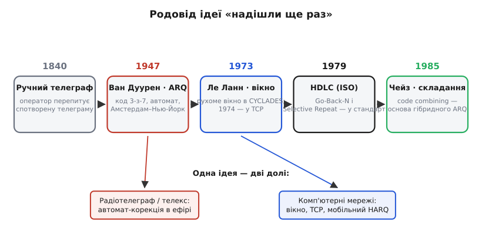
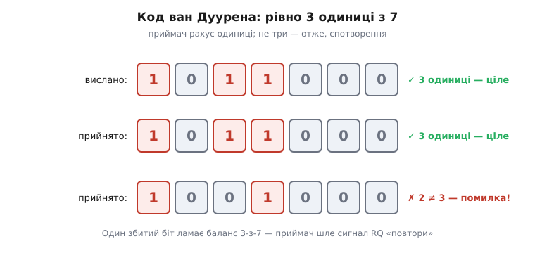

# 📜 Як народилося ARQ: від телеграфної стрічки до рухомого вікна TCP

Ідея, з якої ми починали, — «не дійшло, то надішли ще раз» — звучить так очевидно, що здається, ніби вона була завжди. Насправді шлях від цієї простої думки до робочого автомата зайняв ціле століття, і кожен його крок розв'язував біль, добре знайомий тому, хто на ньому стояв. Ця історія варта окремої розповіді не заради дат, а тому, що в ній видно, **як саме** інженерна ідея визріває: спершу люди роблять щось руками й страждають, тоді хтось автоматизує найболючіше, тоді винахід переростає своє первісне призначення й оселяється там, де його автор і не уявляв. ARQ пройшов рівно цей шлях — від телеграфіста, що мружиться на спотворену стрічку, до протоколу, на якому тримається сьогоднішній інтернет.

*Одна ідея — п'ять ключових кроків і дві долі. Те саме «надішли ще раз» спершу автоматизують для радіотелеграфу (гілка ефіру), а за чверть століття воно ж лягає в основу комп'ютерних мереж (гілка TCP і мобільного зв'язку). Дати веб-звірені; статус усіх — усталено.*

### Біль, з якого все почалося: телеграма, якій не можна вірити

Щоб зрозуміти, навіщо взагалі знадобився автоматичний повтор, треба відчути біль ручного. Уяви телеграфіста середини XIX століття. Лінія тріщить, гроза десь далеко наводить на дроти паразитні імпульси, реле спрацьовує там, де не мало б, — і крапка перетворюється на тире. У звичайному тексті це інколи помітно: спотворене слово муляє око, і його перепитують. Але телеграфом ішли й **числа** — біржові котирування, суми переказів, координати, шифровки. А в числі немає контексту, який підкаже помилку: «1247» і «1287» однаково правдоподібні, і ніщо в самому повідомленні не виказує, що одне з них — брехня лінії.

Найперші ліки були чисто організаційні, без жодної техніки. Важливі телеграми просто **передавали двічі** й звіряли копії; розбіжність викривала спотворення. Дорого — подвійний час на тій самій лінії, — зате надійно. Це вже зародок усієї нашої теми: **надлишок задля виявлення помилки й повтор задля її виправлення**. Тільки робила це людина, повільно й коштовно, і весь час хтось мусив сидіти й порівнювати рядки.

Наступний крок зробив код, а не процедура. Коли телеграф зрісся з друкарською машинкою й народився **телетайп** (англ. *teleprinter* — «друкований телеграф»), літери стали кодувати рівними п'ятибітними групами (код Бодо, фр. *Baudot* — на честь Еміля Бодо, Émile Baudot). Рівна довжина — це вже структура, в якій можна шукати ваду. Але п'ять бітів кодують рівно тридцять дві комбінації, і **всі вони — чинні літери чи знаки**: жодного «зайвого» візерунка, за яким приймач упізнав би спотворення. Якщо «A» через помилку стала «S», обидві — законні символи, і автомат не має ані найменшої підстави запідозрити підміну. Щоб помилку можна було **побачити машинно**, у код треба свідомо закласти надлишок — комбінації, яких у чистому потоці бути не може, а поява яких кричить «тут збій». Саме цього бракувало, і саме це невдовзі додали.

### Гендрик ван Дуурен і код, що сам себе перевіряє

Тут на сцену виходить голландський інженер **Гендрик ван Дуурен** (нід. *Hendrik C. A. van Duuren*) із нідерландської пошти-телеграфу-телефону — **PTT** (нід. *Posterijen, Telegrafie en Telefonie*). У 1940-х він розв'язав задачу, над якою інші лише зітхали: зробити так, щоб радіотелеграф **сам** ловив помилку й **сам** просив повтор, без людини посередині. Радіоканал на той час був найгіршим зі зв'язків — короткі хвилі гуляли іоносферою, завмирали, тонули в тріску атмосфери, і телекс через океан без захисту перетворювався на кашу. Ручна звірка тут не рятувала: помилок було забагато.

Винахід ван Дуурена тримається на одній дуже гарній думці. Що, як **кожен** дозволений символ робити так, щоб у ньому була **рівно однакова кількість одиниць**? Він узяв семибітний код, у якому в кожній комбінації **точно три біти — одиниці, а чотири — нулі** (це звуть **кодом сталого співвідношення**, англ. *constant-ratio code*; конкретний випадок 3-з-7 інколи називають кодом Мура). Скількись таких комбінацій якраз вистачає на телеграфну абетку. А далі — диво простоти: приймачеві не треба знати, **яку** саме літеру очікувати. Він просто **рахує одиниці** в кожному прийнятому символі. Три — символ, найпевніше, цілий. Не три — сталося спотворення, бо жодна правильна літера не має ні двох, ні чотирьох одиниць.

*Серце винаходу — баланс 3-з-7. Приймачеві байдуже, яка це літера; він лічить одиниці. Рівно три — символ цілий. Один збитий біт неминуче дає або дві, або чотири одиниці — баланс ламається, приймач це бачить і шле назад сигнал «повтори». Виявлення помилки без жодної таблиці очікуваних значень.*

Тепер прозирає вся машина. Виявив приймач розбалансований символ — він посилає у зворотний бік короткий керівний сигнал, який в історії так і закарбувався: **RQ** (від англ. *repeat request* — «запит на повтор»). Дістав цей сигнал передавач — він не їде далі, а **повертається й шле зіпсований шматок наново**. Жодної людини: лінія сама стежить за собою й сама латає діри. І ось ключова деталь для нас — **саме звідси й пішла назва всієї нашої теми**. Скорочення **ARQ** виросло з того самого телеграфного сигналу RQ; пізніше його розшифрували як *automatic repeat request* — «автоматичний запит на повтор». Коли ми в курсі кажемо «ARQ», ми вимовляємо відлуння керівного символу, яким радіотелеграф 1940-х просив повторити побитий знак.

> 🔧 **Навіщо це.** Думка ван Дуурена жива й сьогодні, тільки в іншому вбранні. Перевірка «полічи одиниці, має бути стала кількість» — це найпростіший **код виявлення помилок**, прабатько [контрольних сум](book:communications/checksums) і [CRC](book:communications/crc), що стоять у заголовку кожного твого кадру. А керівний символ RQ — це прямий предок того самого «не дійшло — перешли», на якому тримається stop-and-wait із початку теми. Перш ніж заводити складні протоколи, варто пам'ятати: уся надійність починається з дешевого надлишку, що дозволяє приймачеві **запідознити** ваду.

Винахід не лишився на папері. Перше комерційне ввімкнення системи ван Дуурена сталося **1947 року** на радіотелеграфному лінку **Амстердам — Нью-Йорк**, де провідну (керівну) станцію тримали в Амстердамі; за кілька років, у 1950-му, на тій самій трасі відкрили регулярний заокеанський телекс-обмін. Систему згодом унормували як міжнародний стандарт під назвами **TOR** (англ. *telex over radio* — «телекс по радіо») і **CCITT Telegraph Alphabet No. 3** — тобто третю міжнародну телеграфну абетку, окремо створену під радіоканал із його помилками. Працювала вона десятиліттями. *(Дати й авторство — усталений факт; ван Дуурен описав систему в публікаціях кінця 1940-х і тримав десятки патентів у цій галузі.)*

Варто чесно назвати межу винаходу. Код 3-з-7 надійно **виявляв** одиничне спотворення, але сам по собі його **не виправляв** — виправлення давав уже повтор по сигналу RQ. Тобто ван Дуурен побудував не код-коректор, а **систему**: дешеве виявлення плюс автоматичний перепит. Саме цю зв'язку — «виявив дешевим кодом, виправив повтором» — ми й розгортали в темі як основу будь-якого ARQ. Голландський інженер просто зробив її автоматичною першим і дав їй ім'я.

### Стрибок у мережі: рухоме вікно Жерара Ле Ланна

Далі історія робить несподіваний поворот. Десятиліттями ARQ жив у світі радіотелеграфу й телексу — у світі **однієї лінії між двома станціями**. А тоді, на початку 1970-х, з'явилися **комп'ютерні мережі**, де треба було надійно гнати пакети не між двома телетайпами, а між машинами через ланцюг вузлів. І виявилося, що проста схема «надіслав символ — почекав RQ» для цього надто марнотратна — рівно з тієї причини, яку ми розбирали: на довгому каналі чекати після кожного шматка означає тримати лінію переважно порожньою.

Розв'язок прийшов із Франції. Молодий інженер **Жерар Ле Ланн** (фр. *Gérard Le Lann*), що 1972 року прийшов до французького дослідного інституту **IRIA** (згодом INRIA), працював над піонерською французькою мережею **CYCLADES** — одним із перших у світі проєктів передавання даних пакетами, ровесником американського ARPANET. Саме там, **1973 року**, Ле Ланн запропонував і змоделював механізм, який ми в темі звемо **рухомим вікном** (англ. *sliding window* — «вікно, що ковзає»): дозволити відправникові тримати в дорозі не один шматок, а цілу пачку, не чекаючи квитанції на кожен, і зсувати «дозвіл» уперед у міру надходження підтверджень. Те саме вікно, яким ми наповнювали трубу каналу, щоб прибрати простій stop-and-wait.

І тут історія дарує гарну зустріч. У березні 1973-го до Рокенкура під Парижем, де сидів IRIA, приїхав американець **Вінтон Серф** (англ. *Vinton "Vint" Cerf*) — він саме з **Робертом Каном** (англ. *Robert "Bob" Kahn*) обмірковував протокол, що мав зв'язати різні мережі в одну. Ле Ланн показав йому свій механізм вікна, і Серф запросив француза на рік до своєї групи в Стенфорді. Там, у 1973–1974 роках, ідею вмонтували в новий протокол. Коли навесні **1974 року** Серф і Кан опублікували свою знамениту статтю про з'єднання мереж — той самий текст, із якого виріс **TCP**, — стратегія вікна вже була його частиною. Так механізм, придуманий для французької CYCLADES, став одним із наріжних каменів інтернету; ім'я Ле Ланна нині викарбуване серед піонерів мережі на пам'ятній дошці в Стенфорді. *(Усталений факт; внесок Ле Ланна в раннє TCP визнаний і самим Серфом.)*

> 🔧 **Навіщо це.** Це той самий механізм, що в темі перетворював марнотратний stop-and-wait на повноцінне наповнення каналу. Коли ти рахуєш розмір вікна під свій лінк — швидкість на час оберту, як [запас бюджету радіолінії](root:embedded/link-budget), — ти користуєшся думкою, якій півстоліття й яка народилася не в радіо, а в комп'ютерній мережі. Те, що в телеметрії дрона прибирає простій, і те, на чому стоїть кожне TCP-з'єднання у твоєму браузері, — буквально один і той самий винахід.

### Дві стратегії дістають ім'я: HDLC і стандарт

Рухоме вікно, як ми бачили в темі, одразу породжує розвилку: коли в пачці губиться один кадр, перешивати **весь хвіст** чи долатати **лише дірку**? Перший шлях ми назвали Go-Back-N, другий — Selective Repeat. Ці ідеї носилися в повітрі різних протоколів 1970-х, але **канонічну форму й загальновживані імена** їм дав стандарт.

Сталося це **1979 року**, коли Міжнародна організація зі стандартизації (ISO) випустила набір документів під спільною назвою **HDLC** (англ. *high-level data link control* — «високорівневе керування каналом передавання даних»). Один документ описав будову кадру, інший — порядок обміну, і саме там обидві стратегії повтору закріпили як **офіційні режими**: відкат на N кадрів і вибірковий повтор окремих кадрів (для останнього ввели спеціальну керівну рамку «вибіркова відмова», англ. *selective reject*, SREJ — «вибірково відхилити», якою приймач просить переслати точково один номер). Те, що доти кожен винаходив по-своєму, стало спільною мовою, і відтоді інженер, кажучи «Go-Back-N» чи «Selective Repeat», має на увазі рівно те, що його колега на іншому кінці світу. *(Усталений факт: відповідні частини HDLC ухвалені ISO 1979 року.)*

Тут варто чесно розрізнити **ідею** і **стандарт**. Накопичувальні квитанції, відкат, вибірковий повтор, нумерація кадрів — усе це придумали раніше й порізно, в окремих протоколах і статтях. Заслуга HDLC не в тому, що він це **винайшов**, а в тому, що він це **відібрав, упорядкував і зробив сумісним**. У техніці таке буває цінніше за сам винахід: ідея, доки в кожного своя, лишається купою діалектів; стандарт перетворює її на інфраструктуру, на яку можна спертися. Тому в історії ARQ 1979 рік стоїть не як «дата винайдення», а як **дата, коли дві стратегії остаточно дістали імена**, якими ми користуємося в цій темі.

### Останній поворот: Девід Чейз і складання прийомів

Лишилася одна нитка — найрозумніша частина гібриду, де повтор **не заміняє** попередній прийом, а **підсилює** його. У темі ми бачили цю думку як вершину: на дуже шумному каналі другий побитий прийом складають із першим побитим, і два неповних разом дають цілий кадр. Звідки взялася ця, на перший погляд, парадоксальна ідея — як із двох зіпсованих копій вийняти одну добру?

Її чітко сформулював американський інженер **Девід Чейз** (англ. *David Chase*) у статті **1985 року** в журналі *IEEE Transactions on Communications*. Він показав, як **оптимально поєднати** довільну кількість зашумлених прийомів того самого повідомлення замість того, щоб щоразу викидати невдалу копію й чекати чистої. Думка спирається на те, що приймач бачить не голі «нулі й одиниці», а аналоговий сигнал із **мірою певності** в кожному біті: цей біт «майже напевно одиниця», а той — «ледь-ледь схожий на нуль». Якщо два прийоми побиті в **різних** місцях — а на випадковому шумі так і буває, — то там, де перша копія сумнівна, друга часто впевнена, і навпаки. Склавши певності обох, приймач відновлює те, чого не давала жодна копія окремо. Цей прийом назвали **складанням кодів** (англ. *code combining*), і він став основою того різновиду **гібридного ARQ**, де повтори не марнуються, а накопичуються. *(Усталений факт; стаття Чейза 1985 року — класичне першоджерело цього підходу.)*

Саме на цій ідеї тримається зв'язок сучасних мобільних мереж під рухомим завмиранням сигналу, про який ми згадували: телефон у русі ловить кожен повтор не як «ще одну спробу з нуля», а як **додаткову порцію певності**, що складається з уже прийнятим. Коло замкнулося: те, що почалося як ручна звірка двох телеграм, через століття стало математично оптимальним складанням зашумлених прийомів у кишеньковому радіо.

### Що ця історія каже про саму ідею

Якщо відступити й окинути весь шлях, видно одну тиху закономірність, заради якої цю історію й варто було розказати. Ідея «надішли ще раз, якщо не дійшло» — навдивовижу **проста й навдивовижу живуча**. Вона народилася в найбіднішому на можливості середовищі, яке тільки можна уявити, — у тріскучому телеграфному дроті, де зворотний канал був на вагу золота, — і саме бідність змусила робити її ощадно й розумно. А далі та сама ідея, нічого не втрачаючи в суті, переростала одне середовище за іншим: радіотелеграф, телекс, перші пакетні мережі, TCP, мобільний зв'язок. Мінялося залізо, мінялися швидкості на багато порядків — а кістяк лишався той самий: дешевий надлишок, щоб **запідозрити** ваду; зворотний сигнал, щоб **попросити** повтор; розумне рішення, **що саме** й **як** повторювати.

І це, мабуть, головний урок не лише про ARQ. По-справжньому сильні інженерні ідеї не прив'язані до своєї технології народження. Ван Дуурен розв'язував проблему іоносфери над Атлантикою, Ле Ланн — проблему французької пакетної мережі, Чейз — проблему завмирання радіосигналу; а вийшов один наскрізний принцип, який ти тепер набираєш із важелів під свій власний канал — чи то UART між двома платами, чи то телеметрія з дрона за десять кілометрів. Розуміючи, **звідки** кожен важіль узявся й **який біль** він колись лікував, ти добираєш їх не навмання, а як інженер, що стоїть у кінці довгого, добре второваного шляху.
