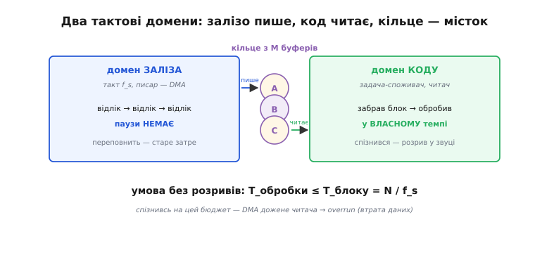
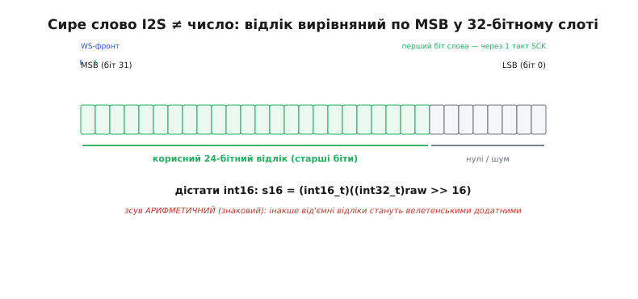
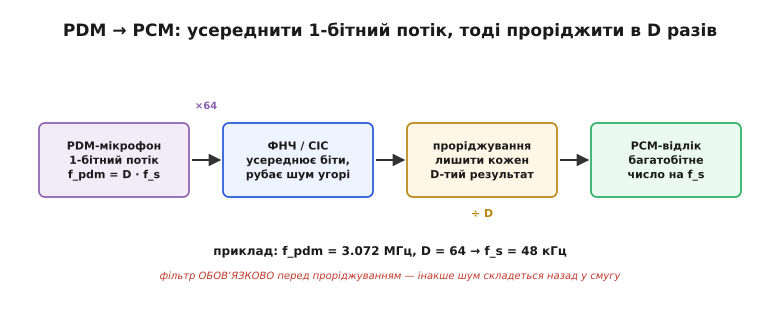
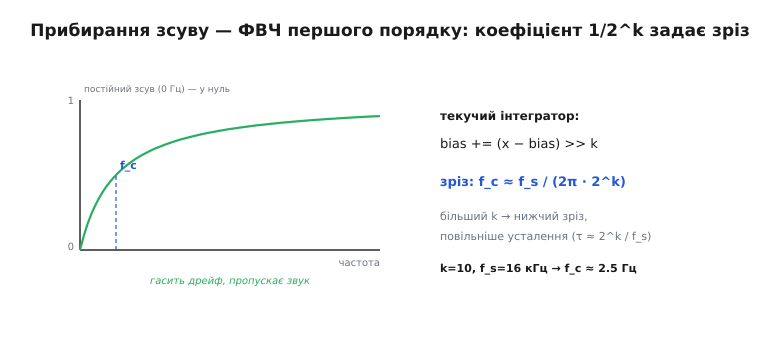

# Захоплення звуку: від мікрофона до буфера — детально

<preknowlist>
- [Sigma-delta АЦП](root:hw-analog/sigma-delta-adc) — грубий 1-бітний компаратор у петлі зі зворотним зв'язком робить точність із передискретизації й формування шуму; це серце і I2S-мікрофона, і PDM.
- [Передискретизація й децимація](root:hw-analog/oversampling-decimation) — зняти багато знімків, усереднити фільтром, тоді проріджити в K разів; фільтр ОБОВʼЯЗКОВО перед проріджуванням.
- [Фіксована кома](root:hw-arch/fixed-point) — ціле трактують як дріб зі зсунутою комою (формат 16.16); арифметика цілими там, де немає FPU.
</preknowlist>

У базовій темі ми провели межу, від якої залежить усе: **ліворуч від DMA темп задає залізо, праворуч — код**, а вся робота захоплення — перекинути потік через цю межу без втрат. Ми взяли I2S-мікрофон, вибрали частоту, вибрали розмір блоку, прибрали постійний зсув простим фільтром і замкнули коло споживачем. Цього досить, щоб звук поїхав. Але майже кожне з тих рішень мало під собою другий шар, який ми тоді свідомо стиснули: **чому саме так, а не інакше, і що ламається на границях**.

Тут ми той шар розгорнемо. Формалізуємо межу темпу як задачу двох тактових доменів і виведемо нерівність, яку не можна порушувати. Розберемо, чому сире 32-бітне слово з I2S — це **не** число-відлік, і як один невірний зсув перетворює тихий голос на пилку. Виведемо фільтр прибирання зсуву з нуля — покажемо, що це фільтр верхніх частот першого порядку, знайдемо його частоту зрізу формулою й побачимо, звідки в коді взявся саме зсув на 10. Пройдемо PDM не як побіжний «окремий випадок», а як повний ланцюг децимації з робочим кодом. І перелічимо граничні умови, об які розбивається наївна реалізація: переповнення на першому блоці, вирівнювання під DMA, кліпінг при стисканні 24→16, порядок байтів у слові. Кістяк лишається той самий — **забрав блок → відцентрував → передав далі**, — але тепер під кожним словом стоятиме механізм.

## Межа темпу — це задача двох тактових доменів

Повернімося до тієї межі посередині конвеєра й назвімо її точним словом. У цифровій схемотехніці два вузли, які тактуються від **різних, не зв'язаних між собою генераторів**, живуть у різних **тактових доменах** (англ. *clock domain* — «область такту»). Передати дані між доменами напряму не можна: у писаря свій ритм, у читача свій, і моменти, коли один кладе дані, а другий їх бере, ніколи точно не збігаються. Захоплення звуку — рівно ця ситуація, тільки замість тригерів у нас DMA й задача.



*Ліворуч — домен заліза: писар (DMA) кладе відліки в темпі f_s, без пауз, і якщо кільце переповнити — старе просто затреться. Праворуч — домен коду: задача-споживач забирає готові блоки у власному темпі. Кільце з M буферів — єдиний місток між доменами. Умова внизу — та нерівність, порушення якої дає overrun.*

Чому це не просто «швидкий пише, повільний читає». Річ у тім, що жоден із доменів **не може попросити інший зачекати**. Мембрана коливається так, як коливається повітря; фронт-енд видає число рівно тоді, коли надійшов такт WS; DMA переносить це число в пам'ять, не питаючи ядро. Уся ліва половина — це **потік, який не можна поставити на паузу**. Якби могли — задачі б не було: читали б мікрофон, коли зручно, як звичайний давач. Саме неможливість натиснути «стоп» ліворуч і робить звук особливим джерелом.

Але й праворуч є своя жорсткість, дзеркальна. Код теж не встигає завжди й миттєво: то ISR іншого пристрою забрав ядро на 200 мкс, то планувальник [FreeRTOS](root:sf-devices/freertos) перемкнув задачу, то кеш промахнувся. Читач **дихає нерівно**. І ось у чому суть межі: ліворуч потік рівний, як годинник, а забирають його ривками. Ці два ритми треба **розв'язати** — дати їм не заважати одне одному. Тому між ними й стоїть буфер: він **поглинає різницю ритмів**. Поки читач на мить відвернувся, писар складає відліки в буфер; коли читач повернувся — забирає накопичене однією пачкою. Буфер — це **амортизатор між рівним і ривкуватим темпом**.

> 🔧 **Навіщо це.** Коли розумієш захоплення як розв'язку двох доменів, діагностика «клацань» стає механічною. Клац — це або писар переповнив буфер (читач надто повільний або буфер замалий), або читач вичерпав буфер (писар відстав чи стартував пізно). Третього не дано. Ти не гадаєш «може, мікрофон поганий» — ти дивишся, з якого боку межі стався збій, і одразу знаєш, чи це бюджет обробки, чи розмір кільця, чи затримка старту. Половина порад в інтернеті типу «поставте буфер більший» лікує симптом, не називаючи, який саме бік межі не встигав.

## Нерівність, яку не можна порушувати

Зведімо межу до одного рядка математики, бо саме він керує всіма числами далі. Позначмо:

```
f_s   — частота дискретизації (відліків за секунду)
N     — розмір блоку (відліків)
T_блоку     = N / f_s          — час, за який DMA наповнює один блок
T_обробки                       — час, потрібний ядру на весь розбір одного блоку
```

Умова роботи без втрат одна:

```
T_обробки  ≤  T_блоку  =  N / f_s
```

Читається просто: **розбір одного блоку мусить устигнути за час, поки DMA наповнює наступний**. Але за цим рядком стоїть тонкість, яку в базовій темі ми проковтнули. `T_обробки` — це не тільки твій `dc_block` і `process`. Це **все**, що встрягне між двома моментами, коли задача забирає блоки: сам розбір, плюс будь-які переривання, що вклинилися, плюс час, поки планувальник узагалі дав задачі побігти після сигналу «блок готовий». Тому чесна умова строгіша:

```
T_розбору + T_переривань + T_очікування_планувальника  ≤  N / f_s
```

Ось звідки береться **запас**. Якщо взяти N упритул, то перший же довгий ISR з'їсть бюджет, і буфер переповниться — рідко, непередбачувано, «раз на годину клац». Тому N беруть **із запасом до бюджету**, а не рівно в бюджет. Практичне правило: цілься, щоб `T_розбору` займав відсотків 50–70 від `T_блоку`, лишаючи решту на ривки читача.

**Що саме стається при порушенні — два дзеркальні збої.** Розберімо їх окремо, бо лікуються вони по-різному.

**Переповнення (англ. *overrun* — «переїзд поверх»)** — читач надто повільний. DMA дописав кільце по колу й **наздогнав** блок, який задача ще не забрала. Далі одне з двох, залежно від драйвера: або DMA затирає незабране новими даними (втрата старого шматка), або драйвер бачить, що вільного буфера немає, і **кидає** свіжий відлік (втрата нового). У кільці I2S зазвичай перше: лічильник обертів писаря переганяє лічильник читача, і в потоці з'являється розрив на цілий блок. Чутно як клац або короткий тріск.

**Спорожнення (англ. *underrun* — «недобіг»)** — дзеркальний збій, і в **захопленні** його майже не буває, зате він царює у **[відтворенні](root:embedded/audio-playback-path)**. Там ролі міняються: писар — це наш код, читач — залізо (ЦАП тягне відліки в темпі f_s). Якщо код не встиг покласти наступний блок, ЦАП дістає порожнечу — і у динаміку клацає тиша. Тобто та сама нерівність `T ≤ N/f_s` керує обома напрямками, лише переповнення небезпечне на вході, а спорожнення — на виході. Тримати в голові варто обидва, бо реальний пристрій часто робить і те, і те одночасно (мікрофон → обробка → динамік), і бюджет треба зводити для всього ланцюга разом.

**Worked-приклад: чи вкладаємося в бюджет?**

Хай f_s = 16000 Гц, N = 256, а розбір блоку — це `dc_block` (лінійний прохід) плюс проста детекція рівня, разом орієнтовно 40 операцій на відлік на ядрі 160 МГц.

```c
// бюджет часу на блок
f_s = 16000;  N = 256;
T_блоку = N / f_s = 256 / 16000 = 0.016 с = 16 мс

// груба вартість розбору
ops_на_відлік ≈ 40;
цикли        = N * ops_на_відлік = 256 * 40 = 10240 цикли
T_розбору    = 10240 / 160e6 ≈ 64 мкс

// запас
запас = T_блоку − T_розбору = 16000 − 64 ≈ 15936 мкс
завантаження = T_розбору / T_блоку = 64 / 16000 ≈ 0.4 %
```

Висновок: розбір з'їдає менш як піввідсотка бюджету — гори простору на ривки читача, на важчу обробку, на нижчий N заради меншої затримки. Аж поки в `process` не з'явиться щось справді дороге — [ШПФ](root:embedded/why-frequency-domain) на кожен блок чи інференс нейромережі. Тоді завантаження підскочить, і той самий рядок покаже, коли пора або збільшувати N (більший бюджет, гірша затримка), або зменшувати f_s (менше даних), або переносити важке в окрему задачу.

## Джерело зблизька: чому I2S-слово — ще не число

У базовій темі ми сказали: I2S-мікрофон віддає готові 24-бітні відліки, ядру лишається їх забрати. Це правда на рівні ідеї, але між «драйвер поклав 32-бітне слово в буфер» і «у мене в руках правильний відлік» ховається кілька перетворень, на яких ламаються перші реалізації. Розберімо слово по бітах.

Чому взагалі **32 біти**, коли відлік 24-бітний? Бо I2S возить дані **словами фіксованої ширини каналу** (англ. *slot* — «гніздо»), і апаратний блок I2S на мікроконтролері зазвичай працює 16- або 32-бітними словами. 24-бітний відлік не лягає рівно в 16, тож його кладуть у 32-бітний слот — з місцем про запас. І кладуть **не притиснутим до молодшого краю, а вирівняним по старшому біту** (англ. *MSB-first, left-justified* — «старшим бітом уперед, вирівняно ліворуч»), бо сама шина I2S жене біти старшим уперед: перший біт, що приходить по SD після фронту WS, — це найстарший біт відліку.



*Корисний 24-бітний відлік сидить у старших 24 бітах 32-бітного слота, притиснутий до MSB; молодші 8 біт — нулі або шум, бо мікрофон їх не заповнює. Перший біт слова з'являється на один такт SCK пізніше фронту WS — це фірмовий зсув I2S. Щоб дістати int16, слово зсувають АРИФМЕТИЧНО праворуч на 16.*

Тепер головна пастка. Раз відлік притиснутий до старшого біта, **сире 32-бітне значення — це відлік, помножений на 2⁸** (для 24 біт у 32) чи навіть просто «великі числа», якщо драйвер віддає 32-бітний контейнер. Якщо взяти це сире слово як гучність — отримаєш дичину: тихий звук виглядатиме гучним, бо всі значення роздуті зсувом. Треба **вирівняти відлік назад до молодшого краю**, зсунувши слово праворуч. І ось де новачки ставлять баг: зсувають **логічно** (беззнаково), а звук — **знаковий**.

Відлік — це `int16_t`/`int24`, число зі знаком: тиша — нуль, коливання гуляє в плюс і в мінус. У доповняльному коді (англ. *two's complement*) від'ємне число має старший біт 1. Якщо зсунути праворуч **логічно**, старший біт заповниться нулями — і від'ємний відлік, скажімо −100, перетвориться на велетенське додатне число. У звуці це чутно як брутальний тріск на кожному від'ємному піврозмаху: половина синусоїди ціла, половина — вибух. Тому зсув мусить бути **арифметичний** (знаковий): він тягне за собою знак, заповнюючи старші біти копією старшого біта.

**Витяг int16 з сирого 32-бітного слова I2S (реальний C):**

```c
#include <stdint.h>

// raw — 32-бітне слово з I2S DMA-буфера (відлік у старших бітах).
// Треба: int16_t відлік, відцентрований до молодшого краю, зі збереженим знаком.
static inline int16_t i2s_word_to_s16(int32_t raw) {
    // АРИФМЕТИЧНИЙ зсув: >> над знаковим int32_t тягне знак (у GCC/Clang гарантовано).
    // 32-бітне слово → 16-бітний відлік: беремо старші 16 біт.
    return (int16_t)(raw >> 16);
}
```

Один рядок, але кожна деталь — свідома. `raw` **обов'язково знаковий** `int32_t`: зсув `>>` над знаковим типом у поширених компіляторах для прошивки — арифметичний, над беззнаковим — логічний. Зсув на **16**, а не на 8: ми свідомо викидаємо 8 молодших біт 24-бітного відліку, бо, як казали в базовій, вони тонуть у шумі капсули, а `int16` компактніший і покриває динаміку дешевого мікрофона. Приведення `(int16_t)` наприкінці відрубує все, крім потрібних 16 біт.

> 🔧 **Навіщо це.** Це найчастіший «звук є, але жахливий» баг першого дня. Симптом — гучний тріск або пилкоподібне спотворення, що з'являється рівно на гучних місцях (де сигнал заходить у мінус глибоко). Дев'ять із десяти разів причина — беззнаковий зсув або зсув не на ту кількість біт. Знаючи анатомію слота, ти не тичеш навмання «а якщо зсунути на 8, а якщо взяти інший канал» — ти дивишся тип змінної й напрямок вирівнювання, і виправляєш за хвилину.

Є ще один дріб'язок, який кусає при стерео: I2S возить **два канали в одному кадрі** (ліве слово, тоді праве), тож DMA-буфер — це чергування L, R, L, R… Якщо мікрофон один (моно), він сидить на одному каналі (частіше лівому, залежно від піна вибору каналу), а друге слово — тиша чи шум. Брати треба **кожне друге слово**, інакше половина «звуку» виявиться порожнім каналом, і на слух це — рівний тріск на половинній частоті. Дрібниця, але діагностується миттєво, якщо знаєш формат кадру.

## PDM зблизька: як однобітний потік стає числом

У базовій темі PDM ми назвали «окремим випадком, який легко сплутати з I2S», і сказали головне: він віддає не слова, а **однобітний потік**, з якого число ще треба дістати фільтром-проріджувачем. Тепер розгорнемо це до кінця, бо саме тут код для PDM і код для I2S розходяться найсильніше, і саме тут криється найбільше плутанини.

Почнімо з того, **звідки береться біт**. Усередині PDM-мікрофона сидить той самий [sigma-delta модулятор](root:hw-analog/sigma-delta-adc), що і в I2S-мікрофоні. Різниця не в перетворювачі, а в тому, **де стоїть децимація**. В I2S-мікрофоні модулятор і проріджувач сидять **разом у корпусі**: капсула → sigma-delta → вбудований фільтр-дециматор → готове 24-бітне слово назовні. У PDM-мікрофоні корпус віддає **сирий вихід модулятора** — той самий потік одиниць і нулів, ще до децимації, — а фільтр-проріджувач виносять **у мікроконтролер**. PDM економить на кристалі мікрофона (менше логіки — дешевше, менший корпус, менше пінів), але **перекладає децимацію на ядро**. Ось чому «частину роботи АЦП перекладає на ядро» з базової — це буквально: децимація, яку в I2S зробив мікрофон, у PDM робиш ти.

Що несе цей потік. Згадаймо з [sigma-delta](root:hw-analog/sigma-delta-adc): вся інформація захована в **щільності одиниць**. Багато одиниць поспіль — високий рівень, порідшали — рівень упав. Один окремий біт не значить нічого; значить лише **середнє по багатьох бітах**. А «взяти середнє по багатьох і лишити менше значень» — це рівно [передискретизація з децимацією](root:hw-analog/oversampling-decimation), яку ми проходили: усереднити фільтром, тоді проріджити.



*Мікрофон гатить 1-бітний потік на частоті f_pdm = D · f_s. Фільтр низьких частот (усереднення чи CIC) згладжує біти й зрізає шум, витиснутий модулятором угору. Лише після фільтра проріджування ÷D викидає зайве й повертає частоту f_s — уже повноцінними багатобітними відліками PCM. Фільтр обов'язково перед проріджуванням, інакше шум складеться назад у смугу (аліасинг).*

Тепер арифметика, яка все зв'язує. PDM-мікрофон тактується від того ж SCK, що ми йому даємо, і видає **один біт на такт**. Щоб дістати звук частотою f_s, потік мусить бігти в D разів швидше — це **коефіцієнт децимації** (англ. *decimation ratio*):

```
f_pdm = D · f_s
```

Число D беруть таким, щоб f_pdm сіла в робочий діапазон мікрофона (типово 1…3.5 МГц) і водночас дала f_s, яка нам треба. Розгорнутий приклад:

```
хочемо  f_s   = 48 000 Гц (звук)
беремо  D     = 64
тоді    f_pdm = 64 · 48 000 = 3 072 000 Гц ≈ 3.072 МГц  — у робочій смузі мікрофона ✓

інший вибір під голос:
хочемо  f_s   = 16 000 Гц
беремо  D     = 64
тоді    f_pdm = 1 024 000 Гц ≈ 1.024 МГц                — теж у смузі, тактуємо повільніше ✓
```

Звідси видно **ціну PDM**, яку в базовій ми лише згадали. Щоб дати 48 кГц звуку при D = 64, ядро мусить прожувати **3 мільйони біт за секунду**. Кожен біт треба прийняти (зазвичай теж через DMA — гнати біти в ядро перериваннями було б самогубством) і врахувати у фільтрі. Це відчутне навантаження, якого в I2S просто немає: там мікрофон уже все зробив, ядро бере готові 48 тисяч слів за секунду, а не 3 мільйони біт.

**Найпростіший фільтр-дециматор — усереднення блоком.** Поділити потік на групи по D біт і в кожній порахувати, скільки одиниць. Порахували — маємо число від 0 до D, тобто рівень; це і є відлік. Формально це фільтр з прямокутним вікном (англ. *boxcar* — «товарний вагон», за формою відгуку) — грубий, але робочий і майже безкоштовний. Робочий код такого децимування — окремий [проєкт-вставка з CIC-фільтром і підрахунком бітів](root:embedded/audio-capture-pipeline/proj-pdm-decimation.md): там показано, чому просте усереднення дає завалену верхню смугу, як його дешево виправити каскадом інтегратор-гребінка (CIC), і як усе це лягає в реальний C без множень.

Чому не можна просто взяти кожен D-тий біт (проріджити без фільтра). Бо один біт — це чистий шум: він або 0, або 1, а рівень живе тільки в середньому. Викинути 63 біти з 64 і лишити один — те саме, що судити про гучність кімнати за одним випадковим тіканням годинника. Уся інформація в **щільності**, а щільність бачить лише фільтр, що дивиться на всю групу. Тому в PDM правило «фільтр перед проріджуванням» з [децимації](root:hw-analog/oversampling-decimation) не порада, а умова існування звуку взагалі.

## Прибирання постійного зсуву, виведене з нуля

У базовій темі ми прибрали постійний зсув однополюсним фільтром і сказали: «тримаємо повзучу середню й віднімаємо». Формула `bias += (x - bias) >> 10` працює, але виглядала як магія. Розберімо, **чому** саме вона, що таке 10 і як передбачити поведінку фільтра, не запускаючи його.

Спершу — точна природа ворога. Постійний зсув (англ. *DC offset*) — це складова сигналу на **частоті 0 Гц**: те, що не коливається, стала добавка. Прибрати сталу добавку, не чіпаючи коливань, — це рівно робота **фільтра верхніх частот** (ФВЧ): пропустити все, що коливається, і задавити те, що стоїть. Отже, наш DC-блокер зобов'язаний бути ФВЧ. Питання лише — яким і з якою частотою зрізу.

Розберімо рядок коду на дві дії. Перша:

```
bias += (x − bias) >> k          // тут k = 10
```

Це **текучий інтегратор** (англ. *leaky integrator* — «дірявий накопичувач»): на кожному кроці `bias` робить крок назустріч `x` на частку 1/2ᵏ від різниці. Розпишемо, ввівши позначення α = 1/2ᵏ (для k = 10 це α = 1/1024 ≈ 0.000977):

```
bias[n] = bias[n−1] + α · (x[n] − bias[n−1])
        = α · x[n] + (1 − α) · bias[n−1]
```

Це класичне **експоненційне згладжування**: нове значення — це трошки нового входу плюс майже весь старий стан. `bias` повільно повзе до середнього рівня сигналу. Що менша α (що більший k), то повільніше повзе — то нижчі частоти він відстежує. По суті, `bias` — це оцінка «де зараз стоїть 0 Гц».

Друга дія:

```
y[n] = x[n] − bias[n]
```

Відняли повільну оцінку сталої — лишилося тільки те, що коливається швидше, ніж `bias` устигає стежити. **Вхід мінус його ж низькочастотна копія = верхні частоти.** Ось і ФВЧ, зібраний з інтегратора й віднімання.

Тепер знайдімо **частоту зрізу** — ту межу, нижче якої фільтр давить, вище якої пропускає. Для такого однополюсного ФВЧ вона виражається через α і частоту дискретизації. Коли α мале (а воно в нас крихітне), справджується зручне наближення:

```
f_c ≈ f_s · α / (2π)  =  f_s / (2π · 2ᵏ)
```

Підставмо наші числа:

```
k = 10,  α = 1/1024,  f_s = 16 000 Гц
f_c ≈ 16000 / (6.2832 · 1024) ≈ 16000 / 6434 ≈ 2.5 Гц
```



*Ліворуч — відповідь фільтра: підсилення на 0 Гц (постійний зсув) тягнеться в нуль, а від зрізу f_c і вище сигнал іде як є. Праворуч — сам рядок коду й формула зрізу: зріз обернено пропорційний 2ᵏ, тож більший k опускає f_c нижче і водночас уповільнює усталення (стала часу τ ≈ 2ᵏ/f_s).*

Ось і сенс числа 10: воно ставить зріз на **2.5 Гц**. Це саме те, що треба — під зрізом лежить лише постійний зсув і найповільніший «дрейф» (плавання середини від температури чи живлення), а весь звук починається від десятків герц і вище, тож його фільтр не чіпає. Якби взяли k менше (скажімо, 6, α = 1/64), зріз стрибнув би до ~40 Гц — і фільтр почав би з'їдати бас, робити голос «телефонним», прибирати гул мережі разом із низами музики. Якби взяли k більше (14), зріз упав би до ~0.16 Гц — бас цілий, зате `bias` повзе так повільно, що після ввімкнення живлення чекав би секунди, поки наздожене зсув, і весь цей час на виході стояла б каша.

Це підводить до **компромісу зрізу й усталення**, дзеркального до компромісу розміру блоку. Стала часу фільтра — скільки він наздоганяє стрибок зсуву — теж керується k:

```
τ ≈ 2ᵏ / f_s
k = 10, f_s = 16 000 Гц:   τ ≈ 1024 / 16000 ≈ 64 мс
```

Тобто після ввімкнення фільтр устоюється приблизно за 64 мс — непомітно для людини, але це пояснює, чому **найперші мілісекунди запису можуть бути кривими**: `bias` ще не наздогнав, віднімання ще неточне. Про це — у розділі про граничні умови.

Лишилася деталь, яку в базовій ми сховали у слові «формат 16.16»: **чому взагалі фіксована кома**. На дешевому мікроконтролері часто немає апаратного ділення й повільне з дробами, зате швидке цілочислове. [Фіксована кома](root:hw-arch/fixed-point) дає дробову точність цілими числами: трактуємо `int32_t` так, ніби між 16-м і 15-м бітом стоїть кома — старші 16 біт ціла частина, молодші 16 дробова. Тоді `bias` може повзти на **частки** відліку за крок (без цього крок був би цілий відлік — надто грубо, `bias` смикався б на ±1 і сам додавав шум). Зсув відліку в цей формат — `<< 16`, назад — `>> 16`. Повний, порядково розписаний висновок передавальної функції, точне співвідношення α↔f_c без наближення й аналіз кроку квантування `bias` — в [окремій математичній вставці](root:embedded/audio-capture-pipeline/math-dc-blocker.md).

**Той самий фільтр із коментованою арифметикою фіксованої коми:**

```c
#include <stdint.h>

// bias — оцінка постійного зсуву у форматі 16.16 (Q16):
//   ціле значення bias, поділене на 65536, дає рівень у одиницях відліку.
static int32_t bias = 0;

void dc_block(int16_t *samples, int n) {
    for (int i = 0; i < n; i++) {
        int32_t x = (int32_t)samples[i] << 16;   // відлік → Q16 (кома зсунута на 16)
        bias += (x - bias) >> 10;                 // крок текучого інтегратора, α = 1/1024
        int32_t y = x - bias;                     // вхід мінус НЧ-копія = ФВЧ
        samples[i] = (int16_t)(y >> 16);          // Q16 → int16 (арифметичний зсув!)
    }
}
```

Три зсуви — і кожен має точний сенс. `<< 16` заводить відлік у дробовий формат, щоб `bias` міг повзти дрібними кроками. `>> 10` — це множення різниці на α = 1/1024, серце інтегратора; саме воно задає зріз 2.5 Гц. `>> 16` виводить результат назад у `int16` — і, як і при витягу з I2S, він **арифметичний** (над знаковим `int32_t`), інакше від'ємні відліки після віднімання перетворяться на сміття. Стан `bias` статичний з тієї ж причини, що й у базовій: зсув між блоками не зникає, фільтр мусить пам'ятати свою оцінку.

## Кільце ширше за два: коли двох буферів мало

У базовій темі ми спиралися на [подвійну буферизацію](root:sf-tasks/double-buffering) — пінг-понг двох буферів. Два — це мінімум, що прибирає розрив: поки DMA пише в A, ядро читає B. Але між «розрив прибрано» і «система стійка до ривків читача» є різниця, і тут варто розгорнути, **чому реальні аудіодрайвери часто тримають кільце з M > 2 буферів**, а не рівно два.

Згадаймо, чому читач дихає нерівно: ISR, планувальник, кеш. Уяви, що ядро на **200 мкс** відвернулося (обробляло щось інше), а блок при f_s = 16 кГц, N = 256 наповнюється за 16 мс. 200 мкс — дрібниця проти 16 мс, двох буферів вистачить із запасом. Але якщо блок маленький (N = 64 → T = 4 мс) або якщо читач іноді застрягає надовго (важкий ISR, повільна SD-карта в сусідній задачі), запізнення читача може перевищити один період блоку. З двома буферами це вже фатально: поки ядро не забрало A, DMA дописав B і **мусить кудись подіти наступний відлік** — а вільного буфера немає. Overrun.

Кільце з M буферів (англ. *ring buffer* — «кільцевий буфер») дає читачеві **запас у (M−1) блоків**. Поки DMA обходить кільце по колу, ядро може відстати на кілька блоків і потім надолужити пачкою, доки писар не наздогнав. Формально запас часу, який ти купуєш кільцем:

```
запас на ривок читача ≈ (M − 1) · T_блоку = (M − 1) · N / f_s
```

Звідси видно два способи купити той самий запас: **більший N** (глибші, але рідші блоки — гірша затримка) або **більше буферів M** (той самий N, більше пам'яті). Аудіодрайвери на кшталт I2S-драйвера ESP-IDF саме тому просять указати **і** розмір блоку (`dma_frame_num`), **і** кількість буферів (`dma_desc_num`): це два незалежні важелі того самого запасу. Ціна кільця — пам'ять: M буферів по N відліків по 2 байти (для int16, моно) — це 2·M·N байт. Для M = 4, N = 256 — 2 КБ; дрібниця. Для стерео 24-біт при N = 1024 і M = 8 — уже 48 КБ, що на дрібному мікроконтролері відчутно.

> 🔧 **Навіщо це.** Коли бачиш у драйвері два окремі параметри — довжину DMA-буфера й їхню кількість — ти тепер знаєш, що це не дублювання, а два важелі одного бюджету: N керує **затримкою**, M керує **терпимістю до ривків читача**. Клацає під навантаженням (коли працює Wi-Fi чи запис на SD) — додай буферів (підніми M), не чіпаючи затримки. Затримка завелика — зменшуй N, але тоді компенсуй M, щоб не втратити запас. Це рятує від сліпого «поставлю все побільше», що з'їдає пам'ять ні за що.

## Граничні умови: де наївна реалізація тріщить

Кістяк — «забрав → відцентрував → передав» — робочий, але між ним і надійним захопленням стоїть жменя граничних випадків. Кожен рідко трапляється в «щасливому» проході й тому кусає пізно, вже на столі в замовника. Перелічимо з механізмом.

**Перший блок — фільтр ще холодний.** `bias` у DC-блокері стартує з нуля й наздоганяє реальний зсув за τ ≈ 64 мс (при k = 10, f_s = 16 кГц). Усі відліки перших ~64 мс віднімають **недооцінений** зсув, тобто виходять кривими — часто з великим стрибком на самому початку. Якщо на цих відліках уже стоїть детекція події, вона видасть **хибне спрацювання на старті**. Лікування: або відкинути перші кілька блоків (прогрів), або ініціалізувати `bias` середнім першого блоку замість нуля — тоді фільтр стартує вже майже наведеним. Друге чистіше:

```c
// «теплий старт»: наводимо bias на середнє першого блоку, щоб не чекати усталення
static int32_t bias = 0;
static int primed = 0;

void dc_block_primed(int16_t *samples, int n) {
    if (!primed) {
        int32_t acc = 0;
        for (int i = 0; i < n; i++) acc += samples[i];
        bias = (acc / n) << 16;   // одразу ставимо оцінку в середину першого блоку
        primed = 1;
    }
    for (int i = 0; i < n; i++) {
        int32_t x = (int32_t)samples[i] << 16;
        bias += (x - bias) >> 10;
        samples[i] = (int16_t)((x - bias) >> 16);
    }
}
```

**Кліпінг при стисканні 24 → 16.** Коли ми зсуваємо 24-бітний відлік у 16-бітний (`>> 16` з 32-бітного слота), ми викидаємо молодші біти — це безпечно, звук лише трохи шумніший. Але якщо десь на шляху відлік **підсилили** (програмний гейн, множення на коефіцієнт), результат може вилізти за діапазон `int16` (−32768…32767). Наївне приведення `(int16_t)` тоді **обертається по колу** (англ. *wraparound*): 32768 стає −32768, і гучний пік перетворюється на протилежний за знаком стрибок — брутальний тріск саме на найголосніших місцях. Захист — **насичення** (англ. *saturation*): значення за межею притискають до межі, а не обертають.

```c
// безпечне звуження до int16 з насиченням (без обгортання на піках)
static inline int16_t sat16(int32_t v) {
    if (v >  32767) return  32767;
    if (v < -32768) return -32768;
    return (int16_t)v;
}
```

**Вирівнювання буфера під DMA.** DMA часто вимагає, щоб буфер починався з адреси, кратної розміру слова (4 байти для 32-бітних передач), а на мікроконтролерах із кешем даних — ще й був вирівняний по лінії кешу й **не ділив лінію** з іншими даними. Порушиш — або DMA откаже ініціалізуватися, або, гірше, ядро побачить у буфері **несвіжі дані з кешу** (DMA записав у RAM, а ядро читає стару копію з кешу). Симптом підступний: звук то є, то ні, залежно від того, що ще лежало поруч у пам'яті. Тому аудіобуфери оголошують із явним вирівнюванням і, де є кеш, роблять інвалідацію кешу після DMA-запису — але це вже деталі конкретної платформи, і драйвер зазвичай бере їх на себе, якщо буфер віддано йому правильно.

**Порядок байтів у слові.** I2S жене біти старшим уперед, а мікроконтролер зберігає багатобайтові числа у своєму [порядку байтів](root:sf-algorithms/bits-bytes-endianness) (для ESP32 — молодший байт першим, little-endian). Апаратний блок I2S зазвичай узгоджує це сам, але коли читаєш чужий формат (24-біт у 3 байтах, нестандартна упаковка) чи переносиш дані між пристроями різного порядку, байти можуть **переставитися**, і відлік перетвориться на шум. Це не щоденна пастка, але коли «звук — суцільний тріск, хоча все підключено правильно», перестановка байтів у слові — один із перших підозрюваних поряд зі знаковим зсувом.

**Розсинхрон каналів у стерео.** Якщо задача випадково зсунеться на одне слово (забере праве слово там, де мала ліве), L і R **поміняються місцями** й лишаться так назавжди — стерео «вивернеться». Гірше: якщо буфер має непарну довжину в словах і кільце обертається, зсув на один семпл може **накопичуватися**, і канали поповзуть один відносно одного. Тому довжину аудіобуфера в кадрах тримають **парною** (ціле число L+R пар), а обробку ведуть кадрами, а не окремими словами.

## Увесь тракт як одне, тепер із механізмом під кожним словом

Зберімо детальну картину. Ліворуч від DMA — **домен заліза**: мембрана, фронт-енд, шина. Тут потік рівний, як годинник, і поставити його на паузу не можна; чи це готові слова I2S, чи однобітний вихлоп PDM, чи відліки вбудованого [АЦП](root:embedded/dma-adc) — темп задає не код. Посередині — **кільце з M буферів**, амортизатор між рівним темпом писаря й ривкуватим темпом читача; глибина кільця й розмір блоку — два важелі того самого запасу часу. Праворуч — **домен коду**: задача забирає готовий блок і першими діями приводить його до ладу — вирівнює I2S-слово арифметичним зсувом (або децимує PDM-потік у PCM, або згладжує відліки АЦП), тоді центрує ФВЧ-фільтром прибирання зсуву з відомим зрізом, і аж тоді віддає далі. І над усім стоїть одна нерівність `T_обробки ≤ N/f_s`, порушення якої з того чи іншого боку дає чутний клац.

Це той самий конвеєр, що й у базовій темі, — але тепер кожен його стик має ім'я й механізм. Ти знаєш, **чому** слово з I2S не дорівнює числу і як його полагодити; **звідки** в PDM береться 3 мільйони біт за секунду і чому їх не можна просто проріджити; **що** таке 10 у фільтрі зсуву й на яку частоту воно ставить зріз; **де** саме тріщить наївна реалізація і як її підперти. Далі по курсу над цим самим, уже чистим і відцентрованим буфером ми навчимося [міряти рівень і фільтрувати](root:embedded/audio-processing-basics) звук, [вихоплювати з нього події](root:embedded/audio-events-detection), [записувати](root:embedded/audio-recording-storage) й [відтворювати](root:embedded/audio-playback-path) — але фундамент стоїть міцно: ми не просто доносимо звук від коливання повітря до масиву чисел, ми розуміємо кожне перетворення на цьому шляху й кожну границю, за якою воно ламається.
