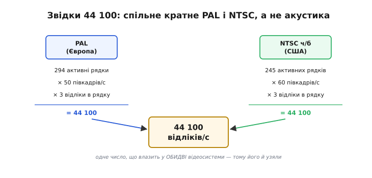

# 📜 Звідки взялося 44 100: число, яке подарувала не акустика, а відеокасета

Коли ми в темі вибирали частоту дискретизації, у стовпчику «звичайний запис» стояло дивне число — **44 100 Гц**. Решта в тому ж списку виглядають розсудливо: 8 000 і 16 000 — круглі, 48 000 — теж рівне й гарне. А 44 100 наче впало з неба: ні круглого кореня, ні очевидного «вдвічі більше за щось». Спокуса — придумати йому акустичне пояснення: мовляв, вухо чує до 20 кГц, [межа Найквіста](topic:communications/nyquist-aliasing) вимагає щонайменше вдвічі більше, тобто 40 кГц, а зверху накинули запас на фільтр — от і вийшло 44,1. Пояснення звучить логічно. І воно **неправильне**.

Правда цікавіша й трохи абсурдна: 44 100 узялося з того, що наприкінці 1970-х перший цифровий звук **не було на що записати**, крім відеомагнітофона. І щоб числа влізли в кадр відеосигналу — та ще й у кадр **двох несумісних** телесистем світу одразу, — довелося підігнати частоту дискретизації під арифметику телевізійного растру. Акустика тут узагалі ні до чого. Ця вставка — про те, як побутова відеокасета непомітно продиктувала стандарт, за яким досі кодують музику в кожному телефоні, і чому інженерне число буває спадком, а не розрахунком.

---

## Задача, від якої все почалося: куди подіти потік чисел

Спершу треба відчути масштаб проблеми, з якою зіткнулися інженери. Оцифрований звук — це **дуже багато** чисел за секунду. Візьмімо навіть скромні для сьогодні параметри: 40 тисяч відліків за секунду, по два байти на відлік, два канали — уже понад 150 кілобайт щосекунди, майже десять мегабайт на хвилину. У 1978 році це був жах. Магнітних дисків такої місткості для звуку не існувало; напівпровідникова пам'ять коштувала як літак; котушковий магнітофон писав **аналог**, а не потік байтів.

А от одна машина, яка вміла ковтати гігантський потік даних за секунду, у студіях **уже стояла** — відеомагнітофон. Телевізійний сигнал сам по собі — це шалений потік інформації (ціла рухома картинка тридцять разів на секунду), і відеострічка з її широкою смугою була розрахована саме на нього. Звідси й народилася зухвала ідея: а що, як **переодягнути** цифровий звук під відеосигнал? Узяти потік аудіобайтів, намалювати з нулів і одиниць чорно-білу «шахову» картинку — і записати її на звичайну відеокасету, наче це кіно?

Пристрій, який це робив, назвали **PCM-адаптером** (англ. *PCM adaptor*; PCM — *pulse-code modulation*, [імпульсно-кодова модуляція](topic:communications/i2s-bus), спосіб подати звук числами). Він робив дві речі: на вході перетворював аналоговий звук на числа й кодував їх як чорно-білий відеокадр (та сама вібруюча картата решітка на екрані, якщо таку стрічку пустити на звичайний телевізор), а на виході — читав картинку назад у числа. Між ними стояв будь-який побутовий чи студійний відеомагнітофон, який про звук нічого не знав і чесно записував «кіно».

> 🔧 **Навіщо це.** Це не музейна дивина, а корінь того, чому ваш мікроконтролер зараз тактує I2S саме на 44 100, а не на круглих 40 000. Стандарт частоти — не завжди результат розрахунку «скільки треба вуху»; часто це **закам'янілий слід** давнього технічного обмеження. Знаючи справжнє походження числа, ви не витрачаєте сили на пошук у ньому акустичного сенсу, якого там немає, і спокійно берете під свою задачу те, що зручно (16 кГц для голосу), а не те, що «історично головне».

---

## Дві машини Sony: PCM-1 і PCM-1600

Хто зробив цей трюк першим — тут варто бути точним, бо в мережі роки плутають. Піонером серійних PCM-адаптерів була японська **Sony**. Її **побутовий** апарат **PCM-1** з'явився 1977 року: він працював у парі з касетним відеомагнітофоном формату Betamax і давав змогу писати цифровий звук удома. Слідом, для студій, вийшов **професійний PCM-1600** — уже 16-бітний, у парі з відеомагнітофоном формату U-matic; саме на ньому в перші роки готували цифрові майстер-стрічки для пресування компакт-дисків.

Тут одразу зізнаюся про дату, бо джерела розходяться, і чесніше сказати прямо, ніж прикинутися впевненим. Сторінка Вікіпедії про 44 100 Гц називає роком появи PCM-1600 **1979-й**; власна корпоративна історія Sony датує професійну лінію 1600 радше **1978 роком** (перші машини — навесні 1978). Різниця в рік для нашого сюжету неважлива — важливо, що це **кінець 1970-х** і що це були **перші** доступні пристрої, які писали цифровий звук на відеострічку. *(Статус: усталений факт щодо лінії PCM-1/PCM-1600 і початку цифрового аудіозапису на відео; точний рік моделі 1600 — спірний між джерелами на ±1 рік.)*

Головне тут не марка й не рік, а **наслідок**. Раз носієм став відеомагнітофон, то формат звукового потоку мусив коритися формату **відеокадру**. А відеокадр у світі був не один.

---

## Пастка двох світів: PAL проти NTSC

Ось де починається справжня причина числа 44 100. Телебачення в 1970-х розкололося на дві головні несумісні системи, і зшити їх було неможливо.

**NTSC** (Північна Америка, Японія) успадкувала свою частоту кадрів від електромережі 60 Гц: у ній 525 рядків на кадр і, грубо, 30 кадрів за секунду (тобто 60 півкадрів — полів). **PAL** (більша частина Європи) стоїть на мережі 50 Гц: 625 рядків на кадр і 25 кадрів (50 півкадрів) за секунду. Ці числа несумісні між собою так само, як несумісні 50 і 60 Гц у розетці: те, що влазить у європейський кадр, не влазить у американський, і навпаки.

І тут PCM-адаптер потрапляв у пастку. Sony хотіла один апарат, який працює **і там, і там** — інакше довелося б робити дві різні машини, дві різні стрічки, два несумісні каталоги записів. А отже, кількість звукових відліків мусила рівно вкластися **в обидва** розкрої растру одночасно. Не «приблизно», а точно, бо кожен відлік займав конкретне місце в конкретному рядку конкретного кадру.

Арифметика тут проста, і саме вона все вирішила. У кожному активному рядку відеокадру можна розмістити **три** звукові відліки на канал. Тоді за секунду набирається:

```
PAL:        294 активні рядки × 50 півкадрів/с × 3 відліки = 44 100
NTSC (ч/б): 245 активних рядків × 60 півкадрів/с × 3 відліки = 44 100
```



*Одне число замість двох. Ліва гілка — європейський PAL, права — американський чорно-білий NTSC. Числа рядків і півкадрів у них геть різні, а добуток із трьома відліками в рядку в обох дає ту саму цифру. Саме тому взяли 44 100: воно єдине лягало в ОБИДВІ телесистеми без залишку — жодної акустики, чиста сумісність.*

Ось і вся розгадка. **44 100 — це найбільше число, яке рівно вкладалося одразу в PAL і в чорно-білий NTSC** при трьох відліках на рядок. Не 40 000 (бо не ділиться на растр акуратно), не 45 000, не «стільки, скільки чує вухо» — а рівно те, що дозволяла геометрія двох телекадрів. Інженери шукали не «найкращу для слуху» частоту, а **найбільшу спільно сумісну**, і природа телевізійного растру видала їм 44 100.

Є ще один дрібний, але показовий слід цієї історії. Коли NTSC став **кольоровим**, його частоту кадрів довелося ледь-ледь зсунути (з рівних 60 полів до 59,94 — щоб колірна піднесуча не била по звуку). І та сама формула дала вже не 44 100, а трохи інше число:

```
NTSC кольоровий:  245 × 59.94 × 3 ≈ 44 056
```

Тому ранні цифрові стрічки трапляються у двох дуже близьких частотах — 44 100 для PAL і чорно-білого NTSC та 44 056 для кольорового NTSC. Ця майже-однаковість ще зіграє свою роль трохи далі, коли настане час обрати одне число на весь світ.

---

## Компакт-диск: де 44 100 стало законом

Досі 44 100 було лише **внутрішньою зручністю** студійних адаптерів. Законом для всієї планети його зробив компакт-диск.

Наприкінці 1970-х дві компанії — японська **Sony** і нідерландська **Philips** — незалежно розробляли цифровий оптичний диск для музики й у 1979 році створили **спільну робочу групу**, щоб не випустити на ринок два несумісні формати (світ щойно намучився з «війною відеокасет» і повторення нікому не хотілося). Групу з боку інженерів вели двоє: **Кес Схаухамер Іммінк** (нід. *Kees Schouhamer Immink*) від Philips і **Тошітада Дої** (яп. 土井利忠, *Toshitada Doi*) від Sony. Ці двоє імен варто назвати правильно, бо саме вони, а не абстрактні «корпорації», доводили технічні деталі майбутнього CD.

Групі треба було домовитися про два числа: **частоту дискретизації** й **розрядність** відліку. І тут зіткнулися дві школи. Philips схилялася до 14 біт на відлік і своєї частоти (близько 44 кГц); Sony наполягала на **16 бітах** і на **44,1 кГц** — почасти саме тому, що в неї вже стояв парк PCM-1600, який писав рівно на цій частоті, і величезний каталог майстер-стрічок був би сумісний із новим форматом «задарма».

Розв'язка відбулася на конкретній зустрічі, і дату варто назвати: на четвертій нараді робочої групи **в Токіо 18–19 березня 1980 року** Philips прийняла пропозицію Sony — **16 біт і 44,1 кГц**. Це й зафіксувала специфікація, яку через колір обкладинки назвали **«Червоною книгою»** (*Red Book*, 1980): два канали, 16-бітний PCM, 44 100 відліків за секунду.

А чому саме рівно 44 **100**, а не 44 **056** (число кольорового NTSC)? Причина, як не дивно, суто людська: **44 100 легше запам'ятати**. З двох майже однакових спадкових чисел вибрали кругліше на вигляд — і воно стало каноном. Так дрібна зручність пам'яті інженера закам'яніла в стандарт, за яким людство кодує музику вже сорок років.

> 🔧 **Навіщо це.** Тут добре видно різницю між «хто придумав ідею» і «хто зафіксував стандарт», і цю різницю ми в курсі проводимо постійно. Число 44 100 **народилося** в PCM-адаптерах Sony з арифметики відеокадру, а **стандартом де-факто** його зробила «Червона книга» CD — інший крок, інші люди (Іммінк, Дої), інша зустріч. Плутати ці два моменти — типова помилка «історій винаходів»: приписати одному епізоду й авторство ідеї, і закріплення стандарту. Насправді це майже завжди різні події.

---

## Легенда про Дев'яту симфонію: як відрізнити правду від гарної історії

З цим самим CD ходить надзвичайно популярна історія, і про неї варто сказати окремо — саме тому, що вона показує, як **народжуються красиві міфи** навколо технічних рішень.

Історія така: нібито диаметр диска й тривалість запису (74 хвилини) обрали, щоб на один компакт-диск цілком уміщалася **Дев'ята симфонія Бетховена** — а конкретно її найдовше відоме на той час виконання, запис Вільгельма Фуртвенґлера (нім. *Wilhelm Furtwängler*) з Байройтського фестивалю 1951 року. За одними переказами, на цьому наполіг президент Sony **Норіо Ога** (яп. 大賀典雄, *Norio Ohga*), колишній оперний диригент; за іншими — його дружина, для якої Дев'ята була улюбленою.

Історія чудова — і майже напевно **прикрашена**. Той самий Кес Іммінк, інженер Philips із тієї робочої групи, прямо заперечує, що симфонія Бетховена визначила параметри диска: за його словами, рішення про розмір ухвалювало керівництво, а зв'язок із Дев'ятою — радше **романтична обгортка**, яку доклали до сухого технічного вибору, щоб надати йому людського обличчя. Іммінк зауважує й технічну деталь: завдяки його ж методу кодування (EFM, *eight-to-fourteen modulation*, що на третину ущільнював дані) навіть менший диск умістив би повну Дев'яту, тож жорсткої потреби рости до 12 см заради неї не було. Незалежна перевірка (зокрема Snopes) теж не підтверджує цієї легенди й лишає її статус **невизначеним**.

Тож зафіксуймо чесно. **Усталений факт:** 44 100 успадковане від PCM-адаптерів і закріплене «Червоною книгою» в березні 1980-го. **Гарна легенда:** буцімто саме Дев'ята Бетховена продиктувала тривалість і розмір CD — правдоподібно як анекдот, але спростовується учасником подій і не має твердого підтвердження. Уміти відділяти одне від одного — саме те, чого варта хороша історія техніки: не переказувати красиву байку як факт, а бачити під нею справжній, часто прозаїчніший, механізм рішення.

---

## Чому студії пішли своїм шляхом: рівні 48 000 Гц

Якщо 44 100 таке усталене, звідки тоді **друге** «професійне» число — 48 000, яке ми теж бачили в списку? Відповідь: студії та відеовиробництво з самого початку не любили 44 100 саме за його **криву** відеокасетну природу й, коли доросли до власного стандарту, свідомо взяли число, зручне **їм**.

На початку 1980-х професійний цифровий звук був зоопарком: різні фірми писали на частотах від 32 до 50 кГц, і сумісності не було. Робота над єдиним студійним стандартом почалася близько 1981 року; його оформили як **AES/EBU** — спільний стандарт Товариства аудіоінженерів (*Audio Engineering Society*) та Європейської мовної спілки (*European Broadcasting Union*). З кількох кандидатів (серед них 45, 48, 50, 52,5 і 54 кГц) переміг **48 000 Гц**, і не випадково.

Логіка 48 000 — рівно протилежна до логіки 44 100: не «підлаштуватися під старий відеокадр», а **рівно ділитися на все важливе** для студії. 48 000 дає ціле число відліків на кадр для **всіх** ходових частот кіно й відео — 24, 25 і 30 кадрів за секунду:

```
48 000 / 24 = 2000 відліків на кадр
48 000 / 25 = 1920 відліків на кадр
48 000 / 30 = 1600 відліків на кадр
```

Жодних дробів, жодних «зайвих» відліків, які треба кудись пристроювати між кадрами, — а це рай для монтажу, коли звук ріжуть та зшивають рівно по межах кадрів. Була й друга причина: європейське мовлення вже вело цифровий звук на 32 кГц, а 48 000 співвідноситься з ним як рівно **3:2**, тож перетворення між ними — просте, без «стрибучих» зайвих відліків. (Свою роль зіграв і прецедент: фірма Decca писала на 48 кГц ще з 1978 року.)

Ось чому світ і досі живе на **двох** частотах. **44 100** — це спадок компакт-диска, «музична» частота, на якій лежить уся стара фонотека; **48 000** — це «студійно-відеовиробнича» частота, зручна для монтажу з картинкою. У цьому й корінь вічної мороки звукорежисера: матеріал, знятий на відео (48 кГц), і музику з CD (44,1 кГц) доводиться зводити до однієї частоти, а таке перетворення ніколи не буває зовсім безкоштовним. Для нашого ж мікроконтролера висновок простий: якщо звук піде далі у відеотракт — беріть 48 000; якщо це самодостатній аудіозапис — 44 100; а якщо, як частіше буває на пристрої, це голос чи проста аналітика — обидва завеликі, і тут доречні куди скромніші числа.

---

## Чому для голосу вистачає 8 000 і 16 000 Гц

Наостанок — найскромніші числа зі списку, і вони теж не випадкові. Для голосу давно взяли **8 000 Гц**, а для «широкого» голосу — **16 000**, і корінь цього ще старший за CD.

Тут повертається чиста фізика [межі Найквіста](topic:communications/nyquist-aliasing): щоб схопити коливання частотою f, треба знімати відліки щонайменше вдвічі частіше. Класична телефонія колись вирішила, що для **розбірливості мови** досить смуги приблизно 300–3400 Гц — цього вистачає, щоб упізнати слова й співрозмовника, хоч звук і виходить «телефонним», без верхів. Найвища потрібна частота — близько 3,4 кГц, з невеликим запасом округлимо до 4 кГц; подвоївши за Найквістом, дістаємо рівно **8 000 Гц**. Це число зафіксував ще стандарт телефонного кодування **G.711** (ITU-T, 1972): смуга голосу, 8000 відліків за секунду. Звідси й вічні 8 кГц у всьому, що пов'язане з телефоном і рацією.

Коли захотіли, щоб голос звучав природніше (так званий *wideband*, «широка смуга»), підняли верхню межу приблизно до 7–8 кГц — і, знову подвоївши, дістали **16 000 Гц**. Це та сама частота, яку ми в темі радили для розпізнавання голосових команд: вона ловить усе, що робить мову розбірливою й навіть приємною, але вдвічі-втричі ощадливіша за 44 100, а тим паче за 48 000.

І ось тут уся ця історія замикається на нашій прямій задачі. Число частоти дискретизації — **ніколи не «чим більше, тим краще»**, а завжди відповідь на питання «яку смугу треба схопити». 44 100 і 48 000 несуть повну чутну смугу до ~20 кГц, бо народилися для музики й кіно, де ця смуга важлива. Голос живе в куди вужчій смузі — тож 8 або 16 кГц не «гірші», а **рівно під задачу**, і кожен зайвий герц частоти на мікроконтролері — це зайві байти в буфері, зайва робота ядра й зайве місце в записі, куплені ні за що. Історія 44 100 — найкраще нагадування про це: навіть «головний» стандарт світу колись обрали не з акустики, а з чужого, давно забутого обмеження, і сліпо тягти його всюди немає жодного сенсу.
