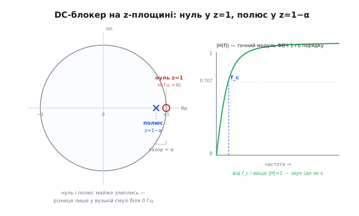
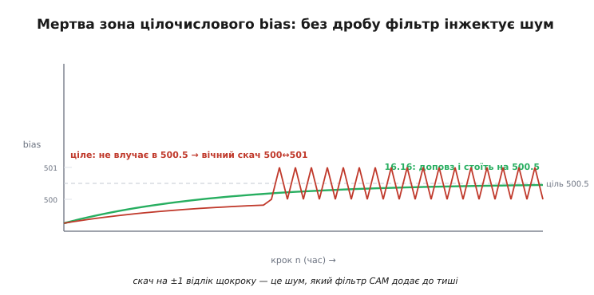

# 🧮 DC-блокер під мікроскопом: полюс, зріз і крок кванта

У темі ми прибрали постійний зсув одним рядком — `bias += (x − bias) >> k`, а потім `y = x − bias` — і навіть у детальному розборі домовилися, що зріз лежить біля `f_s / (2π · 2ᵏ)`. Слово «біля» тут не випадкове: то було **наближення**. Воно чудове для наших чисел, але за ним ховається точна машина, і поки ми на неї не глянемо, три речі лишаються магією: **чому** нуль підсилення припадає рівно на 0 Гц (а не «десь низько»), **де саме** стоїть зріз, коли α перестає бути крихітним, і **звідки** береться шум, якщо викинути дробову кому й тримати `bias` цілим. Ця вставка виводить усе це з нуля — з тієї самої різницевої формули, нічого не приймаючи на віру.

Домовимося про мову. `x[n]` — вхідний відлік на кроці n (ціле, у форматі 16.16, але зараз формат не важить — думаймо про нього як про число). `b[n]` — стан `bias` після кроку n. `y[n]` — вихід. α = 1/2ᵏ — частка, на яку `bias` присувається до входу за крок (для k = 10 це α = 1/1024 ≈ 0.000977). f_s — частота дискретизації. Мета — від цих трьох рядків дійти до **передавальної функції** H(z), а з неї прочитати все інше.

> 🔧 **Навіщо це.** «Працює й так» — правда, поки числа не змінюються. Та щойно ви піднімете частоту до 48 кГц, або захочете зріз рівно на 20 Гц, або зіткнетеся з тим, що фільтр на тиші тихо шипить, наближення й магія перестають рятувати. Точна H(z) дає передбачення: підставив α і f_s — дізнався зріз до частки герца, дізнався, скільки блоків фільтр устоюватиметься, і зрозумів, чому саме дробова кома, а не «просто int», прибирає власний шум фільтра. Це різниця між «підібрав 10 навмання» і «знаю, що станеться».

## Означення: що таке текучий інтегратор як оператор

Почнімо з чесного означення того, що робить перший рядок. Розкриймо `>> k` як множення на α і випишімо рекурсію станом:

```
b[n] = b[n−1] + α·(x[n] − b[n−1])
     = α·x[n] + (1 − α)·b[n−1]
```

Прочитаймо це не як код, а як **оператор над послідовністю**: він бере вхід `x` і видає послідовність `b`, де кожне нове значення — це «трошки нового входу (частка α) плюс майже весь старий стан (частка 1−α)». Це згладжувач: різкі стрибки входу він розмазує, повільні зміни пропускає майже без опору. Саме тому `b` — оцінка того, «де зараз стоїть повільна складова», тобто де сидить постійний зсув.

Тепер друга дія робить головний фокус:

```
y[n] = x[n] − b[n]
```

Вихід — це **вхід мінус його ж згладжена копія**. Інтуїція така: якщо взяти сигнал і відняти від нього його повільну частину, лишиться швидка частина. Постійний зсув — найповільніше, що є (він взагалі не рухається), тож він піде першим. Це вже фільтр верхніх частот на рівні ідеї. Але «на рівні ідеї» нам мало — треба точно знати, що він пропускає, а що душить, і наскільки. Для цього рекурсію треба перевести в мову, де фільтр видно цілком: у z-область.

## z-перетворення: навіщо взагалі z і що воно каже

Різницева формула описує фільтр **у часі** — крок за кроком. Але щоб побачити, які **частоти** він пропускає, потрібен інший погляд. Ідея z-перетворення проста до зухвалості: подаймо на вхід не якийсь конкретний звук, а **чисту нескінченну степеневу хвилю** виду zⁿ, де z — комплексне число. Чому саме zⁿ? Бо для лінійного фільтра зі сталими коефіцієнтами така хвиля — **власна функція**: на виході вийде та сама zⁿ, лише помножена на якесь число, що залежить від z. Це число й називають передавальною функцією H(z). Уся поведінка фільтра стискається в одну комплексну функцію одного аргументу.

Механіка перекладу тримається на одному факті. Затримка на один крок — «взяти попередній відлік» — у z-області це множення на z⁻¹. Формально: якщо послідовності `s[n]` відповідає образ S(z), то зсунутій `s[n−1]` відповідає z⁻¹·S(z). Ось і весь інструмент: **кожне `[n−1]` у формулі замінюємо на z⁻¹**, кожен `[n]` лишаємо як є, а самі послідовності — на їхні образи. Перетворення лінійне, тож сума лишається сумою, стала перед доданком лишається сталою.

> 🔧 **Навіщо це.** z⁻¹ — не абстракція, а буквально ваш регістр стану: `b[n−1]` у коді — це значення `bias`, що лежить у пам'яті з минулого кроку. Замінивши його на z⁻¹, ви не втрачаєте зв'язку із залізом — ви лише переписуєте той самий цикл мовою, у якій відповідь на питання «що з басом, що з гулом, що з постійним зсувом» читається з формули, а не вимірюється осцилографом.

Хто хоче побачити, чому саме z⁻¹ відповідає затримці, і як образ узагалі будується з суми — [короткий вивід z-перетворення](root:com-signal/z-transform) дає це на пальцях; нам тут достатньо правила заміни.

## Виведення H(z): дві формули, три рядки алгебри

Перекладімо обидві дії. Спершу інтегратор станом. Беремо

```
b[n] = α·x[n] + (1 − α)·b[n−1]
```

і застосовуємо правила: `b[n]` → B(z), `x[n]` → X(z), `b[n−1]` → z⁻¹·B(z). Виходить рівняння вже не з послідовностями, а з образами:

```
B(z) = α·X(z) + (1 − α)·z⁻¹·B(z)
```

Тепер зберемо B(z) в один бік — це звичайна алгебра, z⁻¹ поводиться як стала:

```
B(z) − (1 − α)·z⁻¹·B(z) = α·X(z)
B(z)·[1 − (1 − α)·z⁻¹] = α·X(z)
```

Звідси відношення образу стану до образу входу:

```
B(z)     α
──── = ────────────────
X(z)   1 − (1 − α)·z⁻¹
```

Це передавальна функція **самого інтегратора** — низькочастотна, як і слід було чекати: у чисельнику стала, у знаменнику один член із z⁻¹. Але нам потрібен не `b`, а `y`. Перекладімо другу дію `y[n] = x[n] − b[n]`:

```
Y(z) = X(z) − B(z)
```

Підставимо сюди щойно знайдене B(z) = X(z)·α / [1 − (1−α)z⁻¹]:

```
Y(z) = X(z) − X(z)· ──────────────── 
                    1 − (1 − α)·z⁻¹

           ⎡     1 − (1 − α)·z⁻¹ − α ⎤
     = X(z)·⎢ ───────────────────────⎥
           ⎣    1 − (1 − α)·z⁻¹      ⎦
```

Розкриймо чисельник. `1 − (1−α)·z⁻¹ − α = (1 − α) − (1 − α)·z⁻¹ = (1 − α)·(1 − z⁻¹)`. Отже:

```
Y(z)   (1 − α)·(1 − z⁻¹)
──── = ─────────────────── = H(z)
X(z)   1 − (1 − α)·z⁻¹
```

Ось вона — **точна передавальна функція DC-блокера**, без жодного наближення. Тепер прочитаймо, що в ній записано.

## Читаємо H(z): нуль у z=1 — і чому саме там сидить 0 Гц

Передавальна функція — це дріб від z⁻¹. Два числа вирішують усе: де чисельник обертається на нуль (**нуль** фільтра) і де знаменник (**полюс**). У нулі фільтр глушить сигнал повністю; біля полюса — навпаки, підсилює. Наша H(z) віддає їх одразу.

Чисельник `(1 − α)·(1 − z⁻¹)` дорівнює нулю, коли `1 − z⁻¹ = 0`, тобто **z = 1**. Знаменник дорівнює нулю, коли `z⁻¹ = 1/(1−α)`, тобто **z = 1 − α**. Множник `(1 − α)` спереду — дійсна стала підсилення: він не зсуває ні нуля, ні полюса, тож розташування нуля в z=1 (а отже й строгий нуль підсилення на 0 Гц) лишає недоторканим. Але він притискає **усю** криву відповіді в (1−α) разів — і коли нижче ми діставатимемо точний зріз за рівнем 0.707, цю сталу доведеться тримати, бо для агресивного фільтра вона помітно менша за одиницю.

```
нуль:   z = 1
полюс:  z = 1 − α         (трохи всередині від z=1)
```

Тепер найважливіше — **чому z = 1 означає саме 0 Гц**. Частоту в z-області читають на **одиничному колі**: точці z = e^(jω) відповідає кутова частота ω, а їй — звичайна частота f = ω·f_s / (2π). Обійти все коло від ω=0 до ω=2π — це пройти всі частоти від 0 до f_s. І точка z = 1 = e^(j·0) — це рівно **ω = 0**, тобто **f = 0 Гц**. Постійний зсув — сигнал, що не коливається, — живе саме тут. А наш фільтр має нуль **точно** в цій точці. Тому підсилення на 0 Гц дорівнює **строго нулю**: будь-яка стала складова множиться на нуль і зникає без залишку. Не «сильно давиться», а знищується начисто — і це не збіг налаштувань, а математичний факт розташування нуля.



*Нуль (○) сидить рівно на колі в z=1 — це 0 Гц, і підсилення там строго нуль. Полюс (×) — трохи всередині, у z=1−α. Зазор між ними дорівнює α: він і задає, наскільки вузьку смугу біля нуля фільтр устигає задавити. Праворуч — точний модуль |H(f)|: він тягнеться від нуля на 0 Гц, перетинає рівень 0.707 у зрізі f_c і далі майже одразу виходить на одиницю. Від f_c і вище звук іде як є.*

А полюс у z = 1−α сидить **трохи всередині** кола — на відстані α від нуля. Ця близькість нуля й полюса і є вся суть DC-блокера: вони майже накладаються, тож майже скрізь на колі їхні впливи гасять один одного, і фільтр пропускає сигнал незайманим. Лише у **вузесенькій** смузі біля z=1, де нуль тягне підсилення вниз, а полюс іще не встиг його підняти, лишається провал. Ширина цього провалу — і є смуга, яку ми ріжемо. Що менша α, то ближче полюс до нуля, то вужчий провал, то нижчий зріз. Зв'язок «α ↔ зріз» уже видно геометрично; лишається виразити його числом.

## Точна частотна відповідь і ТОЧНИЙ зріз без наближення

Щоб дістати зріз, поставимо z = e^(jω) у H(z) і знайдемо **модуль** — у скільки разів фільтр міняє амплітуду хвилі частоти ω. Множник `(1−α)` спереду — дійсне додатне число, тож з-під модуля він виходить просто множником; відкидати його не можна (для агресивного фільтра він відчутно менший за одиницю), тому тягнемо його з собою:

```
               |1 − e^(−jω)|
|H(ω)| = (1−α)·────────────────────────
               |1 − (1 − α)·e^(−jω)|
```

Кожен модуль — довжина вектора на комплексній площині. Розкладемо через синус і косинус. Для будь-якого дійсного r маємо |1 − r·e^(−jω)|² = (1 − r·cos ω)² + (r·sin ω)². Розкриймо і згорнімо (cos²+sin²=1):

```
|1 − r·e^(−jω)|² = 1 − 2r·cos ω + r²
```

Тоді квадрат модуля відповіді. Чисельник (r=1) згортається в 2 − 2cos ω = 2(1 − cos ω), знаменник бере ту саму формулу з r = 1−α, а спереду лишається множник (1−α)²:

```
                 2·(1 − cos ω)
|H(ω)|² = (1−α)²·──────────────────────────
                 1 − 2(1−α)cos ω + (1−α)²
```

Оце — **точна** формула, тепер справді без жодного наближення: множник (1−α)² на місці, ω і α — будь-які. Зріз f_c за означенням — частота, де потужність падає вдвічі, тобто |H|² = 1/2 (амплітуда = 1/√2 ≈ 0.707). Прирівняймо і розв'яжімо відносно cos ω_c:

```
       2·(1 − cos ω_c)
(1−α)²·──────────────────────────── = ½
       1 − 2(1−α)cos ω_c + (1−α)²
```

Помножимо навхрест і зберімо cos ω_c. Позначмо для стислості p = 1−α (положення полюса), тоді (1−α)² = p²:

```
4p²·(1 − cos ω_c) = 1 − 2p·cos ω_c + p²
4p² − 4p²·cos ω_c = 1 + p² − 2p·cos ω_c
```

Переносимо все з cos ω_c ліворуч, решту праворуч:

```
−4p²·cos ω_c + 2p·cos ω_c = 1 + p² − 4p²
cos ω_c·(2p − 4p²)        = 1 − 3p²
```

Звідси **точний зріз**, без жодних «≈»:

```
          1 − 3p²                           1 − 3(1 − α)²
cos ω_c = ─────────── ,   тобто   cos ω_c = ────────────────────
          2p − 4p²                          2(1 − α) − 4(1 − α)²

f_c = (f_s / 2π)·arccos( (1 − 3(1−α)²) / (2(1−α) − 4(1−α)²) )
```

Ось точне співвідношення α ↔ f_c. Воно негарне, зате чесне: підставив α і f_s — дістав зріз до будь-якого знака після коми, і для великих α (коли полюс відходить від кола далеко) це єдина правильна формула. Перевірмо її на наших числах.

**Точний зріз для k = 10, f_s = 16 кГц:**

```
α = 1/1024 = 0.0009765625
p = 1 − α  = 0.9990234375
p²         = 0.99804783
чисельник:  1 − 3p²     = −1.99414349
знаменник:  2p − 4p²    = −1.99414444
cos ω_c    = −1.99414349 / −1.99414444 = 0.99999952
ω_c        = arccos(0.99999952) = 0.00097800 рад
f_c        = (16000 / 6.283185)·0.00097800 = 2546.48·0.00097800 ≈ 2.490 Гц
```

Точна відповідь — **2.490 Гц**. А що дає наближення `f_s·α/(2π)`?

```
f_c ≈ 16000·(1/1024)/6.283185 = 15.625/6.283185 ≈ 2.487 Гц
```

Практично ті самі **2.49 Гц**: точна формула дає 2.490, наближення — 2.487, різниця аж у третьому знаку. І весь секрет цього збігу в тому, що тут (1−α)² = 0.998 — той множник, який ми чесно втримали, при k=10 й сам майже дорівнює одиниці, тож із ним чи без нього вийшло б те саме. А коли він перестане дорівнювати одиниці — усе розійдеться; саме там і проходить межа правомірності наближення, і її варто відчути окремо.

## Коли наближення f_c ≈ f_s·α/(2π) законне, а коли бреше

Наближення не з неба взялося — воно виводиться з точної формули граничним переходом при **малому** α. Логіка коротка. Коли α мале, зріз ω_c теж малий (полюс майже на колі, провал вузесенький і тулиться до нуля). Для малого кута справджується розклад cos ω_c ≈ 1 − ω_c²/2. Підставмо це в точну умову |H|²=½. З лівого боку чисельник 2(1−cos ω_c) ≈ 2·(ω_c²/2) = ω_c². Знаменник при малому α і малому ω розкладається так, що з точністю до першого порядку домінує член з α, і рівняння ½ зводиться до

```
ω_c ≈ α        (у радіанах на відлік)
```

а перехід до герців дає ω_c·f_s/(2π):

```
f_c ≈ f_s·α / (2π)
```

Ось звідки 2π і звідки простота. Ключове слово — **малий α**: тоді й (1−α)² ≈ 1, тож той множник спереду нічого не важить, і зріз тримається на самому куті ω_c ≈ α. Правило-орієнтир: наближення тримається в межах відсотка, поки α ≲ 0.008 (тобто k ≳ 7), а для α ≈ 0.001 (k = 10) похибка лише 0.15 %. У нас саме цей випадок — на порядок глибше в безпечній зоні, тому все й збіглося до третього знака.

А тепер де воно **бреше**. Уявімо агресивний DC-блокер із k = 3, α = 1/8 = 0.125 — хтось так робить, коли хоче різати гул мережі 50 Гц дешево. Тут (1−α)² = 0.766 — уже зовсім не одиниця, і викинути цей множник означало б відповісти неправильно. Рахуймо чесно, обома способами:

```
наближення:  f_c ≈ 16000·0.125/6.283185 = 2000/6.283 ≈ 318.3 Гц

точно:  p = 0.875,  p² = 0.765625
        1 − 3p²  = 1 − 2.296875 = −1.296875
        2p − 4p² = 1.75 − 3.0625 = −1.3125
        cos ω_c  = −1.296875 / −1.3125 = 0.988095
        ω_c = arccos(0.988095) = 0.154457 рад
        f_c = 16000·0.154457/6.283185 ≈ 393.3 Гц
```

Розбіжність уже **19 %** — наближення каже 318 Гц, а зріз насправді аж на **393 Гц**. І хибить воно в підступний бік: ви думаєте, що ріжете все до 318 Гц, а фільтр насправді з'їдає низ голосу ще на 75 Гц вище. Що агресивніший фільтр (менший k, більший α), то далі полюс від кола — і кут ω_c уже не малий (cos ω_c ≠ 1 − ω_c²/2), і множник (1−α)² уже не одиниця; обидва наближення сипляться разом. Мораль проста: **для м'яких DC-блокерів (k ≥ 8) бери зручне наближення — похибка мізерна; для агресивних (k ≤ 4) рахуй точною формулою, інакше отримаєш зріз далеко не там, де думав.**

## Стала часу: скільки фільтр устоюється після ввімкнення

Частотна відповідь каже, що фільтр робить із **усталеним** сигналом. Але є друге питання: коли ввімкнули живлення, `bias` стартує з нуля, а реальний зсув — скажімо, 500. Скільки кроків `bias` повзтиме до правди? Це **перехідний процес**, і його теж видно з рекурсії — навіть без z.

Подамо на вхід сталу x[n] = X (увімкнули — і на вході стоїть постійний зсув X, звук поки мовчить). Рекурсія стану:

```
b[n] = α·X + (1 − α)·b[n−1]
```

Це геометричне наближення до X. Відстань, що лишилася, e[n] = X − b[n], на кожному кроці множиться рівно на (1−α):

```
e[n] = X − b[n] = (1 − α)·(X − b[n−1]) = (1 − α)·e[n−1]
```

тобто e[n] = e[0]·(1−α)ⁿ — **чиста геометрична спадна**. Помилка усідає в разів e (до ~37 %) за таку кількість кроків N_τ, що (1−α)^N_τ = 1/e. Логарифмуємо, і для малого α користуємось ln(1−α) ≈ −α:

```
N_τ · ln(1 − α) = −1
N_τ = −1 / ln(1 − α) ≈ 1/α = 2ᵏ  кроків
```

Стала часу у **кроках** — це рівно 2ᵏ. Переведімо в секунди, поділивши на f_s:

```
τ ≈ 2ᵏ / f_s
k = 10, f_s = 16 000 Гц:   τ ≈ 1024 / 16000 = 0.064 с = 64 мс
```

За τ помилка спаде до 37 %, за 3τ (≈190 мс) — до 5 %, за 5τ (≈320 мс) — до менш ніж 1 %. Ось точна ціна вибору k: він **одночасно** тягне зріз (нижчий k — вищий зріз) і усталення (нижчий k — швидше усталення). Це той самий компроміс, що й розмір блоку в темі, лише тут він у явній формулі: **опустити зріз удвічі (k+1) — це подвоїти час усталення.** Хочеш зріз 1.2 Гц замість 2.5 — плати 130 мс кривого старту замість 64. Задарма нижчого зрізу не буває.

Практичний висновок для запису: перші ~3τ звуку після ввімкнення проходять крізь ще-не-наведений фільтр і виходять спотвореними (часто з великим стрибком на самому початку). Тому в темі й з'явився «теплий старт» — ініціалізувати `bias` середнім першого блоку, щоб e[0] було майже нулем і перехідного процесу взагалі не було. Формула τ ≈ 2ᵏ/f_s дає точну міру того, скільки саме ви заощаджуєте цим трюком.

## Крок кванта: чому БЕЗ фіксованої коми фільтр сам додає шум

Лишилася найтонша частина — чому `bias` живе у форматі **16.16**, а не просто в `int32_t` як ціле число відліків. У темі це сховано в одному реченні: «без цього крок був би цілий відлік — надто грубо, `bias` смикався б на ±1 і сам додавав шум». Тепер розберімо це строго, бо тут ховається пастка, у яку легко впасти й потім годинами шукати «звідки шипіння на тиші».

Уся арифметика в мікроконтролері цілочислова. Питання лише — **де стоїть уявна кома**. Два варіанти.

**Варіант А — наївний: `bias` тримає ціле число відліків.** Тоді крок інтегратора — це `(x − bias) >> k` над цілими, і результат зсуву **округляється донизу до цілого**. Ось де катастрофа. Уявімо реальний зсув 500.5 — між двома цілими (мікрофон не зобов'язаний давати зсув рівно на цілому відліку). `bias` доповзе до 500 і спробує зробити наступний крок:

```
bias = 500,  x = 500.5 (реально надходить то 500, то 501 через шум)
крок:  (x − bias) >> k = (500 − 500) >> 10 = 0     → bias стоїть на 500
але наступний відлік x = 501:
крок:  (501 − 500) >> 10 = (1) >> 10 = 0            → крок ЗАОКРУГЛИВСЯ В НУЛЬ
```

Різниця в один відлік, зсунута на 10 розрядів, дає **нуль**: `bias` не може зрушити менш ніж на цілу одиницю, а на цілу — зарано. Він **застряє** й ніколи не влучає в 500.5. У кращому разі стоїть на 500 (недокомпенсація на пів-відліка лишається в сигналі назавжди). У гіршому — коли вхід трохи більший — накопичення штовхає його на 501, тоді назад на 500, і `bias` **вічно скаче 500↔501 щокроку**. Це називають граничним циклом (англ. *limit cycle*): фільтр без входу-звуку сам генерує коливання ±½ відліка. Оскільки `y = x − bias`, цей скач **прямо підмішується у вихід** — на абсолютній тиші фільтр інжектує пилку амплітудою в один молодший біт. Ви прибирали шум, а отримали новий, свій власний.



*Ціль — зсув 500.5, між двома цілими. Зелений трек (16.16): `bias` доповзає дрібними дробовими кроками й спокійно **стоїть** на 500.5 — виходить чистий нуль. Червоний трек (цілий `bias`): доповз до 500, а далі не влучає в 500.5 і **вічно скаче 500↔501** — цей скач на ±1 відлік щокроку і є шум, який фільтр сам додає до тиші.*

**Варіант Б — правильний: `bias` у форматі 16.16.** Тепер між 16-м і 15-м бітом стоїть уявна кома: старші 16 біт — ціла частина відліку, молодші 16 — дробова. Одиниця в цьому форматі — це 1/65536 відліка. Крок інтегратора `(x − bias) >> 10` тепер працює над числами, зсунутими на 16 розрядів угору, тож **найменший ненульовий крок** — не цілий відлік, а 1/65536 його частка:

```
відлік у 16.16:  x = 500.5 → (500·65536 + 32768) = 32800768
bias повзе кроками виду (x − bias) >> 10 — а це десятки-сотні тисяч у Q16,
тобто ЧАСТКИ відліка. bias спокійно зупиняється на 32800768 (=500.5) і стоїть.
```

Роздільність `bias` тепер — 1/65536 відліка, а зсув треба відстежити з точністю кращою за ½ відліка. Запас — у 32 тисячі разів. Мертвої зони немає: `bias` завжди може зробити крок дрібніший за помилку, доповзає точно до 500.5 і **завмирає**. Граничний цикл зникає, бо квант стану став мізерним проти того, що треба виміряти. Ось точна причина фіксованої коми: **вона робить крок дискретизації стану настільки дрібним, що власний шум квантування фільтра тоне глибоко під шумом мікрофона й не чутний.**

> 🔧 **Навіщо це.** Це найпідступніша помилка DC-блокера, бо вона не валить збірку й не дає видимого сміття — вона тихо підмішує пилку в один молодший біт на тиші, і ви чуєте «шипіння», якого «не має бути». Причина не в мікрофоні й не в АЦП, а в тому, що ваш власний фільтр застряг у мертвій зоні цілочислового кроку. Формат 16.16 коштує нуль додаткових тактів (ті самі зсуви `<< 16` / `>> 16`), а прибирає цілий клас шуму. Тому в темі `bias` **навмисно** дробовий — і тепер видно, що це не примха, а точний наслідок кроку кванта.

Скільки саме дробових біт треба? Рівно стільки, щоб квант стану був дрібнішим за потрібну точність відстеження зсуву. Пів-відліка вимагає бодай 1 дробового біта, але запас корисний: 16 біт (формат 16.16) дають роздільність 1/65536 — з колосальним запасом, і ще й лишають цілій частині повний діапазон `int16` для самого рівня зсуву. Це найзручніший поділ 32-бітного слова навпіл, тому його й беруть за замовчуванням. Хто хоче глибше в те, як фіксована кома тримає дробову точність цілими числами й де в ній підводні камені переповнення — [фіксована кома](root:hw-arch/fixed-point) розбирає це окремо; для DC-блокера головне вже сказано: **дробова кома розчиняє власний квантувальний шум фільтра, цілочислова — його породжує.**

## Де це працює в темі: від формули назад до рядка коду

Зберімо все докупи — тепер кожен символ у тому однорядковому фільтрі має точну підпору.

- **`bias += (x − bias) >> k`** — це текучий інтегратор з α = 1/2ᵏ. У z-області він дає передавальну H(z) = (1−α)(1−z⁻¹) / (1 − (1−α)z⁻¹).
- **`y = x − bias`** — це віднімання, що ставить **нуль рівно в z=1**, тобто робить підсилення на 0 Гц строго нульовим. Постійний зсув знищується не приблизно, а точно — бо так лягла математика, а не налаштування.
- **Полюс у z=1−α** сидить трохи всередині кола; зазор α між нулем і полюсом задає ширину смуги, яку фільтр ріже, а отже й зріз.
- **Зріз** точно дорівнює f_c = (f_s/2π)·arccos((1−3(1−α)²)/(2(1−α)−4(1−α)²)); для м'яких фільтрів (k≥8) він з високою точністю дорівнює зручному f_s·α/(2π). Для k=10, f_s=16 кГц це ≈2.49 Гц (наближення дає 2.487 — практично те саме).
- **Стала часу** τ ≈ 2ᵏ/f_s = 64 мс — стільки фільтр устоюється після ввімкнення; опустити зріз удвічі = подвоїти цей час.
- **Формат 16.16** робить квант стану `bias` дрібнішим за ½ відліка, чим прибирає граничний цикл; без дробової коми фільтр сам інжектував би пилку в молодший біт на тиші.

Один рядок коду — і за ним стоїть повний фільтр верхніх частот першого порядку з передбачуваним зрізом, передбачуваним усталенням і чистим виходом. Саме тому в темі ми могли писати його як «магію»: магія тут — це згорнута до трьох зсувів точна машина, яку ми щойно розгорнули назад у всі її частини.
