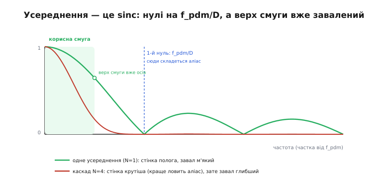
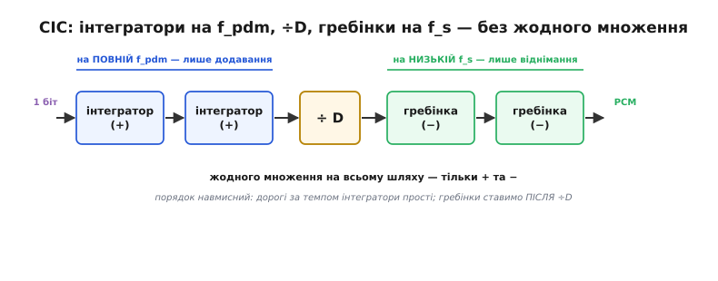

# ⚙️ Дециматор PDM→PCM: робочий C для прошивки

У самій темі ми поставили PDM-мікрофон поряд із двома іншими джерелами й домовилися вести розповідь на найпростішому — I2S. Але від PDM ми відкараскалися однією фразою: «мікроконтролер мусить пропустити потік через фільтр-проріджувач». Ось тут ми цю фразу розкриваємо до кінця — до коду, який справді компілюється в прошивку й крутиться в перериванні DMA.

Задача звучить оманливо просто: на вхід іде **однобітний потік** — нулі й одиниці на дуже високій частоті, — а на виході має бути звичайний масив `int16_t` на нормальній звуковій частоті. Здається, досить порахувати, скільки одиниць у кожній пачці бітів, і записати це число. Спокуса саме така, і саме вона ламає перший десяток спроб: голос виходить глухим, тиша шипить, а на певних тонах з'являється свист, якого в кімнаті не було. Розберімо, **чому** так, і побудуймо дециматор, який цього не робить, — спершу найпростіший, а тоді той, що реально стоїть у бойових прошивках.

> 🔧 **Навіщо це.** PDM-мікрофон коштує копійки й займає два піни, тому його ставлять усюди — від навушників до пилососів. Але, на відміну від I2S, він **не віддає готового числа**: перетворення однобітного потоку на PCM лягає на ваше ядро. Не зробите цей крок правильно — і жоден наступний етап конвеєра (рівень, [детекція подій](root:embedded/audio-events-detection)) не врятує, бо на вхід їм піде вже зіпсований звук. Дециматор — це той місток, без якого PDM-мікрофон просто німий.

## Що взагалі приходить дротом

Перш ніж фільтрувати, згадаймо, **що саме** лежить у потоці. Усередині PDM-мікрофона сидить [сигма-дельта модулятор](topic:hw-analog/sigma-delta-adc) — крихітна петля, яка щотакту вирішує одне-єдине: сигнал зараз вищий за мою внутрішню оцінку чи ні? Вищий — видати одиницю й трохи підняти оцінку; нижчий — видати нуль і трохи опустити. Мікрофон нічого не знає про «гучність у числі»; він лише женеться своєю оцінкою за реальним звуком і ставить біти так, щоб **у середньому** їхня щільність повторювала форму сигналу.

> 🔧 **Навіщо це.** Ключове слово — «у середньому». Один окремий біт не значить нічого: він то нуль, то одиниця навіть у повній тиші, бо петля весь час коливається навколо своєї оцінки. Інформація живе не в бітах, а в їхній **щільності на відрізку**. Тому будь-який дециматор — це, по суті, машина для вимірювання цієї щільності; питання лише в тому, наскільки чесно він її міряє.

Тепер важлива арифметика частот, без якої не порахувати ні буфер, ні фільтр. Мікрофон тактується від нашого ж сигналу CLK, і **на кожен такт видає один біт**. Ми хочемо на виході частоту дискретизації f_s. Зв'язок між ними — коефіцієнт проріджування D (англ. *decimation ratio* — «у скільки разів рідшаємо»):

```
f_pdm = D · f_s
```

Тобто мікрофон гатить біти в D разів частіше, ніж нам потрібно відліків. Це співвідношення зветься коефіцієнтом передискретизації (англ. *oversampling ratio*, OSR), і для PDM його беруть великим — 64 або 128, бо сигма-дельта модулятору **треба** багато тактів, щоб щільністю однобітного потоку точно передати рівень. Порахуймо на конкретних числах, які справді трапляються:

```
хочу f_s = 16 000 Гц,  візьму D = 64   →  f_pdm = 1 024 000 Гц  ≈ 1.024 МГц
хочу f_s = 48 000 Гц,  візьму D = 64   →  f_pdm = 3 072 000 Гц  ≈ 3.072 МГц
хочу f_s = 16 000 Гц,  візьму D = 128  →  f_pdm = 2 048 000 Гц  ≈ 2.048 МГц
```

Отже, для звичайного мовного тракту на 16 кГц мікрофон треба тактувати десь на мегагерц, і саме стільки бітів за секунду ядро мусить проковтнути й перетравити. Мільйон однобітних рішень щосекунди, з яких треба зробити шістнадцять тисяч чесних чисел, — ось справжній масштаб задачі.

## Біти не поодинці: як їх приносить DMA

Мільйон переривань за секунду — це смерть для будь-якого ядра: на самі лише входи-виходи з обробника пішов би весь час. Тому окремі біти нас не цікавлять; їх, як і в решті конвеєра, приносить [DMA](root:embedded/dma-spi-i2s) — але приносить **упакованими в байти**. Периферія (найчастіше той самий I2S-блок у режимі PDM, або SPI) складає 8 послідовних бітів потоку в один байт і віддає DMA цілі байти, а той — цілими блоками в пам'ять. Замість мільйона переривань маємо кількадесят на секунду, як і звикли.

Тут ховається перша дрібниця, на якій легко спіткнутися: **порядок бітів у байті**. Периферія зазвичай кладе перший у часі біт у старший розряд байта (MSB-first). Отже, розпаковуючи байт, найстарший його біт треба взяти **першим**, інакше час усередині байта поїде задом наперед. Напишемо розпаковку чесно:

```c
#include <stdint.h>

// Розгортає один байт PDM у 8 значень ±1 у часовому порядку.
// out мусить мати місце щонайменше на 8 елементів.
static inline void pdm_unpack_byte(uint8_t b, int8_t *out) {
    for (int i = 0; i < 8; i++) {
        // старший біт — найраніший у часі: беремо його першим
        int bit = (b >> (7 - i)) & 1;
        out[i] = bit ? +1 : -1;   // 1 → +1, 0 → −1 (біполярно навколо нуля)
    }
}
```

Зверніть увагу на `+1 / −1` замість `1 / 0`. Це не косметика, а суть. Якби ми лишили `1 / 0`, то середнє «мовчазного» потоку (де нулів і одиниць порівну) дорівнювало б 0.5, а не нулю, — і ми б тягли за собою постійний зсув через увесь фільтр. Обернувши потік у **біполярний** (одиниця це +1, нуль це −1), ми ставимо тишу рівно в нуль: у мовчанні плюси й мінуси взаємно гасяться, і середнє виходить нульовим само собою. Цей крок економить нам роботу з постійним зсувом далі по тракту — принаймні від того зсуву, який породив би сам формат.

> 🔧 **Навіщо це.** Дрібне рішення «+1/−1 замість 1/0» вирішує половину майбутніх головних болів із рівнем. Половина «тихого» звуку в новачків — це не тихий звук, а незнищений зсув 0.5, який фільтр протягнув через увесь тракт. Поставивши тишу в нуль **на вході**, ми більше про неї не думаємо.

## Найпростіша ідея — і чому вона недостатня

Найочевидніший дециматор: беремо D бітів поспіль, додаємо їх (у біполярній формі), ділимо на D — маємо середнє, тобто рівень на цьому відрізку. Пересунулися на наступні D бітів — маємо наступний відлік. Це **прямокутне усереднення** (англ. *boxcar* — «товарний вагон», бо вікно усереднення має форму прямокутника-вагончика). Ось воно кодом, чесно й буквально:

```c
// Наївний boxcar-дециматор: середнє кожних D бітів → один відлік.
// Повертає, скільки відліків PCM поклав у out.
static int pdm_decimate_boxcar(const uint8_t *pdm, int nbytes,
                               int D, int16_t *out) {
    int8_t bits[8];
    int acc = 0;       // сума біполярних бітів у поточному вікні
    int cnt = 0;       // скільки бітів уже назбирали (0..D)
    int nout = 0;

    for (int i = 0; i < nbytes; i++) {
        pdm_unpack_byte(pdm[i], bits);
        for (int k = 0; k < 8; k++) {
            acc += bits[k];        // додали ще один біт
            if (++cnt == D) {      // назбирали повне вікно з D бітів
                // acc у діапазоні [−D, +D]; масштабуємо у int16
                out[nout++] = (int16_t)(acc * (32767 / D));
                acc = 0;           // почали нове вікно з нуля
                cnt = 0;
            }
        }
    }
    return nout;
}
```

Код працює, компілюється, дає звук — і звук цей помітно **глухий**. Голос ніби замотали в ковдру: низи на місці, а верхи згасли. Щоб зрозуміти чому, треба поглянути на усереднення не в часі, а **в частоті**.

Прямокутне усереднення D сусідніх відліків — це фільтр, і в нього цілком певна частотна відповідь: **sinc** (латинське скорочення від *sinus cardinalis*). Виглядає вона так:



*Прямокутне усереднення в частоті — це sinc. Нулі стоять на кратних f_pdm/D; перший — рівно там, куди після проріджування складеться дзеркало-аліас. Але біда не лише в тому, де стоять нулі: ще ДО першого нуля крива вже помітно осідає, і верх корисної смуги гаситься сильніше за низ. Каскад із кількох усереднень (червона крива) робить стінку крутішою, зате завал углиб — ще помітнішим.*

Читаємо графік. По-перше, крива не пласка в межах корисної смуги: вона плавно **осідає** від одиниці на нулі частот до помітно меншого значення на верхньому краю смуги. Це і є **завал верхньої смуги** (англ. *passband droop* — «просідання смуги пропускання»): високі корисні частоти фільтр гасить сильніше за низькі. Звідси й «ковдра» на голосі — верхні форманти, що роблять мову дзвінкою, притлумлені. Один-єдиний прямокутник дає на краю смуги завал десь до 0.64 від рівня низів — це вже добре чутно.

По-друге — і це навіть небезпечніше — гляньмо, наскільки добре boxcar **не пропускає** те, що лежить за смугою, між першим і другим нулем. А погано не пропускає: перша бічна пелюстка sinc гасить усього на ≈13 дБ, тобто приблизно вп'ятеро. Для дециматора це мало: усе, що модулятор наклав високо (а сигма-дельта навмисне **виштовхує свій шум угору**, у ту область, яку ми збираємося викинути), пройде крізь слабку стінку майже неослабленим — і, як побачимо далі, складеться назад у чутну смугу.

Отже, boxcar чесно рахує середнє, але як фільтр він поганий одразу з двох боків: **завалює те, що треба лишити, і слабко тримає те, що треба прибрати**. Обидві вади лікуються, і, що дивовижно, — майже задарма.

## CIC: те саме усереднення, але каскадом і без множень

Перше, що спадає на думку проти завалу й слабкої стінки, — узяти справжній цифровий фільтр із гарною відповіддю. Але справжній фільтр — це множення, і не одне: десятки коефіцієнтів на кожен відлік. А відліків у нас, нагадаю, мільйон за секунду **до** проріджування. Мільйон разів на секунду прогнати ядро крізь FIR-фільтр на 64 коефіцієнти дрібне ядро просто не витягне. Потрібне щось, що дає гарну стінку й **не множить узагалі**.

Таке «щось» винайшов Юджин Гоґенауер (Eugene B. Hogenauer) — інженер американської компанії ESL у Саннівейлі, штат Каліфорнія — восени 1979 року; статтю «An Economical Class of Digital Filters for Decimation and Interpolation» він опублікував у квітні 1981-го (перевірено: IEEE Transactions on Acoustics, Speech, and Signal Processing, 1981). Поштовхом, за його ж спогадами, став колега Ричард Ньюболд, якому для системи з розширеним спектром знадобився децимаційний FIR-фільтр надвисокого порядку — надто дорогий, щоб будувати його в лоб. Конструкцію Гоґенауера назвали **CIC** — cascaded integrator-comb, «каскад інтегратор-гребінка».

Ідея тримається на одному спостереженні. Прямокутне усереднення D відліків можна порахувати **рекурсивно**, не додаючи щоразу всі D значень. Тримаймо ковзну суму: до нової суми додаймо новий відлік і відніміть той, що щойно випав з вікна ззаду:

```
y(n) = y(n−1) + x(n) − x(n−D)
```

Це те саме прямокутне усереднення — біт у біт, — але коштує воно **одне додавання й одне віднімання** на відлік, незалежно від того, чи D дорівнює 8, чи 512. Множень немає. А тепер геніальний хід Гоґенауера: розсунути цю формулу на дві половини й переставити проріджування **між** ними.

- **Інтегратор** — накопичувальна частина `y(n) = y(n−1) + x(n)`: просто нескінченна сума, один додавач. Він біжить на **повній** швидкості f_pdm.
- **Гребінка** (англ. *comb* — «гребінець», бо його частотна відповідь має ряд рівновіддалених нулів-зубців) — різницева частина `y(n) = x(n) − x(n−R)`: один віднімач. Її ставимо **після** проріджування, тому вона біжить уже на **низькій** швидкості f_s.

Між ними — власне проріджування ÷D. Ось як це виглядає ланцюгом:



*CIC розкладає усереднення так, щоб дороге за темпом стояло дешевим за операцією. Інтегратори крутяться на повній f_pdm, але кожен — лише додавач. Проріджувач ÷D викидає зайве. Гребінки працюють уже на низькій f_s, кожна — лише віднімач. На всьому шляху жодного множення; а якщо поставити N інтеграторів і N гребінок каскадом, відповідь стає N-м степенем sinc — стінка крутішає, стоп-смуга давиться N-кратно сильніше.*

І ось де magia каскаду. Поставмо **N однакових** інтеграторів поспіль до проріджувача й **N однакових** гребінок після нього. Кожна пара — це один sinc; N пар перемножуються, і відповідь стає sinc у **N-му степені**. Практичний наслідок: те, що одна пелюстка гасила на 13 дБ, дві пари гасять на ≈26, три — на ≈39, чотири — на ≈53 дБ. Стінка, що не тримала майже нічого, раптом тримає більш ніж досить, щоб придушити виштовхнутий угору шум модулятора — і все це коштує лише N додавачів на повній швидкості та N віднімачів на низькій.

За крутішу стінку платимо тим самим завалом смуги, що вже бачили: у N-му степені він теж поглиблюється. Але тут є простий важіль: беремо **трохи ширший** запас за смугою (тобто OSR більший, ніж мінімально потрібен) — і корисна смуга опиняється в пологій верхівці sinc-N, де завал ще малий, а стоп-смуга — уже під крутою стінкою. У бойових прошивках так і роблять: N = 3 або 4, OSR = 64…128, і решту завалу, якщо він муляє, вирівнюють крихітним компенсатором уже на низькій частоті, де множення дешеві.

> 🔧 **Навіщо це.** CIC — це рідкісний випадок, коли «дешевше» і «краще» збігаються. Ви не жертвуєте якістю заради економії: ви отримуєте і круту анти-аліасну стінку, і майже нульову ціну — бо вся математика зведена до додавань і віднімань, а найчастіші з них (гребінки) винесені на низьку частоту. Саме тому CIC стоїть у першому каскаді практично кожного сигма-дельта АЦП і кожного PDM-приймача на світі.

## Робочий CIC-дециматор третього порядку

Тепер зберемо це кодом — так, як воно справді живе в прошивці. Візьмемо N = 3 (три інтегратори, три гребінки) — класичний вибір для звуку: стінка вже добра, завал ще терпимий, стану небагато. Перш ніж писати, розберімося з двома пастками цілочислової реалізації, бо саме на них CIC найчастіше й ламають.

**Пастка перша: розрядність акумуляторів.** Інтегратор — це нескінченна сума, і вона **росте**. Якщо дати їй замало біт, вона переповниться й зіпсує все. Гоґенауер порахував потрібну ширину точно: на вхідні біти треба додати приріст, який дає підсилення фільтра. Повне підсилення N-каскадного CIC на постійному струмі дорівнює D^N, тобто в бітах:

```
розрядність = вхідні_біти + N · ⌈log₂(D)⌉
```

Для нашого випадку (вхід — біполярні біти, фактично 1 значущий біт; N = 3; D = 64, а log₂64 = 6):

```
розрядність = 1 + 3 · 6 = 19 біт
```

Отже, 32-бітних цілих (`int32_t`) вистачає з великим запасом — і це чудово, бо арифметика на 32 бітах для більшості ядер природна. Для D = 128 вийшло б 1 + 3·7 = 22 біти — так само влазить у 32.

**Пастка друга — і вона протиінтуїтивна: інтеграторам можна дати переповнюватися.** Здавалося б, переповнення суми — катастрофа. Але якщо акумулятори мають рівно розраховану вище ширину й арифметика **доповнювальна** (two's complement, тобто звичайні знакові цілі в C, які при переповненні загортаються по модулю), то гребінка на виході **сама все виправить**. Причина тонка й красива: гребінка рахує **різницю** двох значень інтегратора, а різниця двох чисел, узятих по одному модулю, дорівнює справжній різниці — теж по тому модулю, — навіть якщо кожне з них устигло загорнутися. Переповнення інтегратора й «розповнення» гребінки взаємно скорочуються. Це доведено ще в оригінальній статті Гоґенауера в розділі про приріст розрядності, і саме на цьому тримається вся дешевизна CIC: не треба ні перевірок, ні насичення — просто дайте акумуляторам правильну ширину й лишіть їх загортатися.

> ⚠️ Тонкість мови C: знакове переповнення в C формально є невизначеною поведінкою, і компілятор має право на дивацтва. Тому в прошивці інтегратори тримають або в **беззнакових** `uint32_t` (загортання по модулю там визначене стандартом), або з прапорцем `-fwrapv`. Значення бітів однакове — беззнакове чи знакове читання тієї самої комірки дає ту саму різницю на гребінці; ми лише страхуємося від вільностей оптимізатора.

Ось увесь дециматор. Стан фільтра — три інтегратори й пам'ять трьох гребінок — живе **між викликами**, тож статичний, як і належить фільтру з пам'яттю:

```c
#include <stdint.h>

#define CIC_N   3           // порядок: 3 інтегратори + 3 гребінки
#define CIC_D   64          // коефіцієнт проріджування (OSR)

// Стан живе МІЖ блоками, тому статичний.
// Інтегратори — беззнакові: загортання по модулю визначене стандартом,
// а гребінка на виході однаково бере правильну різницю.
static uint32_t integ[CIC_N];        // накопичувачі інтеграторів
static uint32_t comb_prev[CIC_N];    // затримка на 1 у кожній гребінці

// Проганяє блок PDM-байтів крізь CIC-дециматор. Кладе PCM у out.
// Повертає кількість відліків PCM.
int pdm_decimate_cic(const uint8_t *pdm, int nbytes, int16_t *out) {
    int8_t bits[8];
    int    phase = 0;        // лічильник до D: коли доходить до D — беремо відлік
    int    nout  = 0;

    for (int i = 0; i < nbytes; i++) {
        pdm_unpack_byte(pdm[i], bits);
        for (int k = 0; k < 8; k++) {
            // ── частина 1: інтегратори на ПОВНІЙ швидкості f_pdm ──
            // вхід — біполярний біт ±1, розширений до 32 біт
            uint32_t v = (uint32_t)(int32_t)bits[k];
            integ[0] += v;
            for (int s = 1; s < CIC_N; s++)
                integ[s] += integ[s - 1];   // кожен інтегрує попередній

            // ── проріджування ÷D: більшість тактів просто пропускаємо ──
            if (++phase < CIC_D)
                continue;
            phase = 0;

            // ── частина 2: гребінки на НИЗЬКІЙ швидкості f_s ──
            // працюють лише раз на D тактів — тут, після проріджування
            uint32_t c = integ[CIC_N - 1];  // вихід останнього інтегратора
            for (int s = 0; s < CIC_N; s++) {
                uint32_t d = c - comb_prev[s];   // різниця з відкладеним
                comb_prev[s] = c;                // запам'ятали для наступного разу
                c = d;                           // передали далі по каскаду
            }

            // ── масштаб: прибрати підсилення D^N зсувом праворуч ──
            // повне підсилення = D^N; log2(D^N) = N·log2(D) = 3·6 = 18 біт
            int32_t y = (int32_t)c >> (CIC_N * 6);   // >>18 для D=64, N=3

            // насичення в int16 (після ідеального фільтра рідко, але чесно)
            if (y >  32767) y =  32767;
            if (y < -32768) y = -32768;
            out[nout++] = (int16_t)y;
        }
    }
    return nout;
}
```

Пройдімося по тілу, бо кожен рядок тут навмисний.

**Інтегратори** крутяться в найгарячішому місці — на кожен вхідний біт, тобто мільйон разів за секунду. Тому всередині циклу немає нічого, крім додавань: `integ[0] += v`, а далі кожен інтегратор додає до себе вихід попереднього. Три додавання на біт — і все.

**Проріджування** — це просто `if (++phase < CIC_D) continue`. У 63 тактах із 64 ми, оновивши інтегратори, одразу вискакуємо: гребінки й масштаб не чіпаємо. Лише на 64-му такті phase доходить до D, і ми йдемо далі. Ось звідки економія: дорога частина (гребінки) виконується в 64 рази рідше за дешеву (інтегратори).

**Гребінки** каскадом віднімають відкладене значення: кожна бере різницю поточного входу з тим, що бачила минулого разу, запам'ятовує поточне й передає різницю наступній. Три віднімання — але лише раз на 64 біти.

**Масштаб** — один зсув праворуч на N·log₂(D) = 18 біт. Він прибирає підсилення D^N = 64³ = 262 144, повертаючи сигнал у природний діапазон. Зсув замість ділення — бо D тут степінь двійки, і компілятор зробить це одною інструкцією. Насичення в кінці — підстраховка: після доброго фільтра вихід рідко вилітає за int16, але покластися на «рідко» в прошивці не можна.

> 🔧 **Навіщо це.** Порівняйте ціну: boxcar робив D додавань на кожен вихідний відлік і давав поганий фільтр; CIC робить 3 додавання на **вхідний** біт плюс 3 віднімання на **вихідний** відлік — і дає фільтр, незрівнянно кращий. За рахунок рекурсії й перестановки проріджування ми дістали кращу якість **дешевше**. Це і є та інженерна елегантність, заради якої CIC пережив сорок років і стоїть у кожному чіпі.

## Пастка, що ламає найбільше спроб: проріджити без фільтра

Лишилася найголовніша пастка — та, через яку на певних тонах з'являється свист, якого не було. Спокуса, з якої ми почали, у крайньому вигляді така: а нащо взагалі фільтр? Візьму кожен D-тий біт, і по всьому. Оце — **проріджування без фільтра**, і воно руйнує звук найжорсткіше.

Щоб побачити чому, згадаймо [межу Найквіста](topic:com-signal/nyquist-aliasing): відлічувати треба щонайменше вдвічі частіше за найвищу частоту в сигналі, інакше швидкі коливання **складуться** в повільні й прикинуться чужим тоном.

> 🔧 **Що треба знати про аліасинг.** Коли сигнал містить частоти вищі за половину частоти відліків, вони при дискретизації не зникають — вони **віддзеркалюються** назад у чутну смугу під новою, фальшивою частотою. Тон 15 кГц, відлічений на 16 кГц, вигулькне як 1 кГц: складеться, перевернеться й прикинеться низьким. Позбутися його post factum неможливо — у відліках він уже невідрізнимий від справжнього 1 кГц. Тому зайві високі частоти прибирають фільтром **до** проріджування, а не після. Детальніше — у темі [Найквіст і аліасинг](topic:com-signal/nyquist-aliasing).

Тепер згадаймо, що сигма-дельта модулятор **навмисне напхав високих частот** — він виштовхнув туди свій квантувальний шум, щоб звільнити від нього корисну смугу. Поки ми фільтруємо перед проріджуванням, цей шум лишається нагорі й спокійно викидається разом із рештою високого. Але щойно ми проріджуємо **без** фільтра, вся ця гора високочастотного шуму (і будь-які реальні звуки вище смуги) складається за Найквістом **назад у чутну смугу** — і тиша починає шипіти, а чисті тони обростають примарними супутниками. Boxcar тут не набагато кращий: його слабка стінка (−13 дБ) пропускає більшу частину цього шуму, і він теж частково складається.

Покажемо це найпрямішим експериментом — тим самим кодом, який робить кожен новачок:

```c
// НЕ РОБІТЬ ТАК: проріджування без фільтра.
// Бере кожен D-тий біт і викидає решту 63/64 інформації.
static int pdm_decimate_broken(const uint8_t *pdm, int nbytes,
                               int D, int16_t *out) {
    int8_t bits[8];
    int phase = 0, nout = 0;
    for (int i = 0; i < nbytes; i++) {
        pdm_unpack_byte(pdm[i], bits);
        for (int k = 0; k < 8; k++) {
            if (++phase < D) continue;
            phase = 0;
            // один-єдиний біт як цілий відлік: ±32767, без усереднення
            out[nout++] = bits[k] > 0 ? 32767 : -32768;
        }
    }
    return nout;
}
```

Результат — не приглушений звук, як у boxcar, а **суцільний хрускіт**: на виході стрибки ±32767, бо кожен відлік — це один випадковий біт петлі, а не рівень. Ми викинули 63 біти з 64, а з ними — всю інформацію про щільність, у якій і жив звук. Те, що лишилося, — просто миттєвий стан коливальної петлі, тобто шум.

Різниця між трьома підходами, зведена докупи:

```
                       фільтр перед ÷D?   якість звуку
проріджити без фільтра        ні          хрускіт: аліас + один біт замість рівня
boxcar-усереднення         слабкий        глухо: завал верхів, шум частково складається
CIC (N=3)                    крутий        чисто: верхи цілі, шум придушено на ~39 дБ
```

Мораль однією фразою: **проріджування — це остання дія, а не перша**. Спершу фільтр прибирає все, що лежить вище майбутньої половини f_s (і корисне зайве, і виштовхнутий шум модулятора); аж тоді безпечно викидати кожен D-тий результат. Переставте ці дві дії місцями — і жоден пізніший етап уже не порятує: аліас, який складеться при проріджуванні, невідворотний, бо у відліках він стає невідрізнимим від справжнього сигналу. CIC — це просто дуже дешевий спосіб зробити той фільтр правильно, перш ніж різати.

## Куди це вбудовується

Замкнімо коло з темою. У самій статті споживач кільця виглядав так: `i2s_read_block()` віддавав готові `int16_t`, ми центрували їх `dc_block()` і віддавали в `process()`. Для PDM між DMA й `dc_block` вклинюється рівно **один** новий рядок — наш дециматор:

```c
#define PDM_BYTES  256                 // байтів PDM у блоці з DMA
#define PCM_OUT    (PDM_BYTES * 8 / CIC_D)   // 256·8/64 = 32 відліки PCM

static uint8_t pdm_buf[PDM_BYTES];
static int16_t pcm_buf[PCM_OUT];

void audio_task_pdm(void) {
    for (;;) {
        size_t got = pdm_read_block(pdm_buf, PDM_BYTES);  // блок 1-бітного потоку
        if (got == PDM_BYTES) {
            int n = pdm_decimate_cic(pdm_buf, PDM_BYTES, pcm_buf);  // ← PDM → PCM
            dc_block(pcm_buf, n);        // прибрали залишковий зсув
            process(pcm_buf, n);         // рівень, фільтр, детекція — як завжди
        }
    }
}
```

Далі по конвеєру все як для будь-якого іншого джерела: центруємо, обробляємо. Ліворуч від дециматора — мільйон однобітних рішень за секунду в невблаганному темпі заліза; праворуч — чисті тридцять два `int16_t` на блок, з якими код працює у власному темпі. Дециматор і є тим містком, що перекидає PDM-потік через межу — не втративши звуку в аліасі й не приглушивши його завалом. Саме такого готового, чесного буфера й чекають наступні кроки курсу, коли ми візьмемося [обробляти звук](root:embedded/audio-processing-basics) і [шукати в ньому події](root:embedded/audio-events-detection).
