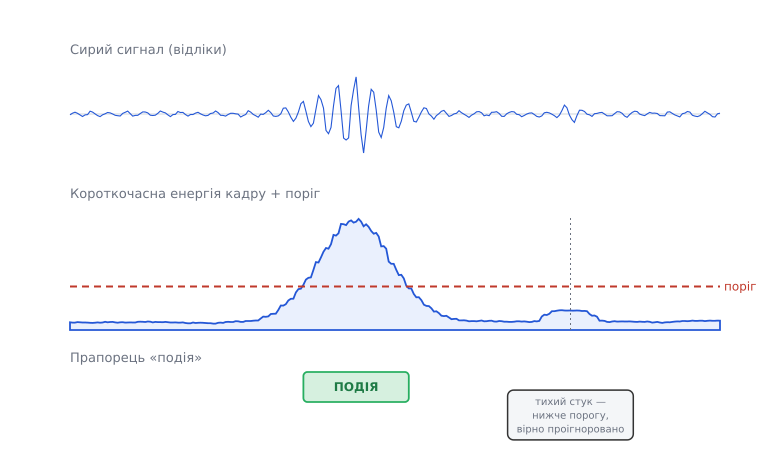
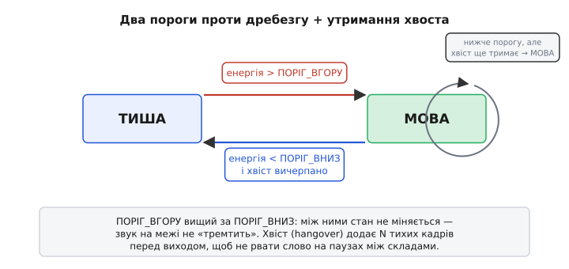
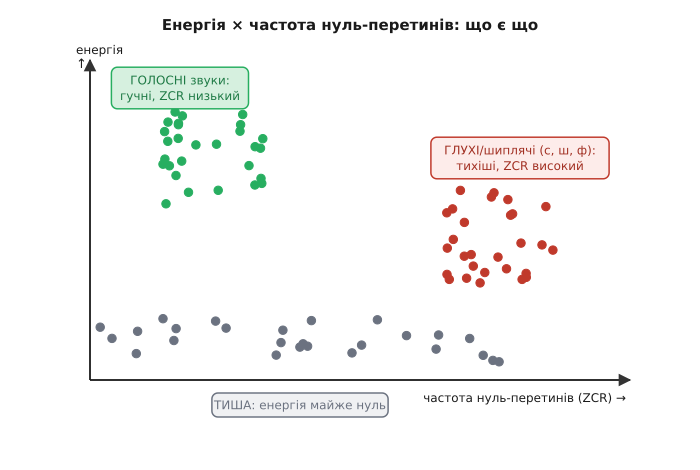

# Детекція подій у звуці: коли починати слухати

Досі ми вміли [донести звук із мікрофона до буфера](root:embedded/audio-capture-pipeline) й трохи [причесати його на самому МК — рівень, фільтр, автопідсилення](root:embedded/audio-processing-basics). Але постає питання, яке передує будь-якій розумній роботі зі звуком: **а коли взагалі щось відбувається?** Мікрофон гуде цілодобово. У буфер безперервно тече потік відліків — і 99% часу це просто тиша з дрібним шумом. Ганяти важку обробку (розпізнавання слова, запис на карту, передачу по радіо) на кожному кадрі — марнувати такт процесора й заряд батареї на порожнечу.

Тож перший, найдешевший і найважливіший шар — **детектор подій**: дешевий сторож, що весь час дивиться на потік і піднімає прапорець «зараз щось є» лише тоді, коли звук вартий уваги. На цьому прапорці прокидається все інше. Класична його форма для мовлення зветься **VAD** (*Voice Activity Detection* — виявлення голосової активності), але та сама механіка ловить будь-яку подію: постріл, удар, гавкіт, дзенькіт скла. Розберімо, з чого його зробити на мікроконтролері так, щоб він був легкий, надійний і не «тремтів».

> 🔧 **Навіщо це.** Без сторожа пристрій або постійно молотить наповну (гріється, з'їдає батарею за годину замість тижня), або ти вручну натискаєш кнопку «слухай». VAD знімає цю дилему: мікроватний детектор дрімає на потоці, а важкий модуль спить, поки сторож його не збудить. Це основа кожного розумного колонки, диктофона з голосовим стартом, датчика розбитого скла — усього, що має «прокидатися на звук».

## Найпростіший вимір: скільки в кадрі енергії

Що взагалі відрізняє звук від тиші? Найгрубіше — **сила коливань**. Тиша — це відліки, що ледь тремтять коло нуля; звук — це відліки, що широко розгойдуються. Отже, треба число, яке міряє «наскільки широко зараз розгойдується сигнал». Це число — **енергія кадру**.

Але спершу — чому *кадр*, а не окремий відлік? Один відлік нічого не каже: навіть у гучному звуці сигнал двічі за період проходить через нуль, і в ту мить відлік малий. Судити по одному відліку — усе одно що судити про вітер по одній секунді затишшя між поривами. Тому дивляться не на точку, а на **коротке вікно** — пачку з кількох сотень відліків (зазвичай 10–30 мілісекунд звуку), і питають: скільки в цьому вікні сумарної «потужності»? Такий підхід — дивитися на сигнал короткими вікнами — наскрізний для всієї обробки звуку; тут він з'являється вперше й найпростіше.

Найчесніша міра енергії — **середній квадрат** відліків у вікні. Квадрат прибирає знак (нам байдуже, вгору чи вниз хитнувся сигнал — важлива амплітуда) і підкреслює великі викиди. Корінь із нього повертає нас до шкали самого сигналу й зветься **RMS** (*Root Mean Square* — корінь із середнього квадрата), тобто «ефективна амплітуда»:

```
        ┌  1   N-1        ┐
RMS  =  │ ─── · Σ  x[i]²  │ ^½
        └  N   i=0        ┘
```

Порахуймо це чесним C — так, як воно й крутиться в прошивці. Відліки з АЦП зазвичай 16-бітні зі знаком; сума квадратів росте швидко, тож накопичувати треба у ширшому типі, щоб не переповнити:

**Умова:** кадр `frame` з `N` 16-бітних відліків (int16). Порахувати RMS-енергію кадру.

```c
#include <stdint.h>
#include <math.h>

// Середньоквадратична амплітуда кадру.
// N ≈ 256 (при 16 кГц це 16 мс звуку).
float frame_rms(const int16_t *frame, int N) {
    uint64_t acc = 0;              // 16-бітний квадрат ≤ 2^30; сотні їх — треба 64 біти
    for (int i = 0; i < N; i++) {
        int32_t s = frame[i];      // розширюємо перед множенням, інакше переповнення
        acc += (uint64_t)(s * s);
    }
    return sqrtf((float)acc / (float)N);
}
```

Дві пастки тут — не косметика, а те, на чому реально горять. По-перше, `frame[i] * frame[i]` в `int16` **переповнюється** (32767² не влазить у 16 біт) — треба розширити до `int32_t` *до* множення, як у рядку з `int32_t s`. По-друге, сума сотень таких квадратів не влазить навіть у 32 біти, тому накопичувач — `uint64_t`. Пропустиш це — детектор «зійде з розуму» на гучних звуках, бо число, замість рости, загорнеться через край.

Тепер маємо на кожен кадр одне число — рівень. Тиша дає маленький RMS, звук — великий. Лишилося вирішити, де межа.

## Поріг: провести межу між тишею і подією

Найпряміше рішення: обрати **поріг** (*threshold* — межа спрацювання) і оголосити подією все, що вище. Кадр гучніший за поріг — прапорець угору; тихіший — прапорець униз. На перший погляд, справу зроблено:

```c
bool is_event = (frame_rms(frame, N) > THRESHOLD);
```


*Від сигналу до рішення. Угорі — сирий потік відліків: тиша, гучне слово, знову тиша, наприкінці тихий стук. Посередині — короткочасна енергія кадру (обвідна сигналу) і горизонтальний **поріг**. Унизу — прапорець «подія»: він піднятий рівно там, де енергія перевищила поріг. Гучне слово впевнено пробиває поріг; тихий стук лишається під ним — і його вірно проігноровано.*

Уся хитрість — у виборі висоти цієї лінії, і саме тут наївний поріг ламається. Постав його **надто низько** — і сторож здригатиметься від кожного шурхоту, вентилятора, власного шуму мікрофона; толку від такого «завжди-прокинутого» нуль. Постав **надто високо** — і пропустиш тиху мову, далекий звук, початок слова. А головне: **правильна висота не стала**. У тихій кімнаті вночі фон — це майже нуль; у цеху вдень фон реве так, що вчорашній «гучний» поріг тепер завжди перевищено. Зашитий у код `THRESHOLD` приречений: він або надто чутливий, або надто глухий — залежно від того, куди ти приніс пристрій.

## Слухати фон: поріг над рівнем шуму

Вихід — не міряти звук в абсолютних числах, а міряти його **відносно поточного фону**. Ключова думка: подія — це не «гучно взагалі», а «помітно гучніше, ніж було щойно». Тож детектор має весь час тримати оцінку **рівня шуму** (*noise floor* — підлога шуму, фоновий рівень) і ставити поріг **над нею** із запасом.

А як оцінити фон, не знаючи наперед, коли тиша? Хитрість проста й стара: **більшість часу — тиша**, тож якщо повільно усереднювати рівень, середнє саме сповзе до фону. Коли налетить короткий звук, повільне середнє майже не смикнеться — воно надто інертне, щоб за ним угнатися. Це і є [ковзне середнє](topic:com-signal/moving-average) — просте усереднення останніх значень, що згладжує швидкі коливання й лишає повільний тренд; тут ми ведемо ним саме **повільний** слід рівня, який і є фоном.

> 📎 **[Ковзне середнє](topic:com-signal/moving-average).** Замість зберігати всю історію, тримаємо одне число й на кожному кроці підмішуємо до нього дрібку нового: `avg += α·(x − avg)`. Коефіцієнт `α` (0…1) задає інертність: маленький `α` — дуже повільне, «важке» середнє, що йде лише за загальним трендом і не реагує на поодинокі сплески. Саме таким ми стежимо за фоном.

Оцінку фону оновлюємо **лише в тиші** — коли прапорець події опущено. Інакше гучна мова затягнула б «фон» угору, поріг поповз би за нею, і детектор оглух би посеред власного спрацювання. А поріг ставимо як фон, помножений на запас (margin) — скажімо, утричі:

**Умова:** вести рівень шуму `noise` і питати, чи кадр `rms` — подія.

```c
static float noise = 50.0f;        // початкова груба оцінка фону
const float ALPHA  = 0.02f;        // повільне середнє: важке, інертне
const float MARGIN = 3.0f;         // поріг = фон × запас

bool detect(float rms) {
    float threshold = noise * MARGIN;
    bool  event = (rms > threshold);

    if (!event) {                  // оновлюємо фон ТІЛЬКИ в тиші
        noise += ALPHA * (rms - noise);
    }
    return event;
}
```

Тепер поріг сам «дихає» разом із кімнатою: занесли пристрій у гучний цех — за секунду-дві `noise` підповзе вгору, поріг підніметься, і сторож перестане сходити з розуму від гулу. Винесли в тишу — фон сповзе донизу, поріг опуститься, і детектор знову почує тихий звук. Одне й те саме число `MARGIN` працює скрізь, бо порівняння тепер **відносне**.

## Дребезг межі: гістерезис

Лишилася підступна біда, яку видно на будь-якому реальному сигналі. Коли рівень **гуляє коло самого порогу** — а на межі слова чи на згасанні звуку так буває завжди, — прапорець починає **дрижати**: кадр трохи вище — «подія», наступний трохи нижче — «тиша», знову вище — знову «подія». За частку секунди детектор клацає десятки разів. Кожне таке хибне спрацювання будить важкий модуль даремно; для запису це — рвана доріжка з дір.

Це та сама болячка, що й **дребезг** механічної кнопки, і ліки ті самі — **гістерезис** (гр. *hystéresis* — відставання): замість однієї межі беремо **дві**. Високий поріг `THR_UP`, щоб *увійти* в стан «подія», і нижчий `THR_DOWN`, щоб із нього *вийти*. Поки рівень блукає між ними — стан **не міняється**: вже почали слухати — тримаємося, доки не впаде добряче нижче; ще мовчимо — не зриваємося, доки не підскочить упевнено вище. Проміжок між порогами — «мертва зона», у якій дрібне тремтіння нікого не турбує.


*Детектор як маленький автомат. З **ТИШІ** в **МОВУ** переходимо, коли енергія пробила вищий поріг `ПОРІГ_ВГОРУ`. Назад — лише коли енергія впала нижче `ПОРІГ_ВНИЗ` і вичерпався хвіст утримання. Петля на «МОВІ»: рівень уже просів нижче порогу, але хвіст ще тримає нас у стані — це рятує слово від розриву на короткій паузі.*

## Не рвати слово: утримання хвоста

Гістерезис прибрав тремтіння, але мова підкидає ще одну підступність: **вона й сама переривчаста**. Між складами, після проривних приголосних (як «п», «т», «к»), у паузі на подих енергія на кілька кадрів провалюється майже в тишу — хоча людина ще говорить. Голий детектор чесно опустить прапорець на кожній такій мікропаузі й порубає одне слово на шматки.

Ліки — **утримання**, або **хвіст** (*hangover* — затримка виходу): опустивши прапорець за порогом, не виходимо зі стану «подія» одразу, а тримаємося ще `HANG` кадрів. Прийшов новий гучний кадр за цей час — лічильник хвоста скидається, слухаємо далі, наче й не провалювалось. Тиша протрималася довше за хвіст — тільки тоді визнаємо, що подія скінчилась. За `HANG` беруть трохи більше за найдовшу внутрішньослівну паузу — типово 100–300 мс (при кадрі 16 мс це десь 6–20 кадрів).

Зберемо гістерезис і хвіст в один компактний детектор — це вже цілком робочий сторож:

**Умова:** повний детектор з двома порогами й утриманням; повертає `true`, поки триває подія.

```c
#include <stdbool.h>

static bool  active   = false;    // стан: чи триває подія
static int   hang     = 0;        // лічильник хвоста, кадрів
static float noise    = 50.0f;    // оцінка фону

const float ALPHA    = 0.02f;
const float K_UP     = 4.0f;      // запас на ВХІД (вищий поріг)
const float K_DOWN   = 2.0f;      // запас на ВИХІД (нижчий поріг)
const int   HANG     = 12;        // хвіст ≈ 12 кадрів утримання

bool vad_step(float rms) {
    float thr_up   = noise * K_UP;
    float thr_down = noise * K_DOWN;

    if (!active) {                         // зараз тиша
        if (rms > thr_up) {                // впевнено пробили верхній поріг
            active = true;
            hang   = HANG;                 // зарядили хвіст
        } else {
            noise += ALPHA * (rms - noise); // фон оновлюємо лише в тиші
        }
    } else {                               // зараз подія
        if (rms > thr_down) {              // ще досить гучно — продовжуємо
            hang = HANG;                   // перезарядили хвіст
        } else if (--hang <= 0) {          // тихо й хвіст вичерпано
            active = false;                // подія скінчилась
        }
    }
    return active;
}
```

Зверни увагу на два різні коефіцієнти — `K_UP = 4` і `K_DOWN = 2`: увійти важче, ніж вийти, і саме це дає мертву зону гістерезису. Фон оновлюємо строго в гілці тиші (`!active`), тож голосна мова ніколи не «отруїть» оцінку шуму. А хвіст `HANG` перезаряджається щоразу, коли рівень знову підскочив, — тому слово з паузами між складами лишається **одним** цілим спрацюванням, а не десятком уламків.

## Коли енергії замало: частота нуль-перетинів

Енергія — прекрасний, майже безкоштовний детектор, але в неї є сліпа пляма. **Не всі звуки гучні.** Шиплячі й свистячі приголосні — «с», «ш», «ф», «х» — це, по суті, **шум повітря** крізь вузьку щілину: енергії в них мало (часом не більше, ніж у гучнуватому фоні), тож чистий енергетичний VAD їх легко проковтне й обріже початок слова на глухому звуці. Потрібна ще одна, ортогональна прикмета — така, що дивиться не на **силу**, а на **характер** сигналу.

Така прикмета майже безкоштовна: **частота нуль-перетинів** (*Zero-Crossing Rate*, ZCR) — скільки разів за кадр сигнал міняє знак, тобто перетинає нульову лінію. Чому це розрізняє звуки? Бо частота перетинів прямо пов'язана з тим, **високі чи низькі частоти** переважають у сигналі. Голосні звуки («а», «о», «и») породжені коливанням голосових зв'язок — це низька основна частота з потужними низькими гармоніками: хвиля розгойдується широко й **повільно**, нуль перетинає рідко. Шиплячі ж — це високочастотний шум: сигнал дрібно **тремтить** туди-сюди, перетинаючи нуль часто-густо. Отже: **низька ZCR — дзвінкий, гучний звук; висока ZCR — глухий, шумний**. Історично цю пару прикмет — коротка енергія плюс ZCR — використовують у мовних кодеках з 1970-х як найдешевший спосіб відрізнити не лише звук від тиші, а ще й дзвінке від глухого. *(Розрізнення дзвінких і глухих звуків за енергією та ZCR — усталений факт класичної обробки мовлення; докладніше про звукові кодеки — [далі в курсі](root:embedded/audio-compression-mcu).)*

Рахувати ZCR ще дешевше, ніж енергію, — самі порівняння знаків, жодного множення:

**Умова:** порахувати кількість нуль-перетинів у кадрі `int16`.

```c
int zero_crossings(const int16_t *frame, int N) {
    int count = 0;
    for (int i = 1; i < N; i++) {
        // знак змінився ⟺ добуток сусідів від'ємний;
        // порівнюємо через >=0, щоб не множити (та й не переповнити)
        if ((frame[i - 1] >= 0) != (frame[i] >= 0))
            count++;
    }
    return count;                  // 0 … N-1
}
```


*Дві прикмети розводять три випадки. По вертикалі — енергія, по горизонталі — частота нуль-перетинів. **Тиша** тулиться внизу — енергії майже нема. **Голосні** звуки летять угору-ліворуч: гучні, ZCR низька. **Глухі шиплячі** («с», «ш», «ф») сідають праворуч: енергії мало (по ній їх сплутати з фоном), зате ZCR висока — і саме це їх видає. Жодна прикмета сама не розділяє все; разом — розділяють.*

На практиці друга прикмета вмикається як **страхувальник**: якщо енергія трохи не дотягла до порогу, але ZCR підозріло висока — можливо, це початок глухого звуку, і кадр варто зарахувати як подію. Так детектор перестає різати слова на «ссс…» і «шшш…». Глибший, ML-варіант цієї ж ідеї — коли прикмет уже не дві, а десятки, і рішення ухвалює навчена модель — ми розберемо, [коли дійдемо до розпізнавання ключових слів](root:embedded/audio-kws); тут же нам вистачає двох чесних чисел і кількох порівнянь.

## Як усе стуляється докупи

Складімо ланцюжок причин, щоб він відклався цілим. Мікрофон безперервно сипле відліки — сам по собі потік нічого не «означає». Ми ріжемо його на **короткі кадри** й на кожному міряємо два дешеві числа: **енергію** (сила коливань) і, за потреби, **частоту нуль-перетинів** (характер звуку). Абсолютний поріг ненадійний, бо фон різний скрізь, — тому ми **весь час стежимо за рівнем шуму** ковзним середнім і ставимо поріг **над фоном**, а не над нулем. Щоб рішення не тремтіло на межі, беремо **два пороги** (гістерезис), а щоб не рвати слово на паузах — тримаємо **хвіст**. На виході — чистий прапорець «зараз подія», на якому й прокидається вся важка робота: запис, стиснення, розпізнавання.

Уся ця машинерія коштує кілька множень і порівнянь на кадр — вона легко крутиться на найдрібнішому МК, не займаючи його всерйоз. У цьому й суть детектора подій: **найдешевший сторож попереду найдорожчої роботи**. Готовий модуль такого сторожа — з кільцевим підживленням кадрами, адаптивним фоном і акуратним автоматом станів — [зібраний окремим кодовим блоком](root:embedded/audio-events-detection/proj-vad-module.md), щоб його можна було вставити у власну прошивку майже без змін.
