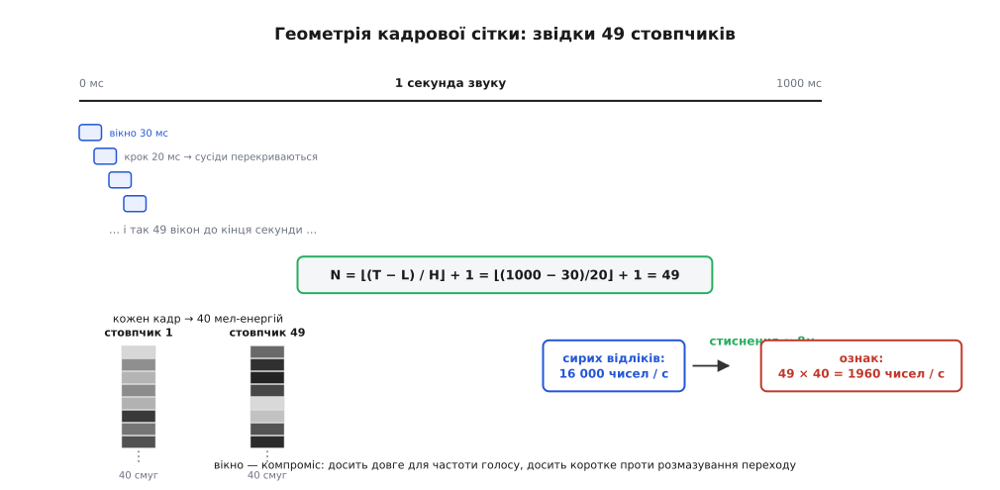

# Ключові слова й події у звуці (KWS): глибше — від кадру до рішення

<preknowlist>
- [Спектрограма](root:com-signal/spectrogram) — карта «час × частота», де яскравість клітинки = енергія тону в цю мить; портрет звуку, на якому слово лишає впізнаваний візерунок.
- [ШПФ](root:com-signal/fft) — швидке перетворення Фур'є: за O(N·log N) дає спектр кадру, з якого будують кожен стовпчик спектрограми.
- [Згорткова мережа](root:sf-ml/cnn) — CNN ловить локальні візерунки на двовимірній сітці спільними ядрами; саме її ми наводимо на спектрограму замість зображення.
- [Softmax](root:sf-ml/activation-functions) — перетворює вектор чисел-логітів на розподіл ймовірностей класів, що додаються до одиниці; це форма виходу розпізнавача.
- [Навчання з учителем](root:sf-ml/supervised-learning) — модель настроює себе на парах «вхід → правильна відповідь», щоб відтворювати відповідь на небачених прикладах.
- [Перенесення навчання](root:sf-ml/transfer-learning) — узяти мережу, навчену на великому наборі, і дотренувати лише верхні шари на своїй жменьці класів.
- [Квантування нейромереж](root:sf-ml/model-quantization) — заміна float-ваг і активацій на int8 у сталому масштабі, щоб модель влізла в пам'ять і рахувалася цілими.
</preknowlist>

Базова стаття провела нас від «звук є» до «це слово X» одним широким жестом: ріжемо звук на кадри, робимо з нього лог-мел-картинку, годуємо крихітну CNN, ставимо її другим ярусом каскаду, згладжуємо стрибучий вихід. Кожен із цих кроків правдивий — і кожен приховує другий шар, у якому й живе половина інженерних рішень. Чому кадр саме 25–30 мс, а не 5 і не 100? Звідки береться число 49 стовпчиків? Чому проста CNN на цій задачі програє «глибинно-роздільній», хоч робить те саме? Що насправді означає «згладити ймовірність» — і чому в «Hey Siri» замість ковзного середнього стоїть цілий декодер зі схованими станами? Як число порогу перекладається в «одне хибне спрацювання на десять годин»? І де саме розпізнавач тихо ламається на межах слова?

Ця стаття — про другий шар. Ми не переказуємо базову, а **розгортаємо** її: виводимо геометрію кадрової сітки з перших принципів, рахуємо, скільки множень коштує один прохід і скільки — секунда слухання, розбираємо, чому глибинно-роздільна згортка дає ту саму точність у рази дешевше, виводимо згладжування як цифровий фільтр і показуємо його межу проти повного декодера, перекладаємо поріг у робочу точку на кривій похибок і, нарешті, проходимо граничні випадки, на яких перша самостійна спроба спотикається. Місцями доведеться порахувати — але кожне число тут щось вирішує в реальному бюджеті чипа.

> 🔧 **Навіщо це.** Базового розуміння досить, щоб зібрати KWS, який працює на столі. Цього шару — щоб він працював **у полі, на батарейці, роками**, і щоб ти знав наперед, скільки він з'їсть пам'яті й струму, ще до першої прошивки. Різниця між «запустив приклад» і «спроєктував вузол» — саме тут: у числах кадрової сітки, у бюджеті множень, у виборі робочої точки. Інженер, який їх тримає в голові, не гадає, чому «на демо чуло, а на виробі ні».

## Чому послідовність убиває будь-яке поодиноке число: точний приклад

Базова стаття сказала: слово — це візерунок, що змінюється в часі, тож жодне поодиноке число його не схопить. Погляньмо на це не як на гасло, а як на арифметику — бо саме числа показують, **чому** стіна непробивна.

Візьмімо два українські слова, «вперед» і «перед». Різниця між ними — один приголосний на початку, коротке [в]. Порахуймо ті дві величини, якими живе детектор подій, — сумарну енергію й [частоту нуль-перетинів](root:embedded/audio-events-detection) — для секундного кліпу кожного слова. Енергія — це сума квадратів відліків; коротке [в] додає до неї частку відсотка, бо триває якісь 40 мс із цілої секунди й саме по собі тихе. Нуль-перетини — скільки разів хвиля перетнула нуль; [в] дзвінке, його ZCR близький до сусіднього голосного, тож і тут внесок губиться у власному розкиді голосу. Ось груба, але чесна прикидка:

```
                    сумарна енергія    середній ZCR
«перед»             1.00 (умовно)      118 перетинів/кадр
«вперед»            1.03               121 перетинів/кадр
той самий «перед»,
інший мовець        0.71               134 перетинів/кадр
```

Придивися до останнього рядка. Різниця **між двома словами** (1.00 проти 1.03 за енергією, 118 проти 121 за ZCR) **менша**, ніж різниця **того самого слова в двох мовців** (1.00 проти 0.71; 118 проти 134). Це не випадковість поганого прикладу — це фундаментальна властивість: **міжкласовий розкид тоне у внутрішньокласовому**. Поодинокі числа міряють не те, що розрізняє слова, а те, що в них спільного плюс шум мовця. Скільки порогів на них не став, ти проводиш межу в хмарі, де класи повністю переплуталися.

А тепер поглянь на ті самі два слова **на спектрограмі**. Там [в] — це не «трохи енергії», а конкретна подія в конкретному місці карти: короткий низькочастотний гул перед вибухом [п], зсунутий у часі відносно решти. Мережа бачить **де саме** і **в якій частотній смузі** з'явився цей візерунок, і саме за його наявністю чи відсутністю на початку відрізняє «вперед» від «перед» — незалежно від того, гучніше чи тихіше говорив мовець, бо зсув однієї події відносно інших від гучності не залежить. Оце й є причина «перевести звук на картинку»: не тому, що картинку зручно малювати, а тому, що **тільки на двовимірній сітці «час × частота» стає видно взаємне розташування подій**, а зміст слова сидить саме в ньому, а не в жодній інтегральній величині.

> 🔧 **Навіщо це.** Коли твій саморобний детектор на порогах «майже працює, але плутає схожі команди», марно докручувати пороги — ти впираєшся в цю стіну. Схожі за звучанням команди («вгору»/«вниз», «стоп»/«стій») різняться саме тонкою часовою структурою, яку інтегральні числа стирають. Єдиний вихід — дати моделі бачити структуру, тобто спектрограму; це не забаганка, а необхідність, яку видно вже з арифметики розкиду.

## Геометрія кадрової сітки: звідки беруться 25 мс, 20 мс і 49

Базова стаття взяла «кадр 20–30 мс, N_FRAMES = 49, N_MEL = 40» як дане. Ці числа не з повітря — кожне випливає з фізики мови й обмежень перетворення. Виведімо їх.

**Довжина кадру** впирається в конфлікт двох вимог, і між ними немає безкоштовного виграшу. З одного боку, щоб узагалі побачити частоту, кадр має вмістити хоч кілька її періодів. Основний тон чоловічого голосу — близько 100–150 Гц, тобто період 7–10 мс; щоб надійно розкласти такий тон, кадру треба хоча б 2–3 періоди, тобто **не менш як ~20 мс**. Це нижня межа: коротший кадр просто не «бачить» низьких частот голосу, роздільність спектра стає надто грубою. Роздільність за частотою прямо задається довжиною:

```
Δf = f_s / N               # крок спектра за частотою
Δf = 16000 / 400 ≈ 40 Гц   # для 25-мс кадру при 16 кГц (400 відліків)
```

40 Гц роздільності досить, щоб розділити перші форманти голосу. Візьми кадр удвічі коротший — роздільність упаде до 80 Гц, і сусідні форманти зіллються.

З іншого боку, кадр має бути **достатньо коротким, щоб звук усередині нього не встиг змінитися**. Уся ідея спектрограми тримається на припущенні, що в межах одного кадру сигнал майже стаціонарний — тоді його спектр має сенс. Але мова змінюється швидко: перехід від приголосного до голосного триває якісь 20–40 мс. Зроби кадр 100 мс — і в нього потрапить і приголосний, і голосний, їхні спектри змішаються в кашу, а саме межа між ними несе зміст. Це верхня межа: **не більш як ~30–40 мс**.

Перетин цих двох вимог — вікно порядку **25 мс** (400 відліків при 16 кГц; часто округлюють до 512 заради зручності ШПФ, доповнюючи нулями). Це не магічне число, а вузьке вікно компромісу: досить довге, щоб бачити частоту голосу, досить коротке, щоб не розмазати перехід. Класична обробка мови зупинилася на 20–30 мс саме тому, і KWS успадкував це без змін.

**Крок між кадрами** (hop, або зсув) вирішує окреме питання: як часто брати ці вікна. Якщо ставити кадри впритул, без перекриття, губиться те, що трапилося на стику двох вікон. Тому кадри роблять **із перекриттям** — типово зсув удвічі-втричі менший за довжину: вікно 25–30 мс, крок 10–20 мс. Перекриття гарантує, що жодна коротка подія не провалиться між кадрами. Ось звідки береться число стовпчиків:

```
N_frames = ⌊(T − L) / H⌋ + 1        # кадрів у сигналі
N_frames = ⌊(1000 − 30) / 20⌋ + 1
         = ⌊970 / 20⌋ + 1 = 48 + 1 = 49
```

Ось воно, «49» з базової статті: секунда звуку, вікно 30 мс, крок 20 мс. Хочеш реагувати швидше й ловити коротші події — зменшуй крок; картинка стане ширшою (при кроці 10 мс вийде 98 стовпчиків), мережа — удвічі дорожчою. Хочеш дешевше — збільшуй крок, платячи роздільністю в часі. Це прямий важіль, і його крутять свідомо: **ширина вхідної картинки = ⌊(вікно слухання − довжина кадру) / крок⌋ + 1**, а від неї лінійно залежить і пам'ять під вхідний тензор, і такти першого шару.

**Число мел-смуг** (40) — третій вимір тієї самої економії. Скільки рядків матиме картинка, задає фільтрбанк: [повний апарат мел-згортки, логарифма й кепстра розібрано окремою вставкою про математику ознак](root:embedded/audio-kws/math-mfcc.md), а тут важливий сам наслідок для розміру. 40 смуг — усталений компроміс: менше (скажімо, 20) починає зливати близькі форманти й точність падає; більше (64, 80) майже не додає точності для короткого словника, зате роздуває вхід. Тож типова вхідна картинка KWS — **49 × 40**, тобто 1960 чисел на секунду звуку. Порівняй: сирих відліків за ту саму секунду — 16000. Ознаки стиснули вхід у вісім разів, викинувши все, чого вухо однаково не розрізняє, — і саме тому мережа над ними може бути крихітною.


*Геометрія кадрової сітки. Вікно 30 мс мусить бути досить довгим, щоб побачити частоту голосу (роздільність Δf = 16000/512 ≈ 31 Гц), і досить коротким, щоб звук усередині не змінився. Крок 20 мс задає перекриття — жодна подія не провалюється між кадрами. Формула ⌊(T−L)/H⌋+1 дає рівно 49 стовпчиків на секунду; кожен несе 40 мел-енергій. Разом — вхід 49×40 замість 16000 сирих відліків.*

## Всередині крихітної CNN: рецептивне поле, глибинно-роздільна згортка й бюджет множень

Базова стаття сказала «крихітна CNN уже вміє класифікувати картинку». Розберімо, **що саме** вона робить зі спектрограмою й **чому** для KWS вибирають не будь-яку CNN, а особливий її різновид.

Спершу — що бачить згортка на спектрограмі. Ядро CNN — це маленьке вікно (скажімо, 3 × 3), що ковзає по картинці й на кожному місці рахує зважену суму. На зображенні таке ядро ловить край чи пляму; на спектрограмі — **локальний частотно-часовий візерунок**: скіс форманти, що повзе, різкий вертикальний край проривного приголосного, горизонтальну смугу тону. Ключова властивість, успадкована від зору, — **спільні ваги**: те саме ядро прикладають до всіх місць картинки. Тому мережа, навчившись упізнавати скіс форманти в одному кутку, упізнає його всюди — і байдуже, коли саме слово прозвучало у вікні й на якій висоті його вимовили. Ця інваріантність до зсуву — рівно те, що потрібно для потокового звуку, де слово лягає будь-де.

Складаючи згорткові шари один на одного, мережа нарощує **рецептивне поле** (receptive field — ділянка входу, що впливає на один вихідний нейрон). Перший шар із ядром 3 × 3 бачить 3 кадри × 3 смуги. Другий такий самий шар над ним бачить уже 5 × 5 входу, третій — 7 × 7, і так далі: кожен шар додає до поля (розмір ядра − 1). Щоб один вихідний нейрон «бачив» ціле слово завширшки, скажімо, 30 кадрів, потрібне поле хоча б у 30 кадрів — а це десяток згорткових шарів або кілька шарів із проріджуванням (pooling), що стискає час удвічі за раз. Ось чому глибина мережі не забаганка: **рецептивне поле має дорости до довжини слова**, інакше мережа судитиме про слово по клаптику й плутатиме довгі слова зі схожим початком.

Тепер головне питання економії: чому саме **глибинно-роздільна згортка** (depthwise separable convolution)? Порахуймо вартість звичайної згортки й побачимо, де витікає ресурс. Нехай вхід має `C_in` каналів, вихід `C_out` каналів, ядро `k × k`, а карта ознак — `H × W` позицій. Звичайна згортка на кожній позиції й кожному вихідному каналі перемножує ціле ядро по всіх вхідних каналах:

```
MAC_звич = H · W · C_in · C_out · k · k       # множень-додавань
```

Кожен вихідний канал «дивиться» одразу на всі вхідні через простір ядра — і саме добуток `C_in · C_out · k · k` роздуває вартість. Глибинно-роздільна згортка розбиває цю одну важку операцію на дві легкі. Спершу **глибинна** (depthwise) частина: кожен вхідний канал згортають своїм окремим ядром `k × k`, **не змішуючи каналів** — просторовий візерунок ловиться в межах каналу. Потім **точкова** (pointwise, ядро 1 × 1) частина: змішує канали на кожній позиції, але вже без просторового вікна. Разом:

```
MAC_розд = H · W · C_in · k · k    (глибинна)
         + H · W · C_in · C_out    (точкова, 1×1)
       = H · W · C_in · (k·k + C_out)
```

Відношення вартостей — це і є виграш:

```
MAC_звич / MAC_розд = (C_out · k · k) / (k · k + C_out)
```

Підставмо реальні числа: ядро 3 × 3 (`k·k = 9`), `C_out = 64` каналів.

```
виграш = (64 · 9) / (9 + 64) = 576 / 73 ≈ 7.9 разів
```

Майже увосьмеро менше множень **за ту саму форму шару**. Ось чому [канонічна для мікроконтролерного KWS робота «Hello Edge»](root:embedded/audio-kws/hist-kws.md) виміряла: глибинно-роздільна CNN (DS-CNN) дає **найкращу точність у кожному з трьох бюджетів пам'яті/такту** серед усіх архітектур — і випереджає звичайну повнозв'язну мережу з тим самим числом параметрів приблизно на 10% абсолютної точності, сягаючи 95.4% на Speech Commands. *(Zhang, Suda, Lai, Chandra, «Hello Edge: Keyword Spotting on Microcontrollers», ARM, arXiv 1711.07128, 2017 — усталений результат.)* Виграш не в хитрішій ідеї, а в тому, що та сама згортка розкладена на дешевші множники — рівно так, як ми щойно порахували.


*Чому глибинно-роздільна згортка дешевша при тій самій формі шару. Звичайна згортка на кожній позиції змішує весь простір ядра з усіма каналами одразу — добуток C_in·C_out·k·k і роздуває вартість. Розділена робить те саме двома легкими кроками: глибинна ловить просторовий візерунок у межах кожного каналу, точкова 1×1 змішує канали без простору. Відношення (C_out·k·k)/(k·k+C_out) для типових k=3, C_out=64 дає ≈ 7.9× — саме цей розклад і виводить DS-CNN у лідери «Hello Edge».*

Тепер зведімо бюджет цілого прогону, бо саме він визначає, чи влізе розпізнавач у чип. Скажімо, мережа має сумарно `M` множень на один прохід по картинці 49 × 40. Для скромної DS-CNN це порядку кількох мільйонів MAC — покладімо 3·10⁶. Один прохід на ядрі, що робить ~10⁷ MAC/с (типово для дрібного Cortex-M без прискорювача на десятках МГц), займе:

```
t_прохід ≈ 3·10⁶ MAC / 10⁷ MAC/с ≈ 0.3 с
```

Триста мілісекунд на прохід! Якби ми ганяли мережу **щокадру** (раз на 20 мс), вона б не встигала — прохід довший за період кадру, черга б росла безкінечно. Ось чому базова стаття ганяє мережу **що HOP кадрів**, а не щокадру: це не оптимізація «про запас», а умова, без якої система фізично не працює в реальному часі. І ось чому середній ярус каскаду мусить спати, поки [сторож-VAD](root:embedded/audio-events-detection) не збудить його: 0.3 с обчислень щоразу — це десятки мілі-джоулів, помножити на цілодобову роботу дасть розряджену за години батарею. Числа самі диктують і рідкість прогону, і потребу в каскаді.

> 🔧 **Навіщо це.** Перш ніж вибирати архітектуру, порахуй два числа: скільки MAC робить один прохід і скільки проходів за секунду ти можеш собі дозволити. Їх добуток — твоє середнє обчислювальне навантаження, а з нього прямо випливає струм. Глибинно-роздільна згортка — головний важіль першого числа (майже увосьмеро), крок HOP — другого. Помилка новачка — узяти «точнішу» важку мережу, не порахувавши, що вона не встигне за потоком; правильний шлях — знайти найдешевшу, що ще влучає, рівно як у [зоопарку моделей](root:embedded/model-zoo).

## Потоковий інференс: не перераховувати те, що не змінилося

Базова стаття ганяє мережу ковзним вікном, щоразу по цілій секунді спектрограми з кільцевого буфера. Це працює, але приховує марнотратство, яке на дрібному чипі болить: **сусідні вікна перекриваються на 95%**. Зсунули вікно на один кадр — 48 із 49 стовпчиків ті самі, а ми проганяємо всю мережу з нуля, ніби картинка нова. Більшість множень першого шару повторюють обчислення, зроблені мілісекунду тому.

Тут напрошується та сама ідея, що вже рятувала нас у кільцевому буфері спектрограми: **рахувати лише приріст**. Оскільки згортка локальна, вихід згорткового шару в даній точці залежить лише від маленького вікна входу навколо неї. Коли входить один новий стовпчик, змінюються лише ті вихідні позиції, чиє рецептивне поле його зачепило, — тонка смужка з правого краю карти ознак. Решту можна не рахувати, а взяти з попереднього прогону. Так згорткова мережа перетворюється на **потокову** (streaming): на кожен новий кадр вона доробляє лише крайовий стовпчик активацій кожного шару, а не всю карту. Виграш — приблизно в стільки разів, у скільки вікно ширше за крок: для 49 кадрів і кроку 1 — під п'ятдесят разів менше роботи на кадр.

Ця перебудова не безкоштовна: вона вимагає тримати **проміжні активації кожного шару** в кільцях (по кільцю на шар) і акуратно зсувати їх, точно як спектрограму, — і саме тут ховається новий клас помилок вирівнювання, які тихо псують вихід. [Повний потоковий модуль зі згортками-кільцями й перевіркою еквівалентності проти разового прогону зібрано окремою кодовою вставкою](root:embedded/audio-kws/proj-streaming-cnn.md), бо це вже інженерія самої мережі, а не циклу навколо неї, і заслуговує на власний розбір. Базова streaming-обвʼязка — кільце спектрограми, розгортання й [автомат рішення — лишається тою самою](root:embedded/audio-kws/proj-kws-loop.md); потокова згортка вставляється всередину, замінюючи разовий `kws_invoke` на інкрементний.

Варто чесно окреслити межу. Потокова згортка виграє тим більше, чим ширше вікно й дрібніший крок; при кроці HOP = 20 кадрів виграш падає, бо між прогонами й так змінюється майже все. Тому на найдрібніших чипах часто лишають простий разовий прогон із великим HOP — він програє в тактах, зате не потребує зайвої пам'яті під кільця активацій, а пам'ять там дефіцитніша за такти. Вибір між «разовий рідко» і «потоковий часто» — ще один свідомий компроміс під конкретне залізо, а не догма.

## Згладжування як фільтр: чому саме експоненційне середнє і де його межа

Базова стаття згладжує вихідну ймовірність рядком `smooth += A * (probs[KW] - smooth)`, назвавши це ковзним середнім. Розберімо, що це насправді за фільтр, виведімо його поведінку й побачимо, де він поступається серйознішому апарату «Hey Siri».

Розкриймо рядок. Позначмо вихід мережі на прогоні `n` як `p[n]`, а згладжене значення — `s[n]`:

```
s[n] = s[n−1] + A · (p[n] − s[n−1])
     = (1 − A) · s[n−1] + A · p[n]
```

Це **експоненційне ковзне середнє** — найпростіший цифровий фільтр нижніх частот першого порядку (однополюсний IIR). Кожен новий вихід входить із вагою `A`, уся накопичена історія — з вагою `(1 − A)`. Розгорнувши рекурсію назад, бачимо, що внесок прогону `k`-давнини зважений `A·(1 − A)ᵏ` — тобто ваги спадають **геометрично** в минуле. Свіже важить найбільше, давнє — усе менше, і жоден окремий смикнутий прогін не пробиває фільтр наскоку.

Наскільки інертний цей фільтр? Його **стала часу** — за скільки прогонів він реагує на стрибок. Ваги падають у `e` разів за `τ` прогонів, де:

```
(1 − A)^τ = 1/e   →   τ = −1 / ln(1 − A) ≈ 1/A   (при малому A)
```

Для `A = 0.4` з базової статті `τ ≈ 1/0.4 = 2.5` прогони. А один прогін трапляється що HOP = 2 кадри = 40 мс, тож стала часу згладжування — близько `2.5 · 40 = 100 мс`. Оце й є число, яке інженер має тримати в голові: **згладжування додає ~100 мс інерції до рішення**. Замало — фільтр не встигне придушити дрижання; забагато — розпізнавач загальмує й почне відповідати з відчутною затримкою. Через сталу часу видно прямий зв'язок: `τ_мс ≈ HOP_кадрів · крок_мс / A`. Крутити можна `A` (інертність фільтра) або `HOP` (частоту прогонів) — і обидва зсувають той самий компроміс «швидкість проти стійкості».

Тепер — межа цього підходу, і вона повчальна. Експоненційне середнє **не знає, що таке слово**. Воно просто згладжує число, ніби це шумна температура. Для короткого словника й ізольованих команд цього досить. Але серйозні системи розпізнавання фрази («Hey Siri», «OK Google») вимагають більшого: фраза — це **послідовність звуків у певному порядку**, і рішення має спиратися не на «зараз ймовірність висока», а на «за останні кадри пройшла правильна послідовність станів у правильному часі». Тут замість згладжування ставлять **декодер зі схованими станами**.

Розберімо, як це працює в «Hey Siri», бо це чудовий приклад глибшого рівня. Акустична мережа там передбачає не «ключове слово / ні», а **ймовірності дрібних станів** — окремих звуків фрази (щось на кшталт «h», «e», «y», «s», «i», «r», «i» плюс тиша). Над цими покадровими ймовірностями сидить **прихована марковська модель** (HMM — Hidden Markov Model): вона динамічним програмуванням шукає найкращий шлях крізь послідовність станів у часі й рахує загальну оцінку того, що останні кадри — це саме фраза, вимовлена в правильному порядку. Спрацювання оголошується, коли ця накопичена оцінка шляху перевищить поріг. *(Apple, «Hey Siri: An On-device DNN-powered Voice Trigger», Apple Machine Learning Research, 2017 — задокументований підхід; перший детектор на завжди-увімкненому співпроцесорі мав 5 шарів по 32 нейрони, другий на головному процесорі — 5 шарів по 192.)*

Різниця принципова. Ковзне середнє питає «наскільки впевнено *зараз*»; HMM-декодер питає «чи пройшла *правильна послідовність у правильному часі*». Друге стійкіше до слів, що випадково зачіпають окремі звуки ключової фрази, але не йдуть у правильному порядку, — і саме тому воно живе там, де ціна хибного спрацювання висока, а фраза довга. Для крихітного KWS із кількох коротких команд повний HMM — надмір; експоненційне середлення дає майже те саме за кілька рядків. [Повний вивід згладжування як IIR-фільтра, його амплітудну характеристику й порівняння з декодером за апостеріорними ймовірностями винесено в математичну вставку](root:embedded/audio-kws/math-posterior-smoothing.md), разом із виведенням кривої похибок далі. Головне тут — бачити, що «згладити вихід» — це не милиця, а найлегший кінець цілого спектра: від однополюсного фільтра до повного декодера послідовності, і місце на цьому спектрі вибирають під складність фрази й ціну помилки.


*Згладжування виходу як фільтр. Сира ймовірність (угорі) смикається, поки слово вповзає у вікно й виповзає, і на кожному піку пробиває поріг — вийшла б черга хибних і подвійних спрацювань. Експоненційне середлення (внизу) — однополюсний IIR-фільтр зі сталою часу τ ≈ 1/A прогонів (тут ~100 мс): один смикнутий прогін порогу не пробиває, рішення чекає на стійку тенденцію, а період спокою після спрацювання (сірий) не дає порахувати одне слово двічі.*

## Дві похибки як крива, а не пара чисел: DET, робоча точка й хибні спрацювання за годину

Базова стаття ввела дві похибки — хибний пропуск і хибне спрацювання — і сказала, що зменшити одну можна лише за рахунок іншої. Це правда, але поверхня цієї правди глибша: **поріг не вибирають наосліп, його ставлять на кривій**, і в цієї кривої є мова, якою говорить уся галузь.

Мережа видає не «так/ні», а число — згладжену ймовірність. Рішення народжується, коли це число перетинає поріг `θ`. Посунь `θ` — і обидві похибки поїдуть, але в протилежні боки. При дуже низькому `θ` розпізнавач спрацьовує майже на все: хибних пропусків мало (майже кожну справжню команду ловимо), зате хибних спрацювань море. При дуже високому `θ` навпаки: сміття не проходить, але й тихі чи невиразні команди глушаться. Прокотивши `θ` від 0 до 1 і відклавши для кожного значення пару (частота хибних спрацювань, частота хибних пропусків), дістаємо криву — **DET** (Detection Error Tradeoff) чи споріднену з нею ROC. Кожна точка кривої — це один можливий поріг; сама крива — паспорт моделі, її «на що вона взагалі здатна».

Ключове прозріння: **модель — це вся крива, а не одне число точності**. Дві моделі можна порівнювати, лише наклавши їхні DET-криві: краща та, чия крива ближча до кутка «нуль похибок». А от **робоча точка** — конкретний поріг — це вже не властивість моделі, а рішення інженера під задачу. Ось чому в базовій статті сказано «інженер свідомо ставить робочу точку»: він вибирає точку на кривій, де ціна лівого зсуву (більше хибних спрацювань) урівноважує ціну правого (більше пропусків) саме для його застосунку.

Тепер — метрика, якою робочу точку міряють насправді, і чому потокова природа звуку її змінює. Хибний пропуск природно міряти у відсотках справжніх команд, що їх проґавили. А от хибне спрацювання у відсотках — оманливе, і ось чому. Розпізнавач, що слухає цілодобово, робить прогін кожні кілька десятків мілісекунд — це **мільйони прогонів на добу**, і майже всі по не-командному фону. Навіть мізерна частка хибних спрацювань на прогін, помножена на мільйони прогонів, дасть купу хибних тривог. Тому в KWS хибні спрацювання міряють **не у відсотках, а в штуках за одиницю часу** — «хибних спрацювань за годину» (FA/h):

```
FA/h = P_хибне_на_прогін · прогонів_за_годину
прогонів_за_годину = 3600 · (f_кадру / HOP)
                   = 3600 · (50 / 2) = 90000    # прогонів/год при 20-мс кадрі, HOP=2
```

Дев'яносто тисяч прогонів на годину! Щоб мати прийнятну одну хибну тривогу на, скажімо, десять годин (0.1 FA/h), імовірність хибного спрацювання **на один прогін** мусить бути мізерною:

```
P_хибне_на_прогін = (FA/h) / прогонів_за_годину
                  = 0.1 / 90000 ≈ 1.1·10⁻⁶
```

Одне хибне спрацювання на мільйон прогонів! Оце — справжня планка, і вона пояснює, чому KWS такий вимогливий до класу «чуже» й до порогу: розпізнавач більшість часу дивиться на фон, і навіть одна помилка на мільйон поглядів псує враження від виробу. Відсоток точності на збалансованому тесті цього не показує зовсім — тому інженери KWS майже не говорять «точність 95%», а говорять «стільки-то хибних спрацювань за годину при такому-то відсотку пропусків». [Повне виведення DET-кривої з розподілів оцінок, зв'язок ROC ↔ DET і як частота прогонів множить хибні спрацювання — у тій самій математичній вставці](root:embedded/audio-kws/math-posterior-smoothing.md).

Historично цей самий погляд — «дивись на криву похибок, не на одне число» — і привів згорткові мережі в KWS. [Перша компактна CNN-розпізнавачка Сайнат і Паради (Google, 2015)](root:embedded/audio-kws/hist-kws.md) виграла не абстрактну точність, а конкретну робочу точку: за їхнім виміром CNN дала на **27–44% менше хибних пропусків** при тій самій частоті хибних спрацювань, ніж повнозв'язна мережа того самого розміру. *(Sainath, Parada, «Convolutional Neural Networks for Small-Footprint Keyword Spotting», Interspeech 2015 — усталено.)* Виграш сформульовано мовою кривої, а не одного числа, — саме тому, що для потокового розпізнавача важить уся крива.


*Дві похибки як крива, а не пара чисел. Кожна точка кривої — окремий поріг θ: ліворуч-угорі низький поріг (ловимо все, зокрема сміття — багато хибних спрацювань), праворуч-унизу високий (сміття не проходить, але глушимо тихі команди — багато пропусків). Модель — це вся крива; чим ближче вона тулиться до кута «нуль похибок», тим краще. Робочу точку інженер ставить під ціну помилки: «увімкни світло» — охоче (дешевий пропуск), «пуск двигуна» — обережно (дороге хибне спрацювання). Частоту хибних спрацювань міряють у штуках за годину, бо у відсотках вона оманлива — прогонів десятки тисяч на годину.*

## Клас «чуже» й відкритий світ: чому softmax самовпевнений

Базова стаття наполягла: серед виходів завжди тримають клас «чуже» й навчають на ньому не менш ретельно. Розберімо, **чому** без нього мережа приречена, — бо тут криється глибша вада самої форми виходу.

[Softmax](root:sf-ml/activation-functions) на виході робить одну жорстку річ: змушує ймовірності всіх класів **додаватися до одиниці**. Це означає, що мережа **завжди** розподіляє повну впевненість між наявними класами — вона не вміє сказати «нічого з цього». Покажи мережі, навченій на десяти командах, гавкіт собаки — і softmax усе одно роздасть цю одиницю між десятьма словами, приліпивши, скажімо, 0.7 до найсхожішого за звучанням. Мережа **структурно нездатна** відповісти «це не команда», якщо серед її класів немає такого варіанта. Це не недонавченість, а математика функції виходу: сума фіксована в одиницю, отже, повна невпевненість нікуди подітися.

Звідси — задача **відкритого світу** (open-set): у реальності пристрій чує нескінченну різноманітність звуків, а класів у нього жменя. Розв'язок — перетворити відкриту задачу на закриту, додавши явний клас-смітник. Але тут ховається тонкість, яку новачки недооцінюють: цей клас треба навчати **на репрезентативному фоні**, а не на тиші. Якщо «чуже» показувати мережі лише як тишу, вона навчиться відрізняти команди від тиші — і розсиплеться на реальному фоні: розмові, музиці, вуличному гулі. Тому клас «чуже» наповнюють **негативами**, схожими на те, що пристрій справді чутиме: уривками чужої мови, шумом приміщення, музикою, — і чим ближчі негативи до бойового середовища, тим менше хибних спрацювань у полі. Це називають **видобуванням складних негативів** (hard negative mining): у навчальний набір навмисне кладуть найпідступніші не-команди, зокрема слова, співзвучні з командами.

Є й глибша пастка балансу. Клас «чуже» в реальності — це майже весь час роботи (згадай: мільйони прогонів по фону на кожне справжнє слово). Якщо в навчальному наборі «чуже» представлене нарівні з командами, мережа недооцінить, наскільки фон переважає, — і в полі даватиме більше хибних спрацювань, ніж на тесті. Тому «чуже» часто беруть із запасом більше, ніж будь-яку окрему команду, і зважують утрату під реальну частоту. Це прямо змикається з попереднім розділом: планка «одне хибне спрацювання на мільйон прогонів» досяжна лише тоді, коли мережа справді бачила мільйон різновидів фону й навчилася їх усі відкидати.

> 🔧 **Навіщо це.** Коли саморобний голосовий вузол «сходить з розуму» й реагує на телевізор чи розмову, причина майже завжди не в слабкій мережі, а в бідному класі «чуже». Перш ніж докручувати архітектуру, спитай: на якому фоні я навчав «нічого з мого»? Якщо на тиші — ось і корінь. Збери негативи з реального середовища роботи, додай співзвучні слова-пастки, дай «чужому» ваги з запасом — і хибні спрацювання впадуть на порядок без жодної зміни в самій мережі.

## Квантування ознак: коли int8-картинка ще жива, а коли вже ні

Базова стаття згадала, що вхід квантують у int8. Для звуку тут є тонкість, якої не було в зорі, і вона варта окремого погляду, бо на ній ламається точність.

[Квантування](root:sf-ml/model-quantization) переводить числа з комою в int8 через сталий масштаб: `q = round(x / scale) + zero_point`. Для пікселів зображення це нешкідливо — вони й так у вузькому діапазоні 0…255. А лог-мел-енергії — інші: вони мають **величезний динамічний діапазон** до логарифма (енергія гуляє в тисячі разів між тихим і гучним) і **зсунений, від'ємний** діапазон після логарифма (логарифм малого числа — велике від'ємне). Якщо взяти масштаб недбало, станеться одна з двох бід. Замалий масштаб — гучні смуги **насичуються** (упираються в +127), і мережа перестає розрізняти гучні звуки між собою. Завеликий масштаб — тихі, але важливі деталі (ті самі верхні форманти й слабкі приголосні) **тонуть у крок квантування**, стають нулем, і мережа їх не бачить.

Правильний масштаб знаходять **на реальних даних**: проганяють репрезентативний набір записів крізь ознаковий тракт, дивляться на фактичний розподіл лог-мел-значень і ставлять масштаб так, щоб робочий діапазон (скажімо, 1-й…99-й перцентилі) вкладався в int8 без насичення й без провалу деталей у нуль. Це — той самий **калібрувальний прохід**, що й для будь-якого квантування мережі, але для входу він критичніший: помилка в масштабі входу спотворює **саму картинку**, ще до першого шару, і жодне подальше навчання її не виправить.

І остання тонкість, спільна з [потоковою обвʼязкою](root:embedded/audio-kws/proj-kws-loop.md): масштаб входу мусить бути **той самий** на навчанні й на пристрої. Мережу навчали на картинках у певному масштабі лог-мел; якщо прошивка порахує ознаки в трохи іншому (інша база логарифма, інша нормалізація, інший `f_low` фільтрбанку), мережа дістане систематично зсунений вхід і впевнено помилятиметься — збою не буде, `Invoke()` поверне число, просто число з чужого масштабу. Це найпідступніша з причин «на столі вчилось, а в полі ні»: не код циклу, а невидима розбіжність між тим, як ознаки рахували під час навчання й під час роботи. Тому ознаковий тракт фіксують **побітово однаковим** з обох боків — і це правило варте окремого наголосу, бо порушують його чи не найчастіше.

## Граничні випадки: де розпізнавач тихо ламається

Зберімо в одному місці ті кути, на яких перша самостійна спроба спотикається, — кожен із механізмом, а не просто списком.

**Слово на межі вікна.** Вікно ловить рівно секунду; що, як слово почалося за 100 мс до її кінця й хвіст вивалюється назовні? Мережа побачить обрубок і, найпевніше, не впізнає. Рятує саме **перекриття прогонів**: ковзне вікно зсувається що HOP кадрів, тож наступний прогін (або той, що за ним) захопить слово вже цілим. Тому HOP не можна робити завеликим — між двома прогонами слово мусить не встигнути «пройти наскрізь» вікно. Груба умова: крок прогону (HOP · крок_кадру) має бути помітно меншим за типову довжину слова, інакше слово може прослизнути між двома вікнами, у кожне потрапивши лише частиною.

**Занадто коротке чи занадто довге слово.** Мережа навчена на вікні сталого розміру під слова певної довжини (Speech Commands — рівно одна секунда). Команда, коротша за очікувану («так», «ні»), лишає у вікні багато порожнечі — це терпимо, мережа звикає до тиші довкола слова, якщо її так навчали. А от команда, **довша** за вікно, у вікно не влазить цілком ніколи — і тут або розширюють вікно (дорожча мережа), або таку команду взагалі не беруть у словник KWS, лишаючи довгі фрази серйознішим системам із декодером послідовності. Це пряме обмеження підходу «картинка сталого розміру»: він добрий для коротких ізольованих слів і поганий для довгих фраз.

**Тиша й дуже гучний звук.** На повній тиші лог-мел-картинка — рівне «дно» (усі смуги в мінімумі логарифма); добре навчена мережа впевнено відносить це до «чуже» чи окремого класу «тиша». Небезпечніший інший край — **насичення**: дуже гучний звук зашкалює [АЦП](root:embedded/audio-processing-basics), хвиля обрубується згори, у спектр лізуть фальшиві гармоніки, і картинка спотворюється так, що мережа може видати будь-що. Тому [керування рівнем (AGC) на вході](root:embedded/audio-processing-basics) — не косметика, а захист самого розпізнавача: воно тримає сигнал у діапазоні, де ознаки лишаються чесними.

**Стрибок після спрацювання.** Одразу по тому, як слово розпізнано, згладжена ймовірність ще висока кілька прогонів — слово ж не зникло миттєво. Без захисту це дало б повторне спрацювання на тому самому слові. Тому базова стаття скидає `smooth` у нуль **і** вмикає **період спокою** (`cooldown`): кілька десятих секунди рішення взагалі не приймається. Довжину спокою ставлять трохи більшою за типову довжину слова — щоб хвіст поточного слова встиг вийти з вікна, але щоб не проґавити наступну, швидко сказану команду.

**Два слова підряд.** Якщо користувач кидає команди швидко («стоп-стоп»), період спокою може з'їсти друге слово. Це прямий компроміс: довший спокій надійніше проти подвійного рахунку одного слова, але сліпіший до швидких серій. Значення підбирають під сценарій — для рідкісних поодиноких команд спокій довший, для швидкого діалогу коротший, ціною ризику подвоєння.

Кожен із цих кутів — не екзотика, а те, що трапляється в перший же день польових випробувань. Спільна їх риса: **збою немає**, мережа завжди повертає число, і саме тому такі баги важко ловити — вони проявляються не падінням, а тихо неправильною відповіддю. Знати їх наперед означає впізнати їх за симптомом, а не за днями відладки.

## Як усе стуляється докупи — на другому шарі

Складімо тепер глибший ланцюг цілим. Поодинокі числа не розрізняють слів **тому, що міжкласовий розкид тоне у внутрішньокласовому** — це видно вже з арифметики енергії й ZCR двох схожих слів; зміст сидить у взаємному розташуванні подій, а воно видно лише на двовимірній сітці «час × частота». Ту сітку будують за жорсткою **геометрією**: вікно ~25–30 мс (досить довге для частоти голосу, досить коротке проти розмазування переходу), крок ~10–20 мс (перекриття проти провалів), і формула ⌊(T−L)/H⌋+1 дає рівно 49 стовпчиків на секунду при 40 мел-смугах — вхід 49×40 замість 16000 відліків. Над цією картинкою працює CNN, чиє **рецептивне поле дороста́є до довжини слова** через глибину, а вартість тримає в межах чипа **глибинно-роздільна згортка** — розклад однієї важкої згортки на дешеві множники дає майже увосьмеро менше MAC, тому DS-CNN і виграє всі бюджети «Hello Edge». Бюджет прогону (мільйони MAC, десяті долі секунди) сам диктує **рідкість прогонів** і **каскад**, а потокова згортка дає ще виграш, рахуючи лише крайовий приріст. Стрибучий вихід згладжують **однополюсним IIR-фільтром** зі сталою часу τ ≈ 1/A прогонів (~100 мс) — найлегшим кінцем спектра, на іншому кінці якого стоїть **HMM-декодер послідовності** «Hey Siri». Поріг ставлять не наосліп, а як **робочу точку на DET-кривій**, міряючи хибні спрацювання **в штуках за годину** (бо у відсотках вони оманливі при десятках тисяч прогонів на годину — планка сягає одного хибного спрацювання на мільйон поглядів). Тримати цю планку дає лише багатий клас **«чуже»** з реальним фоном і складними негативами, бо softmax структурно не вміє сказати «нічого з цього». Ознаки квантують **на реальному розподілі** й фіксують масштаб **побітово однаковим** з навчанням, інакше картинка спотворюється до першого шару. І весь ланцюг перевіряють на **граничних кутах** — слово на межі вікна, надто довге слово, насичення, повтор після спрацювання, — де збою немає, а відповідь тиха й неправильна.

Найважливіше винести те саме, що й з базової, але тепер із числами під ним: **KWS — це бортовий зір, наведений на спектрограму, з потоковою обв'язкою навколо**. Ознаки (лог-мел) заступили піксель; CNN лишилася та сама, лише глибинно-роздільна заради тактів; [квантування](root:embedded/edge-inference), [експорт](root:embedded/model-export) і [чесний замір на самому чипі](root:embedded/on-device-benchmarking) — ті самі кроки. Усе, що додає звук понад зір, — це геометрія кадрової сітки, потокова згортка, згладжування виходу й робоча точка на кривій похибок; опанувавши їх, ти дістаєш слух тим самим інструментом, що й зір, — а звідти та сама логіка розкриється й на [вібраціях та інших сигналах давачів](root:embedded/vibration-anomaly-ml), бо будь-який сигнал у часі перетворюється на картинку й лягає під ту саму мережу.
