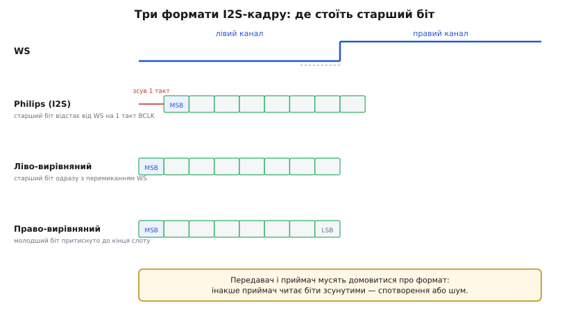
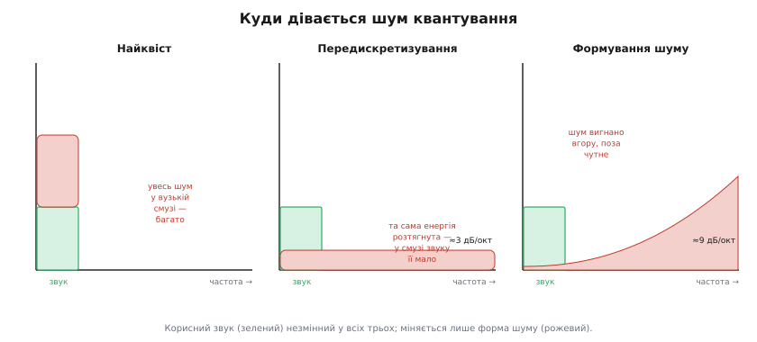
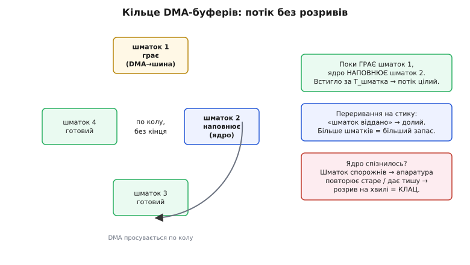

# Відтворення: I2S/ЦАП/PDM-виходи — глибоко

<preknowlist>
- [ЦАП](topic:electronics/dac) — як число перетворюється на напругу; що таке дельта-сигма й чому сучасний ЦАП майже ніколи не драбина резисторів.
- [Підсилювач класу D](topic:electronics/class-d-amplifier) — чому прямокутний ШІМ живить динамік із ККД під 90 % і лишається холодним.
- [Шина I2S](topic:communications/i2s-bus) — три дроти (BCLK, WS, SD) і кадр стереопотоку старшим бітом уперед.
- [Мікрофон і динамік](topic:electronics/microphone-speaker) — як струм у котушці рухає мембрану й народжує звук; сюди дорога веде назад.
- [Проблема потоку даних (DMA)](topic:programming/dma-problem) — чому ядро не може годувати швидку периферію байт за байтом і навіщо потрібен окремий пересильник.
- [Подвійна буферизація](topic:programming/double-buffering) — кільце буферів, що дає безперервний потік, поки ядро наповнює наступний шматок.
</preknowlist>

У [базовому кроці](root:embedded/audio-playback-path) ми пройшли три дороги від чисел у пам'яті до руху мембрани: короткий і грубий внутрішній ЦАП, широкий головний шлях I2S у зовнішню мікросхему й ощадну на дроти дорогу PDM. Там нам вистачало правила вибору — котру дорогу брати. Тепер спускаємось нижче: **чому кожна дорога влаштована саме так**, звідки беруться її межі в числах, і що фізично псує звук, коли щось зроблено неправильно. Це не повторення трьох доріг, а розтин кожної до дна — з повними виведеннями там, де раніше ми брали висновок готовим.

Почнімо з питання, яке в базовому кроці ми обійшли: **що взагалі означає «перетворити числа назад на хвилю»**, і чому це не так безневинно, як здається.

## Зворотна задача: числа, сходинки й привиди частот

Захоплення звуку — це дискретизація: неперервну хвилю ми міряємо через рівні проміжки часу й лишаємо самі відліки. Відтворення — зворотна дія, і тут криється перша неочевидність. Відліки — це **точки**, окремі числа в моменти часу; між ними немає нічого. А динамік просить неперервну напругу в кожну мить. Значить, десь між числами й динаміком хтось мусить **добудувати проміжок** — вирішити, яка напруга стоїть на ніжці в ті миті, коли нового відліку ще нема.

Найпростіше рішення — тримати останнє число, поки не прийде наступне. Це називають **утриманням нульового порядку** (англ. *zero-order hold* — «утримання нульового порядку»): ЦАП виставляє напругу відліку й тримає її сталою весь період дискретизації, потім стрибком переходить на наступний рівень. Виходить не плавна хвиля, а **драбина** зі сходинками завширшки в один період. Саме так працює кожен ЦАП на найнижчому рівні — він не вміє інтерполювати, він утримує.

Ця драбина звучить *майже* як потрібна хвиля, але не зовсім, і тут криється те, що новачки не бачать. Різкі вертикальні сходинки — це високочастотний вміст, якого в оригінальному звуці не було. У частотній картині вони проявляються як **привиди-образи** (англ. *images* — «образи»): точні копії корисного спектра, віддзеркалені навколо частоти дискретизації та її кратних. Якщо звук займає смугу до 20 кГц, а частота дискретизації 44.1 кГц, то навколо 44.1 кГц з'явиться дзеркальна копія 24.1…44.1 кГц, навколо 88.2 кГц — ще одна, і так угору без кінця. Вухо їх переважно не чує (вони вище 20 кГц), але вони є, вони гріють підсилювач і можуть биткою пролізти назад у чутне через нелінійності.

> 🔧 **Навіщо це.** Коли на дешевому виході чутно ледь помітний свист чи «пісок» на тлі тихої музики — це часто саме непридушені образи або шум перемикання, а не поганий запис. Розуміючи, що драбина завжди тягне за собою образи вгорі, ти знаєш, куди дивитися: потрібен фільтр-відновлювач після ЦАП або сам ЦАП із високим передискретизуванням, що ті образи відносить далеко вгору.

Щоб драбину згладити назад у плавну хвилю, потрібен **фільтр-відновлювач** (англ. *reconstruction filter*) — низькочастотний фільтр, що пропускає корисну смугу й ріже образи вище неї. У найгрубішому вигляді це те саме RC-коло; у якісному ЦАП — цифровий фільтр із передискретизуванням усередині. Ключова думка, яку варто занести в голову раз і назавжди: **вихід ЦАП без відновлення — це ще не чистий звук, а звук плюс його верхні привиди**. Кожна з трьох доріг по-своєму розв'язує цю проблему — і різниця між ними значною мірою і є різницею в тому, *де і як* стоїть цей фільтр.

Тепер, тримаючи в голові драбину й образи, розберемо межі кожної дороги — і почнемо з тієї межі, що вирішує все: скільки біт треба, щоб звук був чистим.

## Скільки біт насправді треба: виведення з нуля

У базовому кроці ми сказали: «8 біт — мало, треба 14–16». Тепер виведемо це число, а не приймемо на віру, бо саме воно ділить першу дорогу від другої.

Квантування — це округлення неперервного рівня до найближчого з доступних. Маючи N біт, ЦАП має 2ᴺ рівнів, і крок між сусідніми рівнями дорівнює всьому розмаху, поділеному на кількість кроків. Цей крок звуть **найменшим значущим бітом** (англ. *least significant bit*, LSB) — це найменша зміна напруги, яку ЦАП узагалі здатен зобразити. Будь-яке справжнє значення сигналу лягає **не точно** на рівень, а між двома; різницю округлення — **похибку квантування** — можна вважати випадковим шумом, рівномірно розкиданим у межах ±½ LSB.

Далі — суть виведення. Знайдімо потужність цього шуму. Похибка e рівномірно гуляє в діапазоні шириною q (один LSB) навколо нуля. Середньоквадратичне значення рівномірного шуму такої ширини — стандартний результат:

```
Похибка e:            рівномірна на [−q/2, +q/2]
Потужність (дисперсія): σ²_шуму = ∫ e²·(1/q) de  на [−q/2, q/2]
                                = (1/q) · [e³/3] від −q/2 до q/2
                                = (1/q) · ( (q/2)³/3 − (−q/2)³/3 )
                                = (1/q) · ( q³/24 + q³/24 )
                                = q²/12
Діюче значення шуму:    σ_шуму = q / √12 ≈ 0.289·q
```

Тепер порахуймо потужність **корисного сигналу**. Найкращий випадок — синусоїда, що розгойдана на весь розмах ЦАП. Розмах — це 2ᴺ кроків по q, тобто повна амплітуда від піка до піка дорівнює q·2ᴺ, а половина розмаху (амплітуда синуса) — q·2ᴺ/2. Діюче значення синуса — амплітуда, поділена на √2:

```
Розмах ЦАП:            q · 2ᴺ  (від дна до верху)
Амплітуда синуса:      A = q · 2ᴺ / 2
Діюче значення сигналу: σ_сигн = A / √2 = q · 2ᴺ / (2√2)
```

Відношення сигнал/шум — це відношення їхніх потужностей (квадратів діючих значень), а в децибелах беремо 20·log₁₀ від відношення діючих значень:

```
SNR = 20·log₁₀( σ_сигн / σ_шуму )
    = 20·log₁₀( [q·2ᴺ/(2√2)] / [q/√12] )
    = 20·log₁₀( 2ᴺ · √12 / (2√2) )
    = 20·log₁₀( 2ᴺ ) + 20·log₁₀( √12/(2√2) )
    = N · 20·log₁₀(2)  +  20·log₁₀( √1.5 )
    = N · 6.0206…      +  1.7609…
```

Ось і вона — знаменита формула, яку в галузі звуть «загадковою» рівно тому, що звідкись береться 1.76:

```
SNR ≈ 6.02 · N + 1.76   (дБ, для синуса на весь розмах)
```

Кожен доданий біт піднімає стелю чистоти рівно на **6.02 дБ** (бо подвоєння рівнів — це +6 дБ), а 1.76 дБ — це та стала-доважок, що вилазить із геометрії синуса й рівномірного шуму. Тепер підставмо числа й побачимо, чому 8 біт — глухий кут:

```
 8 біт:  6.02·8  + 1.76 = 49.9 дБ
12 біт:  6.02·12 + 1.76 = 74.0 дБ
16 біт:  6.02·16 + 1.76 = 98.1 дБ
24 біт:  6.02·24 + 1.76 = 146.2 дБ
```

Динамічний діапазон людського слуху — від порога чутності до болю — близько **120 дБ**; діапазон, який реально треба для музики в тихій кімнаті, — 90–100 дБ. Вісім біт дають ≈ 50 дБ: тихі місця запису тонуть у шумі квантування, чутному як «пісок» на тлі. Шістнадцять біт дають ≈ 98 дБ — рівно те, що покриває практичний музичний діапазон, і тому саме 16 біт стали стандартом CD-звуку. Двадцять чотири біти (≈ 146 дБ) — уже із запасом понад будь-який слух, потрібні хіба для проміжної обробки, де похибки накопичуються.

> 🔧 **Навіщо це.** Ця формула — твій калькулятор чистоти. Ставлять питання «а вистачить 12 біт?» — ти не гадаєш, а рахуєш: 12·6.02+1.76 ≈ 74 дБ, для розбірливого голосу цього досить, для музики в тихій кімнаті — ні. І одразу видно ціну кожного заощадженого біта: рівно 6 дБ шуму нагору.

Є одна тонкість, що ховається за словом «найкращий випадок». Формула дає стелю для синуса на **весь** розмах. Реальний звук тихіший за пік майже завжди; коли сигнал займає лише чверть розмаху, він фактично використовує на два біти менше, і SNR на тому фрагменті падає на ≈ 12 дБ. Тому інженери не ганяють сигнал упритул під стелю (щоб не кліпувало), але й не лишають його надто тихим (щоб не втрачати біти) — тримають пік десь на −6…−3 дБ від максимуму. І ще: коли сигнал зовсім тихий і гуляє лише в межах одного-двох LSB, похибка квантування перестає бути схожою на рівний шум — вона стає **корельованою** зі звуком і чутна як бридке спотворення, а не м'який шум. Рятунок парадоксальний: у сигнал **додають** крихту навмисного шуму — [розмивання (dither)](root:embedded/audio-playback-path/math-dither-noise-shaping.md), — і воно розриває кореляцію, роблячи залишкову похибку знову м'яким шумом, який вухо прощає легше за спотворення. Ця сама ідея «обміняти спотворення на шум» лежить в основі й третьої дороги, PDM, куди ми ще прийдемо.

Тепер, знаючи ціну кожного біта, розберемо першу дорогу — і побачимо, чому вона застрягла на восьми.

## Дорога перша, зблизька: внутрішній ЦАП і його три стелі

Внутрішній ЦАП класичного ESP32 — це найпростіше залізо: записав число в регістр, на ніжці стала пропорційна напруга. Але «пропорційна» приховує архітектуру, і від неї — усі межі.

**Що всередині восьмибітного ЦАП.** Такий ЦАП майже завжди зроблений як **драбина резисторів** або комутована матриця: вісім бітів керують вісьмома вимикачами, що приєднують до виходу зважені частки опорної напруги. Старший біт додає половину розмаху, наступний — чверть, далі восьму й так далі. Сума ввімкнених гілок і є вихідна напруга. Це швидко (напруга готова майже миттєво після запису) і просто, але точність упирається в точність резисторів: щоб чесно розрізняти 16 біт цим методом, потрібні резистори, узгоджені з точністю тисячних часток відсотка, — на кристалі мікроконтролера такого не роблять, бо дорого й невигідно. Тому вбудований ЦАП загального призначення й лишається восьмибітним: більше біт цією архітектурою на дешевому кристалі не витягти.

Уже з цього видно перше: **8 біт тут — не примха, а межа архітектури**. За формулою вище це стеля ≈ 50 дБ, назавжди. Жодним кодом її не підняти.

**Друга стеля — струм.** ЦАП віддає напругу, але майже не віддає струму. Уяви його виходом як джерело напруги з відчутним **внутрішнім опором** — сотні ом. Динамік має опір 4 чи 8 Ом. Що станеться, якщо з'єднати їх напряму, показує [дільник напруги](topic:electronics/voltage-divider): динамік і внутрішній опір ЦАП утворюють дільник, і на динаміку лишиться мізерна частка. Порахуймо на конкретних числах:

**Приклад (чому ЦАП не гойдає динамік напряму).** Хай внутрішній опір виходу ЦАП R_вих ≈ 200 Ом, динамік R_дин = 8 Ом, а ЦАП силкується виставити 1.5 В.

```
Дільник:  U_дин = U_цап · R_дин / (R_вих + R_дин)
                 = 1.5 · 8 / (200 + 8)
                 = 1.5 · 8 / 208
                 = 1.5 · 0.0385
                 ≈ 0.058 В  ← замість 1.5 В на динаміку лишилось 58 мВ

Потужність у динаміку:  P = U²/R = 0.058² / 8 ≈ 0.42 мВт
```

Менше половини мілівата — це ледь чутне сипіння, не звук. Напруга «просіла» на дільнику майже вся, бо вихід ЦАП «м'який»: щойно з нього тягнуть струм у низькоомне навантаження, він не тримає напруги. Ось чому між внутрішнім ЦАП і динаміком **обов'язково** стоїть [підсилювач класу D](topic:electronics/class-d-amplifier) — власне, буфер із малим вихідним опором, здатний віддати ампери. А раз усе одно потрібна зовнішня мікросхема-підсилювач, гасне головна перевага цієї дороги — «жодних додаткових деталей».

**Третя стеля — його просто нема на нових чипах.** У ESP32-S3, C3, C6 внутрішній ЦАП прибрали фізично. Виклик `dacWrite()` на них не компілюється — периферії не існує. Причина проста: індустрія перейшла на I2S+зовнішній ЦАП як стандарт, і тримати на кристалі грубий 8-бітний блок, яким ніхто не робить справжній звук, стало невигідно.

Є тонкість реалізації, варта згадки, бо вона показує, як тісно пов'язані дороги. На класичному ESP32 віддавати відліки в ЦАП можна двома способами. Найгрубіший — вручну писати `dacWrite(25, value)` у циклі; але тоді ядро мусить саме витримувати темп 44100 разів на секунду, і будь-яке переривання зіб'є ритм. Розумніший — **пустити ЦАП через той самий контролер I2S**: у класичного ESP32 є режим «вбудований ЦАП», де I2S-апаратура з DMA виливає буфер відліків, а на виході замість цифрового потоку стоять аналогові рівні на GPIO25/26. Так ЦАП дістає ту саму дисципліну безперервного потоку, що й «дорослі» дороги, — про неї нижче. Але 8 біт лишаються 8 бітами, хоч як їх годуй.

Через ці три стелі внутрішній ЦАП і живе там, де якість байдужа: біп на аварію, короткий сигнал-підтвердження, найпростіша мелодія на іграшці. Щойно потрібен розбірливий голос чи музика — переходимо на другу дорогу, де аналогову роботу віддано мікросхемі, зробленій під неї.

## Дорога друга, зблизька: анатомія I2S-кадру й тактів

Ідея другої дороги, як ми бачили, — не робити аналог у чипі взагалі, а вигнати *цифру* по [шині I2S](topic:communications/i2s-bus) у зовнішню мікросхему. У базовому кроці ми розібрали три дроти — BCLK, WS, SD — на рівні «хто за що відповідає». Тепер розберемо **тактову арифметику** й **формат кадру**, бо саме тут ховаються пастки, що дають «звук є, але не такий».

### Три (а насправді чотири) такти й точна формула BCLK

I2S тримається на строгому співвідношенні частот, і його треба вміти рахувати, бо неправильний такт — це неправильна швидкість звуку. Розкладімо все по поличках.

- **WS** (*word select*), він же LRCK, перемикається **раз на повний стереовідлік**: низький рівень — увесь лівий канал, високий — увесь правий. Отже його частота **дорівнює частоті дискретизації** fs. Для 44.1 кГц WS цокає 44100 разів на секунду.
- **BCLK** (*bit clock*) видає **по імпульсу на кожен переданий біт**. За один період WS (тобто один стереовідлік) треба передати біти обох каналів. Звідси точна формула:

```
BCLK = fs · (біт на канал) · (кількість каналів)
```

**Приклад (порахувати BCLK для типового стерео).** 44.1 кГц, 16 біт на канал, 2 канали:

```
BCLK = 44100 · 16 · 2 = 1 411 200 Гц ≈ 1.41 МГц
```

А якщо взяти 24 біти на канал і 48 кГц:

```
BCLK = 48000 · 24 · 2 = 2 304 000 Гц ≈ 2.30 МГц
```

Тобто чим більша роздільність і частота, тим швидше мусить цокати бітовий такт. Мікроконтролер-майстер генерує і WS, і BCLK сам, з єдиного внутрішнього джерела, і виставляє їх у строгому відношенні; приймачу лишається ловити біти в такт.

- **MCLK** (*master clock*, головний такт) — четвертий, **необов'язковий** сигнал, якого в оригінальній специфікації Philips [1986 року](root:embedded/audio-playback-path/hist-i2s-origins.md) навіть не було. Він з'явився пізніше як службовий: багатьом ЦАП потрібен окремий високочастотний такт, кратний частоті дискретизації, щоб тактувати свій **внутрішній** дельта-сигма-перетворювач і цифрові фільтри. Типове співвідношення — **MCLK = 256 · fs** (звідси й позначення «256fs»); буває 128fs, 384fs, 512fs.

```
MCLK = 256 · fs
Для 48 кГц:  256 · 48000 = 12 288 000 Гц = 12.288 МГц
Для 44.1 кГц: 256 · 44100 = 11 289 600 Гц ≈ 11.29 МГц
```

Чому саме 256? Бо всередині ЦАП передискретизовує звук — робить не 48 тисяч мікрокроків на секунду, а в 256 разів більше, і йому потрібен такт цієї частоти. Мікросхеми на кшталт MAX98357A **не** просять MCLK: вони виводять свій внутрішній такт із самого BCLK, і це велике зручність — на один дріт менше. Але ЦАП високого класу (PCM5102 і рідня) MCLK вимагають, і якщо його не подати або подати не в тому відношенні — вони або мовчать, або звучать брудно. Ось чому число «256fs» варто тримати в голові: коли якісний ЦАП «не заводиться», перша підозра — MCLK.

Є ще один прихований гравець, про якого мовчать діаграми, — **тремтіння такту** (англ. *jitter* — «дрож»). BCLK і WS повинні цокати рівно; якщо їхні фронти «плавають» у часі на пікосекунди, ЦАП бере відліки в трохи неправильні миті, і це переходить у шум на виході. Для 8-бітного біпа тремтіння байдуже; для 24-бітного якісного тракту воно стає одним із головних обмежувачів чистоти, тому дорогі ЦАП мають власний кварц і **перетактовують** вхідний потік своїм чистим тактом, ігноруючи дрож майстра. Мікроконтролер тут — джерело помірного тремтіння, і для типового вбудованого звуку його досить; знати про механізм варто, щоб не дивуватися, чому «ті самі біти» на дешевій платі звучать трохи гірше, ніж на аудіофільській.

### Формат кадру: чому Philips-I2S зсунуто на біт, і що таке слот

Тепер найтонше місце другої дороги — **вирівнювання даних у кадрі**. Біти відліку йдуть по SD старшим уперед (MSB first), але **коли саме** відносно перемикання WS — тут існує кілька несумісних домовленостей, і плутанина між ними дає класичний симптом «звук тихий, спотворений або в шумі».

Класичний **формат Philips (I2S)** має одну хитрість, що збиває з пантелику: перший біт відліку йде **не одразу** після перемикання WS, а **із затримкою на один такт BCLK**. WS перемкнувся — і лише на *наступний* фронт BCLK з'являється старший біт нового каналу. Навіщо цей зсув? Щоб приймачеві було легше зловити межу каналу: перемикання WS чітко відділене від першого біта даних, тож немає плутанини, до якого каналу належить біт на самій межі. Це рішення з оригінальної специфікації [1986 року](root:embedded/audio-playback-path/hist-i2s-origins.md) й досі живе в назві `I2S_STD_PHILIPS_SLOT_DEFAULT_CONFIG`.

Поруч живуть інші вирівнювання:
- **Ліво-вирівняний** (*left-justified*, MSB): перший біт з'являється **одразу** з перемиканням WS, без зсуву. Старший біт «притиснуто» до лівого краю кадру.
- **Право-вирівняний** (*right-justified*, LSB): молодший біт відліку притиснуто до правого краю кадру — до наступного перемикання WS. Тоді старші біти можуть починатися десь усередині, і приймач мусить знати розрядність, щоб їх відрахувати.

Ключове поняття тут — **слот** (англ. *slot* — «гніздо»): це вікно в кадрі, відведене під один канал. Слот може бути ширшим за самі дані. Скажімо, кадр тримає по 32 біти на канал (широкий слот), а корисних даних лише 16 — тоді 16 біт відліку кладуть у слот, а решту 16 добивають нулями. Тому в конфігурації є **дві** розрядності: ширина даних (`I2S_DATA_BIT_WIDTH_16BIT` — скільки біт несе сам відлік) і ширина слоту (скільки місця під канал у кадрі). Найчастіша пастка новачка — сплутати їх: даєш ЦАП 16 біт даних у 32-бітному слоті, а він налаштований читати 24 в 32 — і зчитує зсунуті, спотворені числа.

Розберімо на числах, як зсув і ширина слоту міняють BCLK. Якщо слот 32-бітний (а не 16), кадр несе більше бітів, тож бітовий такт мусить бути швидшим:

```
Слот 16 біт: BCLK = 44100 · 16 · 2 = 1.41 МГц  (даних рівно 16)
Слот 32 біт: BCLK = 44100 · 32 · 2 = 2.82 МГц  (даних 16 + 16 нулів)
```

Отже, вибираючи ширший слот «про запас», ти вдвічі піднімаєш бітовий такт і навантаження на шину — за нуль корисної інформації. У вбудованому звуці беруть слот рівно під дані.


*Чому «ті самі 16 біт» звучать по-різному. Угорі — WS, спільний для всіх. Нижче три способи покласти відлік у слот. Philips (I2S): старший біт відстає від перемикання WS на один такт BCLK — цей зсув відділяє межу каналу від даних. Ліво-вирівняний: старший біт з'являється одразу з WS. Право-вирівняний: молодший біт притиснуто до кінця слоту, старші починаються всередині. Приймач і передавач мусять домовитися про формат — інакше приймач читає біти зсунутими й видає спотворення чи шум.*

### Код: ширина слоту, моно з стерео-потоку, чергування

Повернімося до драйвера ESP-IDF, але тепер із розумінням, що кожне поле означає фізично. Базовий крок дав кістяк ініціалізації; додаймо тонкощі, яких там не було.

```c
#include "driver/i2s_std.h"

static i2s_chan_handle_t tx_chan;

void i2s_out_init(void) {
    i2s_chan_config_t chan_cfg =
        I2S_CHANNEL_DEFAULT_CONFIG(I2S_NUM_0, I2S_ROLE_MASTER);
    /* глибина черги DMA-буферів і розмір кадру — про них у розділі про потік */
    chan_cfg.dma_desc_num  = 6;     /* скільки буферів у кільці */
    chan_cfg.dma_frame_num = 240;   /* відліків у кожному буфері */
    i2s_new_channel(&chan_cfg, &tx_chan, NULL);

    i2s_std_config_t std_cfg = {
        .clk_cfg  = I2S_STD_CLK_DEFAULT_CONFIG(44100),
        .slot_cfg = I2S_STD_PHILIPS_SLOT_DEFAULT_CONFIG(
                        I2S_DATA_BIT_WIDTH_16BIT, I2S_SLOT_MODE_STEREO),
        .gpio_cfg = {
            .mclk = I2S_GPIO_UNUSED,  /* MAX98357A не просить MCLK */
            .bclk = GPIO_NUM_26,
            .ws   = GPIO_NUM_25,
            .dout = GPIO_NUM_22,
            .din  = I2S_GPIO_UNUSED,  /* тільки віддаємо */
        },
    };
    i2s_channel_init_std_mode(tx_chan, &std_cfg);
    i2s_channel_enable(tx_chan);
}
```

А ось тонкість чергування, яку варто побачити в коді, а не лише в словах. У стереорежимі буфер несе відліки **парами**: лівий, правий, лівий, правий (*interleaved* — «переплетено»). Це прямо відповідає WS: на його низький рівень апаратура викидає лівий елемент пари, на високий — правий. Готуючи моно-звук на обидва динаміки, дублюєш значення в обидві комірки пари:

```c
/* зробити зі списку моно-відліків стерео-буфер: кожен відлік — у Л і П */
void mono_to_stereo(const int16_t *mono, int16_t *stereo, size_t n) {
    for (size_t i = 0; i < n; i++) {
        stereo[2*i + 0] = mono[i];   /* лівий слот  */
        stereo[2*i + 1] = mono[i];   /* правий слот */
    }
}

/* віддати блок: виклик блокує, доки DMA не забере його в кільце */
size_t written;
i2s_channel_write(tx_chan, stereo, n * 2 * sizeof(int16_t),
                  &written, portMAX_DELAY);
```

Якщо забути про чергування й лити моно-масив прямо в стерео-канал, апаратура розкладе сусідні відліки по різних каналах — і замість звуку дістанеш різкий шум із частотою, зсунутою вдвічі. Це та сама пастка «даних-формату», лише з іншого боку.

Про типову розпіновку самої мікросхеми-підсилювача, дві її керувальні ніжки (GAIN і SD), вибір каналу дільником і чому міст на виході не терпить землі на динаміку — окремо в [класі I2S-підсилювачів звуку](root:embedded/audio-playback-path/comp-i2s-audio-amp.md); там усе про підключення й граблі саме мікросхеми, тут — про сам потік і формат.

Друга дорога панує в аудіо саме тому, що чисто розділяє світи: майстер лишається в цифрі, де він сильний, а вся аналогова тонкість замкнена в мікросхемі, зробленій під неї. Тепер — третя дорога, найхитріша, і щоб зрозуміти її до дна, доведеться вивести, **чому один біт узагалі здатен нести чистий звук**.

## Дорога третя, до дна: як один біт несе 16-бітну хвилю

Третя дорога, PDM, спантеличує найдужче, бо суперечить щойно виведеному. Ми довели: щоб мати ≈ 98 дБ чистоти, треба 16 біт. А PDM віддає **один** біт — і при цьому звучить не гірше. Як? Відповідь ховає два механізми, що працюють разом: **передискретизування** й **формування шуму**. Розберімо кожен, бо разом вони — серце всіх сучасних аудіо-ЦАП, не лише PDM.

### Механізм перший: передискретизування розмазує шум

Повернімося до формули шуму квантування: повна потужність похибки σ² = q²/12, і вона **не залежить від частоти дискретизації**. Це ключ. Скільки б швидко ми не квантували, повна енергія шуму та сама — але вона розмазується по всій смузі від нуля до половини частоти дискретизації. А корисний звук займає лише нижні 20 кГц. Значить, якщо квантувати **набагато швидше**, ніж треба звукові, шум розтягнеться на широченну смугу, а в нашій вузькій звуковій смузі його лишиться мала частка.

Порахуймо цю частку. Хай **коефіцієнт передискретизації** (англ. *oversampling ratio*, OSR) — це у скільки разів частота дискретизації перевищує подвоєну звукову смугу:

```
OSR = fs_швидка / (2 · f_звук)
```

Шум розкиданий рівномірно по смузі до fs_швидка/2, а в звуковій смузі f_звук лишається частка (f_звук)/(fs_швидка/2) = 1/OSR від повної потужності. Потужність зменшилась в OSR разів — отже діюче значення шуму в смузі зменшилось у √OSR. У децибелах:

```
виграш = 10·log₁₀(OSR)   дБ
```

Кожне **подвоєння** OSR (октава) дає 10·log₁₀(2) ≈ **3 дБ** — тобто пів біта. Саме голе передискретизування, без жодних хитрощів, уже купує чистоту: збільшив швидкість учетверо — виграв 6 дБ, один біт. Але сам по собі цей виграш надто повільний: щоб голим передискретизуванням із 1 біта дійти до 16-бітної чистоти (потрібно ≈ 90 дБ понад однобітну стелю), треба OSR у мільярди разів — нереально. Тут вступає другий, потужніший механізм.

### Механізм другий: формування шуму виштовхує похибку вгору

А що, як не просто розмазати шум рівно, а **активно вигнати** його з нашої звукової смуги нагору, у ту частину спектра, де його все одно ніхто не почує? Саме це робить **формування шуму** (англ. *noise shaping*).

Ідея, яку [1962 року](root:embedded/audio-playback-path/hist-i2s-origins.md) оформили Іносе, Ясуда й Муракамі з Токійського університету (розвинувши раніші ідеї формування шуму з Bell Labs), проста й геніальна. Однобітний квантувач робить грубу похибку на кожному кроці. Але цю похибку можна **виміряти** (це різниця між тим, що хотіли, і тим, що видали грубий біт) і **накопичувати**, підмішуючи назад у вхід наступного кроку зі знаком мінус. Схема ніби каже собі: «цього разу я округлив угору й переборщив на стільки-то — на наступному кроці округлю вниз, щоб у *середньому* вийшло точно». Помилка кожного кроку не зникає, а переноситься в наступний і гаситься — тож у повільній (звуковій) складовій сигнал точний, а вся похибка збивається в **швидкі** коливання біта, тобто вгору по частоті.

Математично цей контур діє як **фільтр**: на корисний сигнал він прозорий (пропускає його точно), а на власний шум квантування чинить як **високочастотний фільтр** — притлумлює його внизу й підіймає вгорі. Спектр шуму більше не рівний: він **завалений** у звуковій смузі й **задертий** біля половини швидкої частоти. Звідси й термін «формування»: шуму рівно стільки ж за повною енергією, але його *форму* в спектрі перекроєно так, щоб у нашій смузі його майже не було.

Тепер — головне число, заради якого все це. Порядок формувача (скільки інтеграторів у контурі) визначає, наскільки круто шум завалено внизу. Виведення дає такий результат для **кожного подвоєння OSR**:

```
Голе передискретизування (0-й порядок):  +3 дБ / октаву  (½ біта)
Формувач 1-го порядку:                    +9 дБ / октаву  (1½ біта)
Формувач 2-го порядку:                    +15 дБ / октаву (2½ біта)
Загальне правило (порядок L):             +(6·L + 3) дБ / октаву
```

Різниця драматична. Голе передискретизування дає 3 дБ за октаву; формувач першого порядку — уже 9, бо до трьох «розмазувальних» додаються ще 6 «виштовхувальних» децибел. Тепер порахуймо, чого досягає реальний PDM. Для звуку 48 кГц беруть швидку частоту 3.072 МГц — це OSR = 3.072 МГц / (2·24 кГц) = 64, тобто **шість октав** над звуковою смугою:

```
Формувач 2-го порядку, 6 октав (OSR = 64):
  виграш = 6 октав · 15 дБ/октаву = 90 дБ
  над однобітною стелею → ефективно ≈ 15–16 біт чистоти в смузі звуку
```

Ось розв'язок парадокса. **Один біт** плюс передискретизування в 64 рази плюс формувач другого порядку дають у звуковій смузі чистоту 16-бітного ЦАП. Похибка нікуди не поділась — вона вся вигнана вгору, у смугу 24 кГц…1.5 МГц, де вухо її не чує, а простий фільтр легко відрубає. Це і є та сама дельта-сигма, що живе всередині кожного якісного аудіо-ЦАП; PDM — це вона ж, лише **виведена одним дротом назовні чипа**.


*Куди дівається шум квантування. Ліворуч (Найквіст): повна енергія шуму (сіра площа) втиснута у вузьку звукову смугу — його там багато. Посередині (передискретизування): та сама енергія розтягнута на широку смугу, у звуковій частині її мала частка — виграш ≈ 3 дБ за октаву. Праворуч (формування шуму): контур завалює шум у звуковій смузі майже в нуль, зате задирає гіркою вгорі, поза чутним, — виграш ≈ 9 дБ за октаву для першого порядку. Корисний звук (зелений) у всіх трьох незмінний; міняється лише форма шуму.*

> 🔧 **Навіщо це.** Ці числа пояснюють, чому мікрофони й ЦАП стали однобітними скрізь: один дріт замість шістнадцяти паралельних, а чистота — 16-бітна, бо її купують передискретизуванням і формуванням, а не паралельними лініями. Коли бачиш у datasheet «PDM, 3.072 MHz» — тепер ти читаєш це як «OSR 64, формувач другого порядку, ефективні 16 біт», а не як загадковий однобітний потік.

### Чому сирий PDM — це крик, і як його втихомирити

Тепер зворотний бік елегантності, і саме тут ламається наївне «PDM = дешевий якісний звук». Уся та вигнана нагору похибка **фізично присутня** на дроті. Поки потік не усереднено, він містить величезний високочастотний шум — той самий, що формувач збив угору. Підключиш однобітний вихід прямо до динаміка чи в осцилограф — почуєш і побачиш різкий писк на межі чутного й вище, а не музику. **Сирий PDM — це не звук, а звук, похований під ультразвуковим шумом.**

Щоб дістати звук, треба **усереднити** потік — прогнати через низькочастотний фільтр, що пропустить нижні 20 кГц і відріже задерту гірку шуму вгорі. Тут дві дороги, і різниця між ними — це різниця між «бікнути» й «грати музику»:

- **Простий RC-фільтр** — резистор і конденсатор, найдешевше. Він грубий: завалює високе повільно, тож частина ультразвукового шуму пролізе, а частина верхів звуку приглушиться. Для тихого біпа згодиться, для музики — ні.
- **Мікросхема-підсилювач із PDM-входом** — набагато краще. Це той самий клас D, що ми розбирали для I2S, але з іншим «ротом»: усередині він сам приймає однобітний потік, усереднює його якісним цифровим фільтром і одразу підсилює. Тобі лишається подати PDM і живлення.

І ось найдорожча пастка третьої дороги, про яку варто кричати: **не плутай PDM-вхід з I2S-входом**. Мікросхеми зовні майже однакові, ніжки підписані схоже, корпуси ті самі. Але подаси PDM-потік у підсилювач, що чекає I2S, — він спробує читати густину імпульсів як звичайні біти відліку й видасть шум; подаси I2S у PDM-вхід — те саме навпаки. I2S-варіант (типовий представник MAX98357A) і PDM-варіант — рідні брати з різними ротами, і переплутати їх коштує вечора налагодження. Тому перед підключенням **завжди звіряй, якого входу хоче саме твоя мікросхема**.

У коді ESP32 усе просто, бо той самий контролер I2S має режим **PDM TX**: усередині нього стоїть готовий формувач, що перетворює звичайні 16-бітні PCM-відліки на однобітний потік. Ти й далі пишеш нормальні числа — на ніжку виходить PDM.

```c
#include "driver/i2s_pdm.h"

static i2s_chan_handle_t pdm_tx;

void pdm_out_init(void) {
    i2s_chan_config_t chan_cfg =
        I2S_CHANNEL_DEFAULT_CONFIG(I2S_NUM_0, I2S_ROLE_MASTER);
    i2s_new_channel(&chan_cfg, &pdm_tx, NULL);

    i2s_pdm_tx_config_t pdm_cfg = {
        .clk_cfg  = I2S_PDM_TX_CLK_DEFAULT_CONFIG(44100),
        .slot_cfg = I2S_PDM_TX_SLOT_DEFAULT_CONFIG(
                        I2S_DATA_BIT_WIDTH_16BIT, I2S_SLOT_MODE_MONO),
        .gpio_cfg = {
            .clk  = GPIO_NUM_26,   /* такт PDM */
            .dout = GPIO_NUM_25,   /* однобітний потік */
        },
    };
    i2s_channel_init_pdm_tx_mode(pdm_tx, &pdm_cfg);  /* PCM → PDM усередині */
    i2s_channel_enable(pdm_tx);
    /* далі — той самий i2s_channel_write() з PCM-відліками */
}
```

А щоб по-справжньому відчути, як із чисел народжується густина, найкраще написати найпростіший **формувач першого порядку своїми руками** — кілька рядків C, що перетворюють відліки на біти акумулятором похибки; це те, що ESP32 робить апаратно. Розібраний робочий приклад такого софтового PCM→PDM-кодера з поясненням акумулятора й межових випадків — у [проєкті «однобітний кодер»](root:embedded/audio-playback-path/proj-pdm-encoder.md).

PDM беруть, коли важать дроти й ніжки: один сигнальний плюс такт замість трьох. Плата за компактність — обов'язкове усереднення на виході й пильність, щоб не переплутати роти мікросхем. Тепер, розібравши всі три дороги до дна, звернімося до дисципліни, спільної для всіх, — і теж поглибимо її до чисел.

## Спільна дисципліна: чому потік не сміє спіткнутися ні на мить

Три дороги різні, але годувати їх треба однаково — **рівним потоком без єдиної паузи**. У базовому кроці ми сказали «недобіг буфера дає клац». Тепер виведемо, **звідки береться дедлайн**, як його рахувати й де межа, за якою система не встигає.

### Дедлайн у числах і чому звук не можна «доопитати»

Відтворення живе під **жорстким дедлайном реального часу**. На 44.1 кГц новий стереовідлік потрібен щорівно, без права спізнитись:

```
Період відліку:  T = 1 / 44100 ≈ 22.68 мкс
Потік даних (стерео, 16 біт = 4 байти/відлік):
                 44100 · 4 = 176 400 байт/с ≈ 172 КБ/с
```

Кожні 22.68 мкс апаратура зобов'язана мати наступний відлік. Це принципово інакше, ніж кадр дисплея: кадр можна показати на мілісекунду пізніше, і око не помітить. Звук — **ні**. Пропущене вікно 22.68 мкс — це не «затримка», а **тиша замість звуку в конкретну мить**, і її вже не повернути: час минув, хвиля пролунала діркою. Оце «не можна доопитати потім» і робить звук найвимогливішим до безперервності потоком у всій прошивці.

Що станеться фізично, якщо ядро спізнилось долити? Вихідний буфер апаратури спорожнів, а віддавати щось треба — і вона або **повторює старий** шматок, або віддає **тишу** (нулі). У кожному разі на плавній хвилі виникає розрив — різкий стрибок рівня, а різкий стрибок — це широкий сплеск високих частот, який вухо чує як **клац** чи тріск. Цей провал звуть **недобігом буфера** (англ. *buffer underrun* — «недобіг»): дані скінчились раніше, ніж їх устигли долити.

### Кільце DMA-буферів і арифметика запасу

Рятунок — той самий, що ми бачили в [DMA-транспорті](root:embedded/dma-spi-i2s): [подвійний, а насправді кільцевий буфер](topic:programming/double-buffering). Пам'ять ділять на кілька рівних шматків-дескрипторів; [DMA](topic:programming/dma-problem) виливає один у шину, а поки він зайнятий цим, ядро наповнює **наступний**. Апаратура на стику дає переривання «шматок віддано» — сигнал ядру долити свіжу порцію. Так процесор вільний майже весь час і встигає і рахувати звук, і робити решту роботи, а потік у динамік не рветься.

Ключове проєктне рішення — **розмір і кількість шматків**, і воно є компромісом, який треба вміти рахувати. Кожен шматок дає ядру рівно стільки часу, скільки він гратиме:

**Приклад (запас часу й частота переривань від розміру буфера).** Кільце з дескрипторів по 240 стереовідліків, 44.1 кГц:

```
Час одного дескриптора = 240 / 44100 ≈ 5.44 мс
  → ядро мусить долити наступний РАНІШЕ, ніж за 5.44 мс,
    інакше недобіг → клац
Частота переривань «долий» = 44100 / 240 ≈ 184 на секунду
Пам'ять під один дескриптор = 240 · 4 = 960 байт;
  кільце з 6 штук = 5760 байт
```

А тепер повернімо ручку в інший бік — більший буфер:

```
Дескриптор 2048 відліків:
  час = 2048 / 44100 ≈ 46.4 мс запасу ядру
  переривань = 44100 / 2048 ≈ 21.5 на секунду
  але пам'ять × 8, і затримка «вирішив грати → зазвучало» ≈ 46 мс
```

Ось де живе компроміс. **Великий буфер** дає ядру аж 46 мс форуму — воно може надовго відволіктися (обробити мережу, порахувати важкий фільтр) і не спізнитись; переривань мало, процесор спокійний. Але за це — довга **затримка** від «вирішив програти» до «зазвучало» й більше витраченої пам'яті. **Малий буфер** — навпаки: тісний дедлайн (5 мс — і вже недобіг), часті переривання, зате миттєва реакція й ощадність пам'яті. Для музичного плеєра беруть буфер побільше (затримка байдужа, головне — не рвати); для інструмента, що має відгукуватись на дотик без чутного лагу, — менший, ближче до межі.

Скільки шматків тримати в кільці? Мінімум **два** (поки грає один, наповнюється другий) — звідси стара назва «подвійний буфер». Але два лишають нуль запасу: якщо ядро спізнилось хоч раз, недобіг миттєвий. Тому на практиці беруть 3–8 шматків: тоді навіть якщо ядро один раз затрималось довше звичайного, у кільці ще є готові дані, і потік не рветься. `i2s_channel_write()` у прикладах саме цим і керує під капотом: усередині — кільце DMA-дескрипторів, а виклик **блокує** рівно доти, доки в кільці не звільниться місце під новий блок. Тобто драйвер сам синхронізує ядро з апаратним темпом; твоя задача — лити блоки досить часто, щоб виклик не застоявся до недобігу.


*Як кільце тримає потік безперервним. Чотири шматки пам'яті по колу. DMA (стрілка) виливає поточний шматок у шину I2S за час T_шматка; поки він зайнятий, ядро наповнює наступний свіжими відліками. На стику апаратура дає переривання «віддано» — сигнал долити. Поки ядро встигає за T_шматка, потік у динамік суцільний. Спізнилось — шматок спорожнів, апаратура повторює старе або дає тишу, і на хвилі виникає розрив: клац. Більше шматків у кільці = більший запас на випадок, коли ядро надовго відволіклося.*

### Дві тихі пастки темпу: частота дискретизації й когерентність тактів

Є ще дві спільні дрібниці, що кусають боляче, бо не дають помилки компіляції — лише кривий звук.

**Частота дискретизації мусить збігатися з тою, у якій записано матеріал.** Число в `I2S_STD_CLK_DEFAULT_CONFIG(44100)` задає, з яким темпом апаратура виштовхує відліки. Якщо матеріал записано на 16 кГц, а канал налаштовано на 44.1 кГц, апаратура прожене ті самі числа втричі швидше — і звук вийде втричі вищим і швидшим. Порахуймо коефіцієнт «бурундука»:

```
Записано на:      16000 відліків/с
Граємо на:        44100 відліків/с
Коефіцієнт темпу: 44100 / 16000 ≈ 2.76
  → голос звучить у 2.76 раза швидше й на ≈ 1.5 октави вище
    (бо кожне подвоєння частоти = октава; log₂(2.76) ≈ 1.46)
```

Симптом ні з чим не сплутати — «бурундук». Лікування одне: число частоти в конфігурації = справжня частота відліків, які ти ллєш. Якщо джерела різні (щось 16 кГц, щось 44.1), треба або переналаштовувати канал, або **пересемплювати** матеріал у коді до єдиної частоти — окрема робота, до якої ще дійде курс.

**Такти мусять бути когерентні.** BCLK, WS і (якщо є) MCLK повинні виходити з **одного** внутрішнього джерела в строгому цілочисловому відношенні. Якщо MCLK бере від одного кварцу, а BCLK від іншого, вони поволі «розповзаються» у фазі — і ЦАП, що тактує свій фільтр від MCLK, а дані бере по BCLK, раз у раз ловить відлік не в ту мить. Наслідок — тихі клацання чи періодичний «булькіт» раз на кілька секунд, коли розбіжність накопичується до цілого відліку й апаратура «проковтує» або «дублює» один. Тому в конфігурації всі такти виводять із спільного джерела; ESP-IDF це робить сам, коли ти задаєш лише `clk_cfg`, — але знати механізм варто, щоб упізнати симптом, якщо десь такти розведено вручну.

### Клацання на межах: увімкнення, вимкнення й постійний зсув

Остання спільна тонкість — **клацання не від недобігу, а від стрибків рівня на межах відтворення**. Коли підсилювач умикається, на його виході легко виникає різкий стрибок напруги від нуля до робочої точки — вухо чує його як гучний «клац» (англ. *click-and-pop*). Так само на вимкненні й на стику двох різних фрагментів, якщо їхні рівні не збігаються.

Механізм той самий, що й у недобігу: будь-який **різкий стрибок рівня** — це широкий сплеск високих частот. Тому три правила гігієни:
- **Умикай підсилювач завчасно** (ніжкою SD, до першого відліку) і **вимикай після паузи** звуку, а не в середині хвилі — тоді перемикання припадає на тишу.
- Стеж за **постійним зсувом** (англ. *DC offset*): якщо відліки крутяться не навколо нуля, а навколо якогось зміщення, на увімкненні буде стрибок на це зміщення. Тримай сигнал центрованим на нулі.
- На стику фрагментів роби коротке **згасання й наростання** (fade), щоб рівень переходив плавно, а не стрибком.

Якісні мікросхеми мають вбудовану схему згладжування цих переходів, але покладатися лише на неї не варто — дисципліна з боку коду прибирає клацання надійніше.

## Котру дорогу брати: рішення на числах

Звівши три поглиблені дороги докупи, дістаємо те саме правило вибору, що й у базовому кроці, але тепер підперте числами, які ми вивели.

Потрібен **простий сигнал** (біп, коротка мелодія, індикація), плата вже на класичному ESP32, якість байдужа — бери **внутрішній ЦАП**. Знай його стелю: 8 біт = ≈ 50 дБ чистоти (за формулою 6.02·8+1.76), слабкий вихід, що не гойдає динамік напряму (дільник з'їдає майже все — 58 мВ із 1.5 В на прикладі вище), і повна відсутність на нових чипах. Це для сигналів, не для музики.

Потрібен **якісний, гучний звук** — і це майже завжди так — бери **I2S у зовнішній ЦАП/підсилювач**. 16 біт дають ≈ 98 дБ, рівно під музичний діапазон; три цифрові дроти, чиста BCLK-арифметика (fs·біти·канали), жодної аналогової схемотехніки з твого боку. Це шлях за замовчуванням; лише стеж за форматом кадру (Philips-зсув, ширина слоту) і за MCLK, якщо ЦАП його просить.

Потрібно **зекономити дроти чи ніжки** (щільна плата, довгий шлейф) — бери **PDM**: один сигнальний дріт плюс такт. Пам'ятай, чим за це платиш: сирий однобітний потік — це крик ультразвукового шуму, вигнаного формувачем угору; без усереднення (RC або, краще, PDM-підсилювача) звуку нема, а плутанина PDM-входу з I2S-входом коштує вечора.

І над усіма трьома — спільна дисципліна: лити відліки рівно, без єдиної паузи, спираючись на DMA й кільцевий буфер, бо звук не прощає жодного пропущеного вікна 22.68 мкс. Розмір кільця — компроміс між запасом (великий буфер, 46 мс форуму, але затримка) і реакцією (малий буфер, миттєвий, але тісний дедлайн).

Найчастіший вибір у сучасному пристрої лишається **другим**: I2S панує саме тому, що чисто розділяє світи (цифра — у мікроконтролері, аналог — у зробленій під нього мікросхемі), коштує лиш кількох дротів і дає 16-бітну чистоту без аналогової роботи з твого боку. Внутрішній ЦАП лишається для дрібних сигналів, PDM — для тісних плат. Але тепер, вивівши межі кожної дороги в числах — від формули шуму квантування до дедлайну потоку, — ти дібраєш вихід не за звичкою, а за розрахунком: під конкретну задачу, з ясним розумінням, що саме й чому обмежує кожен шлях.
