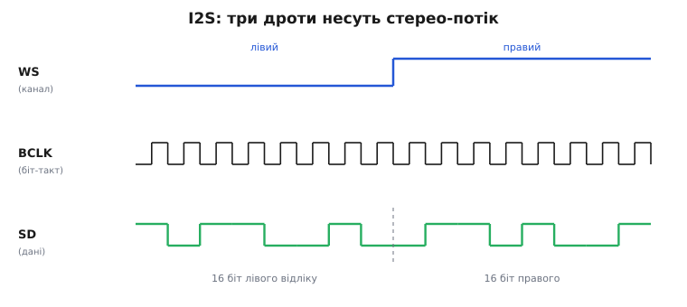
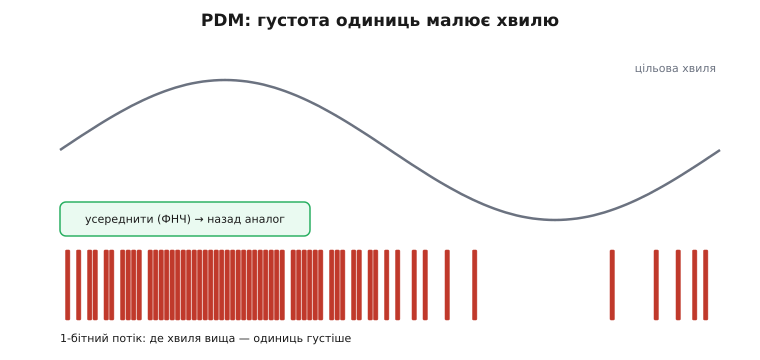

# Відтворення: I2S/ЦАП/PDM-виходи

У попередньому кроці ми пройшли дорогу звуку **всередину** пристрою: [мембрана мікрофона](book:electronics/microphone-speaker) ловить коливання повітря, а на іншому кінці ланцюга в пам'яті лягає рівний потік чисел — відліки. Тепер розвертаємось і йдемо тим самим ланцюгом **назовні**. Задача дзеркальна: у нас є буфер чисел (наприклад, розпаковані відліки WAV-файлу, синтезований тон чи голос, що прийшов по радіо), і треба перетворити цей потік знову на рух мембрани динаміка — на звук, який чутно вухом.

На перший погляд це те саме перетворення, лише в інший бік, тож здавалося б, вистачить одного блоку. Але виходів із чипа насправді **три різні**, і вони не взаємозамінні: кожен народився для свого класу задач, має свою ціну й свої пастки. Один чип віддає готовий аналог прямо з ніжки. Другий не робить аналогу зовсім — він виштовхує *цифру* в окрему мікросхему, а та вже й перетворює, і підсилює. Третій хитріший за обидва: він плює однобітним потоком, у якому звук закодовано не рівнем, а **густотою** імпульсів. Розібратися, котрий із трьох брати під конкретний пристрій — і є суть цього кроку.


*Три дороги від тих самих чисел у пам'яті до того самого динаміка. Спільний початок — [DMA](book:programming/dma-problem) ллє блок відліків без участі ядра; далі розвилка. Верхня — внутрішній 8-бітний ЦАП дає аналог прямо на ніжці. Середня — I2S несе цифру в зовнішню мікросхему, що поєднує ЦАП і підсилювач класу D. Нижня — PDM: 1-бітний потік, де густота імпульсів кодує амплітуду. Вибір дороги диктує якість, кількість деталей і складність коду.*

## Дорога перша: внутрішній ЦАП — найкоротша й найгрубіша

Найпростіший вихід уже стоїть у чипі й нічого до себе не потребує — це вбудований [цифро-аналоговий перетворювач](book:electronics/dac). Записуєш у нього число — на ніжці одразу стоїть пропорційна напруга; ллєш числа одне за одним у темпі частоти дискретизації — на ніжці виникає аналогова хвиля. У класичного ESP32 таких перетворювачів два, по 8 біт, жорстко прив'язані до GPIO25 і GPIO26.

> 🔧 **Навіщо це.** Коли треба «бікнути» тоном на аварію, програти короткий сигнал-підтвердження чи синтезувати просту мелодію, а плата вже має ESP32 із ЦАП, — це найдешевший шлях: жодної додаткової мікросхеми, кілька рядків коду. Для індикації, іграшки, найпростішого домофона цього досить.

Але як тільки ми хочемо музику чи розбірливий голос, вилазять три обмеження цієї дороги, і всі три серйозні.

Перше — **лише 8 біт**, тобто 256 рівнів гучності. Тихі місця запису тонуть у сходинках квантування, чутних як пісок і хрип на тлі. Людське вухо здатне розрізнити динамічний діапазон, для якого потрібно 14–16 біт; 8 біт — це рівень телефонної трубки 1980-х, і то в кращому разі.

Друге — **слабкий вихід**. Ніжка ЦАП має помітний внутрішній опір і не здатна живити динамік напряму: під навантаженням у кілька ом напруга просто просяде, і замість звуку буде ледь чутне сипіння. Між ЦАП і динаміком **обов'язково** потрібен [підсилювач класу D](book:electronics/class-d-amplifier) — а це вже зовнішня мікросхема, тобто економія «жодних деталей» випаровується.

Третє — його **немає на нових чипах**. У ESP32-S3, C3, C6 внутрішній ЦАП прибрали зовсім. Пишеш `dacWrite()` — компілятор його навіть не знає. Тому будувати звуковий пристрій на внутрішньому ЦАП означає прив'язатися до старого класичного ESP32 чи S2 і назавжди лишитися на 8 бітах.

Через ці три речі внутрішній ЦАП майже ніколи не беруть під *справжнє* відтворення. Він — для сигналів, не для музики. Щойно потрібна якість — переходимо на другу дорогу.

## Дорога друга: I2S у зовнішній ЦАП — головний шлях

Ідея другої дороги проста й потужна: **не перетворюймо аналог у чипі взагалі**. Замість цього виженемо *цифрові* відліки з мікроконтролера в окрему спеціалізовану мікросхему — і хай вона, зроблена саме для звуку, робить і точний ЦАП на 16–24 біти, і підсилення. Мікроконтролер лишається в цифровому світі, де він сильний; уся аналогова тонкість — у мікросхемі, зробленій під неї.

Проводом, яким цифровий звук тече між мікросхемами, служить [шина I2S](book:communications/i2s-bus) (англ. *Inter-IC Sound* — «звук між мікросхемами»). Ми вже зустрічали її з боку [DMA-транспорту](root:embedded/dma-spi-i2s) — як «послідовний канал, що бере по слову на високій частоті». Тепер подивімося, *що саме* тече цим каналом, бо для відтворення форма кадру важлива.

I2S несе стереопотік трьома дротами, і кожен має чітку роль:

- **BCLK** (*bit clock*, бітовий такт) — цокає на кожен біт; за ним приймач знає, коли зчитувати наступний біт даних.
- **WS** (*word select*, вибір слова; часто підписаний LRCK — *left/right clock*) — каже, чий зараз відлік: низький рівень — лівий канал, високий — правий. Він перемикається раз на повний відлік, тож частота WS дорівнює частоті дискретизації.
- **SD** (*serial data*, послідовні дані; на платах — DIN/DOUT) — власне біти відліку, старшим уперед (MSB first).


*Три дроти I2S у часі. WS (угорі) тримає низький рівень увесь лівий відлік і високий — увесь правий, тож перемикається з частотою дискретизації. BCLK (посередині) видає по імпульсу на кожен біт. SD (унизу) несе біти відліку, старшим уперед; зміна WS розмежовує два канали. Мікроконтролер-майстер сам генерує BCLK і WS, а по SD виштовхує відліки — приймач лише ловить їх у такт.*

Найпоширеніший приймач цього потоку — мікросхема, що об'єднує в одному корпусі **і ЦАП, і підсилювач класу D**. Класичний представник — MAX98357A: приймає I2S на вході, всередині перетворює його якісним ЦАП на аналог і одразу підсилює до кількох ват, здатних розгойдати невеликий динамік напряму. Ти віддаєш їй цифру — вона віддає звук у динамік. Ця дорога стала стандартом для аматорського й серійного вбудованого звуку саме тому, що знімає з мікроконтролера всю аналогову роботу й вимагає лиш трьох цифрових дротів. Про типову розпіновку такого класу мікросхем, вибір каналу, ніжку вимкнення та інші граблі — окремо в [класі I2S-підсилювачів звуку](root:embedded/audio-playback-path/comp-i2s-audio-amp.md).

> 🔧 **Навіщо це.** Робиш bluetooth-колонку, голосового асистента, будь-що з розбірливим звуком — бери I2S + мікросхему на кшталт MAX98357A. Три дроти від чипа, живлення, динамік — і в тебе якісний гучний звук без жодної аналогової схемотехніки з твого боку. Це шлях за замовчуванням; відступати від нього варто, лише коли є вагома причина (немає місця під ще одну мікросхему, потрібне надмале споживання абощо).

У коді ESP-IDF драйвер I2S у режимі передачі (TX) налаштовують один раз, а далі просто пишуть у нього блоки відліків — апаратура з DMA сама виштовхує їх у такт. Ось кістяк ініціалізації каналу передачі у стандартному (Philips) форматі:

```c
#include "driver/i2s_std.h"

static i2s_chan_handle_t tx_chan;

void i2s_out_init(void) {
    /* один канал передачі на контролері I2S0, роль — майстер */
    i2s_chan_config_t chan_cfg =
        I2S_CHANNEL_DEFAULT_CONFIG(I2S_NUM_0, I2S_ROLE_MASTER);
    i2s_new_channel(&chan_cfg, &tx_chan, NULL);   /* лише TX */

    i2s_std_config_t std_cfg = {
        .clk_cfg  = I2S_STD_CLK_DEFAULT_CONFIG(44100),                 /* 44.1 кГц */
        .slot_cfg = I2S_STD_PHILIPS_SLOT_DEFAULT_CONFIG(
                        I2S_DATA_BIT_WIDTH_16BIT, I2S_SLOT_MODE_STEREO),
        .gpio_cfg = {
            .bclk = GPIO_NUM_26,   /* BCLK  → BCLK підсилювача */
            .ws   = GPIO_NUM_25,   /* WS    → LRC  підсилювача */
            .dout = GPIO_NUM_22,   /* SD    → DIN  підсилювача */
            .din  = I2S_GPIO_UNUSED,
        },
    };
    i2s_channel_init_std_mode(tx_chan, &std_cfg);
    i2s_channel_enable(tx_chan);
}
```

Після цього віддати звук — це один виклик на блок:

```c
/* buf — масив 16-бітних відліків, стерео чергуванням: L,R,L,R,...
   виклик блокує рівно доти, доки DMA не забере блок у чергу */
size_t written;
i2s_channel_write(tx_chan, buf, bytes, &written, portMAX_DELAY);
```

Одне слово про **чергування каналів**: у стереорежимі відліки в буфері йдуть парами — лівий, правий, лівий, правий (*interleaved*). Це прямо відповідає діаграмі: WS перемикається, і на кожен його стан припадає свій відлік із пари. Хочеш моно на обидва динаміки — дублюєш значення в обидва елементи пари; хочеш зекономити пам'ять і смугу — деякі мікросхеми беруть один канал, і тоді пишеш моно, а вибір лівий/правий робиш ніжкою на платі.

## Дорога третя: PDM — звук у густоті імпульсів

Третя дорога — найдивніша й найелегантніша. Щоб її зрозуміти, згадаймо, як улаштований *сучасний* ЦАП усередині: він майже ніколи не має драбини точних резисторів. Натомість він видає грубий **однобітний** сигнал, але перемикає його дуже швидко — набагато частіше за саму хвилю, — і хитро розподіляє, коли ставити одиницю, а коли нуль, так щоб *середнє* збігалося з потрібним рівнем. Це [дельта-сигма](book:electronics/dac)-перетворення (*delta-sigma*): похибку кожного грубого кроку схема переносить у наступний і виштовхує шум квантування вгору по частоті, геть із чутного діапазону.

PDM (*pulse-density modulation* — «модуляція густотою імпульсів») — це і є той однобітний потік, винесений **назовні чипа**. Замість того щоб ховати дельта-сигму всередині ЦАП, мікроконтролер сам генерує цей 1-бітний потік і виводить його одним дротом (плюс такт). А перетворення назад в аналог робить **усереднення**: там, де хвиля має бути високою, у потоці густо йдуть одиниці; де низькою — густо нулі. Проженеш такий потік через простий фільтр низьких частот — і одиниці з нулями усередняться назад у плавну хвилю.


*Як 1 біт кодує плавну хвилю. Сіра лінія — цільовий сигнал. Червоні стовпчики внизу — потік бітів: там, де хвиля піднімається, одиниці йдуть **густіше**, де опускається — **рідше**. Жодного біта «посередині» немає; амплітуду несе саме густина. Усереднення фільтром низьких частот повертає плавну хвилю. Це та сама дельта-сигма, що живе в кожному аудіо-ЦАП, лише виведена одним дротом назовні.*

Той самий контролер I2S у ESP32 уміє працювати не тільки у стандартному режимі, а й у **PDM TX**: усередині нього стоїть перетворювач звичайних PCM-відліків на PDM-потік, тож у код ти й далі пишеш нормальні 16-бітні числа, а на ніжку виходить однобітний потік потрібної густини. Налаштування відрізняється від стандартного лише способом ініціалізації слоту:

```c
#include "driver/i2s_pdm.h"

static i2s_chan_handle_t pdm_tx;

void pdm_out_init(void) {
    i2s_chan_config_t chan_cfg =
        I2S_CHANNEL_DEFAULT_CONFIG(I2S_NUM_0, I2S_ROLE_MASTER);
    i2s_new_channel(&chan_cfg, &pdm_tx, NULL);

    i2s_pdm_tx_config_t pdm_cfg = {
        .clk_cfg  = I2S_PDM_TX_CLK_DEFAULT_CONFIG(44100),
        .slot_cfg = I2S_PDM_TX_SLOT_DEFAULT_CONFIG(
                        I2S_DATA_BIT_WIDTH_16BIT, I2S_SLOT_MODE_MONO),
        .gpio_cfg = {
            .clk = GPIO_NUM_26,   /* такт PDM */
            .dout = GPIO_NUM_25,  /* однобітний потік даних */
        },
    };
    i2s_channel_init_pdm_tx_mode(pdm_tx, &pdm_cfg);  /* PCM → PDM усередині */
    i2s_channel_enable(pdm_tx);
    /* далі — той самий i2s_channel_write() з PCM-відліками */
}
```

Що ж отримуєш за цю елегантність і де ламається аналогія «PDM = дешевий якісний звук»? Вихід тут — **однобітний**, тож у ньому багато високочастотного шуму квантування, який дельта-сигма виштовхнула нагору. Поки цей потік не усереднено, він **не** є звуком — це різкий писк на межі чутного й вище. Тому PDM **обов'язково** треба або відфільтрувати простим RC-колом (найдешевше, але й найгрубіше — для тихого «бікання» згодиться), або, набагато краще, віддати в мікросхему-підсилювач, зроблену під **PDM-вхід** (є, наприклад, версії підсилювачів класу D саме з PDM-входом — рідні брати I2S-варіанта). Плутати не можна: підсилювач, що чекає I2S, від PDM-потоку видасть шум, і навпаки.

> 🔧 **Навіщо це.** PDM беруть, коли важать **дроти й ніжки**: одного сигнального дроту (плюс такт) досить, тоді як I2S просить три. На щільній платі чи довгому шлейфі це буває вирішально. Але пам'ятай ціну: сирий PDM без фільтра або PDM-підсилювача — не звук, а шум; закладай фільтр або правильну мікросхему з самого початку, інакше «підключив, а воно пищить» з'їсть вечір.

## Спільне для всіх трьох: рівний потік без клацань

Хоч дороги різні, годувати їх треба однаково рівно — і тут криється головна практична небезпека відтворення. Джерело коротко скажемо, а суть — у безперервності.

Відтворення живе під **жорстким дедлайном**. На 44.1 кГц новий стереовідлік потрібен кожні ≈ 22.7 мкс, і так без єдиної паузи. Якщо ядро хоч раз спізнилося підкласти наступний блок — вихідний буфер спорожнів, і апаратура або повторює старе, або віддає тишу; вухо чує це як **клац** чи тріск. Такий провал зветься *недобіг буфера* (*buffer underrun*): дані скінчились раніше, ніж їх устигли долити. На відміну від кадру дисплея, який можна показати на мілісекунду пізніше й ніхто не помітить, звук пропущеного вікна не можна «доопитати потім» — воно вже пролунало тишею.

Рятунок той самий, що ми бачили в [DMA-транспорті](root:embedded/dma-spi-i2s): [подвійний (кільцевий) буфер](book:programming/double-buffering). Пам'ять ділять на кілька шматків; поки DMA виливає один у шину, ядро наповнює наступний, а на стику апаратура дає переривання «половину віддано» — сигнал долити свіжу порцію. Так процесор вільний майже весь час і встигає і рахувати звук, і робити решту роботи, а потік у динамік не рветься ні на мить. Драйвер `i2s_channel_write()` у прикладах вище саме цим і керує під капотом: усередині нього — кільце DMA-буферів, а виклик блокує рівно доти, доки в кільці не звільниться місце під новий блок.

Ще одна спільна дрібниця, що кусає новачків, — **частота дискретизації мусить збігатися** з тою, у якій записано матеріал. Програєш 16-кілогерцовий запис через канал, налаштований на 44.1 кГц, — і звук вийде втричі швидшим і вищим, «бурундук». Число в `I2S_STD_CLK_DEFAULT_CONFIG(44100)` має відповідати справжній частоті відліків, які ти ллєш; інакше все звучить не в тому темпі.

## Котру дорогу брати

Звівши три дороги докупи, дістаємо просте правило вибору — за тим, що тобі насправді треба.

Потрібен лише **простий сигнал** (біп, коротка мелодія, індикація), плата вже на класичному ESP32, якість байдужа — бери **внутрішній ЦАП**: найдешевше, майже без коду. Але знай, що це глухий кут щодо якості й що на нових чипах його немає.

Потрібен **якісний, гучний звук** — музика, розбірливий голос, колонка, асистент — і це майже завжди так: бери **I2S у зовнішній ЦАП/підсилювач** (мікросхему на кшталт MAX98357A). Три дроти, жодної аналогової схемотехніки з твого боку, 16 біт і кілька ват у динамік. Це шлях за замовчуванням для будь-якого серйозного відтворення.

Потрібно **зекономити дроти чи ніжки** (щільна плата, довгий шлейф) і ти готовий закласти фільтр або PDM-підсилювач — бери **PDM**: один сигнальний дріт плюс такт. Плата за компактність — обов'язкове усереднення на виході й пильність, щоб не переплутати PDM-вхід із I2S-входом.

Найчастіший практичний вибір у сучасному пристрої — **другий**: I2S панує в аудіо саме тому, що чисто розділяє світи (цифра — в мікроконтролері, аналог — у зробленій під нього мікросхемі) і коштує лиш кількох дротів. Внутрішній ЦАП лишається для дрібних сигналів, PDM — для тісних плат. Розуміючи всі три, ти завжди дібраєш вихід під конкретну задачу, а не підганятимеш задачу під єдиний відомий вихід.

**Приклад (дедлайн відтворення й розмір буфера).** Скільки часу дає одна половина буфера, перш ніж вона спорожніє, і як часто рватиме ядро на переривання?

```
Частота дискретизації:  44100 відліків/с, стерео, 16 біт = 4 байти/відлік
Потік даних:            44100 × 4 = 176 400 байт/с ≈ 172 КБ/с
Один відлік (стерео):   1 / 44100 ≈ 22.7 мкс

Половина буфера 512 відліків:
  час на половину = 512 / 44100 ≈ 11.6 мс
  → ядро мусить долити свіжу порцію РАНІШЕ, ніж за 11.6 мс,
    інакше недобіг → клац у динаміку
  → переривань «долий» ≈ 44100 / 512 ≈ 86 на секунду
```

Більший буфер (скажімо, 2048 відліків) дає ядру аж ≈ 46 мс запасу й лише ≈ 21 переривання на секунду — спокійніше для процесора, але й довша затримка від «вирішив програти» до «зазвучало». Менший буфер — навпаки: тісніший дедлайн, зате миттєвіша реакція. Цей компроміс між запасом і затримкою — той самий, що і в захопленні звуку; тут він лише дивиться в інший бік.

Отже, відтворення — це не одне перетворення, а **вибір із трьох**: коротка й груба дорога внутрішнього ЦАП, широкий головний шлях I2S у зовнішню мікросхему й ощадна на дроти дорога PDM. Усі три впираються в одну спільну дисципліну — лити відліки рівно, без єдиної паузи, спираючись на DMA й подвійний буфер, бо звук не прощає жодного пропущеного вікна. Тримаючи в голові і три дороги, і цю дисципліну, ти зробиш пристрій, що звучить чисто, — від простого біпа до повноцінної музики.
