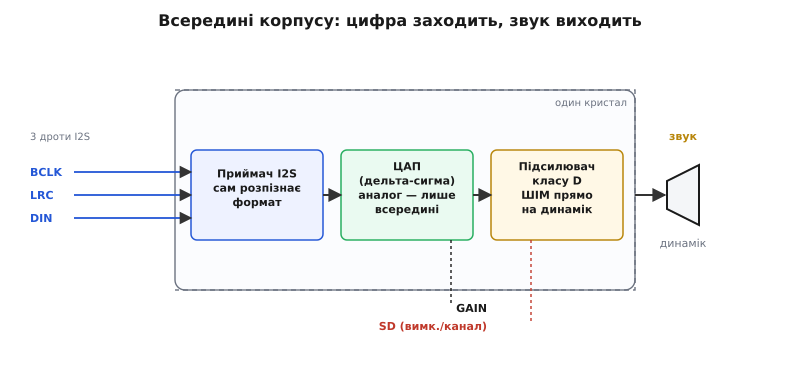
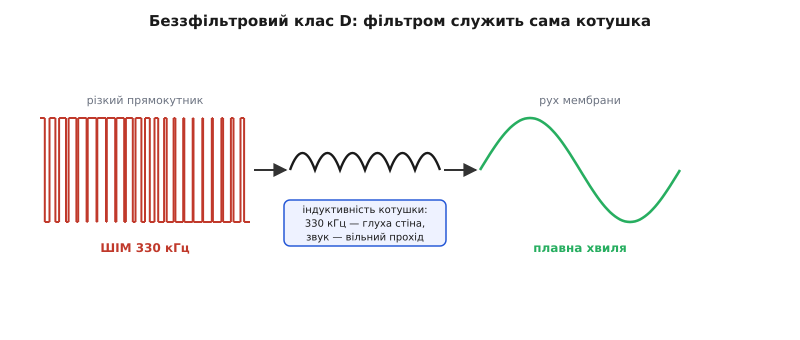

# 🔌 I2S-підсилювачі звуку: ЦАП і клас D в одному корпусі

Ми вже бачили головну дорогу відтворення: вигнати цифрові відліки з мікроконтролера по [шині I2S](topic:communications/i2s-bus) у зовнішню мікросхему, а та хай сама зробить і точний ЦАП, і підсилення. Тепер розберемо цю мікросхему як **клас** — не як конкретний партномер, а як тип пристрою, що повторюється в десятках виконань від різних виробників і поводиться однаково. Знаючи клас, ти впізнаєш будь-яке його втілення з першого погляду на розпіновку й підключиш його, не читаючи двадцять сторінок datasheet.

Річ, про яку йдеться, робить дві геть різні роботи в одному корпусі три-на-три міліметри. З одного боку вона — **цифро-аналоговий перетворювач**: бере потік чисел і відтворює з них аналогову хвилю. З іншого — **підсилювач класу D**: ту слабку хвилю розганяє до кількох ват, здатних фізично розхитати мембрану динаміка. Історично це були дві окремі мікросхеми на платі, між ними — аналоговий дріт із його наводками й втратами. Об'єднання їх в один кристал прибрало той аналоговий проміжок зовсім: цифра заходить у корпус, звук виходить із корпусу, а вся вразлива аналогова частина замкнена всередині, де її ніхто не зачепить.

## Що всередині: три блоки на шляху від числа до струму в котушці

Уяви корпус як конвеєр із трьох станцій, крізь які проходить звук.

**Перша станція — приймач I2S.** Три дроти шини заходять сюди: бітовий такт BCLK, вибір слова LRC (він же WS/LRCLK) і власне дані DIN. Приймач ловить біти в такт BCLK, за рівнем LRC розкладає їх на лівий і правий канали й збирає з них цілі відліки. Важлива деталь класу: цей приймач зазвичай **сам підлаштовується** під формат. Типова мікросхема впізнає десятки різних комбінацій співвідношення BCLK до частоти відліків і кількох поширених вирівнювань кадру (Philips-I2S, ліво- та правовирівняний, TDM) — і робить це без жодного налаштувального інтерфейсу. Тобі не треба програмувати її по I2C: подав правильний I2S — вона сама зрозуміла, з якою частотою й у якому форматі йде звук. Це головна причина, чому такий підсилювач ставлять «і забувають»: у ньому нема регістрів, які можна забути ініціалізувати.

**Друга станція — ЦАП.** Зібрані відліки перетворюються на аналоговий рівень. Усередині це майже завжди [дельта-сигма](topic:electronics/dac)-перетворювач: не драбина точних резисторів, а грубий однобітний вихід, перемиканий надшвидко, чиє *середнє* дає потрібний рівень, а шум квантування виштовхнуто вгору по частоті, геть із чутного діапазону. Але — і це ключ до всієї конструкції — цей аналоговий рівень **нікуди не виводиться назовні**. Він одразу тече в третю станцію, ще всередині кристала.

**Третя станція — підсилювач [класу D](topic:electronics/class-d-amplifier).** Він не підсилює хвилю лінійно, як старий клас AB, що гріється, розсіюючи різницю напруг на транзисторі. Клас D перетворює хвилю на **широтно-імпульсний** сигнал: прямокутник фіксованої частоти, у якому корисну амплітуду несе відношення часу «увімкнено» до «вимкнено» (шпаруватість). Вихідні транзистори тільки повністю відкриті або повністю закриті — а в цих двох станах на них майже нема втрат, тож ККД сягає 90 % і корпус лишається холодним навіть на кількох ватах. Ось чому крихітна мікросхема віддає в динамік потужність, якої лінійний підсилювач тих самих розмірів не витримав би — він би згорів від власного тепла.


*Що відбувається в корпусі. Зліва заходять три дроти I2S. Приймач збирає з них відліки й сам розпізнає формат. ЦАП робить аналог, який ніколи не залишає кристал. Підсилювач класу D перетворює його на широтно-імпульсний прямокутник і жене прямо на динамік — без вихідного фільтра. Збоку дві керувальні ніжки: GAIN задає підсилення, SD вмикає/вимикає й вибирає канал. Уся аналогова тонкість замкнена всередині; назовні — лише цифра й гучномовець.*

> 🔧 **Навіщо це.** Саме об'єднання ЦАП і підсилювача в одному корпусі робить цей клас стандартом вбудованого звуку. Тобі не треба ні розводити чутливий аналоговий дріт між двома мікросхемами, ні добирати вихідний фільтр, ні воювати з наводками на аналог. Ти лишаєшся в цифрі до самого динаміка — а це рівно те, у чому мікроконтролер сильний.

## Типова розпіновка: сім ніжок, які треба знати

У корпусу класу є багато виводів живлення й землі, але змістовних, з якими ти справді працюєш, — сім. Розберемо кожен за роллю, а не за номером (номери в різних корпусах різні; ролі однакові).

**Живлення.** `VIN` (часто підписаний VDD чи VCC) і `GND`. Клас живиться від одного джерела в широкому діапазоні — типово **від 2.7 до 5.5 В** (у деяких виконань нижня межа опускається до 2.5 В). Ця широта не випадкова: вона рівно накриває і літій-іонний акумулятор (3.0–4.2 В), і поширену цифрову шину 3.3 В, і USB-лінію 5 В. Тобто мікросхему можна живити прямо від того, що вже є на платі, без окремого регулятора під неї. Гучність кінцевого звуку прямо залежить від цієї напруги: підсилювач розгойдує динамік розмахом, не більшим за напругу живлення, тож 5 В дають відчутно голосніше, ніж 3.3 В.

**Три дроти I2S** — вхід цифрового звуку:
- `BCLK` — бітовий такт; на кожен його фронт приймач зчитує один біт даних.
- `LRC` (він же WS чи LRCLK) — вибір каналу: рівень каже, лівий зараз відлік чи правий, і перемикається з частотою дискретизації.
- `DIN` — власне послідовні дані відліків, старшим бітом уперед.

**Дві керувальні ніжки** — те, що відрізняє цей клас від «просто ЦАП із підсилювачем» і де новачки роблять найбільше помилок:
- `GAIN` — задає підсилення (наскільки гучно).
- `SD` (Shutdown/Mode) — умикає та вимикає мікросхему **і водночас** вибирає, який канал піде в динамік.

Обидві керувальні ніжки читаються не як цифровий 0/1, а **аналогово** — за напругою чи опором зовнішнього резистора. Це дуже поширений у класі прийом: одна ніжка кодує кілька режимів рівнем, замість того щоб просити окремий вивід під кожен. Розберемо обидві, бо саме тут ховаються граблі.

## Ніжка GAIN: підсилення резистором, не регістром

Підсилення тут задають не програмно, а **фізично**, ще на платі — тим, куди приєднати ніжку GAIN. Типовий клас дає п'ять фіксованих значень, і вибір між ними — це вибір з'єднання:

```
Підсилення   Як приєднати GAIN
─────────────────────────────────────────
   3 дБ       через 100 кОм на VIN
   6 дБ       прямо на VIN
   9 дБ       нікуди (лишити висіти) ← типове за замовчуванням
  12 дБ       прямо на GND
  15 дБ       через 100 кОм на GND
```

Логіка проста: усередині на ніжці стоїть слабке підтягування до середини, тож **вільна ніжка** дає середнє з п'яти значень — 9 дБ. Хочеш тихіше — тягнеш ближче до VIN; хочеш голосніше — ближче до GND; резистор проти прямого з'єднання дає проміжні щаблі. Значення в децибелах — це у скільки разів мікросхема помножить розмах хвилі: кожні +6 дБ подвоюють амплітуду.

Практична пастка тут одна, але дошкульна. **Підсилення не додає гучності «безплатно».** Якщо поставити 15 дБ і подати на вхід і без того гучний відлік, підсилювач упреться в напругу живлення — розмах хвилі не може перевищити VIN — і почне **зрізати верхівки** (кліпінг). Звук стане різким і хрипким, а не голоснішим. Тому підсилення добирають під конкретний динамік і рівень сигналу: маленькому динаміку в іграшці досить типових 9 дБ, а піднімати до 15 дБ варто, лише коли джерело справді тихе. Гучність краще регулювати цифрою (множити відліки в коді), а GAIN лишити як грубу відповідність під динамік.

> 🔧 **Навіщо це.** Ніжка GAIN — це апаратна «стеля» гучності, яку ти закладаєш один раз розведенням плати. Зрозумівши, що вона множить розмах, а стеля розмаху — це VIN, ти не потрапиш у класичну пастку «зробив голосніше резистором, а звук став гіршим»: ти вже знаєш, що за стелею живлення далі не гучніше, а брудніше.

## Ніжка SD: вимикач і вибір каналу в одному виводі

Ось найхитріша ніжка класу, і саме через неї найчастіше «нічого не грає» або «грає не той канал». Вона робить **дві речі одночасно** рівнем напруги на собі.

Перша роль — **вимикач**. Притягни SD до землі (нижче ≈ 0.16 В) — і мікросхема повністю засинає: вихід замовкає, споживання падає до мікроамперів. Це не просто «тиша» — це апаратне вимкнення підсилювача. Тому SD **обов'язково** треба кудись підтягнути, щоб мікросхема прокинулась; лишиш ніжку висіти без розуміння — і найпоширеніший симптом «підключив усе правильно, а звуку нема» саме звідси.

Друга роль умикається, коли SD **вище** порога вимкнення: тоді рівень напруги вибирає, **який канал** із I2S-потоку піде в моно-динамік. Типова для класу шкала така:

```
Напруга на SD     Режим
──────────────────────────────────────────────
  < 0.16 В         вимкнено (сон)
  0.16 … 0.77 В    (Л + П) / 2 — суміш обох каналів ← типове
  0.77 … 1.4 В     тільки правий канал
  > 1.4 В          тільки лівий канал
```

Усередині ніжка має слабке підтягування до землі (типово 100 кОм), тож щоб вивести її на потрібний рівень, ставлять **один зовнішній резистор** від SD до VIN — він разом із внутрішнім утворює [дільник напруги](topic:electronics/voltage-divider), і його номінал задає, у яке з вікон потрапить напруга. Плати-модулі зазвичай уже мають розпаяний резистор під режим «(Л+П)/2» — і це головна причина, чому «з коробки» моно-плата грає суміш обох каналів: вона їх усереднює, а не бере один.

Тут криється **найтонша пастка всього класу — вибір каналу через дільник на LRC**. Здавалося б, до чого тут LRC — це ж тактовий дріт I2S? Ось у чому фокус. Мікросхема моно: у динамік іде **один** канал. Але ти шлеш їй повний стереопотік, де лівий і правий чергуються. За рівнем LRC приймач розрізняє, чий зараз відлік. І якщо мікросхема налаштована брати, скажімо, лівий, вона фізично слухає дані **лише в ті моменти, коли LRC тримає рівень лівого каналу**. Тобто вибір «лівий/правий» насправді робиться погодженням двох речей: рівня на SD **і** того, як розкладено канали по LRC. На модульних платах це часто спрощують до одного резистора на SD; але коли підсилювачів два (один на лівий динамік, другий на правий) і обидва висять на спільній шині I2S, кожен беруть свій канал саме комбінацією SD-рівня, а розрізняє їх апаратура за LRC. Плутанина тут дає класичний симптом «обидва динаміки грають те саме» або «один мовчить» — і причина майже завжди в тому, що SD-резистор поставили не під той канал.

> 🔧 **Навіщо це.** SD — це твій апаратний вимикач звуку й водночас селектор каналу. У реальному пристрої його заводять не на резистор намертво, а на вивід мікроконтролера: тоді програма може **приглушити** підсилювач перед тим, як щось перемкнути в тракті (щоб не було клацання), і **розбудити** його лише коли є що грати — це відчутно економить батарею, бо сплячий підсилювач бере одиниці мікроамперів проти міліамперів робочих.

## Підключення до ESP32: три дроти, живлення, динамік

Тепер зберемо все докупи. Мінімальний робочий вузол — це підсилювач, [ESP32](root:embedded/esp32-family) і динамік, з'єднані так:

```
ESP32                     Підсилювач класу D
─────────                 ──────────────────
GPIO (BCLK)  ───────────► BCLK
GPIO (WS)    ───────────► LRC        три цифрові дроти I2S
GPIO (DOUT)  ───────────► DIN

3V3 або 5V   ───────────► VIN        живлення (2.7…5.5 В)
GND          ───────────► GND        спільна земля — обов'язково!

                          GAIN ──○   (вільна = 9 дБ за замовчуванням)
                          SD ──[R]── VIN   (резистор задає режим/канал)

                          OUT+ ─┐
                                 ├─ динамік 4 або 8 Ом
                          OUT− ─┘
```

Три сигнальні дроти йдуть із того самого контролера I2S ESP32, який ми налаштовували в основній статті на передачу (TX). Живлення — від будь-якої зручної шини в діапазоні класу: 3.3 В дасть тихіший звук, 5 В — голосніший. **Спільна земля між ESP32 і підсилювачем критична**: без неї сигнали I2S не мають спільної опорної точки, і навіть за правильних дротів даних приймач ловитиме сміття — ще один тихий винуватець «нічого не грає».

Динамік приєднують до диференційної пари виходів `OUT+`/`OUT−` — **двома дротами прямо**, без конденсатора між ними, без спільної землі динаміка. Це важлива риса класу D: вихід **мостовий** (BTL, bridge-tied load), тобто динамік підвішено між двома активними виходами, які гойдаються в протифазі. Такий міст дає вдвічі більший розмах на динаміку, ніж одиночний вихід від того самого живлення, і не потребує розділового конденсатора — тому маленька мікросхема від 5 В витягує кілька ват. Наслідок для монтажу: **жоден вивід динаміка не можна саджати на землю**. Хто за звичкою з аналогових підсилювачів приєднає OUT− до GND, у кращому разі не почує нічого, у гіршому — увімкне захист від короткого замикання.

Ось як міняється прив'язка ніжок у коді ESP-IDF щодо основної статті — та сама ініціалізація TX, лише GPIO підписані під підсилювач:

```c
.gpio_cfg = {
    .bclk = GPIO_NUM_26,   /* BCLK → BCLK підсилювача */
    .ws   = GPIO_NUM_25,   /* WS   → LRC  підсилювача */
    .dout = GPIO_NUM_22,   /* SD(дані) → DIN підсилювача */
    .din  = I2S_GPIO_UNUSED,   /* приймати нема чого — лише віддаємо */
},
```

Якщо SD заведено на вивід мікроконтролера (а не на резистор), додається один рядок пробудження перед відтворенням:

```c
#define AMP_SD_PIN GPIO_NUM_21

void amp_enable(bool on) {
    gpio_set_level(AMP_SD_PIN, on ? 1 : 0);  /* 1 — грати, 0 — сон */
}
```

## Перший байт: як почути, що воно живе

Найшвидший спосіб переконатися, що вузол зібрано правильно, — не одразу лити музику, а подати **найпростіший періодичний сигнал** і послухати чистий тон. Синусоїда одної частоти виявляє майже всі помилки монтажу: якщо чутно рівний тон — тракт цілий; якщо тріск, тиша чи спотворення — щось не так, і характер звуку підказує що.

```c
/* заповнити буфер синусоїдою 440 Гц (нота «ля»), стерео, 16 біт */
#include <math.h>
#define SR      44100
#define FREQ    440
#define AMPL    8000        /* нижче стелі 32767 — щоб не кліпувало */

int16_t buf[SR];            /* одна секунда моно-відліків */
for (int i = 0; i < SR; i++) {
    buf[i] = (int16_t)(AMPL * sinf(2.0f * M_PI * FREQ * i / SR));
}
/* лити в стерео-канал: дублюємо кожен відлік у ліву й праву комірку,
   тоді режим «(Л+П)/2» на SD віддасть той самий тон незалежно від каналу */
```

Розшифровка того, що почуєш:
- **Рівний чистий тон** — тракт зібрано правильно: I2S тактується, приймач упізнав формат, ЦАП і підсилювач працюють. Далі можна лити реальний звук.
- **Повна тиша** — найчастіше SD не піднято (мікросхема спить), або немає спільної землі, або динамік саджено виводом на GND. Перевіряй у цьому порядку.
- **Тон є, але хрипить і різкий** — амплітуда завелика чи GAIN зависокий: сигнал упирається в стелю живлення й зрізається. Зменш `AMPL` або підсилення.
- **Замість тону писк/шипіння на межі чутного** — майже певно переплутано вхід: у мікросхему з I2S-входом заведено PDM-потік (або навпаки). Про це — нижче.

## Беззфільтрове підсилення й чому це працює

Тепер розберемо рису класу D, яка спантеличує найдужче: **на виході стоїть прямокутний ШІМ-сигнал частотою близько 330 кГц, а не плавна хвиля, і між мікросхемою та динаміком нема жодного фільтра**. Як тоді з різкого прямокутника виходить чиста музика?

Відповідь у двох частинах. По-перше, корисний звук лежить у смузі приблизно до 20 кГц, а частота перемикання — 330 кГц, тобто **у п'ятнадцять із гаком разів вища** за все чутне. Ці два діапазони рознесені так далеко, що не заважають один одному: звук — унизу, шум перемикання — високо вгорі, поза чутним.

По-друге — і це головне — **фільтром служить сам динамік**. Котушка гучномовця має власну індуктивність, а індуктивність за фізикою чинить опір швидкій зміні струму: чим вища частота, тим важче їй пропустити струм. Для 330 кГц котушка — майже глуха стіна, тож різкі перемикання майже не доходять до мембрани. А для звукових частот її опір малий, і вони проходять вільно. Виходить, що індуктивність котушки природно згладжує ШІМ у плавний рух мембрани — робить рівно ту роботу, яку в старих класах D виконував окремий LC-фільтр із котушки та конденсатора. Крім того, і сама механічна маса мембрани не встигає відгукуватись на 330 кГц — вона фізично не може так швидко коливатись, тож додатково усереднює. Тому вихід «беззфільтровий» (filterless): фільтр не прибрали, його роль виконує навантаження задарма.


*Чому прямокутник звучить чисто. Зліва — вихід підсилювача: різкий ШІМ 330 кГц, у якому корисну хвилю несе шпаруватість. Котушка динаміка (посередині) має індуктивність: для 330 кГц це майже глуха стіна, для звуку — вільний прохід. Тому на мембрану (справа) виходить уже плавна хвиля — усереднення зробили індуктивність котушки й інертність мембрани, без жодного окремого фільтра. Спред-спектр (розмазування частоти перемикання) додатково притлумлює радіозаваду.*

Але за беззфільтровість є **ціна, і про неї треба знати**. Різкі фронти прямокутника на 330 кГц — це радіочастотні перешкоди (EMI): дроти від мікросхеми до динаміка починають працювати як маленька антена й випромінювати на цій частоті та її гармоніках. Виробники борються з цим кількома вбудованими прийомами — згладжують круті фронти (edge-rate control) і **розмазують** частоту перемикання в невелику смугу замість гострого піка (спред-спектр), щоб енергія завади не збиралась на одній частоті. Тобі як монтажнику лишається тримати **дроти до динаміка короткими й поряд** (щоб їхні поля взаємно гасились): що коротший цей відрізок, то менша антена. На макеті з довгими дротами до динаміка можна впіймати перешкоди в радіоприймачі поруч — і це не поломка, а прямий наслідок беззфільтрової архітектури.

## Захист усередині: чому корпус важко спалити

Клас має вбудовану самооборону, і знати про неї корисно — вона рятує від типових помилок макета.

**Тепловий захист.** Хоч клас D і холодний, за перевантаження (задовгий гучний сигнал на низькоомний динамік) кристал усе ж гріється. Коли температура сягає небезпечної межі, мікросхема **сама вимикається** й чекає, поки охолоне, потім вертається. Зовні це чути як «звук пропав на кілька секунд і повернувся» — не поломка, а спрацював термозахист. Причина майже завжди — або задовгий пік гучності, або динамік із меншим опором, ніж розрахунок.

**Захист від короткого й перевантаження струмом.** Якщо виходи замкнути між собою чи на землю (класична помилка — посадити OUT− на GND), мікросхема не згорає: вона розпізнає надмірний струм і вимикає вихід. Тому «підключив динамік не так — і нічого» частіше означає «спрацював захист», ніж «спалив мікросхему». Це робить клас пробачливим на макеті: помилки монтажу він переважно переживає.

**Тиша без клацань (click-and-pop).** Коли підсилювач умикається чи вимикається, на виході легко виникає стрибок напруги — вухо чує його як гучний «клац» у динаміку. Клас має схему, що згладжує ці переходи: вмикання й вимикання йдуть плавно, без стрибка. Тому SD варто вмикати завчасно й вимикати після паузи звуку — тоді перемикання беззвучне.

## Типові граблі класу — і як їх упізнати

Зведемо всі пастки, що чигають саме на цьому класі, у список за симптомом.

**Плутанина PCM-вхід проти PDM-входу.** Найкоштовніша помилка. Є два зовні схожі підкласи: один чекає на вході **I2S/PCM** (звичайні відліки, як розбирали), інший — **PDM** (однобітний потік, де амплітуду несе густина імпульсів). Ніжки в них підписані так само, корпуси однакові, але формати несумісні. Подаси PDM-потік у мікросхему з PCM-входом — почуєш різкий писк і шум замість музики, бо вона намагається читати густину імпульсів як звичайні біти відліку. Тому перед підключенням **завжди звіряй, якого входу хоче саме твоя мікросхема**, а не покладайся на схожість плат: I2S-варіант (типовий представник — MAX98357A) і PDM-варіант (наприклад, MAX98358) — рідні брати з різними ротами.

**Забута підтяжка SD.** Мікросхема спить, звуку нема. SD треба підняти вище порога вимкнення — резистором на VIN чи виводом мікроконтролера. Симптом — повна тиша за начебто правильних дротів.

**Немає спільної землі.** ESP32 і підсилювач мусять ділити GND — інакше сигнали I2S не мають спільної опори й приймач ловить сміття. Симптом — тиша або хрип за правильної решти.

**Вивід динаміка на землі.** Вихід мостовий; OUT+ і OUT− обидва активні. Саджання будь-якого з них на GND глушить звук або вмикає струмовий захист. Динамік — тільки між двома виходами, двома дротами.

**Живлення завузьке чи просіле.** Клас працює від 2.7 до 5.5 В, але на піках гучності бере пів ампера й більше. Якщо джерело кволе (тонкий USB-дріт, слабкий регулятор), напруга просідає на піках — звук хрипить, а то й мікросхема перезапускається. Живлення має тримати струм, а не лише напругу; поряд із VIN корисний конденсатор-резервуар.

**Кліпінг від зависокого GAIN чи гучного сигналу.** Розмах не може перевищити VIN; упершись у стелю, хвиля зрізається й хрипить. Не «додавай гучності» наосліп — стеля живлення далі дає бруд, не гучність.

**Термозахист приймають за поломку.** Звук пропав на секунди й вернувся — це кристал перегрівся й перечекав. Причина в перевантаженні (задовгий пік, задто низький опір динаміка), а не в браку мікросхеми.

## Варіації класу

Той самий клас приходить у кількох родинних виконаннях, і корисно бачити всю сім'ю, щоб брати потрібне:

- **За форматом входу** — **PCM/I2S-варіант** (головний, розбирали) і **PDM-варіант** (той самий підсилювач класу D, але з однобітним входом; беруть, коли джерело віддає PDM, а не I2S). Це найважливіша розвилка — переплутати не можна.
- **За фіксацією підсилення** — виконання, де GAIN задають резистором (гнучко, розбирали), і простіші, де підсилення жорстко зашите й ніжки GAIN просто нема.
- **За звучанням класу D** — крім беззфільтрового спред-спектру є виконання з традиційним ШІМ під зовнішній LC-фільтр (краще для аудіофільського тракту, але дорожче на компоненти); для вбудованого пристрою беззфільтровий майже завжди достатній.
- **За каналами** — моно (один динамік, розбирали) і стерео/двоканальні в одному корпусі; для двох динаміків часто простіше поставити два моно-корпуси й розвести їм канали SD-резисторами.

Спільне в усій сім'ї — одне: **цифра заходить, звук виходить, аналог замкнено всередині**. Впізнавши цей клас по трьох дротах I2S, двох керувальних ніжках і диференційному виході на динамік, ти підключиш будь-яке його виконання від будь-якого виробника, бо принцип під усіма ними той самий.
