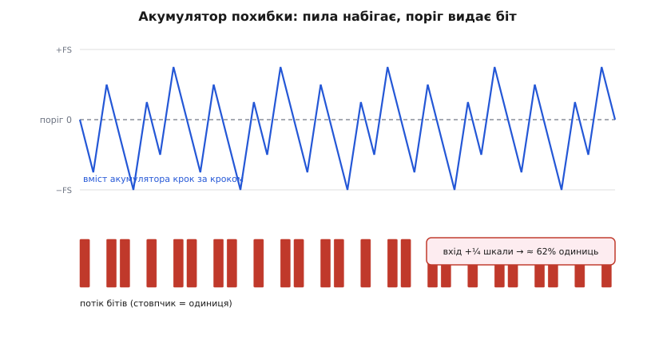

# ⚙️ Однобітний кодер: PCM→PDM формувачем першого порядку на C

Дивовижну річ ми вже вивели: **один біт** плюс передискретизування плюс формування шуму дають у звуковій смузі чистоту 16-бітного ЦАП. Вивели — але на словах і формулах. А тепер зробимо це руками: напишемо найпростіший формувач, який справді перетворює 16-бітні відліки на однобітний потік, і подивимося на самі біти, що з нього течуть. Це рівно те, що контролер I2S ESP32 у режимі PDM TX робить апаратно — тільки він робить це надшвидко й зашито в кремнію, а ми зробимо повільно й на очах, щоб побачити механізм зсередини.

Мета не в тому, щоб замінити апаратний модулятор своїм кодом — апаратний і швидший, і кращий (у ньому формувач другого порядку). Мета — **зрозуміти**, як з одного біта народжується плавна хвиля, побачити акумулятор похибки в дії, обмацати всі межові випадки, на яких наївний кодер ламається, і на власні очі переконатися, що RC-коло на виході справді усереднює цей потік назад у синус. Хто написав такий кодер сам, той уже ніколи не сприйматиме PDM як магію — він бачитиме за ним просту петлю зворотного зв'язку.

## Задача: з 16 біт зробити 1, не втративши хвилю

Сформулюймо чітко, що нам треба, і в чому підступ.

На вході — потік 16-бітних знакових відліків, звичайний PCM, той самий, що ми ллємо в I2S. На виході — потік **окремих бітів**: на кожен крок або `1`, або `0`, і більше нічого проміжного. І ось у чому вся сіль: цей однобітний потік мусить нести ту саму хвилю, що й 16-бітний вхід, — так, щоб коли ми його усередимо (прогонимо через фільтр низьких частот), назад вийшов той самий синус, лише трохи зашумлений угорі.

Здавалося б, це неможливо. Як `1` і `0` можуть зобразити 65536 різних рівнів? Відповідь, яку ми вивели в детальному кроці, — **не миттєвим рівнем, а середнім за багато бітів**. Один біт не несе рівня; його несе **густота** одиниць на відрізку. Хочемо на виході 75 % від максимуму — ставимо три одиниці на кожен нуль. Хочемо 50 % — рівно через одну. Хочемо тихий рівень трохи вище нуля — зрідка вкидаємо поодиноку одиницю в море нулів. Тому й потрібне передискретизування: щоб на кожен звуковий відлік припадало **багато** бітів, і в цій купі бітів було де закодувати густину.

> 🔧 **Навіщо це.** Один дріт замість шістнадцяти паралельних ліній даних — ось що купує ця схема. І не лише в PDM-виході: рівно той самий формувач стоїть усередині кожного MEMS-мікрофона й кожного сучасного аудіо-ЦАП. Написавши його самотужки бодай раз, ти читатимеш рядок «PDM, 1-bit, 3.072 MHz» у будь-якому datasheet не як загадку, а як знайому петлю з акумулятором, поріг і зворотний зв'язок.

Домовмося про дві величини, бо на них тримається все:

- **Коефіцієнт передискретизації** (англ. *oversampling ratio*, OSR) — скільки вихідних бітів припадає на один вхідний PCM-відлік. Візьмемо для наочності OSR = 32: кожен 16-бітний відлік розтягнеться на 32 біти потоку.
- **Розмах**. Вхід — знаковий `int16_t`, гуляє в [−32768, +32767]. Вихід — біт, що представляє два фізичні рівні: `1` — «повний плюс», `0` — «повний мінус». Тобто наш однобітний ЦАП уміє видати лише або +повну шкалу, або −повну шкалу, а все проміжне — тільки як середнє.

Тепер — центральне питання: як, маючи право поставити лише крайній `+` або крайній `−`, зробити так, щоб середнє точно збіглося з тихим проміжним рівнем? Тут і вступає ідея формувача.

## Ідея: акумулятор, що не дає похибці накопичитися

Уся хитрість — в одному цілому числі, яке зветься **акумулятор похибки** (англ. *error accumulator*). Це пам'ять формувача про його власні гріхи.

Думка така. На кожному кроці ми зобов'язані видати або `+повну`, або `−повну` — проміжного нема. Майже завжди це **неправильно**: якщо треба, скажімо, рівень +100 (тихий плюс), а ми видали +32767 (повний плюс), то переборщили на 32667. Наївний кодер на цьому й зупинився б і на наступному кроці знову видав би повний плюс — і знову переборщив. Формувач натомість **пам'ятає** цей перебір: він додає похибку кожного кроку до акумулятора, а на наступному кроці враховує накопичене. Схема ніби веде рахунок: «цього разу я дав забагато на 32667 — запишу цей борг; наступного разу, коли борг набіжить у мінус, видам мінус, щоб у *середньому* вийшло точно +100».

Розгорнімо це в точний алгоритм. На кожному кроці:

1. **Додаємо вхід до акумулятора.** Акумулятор тепер тримає суму всього, що ми «винні» видати.
2. **Порівнюємо акумулятор з порогом** (нулем). Якщо акумулятор ≥ 0 — сигнал вимагає плюса, тож видаємо біт `1` (і подумки виставляємо +повну шкалу). Якщо < 0 — видаємо `0` (−повну шкалу).
3. **Віднімаємо з акумулятора те, що фактично видали.** Видали +повну — віднімаємо +повну; видали −повну — віднімаємо −повну (тобто додаємо повну). У акумуляторі лишається **похибка** — різниця між тим, що просили, і тим, що дали. Вона й переходить у наступний крок.

Ось і весь формувач першого порядку: **один суматор на вході, один поріг-компаратор, один зворотний зв'язок від виходу назад в акумулятор**. Кроки 1 і 3 разом означають: `акумулятор += вхід − вихід`. Похибка не зникає — вона накопичується й на наступних кроках змушує вихід хитнутися в протилежний бік, щоб середнє зійшлося. Саме тому це «формувач», а не просто квантувач: він активно жене свою похибку в майбутнє й там її гасить.

Чому це те саме, що дельта-сигма з детального кроку? Бо крок 1 (накопичення) — це і є **інтегратор** (сигма, сума), а крок 3 (віднімання виходу) — це **різниця** входу й виходу (дельта). Інтегратор різниці — звідси й назва «дельта-сигма», яку [1962 року дали Іносе, Ясуда й Муракамі](root:embedded/audio-playback-path/hist-i2s-origins.md). Ми щойно виписали найпростіший, першого порядку, варіант їхньої схеми — з єдиним інтегратором.


*Акумулятор у дії під сталим входом на чверть шкали. Синя лінія — вміст акумулятора крок за кроком: вхід щоразу підштовхує його вгору, а щойно він дійшов до порога (пунктир посередині) чи вище, формувач видає одиницю й віднімає повну шкалу — акумулятор **зривається вниз**; далі знову набіг. Червоні стовпчики внизу — самі біти. Що вищий вхід, то частіше акумулятор дотягується до порога, то густіші одиниці — рівно як вимагає модуляція густотою. Похибка ніколи не тікає: зворотний зв'язок щоразу зрізає її назад до порога.*

## Код: формувач у двадцять рядків

Тепер запишемо це на C — реальному, який компілюється й крутиться на ESP32. Почнемо зі стану. Уся пам'ять формувача — **одне число**, акумулятор:

```c
#include <stdint.h>
#include <stdbool.h>

// Стан формувача першого порядку. Уся пам'ять — один акумулятор похибки.
// int32_t, а не int16_t: акумулятор під час роботи вилітає далеко за 16 біт
// (складаємо вхід і повну шкалу), тож треба запас — про це в пастках.
typedef struct {
    int32_t accum;   // акумулятор похибки
} pdm_state;
```

Тепер серце — крок формувача, що бере один 16-бітний відлік і повертає один біт:

```c
// Повна шкала однобітного виходу. Біт 1 = +FS, біт 0 = −FS.
#define PDM_FS  32768        // = 2^15, зручний рівень «повного плюса/мінуса»

// Один крок формувача: з'їдає відлік, випльовує один біт.
// Оновлює accum так, щоб похибка перейшла в наступний крок.
static inline bool pdm_step(pdm_state *s, int16_t sample) {
    // крок 1: додаємо вхід до акумулятора похибки
    s->accum += sample;

    // крок 2: поріг — нуль. accum >= 0 → видаємо +повну шкалу (біт 1),
    //         інакше → −повну шкалу (біт 0).
    bool bit;
    int32_t out;
    if (s->accum >= 0) {
        bit = true;
        out = +PDM_FS;
    } else {
        bit = false;
        out = -PDM_FS;
    }

    // крок 3: віднімаємо фактично виданий рівень — у accum лишається похибка,
    //         яка й перенесеться в наступний крок (це і є зворотний зв'язок).
    s->accum -= out;

    return bit;
}
```

Це весь формувач. Дивись, наскільки він голий: **додати вхід, глянути на знак, відняти вихід**. Ніяких таблиць, ніякого множення, жодної плаваючої коми — три цілочислові операції на біт. Саме тому такий модулятор летить на найдрібнішому залізі, а в кремнію ESP32 він узагалі виконується за один такт на біт.

Тепер обгортка, що перетворює **потік PCM-відліків на потік бітів**, ураховуючи передискретизування. Щоб на кожен вхідний відлік вийшло OSR бітів, ми повторюємо кожен відлік OSR разів (найпростіше — утримання нульового порядку) і проганяємо через формувач:

```c
#define OSR  32              // бітів PDM на один PCM-відлік

// Перетворює count відліків PCM у count*OSR бітів, спакованих по 8 у байт.
// out мусить мати щонайменше count*OSR/8 байтів.
// Стан s зберігається МІЖ викликами — потік можна гнати частинами.
void pcm_to_pdm(pdm_state *s, const int16_t *in, uint8_t *out, int count) {
    int bit_pos = 0;                 // позиція біта в поточному байті (0..7)
    uint8_t acc = 0;                 // збираємо 8 бітів, тоді пишемо байт

    for (int i = 0; i < count; i++) {
        int16_t sample = in[i];
        // передискретизування: той самий відлік OSR разів у формувач
        for (int k = 0; k < OSR; k++) {
            bool bit = pdm_step(s, sample);
            acc = (uint8_t)((acc << 1) | (bit ? 1 : 0));   // MSB першим
            if (++bit_pos == 8) {
                *out++ = acc;
                acc = 0;
                bit_pos = 0;
            }
        }
    }
    // якщо назбирали неповний байт — добиваємо (у бойовому коді краще
    // тримати count*OSR кратним 8, щоб хвіст не рвав потік)
    if (bit_pos != 0) {
        acc <<= (8 - bit_pos);
        *out++ = acc;
    }
}
```

Дві дрібниці варто помітити одразу. По-перше, ми пакуємо біти в байти **старшим уперед** (`MSB first`) — так їх чекає більшість апаратури, що потім виштовхує потік у дріт; переплутаєш порядок — і потік вийде дзеркальним усередині кожного байта, а вухо почує шум. По-друге, стан `s` **живе між викликами**: акумулятор не можна занулювати на межі блоку, бо його недовидана похибка — це частина сигналу; занулиш — і на кожному стику блоку буде мікроклац. Той самий принцип безперервного стану, що і в [сусідньому ADPCM-кодеку](root:embedded/audio-compression-mcu/proj-adpcm-codec.md): пам'ять кодека тече крізь блоки, а не рветься на них.

Ось як цим користуватися в зв'язці з реальним виходом. Найчастіше свій софтовий формувач **не** потрібен — його заступає апаратний PDM TX; але коли виходу PDM у чипі немає (скажімо, на дрібному МК без такого режиму), а віддати однобітний потік треба, цей код гонить його, наприклад, через SPI-передавач або звичайний GPIO у таймерному перериванні:

```c
#define FRAME 256                        // PCM-відліків у кадрі
int16_t pcm[FRAME];                      // свіжі відліки (WAV, тон, радіо…)
uint8_t pdm[FRAME * OSR / 8];            // спакований однобітний потік

void play_block(void) {
    static pdm_state st = { .accum = 0 };   // стан ЖИВЕ між блоками — static!

    // ... сюди джерело поклало FRAME відліків у pcm ...

    pcm_to_pdm(&st, pcm, pdm, FRAME);       // 256 відліків → 1024 байти потоку
    // pdm тепер виштовхуємо в дріт: SPI, I2S-DMA чи біт-бенг у таймері.
    // Далі — обов'язкове усереднення на виході (RC або PDM-підсилювач).
}
```

## Пастки: чотири місця, де наївний кодер ламається

Формувач короткий, але майже кожен рядок ховає межовий випадок, на якому саморобний PDM тихо псує звук. Розберімо чотири — усі ми вже мигцем зачепили, тепер притиснемо кожен до стіни.

### Пастка перша: насичення акумулятора й переповнення

Це найпідступніше, бо код працює тижнями, а потім на гучному піку раптом хрипить. Погляньмо, куди насправді залазить акумулятор.

Найгірший випадок — сталий вхід на самій межі шкали, +32767, і формувач раз за разом видає +повну (+32768). Тоді на кроці `accum += sample` акумулятор росте, а `accum -= out` віднімає майже стільки ж, і в рівновазі акумулятор коливається біля невеликого значення. Але **на перехідних процесах** — коли вхід різко стрибнув з −32768 на +32767 — акумулятор за один крок може підскочити на суму, більшу за весь 16-бітний розмах. Порахуймо межу:

```
Найгірший набіг: вхід і виданий рівень тимчасово тягнуть у різні боки.
  accum += 32767   (вхід — повний плюс)
  accum -= (−32768) (а виданий біт був 0, тобто −повна шкала)
  → за один крок accum може підскочити на  32767 + 32768 = 65535
```

Один крок здатен зсунути акумулятор на цілих 65535 — це вже за межею `int16_t` (−32768…32767). Якби ми тримали `accum` у `int16_t`, він би [тихо завернувся через переповнення](topic:programming/overflow-wraparound): підскочив за 32767 і виринув від'ємним. А для формувача це катастрофа — акумулятор **і є** його пам'ять про похибку; спотвориш його раз, і зворотний зв'язок збожеволіє: замість гасити похибку він її роздує, і на виході замість тихого хрипу піде гучний тріск. Тому `accum` **обов'язково** тримають у `int32_t` (запасу до ±2 мільярдів вистачає з головою), а на дуже довгих сталих ділянках — ще й **обмежують** його розумною стелею, щоб він не накопичив занадто великий борг, який потім довго віддаватиметься:

```c
// захист від залипання акумулятора на патологічному вході:
// не даємо боргу перевалити за кілька повних шкал.
#define ACC_LIMIT  (4 * PDM_FS)
if (s->accum >  ACC_LIMIT) s->accum =  ACC_LIMIT;
if (s->accum < -ACC_LIMIT) s->accum = -ACC_LIMIT;
```

Це обмеження ставлять **після** віднімання виходу, у самому кінці `pdm_step`. Формувач першого порядку рідко потребує його на музиці, але на синтетичних сигналах (довга сталість упритул до шкали) без нього акумулятор може набрати борг, який потім віддає десятками зайвих однакових бітів — чутно як короткий «зрив». Це та сама дисципліна, що й обрізання `predict` у сусідньому ADPCM: у обох кодеках внутрішній стан має право тимчасово вилітати за розрядність корисного числа, і його треба **свідомо** тримати в шорах.

### Пастка друга: постійна складова й нульовий поріг

Друга пастка любить того, хто «оптимізує» поріг. Спокуса така: «навіщо порівнювати з нулем окремо — хай `bit = accum >= 0`, і взагалі, чому б не зсунути поріг для симетрії». Розберімо, чому поріг мусить бути саме нулем і чому постійна складова (англ. *DC offset*) на вході — окрема біда.

Пригадаймо з детального кроку: **різкий стрибок рівня на виході = широкий сплеск високих частот = клац**. Формувач видає рівний потік бітів, лише поки середнє входу стабільне. Але якщо у вхідних відліках сидить постійне зміщення — вони крутяться не навколо нуля, а навколо, скажімо, +2000, — то й потік бітів матиме постійний перекіс: одиниць стабільно більше, ніж нулів. Само по собі це не страшно (це просто сталий рівень на виході), **поки** зміщення не змінюється. Але на увімкненні, коли акумулятор стартує з нуля, а вхід одразу приходить зі зміщенням +2000, формувачу треба кілька кроків, щоб «розігнатися» до правильної густини, — і цей перехідний процес чутно як тихий стук на початку кожного відтворення.

Ліки — **центрувати вхід на нулі** ще до формувача. Якщо джерело дає зміщений сигнал (типово — з АЦП, чий нуль сидить на середині шкали живлення), відніми зміщення першим ділом:

```c
// прибрати сталу складову перед формувачем: інакше — стук на старті
// й марна витрата динамічного діапазону на зміщення.
static inline int16_t remove_dc(int16_t x, int16_t dc_offset) {
    int32_t centered = (int32_t)x - dc_offset;
    if (centered >  32767) centered =  32767;   // не даємо вилетіти за int16
    if (centered < -32768) centered = -32768;
    return (int16_t)centered;
}
```

А чому саме **нуль** — правильний поріг? Бо `+PDM_FS` і `−PDM_FS` симетричні навколо нуля, і тільки при нульовому порозі середнє потоку від нульового входу дорівнює нулю (рівно половина одиниць, половина нулів). Зсунеш поріг — і навіть тиша (вхід 0) дасть перекошений потік, тобто формувач **сам** внесе постійну складову, якої в сигналі не було. Нульовий поріг для симетричного виходу — не випадковість, а умова того, щоб тиша лишалася тишею.

### Пастка третя: повний і нульовий рівень — межі, на яких потік вироджується

Третя пастка — межові рівні входу, і вона показова, бо на ній видно **фізичну межу** однобітного кодування.

Спитаймо: що видасть формувач на трьох особливих входах — повний плюс, повний мінус і рівний нуль?

**Сталий нуль (тиша).** Вхід 0, поріг 0. Простежимо акумулятор: `accum += 0` (не змінився), `accum >= 0` — умова `>= 0` істинна навіть при рівному нулі, тож видаємо `1`, потім `accum -= +PDM_FS` (акумулятор став −32768). Наступний крок: `accum += 0`, тепер `accum < 0`, видаємо `0`, `accum -= −PDM_FS` (повернувся до 0). І так по колу: `1, 0, 1, 0, 1, 0…` — рівно **половина** одиниць. Середнє = нуль. Тиша на вході дала чергування на виході, а його середнє — точний нуль. Добре.

**Повний плюс (+32767).** Акумулятор набирає по +32767 щокроку, поріг перетинає майже завжди, видає майже суцільні одиниці. Але не **зовсім** суцільні: `PDM_FS` = 32768, а вхід 32767 — на одиницю менший, тож раз на 32768 кроків акумулятор не дотягне до порога й прослизне один нуль. Тобто **навіть на максимумі потік не стає суцільними одиницями** — завжди лишається крихітна щілина. Це не дефект, а межа: однобітний вихід у принципі не може представити рівень **вище** ніж «майже всі одиниці», і найгучніший можливий сигнал уже майже впритул до цієї стелі.

**Повний мінус (−32768).** Дзеркально: майже суцільні нулі, і оскільки −32768 точно дорівнює −`PDM_FS`, тут потік стає **рівно** суцільними нулями. Асиметрія на один крок між плюсовою й мінусовою межами — прямий наслідок того, що знаковий діапазон `int16_t` несиметричний: мінус дотягує до −32768, а плюс лише до +32767.

> 🔧 **Навіщо це.** Ці три межі — твій тестовий набір. Запусти формувач на сталому нулі й перевір, що вийшло чисте `101010…`; на повному плюсі — майже суцільні одиниці з рідкими нулями; на повному мінусі — суцільні нулі. Якщо на нулі потік перекошений, а не 50/50 — у тебе зсунутий поріг або постійна складова. Якщо на межах він завертається в протилежний бік — переповнення акумулятора. Три однорядкові тести ловлять усі три перші пастки одразу.

### Пастка четверта: чому порядок формувача важить, і що дає лише перший

Остання й найважливіша для розуміння пастка — не помилка коду, а межа самого підходу. Наш формувач — **першого порядку** (один інтегратор). Апаратний у ESP32 — другого. Різниця не косметична, і варто ясно бачити, чого перший порядок **не** може.

Пригадаймо число з детального кроку: кожне подвоєння OSR (октава) дає виграш чистоти, і він залежить від порядку формувача:

```
Голе передискретизування (0-й порядок):  +3 дБ / октаву  (½ біта)
Формувач 1-го порядку:                    +9 дБ / октаву  (1½ біта)
Формувач 2-го порядку:                   +15 дБ / октаву  (2½ біта)
```

Наш першопорядковий кодер при OSR = 32 (п'ять октав над звуковою смугою) купує:

```
Виграш 1-го порядку:  5 октав · 9 дБ/октаву = 45 дБ
  над однобітною стелею → ефективно ≈ 7–8 біт чистоти в смузі звуку
```

Сорок п'ять децибелів — це рівень десь між 7 і 8 бітами. Для біпа, індикації, простого голосу — цілком; для музики — замало. Щоб першим порядком дотягтися до 16-бітної чистоти, бракує ще близько 50 дБ, а перший порядок дає лише 9 дБ на октаву — тобто треба ще майже шість октав передискретизування понад наші п'ять (OSR у півтори тисячі разів більший). Це вже десятки мегагерців заради простого голосу — невигідно; далі чистоту дешевше купувати не швидкістю, а **порядком** формувача.

**Що дає перехід на другий порядок.** Другий інтегратор додає ще +6 дБ на октаву — і при тому самому OSR = 32 виходить 5·15 = 75 дБ, ефективні ≈ 12 біт. А при OSR = 64 (як у справжнього PDM на 3.072 МГц) — 6·15 = 90 дБ, ті самі 16 біт, що ми виводили в детальному кроці. **Ось чому апаратура другого порядку, а наш навчальний кодер — першого**: другий порядок круто завалює шум у звуковій смузі, першому це не під силу без нереального передискретизування.

Чому ж ми не пишемо одразу другий порядок? Бо він **може стати нестійким**: два інтегратори в петлі зі зворотним зв'язком за певних вхідних рівнів починають самозбуджуватися — акумулятори розганяються в нескінченність, і потік перетворюється на гучний шум незалежно від входу. Приборкати це можна (масштабуванням коефіцієнтів, обмеженням акумуляторів), але це вже не двадцять прозорих рядків, а тонке налаштування петлі, за яке беруться, коли справді треба. Перший порядок натомість **безумовно стійкий**: один інтегратор не має як розгойдатися, тож він завжди дає осмислений потік, хай і скромної чистоти. Для навчання й для простих сигналів це рівно те, що треба; за якістю — переходь на апаратний PDM TX, де другий порядок уже приборкано інженерами Espressif.

## Перевірка: як RC-коло повертає хвилю

Лишилося переконатися на власні очі, що весь цей потік одиниць і нулів справді усередниться назад у синус. Найпростіший усереднювач — [RC-фільтр низьких частот](topic:electronics/rc-filter): резистор і конденсатор. Він робить рівно те, що обіцяно: пропускає повільну (звукову) складову густини й притлумлює швидкі перемикання біта.

Змоделюймо його прямо в коді — одним рядком на біт, тим самим цілочисловим стилем, — щоб побачити відновлену хвилю числами, не паяючи нічого. Однополюсний RC у дискретному вигляді — це просте згладжування: нове значення = старе плюс мала частка різниці між входом і старим:

```c
// Модель однополюсного RC-фільтра (усереднювача PDM назад в аналог).
// out += (in − out) >> SHIFT;  чим більший SHIFT, тим сильніше згладжування
// (нижча частота зрізу — грубіше усереднення, чистіший, але млявіший вихід).
#define RC_SHIFT  5

static inline int32_t rc_average(int32_t *y, bool bit) {
    int32_t in = bit ? +PDM_FS : -PDM_FS;   // біт → фізичний рівень
    *y += (in - *y) >> RC_SHIFT;             // згладжуємо
    return *y;                                // відновлений «аналог»
}
```

Проженемо весь ланцюг разом — синус на вході, формувач, RC на виході — і подивимося, чи вийшов синус:

```c
#include <math.h>        // sin() лише для згенерувати тестовий синус

// Демонстрація повного тракту: PCM-синус → PDM-біти → RC → назад у рівень.
void demo_roundtrip(void) {
    pdm_state  mod = { .accum = 0 };
    int32_t    rc  = 0;                    // стан RC-фільтра

    const int FREQ_STEPS = 64;            // відліків на період синуса
    for (int n = 0; n < FREQ_STEPS * 8; n++) {   // вісім періодів
        // згенерувати вхідний відлік синуса на чверть шкали
        int16_t sample = (int16_t)(8000.0 * sin(2.0 * 3.14159 * n / FREQ_STEPS));

        int32_t restored = 0;
        for (int k = 0; k < OSR; k++) {   // OSR бітів на відлік
            bool bit = pdm_step(&mod, sample);
            restored = rc_average(&rc, bit);   // усереднюємо кожен біт
        }
        // restored тепер ≈ sample (той самий синус, трохи зашумлений і
        // зсунутий по фазі — RC завжди трохи запізнюється). Роздрукуй пари
        // (sample, restored) — і побачиш, як однобітний потік відтворив хвилю.
    }
}
```

Що ти побачиш, роздрукувавши пари `(sample, restored)`: `restored` йтиме тим самим синусом, що й `sample`, — трохи менший за амплітудою, трохи зсунутий по фазі (RC завжди відстає — це його плата за згладжування) і з дрібним тремтінням угорі (недодавлений шум квантування). Але це **упізнаваний синус**, відновлений з потоку, у якому не було жодного проміжного рівня — самі `1` і `0`. Ось наочний доказ того, що весь час твердив детальний крок: густота бітів несе амплітуду, а усереднення її виймає.

І тут же видно компроміс `RC_SHIFT`. Збільшиш його (сильніше згладжування, нижча частота зрізу) — вихід чистіший, шуму менше, але й високі частоти звуку приглушаться, а фазове відставання виросте. Зменшиш — вихід жвавіший, але в ньому лишиться більше ультразвукового бруду. Це рівно той самий грубий компроміс, що робить фізичне RC-коло на реальному виході, і рівно тому для музики беруть не RC, а [PDM-підсилювач](root:embedded/audio-playback-path/comp-i2s-audio-amp.md) з якісним цифровим фільтром: RC — це «бікнути», гострий фільтр — це «грати».

## Нитка докупи

Ми написали найпростіший PCM→PDM-кодер, який справді працює: **один акумулятор похибки, поріг на нулі, зворотний зв'язок від виходу**. Три цілочислові операції на біт перетворюють 16-бітний відлік на потік одиниць і нулів, у якому амплітуду несе не рівень, а густота, — і RC-усереднення виймає цю амплітуду назад у хвилю. Це буквально те, що апаратний PDM TX ESP32 робить у кремнію, лише швидше й формувачем вищого порядку.

Чотири пастки, що ми обмацали, зводяться до однієї думки, як і в сусіднього ADPCM: **внутрішній стан кодека священний**. Акумулятор має право тимчасово вилітати за 16 біт (тримай його в `int32_t` і обмежуй) — але спотвориш його переповненням, зсунеш поріг чи внесеш постійну складову, і зворотний зв'язок з рятівника перетвориться на руйнівника. А межа першого порядку — чесні ≈ 7–8 біт при скромному OSR — не хиба коду, а фізика: круту чистоту дає лише другий порядок, який складніше приборкати й тому лишають апаратурі.

Найголовніше, що лишається в руках, — це вже **не магія**. PDM у datasheet, однобітний мікрофон, дельта-сигма всередині ЦАП — за всім цим тепер стоїть та сама коротка петля, яку ти щойно написав і прогнав на очах. А коли механізм видно наскрізь, підключити чи налагодити реальний PDM-тракт стає питанням акуратності, а не удачі.
