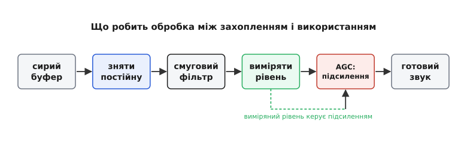
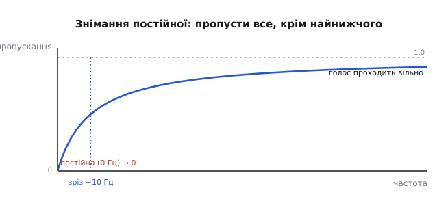
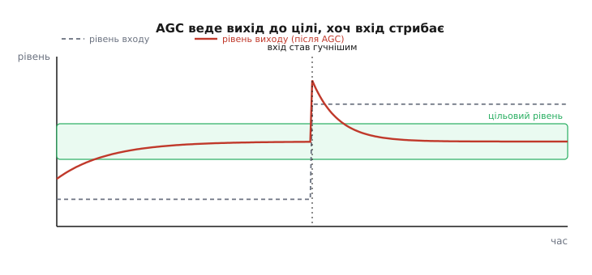

# Обробка на МК: фільтрація, рівень, AGC

У попередньому кроці ми довели звук до буфера: [мікрофон віддав відліки, шина I2S принесла їх у пам'ять](root:embedded/audio-capture-pipeline), і в масиві `int16_t buf[N]` лежить свіжий шматок запису. Здавалося б, звук уже є — бери й відправляй далі. Але якщо цей масив без жодної обробки віддати в динамік чи в детектор голосу, виявиться прикре: у слухавці гуде, тиха розмова ледь чутна, а різкий крик б'є по вухах і хрипить. Сирий буфер — це ще не «звук, з яким можна працювати». Між захопленням і використанням майже завжди стоїть тонкий, але важливий шар — **обробка** (англ. *processing*): кілька дешевих операцій, що прибирають сміття, підрізають зайві частоти й вирівнюють гучність. Розберімо три головні, без яких не обходиться майже жоден звуковий пристрій: **знімання постійної складової**, **смугову фільтрацію** й **автоматичне регулювання підсилення** (AGC).

Спершу подивімося, звідки взагалі береться потреба. Мікрофон і тракт до буфера — не ідеальні. По-перше, у сигналі майже завжди сидить **постійне зміщення** (англ. *DC offset*): весь звук піднятий на сталу величину, наче нуль лінії з'їхав убік. По-друге, у буфер разом з голосом заходить **шум** — шипіння самого давача, наводки, низькочастотний гул від вібрацій і живлення. По-третє, гучність джерела **гуляє**: людина то шепоче, то кричить, то відходить від мікрофона. Кожну з цих трьох бід лікує окрема операція, і ставлять їх у певному порядку — саме той порядок і є конвеєр обробки.


*Сирий буфер проходить кілька дешевих кроків; вимірювання рівня замикається назад на регулятор підсилення — це і є суть AGC.*

## Знімання постійної: пропусти все, крім найнижчого

Постійне зміщення — це найпідступніша дрібниця. Око його в буфері не бачить: числа як числа. Але воно шкодить одразу двома шляхами. Якщо потім рахувати гучність, зміщення штучно роздуває результат — тихий сигнал здається гучним лише тому, що весь піднятий над нулем. А якщо звук піде в динамік класу D, стала складова змусить котушку постійно тягнути в один бік, гріти підсилювач і красти запас гучності. Тому **перше**, що роблять із сирим буфером, — знімають постійну.

Думка проста, якщо глянути на постійну складову правильно: **стала — це частота нуль**. Звук — це коливання; постійне зміщення не коливається зовсім, тобто його «частота» дорівнює 0 Гц. А отже, прибрати його — це просто **не пропустити найнижчу частоту**, лишивши все інше. Саме це робить [високочастотний фільтр](topic:com-signal/band-filters) із дуже низьким зрізом.

> Смугові фільтри мають чотири канонічні форми: низькочастотний (пропускає низи, ріже верхи), високочастотний (навпаки), смуговий (пропускає лише вузьку смугу) і режекторний (вирізає вузьку смугу). Усі чотири реалізує той самий апарат — різниця лише в коефіцієнтах. Тут потрібна форма високочастотна, бо зрізати треба саме найнижче, коло нуля.


*Постійна складова (0 Гц) придушується до нуля; усе вище зрізу — а голос починається від сотні герц — проходить майже без втрат.*

Для знімання постійної не потрібен гострий фільтр — досить найдешевшого, **однополюсного**. Його ідея — тримати повільну оцінку середнього рівня й **віднімати** її від сигналу. Середнє змінюється так мляво, що встигає стежити лише за постійним зміщенням, а справжній голос лишається недоторканим. Оцінку середнього рахують [експоненційним згладжуванням](topic:com-signal/ema) — одним множенням на відлік.

> [EMA](topic:com-signal/ema) тримає одну згладжену оцінку й на кожному кроці легенько підштовхує її до свіжого відліку: `avg += α·(x − avg)`. Мала α (близько 0.001) робить оцінку дуже повільною — саме такою, щоб вона відстежувала лише постійну складову, а не сам звук.

Ось як це виглядає в прошивці. Оцінку тримаємо в 32-бітному числі, щоб не втратити точність на малій α:

**Знімання постійної однополюсним фільтром**
```c
// Стан фільтра живе між викликами (статичний або поле структури).
static int32_t dc_avg = 0;   // повільна оцінка постійної складової, Q16

void dc_block(int16_t *buf, int n) {
    for (int i = 0; i < n; i++) {
        int32_t x = (int32_t)buf[i] << 16;      // перевід у Q16
        dc_avg += (x - dc_avg) >> 10;           // α ≈ 1/1024 ≈ 0.001
        int32_t y = (x - dc_avg) >> 16;         // прибрали постійну
        if (y >  32767) y =  32767;             // насичення, а не переповнення
        if (y < -32768) y = -32768;
        buf[i] = (int16_t)y;
    }
}
```

Тут `>> 10` — це множення на 1/1024: дешевий зсув замість ділення. Стан `dc_avg` **обов'язково** зберігається між буферами, інакше фільтр щоразу починав би з нуля й на початку кожного буфера пропускав клацання. І зверніть увагу на насичення (англ. *clipping*, «обрізання»): якщо результат виліз за межі 16 бітів, ми **притискаємо** його до краю, а не даємо переповнитися — інакше замість гучного звуку отримали б стрибок з плюса в мінус, тобто гучний тріск.

> 🔧 **Навіщо це.** Цифрові MEMS-мікрофони через шину I2S майже завжди віддають сигнал із власним постійним зміщенням, до того ж воно ще й повзе з температурою. Однополюсний фільтр із зрізом близько 5–20 Гц — стандартний перший каскад у будь-якому звуковому тракті на МК: він коштує одне множення на відлік і рятує все, що йде далі, від фальшивої гучності й перегріву підсилювача.

## Смугова фільтрація: лишити те, що несе зміст

Постійну зняли — але в буфері досі більше, ніж треба. Людський голос живе приблизно між 100 Гц і 4 кГц; для розбірливого мовлення досить навіть смуги телефонної якості, 300–3400 Гц. Усе, що поза цією смугою, — переважно шкода: низькочастотний гул від вентиляторів і рук, високочастотне шипіння давача, наводки. Якщо звук іде в детектор голосу чи в стиснення, цей зайвий вміст лише плутає алгоритм і роздуває обсяг. Тому другий крок — **обмежити смугу**: пропустити те, що несе зміст, і прибрати решту.

Механізм той самий, що ми вже бачили при зніманні постійної, тільки цілимося точніше. Знизу — високочастотний фільтр із зрізом на кількадесят герц (щоб зрізати гул, але не чіпати голос). Зверху — низькочастотний, із зрізом на кілька кілогерців. Разом вони дають **смуговий** пропуск. На відміну від знімання постійної, тут зазвичай хочеться крутіший схил — щоб чіткіше відрізати шум від голосу, — і однополюсного фільтра вже замало.

Для крутого схилу за копійки беруть [БІХ-фільтр](topic:com-signal/iir-filter) у формі біквада — це другий фільтр після найпростіших, який варто мати в руках для звуку.

> [БІХ-фільтр](topic:com-signal/iir-filter) (нескінченна імпульсна характеристика) досягає гострого зрізу жменькою коефіцієнтів завдяки зворотному зв'язку: годує себе не лише входом, а й власними попередніми виходами. Це робить його напрочуд ефективним — і водночас норовистим: зворотний зв'язок здатний вибухнути, якщо коефіцієнти чи арифметика негодящі. Каскад із двох-трьох біквадів дає повноцінний смуговий фільтр звукової якості за десяток множень на відлік.

Тут не переписуватимемо весь біквад — це окрема тема з власним кодом. Важливо інше: **навіщо** цей крок і **де його місце в конвеєрі**. Смугову фільтрацію ставлять **після** знімання постійної (щоб фільтр не морочився з великим зміщенням) і **перед** вимірюванням рівня — бо гучність нас цікавить саме тієї частини звуку, що несе зміст, а не гулу й шипіння.

Одне важливе застереження. У звуку діє [непорушний закон: за гладкість і за гострий зріз завжди платять затримкою](topic:com-signal/smoothing-vs-lag). Що крутіший фільтр — то більше він **зсуває сигнал у часі**. Для запису це байдуже, а от для наскрізного тракту «мікрофон → навушник» у гарнітурі кожна зайва мілісекунда затримки помітна. Тому в реальному тракті смугу ріжуть рівно настільки, наскільки треба, — не крутіше.

> 🔧 **Навіщо це.** У детекції голосу й у стисненні смугова фільтрація прямо піднімає якість: детектор перестає спрацьовувати на грюкіт і вітер, а кодек не витрачає біти на невидимий шум. Навіть простий однополюсний зріз зверху й знизу відчутно чистить звук — а повний біквадний смуговий фільтр робить мову телефонно-розбірливою навіть у гучному приміщенні.

## Рівень: як виміряти гучність числом

Тепер найцікавіше. Щоб **вирівнювати** гучність, її спершу треба **виміряти** — перетворити буфер відліків на одне число «наскільки зараз гучно». І тут перша пастка: гучність — це **не** амплітуда окремого відліку. Один відлік може випадково стрибнути високо, тоді як звук загалом тихий. Гучність — це властивість **шматка** сигналу, його енергія за проміжок часу.

Правильна міра енергії — **середньоквадратичне значення** (англ. *root mean square*, RMS, «корінь із середнього квадратів»). Назва прямо описує рецепт: піднеси кожен відлік у квадрат, візьми середнє цих квадратів, добудь корінь. Квадрат прибирає знак (звук хитається навколо нуля, і просто середнє дало б майже нуль) і водночас **важче зважує** великі відхилення — саме так, як вухо відчуває енергію.

**Середньоквадратичний рівень буфера**
```c
#include <math.h>

float rms_level(const int16_t *buf, int n) {
    uint64_t sum_sq = 0;                 // сума квадратів; 64 біти проти переповнення
    for (int i = 0; i < n; i++) {
        int32_t s = buf[i];
        sum_sq += (uint64_t)(s * s);     // s*s ≤ 32768² ≈ 1.07·10⁹ — влазить у int32
    }
    float mean_sq = (float)sum_sq / (float)n;
    return sqrtf(mean_sq);               // 0 .. 32767
}
```

Суму квадратів тримаємо в 64-бітному числі: на буфері в кілька сотень відліків 32-бітна сума легко переповнилася б. Це той самий клас турбот про [цілу арифметику з фіксованою комою](topic:com-signal/fixed-point-implementation), що переслідує будь-який рахунок на дешевому МК без апаратних дробів.

> На чипі без блока дробових чисел фільтр рахують [цілою арифметикою з фіксованою комою](topic:com-signal/fixed-point-implementation): кома стоїть на заздалегідь узгодженому місці, числа зберігаються як звичайні цілі. Головні турботи — переповнення (сума вилізла за межі типу), насичення (замість переповнення притиснути до краю) і бюджет тактів. `rms_level` вище показує обидві перші: 64-бітну суму проти переповнення й корінь наприкінці.

Число RMS від 0 до 32767 незручно тримати в голові, тож гучність зазвичай виражають у **децибелах повної шкали** (англ. *dBFS*, *decibels relative to full scale*). Нуль тут — не тиша, а **максимум**: рівень найгучнішого сигналу, що ще влазить без обрізання. Усе тихіше — від'ємне: −20 dBFS, −40 dBFS. Логарифмічна шкала пасує, бо вухо теж чує логарифмічно — різницю між шепотом і кроком воно відчуває так само, як між криком і громом.

```c
// full = 32767.0f — рівень повної шкали для 16 бітів
float db = 20.0f * log10f(rms / 32767.0f);   // 0 dBFS = максимум, тиша → −∞
```

Тонкість, у якій легко заплутатися: за домовленістю (стандарт AES17) нулем dBFS вважають **RMS повношкальної синусоїди**, а не її пік. Пік і RMS синусоїди різняться рівно на 3.01 дБ, тож повношкальний синус має пік 0 dBFS, а RMS близько −3 dBFS. На практиці для AGC це не критично — нам важлива не абсолютна точність, а стабільна міра, яку можна вести до цілі.

Ще один нюанс — **сприйняття**. Вухо чує різні частоти неоднаково: звук на 3 кГц здається гучнішим за такий самий за енергією звук на 100 Гц. Щоб міряти гучність **так, як її чує людина**, енергію зважують за частотою кривою, знятою [ще у 1933 році з рівнів однакової гучності](root:embedded/audio-processing-basics/hist-agc.md) — так званим A-зважуванням. Для простого AGC цим зазвичай нехтують і міряють просту енергію; знати про різницю варто, застосовувати — за потребою.

> 🔧 **Навіщо це.** RMS у dBFS — це спільна мова всього звукового тракту. У ній задають поріг [детектора голосу](root:embedded/audio-events-detection) («реагуй, якщо гучніше за −40 dBFS»), ціль для AGC («тримай близько −18 dBFS»), межу обрізання. Один раз навчившись рахувати рівень правильно — через квадрати, з 64-бітною сумою й логарифмом, — далі говориш із будь-яким звуковим блоком однією мовою.

## AGC: тримати гучність рівною самотужки

Дійшли до серця обробки. Гучність джерела гуляє: людина то нахиляється до мікрофона, то відходить, то шепоче, то сміється. Слухати такий звук незручно, а детектору голосу чи розпізнавачу — просто зле: поріг, що годиться для тихого, глухне на гучному, і навпаки. Хочеться, щоб вихід тримався **рівним** незалежно від входу. Саме це робить **автоматичне регулювання підсилення** (англ. *automatic gain control*, AGC): воно весь час міряє рівень і **само підкручує коефіцієнт підсилення** так, щоб вихід тримався коло заданої цілі.

Ідея — [та сама, що врятувала радіо майже сто років тому](root:embedded/audio-processing-basics/hist-agc.md): замкнути **петлю зворотного зв'язку**. Виміряй, наскільки вихід відхилився від цілі, і зсунь підсилення в бік, що зменшує відхилення. Тихо — підніми підсилення; гучно — опусти. Петля сама знаходить рівновагу, у якій вихід сидить на цілі. Ось найпростіший кістяк:

**Кістяк AGC**
```c
float gain = 1.0f;                 // поточне підсилення
const float target = 3000.0f;      // цільовий RMS (близько −20 dBFS від 32767)

void agc_process(int16_t *buf, int n) {
    float level = rms_level(buf, n) * gain;   // рівень ПІСЛЯ поточного підсилення
    if (level > 1.0f)                          // не ділити на нуль на тиші
        gain *= target / level;                // підтягнути підсилення до цілі
    for (int i = 0; i < n; i++) {
        int32_t y = (int32_t)(buf[i] * gain);
        if (y >  32767) y =  32767;            // насичення на краю
        if (y < -32768) y = -32768;
        buf[i] = (int16_t)y;
    }
}
```

Логіка проста до прозорості: якщо після поточного підсилення рівень удвічі нижчий за ціль, `target / level` дорівнює 2 — множимо підсилення на 2. Якщо вдвічі вищий — ділимо навпіл. За кілька буферів петля виводить вихід на ціль.

Але такий наївний AGC поводиться погано, і причина повчальна. Він реагує **миттєво**: щойно рівень стрибнув — підсилення смикнулося тим самим кроком. На слух це жахливо. Коротка гучна складова — грюкіт дверей — миттю прибиває підсилення, і наступні пів секунди все звучить неприродно тихо. А в паузі між словами рівень падає до нуля, петля задирає підсилення до неба й витягує з тиші шипіння давача так, що воно шумить голосніше за голос.

Ліки — **інерція**: міняти підсилення не стрибком, а плавно, і то з **різною** швидкістю вгору й униз. Швидкість, з якою AGC **опускає** підсилення на раптовому гучному, називають **часом атаки** (англ. *attack*, «наступ»); швидкість, з якою **піднімає** на тихому, — **часом відпускання** (англ. *release*, «відпуск»). Атаку роблять швидкою, щоб миттєво приборкати гучний сплеск і не дати виходу обрізатися; відпускання — повільним, на секунди, щоб пауза між словами не встигала роздути підсилення й витягти шум. Асиметрія тут не примха, а сама суть: вухо пробачає повільний підйом, але карає за швидке хитання гучності.


*Вхід (пунктир) стрибає з тихого на гучний; вихід після AGC (суцільна) тримається коло цілі — повільно піднятий на тихому, швидко приборканий на гучному.*

Додамо інерцію в код. Ціль тепер не «стрибнути на потрібне підсилення», а **повзти** до нього — швидко вниз, повільно вгору:

**AGC з атакою й відпусканням**
```c
float gain = 1.0f;
const float target = 3000.0f;
const float atk = 0.25f;    // частка кроку вниз за буфер — швидко (атака)
const float rel = 0.02f;    // частка кроку вгору за буфер — повільно (відпускання)
const float max_gain = 32.0f;

void agc_process(int16_t *buf, int n) {
    float level = rms_level(buf, n) * gain;
    if (level > 1.0f) {
        float want = gain * (target / level);   // куди хотіли б прийти
        if (want > max_gain) want = max_gain;    // стеля: не роздувати шум у паузі
        float step = (want < gain) ? atk : rel;  // вниз швидко, вгору повільно
        gain += step * (want - gain);            // повземо до цілі, не стрибаємо
    }
    for (int i = 0; i < n; i++) {
        int32_t y = (int32_t)(buf[i] * gain);
        if (y >  32767) y =  32767;
        if (y < -32768) y = -32768;
        buf[i] = (int16_t)y;
    }
}
```

Три деталі роблять цей AGC придатним до життя. По-перше, `step` вибирається залежно від напрямку: `want < gain` (треба тихіше) — беремо швидку атаку; інакше — повільне відпускання. По-друге, **стеля** `max_gain` не дає петлі задерти підсилення до нескінченності в паузі — інакше вона витягла б увесь шумовий фон. По-третє, насичення на краю лишилося: навіть найакуратніший AGC іноді не встигає, і тоді краще обрізати пік, ніж переповнитися й тріснути.

> 🔧 **Навіщо це.** AGC — це те, що робить дешеву гарнітуру чи диктофон стерпними: співрозмовника чутно однаково, чи він шепоче, чи кричить, чи відійшов від мікрофона. У парі з [детектором голосу](root:embedded/audio-events-detection) AGC ще й розумнішає — підсилення заморожують на паузах (щоб не витягувати шум) і ведуть лише тоді, коли є справжній голос. Правильно налаштовані атака й відпускання — різниця між AGC, що допомагає, і AGC, що «дихає» й псує звук.

## Порядок конвеєра й кілька спільних правил

Зберімо докупи. Обробка звуку на МК — це короткий конвеєр, і порядок у ньому не випадковий: **зняти постійну → обмежити смугу → виміряти рівень → вирівняти підсилення**. Постійну знімають першою, бо вона псує всі наступні виміри. Смугу ріжуть до вимірювання рівня, щоб міряти енергію змісту, а не шуму. AGC ставлять останнім, бо він спирається на вже чистий, уже виміряний сигнал.

Кілька правил проходять через увесь конвеєр наскрізно. **Стан фільтрів живе між буферами** — `dc_avg`, коефіцієнти біквада, `gain` AGC не можна скидати на кожному новому шматку, інакше на стиках виникають клацання. **Насичення замість переповнення** — усюди, де результат може вилізти за 16 бітів, його притискають до краю, бо перекид з плюса в мінус на слух гірший за обрізаний пік. І весь рахунок — під наглядом [фіксованої коми](topic:com-signal/fixed-point-implementation): де можна, ділення замінюють зсувом, суми тримають у ширшому типі, а такти лічать, бо звук іде безперервним потоком і обробка мусить встигати за реальним часом.

Ці три операції — фундамент. На них стоїть усе інше: [детекція голосу й подій](root:embedded/audio-events-detection), що вмикає запис лише коли є що писати; стиснення, що складає чистий звук у компактний файл. Але щойно сирий буфер пройшов знімання постійної, смугову фільтрацію й AGC — у руках уже **звук, з яким можна працювати**: без гулу, без зайвих частот, рівний за гучністю. Саме такого й бракувало на початку.
