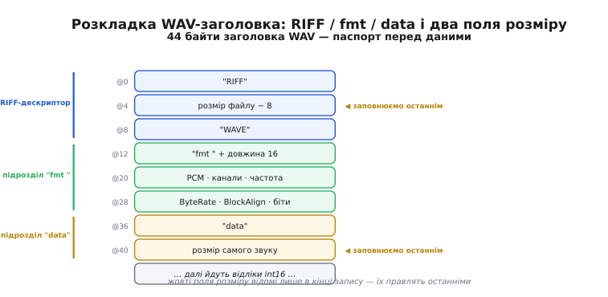
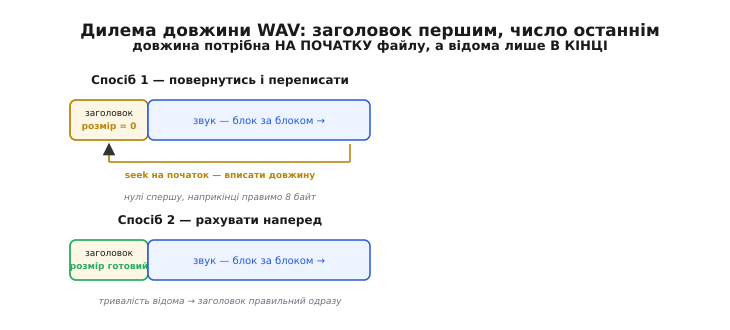
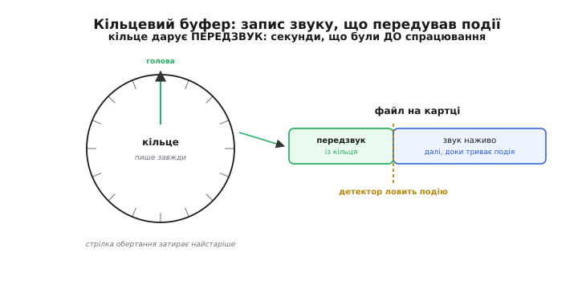

# Запис звуку: WAV, кільцевий буфер, SD

До цього кроку весь звук у нас **проживав і вмирав у пам'яті**. Мембрана віддавала напругу, [конвеєр захоплення](root:embedded/audio-capture-pipeline) складав числа в кільце буферів, ми їх [центрували, фільтрували](root:embedded/audio-processing-basics), [ловили в них події](root:embedded/audio-events-detection) — і тут-таки викидали, бо на місце старого блоку DMA вже писав новий. Так і має бути, поки звук потрібен «зараз»: почув гучний ляск — увімкнув реле, і забув. Але щойно з'являється вимога «а покажи, що там було» — записати сварку на подвір'ї, зберегти пташиний спів, лишити доказ спрацювання, — потік чисел треба **вихопити з пам'яті й покласти на носій**, який переживе перезавантаження й вимкнення живлення.

Здавалося б, що тут складного: бери блоки, які й так уже їдуть із кільця, та зливай їх у файл. Складність у тому, що на цьому кроці **сходяться три різні темпи**, і жоден нам не підвладний. Звук іде рівномірно — рівно f_s відліків щосекунди, без пауз, як ми бачили. Носій — SD-картка — приймає дані **ривками**: то ковтне блок за мілісекунди, то раптом замислиться на десяту частку секунди. А файл на диску мусить лишитися **правильним WAV**, який відкриє будь-який програвач, — а це означає заголовок, у якому записано, скільки саме даних усередині, хоча наперед ми цього не знаємо. Розв'язати всі три вузли одночасно — і є вся ця тема.

## Чому сирий потік — ще не файл

Почнімо з найпростішого й найоманливішого. У пам'яті звук — це масив `int16_t`: голі числа, відлік за відліком. Спокуса очевидна — відкрити файл, вивалити в нього цей масив байт-у-байт і на тому скінчити. Файл навіть створиться, і в ньому справді лежатиме звук. Проблема одна: **його ніхто не зможе прочитати**.

Уявіть, що ви знайшли на столі стос чисел без підпису. Це температури? Курси валют? Координати? Скільки їх у рядку? Голий масив `int16_t` на диску — рівно такий стос. Програвач, відкривши його, не знає **нічого**: чи це 8 кГц чи 48 кГц (від цього залежить, чи звук піде вдвічі швидше й пискляво), скільки каналів (моно чи стерео — інакше ліве й праве поміняються місцями через один відлік), 16 біт на число чи 8 (інакше кожні два байти зіллються в один хрип). Уся ця відсутня довідка — і є різниця між **потоком** і **файлом**.

Отже, файл звуку — це потік плюс **паспорт**: маленький блок на початку, що каже, як читати те, що далі. Такий паспорт називають заголовком (англ. *header* — «верхівка», бо стоїть на початку). І тут не треба вигадувати свій формат: є усталений, який розуміють усі, — **WAV**.

> 🔧 **Навіщо це.** Спокуса «просто скинути масив у файл» — класична пастка перших звукозаписів на МК. Файл начебто пишеться, місце на картці тане, а відкрити запис не виходить ніде: ні на комп'ютері, ні на телефоні. Причина завжди та сама — немає паспорта. Витративши десяток байт на правильний заголовок, ви отримуєте файл, який без зайвих рухів відкриє будь-хто, і не мусите писати власний програвач під власний формат.

## WAV зсередини: паспорт у 44 байти

WAV (англ. *waveform* — «форма хвилі») — це найпоширеніший спосіб зберегти нестиснений звук. Його [придумали спільно IBM і Microsoft у 1991-му](root:embedded/audio-recording-storage/hist-wav-riff.md) як частину мультимедійного пакета для Windows. Усередині WAV — це окремий випадок ширшого контейнера RIFF, і вся його краса для нас у тому, що **найпростіший коректний WAV — це рівно 44 байти заголовка, а за ними — той самий сирий масив `int16_t`, який у нас уже є**. Тобто дані ми не чіпаємо взагалі; уся робота — правильно виставити 44 байти попереду.

Розберімо ці 44 байти. Вони діляться на три частини — «це взагалі RIFF-файл і саме WAV», «ось як улаштований звук» і «а ось і самі дані».



*44 байти паспорта WAV. Перший блок каже «це RIFF, і це WAVE»; другий («fmt ») — як читати звук: частоту, канали, біти; третій («data») відкриває сам масив відліків. Два поля розміру (жовті) заповнюються останніми — коли запис уже завершено й довжина відома.*

Перший блок — **дескриптор RIFF**: чотири літери `RIFF`, далі розмір усього файлу мінус вісім байт, далі чотири літери `WAVE`. Це підпис «так, це файл-контейнер, і всередині — звук».

Другий блок — підрозділ **`fmt `** (з пробілом наприкінці, бо мітка завжди чотирибайтова). Це серце паспорта, тут усе, що потрібно, щоб перетворити байти назад на звук:

```
AudioFormat    = 1        →  нестиснений PCM (лінійні відліки)
NumChannels    = 1        →  моно
SampleRate     = 16000    →  скільки відліків за секунду
BitsPerSample  = 16       →  біт на один відлік
BlockAlign     = NumChannels · BitsPerSample / 8   →  байт на один момент часу
ByteRate       = SampleRate · BlockAlign           →  байт за секунду
```

Два останні поля — не самостійні числа, а **похідні**, і їх легко переплутати, тож затримаймося. `BlockAlign` — це скільки байт займає один **момент часу**: для моно/16 біт це 1 × 16 / 8 = 2 байти, для стерео/16 біт — 4. `ByteRate` — скільки байт з'їдає одна секунда звуку: 16000 × 2 = 32000 байт/с. Програвач бере `ByteRate`, щоб знати, з якою швидкістю подавати дані, і щоб порахувати тривалість файлу. Обидва обчислюються з решти, але записати їх у заголовок треба явно — формат не рахує їх сам.

Третій блок — підрозділ **`data`**: чотири літери `data`, далі розмір **самих звукових даних** у байтах, а одразу за цим числом і починається масив відліків. Ось тут головна морока запису, до якої ми ще повернемося: розмір даних треба знати, щоб записати заголовок, — а поки ми не дописали останній відлік, ми його не знаємо.

Ще одна дрібниця, що псує життя новачкам, — **порядок байтів**. Усі багатобайтові числа в WAV лежать **молодшим байтом уперед** (англ. *little-endian* — «з малого кінця»). RIFF успадкував це від процесорів x86, на яких народився. Нам це радше на руку: ARM Cortex-M у більшості плат теж little-endian, тож `SampleRate = 16000` лягає в пам'ять точно в тому порядку, у якому має лежати у файлі, — записуємо чотири байти структури як є. Але покладатися на це наосліп не можна: колись код перенесуть на big-endian ядро, і мовчазне припущення вибухне переставленими байтами. Тому чесний спосіб — **складати заголовок побайтово**, не сподіваючись на розкладку пам'яті.

**Складання WAV-заголовка в буфер (реальний C для прошивки):**

```c
#include <stdint.h>
#include <string.h>

// Кладе little-endian числа явно — не залежить від порядку байтів ядра.
static void put_u32(uint8_t *p, uint32_t v) {
    p[0] = v; p[1] = v >> 8; p[2] = v >> 16; p[3] = v >> 24;
}
static void put_u16(uint8_t *p, uint16_t v) {
    p[0] = v; p[1] = v >> 8;
}

// Заповнює 44 байти заголовка. data_bytes — розмір самого звуку в байтах.
void wav_header(uint8_t hdr[44], uint32_t sample_rate,
                uint16_t channels, uint16_t bits, uint32_t data_bytes) {
    uint16_t block_align = channels * bits / 8;
    uint32_t byte_rate   = sample_rate * block_align;

    memcpy(hdr + 0,  "RIFF", 4);
    put_u32(hdr + 4,  36 + data_bytes);   // розмір файлу мінус 8
    memcpy(hdr + 8,  "WAVE", 4);

    memcpy(hdr + 12, "fmt ", 4);
    put_u32(hdr + 16, 16);                // довжина блоку fmt
    put_u16(hdr + 20, 1);                 // PCM
    put_u16(hdr + 22, channels);
    put_u32(hdr + 24, sample_rate);
    put_u32(hdr + 28, byte_rate);
    put_u16(hdr + 32, block_align);
    put_u16(hdr + 34, bits);

    memcpy(hdr + 36, "data", 4);
    put_u32(hdr + 40, data_bytes);        // розмір самого звуку
}
```

Зверніть увагу на два поля, у яких стоїть `data_bytes`: розмір файлу (`36 + data_bytes`) і розмір даних (`data_bytes`). Це та сама пара жовтих полів зі схеми — і поки запис триває, обидва невідомі. Як із цим жити — далі.

## Дилема довжини: заголовок першим, а число знаєш останнім

Отут причинно-наслідковий вузол, через який спотикаються всі. Заголовок стоїть **на початку** файлу. А число, яке в нього треба вписати, — скільки всього байт звуку — стає відоме лише **наприкінці**, коли користувач натиснув «стоп». Курка й яйце: щоб писати з початку, треба знати кінець.

Виходів рівно два, і обидва варто мати в голові.

**Спосіб перший — повернутися й переписати.** Пишемо файл по-чесному, з початку: спершу кладемо заголовок із **нулями** в полях розміру (місце під них резервуємо, значення поки брехливі), далі гонимо звук блок за блоком, рахуючи по дорозі, скільки байт вивалили. Коли запис скінчено, **вертаємо каретку файлу на початок** (`seek` до нульового зсуву), переписуємо ті вісім байт уже правильними числами й закриваємо файл. Це найпоширеніший шлях, і він добрий, коли є нормальна файлова система, що вміє переміщати позицію запису туди-сюди.

**Спосіб другий — рахувати наперед.** Іноді запис **фіксованої тривалості**: «пишемо рівно 5 секунд після події». Тоді довжину знаємо **до** початку — 5 × `ByteRate` байт, — і можемо одразу записати правильний заголовок, а потім просто долити стільки звуку, скільки обіцяли. Жодного повернення. Простіше й надійніше, але годиться лише коли тривалість справді відома заздалегідь.



*Число довжини потрібне на початку файлу, а відоме лише в кінці. Ліворуч: пишемо заголовок із нулями, доливаємо звук, наприкінці вертаємось і правимо вісім байт. Праворуч: якщо тривалість задана наперед, рахуємо байти відразу й пишемо правильний заголовок з першого разу.*

Для мікроконтролера з увімкненою файловою системою на SD перший спосіб — робочий: `seek` на початок картці недорогий, бо переписуємо лише один сектор. Але тут криється підступ, про який згадаємо, коли дійдемо до реальності носія: якщо живлення зникне **до** того, як ми повернулись і виправили заголовок, у файлі назавжди лишаться нулі в полях розміру — і формально він битий. Тому для важливого запису дехто періодично, раз на кілька секунд, оновлює поле розміру «на льоту», щоб раптове вимкнення втратило щонайбільше останні секунди, а не весь файл.

## Записати те, чого ще не почув: кільцевий буфер

Дотепер ми говорили, як писати звук **уперед у часі** — від натискання «запис» і далі. Але найцінніша вимога до звукозапису часто інша й на позір неможлива: **зберегти те, що було ДО події**. Давач гримить лише коли вже гримить; постріл чутно лише коли він уже пролунав. А хочеться мати в записі й **секунду тиші перед ним** — бо саме там початок звуку, найінформативніша частина. Як записати минуле?

Відповідь елегантна й уже нам знайома за формою: **писати весь час, але в буфер, що сам себе стирає**. Це кільцевий буфер (англ. *ring buffer* — «буфер-кільце»; ту саму структуру ми будували для потоків даних, [її механіка розібрана окремо](book:programming/double-buffering/proj-ring-buffer.md)). Уявіть коротку стрічку, скручену в кільце: голова весь час пише свіжий звук, і коли доходить до кінця стрічки — просто йде на початок і затирає найстаріше. У кільці завжди лежать **останні N секунд** звуку — рівно стільки, скільки вміщає стрічка, і не більше. Старіше вже стерто, новіше ще не надійшло.

Тепер трюк. Кільце крутиться **завжди**, у фоні, і поки події немає — ми з нього нічого не беремо, звук просто перетирається по колу. Але щойно [детектор події](root:embedded/audio-events-detection) крикнув «ось воно!» — ми **завмираємо кільце** й вихоплюємо з нього все, що там накопичилося: а там же лежать останні, скажімо, дві секунди — тобто **звук, що передував події**. Ми записали минуле, бо весь час його зберігали, просто досі не мали приводу дивитися.



*Кільце пише звук завжди, затираючи найстаріше. Коли детектор ловить подію, у кільці вже лежить передзвук — секунди ДО спрацювання. Запис на картку зшиває дві частини: передзвук із кільця плюс звук, що йде далі наживо.*

Розмір кільця — це прямо **скільки минулого** ви хочете мати. Дві секунди передзвуку на 16 кГц/16 біт коштують 16000 × 2 × 2 = 64000 байт — цілком підйомно навіть для скромного МК. Хочете п'ять секунд — тримайте 160 КБ, і якщо стільки RAM немає, це вже привід писати кільце не в пам'ять, а на швидший носій. Але сама ідея не змінюється: **безперервний запис у структуру, що забуває старе, дає безкоштовний доступ до недавнього минулого**.

**Кільцевий буфер передзвуку (реальний C для прошивки):**

```c
#include <stdint.h>
#include <string.h>

#define PRE_SAMPLES 32000            // 2 с при 16 кГц (передзвук)
static int16_t  ring[PRE_SAMPLES];
static uint32_t head = 0;            // куди писати наступний відлік
static uint32_t filled = 0;         // скільки відліків уже реально в кільці

// Викликаємо на КОЖЕН блок із конвеєра захоплення — кільце крутиться завжди.
void ring_push(const int16_t *blk, uint32_t n) {
    for (uint32_t i = 0; i < n; i++) {
        ring[head] = blk[i];
        head = (head + 1) % PRE_SAMPLES;    // дійшов до кінця — на початок
        if (filled < PRE_SAMPLES) filled++;
    }
}

// Подія! Вивантажуємо передзвук У ХРОНОЛОГІЧНОМУ порядку: від найстарішого.
// Найстаріший відлік — це той, що ЗАРАЗ під головою (його ось-ось затерли б).
void ring_drain(void (*sink)(const int16_t*, uint32_t)) {
    uint32_t start = (filled < PRE_SAMPLES) ? 0 : head;   // початок хронології
    for (uint32_t i = 0; i < filled; i++) {
        int16_t s = ring[(start + i) % PRE_SAMPLES];
        sink(&s, 1);                        // віддаємо на запис у файл
    }
}
```

Головна тонкість тут — **порядок вивантаження**, і на ній легко спіткнутися. Голова кільця вказує на комірку, куди підемо писати наступне, — а отже, на **найстаріший** відлік, той, що ось-ось затерли б. Тож хронологію відновлюємо, починаючи саме з-під голови й обходячи кільце по колу до неї ж. Переплутаєш — і передзвук ляже у файл задом наперед, звук «крякне». І ще: поки кільце ще не заповнилося вперше (`filled < PRE_SAMPLES`), голова стоїть попереду порожнечі, тож хронологія починається просто з нуля — цей випадок функція розрізняє окремо.

Зшивання виходить природне: спершу `ring_drain` виливає у файл **передзвук** із кільця, а далі та сама `sink` продовжує приймати блоки **наживо**, доки триває подія. У записі — безшовний перехід від «за дві секунди до» до «під час». Це і є той приклад, де кільце з попередніх кроків працює вже не заради темпу, а заради **пам'яті про минуле**.

## Реальність носія: SD пише ривками

Лишився третій, найпідступніший темп — сама картка. Тут інтуїція, здобута на буферах у RAM, зраджує: **SD-картка приймає дані нерівномірно**, і не через нашу помилку, а через власну природу.

Щоб зрозуміти чому, треба на мить зазирнути всередину. [SD-картка](book:electronics/sd-card) — це флеш-пам'ять із власним крихітним контролером, і флеш має неприємну рису: **стерти можна лише великими блоками одразу**, окрему комірку не перепишеш. Тому, коли ви просите записати кілька байт, контролер часом мусить прочитати цілий великий блок, змінити в ньому шматочок, стерти блок і записати назад — а стирання флеш-блоку триває **мілісекунди**. Додайте сюди вирівнювання зношення (контролер розкидає записи по чипу, щоб той не витерся в одному місці нерівномірно) — і виходить, що **більшість записів картка ковтає швидко, але зрідка якийсь застрягає надовго**. Такий рідкісний довгий запис звуть «хвостовою затримкою» (англ. *tail latency* — «затримка хвоста розподілу»): не середнє, а рідкі найгірші випадки.

Ось де конфлікт із нашими трьома темпами стає гострим. Звук іде **рівномірно**, без пауз. Картка приймає **ривками**. Якщо писати блок звуку прямо на картку синхронно й чекати, поки вона підтвердить, — то під час рідкого «застрягання» на, скажімо, 100 мс наступні блоки звуку **нікуди буде діти**: DMA-кільце захоплення переповниться, і в записі з'явиться діра — той самий чутний розрив, з яким ми боролися ще на [конвеєрі захоплення](root:embedded/audio-capture-pipeline). Виходить прикра іронія: намагаючись **зберегти** звук, ми його **втрачаємо**.

> 🔧 **Навіщо це.** Це та помилка, яку неможливо відтворити за столом: удома запис пише годину без єдиної діри, а в замовника раз на кілька хвилин «клац». Причина — саме хвостова затримка картки, яка вилазить нечасто й непередбачувано, надто на дешевих чи зношених картках. Знаючи, що носій пише ривками, ви одразу закладаєте **буфер-амортизатор** між рівним звуком і нерівною карткою — і не ганяєтеся за примарним «клацанням», яке з'являється лише в полі.

Розв'язок той самий принцип, що рятував нас увесь курс, — **розв'язати темпи буфером**. Між рівним потоком звуку й нерівною карткою ставимо **буфер-амортизатор** (англ. *buffer* — «пом'якшувач ударів»): звук ллється в нього рівномірно, а на картку ми **скидаємо великими шматками**, коли назбиралося досить. Поки картка застрягла, звук спокійно накопичується в буфері RAM; картка відмерзла — ми одним махом виливаємо накопичене. Буфер має бути такий, щоб пережити найдовше правдоподібне «застрягання»: якщо картка може задуматися на 100 мс, а секунда звуку — 32000 байт, то буфер від кількох кілобайт і більше проковтне цю паузу, не втративши жодного відліку.

Два практичні правила, що прямо випливають із будови флеш, роблять записи ще рівнішими:

**Пишіть великими, вирівняними шматками.** Один запис на 4096 байт картка обробляє куди спокійніше, ніж 4096 записів по байту, — бо великий вирівняний шматок часто лягає рівно на внутрішній блок картки, і контролеру не доводиться робити болючий цикл «прочитай-зміни-стирай-запиши». Тому звук у файл ллють не поштучно, а **накопичивши сектор-другий** (512 байт — розмір сектора картки; кратне цьому — найкраще).

**Не смикайте синхронізацію на кожен блок.** Файлова система тримає власний кеш і скидає його на картку не одразу. Команда «скинь усе зараз» (`fsync`/`flush`) корисна, щоб убезпечити дані від раптового вимкнення, — але кожен її виклик змушує картку зробити той самий дорогий цикл. Тому синхронізують **зрідка** — раз на секунду-дві, — знаходячи баланс між «втратити щонайбільше секунду при збої» і «не душити картку постійними скиданнями».

**Стрічковий запис звуку на SD через буфер-амортизатор (реальний C для прошивки):**

```c
#include <stdint.h>
#include <string.h>

#define CHUNK 4096                 // пишемо на картку кратно сектору (512)
static uint8_t  acc[CHUNK];        // буфер-амортизатор між звуком і карткою
static uint32_t acc_len = 0;       // скільки байт уже накопичено
static uint32_t data_bytes = 0;    // усього звуку записано (для заголовка)

// f_write / f_sync — з файлової системи (напр. FatFs); file — відкритий файл.
// Приймає блок звуку; на картку зливає лише повними шматками CHUNK.
void sd_stream(FIL *file, const int16_t *blk, uint32_t n) {
    const uint8_t *src = (const uint8_t *)blk;
    uint32_t bytes = n * sizeof(int16_t);

    while (bytes) {
        uint32_t room = CHUNK - acc_len;
        uint32_t take = (bytes < room) ? bytes : room;
        memcpy(acc + acc_len, src, take);
        acc_len += take; src += take; bytes -= take;

        if (acc_len == CHUNK) {                  // буфер повний — злив на картку
            UINT wr;
            f_write(file, acc, CHUNK, &wr);      // один великий вирівняний запис
            data_bytes += wr;
            acc_len = 0;
        }
    }
}
```

Тут видно всі три правила разом. Звук приходить блоками будь-якого розміру — ми його **не пишемо одразу**, а накопичуємо в `acc`. Записуємо на картку **лише повними шматками** по 4096 байт — один великий вирівняний запис замість купи дрібних. А `f_sync` (скидання кешу на картку) у цьому циклі взагалі немає — його викликають окремо, за таймером, раз на секунду-дві, щоб не душити носій. Коли користувач тисне «стоп», лишок із `acc` дописують останнім неповним шматком, оновлюють `data_bytes` у заголовку тим самим `seek`-ом на початок — і файл закрито.

## Троє темпів, зведені в один файл

Відступімо на крок і побачимо всю картину. Запис звуку виявився не «скинути масив у файл», а **узгодженням трьох незалежних темпів**, жоден з яких нам не підвладний, — і кожен ми приборкали тим самим прийомом.

Звук іде **рівно й без пауз** — його ми ловимо кільцем, і те саме кільце дарує нам передзвук, тобто доступ до недавнього минулого. Носій приймає **ривками** — між ним і звуком стоїть буфер-амортизатор, що скидає дані великими вирівняними шматками, поки картка перетравлює попередні. А файл мусить лишитися **правильним WAV** — і ми або вертаємось наприкінці дописати довжину, або рахуємо її наперед, коли тривалість відома. Три вузли, один інструмент на всі: **буфер, що розв'язує два темпи, які не збігаються**.

Далі по курсу ми побачимо, що навіть цього буває мало: сирий звук з'їдає багато місця (та сама секунда 16 кГц/16 біт — 32 кілобайти), і коли картка мала або запис довгий, звук доводиться [стискати прямо на МК](root:embedded/audio-compression-mcu) — ADPCM чи Opus, — перш ніж класти на носій. Але контейнер, кільце й дисципліна запису на SD лишаються фундаментом: стиснений потік теж треба обгорнути заголовком і теж злити на картку рівними шматками, не давши їй захлинутися.
