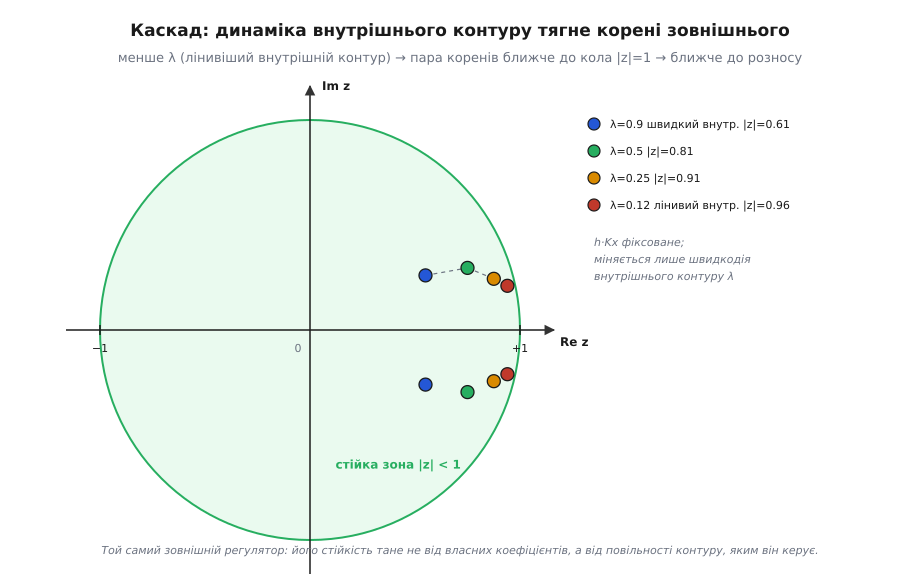

# 🧮 Стійкість дискретного контуру: повне виведення

У кроці про механіку автономної системи ми одним рухом дійшли до серцевини стабілізації: замкнений контур щотакту множить своє відхилення на число `ρ = 1 − Kp·g`, і поки `0 < Kp·g < 2`, це відхилення стягується до нуля. Там ми взяли цей результат майже нахрапом — достатньо, щоб побачити суть. Тут порахуємо його **до дна**: не просто «звідки береться межа 2», а що ховається за нею, коли контур перестає бути найпростішим.

Бо реальний регулятор — не одне множення на `Kp`. У нього є **пам'ять** (інтегральна складова), і ця пам'ять додає контурові **другу динаміку** — а з другою динамікою з'являється те, чого в П-регуляторі не було в принципі: **незгасні коливання** — власна хитка мода, що не осідає сама. Далі контур виявляється не один, а **вкладеним** у інший, і швидкодія внутрішнього перетворюється на **затримку** для зовнішнього — теж строго, числом. І нарешті той самий апарат `zⁿ`, яким ми міряємо стійкість, дасть нам **точну** частоту поділу доповняльного фільтра — те `f = (1−α)/(2π·α·Δt)`, яке в кроці ми лише оголосили, — і покаже, чому фільтр Калмана — це той самий поділ, тільки з `α`, що дихає.

Наскрізна думка одна: **стійкість дискретної системи — це поведінка степенів. Усе зводиться до питання, чи росте `zᵏ`, чи згасає.** Розберімо це питання від першопричини й проведімо через чотири щаблі складності.

## Чому взагалі степені: `z` як «на такт уперед»

Спершу — інструмент, без якого далі буде важко. У кроці ми писали різницеве рівняння `θₖ₊₁ = ρ·θₖ` і руками розкручували його в `θₖ = ρᵏ·θ₀`. Це працює для одного множника, але щойно рівняння стане складнішим (а з інтегралом воно згадає **два** попередні такти), розкручувати руками — мука. Потрібен спосіб перетворити рекурсію в **алгебру**.

Ось звідки береться `z`. Придивімося до дій, які ми взагалі вміємо робити з дискретним сигналом. Їх, по суті, дві: **помножити такт на число** й **зсунути в часі** (взяти значення на такт раніше чи пізніше). Множення — просте. А зсув? Введімо для нього позначку. Домовмося, що символ `z` означає **«зсунути на один такт уперед»**, а `z⁻¹` — **«на один такт назад»**:

```
z · θₖ  =  θₖ₊₁       (уперед: наступний такт)
z⁻¹ · θₖ  =  θₖ₋₁     (назад: попередній такт)
```

Це поки що чиста стенографія — ми лише скоротили «наступний такт» до одного символу. Але подивімося, що вона робить із нашою затухною послідовністю. Візьмімо `θₖ = ρᵏ` і застосуймо до неї «зсув уперед»:

```
z · ρᵏ = ρᵏ⁺¹ = ρ · ρᵏ
```

Зсунути степеневу послідовність на такт — це те саме, що **помножити її на `ρ`**. Тобто для послідовності виду `ρᵏ` оператор `z` діє просто як множення на число `ρ`. І ось чому це золото: якщо ми **припустимо**, що розв'язок нашого рівняння має вигляд `θₖ = zᵏ` (степінь якогось поки невідомого числа `z`), то кожен зсув у рівнянні перетвориться на множення на `z`, усі `θ` скоротяться — і різницеве рівняння **згорнеться в звичайне алгебричне** відносно `z`. Розв'язавши його, дістанемо ті `z`, на степенях яких і побудований справжній розв'язок.

> 🔧 **Навіщо це.** Це і є вся практична суть `z`-перетворення на пальцях: **шукай розв'язок у вигляді `zᵏ`, і рекурсія стане многочленом**. Корені цього многочлена — числа `z` — повністю вирішують долю системи: `|z| < 1` для кожного кореня — усі степені згасають, система стійка; хоч один `|z| > 1` — його степінь росте й тягне все за собою в рознос. Уся «стійкість» далі — це перевірка, де на комплексній площині лежать ці корені відносно кола `|z| = 1`. Повний апарат — у [z-перетворенні](topic:com-signal/z-transform); нам вистачить самого правила «зсув = множення на z».

Тепер у нас є важіль. Прикладімо його по черзі до чотирьох контурів.

## Щабель 1: П-регулятор — один корінь, одна межа

Повторімо виведення з кроку, але тепер із `z`, щоб побачити механіку в чистому вигляді й задати зразок для складніших випадків. Апарат — один оберт (крен). Уся фізика ланцюга «команда → момент → зміна кута за такт» згорнута в одне число `g` (підсилення каналу, °/такт на одиницю команди). Один прохід:

```
θₖ₊₁ = θₖ + g · uₖ + wₖ
```

де `wₖ` — збурення ззовні. П-регулятор тримає крен на нулі: `uₖ = −Kp · θₖ`. Підставмо й для чистоти виведення розгляньмо **вільний** рух (без збурення, `wₖ = 0`) — саме він каже, стійка система чи ні:

```
θₖ₊₁ = θₖ − Kp·g · θₖ = (1 − Kp·g) · θₖ
```

Тепер застосуймо важіль: шукаємо розв'язок як `θₖ = zᵏ`. Ліворуч `θₖ₊₁ = z·zᵏ`, праворуч `(1−Kp·g)·zᵏ`. Скорочуємо `zᵏ`:

```
z = 1 − Kp·g
```

Один зсув уперед (`θₖ₊₁`) дав рівняння **першого** степеня — тому корінь **один**. Це і є наше `ρ` з кроку, тепер під своїм справжнім іменем: **корінь характеристичного рівняння** (*characteristic root*, або полюс системи). Умова стійкості — `|z| < 1`:

```
|1 − Kp·g| < 1     ⇔     −1 < 1 − Kp·g < 1     ⇔     0 < Kp·g < 2
```

Той самий результат, що й у кроці, але тепер видно його **природу**: межа `2` — це не властивість крену чи моторів, а геометрія одного кореня, що виповзає за одиничне коло з боку `−1`. Ліва стіна (`Kp·g > 0`) — корінь не має виповзти за `+1` (команда мусить штовхати кут назад, а не геть). Права стіна (`Kp·g < 2`) — корінь не має пірнути за `−1` (надто сильний регулятор перекидає кут через нуль сильніше, ніж було відхилення).

Зверни увагу на **знак** кореня — він читає характер руху ще до будь-яких коливань:

```
0 < Kp·g < 1   →   z ∈ (0, 1)    крок за кроком до нуля, БЕЗ перельоту («в'яле»)
Kp·g = 1       →   z = 0         за один такт у нуль (мертвий удар, deadbeat)
1 < Kp·g < 2   →   z ∈ (−1, 0)   знак кута щотакту міняється: затухні коливання
Kp·g > 2       →   z < −1        коливання, що розгойдуються: рознос
```

Один дійсний корінь дає лише **монотонне** згасання (`z > 0`) або згасання зі **зміною знаку щотакту** (`z < 0`) — так звані «дзвінкі» коливання з періодом рівно **два такти**. Гладких коливань з довшим періодом П-регулятор дати не може: для них потрібні **два** корені, які ходять парою. А два корені бере той, у кого є пам'ять, — інтегратор.

## Щабель 2: ПІ-регулятор — друга динаміка й народження незгасних коливань

Тепер додамо інтегральну складову. Навіщо вона взагалі — окрема історія: чистий П-регулятор лишає **сталу похибку** під постійним навантаженням (щоб видати утримувальну команду, йому потрібна ненульова помилка на вході), і прибирає цю похибку саме інтеграл, що накопичує помилку в часі. Механіку сталого зсуву детально розібрано в [П-регуляторі](root:embedded/proportional-control) та [І-складовій](root:embedded/integral-control); нам тут важливий інший бік інтеграла — що він робить зі **стійкістю**.

Інтегральна складова накопичує суму помилок. Позначмо цей накопичувач `Iₖ`; щотакту до нього додається поточна помилка (з кроком часу):

```
Iₖ = Iₖ₋₁ + eₖ · Δt          (накопичувач помилки)
uₖ = Kp · eₖ + Ki · Iₖ        (команда: пропорція + інтеграл)
```

Ось де вузол: тепер стан системи — це **не одне число** `θ`, а **два**: сам кут `θ` і вміст накопичувача `I`. У системи з'явилася **друга змінна пам'яті**, друга динаміка. І це не косметика — це якісно міняє все, бо два стани дадуть характеристичне рівняння **другого** степеня, а квадратне рівняння вміє те, чого лінійне не вміло: мати **пару комплексних коренів**. А комплексні корені — це і є справжні гладкі коливання.

Проведімо виведення. Помилка при уставці нуль: `eₖ = −θₖ`. Щоб не потонути, зробимо чесне спрощення, яке зберігає **суть** явища (появу другого кореня), і чітко назвемо його ціну: розгляньмо суто інтегральне керування `uₖ = Ki·Iₖ` — бо саме інтеграл вносить другий стан, і саме на ньому незгасні коливання видно найчистіше (додавання `Kp` зсуває числа, але не породжує явища). Маємо систему з двох рекурсій:

```
θₖ₊₁ = θₖ + g · Ki · Iₖ            (фізика: команда з інтеграла міняє кут)
Iₖ   = Iₖ₋₁ + eₖ·Δt = Iₖ₋₁ − θₖ·Δt  (накопичувач: тягне помилку кута)
```

Друге рівняння зручніше зсунути на такт уперед, щоб обидва дивилися на `k+1`: `Iₖ₊₁ = Iₖ − θₖ₊₁·Δt`. Тепер прикладаємо важіль до **обох** змінних одразу — шукаємо розв'язок `θₖ = A·zᵏ`, `Iₖ = B·zᵏ` (обидві динаміки живуть на **спільних** степенях `z`, лише з різними амплітудами `A`, `B`). Підставмо в першу рекурсію:

```
A·z = A + g·Ki·B      ⇒   A·(z − 1) = g·Ki·B
```

Позначмо для стислості `κ = g·Ki·Δt` — це безрозмірне **сукупне підсилення інтегральної петлі за такт** (уся фізика й налаштування, зведені в одне число, як `Kp·g` було для П). Виразимо `B` з першого рівняння й підставимо в друге (`Iₖ₊₁ = Iₖ − θₖ₊₁·Δt` теж переписуємо через `z`); після скорочення `zᵏ` уся система згортається в **одне квадратне рівняння** відносно `z`:

```
z² − (2 − κ)·z + 1 = 0
```

Ось воно — характеристичне рівняння з **двома** коренями. Вивчімо його. Сума коренів `z₁ + z₂ = 2 − κ`, а добуток `z₁·z₂ = 1`. **Добуток рівно одиниця** — це надзвичайно промовисто: якщо корені комплексні (спряжена пара `re±iφ`), то їхній добуток — це `r²`, отже

```
z₁·z₂ = r² = 1   ⇒   r = 1
```

Корені сидять **рівно на одиничному колі** — на самій межі стійкості! Це прямий математичний відбиток фізики: **чистий інтегратор без тертя** не має чим гасити енергію, тож коливання, які він породжує, **не згасають самі** — вони кружляють по колу `|z| = 1`. Саме тому «інтегральність» регулятора **сама собою** викликає **незгасні коливання**: інтеграл додає енергію в такт із рухом і не має механізму її забрати. (У повному ПІ-регуляторі складова `Kp` стягує корені **всередину** кола й повертає згасання — вона і є те «тертя», якого браку́є чистому інтегралу; тому `Kp` і `Ki` завжди ставлять у парі.)

Тепер — коли корені дійсні, а коли комплексні; це вирішує дискримінант `D = (2−κ)² − 4`. Розкладімо його як різницю квадратів, щоб корені самого `D` побачити відразу:

```
D = (2−κ)² − 4 = (2−κ−2)·(2−κ+2) = (−κ)·(4−κ) = κ·(κ − 4)
```

Отже `D = 0` рівно у **двох** точках — `κ = 0` і `κ = 4`, — а не в одній. Між ними, в усьому проміжку `0 < κ < 4`, добуток `κ·(κ−4)` від'ємний, отже `D < 0`: **корені комплексні на всьому цьому проміжку**. А комплексні корені, ми щойно бачили, сидять рівно на одиничному колі (`r = 1`). Складімо ці два факти — і дістанемо різкий, ба навіть несподіваний висновок:

```
0 < κ < 4   →   D < 0   →   комплексна пара на колі |z|=1    →   НЕЗГАСНІ коливання
κ = 4       →   D = 0   →   подвійний корінь на z = −1        →   межа (період рівно 2 такти)
κ > 4       →   D > 0   →   два дійсні корені, добуток = 1    →   один за колом → РОЗНОС
```

Ось де початкова інтуїція «поріг коливань» ламається — і ламається повчально. У П-регулятора поріг справді був: до `Kp·g = 1` кут повертався монотонно, і аж потім починався «дзвін». У чистого інтегратора **порога немає взагалі**: щойно `Ki` відірвався від нуля (`κ > 0`), корені вже комплексні й уже на колі — контур **гойдається, не згасаючи, в усьому робочому діапазоні** `0 < κ < 4`. Ділянки монотонного осідання в нього просто **нема**. Єдина справжня межа — `κ = 4`, і це межа не «початку коливань», а **початку розносу**: там пара сходить із кола на дійсну вісь, і один корінь неминуче вивалюється за `−1` (добуток коренів рівно `1`, тож щойно вони стали дійсні — один із них уже поза колом). Це дослівний відбиток фізики з попереднього абзацу: інтегратор без тертя не має чим гасити енергію, тож він або вічно кружляє по колу, або, перекрутивши, розганяється — а **осісти рівно не вміє ніколи**.

Частоту гойдання в робочому діапазоні дає кут кореня `φ` (з `2cos φ = 2 − κ`, тобто `cos φ = 1 − κ/2`) — і вона повзе через увесь діапазон плавно, а не «вмикається» на якомусь порозі:

```
κ → 0   →   cos φ → 1     →   φ → 0      →   період → ∞    (майже нерухоме, дуже повільне гойдання)
κ = 2   →   cos φ = 0     →   φ = π/2    →   період = 4 такти
κ → 4   →   cos φ → −1    →   φ → π      →   період → 2 такти
```

Для малих `κ` це дає зручне наближення `φ ≈ √κ` (бо `cos φ ≈ 1 − φ²/2`), тобто період `≈ 2π/√κ` тактів. Картина проста: біля нуля інтеграл гойдає ліниво й повільно, а що більший `Ki`, то швидше — період стискається від нескінченного до двох тактів, поки при `κ = 4` гойдання не зривається в рознос.

Порахуймо на числах, щоб побачити масштаб.

**Приклад (чистий інтеграл гойдає в усьому діапазоні).** Петля 400 Гц (`Δt = 2.5 мс`), канал `g = 0.6 °/такт` на одиницю команди. Питання: як контур поводиться за різних `Ki` і де справжня межа — рознос?

```
рознос настає при:  κ = g·Ki·Δt = 4
                    Ki = 4 / (g·Δt) = 4 / (0.6 · 0.0025) ≈ 2667  (1/с)

Ki = 300 1/с:   κ = 0.6 · 300  · 0.0025 = 0.45   (0<κ<4 → КОМПЛЕКСНІ: незгасні коливання)
                cos φ = 1 − 0.225 = 0.775   ⇒   φ ≈ 0.68 рад   ⇒   період ≈ 9.2 такту ≈ 23 мс (≈44 Гц)

Ki = 900 1/с:   κ = 0.6 · 900  · 0.0025 = 1.35   (0<κ<4 → КОМПЛЕКСНІ: незгасні коливання)
                cos φ = 1 − 0.675 = 0.325   ⇒   φ ≈ 1.24 рад   ⇒   період ≈ 5.1 такту ≈ 13 мс (≈79 Гц)

Ki = 1600 1/с:  κ = 0.6 · 1600 · 0.0025 = 2.4    (0<κ<4 → КОМПЛЕКСНІ: незгасні коливання)
                cos φ = 1 − 1.2   = −0.2    ⇒   φ ≈ 1.77 рад   ⇒   період ≈ 3.5 такту ≈ 8.9 мс (≈113 Гц)

Ki = 3000 1/с:  κ = 0.6 · 3000 · 0.0025 = 4.5    (κ>4 → ДІЙСНІ корені → РОЗНОС)
                z² + 2.5·z + 1 = 0   ⇒   z = −0.5  та  z = −2   (|−2| > 1 → росте, міняючи знак)
```

Читається так: **жодне** `Ki` в діапазоні `0 < κ < 4` не дає монотонного повернення — контур гойдається всюди, і що більший `Ki`, то швидше гойдання (період тане `9.2 → 5.1 → 3.5` такту, а амплітуда сама не спадає). А `Ki ≈ 2667` (`κ = 4`) — це вже не «сильніші коливання», а **обрив у рознос**: за ним пара коренів сходить із кола на дійсну вісь, один вивалюється за `−1`, і відхилення росте, міняючи знак щотакту. **Порівняй із П-регулятором**, де була чесна ділянка монотонного згасання (`0 < Kp·g < 1`) і аж потім двотактовий «дзвін»: у чистого інтеграла монотонної ділянки немає **зовсім** — лише незгасне гойдання, а за `κ = 4` рознос. Оце і є ціна другої динаміки в чистому вигляді: інтеграл прибирає сталу похибку, але сам собою вносить власну хитку моду, яку **нема чим** приборкати, крім пропорційної складової.

> 🔧 **Навіщо це.** Головний практичний висновок несподіваний: чистий інтеграл приборкати самим `Ki` **неможливо** — у діапазоні `0 < g·Ki·Δt < 4` він гойдається завжди, а вище зривається в рознос; ділянки, де він осідає рівно, не існує. Єдині справжні ліки від гойдання — **пропорційна складова `Kp`**: вона стягує комплексну пару з одиничного кола **всередину** (додає те «тертя», якого браку́є інтегралу) і перетворює незгасне гойдання на затухле осідання — тому `Kp` і `Ki` й ставлять завжди в парі, ніколи інтеграл наодинці. І окремо тримай у голові неочевидний зв'язок через `κ = g·Ki·Δt`: **рідша петля (більший `Δt`) збільшує `κ`** — тобто робить інтеграл агресивнішим і підсовує його до межі розносу `κ = 4`; часта петля, навпаки, інтеграл присмирює. Саме цей зв'язок годинами шукають наосліп, крутячи коефіцієнти без моделі в голові.

## Щабель 3: каскад — як динаміка внутрішнього контуру входить у зовнішнє рівняння

У кроці ми казали: зовнішній контур бачить внутрішній як свій «виконавчий механізм», і треба, щоб внутрішній був у рази швидший, інакше вони розгойдують одне одного. Тепер покажемо це **рівнянням** — як саме динаміка внутрішнього контуру пролізає в характеристичне рівняння зовнішнього й псує йому корені.

Модель каскаду в чистому вигляді. **Внутрішній** контур (орієнтація) відпрацьовує задану уставку кута не миттєво, а з власною сталою — опишімо його поведінку тим самим одним коренем, що ми вивели на щаблі 1. Хай при команді «тримай кут `φ*`» реальний кут наздоганяє уставку за законом:

```
φₖ₊₁ = φₖ + λ · (φ*ₖ − φₖ),   0 < λ < 1     (внутрішній: доганяє уставку)
```

`λ` — швидкодія внутрішнього контуру: `λ = 1` — миттєво (за такт), `λ → 0` — дуже мляво. (Це те саме, що `φₖ₊₁ = (1−λ)φₖ + λφ*ₖ`, тобто корінь внутрішнього `z_вн = 1 − λ`.) **Зовнішній** контур (положення) дивиться на положення `x`, порівнює з ціллю (хай ціль — нуль) і **виставляє уставку кута** внутрішньому пропорційно до похибки положення. А кут, своєю чергою, штовхає положення (нахилився — полетів):

```
φ*ₖ = −Kx · xₖ            (зовнішній: похибка положення → бажаний нахил)
xₖ₊₁ = xₖ + h · φₖ         (фізика: нахил рухає положення; h — «скільки метрів/такт на градус»)
```

Наївний проєктувальник **знехтував би** динамікою внутрішнього контуру — припустив би `φₖ = φ*ₖ` (кут миттєво дорівнює замовленому). Тоді все звелося б до `xₖ₊₁ = xₖ − h·Kx·xₖ` — один корінь, знайома умова `0 < h·Kx < 2`, ніяких сюрпризів. Але внутрішній контур **не миттєвий**, і саме `λ ≠ 1` усе змінює. Зберемо повну систему — тепер станів **два** (`x` і `φ`) — і прикладімо важіль до обох: `xₖ = A·zᵏ`, `φₖ = B·zᵏ`.

Підставляємо `φ*ₖ = −Kx·xₖ` у рівняння внутрішнього, переписуємо обидві рекурсії через `z` і скорочуємо `zᵏ`:

```
B·z = B·(1−λ) − λ·Kx·A       (внутрішній зі вставленою уставкою)
A·z = A + h·B                (фізика положення)
```

З другого `B = A·(z−1)/h`; підставляємо в перше, множимо на `h`, скорочуємо `A` — і дістаємо характеристичне рівняння **другого** степеня:

```
z² − (2 − λ)·z + (1 − λ + λ·h·Kx) = 0
```

Ось потрібне видно чорним по білому. Порівняй із наївним «миттєвим» випадком (`z − (1 − h·Kx) = 0`, перший степінь). Через те, що внутрішній контур **має власну динаміку** (`λ`), зовнішнє рівняння **піднялося на степінь** — з'явився другий корінь, а з ним і можливість комплексної пари, тобто **коливань**, яких у наближенні «миттєвого» внутрішнього не було й бути не могло. Стала часу внутрішнього контуру **дослівно сидить у коефіцієнтах** зовнішнього характеристичного рівняння (`2−λ`, `1−λ`) — вона не «фон», вона **співавтор** долі зовнішнього контуру.

Тепер видно й **чому саме в рази швидший**. Розгляньмо дві крайності `λ`:

```
λ = 1 (внутрішній МИТТЄВИЙ):
   z² − z + h·Kx = 0        ← «зайвий» корінь зник у z=0; лишилась чиста динаміка зовнішнього

λ → 0 (внутрішній ДУЖЕ млявий):
   z² − 2z + 1 = (z−1)² = 0  ← подвійний корінь у z=1: система на межі, найменший
                               поштовх — і корені розповзаються за коло → рознос
```

Що ближче `λ` до одиниці (внутрішній швидший за зовнішній), то ближче ми до чистого одноконтурного випадку — «зайвий» корінь тихо сидить біля нуля й нікому не заважає. Що менше `λ` (внутрішній лінивий), то ближче обидва корені підповзають до `+1`, і будь-яке пристойне `Kx` викидає їхню пару за одиничне коло — **зовнішній контур втрачає стійкість не через свої власні коефіцієнти, а через повільність внутрішнього**. Це і є математичний доказ правила `f_внутр ≥ (3…5)·f_зовн` із кроку: розділення смуг тримає `λ` (у темпі зовнішнього) достатньо близько до одиниці, щоб домішаний корінь лишався нешкідливим. Змикаєш смуги — `λ` падає — корені йдуть у рознос.

**Приклад (повільний внутрішній валить стійкий зовнішній).** Зовнішній контур із `h·Kx = 0.3` — сам собою здоровий (наївний корінь `1 − 0.3 = 0.7`, глибоко в колі). Що з ним зробить скінченна швидкодія внутрішнього?

```
внутрішній ШВИДКИЙ, λ = 0.9:
   z² − 1.1·z + (0.1 + 0.9·0.3) = z² − 1.1z + 0.37 = 0
   D = 1.21 − 1.48 = −0.27 < 0 → комплексні;  r = √0.37 ≈ 0.61  (<1 → стійко, легкі коливання)

внутрішній ПОВІЛЬНИЙ, λ = 0.25:
   z² − 1.75·z + (0.75 + 0.25·0.3) = z² − 1.75z + 0.825 = 0
   D = 3.0625 − 3.30 = −0.24 < 0 → комплексні;  r = √0.825 ≈ 0.908 (<1, але вже близько до межі)

внутрішній ДУЖЕ повільний, λ = 0.08, і трохи бадьоріший зовнішній h·Kx = 0.5:
   z² − 1.92·z + (0.92 + 0.08·0.5) = z² − 1.92z + 0.96 = 0
   D = 3.6864 − 3.84 = −0.154 → комплексні;  r = √0.96 ≈ 0.98 → на волосині від розносу
```

Той самий зовнішній регулятор, ті самі його коефіцієнти — а запас стійкості тане **лише** від того, що внутрішній контур сповільнюється (`r` повзе `0.61 → 0.91 → 0.98`, до самого кола). Жодне налаштування `Kx` цього не виправить, бо біда не в `Kx`, а в `λ`: у корені `r² = 1 − λ + λ·h·Kx`, і при малому `λ` він притиснутий до одиниці майже незалежно від зовнішнього підсилення. Єдині справжні ліки — **або пришвидшити внутрішній** (підняти `λ`, тобто його частоту), **або сповільнити зовнішній** (зменшити його смугу так, щоб у *його* масштабі часу внутрішній знову виглядав швидким). Рівно це й стверджувало правило розділення смуг — тепер воно доведене, а не проголошене.


*Корені характеристичного рівняння зовнішнього контуру на комплексній площині. Внутрішній контур швидкий (λ близьке до 1) — пара коренів сидить глибоко в одиничному колі, зовнішній стійкий і добре демпфований. Внутрішній сповільнюється — корені повзуть до кола |z|=1; переповзли — рознос. Стійкість зовнішнього контуру визначає не лише його власне підсилення, а й швидкодія того, ким він керує.*

## Щабель 4: доповняльний фільтр через `z` — звідки береться частота поділу

Тепер оберни важіль в інший бік. Досі `z`-апарат казав нам, **чи згасає** система (де корені відносно кола). Але той самий апарат уміє відповісти й на інше питання: **як система пропускає різні частоти** — а це рівно те, що нам треба, щоб довести формулу поділу доповняльного фільтра `f = (1−α)/(2π·α·Δt)`, яку в кроці ми лише оголосили.

Пригадаймо саме рівняння злиття з кроку (уставка тут ні до чого — це оцінювач, не регулятор):

```
θₖ = α·(θₖ₋₁ + ωₖ·Δt) + (1−α)·θ_акс,ₖ
```

Стверджувалося: на **гіроскопний** вхід `ω` це діє як фільтр низьких частот (пропускає повільне, ріже швидке), а на **акселерометрний** вхід `θ_акс` — як фільтр високих частот, з однаковою частотою зрізу. Доведімо обидва твердження, порахувавши **коефіцієнт передачі** від кожного входу до виходу.

Ідея та сама, що зі стійкістю, лише замість «чи росте `zᵏ`» ми питаємо «як масштабується **синусоїда** заданої частоти». Ключ: усталена реакція лінійної дискретної системи на вхід `zᵏ` — це вихід `H(z)·zᵏ`, де `H(z)` — **передавальна функція** (та сама алгебра «зсув = множення на z», тепер прочитана як підсилення). Щоб дістати реакцію на **синус частоти `f`**, підставляють `z = e^{iωΔt}` (точка на одиничному колі, `ω = 2πf` — кутова частота сигналу); `|H|` тоді — у скільки разів синус масштабується.

**Спершу — акселерометрний канал.** Тимчасово вимкнемо гіроскоп (`ω = 0`), щоб виділити шлях `θ_акс → θ`:

```
θₖ = α·θₖ₋₁ + (1−α)·θ_акс,ₖ
```

Переписуємо через `z⁻¹` (зсув назад: `θₖ₋₁ = z⁻¹θₖ`) і збираємо `θ`:

```
θₖ·(1 − α·z⁻¹) = (1−α)·θ_акс,ₖ
H_акс(z) = θ / θ_акс = (1−α) / (1 − α·z⁻¹)
```

Прочитаймо цю дріб на двох краях частотного діапазону, підставляючи точки одиничного кола:

```
ПОВІЛЬНИЙ вхід (f → 0):  z = e^{i·0} = 1
   H_акс(1) = (1−α)/(1−α) = 1        ← повільне проходить ПОВНІСТЮ (підсилення 1)

ШВИДКИЙ вхід (f → f_Найкв):  z = e^{iπ} = −1
   H_акс(−1) = (1−α)/(1+α) ≈ мале при α→1   ← швидке ПРИДУШЕНЕ
```

Повільні зміни горизонту акселерометр передає в оцінку один-до-одного; швидкі стрибки (вібрація, ривки маневру) душаться тим сильніше, чим ближче `α` до одиниці. **Це рівно фільтр низьких частот** — саме ним ми й хотіли пропустити «довгу правду» акселерометра, відрізавши його «брудні» високі. (Так, канал акселерометра — це ФНЧ **на акселерометрі**; те, що в кроці названо «ФВЧ на акселерометрі», стосується його вкладу у **швидку** частину оцінки — а її несе гіроскоп. Порахуймо гіроскопний канал і побачимо дзеркало.)

**Тепер — гіроскопний канал.** Вимкнемо акселерометр (`θ_акс = 0`) і простежимо шлях від кутової швидкості `ω` до кута `θ`. З рівняння лишається `θₖ = α·θₖ₋₁ + α·Δt·ωₖ`:

```
θₖ·(1 − α·z⁻¹) = α·Δt·ωₖ
H_гіро(z) = θ / ω = α·Δt / (1 − α·z⁻¹)
```

Тут тонкість: `ω` — це **швидкість**, а `θ` — кут, тож сам по собі цей канал містить інтегрування (перетворення швидкості в кут), і порівнювати «в лоба» з акселерометрним (кут→кут) не можна. Чесне порівняння — спитати, наскільки повно **кутова інформація** з гіроскопа доходить до виходу проти того, якби ми інтегрували гіроскоп **ідеально** (без фільтра). Ідеальний дискретний інтегратор дав би `θ = Δt·ω/(1−z⁻¹)`. Відношення нашого каналу до ідеального:

```
H_гіро(z) / H_ідеал(z) = [α·Δt/(1−α·z⁻¹)] · [(1−z⁻¹)/Δt] = α·(1−z⁻¹)/(1−α·z⁻¹)
```

Оце відношення — **фільтр високих частот** (множник `1−z⁻¹` у чисельнику зануляється на `z=1`):

```
ПОВІЛЬНИЙ вхід (f → 0):  z = 1
   → α·(1−1)/(1−α) = 0         ← повільну складову гіроскопа (його ДРЕЙФ) РІЖЕ

ШВИДКИЙ вхід (f → f_Найкв):  z = −1
   → α·(1+1)/(1+α) = 2α/(1+α) ≈ 1 при α→1   ← швидку динаміку ПРОПУСКАЄ повністю
```

Ось воно, дзеркало: гіроскоп доходить до оцінки **повністю на високих** частотах (уся швидка динаміка маневру — від нього) і **зрізаний на низьких** (його повільний дрейф не проходить — його місце віддане акселерометру). Один і той самий рядок коду: акселерометр входить через ФНЧ, гіроскоп — через ФВЧ, і разом вони **доповнюють** (*complementary*) один одного, ділячи спектр без діри й без задвоєння. Сума двох каналів у будь-якій точці кола дає рівно `1` (перевір: `H_акс + H_гіро,кут = 1` тотожно) — тому й «доповняльний».

**Тепер — сама частота поділу.** Обидва фільтри мають **однаковий** знаменник `1 − α·z⁻¹` — отже, **той самий** злам, ту саму частоту зрізу. Знайдімо її. Полюс (нуль знаменника) — при `z = α`. Частота зрізу дискретного фільтра першого порядку — там, де його підсилення падає в `√2` разів; для полюса, близького до `z=1` (а `α` близьке до 1), працює точне мале-кутове наближення. Підставмо `z = e^{iωΔt} ≈ 1 + iωΔt` у знаменник:

```
1 − α·z⁻¹ ≈ 1 − α·(1 − iωΔt) = (1 − α) + i·α·ωΔt
```

Дійсна й уявна частини зрівнюються (точка −3 дБ) при:

```
(1 − α) = α·ω_зрізу·Δt   ⇒   ω_зрізу = (1−α)/(α·Δt)
```

а в герцах (`f = ω/2π`) — рівно обіцяна формула:

```
f_поділу = (1 − α) / (2π · α · Δt)
```

Тепер вона не постульована, а **виведена** з передавальної функції: це частота, на якій обидва канали передають по половині (−3 дБ), — межа, нижче за яку панує акселерометр, вище — гіроскоп. Перевірмо тими самими числами, що в кроці (`Δt = 2.5 мс`, `α = 0.98`), щоб замкнути коло:

```
f_поділу = 0.02 / (2π · 0.98 · 0.0025) = 0.02 / 0.01539 ≈ 1.30 Гц   ✓
```

Збігається з тим, що ми в кроці лише оголосили. І тепер видно, **чому** `α` — це «фізична межа довіри, а не магічне число»: `α` — це полюс `z = α` фільтра, а поклавши його на одиничне коло через `z = e^{iωΔt}`, ми прямо перевели його в частоту зрізу. Зсунув `α` ближче до `1` — полюс під'їхав до `z=1` — частота поділу впала (довше слухаємо гіроскоп, дужче душимо акселерометр). Відвів `α` від `1` — поділ поповз угору (раніше віддаємо слово акселерометру). Одне число `α` **є** розташуванням полюса, а розташування полюса **є** частотою поділу — це три імені однієї речі.

## Останній місток: чому Калман — це той самий поділ із живим `α`

Лишилося замкнути обіцянку кроку: показати, що [фільтр Калмана](topic:com-signal/kalman-filter) — це той самий доповняльний поділ, тільки з `α`, що **щотакту підлаштовується**. Тепер, маючи `z`-картину, це видно майже без обчислень.

Одновимірний Калман для тієї самої задачі (оцінити кут `θ`, маючи «прогноз» від гіроскопа й «вимір» від акселерометра) щотакту робить рівно два кроки:

```
прогноз:   θ⁻ₖ = θₖ₋₁ + ωₖ·Δt            (гіроскоп докручує попередню оцінку)
поправка:  θₖ = θ⁻ₖ + Kₖ·(θ_акс,ₖ − θ⁻ₖ)   (підтягнути прогноз до виміру з вагою Kₖ)
```

Розкрий дужку в поправці — і побачиш **знайоме обличчя**:

```
θₖ = (1 − Kₖ)·(θₖ₋₁ + ωₖ·Δt) + Kₖ·θ_акс,ₖ
```

Це **буква в букву** рівняння доповняльного фільтра, у якому `α = 1 − Kₖ`. Уся різниця — в одному: у доповняльному фільтрі `α` (а отже, частота поділу й полюс `z = α`) **прибите цвяхом** раз і назавжди; у Калмана коефіцієнт `Kₖ` **перераховується щотакту** з поточної оцінки того, наскільки зараз можна вірити кожному джерелу.

Звідки Калман бере це `Kₖ`? Він веде окремий рахунок **власної невизначеності** оцінки — числа `P` (наскільки він сам собі не довіряє). Щотакту прогноз **роздуває** `P` (гіроскоп дрейфує — довіра тане), а поправка **стискає** `P` (свіжий вимір додав знання). Вага `Kₖ` виходить із балансу «моя поточна невизначеність `P` проти шуму виміру `R`»: невпевнений у собі (велике `P`) — тягнися до акселерометра сильніше (велике `K`, мале `α`); упевнений (мале `P`) — майже не зважай на його стрибки (мале `K`, велике `α`). І ось ключове замикання, підтверджене класичною теорією фільтрації: **коли шуми сталі, `P` і `Kₖ` збігаються до сталих значень** — фільтр виходить на **стаціонарний режим** зі сталим `K∞`, і тоді Калман **буквально стає** доповняльним фільтром із `α = 1 − K∞`. Ця стала-підсилення форма — так званий **α–β-фільтр** — і є доповняльний фільтр, налаштований оптимально під конкретні рівні шуму (він мінімізує середньоквадратичну похибку оцінки).

Отже, ієрархія чиста, і `z`-апарат тримає всю картину:

```
доповняльний фільтр   = сталий поділ спектра;  один полюс z = α, прибитий рукою
стаціонарний Калман   = той самий поділ; полюс z = 1−K∞, порахований оптимально під шум
повний Калман         = той самий поділ, але полюс ЖИВИЙ: z = 1−Kₖ повзе щотакту,
                        відстежуючи, коли акселерометр бреше сильніше (маневр) чи слабше (спокій)
```

Доповняльний фільтр програє повному Калману рівно в одному: його `α` **не знає**, що акселерометр саме зараз бреше сильніше звичайного (різкий ривок) чи слабше (апарат завмер) — межа довіри в нього застигла. Калман цю межу **рухає** в реальному часі. Але серце — те саме зшивання швидкого відносного з повільним абсолютним через один полюс на дійсній осі; ми його вивели, побачили як частоту поділу і тепер упізнаємо в обох фільтрах.

І тут сходяться обидві половини цієї вставки. Стійкість контуру (щаблі 1–3) питала: **де лежать корені** характеристичного рівняння відносно одиничного кола — бо це вирішує, згасне помилка чи розлетиться. Оцінювач (щабель 4 і цей місток) питав: **де лежить полюс** фільтра на дійсній осі всередині кола — бо це вирішує, на якій частоті ділиться довіра між давачами. Питання **одне**: розташування коренів на `z`-площині. Стійкість дивиться, щоб вони не виповзли за коло; оцінювач ставить один із них у точку, що дає потрібну частоту поділу. Уся дискретна автономна система — керування й оцінка разом — живе й вмирає за геометрією тих самих коренів на комплексній площині, а `z` — це лінза, крізь яку цю геометрію видно.
