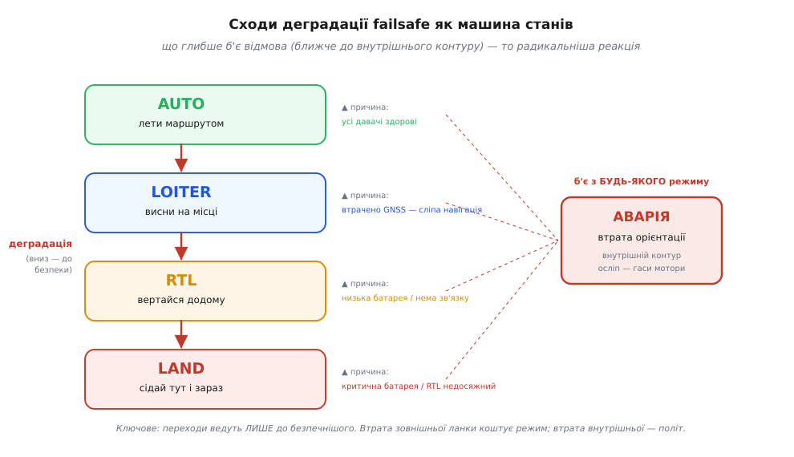
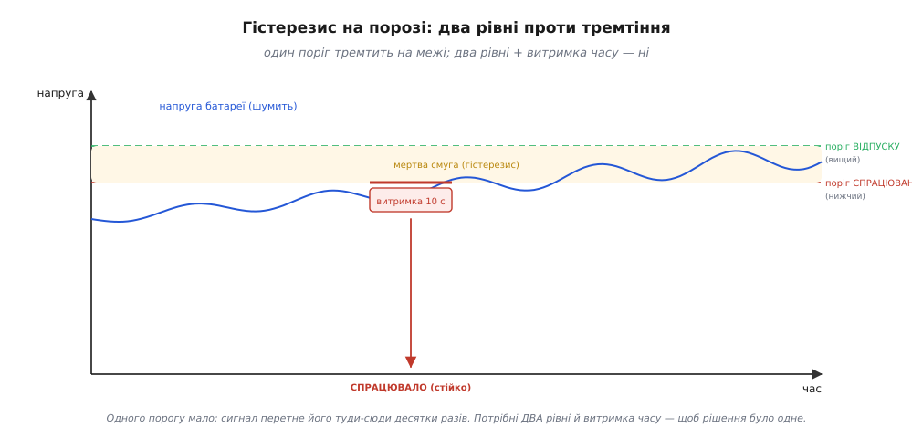

# ⚙️ Машина станів failsafe: коли щось пішло не так

**Задача.** У нас уже є контур, що тримає апарат у повітрі, і оцінювач, що поруч зі станом видає **прапорці здоров'я** давачів. Лишилося написати той рівень, що вирішує **як летіти** й **коли перемикатися**, коли ці прапорці починають гаснути один за одним. Не абстрактно, а в код прошивки: enum режимів, структуру здоров'я, і одну функцію `fsm_step()`, яку головний цикл кличе щотакту. Мета — щоб ти сам зміг прочитати цю логіку в чужому автопілоті й, головне, **не наступити на три граблі**, на яких провалюються саморобні failsafe: тремтіння на порозі, неправильний пріоритет одночасних відмов і небезпечний стан за замовчуванням.

Розберімо спершу, чому це взагалі окрема машина, а не просто пачка `if`-ів усередині контуру.

## Ідея: над контуром сидить арбітр режимів

Пригадаймо, чим різняться режими польоту: це різні **джерела уставки** для одного й того самого контуру. У `AUTO` уставку рахує навігація з маршрутних точок; у `LOITER` уставка — «стій, де стоїш»; у `RTL` — «лети на точку старту»; у `LAND` — «знижуйся, поки не торкнешся землі». Сам контур орієнтації однаковий у всіх чотирьох — міняється тільки те, **звідки береться бажаний стан** і **наскільки амбіційну мету** дозволено ставити.

А отже, «перемкнути режим failsafe» означає рівно одне: **перемкнути джерело уставки** на дешевше й безпечніше. І хтось мусить цей вибір робити — дивитися на прапорці здоров'я, на батарею, на зв'язок і вирішувати, який режим зараз дозволений. Цей «хтось» — окремий шматок логіки над контуром, **машина станів** (*state machine*): скінченний набір режимів плюс правила переходів між ними.

Чому саме машина станів, а не розсипані по коду перевірки? Бо режим — це **пам'ять**. Те, що апарат зробить наступної миті, залежить не лише від того, що зараз відмовило, а й від того, **у якому режимі він уже є**. Той самий сигнал «батарея просіла» означає різне залежно від того, летимо ми маршрут чи вже сідаємо. Розкидані `if`-и цю пам'ять втрачають і починають суперечити один одному; машина станів тримає її в одній змінній `current_mode` і в одному місці вирішує, куди з неї можна піти.


*Сходи деградації як машина станів. Нормальний політ угорі (AUTO), найбезпечніший стан унизу (LAND). Кожна відмова штовхає апарат на щабель нижче — до простішої, дешевшої за ресурсами мети: втрата GNSS знімає навігацію (AUTO→LOITER), критична батарея жене додому й далі на посадку (RTL→LAND). Осібно стоїть аварія: втрата орієнтації б'є з будь-якого режиму одразу, бо без неї немає чим керувати взагалі. Переходи ведуть тільки вниз, до безпеки, — ніколи назад до амбіцій, поки відмова не минула.*

Тримаймо цю картинку в голові — вона й є те, що ми зараз напишемо в коді.

## Крок 1: режими й прапорці здоров'я

Почнімо з двох структур даних. Перша — сам перелік режимів. Тут порядок значень **не випадковий**: я навмисно розкладаю їх від найамбітнішого (`AUTO`) до найбезпечнішого (`LAND`), щоб більше число означало «глибша деградація». Далі побачимо, як це впорядкування само підкаже, куди можна перемикатися, а куди — ні.

```c
typedef enum {
    MODE_AUTO   = 0,   // повний автономний політ: лети маршрутом
    MODE_LOITER = 1,   // висни на місці: втрачено абсолютне положення
    MODE_RTL    = 2,   // return-to-launch: вертайся на точку старту
    MODE_LAND   = 3,   // сідай тут і зараз — найбезпечніший стан
} mode_t;
```

Друга структура — те, що дає нам [оцінювач стану](root:embedded/imu-barometer): поруч із самим станом (крен, висота, положення) він видає **прапорці здоров'я** — коротку зведення про те, яким давачам зараз можна вірити. Оцінювач для того й існує, що зводить кілька давачів в одну оцінку, зважуючи кожен; побічно він **бачить**, коли якийсь давач перестав узгоджуватися з рештою. Ці спостереження він і пакує в прапорці:

```c
typedef struct {
    bool  gnss_ok;     // супутникове положення придатне (досить супутників, малий розкид)
    bool  imu_ok;      // орієнтація достовірна (гіро й акселерометр узгоджені)
    bool  baro_ok;     // висота з барометра придатна
    float batt_volt;   // напруга батареї, В
    bool  rc_link;     // є зв'язок із пультом / наземною станцією
} health_t;
```

Зверни увагу: `batt_volt` — це **число**, а не готовий прапорець `batt_ok`. Це навмисно. Порогів у батареї **два** (низький і критичний — про це нижче), і рішення про них ухвалює саме машина станів, а не оцінювач. Оцінювач постачає сирий факт «напруга така-то»; що вважати «низькою», а що «критичною», — це вже політика failsafe, і тримати її треба в одному місці. А от `gnss_ok`, `imu_ok`, `baro_ok` — уже готові прапорці, бо їх виводить сам оцінювач зі своєї внутрішньої математики (розкид оцінки, узгодженість давачів), і дублювати цю математику в машині станів немає сенсу.

> 🔧 **Навіщо це.** Межа «сирий факт vs готове рішення» — головне питання, коли проєктуєш інтерфейс між оцінювачем і логікою режимів. Правило просте: якщо поріг — це **фізика давача** (скільки супутників досить, який розкид оцінки терпимо), його місце в оцінювачі. Якщо поріг — це **політика апарата** (за скільки вольтів вертатися додому), його місце в машині станів. Змішаєш — і одна й та сама константа опиниться в двох файлах, розійдеться, і failsafe спрацює не там, де ти думав.

## Крок 2: скелет `fsm_step()` — від найтяжчого до найлегшого

Тепер серце вставки. Головний цикл щотакту кличе `fsm_step()`: та дивиться на здоров'я, на поточний режим — і повертає режим, у якому летіти далі. Найважливіше рішення тут — **порядок перевірок**. Він не косметичний: від нього прямо залежить, що апарат зробить, коли відмовить кілька речей одразу.

Правило порядку одне, і воно випливає з каскаду контурів: **чим ближче відмова б'є до внутрішнього контуру, то раніше її треба обробити**. Втрата орієнтації валить апарат за частки секунди — це найтяжче, отже перше. Батарея — питання секунд і хвилин, але вибору вона не лишає — друге. Втрата GNSS чіпає лише зовнішній, повільний контур — апарат не падає, лише «дурнішає» — отже останнє. Обробляємо згори вниз і на першому ж спрацюванні **виходимо**: тяжча відмова перекриває легшу.

Машину станів кличуть із того самого [фіксованого такту](root:embedded/autonomous-system/proj-control-loop.md), що й контур, — тож крок часу тут сталий і відомий наперед. Заведімо для нього одну константу; вона знадобиться таймерам витримки далі:

```c
#define FSM_HZ  50                     // failsafe-логіку доволі крутити 50 разів/с
#define FSM_DT  (1.0f / FSM_HZ)        // 0.02 с — сталий крок такту машини станів
```

Крок ми все одно передаємо в функцію параметром `dt` (щоб debounce-помічники лишалися загальними й придатними для повторного вжитку), але на фіксованій сітці `dt` щоразу дорівнює `FSM_DT`. Тепер сама функція:

```c
mode_t fsm_step(mode_t current, const health_t *h, float dt) {
    // ── 1. НАЙТЯЖЧЕ: втрата орієнтації б'є у внутрішній контур ──────────
    //     без достовірного крену/тангажа немає ЧИМ керувати — жоден
    //     зовнішній режим не має сенсу. Це аварія з будь-якого режиму.
    if (!debounce_imu(h->imu_ok, dt)) {
        return MODE_LAND;          // сідати наосліп краще, ніж перекинутись
    }

    // ── 2. БАТАРЕЯ: вибору не лишає, сходинка залежить від глибини ──────
    batt_level_t b = batt_classify(h->batt_volt);   // OK / LOW / CRITICAL (з гістерезисом)
    if (b == BATT_CRITICAL) {
        return MODE_LAND;          // не долетимо додому — сідай негайно тут
    }
    if (b == BATT_LOW) {
        return worse_of(current, MODE_RTL);   // час додому, але ще не аварія
    }

    // ── 3. ЗВ'ЯЗОК: пропав пульт — за планом вертаємось додому ──────────
    if (!debounce_link(h->rc_link, dt)) {
        return worse_of(current, MODE_RTL);
    }

    // ── 4. НАЙЛЕГШЕ: втрата GNSS чіпає лише зовнішній контур ────────────
    //     апарат не падає — лише не знає, ДЕ він. Знімаємо навігацію.
    if (!h->gnss_ok) {
        return worse_of(current, MODE_LOITER);
    }

    // ── 5. усе здорове: тримаємо поточний режим (можливе повернення) ────
    return current;
}
```

Прочитаймо, що тут відбувається, бо кожен рядок несе рішення.

Функція **не «додає» відмови**, а на першому ж спрацюванні `return`. Тому якщо одночасно впали орієнтація й GNSS, до перевірки GNSS справа взагалі не дійде — переможе аварія. Це і є пріоритет, зашитий у порядок коду, а не в купу вкладених `if`.

Далі — `worse_of(current, ...)`. Це ключ до того, щоб переходи вели **тільки вниз, до безпеки**. Пригадай, як ми впорядкували enum: більше число — глибша деградація. Тоді:

```c
static mode_t worse_of(mode_t a, mode_t b) {
    return (a > b) ? a : b;      // повертає ГЛИБШУ (безпечнішу) деградацію
}
```

Навіщо це, а не просто `return MODE_LOITER`? Бо уяви: апарат уже в `RTL` (вертається через низьку батарею), і тут відмовляє GNSS. Гола команда `return MODE_LOITER` перекинула б його з `RTL` (сходинка 2) назад у `LOITER` (сходинка 1) — тобто він **кинув би шлях додому й завис** посеред дороги з майже сідаючою батареєю. `worse_of(RTL, LOITER)` повертає `RTL` — глибшу деградацію — і апарат далі летить додому. Правило «ніколи не підіймайся до амбітнішого режиму через нову відмову» ми виражаємо однією функцією порівняння, а не десятком перевірок «а чи не гірше нам уже».

Виняток — саме батарея й орієнтація: там стоїть голий `return MODE_LAND`, **без** `worse_of`. Це теж навмисно. `LAND` — найглибша сходинка (значення 3, найбільше), тож для неї `worse_of` усе одно завжди повертав би `LAND`; писати його — лише зайвий шум. Критична батарея й втрата орієнтації **безумовні**: хай у якому режимі ти був, звідси один вихід — на землю.

> 🔧 **Навіщо це.** Порядок перевірок у `fsm_step()` — це і є твоя таблиця пріоритетів відмов, тільки записана виконуваним кодом. Коли читаєш чужий failsafe, читай його згори вниз саме так: перше `if` — найтяжча відмова, яку апарат мусить обробити раніше за все. Якщо в чужому коді батарея перевіряється **після** GNSS — це запах помилки: апарат ризикує зависнути в `LOITER` через втрату супутників, поки батарея сідає під нуль, замість летіти додому.

Три помічники — `debounce_imu`, `batt_classify`, `debounce_link` — я поки лишив «магічними». У них і ховаються всі три граничні випадки. Розкриймо їх по черзі: саме тут відрізняється робочий failsafe від такого, що виглядає правильно й убиває апарат на першому ж пориві вітру.

## Граничний випадок 1: гістерезис — щоб не тремтіло на порозі

Найпідступніша пастка — найпростіша на вигляд. Напишімо перевірку батареї «в лоб»:

```c
// НЕ РОБИ ТАК:
if (h->batt_volt < 14.0f) return MODE_RTL;
```

Виглядає бездоганно. І працює — рівно доти, доки напруга не підійде до 14.0 В. Тоді починається біда, і корінь її — фізика, а не код. Напруга батареї **не стоїть на місці**: під навантаженням мотора вона просідає, у паузі підіймається, а зверху на все це сідає шум вимірювання. Коли середнє значення тремтить рівно біля порогу, сигнал перетинає 14.0 В **десятки разів на секунду** — то трохи нижче, то трохи вище.

А тепер простеж, що робить наш `if`. Такт: 13.98 → `RTL`. Наступний такт: 14.02 → умова хибна, повертаємось у попередній режим. Ще такт: 13.97 → знову `RTL`. Апарат починає **сіпатися між режимами** десятки разів на секунду: то розвертається додому, то кидає цей намір, то знову розвертається. Уставка стрибає, контур шарпає мотори, і замість плавної реакції на слабку батарею ми маємо конвульсію. Ту саму хворобу видно на будь-якому одному порозі:


*Чому одного порогу мало. Напруга (синя лінія) плавно спадає, але дрижить від шуму й навантаження мотора. З одним порогом сигнал перетинав би його туди-сюди без кінця, і рішення миготіло б. Ліки — два рівні: спрацювати на нижчому, а відпустити лише на помітно вищому (мертва смуга між ними — гістерезис), плюс витримка часу: поки нижчий поріг не протримався кілька секунд поспіль, рішення не ухвалюється. Тоді перехід стається один раз і твердо.*

Ліки — **гістерезис** (гр. *hysteresis* — «відставання»): рознести поріг на **два** рівні. Спрацьовуємо на нижчому, а повертаємось назад лише коли сигнал підніметься до помітно вищого. Між ними — «мертва смуга», у якій рішення **не міняється** взагалі. Дрижання амплітудою в пів вольта більше не годне перекидати стан туди-сюди, бо щоб скасувати рішення, напрузі треба піднятися не на копійку, а через усю смугу.

І другий, незалежний запобіжник — **витримка часу** (*debounce*): вимагати, щоб умова протрималася істинною не одну мить, а кілька **секунд поспіль**. Короткий провал напруги під ривок газу сам собою ще не тривога; тривога — коли напруга сидить нижче порогу **стабільно**. Реальні автопілоти саме так і роблять: в ArduPilot батарейний failsafe спрацьовує, коли напруга тримається нижче `BATT_LOW_VOLT` **понад 10 секунд** — це і є витримка часу проти хибних спрацювань на провалах під навантаженням.

Зберімо обидва запобіжники в класифікатор батареї. Він тримає невелику **пам'ять** — поточний рівень і таймери, скільки часу умова вже виконується:

```c
typedef enum { BATT_OK, BATT_LOW, BATT_CRITICAL } batt_level_t;

// два пороги × дві межі кожен: нижня — спрацювати, вища — відпустити
#define V_LOW_TRIP   14.0f   // нижче цього — «низька» (додому)
#define V_LOW_CLEAR  14.6f   // вище цього — «низька» скасовується
#define V_CRT_TRIP   13.2f   // нижче цього — «критична» (сідай)
#define V_CRT_CLEAR  13.8f   // вище цього — «критична» скасовується
#define T_HOLD_S     10.0f   // умова має протриматись стільки секунд

static batt_level_t batt_classify(float v) {
    static batt_level_t level = BATT_OK;   // ПАМ'ЯТЬ: що вирішили минулого разу
    static float t_low = 0, t_crt = 0;     // таймери «умова тримається»

    // нагромаджуємо час, поки відповідний поріг пробито; інакше скидаємо
    t_crt = (v < V_CRT_TRIP) ? (t_crt + FSM_DT) : 0.0f;
    t_low = (v < V_LOW_TRIP) ? (t_low + FSM_DT) : 0.0f;

    switch (level) {
    case BATT_OK:
        if (t_crt >= T_HOLD_S)      level = BATT_CRITICAL;
        else if (t_low >= T_HOLD_S) level = BATT_LOW;
        break;
    case BATT_LOW:
        if (t_crt >= T_HOLD_S)      level = BATT_CRITICAL;  // глибше — одразу
        else if (v > V_LOW_CLEAR)   level = BATT_OK;        // відпуск — ЛИШЕ через верхню межу
        break;
    case BATT_CRITICAL:
        // з критичної НЕ повертаємось автоматично: сідання не скасовують
        break;
    }
    return level;
}
```

Тут кілька тонкощів, кожна з яких — окремий урок.

По-перше, `static` змінні. Класифікатор **мусить пам'ятати** свій попередній вихід — інакше гістерезису не буде фізично: щоб знати, який поріг застосувати (нижній для спрацювання чи верхній для відпуску), треба знати, у якому стані ти вже є. Тому `level`, `t_low`, `t_crt` живуть між викликами. Це та сама пам'ять, що робить машину станів машиною станів, тільки в мініатюрі.

По-друге, **відпуск лише через верхню межу**. Вийти з `BATT_LOW` можна тільки коли напруга перевищить `V_LOW_CLEAR` (14.6 В), а не просто підніметься вище `V_LOW_TRIP` (14.0 В). Ці 0.6 В і є мертва смуга: у ній рішення застигає й дрижанню нема куди його штовхати.

По-третє, з `BATT_CRITICAL` ми **не повертаємось автоматично** взагалі. Це навмисне рішення політики: якщо батарея хоч раз просіла до критичної, апарат уже сідає, і скасовувати посадку через те, що напруга на секунду підскочила (а вона підскочить, щойно ми зменшимо газ на зниженні!), — небезпечно. Один раз вирішили сідати — сідаємо.

> 🔧 **Навіщо це.** Гістерезис і debounce — не окраса, а мінімум, без якого будь-який поріг у реальному апараті непридатний. Правило: **жоден поріг у failsafe не буває один**. Щойно бачиш у чужому коді голе порівняння `if (x < THRESHOLD)` на аналоговій величині без пари «спрацювати/відпустити» й без витримки часу — це готовий генератор тремтіння, який на першому ж шумному сигналі почне смикати апарат. Пара порогів плюс таймер коштують десяток рядків і рятують політ.

Ті самі два запобіжники — і в перевірках орієнтації та зв'язку. `debounce_imu` вимагає, щоб `imu_ok` побув хибним кілька тактів поспіль, перш ніж кричати «аварія»: одиночний збій читання шини — ще не втрата орієнтації. `debounce_link` чекає кілька **секунд** тиші, перш ніж оголосити зв'язок утраченим, — бо радіозв'язок природно моргає, і рвати місію на кожне коротке завмирання означало б не долітати нікуди. Ось як виглядає узагальнений debounce, що годиться обом:

```c
// повертає «стабільно істинний»: true лише коли ok тримається >= hold секунд
static bool debounce_generic(bool ok, float dt, float hold, float *acc) {
    if (ok) { *acc = 0.0f; return true; }        // здорове — миттєво довіряємо
    *acc += dt;                                    // хворе — накопичуємо час
    return (*acc < hold);                          // ще true, поки не витримали hold
}

static bool debounce_imu(bool ok, float dt) {
    static float acc = 0.0f;
    return debounce_generic(ok, dt, 0.10f, &acc);  // ~100 мс: короткий збій шини — не аварія
}
static bool debounce_link(bool ok, float dt) {
    static float acc = 0.0f;
    return debounce_generic(ok, dt, 3.0f, &acc);   // 3 с тиші — тоді вважаємо зв'язок утраченим
}
```

Зверни увагу на асиметрію: **здоровому віримо миттєво** (`if (ok) { *acc = 0; return true; }`), а хворому — лише після витримки. Це навмисно: повертатися в довіру треба швидко (давач ожив — гаразд), а втрачати довіру — повільно (щоб короткий збій не зчинив хибну тривогу). Симетричний debounce тут був би гірший: він або надто повільно відновлював би довіру, або надто швидко її втрачав.

## Граничний випадок 2: пріоритет одночасних відмов

Ми вже заклали пріоритет у **порядок** перевірок, але цей випадок вартий окремого погляду, бо саме на ньому інтуїція найчастіше зраджує. Питання просте: якщо **одночасно** відмовили дві речі, яку обробляти першою?

Спокуслива, але хибна відповідь — «за терміновістю кожної окремо» чи «зберемо всі й виберемо найсуворішу реакцію». Правильна відповідь випливає з фізики каскаду й звучить так: **внутрішній контур важливіший за зовнішній**. Розгорнімо, чому.

Пригадай будову апарата: внутрішній контур орієнтації тримає його від перекидання й крутиться найшвидше (сотні герц), бо фізика падіння швидка. Зовнішній контур навігації веде його до цілі й оновлюється лічені рази на секунду, бо «долетіти» не горить. Звідси прямо випливає ціна кожної відмови:

- **Відмовив зовнішній контур** (пропав GNSS) — апарат **не падає**. Він лише не знає, *де* він над картою. Внутрішній контур далі тримає його рівно, барометр тримає висоту. Реакція може бути **неквапна**: зняти навігацію, зависнути. Втрата тут коштує **режим**, не політ.
- **Відмовив внутрішній контур** (втрата орієнтації) — апарат **перекидається за частки секунди**. Тут не до навігації: якщо ми не знаємо, де верх, будь-яка команда мотору однаково ймовірно рятує й убиває. Реакція мусить бути **негайна й радикальна**.

Тому коли обидва впали разом, обробити треба той, що б'є глибше, — внутрішній. Ось де інтуїція зраджує: людині здається, що «втрата положення» (не знаю, де я — страшно!) серйозніша за «шум в оцінці кута» (підумаєш, трохи трясе). Насправді ж навпаки: плутанина в положенні лишає апарат керованим і живим, а плутанина в орієнтації **вбиває його негайно**. Failsafe мусить служити фізиці, а не інтуїції.

У коді це вже зроблено — самим порядком `if`-ів: перевірка `imu` стоїть **перед** перевіркою `gnss`, і `return` на аварії не дає керуванню GNSS навіть виконатися. Але щоб не покладатися лише на візуальний порядок рядків (його легко зіпсувати при редагуванні), варто зробити пріоритет **явним і таким, що сам себе перевіряє**. Ось альтернативний виклад тієї самої логіки — через таблицю пріоритетів, де кожна відмова має явний ранг:

```c
// кожна активна відмова дає кандидат-режим; беремо той, що з НАЙГЛИБШОЮ
// деградацією. Ранг зашитий у значення mode_t (більше = безпечніше/тяжче).
mode_t fsm_step_ranked(mode_t current, const health_t *h, float dt) {
    mode_t target = current;   // за замовчуванням — лишитись, де є

    // від найлегшої відмови до найтяжчої; кожна лише ПОГЛИБЛЮЄ ціль
    if (!h->gnss_ok)                         target = worse_of(target, MODE_LOITER);
    if (!debounce_link(h->rc_link, dt))      target = worse_of(target, MODE_RTL);
    if (batt_classify(h->batt_volt) == BATT_LOW)      target = worse_of(target, MODE_RTL);
    if (batt_classify(h->batt_volt) == BATT_CRITICAL) target = worse_of(target, MODE_LAND);
    if (!debounce_imu(h->imu_ok, dt))        target = worse_of(target, MODE_LAND);

    return target;
}
```

Тут пріоритет виражений не порядком виходу, а функцією `worse_of`: скільки б відмов не спрацювало одночасно, `target` збереться до **найглибшої** деградації серед усіх активних. Порядок рядків тепер узагалі не важить — переставиш їх, результат той самий, бо `worse_of` комутативна (`worse_of(a,b) == worse_of(b,a)`). Це **надійніше** за перший варіант із ранніми `return`, де випадкова перестановка рядків при редагуванні тихо зламала б пріоритет. Ціна — ми щотакту проганяємо всі перевірки, а не виходимо на першій; для п'яти дешевих умов це нічого не варте.

> 🔧 **Навіщо це.** Пріоритет «внутрішній контур над зовнішнім» — не деталь коду, а **закон безпеки автономних апаратів**. Формулюй його собі так: *чим швидше відмова здатна вбити апарат, то раніше й радикальніше на неї реагуй, незалежно від того, наскільки лячно вона звучить.* Втрата GNSS звучить страшніше, ніж «варіанси оцінки кута підросли», а насправді друге куди смертельніше. Розкладаючи чужий failsafe, перевір саме це: чи стоїть реакція на відмову орієнтації/інерціалки **вище** за реакцію на відмову положення. Якщо ні — апарат при подвійній відмові кинеться рятувати не те.

Один нюанс реального життя, який варто знати. У другому варіанті я двічі викликав `batt_classify()` — а він тримає `static`-стан і накопичує таймери. Двічі за такт викликати класифікатор із побічним ефектом — помилка: таймери набіжать удвічі швидше. У робочому коді класифікатор кличуть **раз** на такт, а результат кладуть у змінну:

```c
    batt_level_t b = batt_classify(h->batt_volt);   // раз на такт!
    if (b == BATT_LOW)      target = worse_of(target, MODE_RTL);
    if (b == BATT_CRITICAL) target = worse_of(target, MODE_LAND);
```

Це типова пастка функцій із пам'яттю: вони виглядають як звичайні предикати, але кликати їх треба рівно стільки разів, скільки минуло тактів. Тримай побічний ефект (накопичення часу) окремо від запитів до результату.

## Граничний випадок 3: безпечний стан за замовчуванням

Останній випадок — найтихіший і найнебезпечніший, бо він про те, що станеться, коли **сам код failsafe** зламається або зустріне ситуацію, якої автор не передбачив. І тут є два світи, що відрізняються однією літерою в назві, а наслідком — життям апарата.

**Fail-open** — «відмова у відкритий стан»: якщо щось незрозуміле, лишаємо все як є, нічого не блокуємо, летимо далі. **Fail-safe** — «відмова в безпечний стан»: якщо щось незрозуміле, переходимо в найбезпечніший відомий режим. Для дверей крамниці fail-open розумний: зникло живлення — двері відмикаються, люди виходять. Для автономного апарата в повітрі fail-open — **вирок**: «летіти далі, що б не сталося» означає летіти й тоді, коли керувати вже нічим.

Де це проявляється? Розгляньмо `switch` за режимами — типова форма машини станів:

```c
// НЕ РОБИ ТАК:
switch (current) {
    case MODE_AUTO:   run_auto();   break;
    case MODE_LOITER: run_loiter(); break;
    case MODE_RTL:    run_rtl();    break;
    case MODE_LAND:   run_land();   break;
    // default немає — а що, як current якимось дивом став 7?
}
```

Поки `current` завжди один із чотирьох, усе гаразд. Але змінна в пам'яті може зіпсуватися — від збою пам'яті, космічної частинки, помилки в іншому шматку коду, що записав сміття не туди. І от `current` раптом дорівнює 7. `switch` без `default` **не робить нічого**: жодна гілка не підходить, керування просто випадає з `switch`, мотори лишаються з останньою командою — апарат летить наосліп із застиглим газом. Це fail-open у чистому вигляді, і він тим підступніший, що в 99.99% часу код працює бездоганно.

Fail-safe вимагає **завжди** мати `default`, і він мусить вести в безпеку:

```c
switch (current) {
    case MODE_AUTO:   run_auto();   break;
    case MODE_LOITER: run_loiter(); break;
    case MODE_RTL:    run_rtl();    break;
    case MODE_LAND:   run_land();   break;
    default:
        // невідомий режим = зіпсований стан. НЕ довіряй, сідай.
        current = MODE_LAND;
        run_land();
        log_error("FSM: невідомий режим, аварійна посадка");
        break;
}
```

Той самий принцип діє на кожному рівні, не лише в диспетчері режимів. Ініціалізуй `current_mode` **безпечним** значенням, а не `AUTO`: поки система не переконалася, що всі давачі живі й апарат готовий, режим за замовчуванням — не «лети маршрутом», а «стій на землі, роззброєний». Прапорці здоров'я ініціалізуй **у хибне** (`false`), а не в `true`: доки оцінювач не підтвердив, що давач працює, вважаємо його непридатним. Це називають «презумпцією несправності»: нове, ще не перевірене — винне, поки не доведе протилежне.

```c
// правильна ініціалізація: усе винне, поки не доведе здоров'я
static mode_t  current_mode = MODE_LAND;   // НЕ AUTO
static health_t health = {
    .gnss_ok = false, .imu_ok = false, .baro_ok = false,
    .batt_volt = 0.0f, .rc_link = false,   // 0 В прочитається як критична — і добре
};
```

Дивись, як гарно тут складається головоломка: `batt_volt` ініціалізовано нулем, а нуль менший за будь-який поріг — тож поки перший реальний вимір напруги не прийшов, батарея вважається критичною. Апарат фізично не зможе злетіти на «порожньому» стані здоров'я, бо той стан сам себе тлумачить як «усе погано». Це і є fail-safe за побудовою: не «не забути перевірити», а **зробити небезпечний стан недосяжним** через самі початкові значення.

Є, звісно, межа. Fail-safe означає «найбезпечніший **досяжний** стан», а не «магічно врятуватися». Якщо відмовила орієнтація, `MODE_LAND` теж працює погано — сідати без знання, де верх, важко. Але «сідати абияк» усе одно **краще**, ніж «летіти абияк»: керована втрата висоти з обмеженим газом зазвичай закінчується розбитим апаратом, а політ наосліп на повному газі — апаратом, що влетів у людей. Fail-safe не обіцяє щасливого кінця в кожній відмові; він обіцяє **найменш поганий** із досяжних. Це вже величезна різниця.

> 🔧 **Навіщо це.** «Безпечний стан за замовчуванням» — це спосіб мислення, не одна перевірка. Питай про кожну гілку коду failsafe: *а що станеться, якщо сюди прийде значення, якого я не чекав?* Немає `default` у `switch` — питання без відповіді, а отже дірка. Прапорець здоров'я стартує з `true` — апарат довіряє неперевіреному давачу й може злетіти на брехні. Правило коротке: **невідоме = небезпечне = сідай**. Апарат, спроєктований так, у найгіршому разі впаде керовано; спроєктований на fail-open — полетить некеровано, і це набагато гірший кінець.

## Складність і пастки: що ми навмисно спростили

Скелет вище — робочий кістяк, але справжній failsafe навколо нього обростає ще кількома шарами, і чесно окреслити їхні межі важливо, щоб ти не сприйняв цей код за повний автопілот.

**Переходи — це подія, не лише стан.** Наш `fsm_step()` повертає режим, але справжня машина станів на **зміні** режиму часто мусить щось зробити один раз: перерахувати уставку (перейшли в `RTL` — обчислити курс на дім), сповістити телеметрію, записати в журнал причину. Це логіка `on_enter(mode)`, яку кличуть, коли `new != current`, а не щотакту. Ми її винесли за дужки, щоб не затуляти головне — арбітраж пріоритетів.

**Повернення вгору — окрема політика.** Наш код легко спускається сходами, але майже не підіймається (крім батареї, що самоскасовується через гістерезис). У житті питання «чи можна вертатися з LOITER в AUTO, коли GNSS ожив» — тонке. Часто відповідь «ні автоматично»: відновлення амбіцій віддають пілотові або дозволяють лише за суворих умов і з витримкою. Автоматичне «стрибання» вгору-вниз на межі здоров'я давача — джерело нових бід, тож здебільшого сходами вниз ідуть самі, а вгору — лише свідомо.

**Сторож самого мозку.** Уся ця машина марна, якщо зависне процесор, що її крутить. Тому над нею стоїть [апаратний сторожовий таймер](root:sf-devices/watchdog): якщо головний цикл перестав «годувати» його вчасно, він перезавантажує контролер — останній рубіж, коли навіть failsafe-логіка мертва. Це вже не частина машини станів, а рівень під нею, але без нього все вищесказане тримається на припущенні, що код узагалі виконується.

**Пороги — не з голови.** Числа `V_LOW_TRIP`, `T_HOLD_S` і решта я взяв правдоподібними для ілюстрації; у реальному апараті їх виводять із хімії конкретної батареї, ваги апарата й часу, потрібного на посадку. Замалий запас — і апарат не долетить додому; завеликий — і він сідатиме з половиною заряду щоразу. Це окрема інженерна робота, не константа зі стелі.

Але **кістяк** уже правильний, і він переносний на будь-який автономний апарат, не лише літальний: enum режимів від амбітного до безпечного, прапорці здоров'я від оцінювача, `fsm_step()` з перевірками **від найтяжчої відмови до найлегшої**, `worse_of` для переходів **тільки вниз**, гістерезис і debounce на **кожному** порозі, і безпечний стан **за замовчуванням** усюди. Нарости на цей кістяк події входу в режим, політику повернення й сторожа — і вийде те, що в дорослих прошивках і зветься підсистемою failsafe: той тихий шар, який нічого не робить у нормальному польоті й одного разу рятує апарат, коли все пішло не так.
