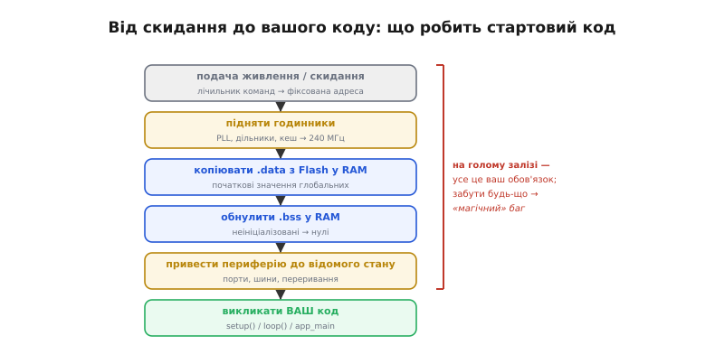
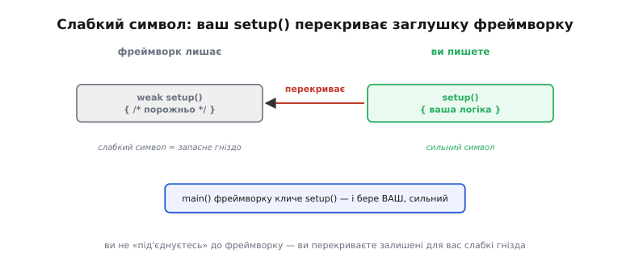
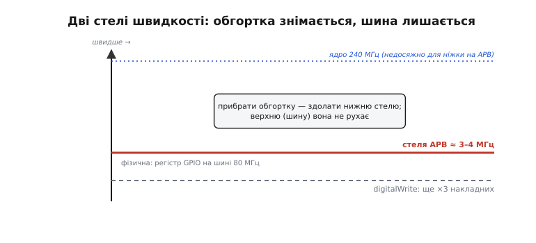
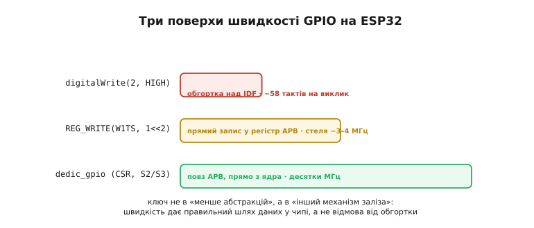
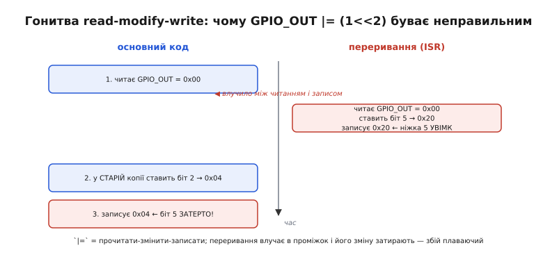
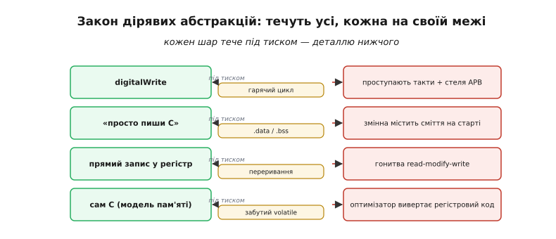

# «Голе залізо» vs фреймворк: механіка ціни абстракції

У базовому кроці ми зважили торгівлю на рівні здорового глузду: фреймворк дарує читабельність, швидкість розробки й переносність, а бере накладні витрати, розмір і віддаль від заліза; беремо його за замовчуванням, до регістрів сходимо точково. Це правильна карта — але карта без масштабу. «Накладні витрати» — це **скільки** тактів і **на що** вони витрачені? «Готовий `main()` зі стартовими приготуваннями» — що там насправді відбувається, поки ваш `setup()` іще й не покликано? «Прямий запис у регістр» — а чи він завжди правильний, чи буває тихо-хибним? І чому, коли `digitalWrite` поводиться не так, полагодити його не можна, не пірнувши **крізь** обгортку?

Тут ми пірнаємо. Візьмемо ту саму дію — перемкнути ніжку — і **розберемо її до кінця**: від миті ввімкнення живлення, крізь роботу лінкера, всередину самого виклику, аж до фізичної стелі, об яку впирається навіть найшвидший прямий запис. Наприкінці «ціна абстракції» перестане бути гаслом і стане набором чисел, які ви вмієте вивести й перевірити самі. Нитку ведемо тим самим маршрутом — навіщо, тоді інтуїція, тоді механіка, тоді приклад, — але щоразу на поверх глибше.

## Що фреймворк робить, поки ваш код ще спить

Почнімо з місця, яке базовий крок згадав одним рядком — «готовий `main()` зі стартовими приготуваннями». За цим рядком ховається чи не найбільша, найтихіша послуга фреймворку. Бо коли на чип подають живлення, там **немає ні `main()`, ні `setup()`, ні навіть заповнених змінних**. Є лічильник команд, що вказує на фіксовану адресу, і купа регістрів у стані «як після скидання». Усе, що перетворює це на середовище, де працює звичайний C, хтось мусить зробити **до** вашого коду. На голому залізі — ви. У фреймворку — він.

Розберімо, з чого це «приготування» складається, бо саме розуміння цих кроків відрізняє того, хто просто пише `setup()`, від того, хто знає, на чому той `setup()` стоїть.

**Скидання й вектор.** Після ввімкнення живлення чи скидання процесор починає виконувати код із наперед визначеної адреси — точки входу. На голому залізі ви самі маєте покласти туди щось осмислене; на кожному чипі це «щось» різне. Фреймворк (а точніше — його [завантажувач](topic:programming/bootloader) і стартовий код) уже поклав туди правильну послідовність.

> 🔧 **Навіщо це.** Найпоширеніший «магічний» баг новачка на голому залізі — глобальна змінна, ініціалізована значенням, яке в рантаймі виявляється сміттям, або нуль, що насправді не нуль. Дев'ять разів із десяти причина — пропущений або поламаний стартовий код: `.data` не скопійовано, `.bss` не обнулено. Фреймворк робить це за вас беззвучно й безпомилково; коли ви спускаєтеся на голе залізо, цей обов'язок мовчки переходить до вас, і забути про нього легко.

**Ініціалізація пам'яті: `.data` і `.bss`.** Ось найтонше місце, і його варто розписати, бо воно пояснює, **чому** C-програма взагалі працює. Коли ви пишете `int counter = 42;` як глобальну змінну, число `42` мусить десь жити на момент старту. У прошивці є два різні регіони пам'яті: **Flash** (незмінна, переживає вимкнення) і **RAM** (швидка, змінна, але порожня після ввімкнення). Змінна `counter` живе в RAM — та RAM після скидання не містить `42`, вона містить сміття. Отже, значення `42` зберігають у Flash, а стартовий код **копіює** його звідти в RAM, перш ніж почнеться `main()`. Цей регіон ініціалізованих даних зветься **`.data`** (англ. *data* — дані).

Друга частина — **`.bss`** (назва історична, від «Block Started by Symbol» в асемблері IBM 1950-х; сьогодні це просто «неініціалізовані глобальні дані»). Змінні на кшталт `int total;` без явного значення C зобов'язує вважати нулями. Тримати в Flash тисячу нулів марно — тож їх там **немає**; натомість стартовий код проходить весь регіон `.bss` у RAM і **заповнює його нулями** власноруч.

```
Flash (незмінна)                    RAM (порожня після скидання)
┌────────────────────┐             ┌────────────────────┐
│ код програми        │             │                    │
│ константи (.rodata) │             │                    │
│ образ .data: 42, …  │──копіювати─▶│ .data: 42, …       │  ← ініціалізовані
│                     │             │ .bss:  0, 0, 0, …  │  ← обнулити на місці
└────────────────────┘             └────────────────────┘
                          ▲                    ▲
                   робить стартовий код ДО main()
```

На AVR (той самий ATmega, що в класичному Arduino Uno) ці два кроки виконують підпрограми з незвично прямими іменами — `__do_copy_data` і `__do_clear_bss`; їх автоматично долінковує компілятор, і викликаються вони в секціях `.init`, ще до `main`. `__do_copy_data` тягне початкові значення з програмної пам'яті інструкціями `lpm` і кладе їх у `.data`; `__do_clear_bss` циклічно пише нуль у діапазон від `__bss_start` до `__bss_end`. (Джерело — документація avr-libc, розділ Memory Sections.) На ESP32 ту саму роботу робить порт-шар ESP-IDF у функції `call_start_cpu0`, який «ініціалізує базове середовище виконання C (CRT)» — саме тими двома кроками, лише під іншу архітектуру. Ідея одна, реалізація різна: це і є та переносність, яку фреймворк дарує безкоштовно.

**Годинники, живлення, кеш.** Свіжий чип часто працює на повільному внутрішньому генераторі; щоб дістати повні 240 МГц, треба налаштувати PLL, дільники, увімкнути кеш інструкцій, підняти напруги. Це десятки записів у регістри в точній послідовності, і помилка тут — не «неправильний біт на ніжці», а зависання всього чипа. Фреймворк проходить цю послідовність за вас.

**Аж тоді — виклик вашого коду.** І лише коли пам'ять готова, годинники підняті, периферію приведено до відомого стану, керування нарешті передають туди, де його чекаєте ви: у `main()`, який кличе `setup()` один раз і `loop()` по колу. У базовому кроці ми бачили, що [цей `main()` надає фреймворк](topic:programming/bootloader); тепер видно **обсяг** того, що він приховав.


*Від подачі живлення до вашого `setup()`. Процесор стартує з фіксованої адреси; стартовий код піднімає годинники, копіює `.data` з Flash у RAM, обнуляє `.bss`, приводить периферію до відомого стану — і лише тоді кличе ваш код. На голому залізі кожен із цих кроків — ваш обов'язок; забути будь-який означає «магічний» баг, який неможливо пояснити з рівня самої програми.*

На ESP32 є ще одна тонкість, варта згадки саме тут: `app_main` в ESP-IDF — це не «функція, яку викликали», а **задача операційної системи реального часу**. Її запускає планувальник [FreeRTOS](topic:programming/freertos) як окрему нитку з фіксованим пріоритетом і налаштовним розміром стека. Незвично й те, що ця задача **може повернутися** (на відміну від класичного `main`, з якого повертатися нікуди): якщо `app_main` завершиться, FreeRTOS просто прибере задачу, а решта системи працюватиме далі. Тобто на ESP32 «фреймворк дає `main()`» насправді означає «фреймворк уже підняв цілу операційну систему, а ваш код — одна з її задач». Обсяг схованого тут іще більший, ніж на 8-бітному AVR.

## Як лінкер збирає фреймворк докупи: `.a`-архіви й слабкі символи

Є ще один шар, який базовий крок оминув зовсім, а він пояснює **дуже практичну** річ: чому величезний фреймворк не роздуває вашу крихітну прошивку, і як виходить, що ви пишете `setup()`, а `main()`, якого ви не бачили, його акуратно кличе. Обидві магії — робота [лінкера](topic:programming/compilation) з **статичними бібліотеками**.

Фреймворк постачають не як гору `.c`-файлів, а як **статичні бібліотеки** — архіви з розширенням `.a` (від *archive*). Архів — це просто набір заздалегідь скомпільованих об'єктних файлів, складених в одну коробку. І тут працює правило лінкера, яке варто знати напам'ять, бо на ньому тримається пів-екосистеми вбудованого коду:

> Лінкер бере з архіву **лише ті об'єктні файли, у яких є символ, потрібний комусь із уже включеного коду**. Решту — навіть якщо в архіві сотні функцій — він **не тягне** взагалі.

Звідси прямий наслідок: ви лінкуєтеся з усім гігантським фреймворком, а у вашу прошивку потрапляє лише те, що ваш код справді **викликає**, прямо чи опосередковано. Не покликали Wi-Fi — стек Wi-Fi у бінарник не ввійде. Саме тому «блималка» на ESP-IDF важить кілограми вихідників, а виходить прошивкою в десятки кілобайт, а не мегабайт. Абстракція тут дешева не тому, що її мало, а тому, що **лінкер відсікає невикористане**.

> 🔧 **Навіщо це.** Правило «архів тягнеться за посиланням» пояснює цілий клас загадкових помилок збірки. Класична — «undefined reference» на функцію, яка *точно є* в бібліотеці: причина зазвичай у **порядку** бібліотек у команді лінкера (лінкер переглядає архів лише раз, у місці, де той стоїть, і якщо потреба виникла *пізніше*, він уже не повернеться). Інша — обробник переривання, який ви написали, але який «не спрацьовує»: його об'єктний файл ніхто не викликає за іменем, тож лінкер його **викинув**. Розуміння цього правила рятує години.

Тепер друга магія — як ваш `setup()`/`loop()` (чи `app_main`) стикується з `main()`, якого ви ніколи не писали. Тут вступають **слабкі символи** (*weak symbols*). Символ (ім'я функції чи змінної) буває **сильним** або **слабким**. Правило лінкера: якщо є сильне визначення — беруть його; слабке ж є лише **запасним варіантом**, який діє, тільки поки сильного немає.

Фреймворк оголошує певні точки як слабкі й дає їм порожні або типові тіла. Коли ви пишете **свою** функцію з тим самим іменем, ваше визначення — сильне — **перекриває** слабку заглушку. Так фреймворк каже: «ось де буде твоя логіка; не напишеш — піде заглушка, напишеш — піде твоє». Ваш `setup()` — сильний символ, що заступає місце, залишене для нього. Ви не «під'єднуєтесь» до фреймворку — ви **перекриваєте** підготовлені ним слабкі гнізда.

Тут ховається одна каверза, специфічна саме для статичних бібліотек, і про неї варто знати. У статичному архіві пошук символу **зупиняється на першому знайденому** — навіть якщо це слабкий символ, а десь далі в архіві лежить сильний. Це відрізняється від поведінки з окремими об'єктними файлами й буває джерелом дуже неочевидних багів, коли ваша сильна реалізація «чомусь не перемогла» слабку з бібліотеки. (Джерело — Wikipedia, «Weak symbol», розділ про семантику в статичних бібліотеках.) Практичний вихід, коли треба **силою** втягнути весь архів попри це правило, — прапорець лінкера `--whole-archive` (обгорнути `-Wl,--whole-archive … -Wl,--no-whole-archive`), який каже: «візьми всі об'єктні файли з цього архіву, використані вони чи ні». Фреймворки застосовують його точково — саме щоб гарантовано втягнути стартовий код і таблиці, які інакше ніхто б не «покликав» за іменем і які лінкер відсік би.


*Механіка слабких символів. Фреймворк лишає `setup()` і `loop()` як слабкі заглушки (запасні гнізда). Напишете свою функцію з тим самим іменем — ваш сильний символ перекриє заглушку, і `main()` фреймворку покличе саме ваш код. Не напишете — лишиться порожня заглушка. Ви не «під'єднуєтесь» до фреймворку, а перекриваєте залишені для вас місця.*

Ці два механізми — вибіркове втягування з архіву й слабкі символи — і роблять фреймворк тим, чим він є з погляду збірки: **великою бібліотекою можливостей, з якої ви безкоштовно берете лише потрібне, стикуючись через наперед підготовлені гнізда**. Голе залізо — це коли гнізд немає й `main()` пишете ви самі, з нуля, разом з усім стартовим кодом вище.

## Усередині `digitalWrite`: звідки беруться десятки тактів

Базовий крок дав оцінку «≈ 40 тактів» і слушно зауважив, що на 240 МГц це частки мікросекунди. Тепер розберімо **точно**, з чого ці такти складаються — бо саме в цьому розкладі видно, за що ви платите, і чому та плата зазвичай виправдана.

Виміряти можна прямо. Незалежні заміри на ESP32 дають так: **два виклики `digitalWrite` — 244 нс, тобто 58 тактів; прямий `REG_WRITE(GPIO_OUT_W1TS_REG, …)` — 92.5 нс, тобто 22 такти** (по 11 тактів на запис). (Джерело — виміри у форумі ESP32, тема «Instruction execution times».) Отже, один `digitalWrite` — близько 29 тактів на цьому вимірі, прямий запис — близько 11; відношення ~2.6×. У базовому кроці ми округлили до «десятків тактів проти одного-трьох» — тепер бачимо точні числа й трохи вужче відношення, ніж «у 20 разів» на грубій оцінці. (Точні цифри залежать від версії ядра, налаштувань кешу й того, чи код виконується з IRAM; порядок величини стабільний.)

Куди ж ідуть ці ~29 тактів? Зазирнімо у справжній ланцюг викликів Arduino-ядра для ESP32. `digitalWrite(pin, val)` веде до `__digitalWrite`, який:

1. **перевіряє, чи пін узагалі зареєстрований як GPIO** — викликом `perimanGetPinBus(pin, ESP32_BUS_TYPE_GPIO)` (на ESP32 одна ніжка може бути віддана під SPI, I²S, АЦП — і фреймворк стереже, щоб ви не смикали як GPIO те, що зараз працює периферією);
2. якщо перевірка не пройшла — **пише повідомлення про помилку** («спершу викличте `pinMode`»);
3. якщо пройшла — кличе **ще один шар**, `gpio_set_level()` з ESP-IDF, і вже той складає адресу регістра, будує бітову маску й робить власне запис.

(Джерело — `cores/esp32/esp32-hal-gpio.c` у репозиторії arduino-esp32.) Ось звідки такти: перевірка таблиці периферії, ще один рівень непрямого виклику, складання маски й адреси в рантаймі — усе те, що на голому залізі ви або робите заздалегідь, або не робите взагалі, бо «і так знаєте», що ніжка вільна й маска стала.

І тут головна думка, тонша за «функція повільніша за запис»: **кожен зайвий такт тут купує вам щось конкретне**. Перевірка `perimanGetPinBus` — це страховка від класу помилок, де ви ламаєте роботу периферії, випадково смикнувши зайняту ніжку. Другий шар (`gpio_set_level`) — це і є та **переносність**: той самий `digitalWrite` працює на ESP32, ESP32-S3, ESP32-C3, хоч регістри в них різні, бо нижній шар підставляє правильні. Ви платите тактами за страховку й переносність — і для 99 % коду це чудова угода.

**Розклад ціни `digitalWrite` на ESP32 (Arduino-ядро, орієнтовно).**

```
perimanGetPinBus() — перевірка, чи пін зараз GPIO   ≈  8–10 тактів
непрямий виклик gpio_set_level() (ще один шар)      ≈   4–6 тактів
складання маски (1<<pin) і вибір регістра в рантаймі≈   6–8 тактів
власне запис у регістр W1TS/W1TC                    ≈   1–3 такти
─────────────────────────────────────────────────────────────────
разом                                              ≈  20–29 тактів ≈ ~0.1 мкс
```

Порівняйте з нижнім рядком — «власне запис» коштує 1–3 такти. Тобто **корисної роботи** тут на пару тактів, а решта — ціна зручності й безпеки. У гарячому циклі ця решта раптом стає всім; у звичайному коді її не видно. Це кількісне обличчя того компромісу, який у базовому кроці ми лише назвали.

## Дві стелі швидкості: коли зняти обгортку — і коли це вже не поможе

Тепер — випадок, який базовий крок згадав, але не розкрив: гарячий цикл, де смикають ніжку мільйони разів на секунду. Тут криється найпповчальніша межа всієї теми, і повз неї легко пройти, якщо думати лише «менше абстракцій = швидше». Насправді стель **дві**, і зняття обгортки долає лише одну.

**Перша стеля — обгортка.** Це ті ~29 тактів на `digitalWrite`. Прибрали виклик, пишете в регістр напряму — і впали до кількох тактів. Пришвидшення реальне, у рази. Але.

**Друга стеля — сама шина.** Регістри GPIO на ESP32 живуть не «в ядрі», а на периферійній шині **APB**, яка тактується повільніше за процесор — типово **80 МГц** проти 240 МГц ядра. Кожен запис у GPIO-регістр мусить пройти цю шину, і на неї ж накладаються буферні затримки. Тому навіть **ідеальний** прямий запис не даватиме перемикань з частотою ядра: практична стеля «смикання ніжки» через APB виходить куди нижчою — порядку **кількох мегагерців**, а не сотень. (Джерело — виміри й пояснення у форумі ESP32; про природу обмеження прямо каже документація: простий механізм GPIO застосовує сигнали через шину APB, яка повільніша за ядро.)

Ось чому «прибрати обгортку» — це здолати **нижню** стелю, але **верхньої** (шини) воно не рухає ні на такт. Якщо вам треба смикати ніжку швидше за кілька мегагерців, відмова від `digitalWrite` вас туди не донесе — ви впритул до фізики шини.

І тут — найкрасивіший поворот теми, який перевертає наївне «швидкість = менше абстракцій». Espressif додала в новіші чипи (ESP32-S2, S3) окремий механізм — **виділений GPIO** (*dedicated GPIO*, `dedic_gpio`): певні ніжки під'єднують так, що ядро керує ними **власними інструкціями, повз шину APB**. Офіційна документація прямо каже: це дає «високу швидкість перемикання GPIO», а «пучок GPIO можна перемкнути за **один такт ядра**». Тобто ви пробиваєте **верхню** стелю — не прибиранням абстракції, а **іншим шляхом даних у кремнії**.


*Дві стелі перемикання ніжки. Прибрати обгортку `digitalWrite` — здолати нижню стелю (десятки тактів на виклик). Але лишається верхня: регістр GPIO сидить на шині APB (~80 МГц) із буферами, тож практична стеля прямого запису — лише кілька мегагерців, хоч ядро й на 240 МГц. Прибирання абстракції її не рухає. Пробити її можна лише іншим механізмом заліза — виділеним GPIO, що керується інструкціями ядра повз APB.*

Звідси урок, тонший за все, що каже базовий крок: **швидкість дає не «відмова від абстракції», а правильний шлях даних у чипі.** Виділений GPIO — це, до речі, теж абстракція (зі своїм API `dedic_gpio_*` в ESP-IDF); просто вона лягає на **інший**, швидший механізм заліза. Наївне «менше шарів = швидше» тут ламається двічі: голий запис у APB не швидший за стелю шини, а «більш абстрактний» виділений GPIO — швидший за голий запис у ту саму шину. Питання завжди не «скільки шарів», а «**який механізм заліза під ними**».


*Три поверхи швидкості на ESP32. Зверху `digitalWrite` — обгортка над IDF, десятки тактів. Посередині прямий запис у регістр APB (`REG_WRITE`/`GPIO.out_w1ts`) — швидше, але впирається в стелю шини ~кілька МГц. Знизу виділений GPIO (`dedic_gpio`, S2/S3) — керування з ядра повз APB, пучок за один такт. Швидкість зростає не від «менше абстракцій», а від зміни механізму заліза.*

> 🔧 **Навіщо це.** Практичний висновок для реального проєкту: перш ніж «оптимізувати» гарячий цикл прибиранням `digitalWrite`, з'ясуйте, об **яку** стелю ви впираєтесь. Якщо треба ~1 МГц — прямий запис у регістр рятує. Якщо треба десятки мегагерців (бітбенг швидкого протоколу, генерація сигналу) — жоден прямий запис у APB не поможе, потрібен виділений GPIO або взагалі апаратна периферія (SPI, I²S, RMT), спроєктована саме під це. Оптимізувати не ту стелю — марно спалити день і не зрушити швидкість.

## Прихована пастка прямого доступу: гонитва read-modify-write

Досі ми говорили про голе залізо як про «швидше, але марудніше». Тепер — межа, про яку базовий крок мовчить зовсім, а вона перевертає наївне уявлення «прямий запис у регістр — це завжди щира правда й повний контроль». Виявляється, найтиповіший спосіб писати «голим залізом» буває **тихо неправильним** — і саме тому, що ви прибрали шар, який про цю пастку знав.

Згадаймо канонічний рядок голого заліза з базового кроку: `GPIO_OUT |= (1 << 2);`. Виглядає як одна дія — «підняти біт 2». Насправді оператор `|=` — це **три** дії: **прочитати** весь регістр `GPIO_OUT`, **змінити** в прочитаній копії потрібний біт, **записати** копію назад. Англійською цю трійцю звуть *read-modify-write* (прочитати-змінити-записати). І між «прочитати» та «записати» є **проміжок** — крихітний, але ненульовий.

Тепер уявімо, що під час цього проміжку спрацьовує [переривання](root:embedded/polling-vs-interrupts), а його обробник теж чіпає `GPIO_OUT` — скажімо, вмикає біт 5. Розгляньмо послідовність по кроках:

```
основний код: читає GPIO_OUT           → бачить 0x00
   ── тут влучає переривання ──
   ISR: читає GPIO_OUT   → 0x00
   ISR: ставить біт 5    → 0x20
   ISR: записує 0x20     → ніжка 5 УВІМКНЕНА
   ── переривання завершилось, керування назад ──
основний код: у СВОЇЙ старій копії (0x00) ставить біт 2 → 0x04
основний код: записує 0x04             → біт 5 ЗАТЕРТО, ніжка 5 знову ВИМК!
```

Основний код записав назад **стару** копію, у якій біта 5 ще не було, — і мовчки скасував роботу переривання. Ніжка 5 блимнула й погасла, хоч у коді ISR усе бездоганно. Це **гонитва** (*race condition*): результат залежить від того, у який саме проміжок влучило переривання, тож баг **плаваючий** — то є, то нема, і ловиться диявольськи важко. (Джерело — обговорення класу помилок у ArduPilot, Issue #25007: прямі read-modify-write доступи до GPIO-регістрів вразливі до гонитв.)


*Чому `GPIO_OUT |= (1<<2)` буває неправильним. Оператор `|=` — це прочитати-змінити-записати, три дії з проміжком між ними. Переривання влучає в проміжок, ставить свій біт і записує; основний код повертається, дописує СТАРУ копію й затирає зміну переривання. Ніжка тихо гасне. Баг плаваючий — залежить від моменту влучення.*

Як це лікують — і ось де відкривається справжня майстерність заліза. Наївний шлях — **заборонити переривання** на час трійці (`noInterrupts(); GPIO_OUT |= (1<<2); interrupts();`). Працює, але грубо: ви на мить глушите **всю** систему реакцій, і в гарячому місці це дорого. Правильний шлях — **той самий**, яким користується фреймворк усередині, і ми його вже мигцем бачили: **атомарні регістри set/clear**.

На ESP32 замість `GPIO_OUT |= (1<<2)` пишуть у **`GPIO_OUT_W1TS_REG`** (адреса `0x3FF44008`) значення `1<<2`. Назва W1TS — *Write 1 To Set*, «запиши одиницю, щоб підняти»: одиниця у біті **піднімає** відповідну ніжку, а **нулі не чіпають решту бітів взагалі**. Дзеркальний `GPIO_OUT_W1TC_REG` (*Write 1 To Clear*, `0x3FF4400C`) так само **опускає** ніжки. (Джерело — Technical Reference Manual ESP32 і обговорення в офіційному форумі.) Ключове: це **один запис**, а не трійця, — читати нічого не треба, бо ви не залежите від поточного стану інших бітів. А один запис у регістр **атомарний**: перерватися посеред нього неможливо, тож і гонитви нема, і глушити переривання не доводиться.

```c
// НЕБЕЗПЕЧНО: read-modify-write, вразливе до переривань
GPIO_OUT |= (1 << 2);      // прочитати весь регістр, змінити, записати назад

// ПРАВИЛЬНО: атомарний одинарний запис, нулі не чіпають інші біти
REG_WRITE(GPIO_OUT_W1TS_REG, 1 << 2);   // підняти ніжку 2
REG_WRITE(GPIO_OUT_W1TC_REG, 1 << 2);   // опустити ніжку 2
```

Ось де перевертається наївне уявлення. «Голе залізо = повний контроль і щира правда» — так, але **повний контроль означає й повну відповідальність**, зокрема за те, про що ви могли й не здогадуватися. `digitalWrite`, який ми називали «повільним», усередині кличе `gpio_set_level`, а той пише саме в **W1TS/W1TC** — тобто фреймворк робить **правильно й атомарно за замовчуванням**, а ви, «спростивши» до `|=`, тихо внесли гонитву. Частина тих «зайвих» тактів обгортки — це не марнотратство, а **вбудована коректність**, яку легко втратити, коли береш кермо в свої руки.

> 🔧 **Навіщо це.** Це і є справжня ціна голого заліза — не марудність письма, а **обсяг того, що треба тримати в голові**: атомарність, порядок операцій, стан периферії, гонитви з перериваннями. Тому зріле правило звучить так: сходячи до регістрів заради швидкості, користуйтеся **атомарними** W1TS/W1TC, а не `|=`, — ви отримаєте і швидкість прямого доступу, і коректність, яку фреймворк давав безкоштовно. Прямий доступ виправданий; прямий доступ **необережний** — джерело найгірших, плаваючих багів.

## Ще одна межа заліза: `volatile` і що компілятор має право «забути»

Поки ми біля прямого доступу, варто зачепити другу тиху пастку, теж поза увагою базового кроку. Коли ви пишете регістр як звичайну змінну за адресою, [оптимізатор компілятора](topic:programming/compilation) дивиться на ваш код очима математика й має право робити припущення, які для звичайної пам'яті слушні, а для заліза — згубні.

Уявіть цикл очікування прапорця в регістрі: «крути, поки біт готовності не стане одиницею». З погляду компілятора, якщо в тілі циклу ніхто **не пише** в цю змінну, її значення не змінюється — тож він законно прочитає її **раз**, і, побачивши нуль, зациклиться навіки, бо «нащо перечитувати те, що й так не змінилось». Компілятор не знає, що цей біт міняє **залізо**, а не програма. Так само він може викинути «зайвий», на його думку, повторний запис, або переставити два записи місцями заради швидкості — а для регістрів порядок буває критичним.

Ліки — ключове слово **`volatile`** (лат. *volatilis* — летючий, мінливий): воно каже компіляторові «ця комірка може змінитися **поза** видимим кодом, тож читай і пиши її **щоразу й точно так, як написано**, нічого не оптимізуй». Ось чому в записі регістрів раз у раз бачиш `volatile`:

```c
#define GPIO_OUT (*(volatile uint32_t *)0x3FF44004)   // volatile — обов'язковий
```

Приберіть `volatile` — і компілятор має повне право «оптимізувати» ваш регістровий код у щось, що на залізі поводиться незбагненно. Це ще один пункт до «обсягу, який треба тримати в голові» на голому залізі: модель пам'яті компілятора не збігається з реальністю заліза, і місток між ними мостите ви — вручну, `volatile`-ом на кожному доступі. Фреймворк усередині вже проставив ці `volatile` правильно; ви, спускаючись, берете й цей обов'язок на себе. (Тема заслуговує окремого занурення — [що саме `volatile` гарантує, а чого ні, і чим він відрізняється від атомарності](topic:programming/volatile-keyword).)

## Чому абстракції течуть — і що це означає для налагодження

Зведімо тепер механіку до одного принципу, який пояснить останнє питання з вступу: **чому, коли `digitalWrite` поводиться не так, полагодити його неможливо, не зазирнувши під обгортку.**

2002 року Джоел Спольські (*Joel Spolsky*) сформулював те, що назвав **законом дірявих абстракцій** (*The Law of Leaky Abstractions*): «**усі нетривіальні абстракції тією чи іншою мірою течуть**». Течуть — тобто крізь гарну, зручну обгортку рано чи пізно проступають подробиці того, що вона нібито сховала. Не тому, що обгортку зробили погано, а тому, що сховати складність **повністю** неможливо — можна лише прикрити її, поки все йде гладко. (Джерело — «The Law of Leaky Abstractions», joelonsoftware.com, 2002.)

Це не абстрактна філософія, а точний діагноз усього, що ми щойно розібрали. `digitalWrite` тече швидкістю — тонка обгортка, аж поки ви не втикаєтесь у гарячий цикл, і тоді назовні проступають і такти виклику, і стеля шини APB. Стартовий код тече, коли глобальна змінна раптом містить сміття, — і абстракція «просто пиши C» протікає деталлю `.data`/`.bss`. Прямий доступ тече гонитвою read-modify-write. Навіть сам C тече, коли забутий `volatile` вивертає ваш регістровий код. **Кожна** абстракція нашого маршруту протікає саме там, де тиснеш сильніше, ніж на що вона розрахована.

Звідси — прямий і практичний висновок про налагодження, який варто вкарбувати. Поки все працює, абстракція дозволяє **не думати** про нижчий рівень — і це її головна цінність, заради неї все й затівалось. Але коли щось ламається **на межі** абстракції, полагодити це, лишаючись **над** нею, неможливо: причина живе на поверх нижче. Тому доводиться пірнати крізь шар — читати, що всередині `digitalWrite`, дивитися регістри, гортати технічний опис. Саме тому базовий крок і радив «знати регістри, навіть користуючись фреймворком»: не щоб писати все на голому залізі, а щоб **уміти пробити абстракцію, коли вона протекла**. Розробник, який знає лише верхній шар, безпорадний рівно в ту мить, коли абстракція його підводить, — а вона колись підведе, бо тече будь-яка.


*Закон дірявих абстракцій на нашому маршруті. `digitalWrite` протікає швидкістю під тиском гарячого циклу; «просто пиши C» — деталлю `.data`/`.bss`, коли змінна містить сміття; прямий запис — гонитвою read-modify-write; сам C — забутим `volatile`. Абстракція звільняє від нижчого рівня, поки все гладко; на межі вона тече, і лагодити доводиться поверхом нижче. Тому знати, що під обгорткою, — не примха, а страховка.*

Аналогія з базового кроку — педаль газу як абстракція над двигуном — тут показує, де сама аналогія **ламається**, і це варто проговорити чесно. Педаль тече рідко: пересічний водій за все життя не впреться в межу, за якою треба знати впорскування пального. Програмні ж абстракції тонші й течуть **регулярно** — бо їх складають десятками одна на одну, і тиск на межу в реальному коді буденний. Тому інженеру-вбудованцю знати «шар під педаллю» доводиться куди частіше, ніж водієві, — і це не ознака поганої абстракції, а природа ремесла, де шарів багато й кожен нетривіальний.

## Кількісний спосіб вирішувати: не чуттям, а бюджетом

Ми маємо тепер усе, щоб перетворити пораду базового кроку — «фреймворк за замовчуванням, голе залізо точково» — з гасла на **процедуру з числами**. Бо «точково» без міри легко вироджується або в передчасну оптимізацію, або в боягузливе «залишу як є, раптом повільно».

Крок перший — **порахувати бюджет, а не гадати**. У вас є частота ядра (240 МГц → такт ≈ 4.2 нс) і частота, з якою дія має відбуватися. Помножте ціну дії на її частоту й порівняйте з тим, що маєте. Візьмімо `digitalWrite` (~29 тактів ≈ 0.12 мкс) у трьох режимах:

```
блимнути раз на секунду:
   0.12 мкс на тлі 1 000 000 мкс періоду → 0.000012 % часу ЦП. Невидимо.

програмний ШІМ на 1 кГц (2000 перемикань/с):
   0.12 мкс × 2000 = 240 мкс/с → 0.024 % часу ЦП. Досі дрібниця.

бітбенг протоколу на 500 кГц (1 000 000 перемикань/с):
   0.12 мкс × 1 000 000 = 120 000 мкс/с = 0.12 с на кожну секунду → 12 % ЦП.
   Ось тут digitalWrite стає дорогим — і тут є сенс сходити до регістрів.
```

Число саме каже, де межа: до кількох кілогерц перемикань `digitalWrite` невидимий, і чіпати його — марна витрата вашого часу й читабельності; від сотень кілогерц він з'їдає відчутну частку ЦП, і оптимізація виправдана. Ви більше не гадаєте — ви **знаєте**.

Крок другий — **виміряти, а не повірити оцінці**. Оцінка дає порядок; реальність залежить від кешу, версії ядра, того, чи код у IRAM. Найдешевший вимір — смикнути ніжку до й після ділянки коду й глянути осцилографом (для цього, до речі, і придумали виділений GPIO — «зручно для вимірювання продуктивності осцилографом», як каже документація). Інструменти цього полювання — [Serial і JTAG/SWD](root:embedded/jtag-swd-tools) — заслуговують окремої розмови; тут важливий принцип: **міряють, а не вірять на слово**, зокрема й власній оцінці.

Крок третій — **оптимізувати саме вузьке місце, і саме правильну стелю**. Ми бачили: якщо впираєтесь у ~1 МГц — прямий атомарний запис у регістр рятує; якщо треба десятки мегагерц — жоден запис у APB не поможе, потрібен виділений GPIO чи апаратна периферія. Оптимізувати не ту стелю — спалити день намарно. А коли вже сходите до регістрів — сходьте **правильно**: атомарними W1TS/W1TC, з `volatile`, тримаючи в голові гонитви. Швидкість без коректності — не оптимізація, а відкладений плаваючий баг.


*Як вирішувати не чуттям, а числами. Спершу порахуй бюджет: ціна дії × частота проти наявного часу ЦП — часто виявляється, що оптимізувати нічого. Якщо бюджет тисне — виміряй реальність осцилографом чи лічильником тактів, не вір оцінці. Якщо вузьке місце підтвердилось — оптимізуй саме його й саме ту стелю (обгортка? шина? механізм?), і сходь до регістрів правильно: атомарно, з volatile. Це і є «точково» з числовою мірою.*

Порівняймо це з наївними крайнощами, від яких застерігав базовий крок, — тепер видно, **чому** вони хибні. «Писати все на голому залізі, бо так правильніше» — це платити повним обсягом відповідальності (стартовий код, атомарність, `volatile`, гонитви) там, де бюджет однаково невидимий: чистий програш. «Ніколи не спускатися до регістрів» — це впертись у стелю там, де число прямо каже спуститися, і не зрушити продукт. Обидві крайнощі — рішення **без числа**. Зрілість — це число: порахував бюджет, виміряв, оптимізував правильну стелю правильно. Ознака майстра не в тому, що він більше пише голим залізом чи менше, — а в тому, що він завжди **знає, чому** робить саме так, бо в нього є цифра, а не відчуття.

Та за конкретним рецептом — порахуй бюджет, зміряй, оптимізуй правильну стелю — стоїть щось більше, і це головне, що варто забрати: не набір прийомів, а спосіб думати. Абстракція не добро і не зло, а торгівля, і зрілість у тім, щоб бачити обидві її сторони одразу — зручність згори й механізм знизу. Фреймворк дарує не вічне сховище від нижнього рівня, а право не думати про нього, поки все гладко; ми ж почали з того, що будь-яка нетривіальна абстракція колись протече. У ту мить єдине, що лишає вас господарем ситуації, — розуміння того, що під нею. Увесь цей крок і був спуском під обгортку до дна: від першого такту після скидання до фізичної стелі шини APB. Тому коли `digitalWrite` наступного разу поведеться не так, ви вже знаєте не лише що він повільний, а й куди пірнати, щоб побачити, чому саме.

---
