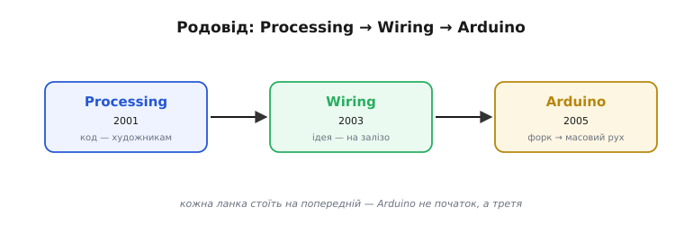
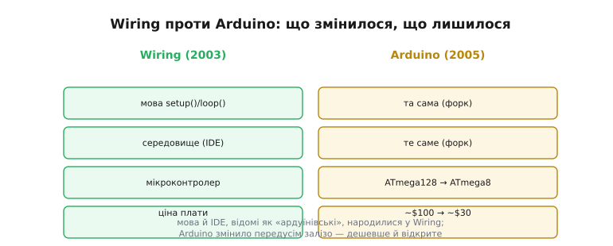
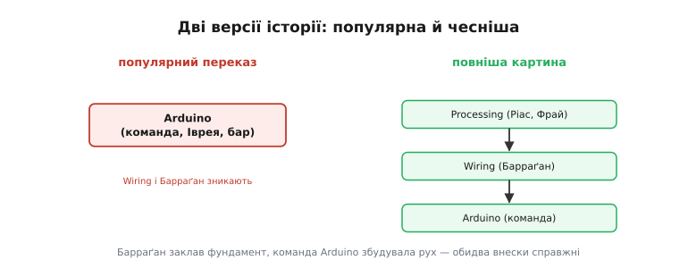

# 📜 Arduino: Іврея, Wiring і стерта глава Ернандо Барраґана

Фреймворк Arduino, коли його зважують проти прямого програмування заліза, не впав із неба — у нього є **родовід** і є **несправедливість**, яку варто виправити. Це історія про те, як проста плата дала електроніку мільйонам — і про студента, чию основоположну працю популярний переказ традиційно **стирає**.

## Плата, що дала електроніку всім

На початку 2000-х «зробити щось електронне» означало бути інженером: даташити, регістри, асемблер, дорогі інструменти. А тоді з'явилася маленька синя плата з простим середовищем, де `digitalWrite(13, HIGH)` запалював світлодіод, — і раптом **художники, дизайнери, діти, аматори** почали оживляти залізо тисячами. За кілька років та плата з невеликої Іврейської майстерні опинилася в школах, університетах, лабораторіях і спальнях аматорів на всіх континентах, а слово «Arduino» стало майже синонімом «увійти в електроніку». Цю революцію звуть **Arduino**, і вона цілком реальна. Та коли розповідають, **звідки** вона взялася, історія майже завжди починається не з того місця — і забуває кількох людей, без яких її не було б.

*Arduino — не початок, а третя ланка. Processing (2001) зробило код доступним художникам; Wiring (2003) перенесло цю ідею на фізичну електроніку; Arduino (2005) форкнуло Wiring і перетворило його на масовий рух. Кожна ланка стоїть на попередній.*

## Перед Arduino: Processing і код для художників

Усе почалося не з заліза, а з **думки**, що програмування не мусить бути привілеєм інженерів. У MIT Media Lab **Кейсі Ріас** (*Casey Reas*) і **Бен Фрай** (*Ben Fry*) створили **Processing** (2001) — мову й середовище, де художник чи дизайнер міг писати візуальний код, не продираючись крізь промислові інструменти. Processing зняло поріг входу в **код** — лишалося зробити те саме для **електроніки**.

Це була частина ширшого зсуву тих років — руху, що повертав програмування **людям**: не лише фаховим інженерам, а кожному, хто має ідею. Processing стало для нього взірцем: безкоштовне, відкрите, з негайним візуальним відгуком, зроблене дизайнерами для дизайнерів. Воно довело важливу річ — що знизити поріг входу означає не «зіпсувати» інструмент, а **розширити** коло тих, хто творить. Лишалося перенести цю філософію з екрана в залізо.

## Wiring: магістерська, з якої все почалося

Цей крок зробив колумбійський студент **Ернандо Барраґан** (*Hernando Barragán*). У 2003 році в **Інституті дизайну взаємодії в Івреї** (*Interaction Design Institute Ivrea*, IDII) в Італії він узявся за магістерську — проєкт **Wiring**. Мета була та сама, що й у Processing, але для **фізичного** світу: дати не-інженерам простий спосіб програмувати мікроконтролери. Його керівниками були **Массімо Банці** (*Massimo Banzi*) і той самий **Кейсі Ріас**.

*Wiring Барраґана (2003): плата на ATmega128, мова й середовище на базі Processing. Arduino (2005) форкнуло цей софт майже цілим, а змінило передусім залізо — дешевший ATmega8, відкрита плата за ~$30 проти ~$100. Тобто мова й середовище, відомі як «ардуїнівські», народилися у Wiring.*

Барраґан зробив не дрібницю, а **цілу платформу**: мову (ті самі `setup()` і `loop()`, що ви бачите досі), середовище програмування (форк Processing) і саму **плату** на мікроконтролері ATmega128 з ручним розведенням. Це і є той фундамент, на якому згодом постало все. Просто скажімо прямо: **`setup()`/`loop()`, IDE, сама ідея «плата + проста мова для всіх» — це Wiring, а не Arduino**.

Варто оцінити, що саме Wiring **сховало**. До нього програмування мікроконтролера означало вручну налаштовувати [регістри, відображені в пам'ять](topic:programming/memory-mapped-io), длубатися в даташиті й воювати з тулчейном. Wiring дало дружні слова — `digitalWrite()`, `analogRead()`, `delay()`, — за якими вся ця складність ховалася, і прибрало морочливе налаштування збірки за зрозуміле середовище в один клік. Саме та абстракція «ціною зручності» — простота фреймворку в обмін на втрату прямого доступу до заліза — народилася тут. І ключове: усе це Барраґан спроєктував **цілісно** — мову, бібліотеку, середовище й плату як єдиний продукт, а не випадковий набір. Тому Wiring — не «чернетка Arduino», а закінчена платформа, яку Arduino успадкувало майже даром.

## Іврея: інкубатор, що згорів яскраво й швидко

Місцем дії була особлива установа. IDII в Івреї — невелика експериментальна школа дизайну взаємодії, де технарі й художники працювали разом, а ідеї на кшталт Wiring мали де народитися.

А чому саме Іврея? Це не випадкове містечко: Іврея — рідне гніздо **Olivetti**, легендарної італійської фірми друкарських машинок і ранніх комп'ютерів, символу того, що техніка може бути красивою й людяною. IDII заснували **Olivetti** й **Telecom Italia** у 2001-му саме як місце, де технарі й художники думали б разом над тим, як люди взаємодіють із технікою. У такому ґрунті ідея «дати електроніку негуманітаріям» і могла прорости. Перший справжній іспит Wiring пройшло на воркшопі «**Strangely Familiar**»: за якихось **чотири тижні** студенти-нетехнарі справді **зробили** робочі речі — приголомшливий успіх, що довів: підхід працює.

Та сама Іврея жила недовго: на середину 2000-х інститут потрапив у **фінансову скруту** й невдовзі закрився. Парадоксально, але саме ця криза підштовхнула наступний крок.

Коли IDII закрився, його випускники й викладачі розійшлися світом, понісши з собою той самий дух «технологія для людей». І сам факт, що **дві** настільки впливові платформи — спершу Wiring, тоді Arduino — вийшли з однієї маленької школи за лічені роки, багато каже про родючість того ґрунту, де технарів свідомо саджають поряд із художниками. Іврея згоріла швидко, та її іскри розлетілися далеко.

## Народження Arduino: дешевша плата й форк

У **2005 році**, коли IDII вже хитався, **Массімо Банці** з командою вирішив зробити з Wiring щось **дешевше й доступніше**. Плата Wiring на ATmega128 коштувала близько **$100** — забагато, щоб роздати кожному студентові. Тож вони **форкнули** Wiring, замінили мікроконтролер на дешевший **ATmega8** і випустили відкриту плату приблизно за **$30**. Так народився **Arduino** — названий, до речі, на честь івреанського бару «**Bar di Re Arduino**», а той — на честь середньовічного короля Ардуїна Іврейського.

Команда-засновниця — це **Массімо Банці**, **Давід Куартієльєс** (*David Cuartielles*), **Том Іго** (*Tom Igoe*), **Джанлука Мартіно** (*Gianluca Martino*) і **Девід Мелліс** (*David Mellis*). Софт вони взяли значною мірою з Wiring; головним їхнім внеском на старті було **здешевлення заліза** й рішення зробити його **відкритим**.

## Чому саме Arduino злетів

Тут важливо бути справедливими **й до Arduino**: те, що саме воно, а не Wiring, стало світовим явищем, — не випадковість і не лише піар. Команда Arduino зробила кілька дуже правильних речей. **Дешевизна**: $30 замість $100 — це різниця між «для обраних» і «для кожного». **Відкрите залізо**: схеми й дизайн плати випустили вільно, тож її міг виробляти будь-хто, і з'явилися десятки клонів — а отже, ще нижча ціна й ще ширше охоплення. **Спільнота й документація**: прості приклади, дружні уроки, форум — усе, щоб новачок не злякався. І **вчасність**: рух «зроби сам» саме набирав силу.

Відкрите залізо заслуговує окремого слова, бо це був сміливий і не зовсім очевидний крок. Випустивши схеми плати вільно, команда Arduino фактично **дозволила** будь-кому її виробляти — і ринок миттю заповнили дешеві клони з усього світу. Для звичайного бізнесу це жах; для **руху** — паливо: що більше клонів, то дешевша плата й то більше людей у спільноті, які пишуть приклади, бібліотеки та уроки. Відкритість обернулася не втратою, а маховиком — тим самим, що розкрутив свого часу 8051 і GCC.

Була в Arduino й суто **технічна** кмітливість, що окремо варта згадки саме в розділі про тулчейн. Доти прошити мікроконтролер означало мати окремий **програматор** — зайве залізо й зайвий бар'єр для новачка. Arduino ж поклало на плату маленький [**завантажувач** (bootloader)](topic:programming/bootloader), який дозволяв заливати скетч **просто по USB-кабелю**, без жодного програматора. Крок дрібний на вигляд, величезний за наслідком: він прибрав останню технічну перешкоду між новачком і «залив — і працює». Додайте **шилди** — плати-надбудови, що стикуються згори й розширюють можливості без паяння, — і виходить екосистема, де складати пристрої міг буквально кожен. Зручність — та сама «ціна абстракції», якою фреймворк відкуповується від прямого доступу до заліза, — тут обернулася її головною **чеснотою**.

З часом сама **форма** плати Arduino — розташування роз'ємів, на яке стикуються шилди, — стала неписаним **стандартом**: його скопіювали безліч інших плат, навіть не пов'язаних з Arduino, аби пасувати до тисяч уже наявних надбудов. Так одна вдала компонувальна ідея пережила свою плату й перетворилася на спільну мову всієї аматорської електроніки. Це теж типово для впливових платформ: вони лишають по собі не лише код, а й **конвенції**, якими потім користуються всі, — як свого часу регістри-SFR від 8051 чи стиль даташитів.

Не останню роль зіграла й **освіта**. Один із засновників, **Том Іго**, викладав у нью-йоркській програмі ITP, де роками вчив «фізичних обчислень» (*physical computing*) — мистецтва оживляти речі мікроконтролерами — і написав про це впливові книжки. Через таких педагогів Arduino майже миттю ввійшло в університети та школи мистецтв по всьому світу — не як абстрактний продукт, а як **інструмент навчання**, вкладений у руки тисяч студентів. Платформа, що сама народилася в навчальній майстерні, природно й поширювалася через навчання — і це теж частина того, чому злетіла саме вона.

Іншими словами, Барраґан зробив, **щоб працювало**, а команда Arduino зробила, **щоб це дісталося всіх**. Перетворити вдалу магістерську на глобальний рух — окрема, велика й цілком реальна заслуга. Тому й Wiring, і Arduino мають своє місце в історії, і применшувати жоден із внесків не варто.

## Війна за саме ім'я «Arduino»

Гірка іронія історії про авторство в тому, що самі засновники Arduino згодом **посварилися за нього** — і теж за кредит і контроль. Близько 2015 року команда розкололася на **дві** компанії з однаковою назвою: Arduino LLC (навколо Массімо Банці й більшості засновників) та Arduino SRL (навколо Джанлуки Мартіно, чия фабрика випускала плати й тримала права на марку в частині світу). Кілька років вони судилися за те, **кому належить** ім'я «Arduino». Через цей спір на якийсь час поза США той самий продукт продавали під назвою «**Genuino**» — інша наліпка на тій самій платі. Конфлікт зрештою владнали, компанії об'єдналися — та сам епізод повчальний: навіть **усередині** однієї команди питання «хто це зробив і кому належить» виявилося пекучим. Тож Arduino стоїть на обох боках теми кредиту одразу: і як **той, кого** стирали (щодо Wiring), і як арена власної усобиці за марку.

## Стерта глава: повернути Барраґану належне

А тепер про несправедливість, заради якої цю історію й варто розповідати повністю. У популярному переказі історія Arduino починається **з Arduino**: Іврея, бар, команда Банці — а **Wiring і Барраґан часто зникають** зовсім, ніби `setup()`/`loop()` та середовище придумали з нуля у 2005-му. Це не дрібна неточність, а саме той тип **стирання**, коли основоположну працю однієї людини мовчки вбирають у славу гучнішого наступника.

*Популярний переказ часто стартує з Arduino й губить Wiring. Повніша картина шарувата: Processing (Ріас, Фрай) → Wiring (Барраґан) → Arduino (команда). Чесний підсумок: Барраґан заклав фундамент, команда Arduino збудувала рух — і обидва внески справжні.*

Сам Барраґан зрештою виклав свій бік у роботі «**The Untold History of Arduino**» («Нерозказана історія Arduino»), де докладно показав, скільки в Arduino — від Wiring, і як його роль розчинилася в офіційному наративі. Зрушення сталося аж у **2017 році**, коли Arduino офіційно запросила його на посаду **головного дизайн-архітектора** — пізнє, але важливе визнання, що Wiring і був тим корінням, з якого виросло все.

Чому таке стирання взагалі стається — питання не про злий намір конкретних людей, а про **механіку** пам'яті. Гучніший, успішніший наступник природно перетягує на себе всю історію: про нього пишуть, його згадують, і з кожним переказом тихіше звучить ім'я попередника. Так Wiring перетворилося спершу на «ранню версію Arduino», а тоді й зовсім зникло з коротких розповідей. Виправити це можна лише **свідомо** — щоразу називаючи повний ланцюг, а не лише останню, найяскравішу ланку. Саме тому ця вставка й починає не з Arduino, а з Processing.

## Що це означає для нас

Коли йдеться про вибір [«фреймворк проти голого заліза»](root:embedded/baremetal-vs-framework), варто знати, **звідки** взявся той дружній фреймворк Arduino: він не магія й не одна геніальна мить, а **шарувата** праця — Processing дало ідею доступного коду, Wiring переніс її на залізо, Arduino зробив її дешевою й масовою. Коли ви пишете `setup()` і `loop()` навіть для ESP32, ви користуєтесь спадком усіх трьох ланок.

А спадок цей живий і досі. З першої плати Arduino розрослося в цілу екосистему — десятки моделей, тисячі бібліотек, мільйони проєктів; і коли сьогодні ви програмуєте ESP32 «по-ардуїнівськи», ви користуєтесь **Arduino-ядром для ESP32** — ще одним нащадком того самого Wiring, перенесеним уже на зовсім інший чіп. Тобто ланцюг Processing → Wiring → Arduino → ESP32-ядро тягнеться **прямо** до коду, який ви пишете в цьому курсі. (Wiring, до речі, не зникло й технічно: Барраґан вів його далі ще роками.)

І ширший урок, що римується з рештою історій курсу: **винаходи майже завжди колективні й шаруваті**, а «історія одного героя» — зручний, але оманливий спрощенець. Чесно віддати належне і Барраґанові за фундамент, і команді Arduino за рух — це не прискіпливість, а **точність**. А точність у тому, хто що зробив, — теж частина інженерної культури: ми поважаємо джерела так само, як поважаємо факти.

Те, що сталося з Wiring, — узагалі не виняток, а майже **правило** в історії техніки: за гучним «винаходом» раз у раз стоїть тихіший попередник, чию працю вбрав успішніший наступник. Так було і з 8051, і з GCC, і з лампою розжарення, і з радіо. Тому звичка питати «а на чому **це** стояло?» — не занудство, а спосіб бачити техніку чесно: як безперервний ланцюг, де кожна ланка спирається на попередню. Arduino дало світові електроніку — і це чудово; Wiring дало світові Arduino — і про це теж варто пам'ятати. Назвати обох — означає не відняти в Arduino славу, а додати до неї **правду**.
