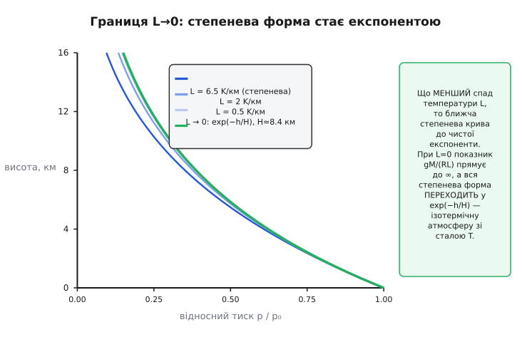

# 🧮 Повний вивід барометричної формули

Барометрична формула висоти — це не одна формула, а **сім'я формул**, що всі виростають з одного-єдиного диференціального рівняння. Ми вже вивели дві її гілки: ізотермічну експоненту (стала температура) і степеневу форму ISA (температура падає рівномірно). Тут доведемо їх строго — обидва інтеграли до останнього символу, — але головна робота цієї вставки не в самому виведенні. Вона в тому, щоб показати, що ці дві формули **не дві різні речі, а одна**: степенева переходить в експоненційну в границі, коли спад температури `L` прямує до нуля, і цей перехід — не збіг, а прямий наслідок означення числа `e`. А ще ми доведемо третю гілку — ту, що вмикається вище тропопаузи, де лінійний спад закінчується, — і закриємо питання, чому там повертається саме експонента. Наприкінці зберемо всі сталі ISA з перевіреними значеннями й побачимо, звідки в показнику береться рівно `5.2558`, а не кругле «п'ять із чвертю».

Почнемо не з формул, а з того, що робить їх усі спорідненими, — з єдиного рівняння-предка.

## Одне рівняння, з якого росте вся сім'я

Уся барометрія тримається на двох цеглинах. Перша — гідростатична рівновага: піднявшись на нескінченно малу висоту `dh`, тиск падає рівно на вагу того шару повітря, що ти прибрав з-над себе:

```
dp  =  − ρ · g · dh
```

Друга — рівняння стану ідеального газу, яке зв'язує густину `ρ` з тиском `p` і температурою `T` через молярну масу повітря `M` і газову сталу `R`:

```
ρ  =  p · M / (R · T)
```

> 🔧 **Що треба знати про ідеальний газ.** Повітря поводиться майже як ідеальний газ: `p·V = n·R·T`, тобто добуток тиску на об'єм пропорційний кількості речовини й абсолютній температурі. Переписавши кількість молів як масу поділену на молярну масу (`n = m/M`), дістаємо густину `ρ = m/V = p·M/(R·T)` — щільність повітря прямо пропорційна тиску й обернено — температурі. Саме звідси в барометрії береться нелінійність: густина не стала, вона тане з висотою разом із тиском. Деталі — у [рівнянні стану ідеального газу](topic:ph-thermodynamics/ideal-gas-law).

Підставмо другу цеглину в першу — і розділимо змінні так, щоб тиск був ліворуч, а висота праворуч:

```
dp  =  − (p · M / (R · T)) · g · dh

dp / p  =  − (M · g / (R · T)) · dh
```

Ось воно — **рівняння-предок**. Дивись на його ліву частину уважно: `dp/p`. Це форма, яку розпізнає кожен, хто знає [логарифми](topic:math-analysis/logarithms), бо `dp/p` — це в точності диференціал натурального логарифма, `d(ln p)`. Похідна `ln p` дорівнює `1/p`, тож `d(ln p) = dp/p`. Ця дрібничка вирішує все: щойно рівняння набуло вигляду «щось·`dp/p` = щось·`dh`», ліва частина проінтегрується в логарифм **сама собою**, за будь-якої моделі температури. Уся різниця між гілками сім'ї — лише в тому, що коїться з `T` праворуч.

> 🔧 **Чому саме логарифм.** Логарифм — це функція, похідна якої дорівнює `1/x`. Тому щоразу, коли фізична величина змінюється на частку **від самої себе** (`dp` пропорційне `p`), інтеграл неминуче дає `ln`. Тиск падає не на стільки-то паскалів за метр, а на стільки-то **відсотків** за метр — і саме тому висота виражається через `ln(p₀/p)`, а не через різницю тисків. Природа логарифма — у [статті про логарифми](topic:math-analysis/logarithms); тут важливо лише впізнавати `dx/x` як зародок `ln x`.

Отже, ліва частина зафіксована: інтеграл від `p₀` до `p` дає `ln(p/p₀)`. Лишається права — і тут атмосфера пропонує нам вибір, як саме моделювати температуру. Кожен вибір — окрема гілка.

## Гілка перша: стала температура — чиста експонента

Найпростіше припущення: температура з висотою **не міняється**, `T = T₀` скрізь. Тоді весь множник `M·g/(R·T₀)` праворуч — стала, і [інтеграл](topic:math-analysis/integral) береться миттєво. Зліва — логарифм, справа — стала на приріст висоти:

```
∫ dp/p  =  − (M·g / (R·T₀)) · ∫ dh

ln p − ln p₀  =  − (M·g / (R·T₀)) · h
```

Ліва частина — це `ln(p/p₀)`. Позначимо ту купку сталих праворуч однією буквою: `H = R·T₀ / (M·g)`. Вона має розмірність довжини (перевір: джоуль на моль-кельвін, помножений на кельвін, поділений на кілограм-на-моль і на метр-на-секунду², дає метри) і зветься **масштабом висоти** (англ. *scale height*) або висотою однорідної атмосфери. Тоді:

```
ln (p/p₀)  =  − h / H
```

Щоб дістати `p` явно, піднесемо обидві частини в експоненту — операцію, обернену до логарифма (`e^(ln x) = x`):

```
p  =  p₀ · e^(− h / H)
```

Тиск спадає **експоненційно**: на кожен масштаб висоти `H` він зменшується в `e ≈ 2.71828` раза. Обернувши формулу (щоб дістати висоту з виміряного тиску), маємо чисту логарифмічну залежність:

```
h  =  H · ln (p₀ / p)  =  (R·T₀ / (M·g)) · ln (p₀ / p)
```

Це вся ізотермічна модель. Одне число — `H` — і два логарифми. Запам'ятай форму `p = p₀·e^(−h/H)`: до неї ми повернемося, коли доводитимемо границю й коли вмикатимемо стратосферу. Вона — не спрощена версія «справжньої» формули, а **самостійна гілка сім'ї**, і вище тропопаузи саме вона стає точною.

## Гілка друга: температура падає рівномірно — степенева форма

У тропосфері (нижній атмосфері) температура падає з висотою майже рівно — лінійно. Позначимо швидкість спаду `L` (від англ. *lapse rate* — темп спаду) і запишемо температуру як функцію висоти:

```
T(h)  =  T₀ − L · h
```

На кожен метр угору стає холодніше на `L` градусів; стандарт — 6.5 °C на кілометр, `L = 0.0065 К/м`. Тепер `T` праворуч у рівнянні-предку залежить від `h`, і множник уже не винести за знак інтеграла:

```
dp / p  =  − (M·g / R) · dh / (T₀ − L·h)
```

Права частина — інтеграл виду `∫ dh/(T₀ − L·h)`, і він теж дає логарифм, лише зі складеним аргументом. Ключ — заміна: похідна знаменника `(T₀ − L·h)` по `h` дорівнює `−L`. Отже, чисельник `dh` — це `−(1/L)` від диференціала знаменника, і весь інтеграл згортається в `−(1/L)·ln(T₀ − L·h)`. Інтегруємо від землі (`h=0`, `p=p₀`) до висоти `h` (тиск `p`):

```
ln (p/p₀)  =  − (M·g / R) · (− 1/L) · [ ln(T₀ − L·h) − ln T₀ ]

ln (p/p₀)  =  (M·g / (R·L)) · ln ( (T₀ − L·h) / T₀ )
```

Праворуч стоїть логарифм, помножений на сталу. За властивістю логарифма множник заходить у показник (`k·ln a = ln aᵏ`), тож обидві частини — це логарифми, і аргументи мусять бути рівні. Піднесемо все в експоненту, аби прибрати `ln`:

```
p / p₀  =  ( (T₀ − L·h) / T₀ ) ^ (M·g / (R·L))
```

Ось звідки степінь. Показник — комбінація чотирьох сталих, `M·g/(R·L)`, і вона керує всією формою кривої. Обернемо формулу, щоб виразити висоту через тиск: беремо корінь степеня `M·g/(R·L)` (тобто підносимо в обернений показник `R·L/(M·g)`), і розв'язуємо відносно `h`:

```
(p/p₀) ^ (R·L/(M·g))  =  (T₀ − L·h) / T₀

L·h  =  T₀ · [ 1 − (p/p₀)^(R·L/(M·g)) ]

h  =  (T₀ / L) · [ 1 − (p/p₀)^(R·L/(M·g)) ]
```

Це **барометрична формула висоти** в її робочому вигляді. Кожен символ має походження: `T₀/L` — множник масштабу (він, до речі, дорівнює висоті, на якій лінійна температура впала б до абсолютного нуля — суто математична точка, `288.15/0.0065 ≈ 44 331 м`), а показник `R·L/(M·g)` — форма кривої. Зараз порахуємо обидва показники точно; спершу доведемо найглибше — що ця степенева форма й попередня експонента суть одне.

## Серце вставки: чому степенева форма — це замаскована експонента

Ми маємо дві формули тиску:

```
стала T:        p / p₀  =  e^(− M·g·h / (R·T₀))
лінійний спад:  p / p₀  =  ( 1 − L·h / T₀ ) ^ (M·g / (R·L))
```

Вони виглядають геть різними — одна з `e`, друга степенева. Але між ними є місток, і він проходить через границю `L → 0`. Це має сенс і без математики: якщо спад температури зробити щораз меншим, атмосфера стає щораз «рівнішою» за температурою, а в межі — зовсім ізотермічною. Фізично гілка друга мусить перетекти в гілку першу. Доведімо, що математика це підтверджує **точно**, а не приблизно.

Візьмімо степеневу форму й простежмо, куди прямують її частини, коли `L → 0`. Основа `(1 − L·h/T₀)` наближається до `1`, а показник `M·g/(R·L)` — до нескінченності. Це невизначеність виду `1^∞` — форма, яка **не** дорівнює просто одиниці; вона якраз і породжує число `e`. Пригадаймо фундаментальну границю, що означує `e`:

```
lim  ( 1 + x/n ) ^ n  =  e^x      (коли n → ∞)
```

Наша основа має точнісінько цю будову. Введемо `n = M·g/(R·L)` — це наш показник, і він росте до нескінченності разом зі спадом `L → 0`. Виразимо через нього `L`: з `n = M·g/(R·L)` маємо `L = M·g/(R·n)`. Підставмо це `L` в основу степеня:

```
1 − L·h/T₀  =  1 − (M·g / (R·n)) · h / T₀  =  1 − (M·g·h / (R·T₀)) / n
```

Позначимо `x = − M·g·h/(R·T₀)` (той самий показник експоненти з гілки першої, зі знаком мінус). Тоді основа — це рівно `(1 + x/n)`, а вся степенева форма — це `(1 + x/n)ⁿ`:

```
( 1 − L·h/T₀ ) ^ (M·g/(R·L))  =  ( 1 + x/n ) ^ n   →   e^x  =  e^(− M·g·h/(R·T₀))
```

Границя `(1 + x/n)ⁿ` при `n → ∞` дорівнює `eˣ` — це і є означення експоненти. Отже степенева форма в границі `L → 0` **перетворюється точно на ізотермічну експоненту** з тим самим масштабом висоти `H = R·T₀/(M·g)`. Не схоже на неї, не приблизно як вона, а тотожно нею стає. Дві гілки — це одна крива, розглянута за різного спаду температури: степенева при `L > 0`, експоненційна на її межі при `L = 0`.


*Одна й та сама відносна залежність тиску від висоти для кількох значень спаду температури. Що менший `L`, то ближча степенева крива до товстої зеленої — чистої експоненти `e^(−h/H)`, до якої вся сім'я збігається при `L → 0`. Границя не наближена: у ній показник `M·g/(R·L)` прямує до нескінченності, а основа — до одиниці саме тим темпом, що дає означення числа `e`. Це доводить: ізотермічна й степенева формули — не дві різні моделі, а дві точки однієї сім'ї кривих.*

> 🔧 **Навіщо це знати прошивці.** Ця границя — не абстракція, а страховка від помилки в одиницях. Якщо в коді висотоміра степенева формула й (для іншого діапазону) логарифмічна ізотермічна форма дають на **малій** висоті помітно різні числа, десь баг: на перших сотнях метрів вони мусять майже збігатися, бо там `L·h` мале й степенева крива ще тулиться до своєї експоненційної межі. Розходяться вони лише високо. Тож дві гілки в коді — взаємна перевірка: на малих `h` їхня різниця — індикатор коректності реалізації, а не властивість атмосфери.

Ця ж границя пояснює, чому лінійне наближення «1 гПа ≈ 8.3 м», яким зручно рахувати перші сотні метрів, узагалі працює: біля землі всі три форми — лінійна, степенева, експоненційна — майже зливаються, бо кожна наступна є розкладом попередньої з відкинутими малими членами.

## Гілка третя: вище тропопаузи спад закінчується

Лінійна модель `T = T₀ − L·h` чесна, поки температура справді падає рівно. Але вона не може падати вічно — інакше на висоті `T₀/L ≈ 44 км` температура сягнула б абсолютного нуля, чого не буває. Реальна атмосфера ламає лінійний спад набагато раніше: приблизно на **11 кілометрах** температура перестає падати й далі, у нижній стратосфері (до ~20 км), тримається сталою. Ця межа зветься **тропопаузою** (від грец. *tropos* — поворот, і *pausis* — зупинка): місце, де «поворот» температури вниз зупиняється.

Порахуймо, якою стає температура на цій межі за стандартною моделлю — просто підставивши `h = 11 000 м` у лінійний закон:

```
T₁₁  =  T₀ − L · 11000  =  288.15 − 0.0065 · 11000  =  288.15 − 71.5  =  216.65 K
```

Тобто **216.65 К, або −56.5 °C**. Вище цього рівня стандарт ISA приймає температуру сталою і рівною цим `216.65 К`. А стала температура — це рівно умова гілки першої! Тож над тропопаузою повертається **експоненційна** формула, лише з двома поправками: відлік висоти йде не від землі, а від тропопаузи (`h − 11000`), і опора — не приземний тиск `p₀`, а тиск на самій тропопаузі `p₁₁`, який дає степенева формула в точці 11 км:

```
p(h)  =  p₁₁ · exp( − M·g·(h − 11000) / (R · 216.65) )     для  11000 < h ≤ 20000 м
```

де `p₁₁ ≈ 22 632 Па` (≈ 226.32 гПа) — тиск на тропопаузі. Масштаб висоти тут більший, ніж біля землі: `H = R·216.65/(M·g) ≈ 6 342 м` проти приземних `8 435 м` — холодне повітря стратосфери щільніше, тож тиск на одиницю висоти падає крутіше, ніж падав би тепле.

> 🔧 **Навіщо це знати прошивці.** Дрон чи метеозонд, що піднімається вище 11 км, **не можна** рахувати самою степеневою формулою тропосфери — вона там уже бреше, бо закладає падіння температури, якого нема. Прошивка мусить перемкнути гілку: нижче 11 км — степенева з `L`, вище — експоненційна зі сталими `216.65 К` і `p₁₁`. Для більшості наземних апаратів це академічно (вони не літають так високо), але для висотних зондів, ракет і авіації межа реальна, і серйозний код тримає обидві гілки з перемиканням на 11 км. Тропопауза — не єдина межа: повна модель ISA має ще кілька шарів вище (стратосфера з новим спадом, мезосфера), кожен зі своєю формулою тієї ж сім'ї — степеневою там, де `L ≠ 0`, і експоненційною там, де `L = 0`.

Отже вся сім'я — це шари, зшиті на межах: у кожному шарі або степенева гілка (якщо там `T` спадає лінійно), або експоненційна (якщо `T` стала), а виведення обох ми вже маємо. Лишилося з'ясувати, звідки беруться конкретні числа, — і чому показник виходить саме `5.2558`.

## Сталі ISA: звідки береться показник 5.2558

Показник `M·g/(R·L)` — не підганяльний коефіцієнт, а точна комбінація чотирьох фізичних сталих, закріплених міжнародним стандартом атмосфери (ICAO / *International Standard Atmosphere*). Ось перевірені значення, кожне зі статусом:

```
g  = 9.80665  м/с²        стандартне тяжіння (усталено; означення, точне за домовленістю)
M  = 0.0289644 кг/моль    молярна маса сухого повітря ISA (усталено, модель 1976)
R  = 8.31447  Дж/(моль·К)  універсальна газова стала (усталено; CODATA)
L  = 0.0065   К/м          спад температури в тропосфері (усталено, домовлений стандарт)
p₀ = 1013.25  гПа          тиск на рівні моря (усталено, означення ISA)
T₀ = 288.15   K = 15 °C    температура на рівні моря (усталено, означення ISA)
```

Тепер порахуймо показник точно, підставивши числа:

```
M·g / (R·L)  =  (0.0289644 · 9.80665) / (8.31447 · 0.0065)
             =  0.284044 / 0.054044
             ≈  5.2558
```

І обернений показник, той, що стоїть у формулі висоти й фігурував у базовій статті як «загадкове 0.1903»:

```
R·L / (M·g)  =  1 / 5.2558  ≈  0.19027
```

Ось і вся розгадка: `0.1903` — це просто `1/5.2558`, обернена величина тієї самої комбінації сталих. Жодної магії; поміняєш модель атмосфери (інша планета, інший газ, інший спад температури) — і обидва показники треба перерахувати з нових `M`, `g`, `R`, `L`, а не лишати «як у Землі».

Одне чесне уточнення про останню цифру. У науковій літературі показник трапляється то як `5.2558`, то як `5.25588`, то округлено `5.255` чи навіть `5.256`. Розбіжність — не помилка, а **різні редакції газової сталої**: класична модель US Standard Atmosphere 1976 користалася `R* = 8.31432 Дж/(моль·К)`, з якою `M·g/(R·L) = 5.25588`; сучасне значення CODATA `R = 8.31446` дає `5.2558`. Різниця в п'ятому знаку не важить для висотоміра (на кілометрі висоти це частки метра), але знати, звідки вона, корисно: якщо два джерела показують трохи різні показники, шукай, яку `R` вони взяли, — і не «виправляй» одне на інше наосліп.

**Приклад (показник → висота, крок за кроком).** Барометр показав `p = 900 гПа`; опора `p₀ = 1013.25 гПа`. Порахуймо абсолютну висоту повною степеневою формулою:

```c
#include <math.h>
// Абсолютна висота над рівнем p0 за степеневою формулою ISA (тропосфера).
// p, p0 — тиск у тих самих одиницях (гПа чи Па — байдуже, бо ділимо).
float altitude_isa_m(float p, float p0) {
    const float T0  = 288.15f;      // K, температура рівня моря ISA
    const float L   = 0.0065f;      // K/m, спад температури
    const float EXP = 0.190263f;    // R·L/(M·g) = 1 / 5.2558
    return (T0 / L) * (1.0f - powf(p / p0, EXP));
}
// Підстановка p = 900, p0 = 1013.25:
//   p/p0            = 0.888231
//   (p/p0)^0.190263 = 0.977702
//   1 − ...         = 0.022298
//   T0/L            = 44330.77 м
//   h ≈ 44330.77 · 0.022298 ≈ 988.5 м
```

Апарат — приблизно на 988 метрах над рівнем, де тиск `1013.25 гПа`. Зверни увагу на множник `T₀/L ≈ 44 331 м`: це та сама «математична точка нуля температури», і саме на неї домножується мала різниця `1 − (p/p₀)^0.1903`, щоб дати реальні сотні метрів. Формула бере крихітне число (0.022) і масштабує його десятками тисяч метрів — тому точність показника в четвертому-п'ятому знаку таки має значення, коли рахуєш висоти в кілометри.

**Приклад (перевірка границею — та сама висота через експоненту).** На малій висоті степенева й ізотермічна форми мусять майже збігтися. Порахуймо ту саму точку `p/p₀ = 0.888231` ізотермічною формулою `h = H·ln(p₀/p)` з `H = 8435 м`:

```
h_ізотерм  =  8435 · ln(1013.25 / 900)  =  8435 · ln(1.12583)  =  8435 · 0.118524  ≈  999.7 м
```

Ізотермічна дала 999.7 м, степенева — 988.5 м; розбіжність близько 11 метрів на кілометрі, і вона росте з висотою, бо реальний спад температури `L` тут ще не нульовий, а формули збігаються лише в границі `L → 0`. На перших **сотнях** метрів ця різниця впала б до одиниць метрів — саме те, що обіцяла границя. Дві гілки сім'ї сходяться донизу й розходяться догори — рівно так, як довів місток через число `e`.

## Що з усього цього виносити

Уся барометрична формула — це один диференціальний рядок `dp/p = −(M·g/(R·T))·dh`, проінтегрований за різних припущень про температуру. Ліва частина завжди дає логарифм (бо `dp/p = d(ln p)`), а форму результату задає лише температурна модель праворуч: **стала `T` → експонента** з масштабом `H = R·T/(M·g) ≈ 8.4 км`; **лінійний спад `T = T₀ − L·h` → степенева форма** з показником `M·g/(R·L) ≈ 5.2558` (обернений `0.1903 = R·L/(M·g)`). Ці дві гілки — не суперники, а одна сім'я: степенева переходить в експоненційну в границі `L → 0`, і перехід точний, бо основа й показник змінюються рівно тим темпом, що означує число `e` через `(1 + x/n)ⁿ → eˣ`. Вище тропопаузи (11 км, де стандартна температура застигає на `216.65 К = −56.5 °C`) лінійний спад закінчується, і повертається експоненційна гілка — з відліком від тропопаузи. Усі числа закріплені стандартом ISA й перевірені; показник `5.2558` — не кругле число саме тому, що це відношення реальних `M·g` до `R·L`, а не зручний коефіцієнт. Хто тримає в голові цей один рядок і три його гілки, той читає будь-яку барометричну формулу не як магічне закляття, а як конкретний інтеграл із конкретними межами.
