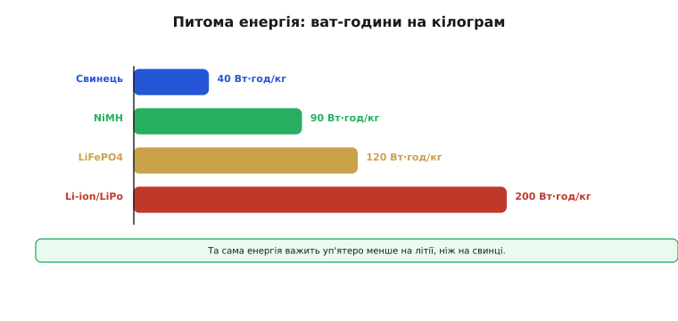
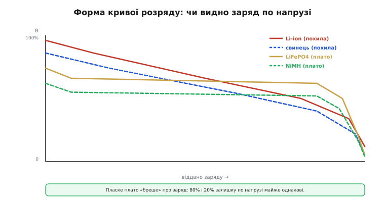
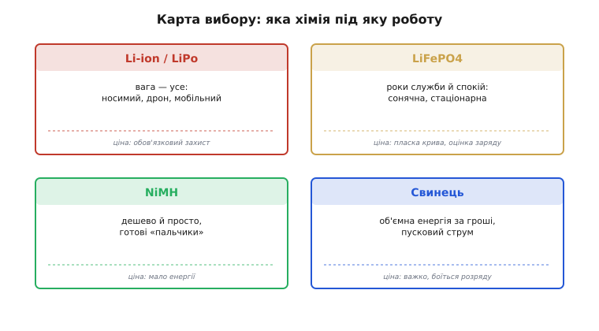

# Хімії батарей

<preknowlist>
- [Buck-boost перетворювач](root:hw-power/buck-boost) — перетворювач, що тримає стабільний вихід і коли вхід вищий за нього, і коли нижчий: саме він потрібен, бо напруга комірки широко гуляє від повної до порожньої.
</preknowlist>

Перше, що варто прийняти, обираючи акумулятор: **«найкращої» батареї не існує**. Літій — не універсальний переможець, а добрий старий свинець — не пережиток. Кожна хімія — це **компроміс** на кількох осях одразу: виграючи на одній, вона неминуче програє на іншій. Тому інженерова робота — не завчити, «що краще», а навчитися **порівнювати** ті самі кілька хімій за тими самими мірками й свідомо зважити їх під свою задачу.

Мірок, за якими це роблять, шість: напруга елемента, питома енергія, форма кривої розряду, ресурс циклів, температурне вікно й безпека. Хімій, що покривають майже всю embedded-розробку, чотири: **Li-ion** (і його м'який різновид **LiPo**), **LiFePO4** (скорочено LFP), **NiMH** і **свинець**. Пройдімося осями по черзі — і наприкінці складемо карту, яка хімія під яку роботу. Свинець, нікель-кадмій і нікель-залізо прийшли ще з доледієвої доби — з довгої історії винаходу перезаряджуваного джерела, [від Планте до забутої патентної боротьби Юнгнера з Едісоном](root:embedded/battery-chemistries/hist-plante-jungner.md); літій став четвертим і наймолодшим.

### Напруга елемента

Найперша характеристика — **номінальна напруга** одного елемента: її задає сама хімія, і вона визначає, скільки комірок доведеться з'єднати послідовно на потрібну шину. Li-ion дає ~3.7 В і «гуляє» від 3.0 (порожній) до 4.2 (повний); LiFePO4 — ~3.2 В у вужчому діапазоні 2.5–3.65; NiMH — лише ~1.2 В; свинець — ~2.0 В. Звідси прямий наслідок: щоб зібрати звичні 12 В, треба **шість** свинцевих елементів, **десять** NiMH — або всього **три-чотири** літієві. А одна літієва комірка вже живить багато 3.3-вольтових пристроїв через простий стабілізатор.

Широкий діапазон має й другий бік — для перетворювача після батареї. Поки одна літієва комірка сповзає з 4.2 до 3.0 В, цільові 3.3 В опиняються то нижче входу, то вище: щоб тримати їх стабільними весь розряд, потрібен або малопадінний LDO, або buck-boost, що однаково тягне і з 4.2, і з 3.0 В. Тож вибір хімії й кількості комірок — це одразу й вибір топології живлення, а не лише питання «скільки вольтів».

### Питома енергія

Якщо пристрій носять, возять чи піднімають у повітря, **питома енергія** (Вт·год/кг) стає віссю номер один: скільки енергії вдається запхати в кожен грам. Різниця тут не у відсотках, а в **разах**.

*Грубі орієнтири: свинець ~40 Вт·год/кг, NiMH ~90, LiFePO4 ~120, Li-ion/LiPo ~200. Літій тримає вп'ятеро більше енергії на грам, ніж свинець, — тому панує там, де вага критична.*

Ті самі 50 Вт·год важать чверть кілограма на літії й півтора на свинці (та ще й важкий корпус зверху). Для дрона, де кожен грам віднімається від корисного навантаження й часу польоту, відповідь очевидна — Li-ion. А для метеостанції, що нерухомо стоїть біля стовпа, зайвий кілограм нічого не вартий, зате інші осі — ціна, ресурс, безпека — переважують, і там часто виграє LiFePO4 чи навіть свинець. Питома енергія — перша вісь, але не єдина.

### Форма кривої розряду

Тонша, але дуже практична відмінність — **форма кривої розряду**: як падає напруга елемента в міру того, як з нього беруть заряд. Здавалося б, дрібниця, та саме вона визначає, чи зможемо ми оцінити залишок заряду «на око», по вольтметру.

*Li-ion і свинець розряджаються похило — напруга помітно падає від повного до порожнього, тож по ній можна грубо судити про залишок. LiFePO4 і NiMH мають пласке плато: майже весь розряд напруга тримається сталою й «бреше» про заряд, різко падаючи лише в кінці.*

У Li-ion напруга плавно сповзає з 4.2 до 3.0 В — за нею, знаючи хімію й навантаження, можна прикинути відсоток заряду; у свинцю теж похило. А от LiFePO4 і NiMH мають підступне пласке плато: майже весь розряд напруга стоїть майже незмінна (у LFP близько 3.2 В) і обвалюється лише наприкінці. Для навантаження це чудово (стабільне живлення), але для оцінки заряду жахливо: 80% і 20% залишку виглядають по напрузі майже однаково. Тому на пласкій хімії самої напруги мало — потрібен облік відданих ампер-годин, і саме на цьому стоїть [чесне вимірювання залишку заряду](root:hw-power/state-of-charge).

### Ресурс циклів

Батарея старіє: з кожним циклом «заряд-розряд» її ємність потроху тане. **Ресурс циклів** — скільки їх вона витримає, поки ємність не впаде, скажімо, до 80%, — пряма економічна вісь, але рахувати її треба за весь термін служби, а не за чеком у магазині. Свинець живе ~300 циклів, NiMH ~500, Li-ion ~800, а LiFePO4 — 3000 і більше. LFP дорожчий за штуку, зате витримує в рази більше циклів, тож на **ціну одного циклу** він часто виявляється найдешевшим; свинець же дешевий на касі, але його скромний ресурс робить «дешеву» батарею дорогою в перерахунку на роки.

Саме поняття «цикл» хитріше, ніж здається. Ресурс сильно залежить від **глибини розряду**: якщо щоразу розряджати літій лише наполовину, циклів буде в рази більше, ніж за розрядів «у нуль», — тому під довге життя навмисне беруть більшу батарею й користуються тільки її серединою. Додається й **календарне** старіння: ємність тане просто від часу й температури, навіть якщо батарея лежить без діла. Механізми цього [старіння батарей](root:hw-power/battery-aging) мають власну фізику.

### Температурне вікно

Батарея по-різному жива на морозі й у спеку, і — що критично — **заряд** має набагато вужче температурне вікно, ніж розряд. Головне правило варте того, щоб закарбувати: **літій не можна заряджати нижче 0°C**. На холоді під час заряду літій не встигає зайти в електрод і осідає на ньому металевими голками (дендритами) — це незворотно вбиває ємність, а в гіршому разі проколює сепаратор і коротить комірку. Розряджати літій на морозі можна (лише ємність тимчасово падає), а заряджати — категорично ні, доки комірка не відігріється. Тому грамотний [зарядний вузол](root:hw-power/li-ion-charger) завжди має давач температури й блокує заряд за межами вікна. На іншому кінці шкали спека майже не заважає роботі, зате різко прискорює старіння — особливо якщо тримати літій гарячим **і** повністю зарядженим.

### Безпека й норов

Нарешті — **безпека** й загальний характер кожної хімії, бо за однаковими вольтами ховаються дуже різні норови. **Li-ion/LiPo** — чемпіон за енергією, але й найвимогливіший: боїться перезаряду, переохолодженого заряду й проколу, а при відмові здатен на **тепловий розгін** — самопідігрів аж до займання, — тому **ніколи** не ходить без захисної електроніки. **LiFePO4** — спокійний родич літію: трохи менше енергії, зате помітно безпечніший (тепловий розгін значно важче спровокувати), довговічний і витриваліший до спеки. **NiMH** — добродушний трудяга: безпечний, не потребує складного захисту, продається готовими «пальчиками», але енергії мало. **Свинець** — дешевий силач: віддає шалений пусковий струм, прощає перезаряд краще за літій, але важкий і **смертельно боїться глибокого розряду** (сульфатація незворотно з'їдає ємність).

Окрема, часто вирішальна для embedded вісь — **саморозряд**: як швидко батарея «худне» просто лежачи. Для пристрою, що місяцями дрімає в режимі сну (а таких в автономній електроніці більшість), саморозряд раптом стає головнішим за питому енергію: батарея має пережити простій, а не лише робочі години. Тут літій хороший (одиниці відсотків на місяць), а свинець розряджається помірно, але його не можна лишати розрядженим надовго — засульфатується.

### Карта вибору

*Максимум енергії на мінімумі ваги — Li-ion/LiPo (ціна — обов'язковий захист). Довге життя й безпека — LiFePO4 (ціна — пласка крива, складніша оцінка заряду). Дешево, безпечно, з готових елементів — NiMH (мало енергії). Дешева об'ємна енергія з потужним пусковим струмом — свинець (важко, боїться розряду).*

Логіка проста, щойно осі розкладено. **Носимий, літаючий, мобільний** пристрій, де вага — усе → Li-ion/LiPo. **Стаціонарна, сонячна, відповідальна** система, де цінують роки служби й спокій → LiFePO4. **Простий, дешевий** прилад із малим апетитом, для якого хочеться готових елементів із магазину → NiMH. **Великий запас енергії за малі гроші** плюс величезний миттєвий струм, коли вага байдужа → свинець. Жоден вибір не «правильний» сам по собі — він правильний **під конкретні осі**, які важать саме у вашій задачі. І цифри тут — орієнтири порядку величини, а не паспорт конкретної комірки: остаточний вибір завжди звіряють із даташитом саме тієї, яку купують.

А коли хімію обрано, постає наступне інженерне питання — як вона поводиться [під навантаженням](root:hw-power/battery-sag): чому під різким стрибком струму напруга просідає й від чого це залежить.
