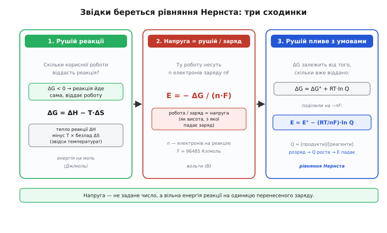
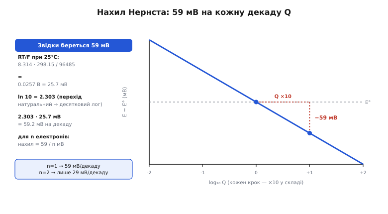
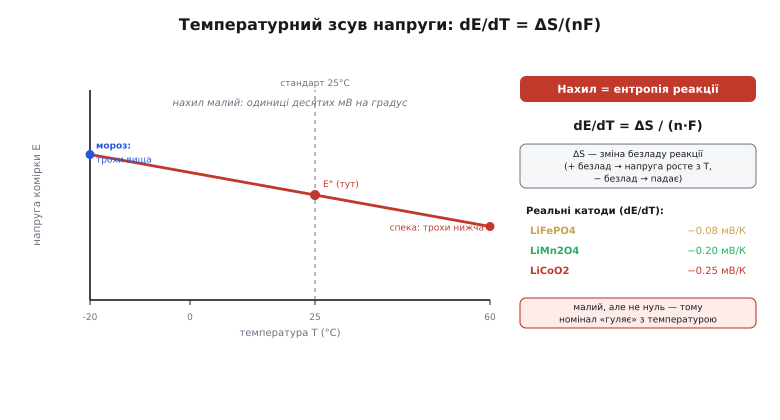

# 🧮 Нернст і вільна енергія Гіббса: звідки береться напруга комірки

У кроці про хімії ми користувалися рівнянням Нернста як готовим інструментом: напруга комірки «пливе» приблизно на 59 мВ за кожну десятикратну зміну складу, а RT/F при кімнатній температурі дорівнює близько 25.7 мВ. Ці два числа ми взяли на віру. Тут ми їх **виведемо** — від найпершої причини, чому реакція взагалі має напругу, до кожного множника у формулі, — щоб жодна константа не лишалася чарівним числом із підручника.

Мета не академічна. Коли ви проєктуєте кулонометр, пишете корекцію оцінки заряду за напругою або дивуєтеся, чому на морозі повна комірка показує не зовсім те, що влітку, — ви щоразу впираєтеся саме в цю термодинаміку. Зрозуміти її наскрізь означає перестати підганяти коефіцієнти навпомацки й почати рахувати їх.

## Означення: що таке напруга реакції

Почнімо з питання, яке рідко ставлять прямо: **чому в хімічної реакції взагалі є напруга?** Реакція — це перебудова атомів; звідки тут вольти?

Відповідь у тому, що деякі реакції можуть віддати **корисну роботу**, а не лише тепло. Кинули шматок натрію у воду — дістали спалах і бризки, тобто безлад: енергія пішла теплом, роботи з неї не візьмеш. Але ту саму за суттю реакцію окиснення-відновлення можна **рознести в просторі**: змусити речовину віддавати електрони на одному електроді, а приймати на іншому, і пропустити електрони в обхід — крізь провід, крізь наше навантаження. Тоді та сама хімічна перебудова виконує **електричну роботу**: жене заряд по колу. Напруга — це просто міра того, наскільки «охоче» реакція цю роботу віддає, у розрахунку на одиницю перенесеного заряду.

Отже, щоб дістати напругу з першопринципів, треба спершу відповісти на два питання по черзі: **скільки корисної роботи** взагалі здатна віддати реакція (це термодинаміка вільної енергії), і **на скільки заряду** ця робота розкладається (це проста арифметика — скільки електронів переносить одна реакція). Поділивши одне на друге, дістанемо вольти. Саме цей ланцюг ми зараз і пройдемо.


*Три сходинки думки. Спершу — скільки корисної роботи віддає реакція (вільна енергія Гіббса ΔG, у якій уже сидить температура через −T·ΔS). Тоді ту роботу ділимо на перенесений заряд nF — дістаємо напругу E = −ΔG/nF. Нарешті, оскільки ΔG залежить від того, скільки реагентів уже спожито (ΔG = ΔG° + RT·ln Q), напруга пливе за складом — це і є рівняння Нернста.*

## Вільна енергія Гіббса: скільки роботи можна взяти

Перший поверх — **вільна енергія Гіббса** (*Josiah Willard Gibbs*, американський фізик; його роботи з хімічної термодинаміки 1870-х заклали весь цей апарат — усталений факт). Позначають її ΔG, а сенс у неї дуже конкретний: це **максимальна корисна (не теплова) робота**, яку реакція може віддати за сталих тиску й температури.

Чому не вся енергія реакції йде в роботу? Бо частину неминуче забирає **безлад**. Реакція виділяє чи поглинає тепло — це ΔH, зміна ентальпії. Але водночас вона змінює впорядкованість системи — ΔS, зміну ентропії. Природа «бере податок» теплом на зміну безладу, і цей податок дорівнює T·ΔS. Що лишилося після податку — те й доступне як корисна робота:

```
ΔG = ΔH − T·ΔS

ΔG — вільна енергія Гіббса: доступна корисна робота (Дж/моль)
ΔH — ентальпія: усе тепло реакції (Дж/моль)
T  — абсолютна температура (К)
ΔS — ентропія: зміна безладу (Дж/(моль·К))
```

Тут варто спинитися, бо в цій формулі вже **сидить температура** — і саме вона згодом пояснить, чому номінал комірки зсувається на морозі й у спеку. Член −T·ΔS означає: що вища температура, то більший «податок безладу», і то менше (або більше — залежно від знаку ΔS) корисної роботи лишається. Запам'ятаймо цю ланку; повернемося до неї в розділі про температуру.

Знак ΔG каже про напрям. Якщо ΔG < 0, реакція віддає роботу — тобто йде **сама**, це джерело енергії (розряд батареї). Якщо ΔG > 0, реакцію треба **заганяти** ззовні, доплачуючи енергію (заряд батареї). Нуль — рівновага, реакція нікуди не хоче. Батарея на розряді — це керований спуск ΔG «під гору»; на заряді ми штовхаємо систему «вгору» проти ΔG, вкладаючи електричну енергію з зарядного пристрою.

> 🔧 **Навіщо це.** Знак і величина ΔG — це відповідь на питання «скільки енергії реально запасено в цій хімії й у який бік вона хоче йти». Коли даташит обіцяє питому енергію, за цим числом стоїть саме ΔG реакції на грам активної речовини. А коли ви проєктуєте заряд, ви фізично долаєте ΔG у зворотному напрямі — і саме тому заряд ніколи не «безкоштовний»: частина вкладеної енергії неминуче йде в тепло на податок безладу й на внутрішній опір.

## Від енергії до вольтів: E = −ΔG/nF

Другий поверх — найкоротший, і водночас той, що перетворює хімію на електрику. Ми маємо роботу (ΔG). Тепер спитаймо: **на скільки заряду вона розкладається?**

Одна «порція» реакції переносить певну кількість електронів — позначимо її **n** (для свинцю n = 2, для літію n = 1). Один моль реакції переносить, отже, n молів електронів. А заряд одного моля електронів — це **стала Фарадея** (*Michael Faraday*, англійський фізик; закони електролізу, 1830-ті — усталений факт):

```
F = 96485 Кл/моль   (заряд одного моля електронів)
```

Звідки саме таке число — не з повітря: це просто заряд одного електрона, помножений на число Авогадро (скільки штук у молі). F = e · Nₐ = 1.602·10⁻¹⁹ · 6.022·10²³ ≈ 96485 Кл/моль. Тобто F — це «курс обміну» між світом молів (як рахують хіміки) і світом кулонів (як рахують електрики).

Тепер лишається проста фізика: **напруга — це робота на одиницю заряду**. Ми взяли роботу ΔG і ділимо її на перенесений заряд nF:

```
E = − ΔG / (n·F)

E — напруга (потенціал) комірки (В)
n — електронів на одну реакцію
F — стала Фарадея (Кл/моль)
```

Мінус тут — не косметика, а бухгалтерія знаків. Реакція, що йде сама (джерело енергії), має ΔG < 0; ми хочемо, щоб їй відповідала **додатна** напруга на клемах. Мінус це й забезпечує: від'ємне ΔG дає додатне E. Фізичний образ простий: напруга — це **висота**, з якої заряд «падає» крізь коло, а ΔG — загальна енергія цього падіння; поділивши енергію на кількість заряду, дістаємо висоту на одиницю заряду, тобто вольти.

**Приклад (напруга свинцевої комірки з енергії).** Перевіримо ланцюг на числах. Для свинцевого акумулятора повна реакція має ΔG° ≈ −394 кДж/моль і переносить n = 2 електрони:

```
E° = −ΔG° / (n·F)
E° = −(−394000 Дж/моль) / (2 · 96485 Кл/моль)
E° = 394000 / 192970
E° ≈ 2.04 В
```

Ось звідки беруться «два вольти на свинцевий елемент» — не з паспорта комірки, а з термодинаміки реакції, поділеної на перенесений заряд. Кулон — це ват-секунда на вольт (Дж = В·Кл), тож розмірність сходиться точно: джоулі, поділені на кулони, дають вольти. Жодного припасування — чиста арифметика енергії й заряду.

> 🔧 **Навіщо це.** Формула E = −ΔG/nF — це місток, яким уся хімія комірки перекладається на мову, зрозумілу схемотехніку: вольти. Вона одразу пояснює, чому напругу комірки **не можна задерти конструкцією** — вона намертво прив'язана до конкретної пари напівреакцій та їхньої ΔG. Хочете вищу напругу елемента — треба інша хімія з більшою різницею потенціалів, а не інший корпус чи більше пластин. Місце металу в ряду стандартних електродних потенціалів і є, по суті, його ΔG у перекладі на вольти.

## Рівняння Нернста: чому напруга не константа

Тепер найцікавіше. E° з прикладу вище — це напруга за **стандартних умов**: коли реагентів і продуктів порівну, а температура 25°C. Але жива комірка весь час відходить від цих умов. Розряджаючись, вона з'їдає реагенти й накопичує продукти — співвідношення зсувається, і напруга слідом **пливе**. Саме тому повна комірка дає більше, ніж напівпорожня, ще до всякого внутрішнього опору. Виведімо цей дрейф.

### Як склад реакції входить у ΔG

Ключ у тому, що ΔG залежить не лише від того, **яка** це реакція, а й від того, **скільки чого зараз є**. Термодинаміка дає точний зв'язок:

```
ΔG = ΔG° + RT · ln Q

ΔG° — стандартна вільна енергія (усе порівну, 25°C)
R   — газова стала, 8.314 Дж/(моль·К)
T   — абсолютна температура (К)
Q   — реакційний коефіцієнт: [продукти] / [реагенти]
ln  — натуральний логарифм
```

Розберімо кожен шматок, бо саме тут ховаються всі майбутні числа. **Q — реакційний коефіцієнт** — це відношення «скільки вже напродукувалося» до «скільки ще лишилося реагентів». Свіжа комірка: реагентів багато, продуктів мало, Q маленьке. Розряджена: продуктів багато, реагентів мало, Q велике. Тобто Q — це, по суті, міра **глибини розряду**, перекладена мовою концентрацій.

Чому саме логарифм, а не пряма пропорція? Бо внесок кожної молекули в загальну вільну енергію залежить не від її абсолютної кількості, а від **концентрації** (точніше, активності), а статистична термодинаміка показує, що хімічний потенціал росте саме як логарифм концентрації. Логарифм тут — не зручна апроксимація, а прямий наслідок того, як ентропія змішування залежить від кількості частинок. Практичний бік: логарифм **стискає** діапазон. Змінити Q удесятеро — це один і той самий крок напруги, байдуже, чи то від 1 до 10, чи від 1000 до 10000. Ця властивість [логарифма — перетворювати множення на додавання](root:math-analysis/logarithms) — і дасть нам згодом рівні «сходинки» по 59 мВ на кожну декаду.

Член RT перед логарифмом задає **масштаб** цього дрейфу — наскільки сильно склад тисне на напругу. Він росте з температурою: що гарячіше, то жвавіше теплове збудження молекул, то більший внесок ентропії, то крутіше напруга реагує на зміну складу. Це ще одна ланка, що згодом дасть температурну залежність.

### Ділимо на −nF і дістаємо Нернста

Тепер лишається механічний крок — з'єднати два поверхи. Ми маємо два рівняння:

```
E  = − ΔG / (n·F)              (напруга з роботи)
ΔG = ΔG° + RT · ln Q           (робота залежить від складу)
```

Підставмо друге в перше — просто поділивши все друге рівняння на −nF:

```
E = − (ΔG° + RT · ln Q) / (n·F)
E = − ΔG°/(nF) − (RT/nF) · ln Q
```

А перший доданок −ΔG°/(nF) — це ж і є E°, стандартна напруга (та сама формула, тільки для стандартних умов). Замінюємо його — і рівняння Нернста стоїть перед нами вже не як постулат, а як прямий наслідок двох простих ідей:

```
E = E° − (RT/nF) · ln Q       ← рівняння Нернста

E  — фактична напруга комірки (В)
E° — стандартна напруга (В)
RT/nF — масштаб дрейфу (В)
Q  — реакційний коефіцієнт [продукти]/[реагенти]
```

Прочитаймо його вголос, бо тепер кожен знак має сенс. Стартуємо від E° (напруга «порівну»). Розряджаємося — Q росте — ln Q росте — від E° **віднімається** дедалі більше — напруга падає. Саме те, що ми бачимо на розрядній кривій: повна комірка вгорі, порожня внизу. Заряджаємося — Q падає (продукти назад у реагенти) — ln Q стає від'ємним — від E° тепер **додається** — напруга росте. Рівняння Нернста, отже, — це не окремий закон електрохімії, а просто E = −ΔG/nF, у яке підставили залежність ΔG від складу. Уся електрохімія комірки на розряді й заряді сидить у цих трьох буквах: E°, Q і масштабі RT/nF.

## Звідки 25.7 мВ і 59 мВ на декаду

Тепер повернімо два числа, які ми в кроці про хімії взяли готовими. Обидва живуть у множнику **RT/nF** — і обидва можна порахувати з голови.

### RT/F ≈ 25.7 мВ: тепловий масштаб напруги

Підставмо кімнатну температуру 25°C = 298.15 К і n = 1 (один електрон):

```
RT/F = (8.314 · 298.15) / 96485
RT/F = 2478.8 / 96485
RT/F ≈ 0.02569 В ≈ 25.7 мВ
```

Це число — **тепловий потенціал** — фундаментальне й спливає далеко за межами батарей: воно ж керує вольт-амперною кривою діода й переходами напівпровідників, бо всюди в основі та сама статистика теплового збудження (kT на один заряд). Фізичний сенс: 25.7 мВ — це «наскільки один електрон відчуває теплове тремтіння середовища» при кімнатній температурі, переведене у вольти. Усе плавання напруги за складом міряється саме цією одиницею.

Зверніть увагу на n у знаменнику. Для реакції з двома електронами (n = 2) масштаб удвічі менший: RT/2F ≈ 12.8 мВ. Що більше електронів несе одна реакція, то **менше** напруга реагує на ту саму зміну складу — бо той самий зсув рівноваги розкладається на більше носіїв заряду.

### Множник 2.303: перехід до десяткового логарифма

У формулі Нернста стоїть **натуральний** логарифм (ln). Але хіміки й інженери мислять **декадами** — «удесятеро більше», «на порядок». Зручніше мати десятковий логарифм (log₁₀), де ціле число означає степінь десятки. Перехід між ними — постійний множник:

```
ln Q = 2.303 · log₁₀ Q     бо  ln 10 = 2.3026…
```

Число 2.303 — це просто ln(10), «скільки натуральних логарифмів в одному десятковому». Помноживши на нього тепловий масштаб, дістаємо масштаб **на декаду**:

```
2.303 · RT/F = 2.303 · 25.7 мВ ≈ 59.2 мВ
```

Ось і знамениті **~59 мВ на декаду**. У практичній, десятковій формі рівняння Нернста при 25°C виглядає так:

```
E = E° − (59.2 мВ / n) · log₁₀ Q      (при 25°C)
```

Тобто: кожна десятикратна зміна відношення продуктів до реагентів зсуває напругу рівно на 59.2/n мілівольтів. Для n = 1 — 59 мВ, для n = 2 — лише 29.6 мВ, для n = 3 — близько 20. Це число — робочий інструмент: воно однаково пояснює крутизну pH-метра, чутливість іон-селективного давача й форму хвоста розрядної кривої, де концентрація реагенту вже мала й Q летить угору.


*Напруга падає лінійно за log₁₀ Q: одна декада (Q ×10) — рівно один крок униз на 59 мВ (для n=1). Ліворуч — походження числа: RT/F при 25°C дає 25.7 мВ, а множник ln 10 = 2.303 переводить натуральний логарифм у десятковий, звідки 2.303·25.7 ≈ 59.2 мВ на декаду. Для двох електронів нахил удвічі пологіший — 29.6 мВ/декаду.*

**Приклад (крок напруги за складом).** Уявімо просту напівреакцію з n = 1, у якій концентрація реагенту за час розряду впала у сто разів (дві декади). Наскільки зсунеться напруга лише від цього?

```
зсув Q: концентрація реагенту ↓ у 100 разів → Q ↑ у 100 разів (2 декади)
крок на декаду (n=1, 25°C): 59.2 мВ
зсув напруги = −59.2 мВ · 2 = −118 мВ
```

Сто вісімнадцять мілівольтів лише від зміни складу — це вже помітно на тлі робочої напруги. І це, підкреслимо, **до** всякого внутрішнього опору: чистий термодинамічний дрейф. Ось чому навіть ідеальна комірка без жодних втрат не тримає сталу напругу впродовж розряду — рівняння Нернста цього просто не дозволяє, поки склад змінюється. А на пласкому плато LiFePO4 склад **не** змінюється (рухається межа між двома фазами сталого складу), Q стоїть на місці — і саме тому там напруга майже не пливе, попри розряд. Форма кривої, отже, — це прямий портрет того, як Q змінюється в кожній конкретній хімії.

## Температурна залежність: чому номінал зсувається на морозі й у спеку

Тепер зберемо ланки, які ми лишали по дорозі, і відповімо на питання, що прямо турбує embedded-розробника: **чому та сама комірка на морозі й у спеку показує трохи різну напругу спокою** — ще до всякого внутрішнього опору й просадки під струмом?

Спокуса відповісти «через член RT/nF·ln Q, там же стоїть T» — і це частина правди, але **не головна**. Придивімося: RT/nF росте з температурою, так, але він множиться на ln Q, а біля стану «порівну» (свіжа комірка, Q ≈ 1) логарифм близький до нуля, тож і весь член малий. Головна температурна залежність ховається в **іншому місці** — у самій E°, точніше в ΔG°.

### dE/dT = ΔS/nF: ентропія диктує зсув

Згадаймо перший поверх: ΔG = ΔH − T·ΔS. Тут температура входить **прямо**, через −T·ΔS, і не залежить від складу. Переведімо це у вольти. Оскільки E = −ΔG/nF, то й температурна залежність напруги — це температурна залежність ΔG, поділена на −nF. А похідна ΔG за температурою (за сталого ΔS) дорівнює просто −ΔS. Складаємо:

```
E = −ΔG/(nF) = −(ΔH − T·ΔS)/(nF)

похідна за температурою:
dE/dT = ΔS / (n·F)
```

Ось несподівано простий і глибокий результат: **швидкість, з якою напруга комірки повзе з температурою, дорівнює ентропії реакції, поділеній на перенесений заряд**. Знак ΔS вирішує напрям. Якщо реакція **збільшує** безлад (ΔS > 0), напруга росте з температурою — гаряча комірка дає трохи більше, холодна трохи менше. Якщо реакція **впорядковує** систему (ΔS < 0), навпаки: на морозі напруга спокою трохи вища, у спеку трохи нижча.

Це не абстракція, а вимірюваний ефект, і його справді використовують: вимірявши, як напруга спокою комірки залежить від температури, дослідники **зчитують ентропію реакції** — dE/dT дає ΔS напряму, без калориметра. Зв'язок працює в обидва боки.

### Реальні числа: малий, але не нульовий зсув

Наскільки великий цей ефект на практиці? Для типових літієвих катодів температурний коефіцієнт напруги малий — одиниці десятих мілівольта на градус (усталені експериментальні дані, RSC PCCP, 2019):

```
LiFePO4:  dE/dT ≈ −0.08 мВ/К    (найменший — стабільний фосфат)
LiMn₂O₄:  dE/dT ≈ −0.20 мВ/К
LiCoO₂:   dE/dT ≈ −0.25 мВ/К
```

**Приклад (зсув напруги від літа до морозу).** Візьмімо кобальтову комірку (dE/dT ≈ −0.25 мВ/К) і порахуймо, як зміститься її напруга спокою від теплих +40°C до морозних −20°C — розмах у 60 градусів:

```
ΔT = (−20) − (+40) = −60 К
зсув E = dE/dT · ΔT = (−0.25 мВ/К) · (−60 К) = +15 мВ
```

П'ятнадцять мілівольтів: на морозі напруга спокою трохи **вища**, у спеку трохи **нижча** (знак мінус у коефіцієнті означає, що зі зростанням T напруга падає). Це небагато — але саме на стільки термодинаміка сама по собі зсуває номінал, і на пласкій хімії, де вся напругова «підказка» про заряд і так лічені мілівольти на відсоток, такий зсув уже не можна ігнорувати в точній оцінці залишку.

Тут криється й пастка, яку легко переплутати. Цей термодинамічний зсув (dE/dT) — **не те саме**, що глибша просадка під струмом на морозі, про яку йшлося в кроці про хімії. Розрізняймо їх чітко:

- **dE/dT** зсуває напругу **спокою** (без струму) — це чиста термодинаміка, ентропія реакції, ефект малий (десяті мВ/К) і діє в обидва боки залежно від знаку ΔS.
- **Зростання внутрішнього опору на холоді** б'є лише **під струмом**: іони рухаються млявіше ([іонна провідність](root:ph-electromagnetism/ionic-conduction) падає), опір росте, просадка I·R глибшає — і це десятки-сотні мВ, на порядок більше за термодинамічний зсув.

Тобто холодна комірка **у спокої** показує майже нормальну (навіть трохи вищу) напругу, а провалюється лише **коли з неї тягнуть струм**. Плутати ці два ефекти означає шукати проблему не там: якщо пристрій перезавантажується на морозі під піком навантаження — винен опір, а не dE/dT.


*Напруга спокою комірки повзе з температурою по прямій з нахилом dE/dT = ΔS/(nF): для від'ємного коефіцієнта на морозі вона трохи вища, у спеку трохи нижча. Нахил малий — одиниці десятих мВ на градус (LiFePO4 ≈ −0.08, LiCoO₂ ≈ −0.25 мВ/К), але ненульовий. Це чиста термодинаміка спокою; глибша просадка на холоді під струмом — окремий ефект зростання внутрішнього опору.*

> 🔧 **Навіщо це.** Якщо ваш кулонометр коригує оцінку заряду за напругою на краях розряду, а пристрій працює і в спеку, і на морозі, — температурний зсув напруги треба **компенсувати**, інакше калібрувальна точка «поїде» на десятки мілівольтів через сезон і збʼє відсоток заряду. Практично: беруть виміряну температуру комірки й додають поправку dE/dT·(T − 25°C) до порогів, за якими скидають дрейф інтеграла струму. Коефіцієнт беруть із даташита конкретної хімії або міряють раз на свою комірку — і це прямий наслідок того, що E° сама залежить від температури через ентропію.

## Повний ланцюг однією картиною

Складімо все виведене в одну коротку нитку — тепер кожне число з кроку про хімії має під собою першопричину.

Напруга реакції існує, бо реакцію можна **рознести в просторі** й змусити віддавати корисну роботу замість тепла. Скільки тієї роботи — задає **вільна енергія Гіббса** ΔG = ΔH − T·ΔS, у якій уже сидить температура через податок безладу −T·ΔS. Поділивши роботу на перенесений заряд **nF**, дістаємо напругу: E = −ΔG/nF (звідси свинцеві ~2 В виходять просто з ΔG° реакції). Оскільки ΔG залежить від складу через ΔG = ΔG° + RT·ln Q, напруга **пливе** за глибиною розряду — це і є **рівняння Нернста** E = E° − (RT/nF)·ln Q.

Масштаб цього плавання — **RT/F ≈ 25.7 мВ** при 25°C (тепловий потенціал, kT на заряд), а перехід до звичних декад через множник **ln 10 = 2.303** дає **~59 мВ на десятикратну зміну складу** (поділені на n електронів). Нарешті, сама E° повзе з температурою зі швидкістю **dE/dT = ΔS/nF** — мало (десяті мВ/К), але це чистий термодинамічний зсув напруги спокою, який не можна плутати з набагато глибшою просадкою під струмом від зростання внутрішнього опору на холоді.

Уся ця термодинаміка — не самоціль, а фундамент двох дуже практичних речей: чому форма розрядної кривої така, яка вона є (Q змінюється плавно чи стоїть на плато), і як чесно оцінювати залишок заряду, змішуючи облік ампер-годин із корекцією за напругою, — причому корекцію тепер треба ще й **температурно компенсувати**, бо, як ми щойно вивели, сама опорна напруга залежить від того, тепло надворі чи мороз.
