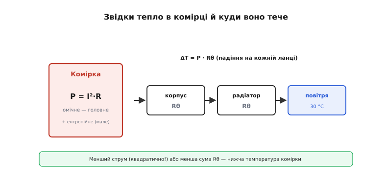
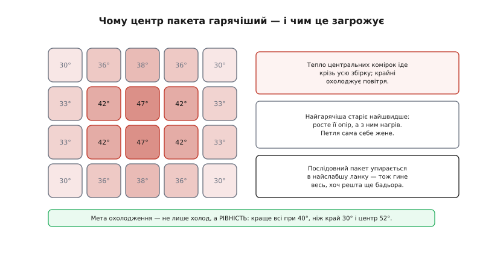
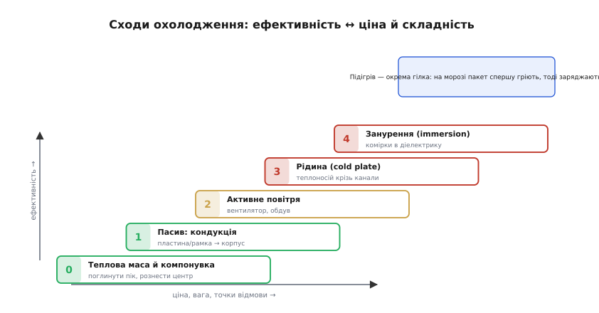

# Тепловий менеджмент батарейного пакета

Окрема комірка в нашій руці — це проста теплова задача: гріється всім боком, віддає тепло в повітря всім боком, і сама ж заодно служить собі радіатором. Щойно ми збираємо з тих самих комірок **пакет** — десятки штук, притиснутих одна до одної, — задача стає іншою за суттю. Комірка в центрі збірки оточена не повітрям, а такими ж гарячими сусідами; її тепло мусить пройти крізь увесь пакет, перш ніж дістанеться поверхні. У попередньому кроці, [розбираючи хімії батарей](root:embedded/battery-chemistries), ми вже бачили, що температура задає і безпеку, і ресурс, і вузьке вікно заряду. Тут ми беремо те саме знання й застосовуємо до реальної конструкції: не «яка хімія терпить яку температуру», а **як зробити так, щоб у живому пакеті потрібна температура трималася сама**.

Слово «менеджмент» (англ. *management*, від лат. *manus* — рука) тут точне: ми не просто охолоджуємо: ми **керуємо** тепловим балансом — стежимо, відводимо, вирівнюємо й, коли треба, гальмуємо саму систему, щоб вона не загнала себе в перегрів. Розберімо це від першопричини: спершу чому тепло взагалі вирішує долю пакета, потім звідки воно береться й куди дівається, тоді — головну біду збірки (нерівномірність), і нарешті сходи рішень від простого до складного разом із прошивкою, яка цим керує.

## Чому тепло вирішує долю пакета

Перш ніж щось охолоджувати, варто чесно спитати: а що, власне, поганого робить тепло? Відповідей три, і вони різні за характером — одна повільна, одна раптова, одна щоденна.

**Перша — старіння, і воно експоненційне.** Хімічні реакції, що поволі вбивають комірку (наростання плівки SEI на аноді, розклад електроліту, корозія), — це звичайні термічно активовані процеси. А такі процеси прискорюються з температурою не лінійно, а **різко**: інженерне правило великого пальця каже, що швидкість реакції приблизно **подвоюється на кожні +10°C**. Тобто пакет, який живе при 45°C замість 25°C, старіє не «трохи швидше», а **вчетверо** швидше — два подвоєння на 20 градусів різниці. Це правило наближене (воно випливає з рівняння Арреніуса й залежить від енергії активації конкретної реакції), але порядок воно передає чесно: [чому саме тепло — головний прискорювач старіння й звідки береться це «×2 на 10°»](root:embedded/battery-pack-thermal/math-arrhenius-aging.md) варто зрозуміти від рівняння, бо на ньому тримається вся арифметика ресурсу. Звідси перший висновок: тепловий менеджмент — це не про «не дати загорітися», а насамперед про **роки служби**. Гарячий пакет помирає тихо й передчасно, без жодного диму.

**Друга — теплова втеча (англ. *thermal runaway*), і вона раптова.** Якщо комірка перегрівається понад межу (для типового Li-ion це починається десь від 80–120°C), всередині запускаються вже **екзотермічні** реакції — такі, що самі виділяють тепло. А виділене тепло піднімає температуру, що пришвидшує реакції, що виділяють ще більше тепла. Це класична **додатна зворотна реакція**: точка, з якої нема вороття. Сепаратор плавиться (близько 130°C), електроди коротять навпростець, температура злітає за лічені секунди до 800°C і вище, комірка викидає полум'я й гарячі гази. Найстрашніше в пакеті — не сама втеча однієї комірки, а **поширення**: розжарена сусідка гріє інші, і ті теж зриваються одна за одною, як ланцюг сірників. Запобігти ланцюгу — окрема інженерна дисципліна; ми торкнемося її наприкінці, а глибше — у кроці про [захист від теплової втечі](root:embedded/thermal-runaway-protection).

> 🔧 **Навіщо це.** Ці дві причини задають дві різні цілі менеджменту, які легко сплутати. Боротьба зі **старінням** — це тримати робочу температуру **низькою й рівною** щодня, роками; тут вистачає скромного відведення тепла. Боротьба з **утечею** — це не дати жодній комірці перетнути аварійний поріг навіть у найгіршому збігу обставин; тут потрібні запас, давачі й аварійне відключення. Перша економить гроші власника, друга рятує життя. Грамотна система робить обидві — але вимоги до неї рахують **окремо**.

**Третя — продуктивність, і вона щоденна.** Як ми бачили на попередньому кроці, **заряд** має вузьке температурне вікно: літій не можна заряджати нижче 0°C (металевий літій осідає голками-дендритами й незворотно вбиває комірку), а на спеці заряд теж обмежують. Тож пакет, що працює на морозі чи в спеку, мусить або гріти себе, або пригальмовувати струм, або взагалі чекати — інакше або зіпсується, або не прийме заряд. Тепловий менеджмент тут — це не лише відведення тепла, а й **підігрів**, і **регулювання струму** під поточну температуру.

Три причини — три кути на ту саму величину. Тепер подивімося, **звідки** це тепло в пакеті береться.

## Звідки береться тепло

Головне джерело — старий знайомий: **омічні втрати**, тепло Джоуля на внутрішньому опорі комірки. Будь-яка комірка має внутрішній опір (англ. *internal resistance*), і коли крізь неї тече струм, на цьому опорі виділяється потужність P = I²·R. Саме цей опір ми вже зустрічали як причину [просідання напруги під навантаженням](topic:electronics/battery-sag): та сама фізика, що «з'їдає» вольти на піку струму, перетворює їх на тепло всередині комірки. Квадрат тут вирішальний: подвоїш струм — учетверо більше тепла. Тому короткі сильнострумові ривки (старт двигуна, зліт дрона, швидкий заряд) гріють пакет куди дужче, ніж тривала спокійна робота тим самим середнім струмом.

**Worked-приклад: скільки тепла віддає комірка під струмом.** Візьмімо типову циліндричну Li-ion комірку 18650 з внутрішнім опором близько 30 мОм, з якої тягнуть 10 А (агресивний, але реальний розряд).

```
Тепло Джоуля у комірці:
  P = I² · R
  P = (10 А)² · 0.030 Ом
  P = 100 · 0.030
  P = 3.0 Вт                  ← стільки тепла в КОЖНІЙ комірці

Пакет 6s4p (24 комірки):
  P_пак = 24 · 3.0 = 72 Вт    ← маленький обігрівач усередині корпусу
```

Три вати на комірку звучать невинно, поки їх одна. Але двадцять чотири комірки в щільному корпусі дають **72 вати** постійного тепловиділення — як невеликий паяльник, замкнений у коробці. Ось чому пакет, що влітку віддає великий струм, потребує продуманого відведення, а не просто «якось саме охолоне».

До омічного тепла додається менш очевидне джерело — **ентропійне** (оборотне) тепло самої реакції. Хімічна реакція в комірці під час заряду й розряду сама поглинає або виділяє тепло, незалежно від опору. Тонкощів тут багато (на одних ділянках кривої комірка під розрядом навіть трохи холоне), але для нашої інженерної оцінки головне інше: ентропійна складова зазвичай **менша** за омічну на серйозних струмах, тож для проєктування відведення орієнтуються насамперед на I²R. Згадуємо її, щоб не дивуватися, чому виміряне тепло не точно дорівнює розрахованому P = I²·R.

І ще одна важлива асиметрія: **заряд гріє інакше, ніж розряд**. Швидкий заряд (особливо наприкінці, коли напруга висока) додає до омічного тепла ще й хімічне, та й сам по собі вузьке вікно заряду менш терпиме до перегріву. Тому пакет, спроєктований під спокійний розряд, може несподівано перегрітися саме на **швидкій зарядці** — і це частий практичний прокол.


*Тепло народжується в комірці (омічне I²R — головне, ентропійне — додаток) і мусить пройти ланцюжок теплових опорів до повітря. Менший струм або менший Rθ — нижча температура комірки.*

## Теплова маса й куди тепло втікає

Виділене тепло не одразу піднімає температуру — спершу воно **накопичується** в самій масі комірки. Тут працює **теплоємність** (англ. *heat capacity*): скільки джоулів треба, щоб нагріти кілограм речовини на один градус. Для Li-ion комірки питома теплоємність — близько **1000 Дж/(кг·К)** (виміряні значення лежать у смузі 800–1100 залежно від хімії й конструкції). Це і добре, і погано: добре, бо масивний пакет нагрівається **повільно** й переживає короткі піки струму, не встигнувши прогрітися; погано, бо так само повільно й **остигає**, тож тепло, накопичене за гарячий день, тягнеться в ніч.

Куди тепло втікає врешті — у навколишнє повітря, і шлях туди не безкоштовний. Між гарячим нутром комірки й прохолодним повітрям стоїть **тепловий опір** (англ. *thermal resistance*, Rθ) — точний електричний аналог звичайного опору, тільки замість струму крізь нього «тече» потужність у ватах, а замість напруги на ньому падає **різниця температур**. Закон той самий, що й Ом: ΔT = P · Rθ. Цей ланцюжок Rθ від переходу до повітря — окрема важлива тема; коротко вона потрібна так: [тепловий опір складається послідовно ланкою за ланкою (комірка → корпус → радіатор → повітря), і саме сума цих ланок задає, на скільки градусів нагріється комірка за даної потужності](topic:physics/thermal-resistance). Що менша сума Rθ, то холодніша комірка за того самого тепла.

**Worked-приклад: на скільки нагріється комірка.** Та сама комірка з прикладу вище віддає 3 Вт. Нехай повний тепловий опір від її нутра до повітря Rθ = 8 °C/Вт (скромне пасивне охолодження, комірка в корпусі без обдуву).

```
Перевищення над повітрям у сталому режимі:
  ΔT = P · Rθ
  ΔT = 3.0 Вт · 8 °C/Вт
  ΔT = 24 °C

Якщо повітря 30°C:
  T_комірки = 30 + 24 = 54 °C   ← уже в зоні прискореного старіння
```

П'ятдесят чотири градуси — це не аварія, комірка не загориться. Але згадаймо правило «×2 на 10°»: при 54°C замість 25°C старіння йде разів у **сім-вісім** швидше. Батарея, розрахована на вісім років, так проживе один-два. І весь цей збиток — не від поломки, а просто від поганого відведення тепла. Зменшимо Rθ удвічі (обдув, тепловідвідна пластина) — і ΔT впаде до 12°C, а ресурс повернеться. Ось чому теплове проєктування пакета — це прямі гроші, а не перестраховка.

## Головна біда збірки: нерівномірність

Дотепер ми рахували одну «середню» комірку. Але справжня біда пакета не в середній температурі, а в **розкиді** температур між комірками. Згадаймо, з чого почали: комірка в центрі збірки оточена гарячими сусідами, її тепло мусить пройти крізь увесь пакет; комірка скраю має повітря під боком. Тому центр завжди гарячіший за край — іноді на 10–15°C у щільній збірці без продуманого відведення.

Чому ця різниця така шкідлива? Через те саме експоненційне старіння. Найгарячіша комірка старіє найшвидше — отже, **втрачає ємність першою**. А пакет із послідовно з'єднаних комірок завжди впирається в **найслабшу** ланку: розряд доводиться спиняти, коли найслабша комірка спорожніла, заряд — коли найсильніша наповнилася. Варто одній комірці (тій, що в гарячому центрі) здати — і весь пакет починає поводитися як стара батарея, хоча решта комірок ще бадьорі. Нерівномірний нагрів **сам себе підсилює**: гаряча комірка старіє → росте її внутрішній опір → на ньому виділяється більше тепла за тим самим струмом (P = I²R) → вона гріється ще дужче за сусідок. Класична петля, що жене розкид угору з кожним циклом.


*Тепло центральних комірок іде крізь усю збірку, крайні охолоджуються повітрям — звідси градієнт. Найгарячіша комірка старіє найшвидше, і весь послідовний пакет упирається в неї як у найслабшу ланку.*

Звідси два інженерні наслідки, які легко проґавити. По-перше, мета охолодження — не лише знизити температуру, а **зробити її рівною** по всьому пакету: краще всі комірки при 40°C, ніж половина при 30°C, а центр при 50°C. По-друге, нерівність температур породжує нерівність **заряду**: гарячіші комірки і саморозряджаються швидше, і деградують швидше, тож розповзаються за напругою. Цей дрейф мусить вирівнювати окрема система — [балансування комірок](root:embedded/active-balancing); теплова рівномірність і балансування працюють у парі, бо кожна без іншої програє. Вимірювати ж і стерегти цей розкид — робота [архітектури BMS](root:embedded/bms-architecture), у якій давачі температури стоять не «десь на платі», а саме на комірках, і бажано на найгарячіших.

## Сходи рішень: від маси до рідини

Як власне відводити тепло? Рішення вишиковуються в сходи — від найдешевшого й найпростішого до складного й дорогого. Інженерне правило: лізти вгору сходами лише тоді, коли нижча сходинка не справляється, бо кожна наступна додає ваги, ціни й точок відмови.

**Сходинка 0 — теплова маса й розумна компонувка.** Найдешевше «охолодження» — те, якого не довелося робити. Якщо піки струму короткі, масивний пакет просто **поглинає** їх своєю теплоємністю, не встигнувши прогрітися, і остигає в паузах. А правильне розміщення комірок — із зазорами, щоб повітря підходило до кожної, і без «глухого» центру — саме по собі вирівнює градієнт. Часто цього досить для пристрою з помірним струмом.

**Сходинка 1 — пасивне відведення (кондукція).** Тепло відводять **провідністю** через тверде тіло: алюмінієва пластина чи рамка, до якої притиснуті комірки, розносить тепло від гарячого центру й віддає його корпусу. Жодних рухомих частин, нічого не споживає, нема чому зламатися. Межа цієї сходинки очевидна з нашої формули ΔT = P·Rθ: пасив працює, лише поки повний Rθ до повітря достатньо малий; як тільки потужність росте, ΔT перевищує допустиме.

**Сходинка 2 — активне повітря.** Коли пасиву мало, додають **вентилятор**: примусовий потік повітря різко знижує тепловий опір «поверхня → повітря». Дешево й ефективно, але з'являється рухома частина (зношується, шумить, тягне струм), фільтр забивається пилом, а саме повітря — кепський теплоносій (мало забирає тепла на градус). Для більшості embedded-пакетів повітря — стеля розумного.

**Сходинка 3 — рідинне охолодження.** Велика потужність (тяговий пакет електромобіля, потужний інвертор) вимагає **рідини**: охолоджувач жене теплоносій крізь канали холодної пластини (англ. *cold plate*), притиснутої до комірок. Рідина забирає на порядок більше тепла на градус, ніж повітря, і тримає пакет і холодним, і рівним. Ціна — насос, шланги, радіатор, теплоносій і ризик протікання поряд із електрикою. Це вже не «додати вентилятор», а окрема підсистема.

**Сходинка 4 — занурення (англ. *immersion*).** Найвищий рівень: комірки **купають** у діелектричній рідині, що забирає тепло прямо з усієї поверхні кожної. Найрівніша температура з можливих, але й найскладніша й найдорожча конструкція — застосовують там, де інакше ніяк (гонкові пакети, надшвидкий заряд).


*Що вища сходинка, то краще відведення — але дорожче, важче й більше точок відмови. Лізти вгору лише коли нижча сходинка не тримає ΔT у нормі.*

Окрема сходинка вбік — **підігрів**. На морозі задача протилежна: пакет треба **гріти**, перш ніж заряджати (нагрівальна плівка, або навмисне «грій себе» малим струмом). Грамотна система часто поєднує обидва: рідинний контур, що влітку охолоджує, взимку жене підігрітий теплоносій.

## Давачі й прошивка: як система керує собою

Уся механіка відведення тепла мертва без **вимірювання** й **рішення**. Серце теплового керування — давачі температури, зазвичай **NTC-термістори** (англ. *NTC* — *negative temperature coefficient*): дешеві напівпровідникові резистори, опір яких **падає** з нагрівом. Те, що нагрів видно прямо як зміну опору, — давня знахідка: ще [Майкл Фарадей 1833 року помітив, що опір сульфіду срібла різко падає з температурою](root:embedded/battery-pack-thermal/hist-thermistor.md) — і це був перший зафіксований напівпровідниковий ефект задовго до самого поняття «напівпровідник». Сьогодні крихітний NTC коштує копійки й читається одним АЦП.

Де ставити давач — питання не дрібне. Поставити його на плату поряд із роз'ємом легко, але він покаже температуру **плати**, а не комірок. Тому давач кріплять **на саму комірку**, і бажано на ту, що найгарячіша (центр збірки) — бо керувати треба за **найгіршою** коміркою, а не за середньою. Скільки давачів — компроміс: один на весь пакет дешевий, але сліпий до градієнта; по одному на групу комірок дає бачити розкид. У серйозному пакеті давачів кілька, і прошивка завжди дивиться на **максимум** із них.

Маючи температуру, прошивка реалізує головний інструмент захисту — **зниження струму за температурою** (англ. *thermal foldback*, від *fold back* — «загнути назад»). Логіка проста й надійна: поки комірка прохолодна, дозволяємо повний струм; коли температура переходить поріг — плавно **зрізаємо** дозволений струм; біля аварійної межі — спиняємо зовсім. Менший струм → менше тепла Джоуля (квадратично!) → температура повзе вниз сама. Це від'ємний зворотний зв'язок, що не дає пакету загнати себе в перегрів.

**Worked-приклад: лінійне зрізання струму заряду за температурою.** Простий, але робочий шматок прошивки. Заряд на повну до 35°C, далі лінійно зрізаємо до нуля на 45°C, а нижче 0°C заряд узагалі заборонений (вікно заряду з попереднього кроку).

```c
// Поточний максимум струму заряду (мА) за температурою найгарячішої комірки.
// t_c10 — температура у десятих градуса Цельсія (напр. 372 = 37.2 °C),
// щоб не тягнути float у гарячий шлях прошивки.
int32_t charge_limit_ma(int32_t t_c10) {
    const int32_t I_MAX   = 4000;   // повний струм заряду, мА
    const int32_t T_COLD  =   0;    // нижче 0 °C заряд літію заборонений
    const int32_t T_WARM  = 350;    // 35.0 °C — починаємо зрізати
    const int32_t T_HOT   = 450;    // 45.0 °C — повна заборона

    if (t_c10 < T_COLD)  return 0;          // мороз: чекаємо/гріємо
    if (t_c10 < T_WARM)  return I_MAX;       // прохолодно: повний струм
    if (t_c10 >= T_HOT)  return 0;           // гаряче: стоп

    // зона 35..45 °C: лінійно від I_MAX до 0
    int32_t span  = T_HOT - T_WARM;          // 100 десятих = 10 °C
    int32_t above = t_c10 - T_WARM;          // наскільки зайшли в зону
    return I_MAX * (span - above) / span;    // ціла арифметика, без float
}
```

Зверніть увагу на дві практичні дрібниці. По-перше, працюємо в **десятих градуса** цілими числами — у гарячому шляху прошивки float зайвий і повільний. По-друге, керуємо за **найгарячішою** коміркою: на вхід функції подаємо `max()` усіх давачів, бо саме найгарячіша комірка визначає, що дозволено всьому пакету. Повноцінний варіант із кількома давачами, гістерезисом (щоб струм не «дзвенів» на межі порога) і окремою гілкою підігріву на морозі заслуговує окремого розбору: [як зібрати надійний тепловий регулятор заряду з кількох NTC, гістерезисом і станами «грій / заряджай / стоп»](root:embedded/battery-pack-thermal/proj-thermal-foldback.md) — там і повний код, і пастки.

> 🔧 **Навіщо це.** Без foldback захист зводиться до грубого «вимкнути все на аварії» — а це або занадто рано (втрачаємо корисність), або занадто пізно (комірка вже постраждала). Плавне зрізання дозволяє пакету працювати **на межі безпечного**, віддаючи максимум, який дозволяє поточна температура, і ніколи її не перетинаючи. Той самий принцип — окремими порогами по розряду, заряду й по швидкості зростання температури — лежить в основі будь-якого теплового захисту BMS.

## Останній рубіж: не дати ланцюгу початися

Усе вище береже пакет від **повільної** смерті — старіння й перегріву в нормальній роботі. Лишається **раптова** загроза: теплова втеча однієї комірки (від внутрішнього дефекту, проколу, перезаряду) — те, чого жодне охолодження не скасує, бо тепло народжується всередині швидше, ніж устигає відводитися. Тут мета інша: не запобігти події в одній комірці, а **не дати їй стати ланцюгом**, що забере весь пакет.

Працюють на це конструкцією, не прошивкою. Між комірками лишають **зазори або теплові бар'єри** (вогнетривкі прокладки, спіненець), щоб полум'я й жар однієї комірки не запалили сусідку. Гарячі гази скеровують **назовні** каналами вентиляції, подалі від інших комірок і від електроніки. А механічна компоновка не дає розжареній комірці фізично торкнутися сусідньої. Завдання — виграти час: щоб одна комірка згоріла **сама**, а пакет, утративши її, лишився цілим. Це окрема дисципліна зі своїми правилами, і їй присвячений крок про [захист від теплової втечі](root:embedded/thermal-runaway-protection); тут досить запам'ятати, що теплова рівномірність і зазори між комірками працюють на одну мету — щоб локальна біда не стала глобальною. Коли тепловий бік пакета під контролем, постає наступне практичне питання автономного пристрою — куди витікає його енергія, поки він «спить»; йому присвячений наступний крок, [аудит струму спокою](root:embedded/sleep-current-audit).
