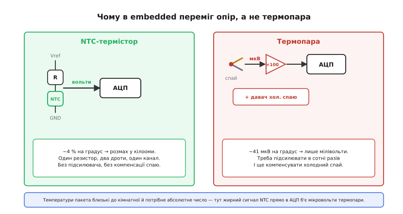

# 📜 Як нагрів став опором: від сірчаного срібла Фарадея до копійчаного NTC

У самій темі ми поставили на гарячі комірки крихітний давач і прочитали його опір одним АЦП — буденна дрібниця сучасної прошивки. Та за цією буденністю стоїть майже двісті років історії, і починається вона не з давача, не з батареї й навіть не з поняття «напівпровідник», якого тоді ще не існувало. Починається вона з людини, що шукала зовсім інше, — і натрапила на ефект, який ніхто не міг пояснити ще ціле століття.

Питання, яке варто тримати в голові, читаючи цю історію, просте: **чому ми взагалі вимірюємо температуру батареї через опір, а не якось простіше?** Адже є термопари, є ртутні термометри, є біметалеві пластини. Відповідь на це питання — і є та нитка, що тягнеться від несподіваного спостереження 1833 року до тих копійчаних намистин, що сьогодні стережуть кожен літієвий пакет. Розберімося, як нагрів став опором — і чому саме це виявилося так зручно.

---

## Дивний випадок: метал, що поводиться навпаки

У 1833 році **Майкл Фарадей** (англ. *Michael Faraday*) — той самий, чиїм ім'ям ми звемо клітку, що екранує від поля, і чиї закони індукції лежать в основі всіх трансформаторів, — порпався з різними речовинами, пропускаючи крізь них струм. Серед них трапився **сульфід срібла** (Ag₂S), який Фарадей називав «сірчаним сріблом» (англ. *sulphuret of silver*) — темна сполука срібла й сірки. І тут він побачив дещо, що суперечило всьому відомому про провідники.

Щоб відчути, наскільки це було дивно, треба згадати, як поводяться нормальні метали. Візьми мідний дріт і нагрій його — його опір **зросте**. Це знає всякий, хто має справу з електрикою: розжарена нитка лампи має значно більший опір, ніж холодна. Причина проста й інтуїтивна: у металі струм несуть вільні електрони, а нагрів змушує атоми кристалічної ґратки сильніше **дрижати**; ці коливання заважають електронам пролітати, і опір росте з температурою. Чим гарячіше — тим тіснішим і вибоїстішим стає шлях для носіїв.

> 🔧 **Навіщо це.** Це не музейний факт, а робочий інструмент. Той самий метал, що в Фарадея «поводився нормально», сьогодні працює давачем — платиновим термометром опору (RTD), де опір росте з температурою майже лінійно. Що опір металу взагалі залежить від температури і **чому** він росте з нагрівом — окрема фізична основа: [у металі нагрів дужче розхитує ґратку, носіям важче протиснутися, тож опір лінійно повзе вгору з температурою](book:physics/resistance-temperature). Зрозумівши, чому метал і напівпровідник реагують на нагрів **протилежно**, ти одразу бачиш, чому в embedded для дешевого вимірювання беруть одне, а для точного й широкодіапазонного — інше.

А сульфід срібла зробив **протилежне**. Фарадей записав в «Експериментальних дослідженнях з електрики» (англ. *Experimental Researches in Electricity*) фразу, що стала точкою відліку для цілої галузі: «Я нещодавно натрапив на надзвичайний випадок… який прямо протиставлений впливові тепла на металеві тіла… При піднесенні лампи… провідна здатність швидко зростала з нагрівом». Грів сполуку — і вона проводила струм **краще**, не гірше. Опір **падав**.

Для Фарадея це був просто «надзвичайний випадок», курйоз, що не вкладався в правило. Він не мав і не міг мати пояснення — бо пояснення вимагало квантової фізики твердого тіла, до якої лишалося майже сто років. Та з висоти нашого знання ми бачимо, що Фарадей першим у світі зафіксував **напівпровідниковий ефект** — і саме той його різновид, який нам тут потрібен: опір, що **спадає** з нагрівом. Англійською це згодом назвуть *negative temperature coefficient*, від'ємний температурний коефіцієнт, — те саме скорочення **NTC**, що ми пишемо в даташиті давача на гарячу комірку. Перший зафіксований NTC у історії — це грудка сульфіду срібла на столі Фарадея.

Цей факт усталений: і Музей історії комп'ютерів (англ. *Computer History Museum*) у своїй хронології напівпровідників, і сучасні довідники одностайно ставлять 1833 рік і сульфід срібла як **перше задокументоване спостереження напівпровідникової поведінки** взагалі — задовго до селену, германію й кремнію, задовго до самого слова «напівпровідник».

---

## Чому нагрів знижує опір: інтуїція без квантів

Перш ніж іти далі історією, варто зрозуміти, **чому** напівпровідник реагує навпаки, — бо саме цей механізм робить NTC таким чутливим давачем, а отже й таким зручним для нас. Повна картина — це квантова теорія зон, але інтуїцію можна вхопити й без неї.

У металі вільних електронів повно завжди, за будь-якої температури: їх там стільки, скільки атомів, і нагрів їхньої кількості майже не міняє — він лише заважає їм рухатися. Тому в металі нагрів = більше завад = більший опір, і крапка.

У напівпровіднику картина інакша в корені. За абсолютного нуля носіїв там **немає зовсім** — усі електрони міцно сидять у зв'язках і нікуди не течуть, матеріал майже ізолятор. Щоб електрон **звільнився** й став носієм струму, йому треба дати порцію енергії — «відірвати» його від зв'язку. І ось тут нагрів працює на нас: теплова енергія саме й **вивільняє** носіїв. Що гарячіше — то більше електронів отримало достатній копняк, щоб відірватися й понести струм. Кількість носіїв зростає з температурою — і то **різко**, по експоненті.

Тепер змагаються два протилежні впливи нагріву. З одного боку, як і в металі, гарячіша ґратка дужче трясеться й заважає рухатися (це штовхає опір угору). З іншого — носіїв стає експоненційно більше (це тягне опір униз). У напівпровіднику другий ефект **перемагає з величезним запасом**: поява нових носіїв легко переважає погіршення їхньої рухливості. Підсумок: чим гарячіше — тим більше носіїв — тим нижчий опір. Ось і весь NTC.

```
Метал:          нагрів → ґратка дрижить дужче → носіям важче → R РОСТЕ
Напівпровідник: нагрів → вивільняє носіїв (експонента!) → R ПАДАЄ різко
```

Слово «різко» тут — ключове, і саме воно згодом зробить NTC переможцем як давач. Опір типового NTC-термістора падає десь на **4 % на кожен градус** нагріву — це у рази крутіша реакція, ніж у платинового RTD (близько 0.4 % на градус). Велика зміна опору з малої зміни температури означає, що навіть простою схемою легко вловити частку градуса. Запам'ятаймо це — повернемося, коли питатимемо, чому в embedded NTC побив термопару.

---

## Сто років мовчання: чому з ефекту довго не було давача

Тут постає природне питання: якщо Фарадей побачив ефект ще 1833 року, чому термістор як виріб з'явився аж за сто років? Чому ця «надзвичайна» властивість так довго лежала без діла?

Причин кілька, і всі вони повчальні — бо показують різницю між **побачити явище** і **зробити з нього річ**.

Перша причина — **не було теорії**. Фарадей зафіксував факт, але ніхто не розумів механізму. Поняття «напівпровідник» сформувалося лише в кінці XIX століття, а справжнє розуміння — зонна теорія, носії, домішки — прийшло аж у 1930-х разом із квантовою механікою твердого тіла. Сто років ефект був курйозом без імені: його помічали то в селені, то в інших сполуках, але не мали в що його вкласти. Важко свідомо будувати давач на явищі, якого не розумієш.

Друга причина — глибша й суто інженерна: **рання нестабільність і невідтворюваність**. Сульфід срібла та подібні природні сполуки — кепський матеріал для давача. Їхній опір «плив» з часом, залежав від найдрібніших домішок і від точного складу зразка, від вологи й історії нагрівів. Два шматки «однієї» речовини могли поводитися по-різному, а один і той самий шматок — по-різному сьогодні й завтра. А давач температури безвартісний, якщо його показ не **повторюваний**: тобі потрібно, щоб опір 10 кОм завжди й надійно означав одну й ту саму температуру, інакше за чим калібрувати? Саме ця невідтворюваність, а не брак ідеї, сто років тримала NTC у статусі лабораторної цікавинки.

> 🔧 **Навіщо це.** Та сама вимога живе в нашому пакеті досьогодні. Коли прошивка зрізає струм заряду за температурою найгарячішої комірки, вона мовчки **довіряє**, що опір давача однозначно перекладається в градуси за табличкою з даташита. Уся цінність копійчаного NTC — не в тому, що його опір падає з нагрівом (це й сульфід срібла вмів 1833 року), а в тому, що він падає **передбачувано й однаково від штуки до штуки**. Те, чого бракувало сто років, — і є те, за що ми сьогодні платимо копійки.

Третя причина — банальна, але важлива: **не було попиту й технології масового спікання**. Доки не настала ера радіо й електроніки, нікому не був гостро потрібен дешевий електричний давач температури чи елемент термокомпенсації. А коли потреба з'явилася, виявилося, що приборкати матеріал можна лише штучно — і це підводить нас до людини, яка зробила з курйозу виріб.

---

## Семюел Рубен і перший придатний термістор (1930)

Перший **комерційно придатний** термістор зробив 1930 року американський винахідник **Семюел Рубен** (англ. *Samuel Ruben*, 1900–1988). Постать яскрава: народився в єврейській родині в Гаррісоні, штат Нью-Джерсі; формальної вищої освіти майже не мав, зате мав власну лабораторію й нюх на практичні винаходи. За життя на його ім'я виписали понад **дві сотні патентів**; це той самий Рубен, що згодом, у роки Другої світової, у парі з Філіпом Меллорі (англ. *Philip Mallory*) створить **ртутну батарейку** — а з тієї співпраці виросте компанія, відома нам як **Duracell**. До термістора він уже встиг винайти сухий алюмінієвий **електролітичний конденсатор** — той клас деталей, що й досі стоїть у кожному блоці живлення. Людина, що приборкала енергійні матеріали в живленні, приборкала й норовливий напівпровідник у давачі.

Як саме він натрапив на термістор — історія майже така ж випадкова, як у Фарадея, і добре передає дух епохи. За поширеною версією (її подають кілька галузевих джерел, тож берімо її як **правдоподібну, але не документовану з першоджерела**), Рубен працював не над давачем, а над електронним **звукознімачем** для програвача платівок. Налагоджуючи схему, він помітив, що один із вузлів має надто великий від'ємний температурний коефіцієнт — опір помітно «гуляв» від нагріву. Те, що для звукознімача було вадою, Рубен побачив як **корисну властивість**: ось матеріал, опір якого слухняно йде за температурою.

Та головна його заслуга — не в тому, що він знову помітив старий ефект Фарадея, а в тому, що він зробив із нього **придатний, відтворюваний прилад**. Замість норовливих природних сполук Рубен пішов шляхом **штучно спечених оксидів металів** (англ. *sintered metal oxides*) — сумішей оксидів марганцю, нікелю, кобальту, спечених у тверду кераміку. Це й була та ключова цеглинка, якої бракувало сто років: підбираючи склад суміші й режим спікання, можна **задати наперед** і номінальний опір, і крутизну кривої, і — найважливіше — зробити так, щоб партія за партією виходили **однакові** давачі. Свою конструкцію термокомпенсувального резистора він закріпив патентом (виданим 1935 року, патент США № 2 021 491).

```
Фарадей 1833:  ПОБАЧИВ ефект    — сульфід срібла, опір падає з нагрівом (NTC)
                ↓  ~100 років: нема теорії, матеріал «пливе», нема попиту
Рубен  1930:   ЗРОБИВ ПРИЛАД    — спечені оксиди: опір ЗАДАНИЙ і ПОВТОРЮВАНИЙ
```

Звідси й сама назва. **Термістор** (англ. *thermistor*) — це стягнення з *thermal resistor*, «тепловий резистор»; термін усталився згодом, коли спечені оксидні давачі пішли в серію. Поняття «напівпровідник» на той час уже міцно стояло на ногах, тож винахід Рубена — це вже свідоме приборкання відомого фізикам ефекту, а не сліпий курйоз, як у Фарадея.

Перше широке застосування термісторам дала, як це часто буває, **війна**. Під час Другої світової їх масово ставили в радіоапаратуру й апаратуру зв'язку — для термокомпенсації схем і вимірювання температури там, де треба була надійність у спеці й холоді. Саме воєнний попит вивів спечені оксидні термістори з лабораторії в масове виробництво — а вже звідти, дешевшаючи десятиліттями, вони дійшли до тієї копійчаної намистини, що сьогодні приклеєна до комірки в нашому пакеті.

---

## Чому в embedded переміг опір, а не термопара

Тепер ми готові відповісти на питання, з якого почали: чому температуру батареї ми міряємо саме через опір? Адже найвідоміший давач температури в техніці — це **термопара** (англ. *thermocouple*): спай двох різних металів, що сам **виробляє** напругу, пропорційну різниці температур між спаєм і вільними кінцями (ефект Зеебека). Здавалося б, давач, що сам дає сигнал і не потребує живлення, мав би бути зручнішим. У промисловій печі — так. У нашому батарейному пакеті — рішуче ні, і ось чому.

Порівняймо два давачі очима прошивки, що сидить на дешевому мікроконтролері з вбудованим АЦП.

**Термопара віддає мізерний сигнал.** Її вихід — десятки мікровольт на градус (для популярної пари типу K — близько 41 мкВ/°C). Уся робоча різниця температур пакета — це жалюгідні **мілівольти**. Щоб такий сигнал прочитати звичайним АЦП, його треба спершу **підсилити** прецизійним підсилювачем у сотні разів, ретельно борючись із дрейфом нуля й шумом, — інакше корисний сигнал потоне в наводках. Це окрема аналогова схема, місце на платі й гроші.

**Термопарі потрібна компенсація холодного спаю.** Термопара міряє не абсолютну температуру, а **різницю** між гарячим спаєм і своїми вільними кінцями. Тож щоб дізнатися справжню температуру комірки, треба ще й **окремо виміряти температуру тих кінців** (англ. *cold-junction compensation*) — ще один давач, ще обчислення. Для печі на 800°C ця морока виправдана. Для пакета, де всі температури й так близькі до кімнатної, вона безглузда: ти ставиш складний давач різниці там, де тобі потрібне просте абсолютне число.

**NTC віддає велику, готову до читання зміну.** А тепер NTC. Його опір міняється на згадані **~4 % на градус** — це не мікровольти, а **кілооми**. Ставиш NTC у простий [дільник напруги](book:electronics/voltage-divider) з одним звичайним резистором, подаєш на дільник опорну напругу — і на середній точці одразу маєш напругу в **вольтах**, що добре, з розмахом гуляє від температури. Жодного прецизійного підсилювача, жодної компенсації спаю: один резистор, два дроти, один канал АЦП — те, що ми й бачили в темі. Велика крутизна кривої Фарадеєвого ефекту, та сама, що сто років заважала зробити **стабільний** давач, обертається тут головною перевагою: ти отримуєш жирний сигнал майже задарма.


*Зліва — NTC: один резистор у дільнику дає на АЦП напругу в вольтах із розмахом у кілооми опору. Справа — термопара: мікровольтовий сигнал треба підсилювати в сотні разів і ще компенсувати холодний спай. Для близьких до кімнатної температур пакета перше — копійки, друге — окрема аналогова підсистема.*

Звісно, у NTC є й своя ціна, і чесно її назвати. Його крива **різко нелінійна** — опір падає по експоненті, а не прямою, тож «сирий» опір треба перекладати в градуси або табличкою-довідником у пам'яті, або формулою (інженери користуються рівнянням Стейнгарта–Гарта чи параметром *B*). Він добре працює лише у вузькому температурному діапазоні навколо кімнатного — але це **рівно той діапазон, що цікавить батарею** (приблизно від −40 до +125°C). І він не зрівняється з платиновим RTD у точності й широті діапазону — але нам тут не потрібна метрологічна точність печі, нам потрібно дешево й надійно знати, що комірка перейшла 45°C. Для цієї задачі копійчаний NTC незрівнянний.

```
Термопара:  сам дає напругу, АЛЕ ~41 мкВ/°C → треба підсилювач + компенсація спаю
            добра для сотень градусів (печі, двигуни)
NTC:        треба живити дільник, ЗАТЕ ~кОм/°C → прямо в АЦП, без підсилювача
            ідеальна для −40…+125 °C — тобто саме для батареї
```

> 🔧 **Навіщо це.** Вибір давача — це завжди вибір під **задачу й діапазон**, а не пошук «найточнішого взагалі». Для батарейного пакета вимоги такі: близькі до кімнатної температури, потрібне абсолютне значення, копійчана ціна на десятки точок виміру, мінімум аналогової обв'язки на тісній платі. Під цей профіль NTC підходить як влитий — і саме тому той самий ефект, що спантеличив Фарадея 1833 року й сто років не давався в прилад, сьогодні стереже кожну гарячу комірку в нашому пакеті.

---

## Що з цієї історії лишається в руках

Коротка нитка через майже два століття виглядає так. **Фарадей 1833** року побачив, що сульфід срібла проводить струм тим краще, чим він гарячіший, — і, сам того не знаючи, зафіксував перший в історії напівпровідниковий ефект, ще й саме того типу (NTC), що нам потрібен. Сто років ефект лишався курйозом: бракувало і теорії, щоб його зрозуміти, і — головне — здатності зробити з нього **стабільний, повторюваний** матеріал. **Рубен 1930** року закрив цю прогалину, перейшовши від норовливих природних сполук до штучно спечених оксидів, опір яких можна **задати наперед** і відтворити від партії до партії, — і тим перетворив фізичний курйоз на придатний прилад. Війна вивела термістори в серію, а десятиліття здешевлення — у ту копійчану намистину, що сьогодні читається одним АЦП.

А головний практичний висновок, який варто винести в роботу з пакетом, простий: **NTC переміг у embedded не точністю, а зручністю під конкретну задачу**. Його велика, нехай і нелінійна, зміна опору з температурою дає жирний сигнал прямо в АЦП без підсилювачів і компенсацій — саме те, що треба, щоб дешево й надійно стерегти десятки гарячих комірок у вузькому вікні навколо кімнатної температури. Те, що для метрологічної печі було б вадою, для батареї виявилося ідеалом. Так несподіване спостереження Фарадея, пройшовши крізь сторіччя нерозуміння й винахідливість Рубена, опинилося приклеєним до літієвої комірки у твоїй руці.
