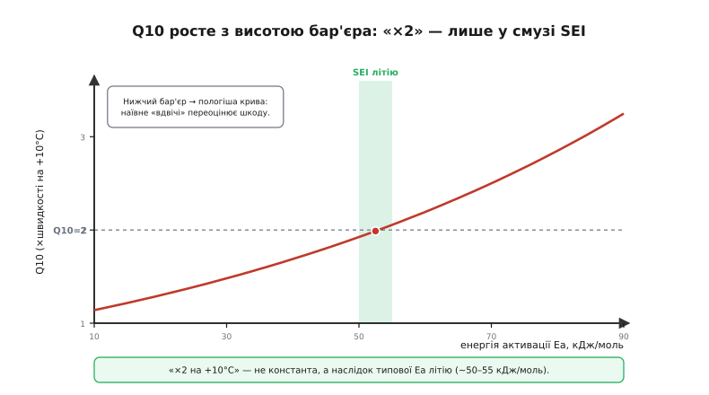

# 🧮 Чому тепло = експоненційне старіння: рівняння Арреніуса

У темі ми кілька разів сперлися на правило, яке звучить надто рівно, щоб бути правдою: швидкість старіння комірки **подвоюється на кожні +10°C**, тож пакет при 45°C старіє «вчетверо» швидше за пакет при 25°C. Звідки береться це «вдвічі»? Чому саме експонента, а не пряма й не квадрат? І де воно перестає працювати — бо будь-яке правило великого пальця десь ламається, і інженер мусить знати де, перш ніж довіряти йому ресурс на роки.

Тут ми розберемо це від самого низу — від того, що насправді робиться між молекулами в комірці, коли її гріють. Мета не вивести формулу заради формули, а **побачити власними очима**, чому температура входить у швидкість реакції так дико нерівномірно, і навчитися рахувати наслідок: у скільки разів швидше помирає гарячий пакет і як це перекласти в роки служби. Окремо стоїть **хід цього старіння в часі** (чому втрата ємності росте як корінь із часу, а не прямою) — це теж частина повної картини, і її докладно розбирає [математика календарного старіння як стороння стаття](book:electronics/battery-aging/math-calendar-arrhenius.md): SEI наростає дедалі повільніше, тож втрата ∝ √t. Ми ж тут зосередимось на **множнику температури** — бо саме ним керує тепловий менеджмент пакета: відвів тепло — знизив T — пригальмував усю хімію старіння одразу.

## Означення: рівняння Арреніуса

Хімічні реакції, що поволі вбивають комірку, — наростання плівки SEI на аноді, повільний розклад електроліту, корозія струмоз'ємів — це **термічно активовані** процеси. Спільна їхня риса: щоб реакція відбулася, молекулам мало просто зустрітися — їм треба зустрітися **з достатньою енергією**, щоб подолати енергетичний бар'єр і перебудувати зв'язки. Цей бар'єр називають **енергією активації** (англ. *activation energy*, *Ea*) — найменша «вхідна плата» енергії, без якої реакція не запускається.

Швидкість такої реакції з температурою описує **рівняння Арреніуса**:

```
k(T) = A · e^(−Ea / (R·T))

   k   — стала швидкості реакції (тут: темп старіння комірки)
   A   — передекспоненційний множник (частота спроб, орієнтація молекул)
   Ea  — енергія активації, Дж/моль (висота бар'єра)
   R   — універсальна газова стала, 8.314 Дж/(моль·К)
   T   — АБСОЛЮТНА температура, кельвіни (°C + 273.15)
```

Назвав його так Сванте Арреніус (швед. *Svante Arrhenius*, шведський фізикохімік) 1889 року, спираючись на спостереження голландця Якоба Вант-Гоффа (*Jacobus van 't Hoff*), який ще 1884-го помітив подібну форму для сталих рівноваги. Саме Арреніус увів і саме поняття «енергія активації» — як висоту бар'єра, що пояснює, чому реакціям треба підкинути тепла, щоб пішли. Це **усталений факт**, наріжний камінь хімічної кінетики, а не спірна атрибуція.

Уся дія тут — в **експоненті**, та ще й із оберненою температурою всередині. Поки ми не розкриємо, що ховається за цим `e^(−Ea/RT)`, формула лишається магічним заклинанням. Розкриймо.

## Інтуїція: чому експонента, а не пряма

Уявімо мільярди молекул електроліту біля поверхні анода. У кожної є якась теплова енергія, але **не однакова**: вони безперервно стикаються й обмінюються нею, тож у будь-яку мить одні ледь повзають, інші мчать. Енергія розподілена по натовпу за добре відомим законом — **розподілом Больцмана** (нім. фізик Людвіг Больцман): частка молекул, що мають енергію не менше за деяке *E*, спадає експоненційно — `∝ e^(−E/kT)`. Чим вища планка *E*, тим експоненційно менше молекул її беруть; чим вища температура *T*, тим більше.

Тепер ключ. Реакцію запускають **не всі** молекули, а лише ті рідкісні, чия енергія перевищила бар'єр *Ea*. Тобто темп реакції пропорційний саме **частці молекул із-понад бар'єром** — а ця частка і є тим больцманівським «хвостом»:

```
частка молекул з енергією ≥ Ea  ∝  e^(−Ea / (R·T))
```

> 🔧 **Навіщо це.** Ось чому температура входить так нерівномірно. Гріючи комірку, ми **не підсилюємо** кожну реакцію потроху — ми **переселяємо більше молекул за бар'єр**. А населення «хвоста» розподілу росте не лінійно: підняли T трохи — і експоненційно більше молекул раптом дотяглися до планки. Тому скромні +10°C дають не +10% старіння, а кратний стрибок. Тепловий менеджмент тому й вирішальний: він керує не дрібним відсотком, а множником.

Аналогія: уяви турнікет заввишки *Ea*, який пускає лише тих, хто стрибне вище. Натовп біжить із різними швидкостями. Підвищив усім температуру — додав усім трохи розгону, але через турнікет проскочить **непропорційно більше** людей, бо до планки дотягуються вже й ті, кому раніше бракувало зовсім трохи. Де аналогія ламається: турнікет — різкий поріг «вище/нижче», а в хімії бар'єр розмитий, і внесок дає весь хвіст розподілу; та головна риса — «маленький приріст енергії → кратно більше тих, хто за планкою» — передана точно.

Звідси й форма: оскільки темп `k ∝ e^(−Ea/RT)`, а в показнику стоїть `1/T`, маленька зміна температури множиться на велике `Ea/R` і дає кратну, а не додаткову зміну швидкості. Лишилося полічити, наскільки кратну.

## Формальний апарат: звідки «×2 на +10°C»

Абсолютних значень `k` нам і не треба — у комірці ми ніколи не знаємо ні `A`, ні точного `Ea` напевно. Але нам і не потрібні абсолюти: питання завжди **відносне** — у скільки разів швидше старіє комірка за вищої температури проти нижчої. А у відношенні множник `A` просто скорочується, лишаючи чистий Арреніус:

```
k(T₂)        Ea   ( 1     1  )
─────  =  exp[ ── · ( ── − ──  ) ]
k(T₁)         R    ( T₁    T₂ )
```

Це наш робочий інструмент. Підставмо в нього крок у **+10°C** — і подивимось, чи справді вийде «вдвічі». Для старіння Li-ion типова енергія активації SEI-механізму — близько **50 кДж/моль** (виміряні значення лежать у смузі приблизно 25–55 кДж/моль залежно від того, який саме процес домінує; на цьому розкиді ми ще спіткнемось далі):

**Крок із 25°C до 35°C при Ea = 50 кДж/моль.**

```
Ea/R = 50000 / 8.314 ≈ 6014 К

1/T₁ − 1/T₂ = 1/298.15 − 1/308.15
            = 0.0033540 − 0.0032452
            = 0.00010879  1/К

показник = 6014 · 0.00010879 ≈ 0.654

k(35°)/k(25°) = e^0.654 ≈ 1.92        ← майже рівно вдвічі
```

Ось і все «×2 на +10°C» — воно не константа природи, а **наслідок** того, що типова `Ea` літієвих реакцій разом із кімнатними температурами дає в показнику число близько `ln 2 ≈ 0.69`. Інша `Ea` — інший множник: за крутішого бар'єра старіння подвоювалося б навіть на менших кроках, за пологішого — ледь росло б. Літій просто вдало лягає коло двійки.

Зручно ввести для цього окрему величину — **температурний коефіцієнт Q10** (нім. *Q* від *Quotient*, «частка»): у скільки разів зростає швидкість на кожні +10°C. З формули вище:

```
Q10(T) = exp[ (Ea/R) · ( 1/T − 1/(T+10) ) ]
```

Для нашого випадку Q10 ≈ 1.9 — округлено й кажуть «вдвічі». Q10 ≈ 2 — це усталене інженерне й біологічне правило великого пальця (воно ж відоме в фізіології ензимів), і воно **прямо випливає** з Арреніуса для бар'єрів помірної висоти. Але — і це головне, що тут варто винести, — Q10 **не стала**. Подивімося чому.

## Де Q10 «дихає»: правило не стале

У формулі Q10 сидять дві величини, від яких він залежить: висота бар'єра `Ea` й **абсолютна** температура `T`. Змінюється будь-яка — пливе й Q10.

**Q10 залежить від енергії активації.** Чим вищий бар'єр, тим крутіший больцманівський хвіст реагує на нагрів — тим більший множник на ті самі +10°C:

```
Q10 коло 25°C (T = 298 К) залежно від Ea:

   Ea = 25 кДж/моль  →  Q10 ≈ 1.39    (ледь півтора)
   Ea = 36 кДж/моль  →  Q10 ≈ 1.60
   Ea = 50 кДж/моль  →  Q10 ≈ 1.92    ← «правило вдвічі»
   Ea = 55 кДж/моль  →  Q10 ≈ 2.06
   Ea = 80 кДж/моль  →  Q10 ≈ 2.85    (майже втричі)
```

Видно одразу: «×2 на +10°C» правдиве лише для бар'єрів десь коло 50–55 кДж/моль. А це й є саме та `Ea`, з якою росте SEI у літії, — ось чому правило так наполегливо тримається саме для батарей, а не випадково. Якщо ж домінує інша реакція з нижчою `Ea` (а виміри календарної втрати ємності дають і 25–30 кДж/моль), Q10 падає до ~1.4, і наївне «вдвічі» **переоцінить** шкоду тепла. Правило чесне за порядком величини, але не за точним числом.

> 🔧 **Навіщо це.** Звідси практичний висновок для проєктувальника: не приймай «×2 на +10°C» за точну гарантію. Якщо в даташиті чи в тесті є реальні точки втрати ємності за двох температур — витягни з них **свою** `Ea` (через ту саму формулу відношення) і рахуй уже за нею. Один-єдиний коефіцієнт «двійка» — це орієнтир для прикидки наосліп, а не підстава закладати ресурс пакета.

**Q10 залежить і від абсолютної температури.** Той самий бар'єр дає різний Q10 на холоді й на спеці — бо в показнику стоїть `1/T`, і однаковий крок у +10°C «важить» менше, коли база температури вища:

```
Той самий Ea = 50 кДж/моль, але крок +10°C від різної бази:

   від 25°C (298 К)  →  Q10 ≈ 1.92
   від 45°C (318 К)  →  Q10 ≈ 1.78
```

Тобто перша десятка градусів (25→35) коштує дорожче за другу (35→45) у відносному вимірі. Це наслідок саме оберненої температури в Арреніусі: множник `1/T₁ − 1/T₂` дрібнішає, коли обидві температури вищі. На практиці різниця невелика, але вона нагадує: «вдвічі на кожні десять» — згладжене усереднення по діапазону, а не точний закон на кожному відрізку.


*Температурний коефіцієнт Q10 проти енергії активації (коло 25°C). Зелена смуга — діапазон SEI-реакцій літію (~50–55 кДж/моль), де Q10 справді близький до 2. Нижчі бар'єри дають пологіше зростання, тож наївне «вдвічі» переоцінює шкоду; вищі — навпаки.*

## Де в темі це працює: 45°C проти 25°C

Тепер головний розрахунок теми — той самий, що ми згадали в статті побіжно, але тепер виведений чесно. Пакет, який живе при **45°C** замість **25°C**: у скільки разів швидше йде його хімія старіння? Двадцять градусів — це два кроки по десять, тож наївно очікуємо «два подвоєння» = ×4. Перевіримо точно.

**Відношення темпу старіння при 45°C проти 25°C, Ea = 50 кДж/моль.**

```
1/T₁ − 1/T₂ = 1/298.15 − 1/318.15
            = 0.0033540 − 0.0031432
            = 0.00021080  1/К

показник = (50000/8.314) · 0.00021080 = 6014 · 0.00021080 ≈ 1.268

k(45°)/k(25°) = e^1.268 ≈ 3.55
```

Виходить **×3.5**, а не рівно ×4 — бо, як ми щойно бачили, друга десятка градусів важить трохи менше за першу, та й Ea = 50 дає Q10 ледь нижче двійки. Якщо взяти трохи крутіший SEI-бар'єр Ea = 55 кДж/моль, відношення підскакує до **×4.0** — рівно «два подвоєння». А на ще гарячіших 54°C (приклад зі статті, де комірка під поганим відведенням тепла) при Ea ≈ 55 кДж/моль виходить уже **×7** — звідси й «сім-вісім разів швидше», що ми називали в темі. Числа сходяться: правило великого пальця — це чесне округлення Арреніуса для літієвих бар'єрів.

Запам'ятати варто діапазон, а не одне число: **45°C проти 25°C — це приблизно втричі-вчетверо швидша хімія старіння**, залежно від того, яка саме реакція домінує. Уже цього досить, щоб тепловідведення окупало себе. Але повна картина — ще цікавіша, бо це лише множник **швидкості**. Лишилося перекласти швидкість у роки.

## Від швидкості до років служби

Тут ховається тонкість, яку легко проґавити й через яку «×4 швидше» **не** означає просто «вчетверо коротше життя». Згадаймо хід календарного старіння в часі: втрата ємності росте не прямою, а як **корінь із часу**, бо SEI сам собі заважає рости (детально — у [сторонній статті про математику календарного старіння](book:electronics/battery-aging/math-calendar-arrhenius.md)). Запишімо обидва множники разом:

```
втрата(T, t) ≈ K · k(T) · √t  ,   де k(T) = e^(−Ea/RT)
```

«Кінець життя» настає, коли втрата дотягнеться до якогось порога (скажімо, −20% ємності). Спитаймо: за який **час** пакет дійде до цього порога за різних температур? Прирівняймо втрату до порога й розв'яжімо відносно `t`:

```
поріг = K · k(T) · √t_життя

⟹  √t_життя ∝ 1 / k(T)

⟹  t_життя ∝ 1 / k(T)²        ← КВАДРАТ, бо втрата йде як √t
```

Ось воно. Через √t-хід **час служби обернено пропорційний квадрату швидкості**. Отже якщо нагрів пришвидшив хімію в ×3.5, календарний ресурс впаде не в 3.5, а приблизно в **3.5² ≈ 12 разів**; якщо в ×4 — то в **×16**. Пакет, розрахований на десять років при 25°C, при постійних 45°C дотягне календарно менше року.

**Наскрізний приклад: 25°C проти 45°C у роки.** Хай пакет при 25°C доходить до −20% ємності за умовні **10 років** (лише календарне старіння, без циклів).

```
множник швидкості при 45°C (Ea = 50):   k(45)/k(25) ≈ 3.55

час служби масштабується як 1/k²:
   t(45°) ≈ 10 років / 3.55² = 10 / 12.6 ≈ 0.8 року
```

Менше року проти десяти — лише через 20°C перегріву. Це **оцінка зверху** (чисто календарна частина, ідеальний √t), і реальний пакет тримається трохи довше, бо поріг −20% часто визначають цикли, а не лише полиця, — але порядок шокує саме тому, що квадрат від множника б'є нещадно.

> 🔧 **Навіщо це.** Ось чому в темі ми наполягали, що тепловідведення — це **прямі роки служби**, а не перестраховка. Інженерна спокуса — мислити лінійно: «нагрілося на 20° — постаріє вдвічі-втричі, переживемо». Насправді через √t-хід календарного старіння розплата квадратична: помірний перегрів коштує не відсотків, а **кратного** скорочення життя. Кожен градус, який зрізало добре охолодження, повертається роками — і цю арифметику варто тримати в голові, коли вирішуєш, лізти чи ні на наступну [сходинку охолодження](root:embedded/battery-pack-thermal).

Тут же — і причина, чому **нерівномірність** пакета така згубна (про неї ми говорили окремо). Найгарячіша комірка має найбільший `k`, її календарний ресурс падає за тим самим квадратом, тож вона здає першою — а послідовний пакет упирається в неї як у найслабшу ланку. Різниця в якихось 10°C між центром і краєм збірки — це, за нашою формулою, різниця в ресурсі тих комірок у кілька разів.

## Зв'язок із календарною деградацією й де закон ламається

Усе вище стосується **календарного** старіння — повільного в'янення комірки просто від часу й температури, навіть якщо нею не користуються. Саме на нього тепловий менеджмент впливає найпрямоліше: він не змінює ні хімію, ні поріг, він лише **тисне на множник** `k(T)`, тримаючи робочу температуру нижчою. Циклічне старіння (від заряд-розрядних циклів) має свою, іншу математику й іншу форму кривої в часі — але й воно прискорюється з температурою за тим самим Арреніусом, тож холодний пакет виграє на обох фронтах.

І, як годиться чесній моделі, окреслимо межі — щоб не вірити формулі там, де вона бреше:

- **Ea не одна.** За різних температур і станів заряду домінують різні реакції зі своїми бар'єрами (виміряні значення для літію розкидані від ~25 до ~60 кДж/моль). Тому єдиний Q10 — усереднення; графік відношення швидкостей насправді не ідеально прямий у координатах Арреніуса.
- **На холоді все інакше.** Нижче кімнатної температури в літії домінує вже не SEI, а **осад металевого літію** при заряді — інший механізм з іншою температурною залежністю. Тому залежність старіння від температури має радше **V-подібну** форму: і спека шкідлива (швидкий SEI), і мороз шкідливий (осад літію під час заряду), а оптимум — десь посередині. Самий лише Арреніус це не описує: він каже «холодніше — повільніше», що правда тільки для калільної гілки.
- **Арреніус — про швидкість, не про обрив.** Формула описує плавне старіння, але нічого не каже про раптову теплову втечу від дефекту чи проколу — там тепло народжується швидше, ніж відводиться, і жодне «×2 на +10°» вже не діє. Це інша, аварійна фізика.

Підсумок коротко. Тепло вбиває комірку експоненційно не з примхи, а тому, що нагрів **переселяє непропорційно більше молекул за енергетичний бар'єр** реакцій старіння — це й є `e^(−Ea/RT)` у рівнянні Арреніуса. Правило «×2 на кожні +10°C» (Q10 ≈ 2) — чесне округлення цієї експоненти саме для літієвих SEI-бар'єрів (~50–55 кДж/моль), але Q10 не стала: він менший для нижчих бар'єрів і трохи пливе з абсолютною температурою. Перегрів із 25°C до 45°C пришвидшує хімію старіння втричі-вчетверо, а через √t-хід календарної втрати це обертається **квадратичним** ударом по роках служби — менш ніж рік замість десяти. Ось чому кожен градус, що його зрізав тепловий менеджмент, — це не перестраховка, а конкретні, обчислювані роки життя пакета.
