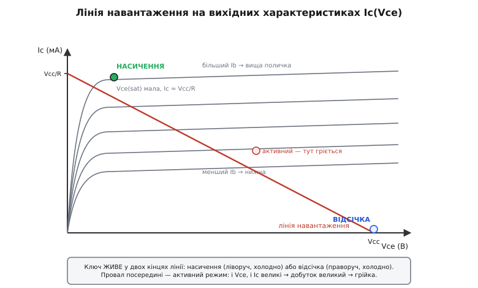
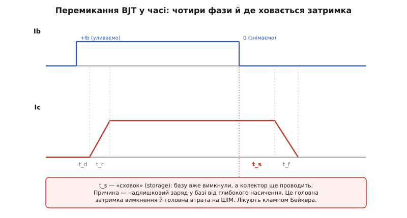
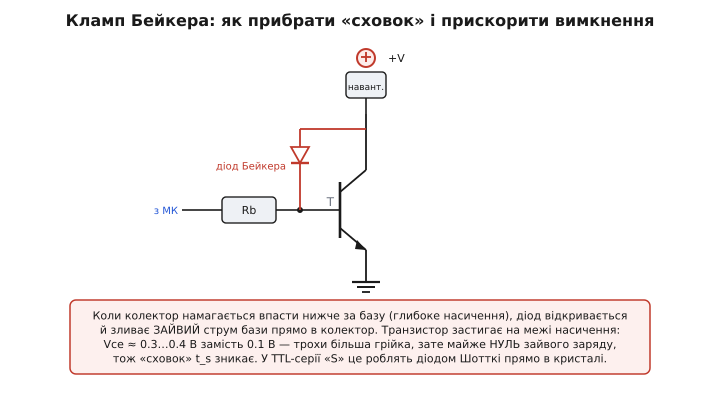
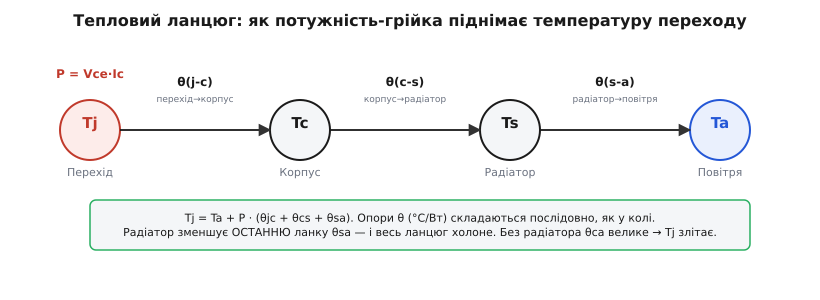
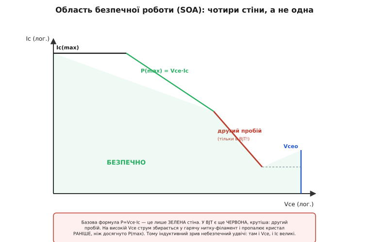
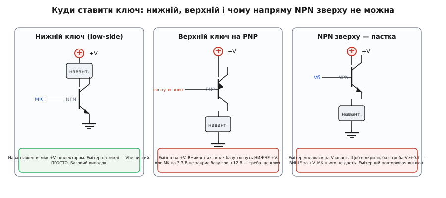

# Керування навантаженням: глибший розбір

<preknowlist>
- [Тепловий опір](topic:ph-thermodynamics/thermal-resistance) — θ (°C/Вт) як «опір» тепловому потоку; перепад температури ΔT = P·θ, опори в ланцюгу складаються.
- [Брикання котушки](topic:hw-components/inductor-kickback) — при вимиканні індуктивність кидає стрибок напруги, у рази більший за живлення; саме він жене робочу точку ключа в небезпечну зону.
</preknowlist>

У [базовій частині цього кроку](root:embedded/bjt-load-driving) ми навчилися головного ремесла: прочитати сім рядків даташита, взяти запас по струму й напрузі, порахувати резистор бази на **найгірше** β, поставити гасний діод і перевірити грійку через `P = Vce·Ic`. Того рецепта вистачає, щоб увімкнути реле й не спалити транзистор. Але кожен його пункт спирається на щось глибше, чого базова версія лише торкнулася — а на практиці саме ці глибші шари вирішують, працюватиме драйвер **надійно роками** чи тихо здохне через місяць.

Ця стаття — про той другий шар. Чому Vce(sat) взагалі не нуль і від чого залежить? Що насправді означає «перезалити базу» й де межа, за якою це шкодить? Чому транзистор, який ідеально працює на реле, **розсипається на ШІМ** — і що з цим роблять? Звідки береться скошена червона лінія на графіку безпечної роботи, якої немає у формулі `P = Vce·Ic`? І як увімкнути навантаження, в якого один кінець уже прибитий до плюса? Ми не переказуватимемо рецепт — ми **розберемо його зсередини**, від фізики переходів до коду прошивки, щоб кожне число в розрахунку стало зрозумілим, а не завченим.

## Чому вивід мікроконтролера справді кволий

Базова версія сказала: вивід дає «5…20 мА, і це майже стеля». Варто зрозуміти, **звідки** ця стеля й чому її не можна тихо перевищити «трішки».

Вивід *(GPIO pin)* — це насправді пара крихітних транзисторів усередині мікроконтролера: один тягне вивід до живлення (віддає струм назовні, англ. *source*), інший — до землі (**приймає** струм у себе, англ. *sink* — «стік»). Кожен має свій ненульовий опір у відкритому стані. Коли ти вантажиш вивід струмом, на цьому опорі падає напруга — і **логічний рівень пливе**: «одиниця» просідає нижче за живлення, «нуль» піднімається над землею. Даташит гарантує коректний рівень лише в межах паспортного струму; за ним рівень стає непевним, а сам вихідний транзистор гріється у власному крихітному кристалі, де немає жодного радіатора.

> 🔧 **Навіщо це.** У даташитах МК є два різні числа. Перше — **рекомендований** струм виводу (recommended operating, напр. 8…20 мА): у цих межах усе за паспортом. Друге — **абсолютний максимум** (absolute maximum, іноді 40 мА на вивід і, окремо, сумарний ліміт на всі виводи порту й на весь чип). Абсолютний максимум — це **межа руйнування**, а не робоча точка: коротко пережити можна, постійно тримати — ні. Драйвер бази завжди рахуємо на **рекомендований** струм, і з запасом; інакше гарячого дня один вивід «попливе» перший.

Є ще асиметрія, яку легко проґавити: у багатьох МК вивід **краще приймає струм у себе, ніж віддає** (стік сильніший за витікання). Тому базова схема — NPN знизу, база тягнеться виводом **до плюса** живлення логіки — не завжди оптимальна за струмом; іноді вигідніше керувати так, щоб робочий струм ішов на **стік** (вивід тягне до землі). До цього ми повернемось, коли розбиратимемо PNP і верхній ключ.

## Що насправді відбувається в насиченні

Ось перше глибоке питання. Ми женемо транзистор у **насичення** *(saturation)*, щоб на ньому падало якнайменше — але падає все одно Vce(sat) ≈ 0.1…0.3 В, а не нуль. Чому саме стільки? Щоб відповісти, треба зазирнути в самі переходи.

[Транзистор має два p-n переходи](topic:hw-components/bjt-structure): база–емітер і база–колектор. У звичному **активному** режимі перший відкритий (провідний), другий закритий (замкнений напругою). Транзистор працює як [керований струмом кран](topic:hw-components/transistor-idea): маленький струм бази відчиняє великий струм колектора, і між ними тримається відношення Ic ≈ β·Ib.

> Щоб точно передбачити струми через обидва переходи за будь-яких напруг, користуються **[моделлю Еберса–Молла](topic:hw-analog/ebers-moll)** — двома зустрічними діодами зі спільним керуванням. Саме з неї строго виводяться і [формула Vce(sat), і поняття «forced β»](topic:hw-components/bjt-regions/detail), якими ми зараз користуватимемось; тут беремо готовий результат.

Насичення настає, коли струм бази стає **надлишковим** — більшим, ніж активному режиму треба для даного Ic. Кран уже відкрито «на повну», колекторного струму більше взяти нема звідки (його обмежує зовнішнє навантаження, `Ic ≈ Vcc/R`), а база все підливає. Надлишку нема куди подітися — і він **відчиняє другий перехід**, база–колектор. Тепер обидва переходи відкриті. Ось ключ до розуміння Vce(sat):

```
Vce = Vbe − Vbc     (за двома відкритими переходами)
```

Обидві напруги — це прямі падіння на p-n переходах, кожна близько 0.7…0.8 В, і вони майже рівні й **майже гасять одна одну**. Різниця — це й є ті десяті вольта. Точне значення визначає не якась одна напруга, а **відношення струмів**: наскільки глибоко ми зайшли за поріг насичення. Що більший надлишок бази — то глибше насичення й то менша Vce(sat), але зі спадною віддачею: перший десяток відсотків надлишку прибирає більшу частину напруги, а далі крива майже кладеться.

До цих двох майже-рівних напруг додається ще дрібний доданок — падіння на **власному опорі** тіла колектора й контактів (rc·Ic). На великих струмах саме він починає домінувати у Vce(sat); ось чому в даташиті Vce(sat) наведена **при конкретному струмі** (напр. «Vce(sat) = 0.3 В при Ic = 150 мА, Ib = 15 мА») — при вдвічі більшому струмі вона буде помітно вища.

> 🔧 **Навіщо це.** Читаючи Vce(sat) з даташита, завжди дивись **умови вимірювання** — при якому Ic і при якому Ib її зняли. Виробник дає красиве мале число при щедрому базовому струмі (часто Ib = Ic/10). Якщо ти в реальній схемі даєш базі менше, ніж у тій умові, твоя Vce(sat) буде **більшою** за паспортну — і грійка більшою. Число з даташита дійсне лише для його ж умов.

Є один рисунок, що вкладає всю цю картину в голову раз і назавжди — **лінія навантаження** на вихідних характеристиках. Наносимо родину кривих Ic(Vce) при різних Ib (кожна — «поличка», що круто зростає в насиченні й майже кладеться в активному), а поверх — пряму, задану зовнішнім навантаженням: від точки (Vcc, 0) до (0, Vcc/R). Робоча точка транзистора **завжди сидить на перетині** цієї прямої з кривою поточного Ib. Гнати ключ у насичення — значить заганяти цей перетин у лівий верхній кут; вимкнути — у правий нижній.


*Робоча точка живе на перетині лінії навантаження з кривою поточного Ib. Ключ тримають у двох кінцях прямої — насичення (ліворуч, холодно) або відсічка (праворуч, холодно). Провал посередині — активний режим, де і Vce, і Ic великі: там транзистор гріється.*

Ось геометричний зміст усього кроку: **керувати навантаженням** — це ганяти робочу точку між двома **холодними** кінцями лінії й **швидко проскакувати** гарячу середину. Реле проскакує її разів кілька на секунду — байдуже. ШІМ проскакує тисячі разів на секунду — і саме на цих проскоках, у гарячій середині, накопичується перемикальна втрата, до якої ми ще дійдемо.

### Forced β й коефіцієнт перезаливу

Тепер строго те, що базова версія назвала «перезалити базу ×3…×10». У насиченні реальне відношення струмів **менше** за паспортне β — бо струму колектора фізично більше не стає, хоч базі й підливають. Це робоче відношення називають **вимушеним бета** *(forced beta)*:

```
β(forced) = Ic / Ib          (у робочій точці ключа, а не з даташита)
```

Транзистор входить у насичення, коли ми женемо базу так, що β(forced) стає **помітно меншим** за гарантоване β(min) з даташита. Наскільки менше — задає **коефіцієнт перезаливу** *(overdrive factor, ODF)*:

```
ODF = Ib(реальний) / Ib(на межі) = β(min) / β(forced)
```

ODF = 1 — транзистор рівно на **краю** насичення (Vce ще висока, грійка велика). ODF = 3…10 — він у **глибокому** насиченні (Vce(sat) мала). Практичне правило «форсуй базу так, щоб β(forced) ≈ 10…20» — це і є вибір ODF, тільки з іншого боку: якщо β(min) = 100, то β(forced) = 10 означає ODF ≈ 10.

**Умова: заганяємо 2N2222 у глибоке насичення для Ic = 200 мА.**
```
β(min) з даташита (при 150 мА) ≈ 50
Ib на межі насичення = Ic / β(min) = 200 / 50 = 4.0 мА
Беремо ODF = 4  →  Ib(робочий) = 4 × 4.0 = 16 мА
Тоді β(forced) = Ic / Ib = 200 / 16 = 12.5   ← добре в насиченні
```
Тепер видно всю логіку разом: ми хочемо малий β(forced) (глибоке насичення, мала Vce(sat)), і задаємо його через ODF відносно **гарантованого** β(min). Брати ODF надто великим спокусливо — Vce(sat) впаде ще трохи, — але зараз побачимо, чому це коштує дорого при швидкому перемиканні.

## Резистор бази: повне виведення з усіма межами

Базова формула була `Rb = (Uсигналу − 0.7) / Ib`. Розгорнімо кожен член — саме тут ховаються помилки, що вилазять «на морозі» чи «на спеці».

Напруга, що реально доступна резистору бази, — це не номінальні «5 В», а **вихідна напруга високого рівня** виводу під навантаженням, Voh. Ми щойно бачили: вивід має внутрішній опір, і коли він віддає струм бази, його «одиниця» просідає. Точний баланс:

```
Voh(МК) = Vbe(on) + Ib·Rb
  →  Rb = (Voh − Vbe(on)) / Ib
```

Три уточнення перетворюють це з формули на надійний розрахунок.

**Перше — Voh, а не Vdd.** Для 3.3-В логіки під струмом кілька мА Voh може бути 3.0…3.2 В, не 3.3. Якщо порахувати на 3.3, реальний Ib вийде **меншим** за задуманий — і ODF просяде. Тому беремо Voh **з даташита МК** при потрібному струмі (або консервативно −0.3…−0.4 В від Vdd).

**Друге — Vbe(on) залежить від температури.** Пряме падіння переходу база–емітер має від'ємний тепловий коефіцієнт ≈ −2 мВ/°C: на гарячому транзисторі Vbe **падає** (напр. з 0.7 до ~0.55 В при +85 °C). Це, на щастя, працює **на нас** для струму бази (менше Vbe → більше падіння на Rb → більший Ib), але враховувати напрям корисно.

**Третє — округляти Rb треба ВНИЗ, до меншого стандартного номіналу.** Ось чому: менший Rb дає **більший** Ib, тобто більший ODF і глибше насичення. Округлення вгору зменшує Ib — і на найгіршому екземплярі (низьке β) можна не дотягнути до насичення. Дешева страховка — завжди в бік більшого струму бази.

**Умова: драйвер від 3.3-В МК, навантаження Ic = 300 мА, β(min) = 40.**
```
Ib(межа) = 300 / 40 = 7.5 мА
ODF = 5   →   Ib = 37.5 мА          ← СТОП: перевір вивід!
```
Тут спрацьовує запобіжник із базової версії, тільки тепер видно, чому: 37.5 мА в базу **не витримає жоден звичайний вивід** (рекомендований — до ~20 мА). Це сигнал: одиночний BJT із таким низьким β не годиться. Виходи — вищий-β транзистор, пара Дарлінгтона (сумарне β в тисячі, база просить мікроампери) або MOSFET. Візьмімо ODF помірним, ×2, аби вкластися:
```
Ib = 2 × 7.5 = 15 мА                ← у межах виводу
Voh(3.3 В, 15 мА) ≈ 3.0 В (з даташита)
Vbe(on) ≈ 0.75 В (беремо теплий запас для гіршого струму)
Rb = (3.0 − 0.75) / 0.015 = 150 Ом  ← стандартний, округлення не треба
Перевірка β(forced) = 300 / 15 = 20 ← насичення неглибоке, але робоче
```
Порівняй два розрахунки: перший показав, **де межа виводу ламає задум**, другий — робочий компроміс. Це і є інженерна суть кроку: не «підставити в формулу», а знайти точку, де сходяться струм навантаження, β транзистора й бюджет виводу.

## Динаміка: чому ключ, що любить реле, ненавидить ШІМ

Ось найважливіше, чого базова версія не торкнулася зовсім. Усе дотепер було про **статичний** стан: увімкнув — і тримай. Реле, лампа, соленоїд перемикаються рідко, тож статики досить. Але щойно ми беремося **швидко перемикати** — керувати яскравістю світлодіода чи обертами моторчика через [широтно-імпульсну модуляцію](root:embedded/pwm-power-control) на кілька кГц — статичної картини стає катастрофічно мало. Транзистор, що в реле лишався холодним, тут може **згоріти**. Щоб зрозуміти чому, розкладімо одне перемикання в часі.


*Ib міняється миттєво, Ic — ні. Затримка ввімкнення t_d, наростання t_r, а на вимкненні — «сховок» t_s (колектор ще проводить після зняття бази!) і лише потім спад t_f. Уся втрата ховається у нахилах.*

Коли ми подаємо струм у базу, колектор відповідає **не миттєво**. Перехід має ємність, і базу треба спершу «зарядити». Розгортаються чотири фази:

- **Затримка ввімкнення t_d** *(delay time)* — база заряджається до порогу, Ic ще нуль.
- **Наростання t_r** *(rise time)* — Ic піднімається від нуля до повного. **Під час наростання Vce ще висока, а Ic уже тече** — на транзисторі одночасно велика напруга й великий струм.
- **Сховок t_s** *(storage time)* — найпідступніша. Ми зняли струм бази (наказали вимкнутись), а колектор **ще проводить на повну**. Транзистор ніби не чує команди.
- **Спад t_f** *(fall time)* — нарешті Ic падає до нуля. Знову перекриття: Vce росте, Ic ще є.

Звідки береться сховок? Це прямий наслідок глибокого насичення, яке ми старанно створювали. У насиченні обидва переходи відкриті, і в базі накопичується **надлишковий заряд** носіїв — ціле «озеро». Поки це озеро не стече (через базу назовні або не рекомбінує всередині), транзистор фізично не може закритися: колектор проводить, доки є заряд. Що глибше насичення (більший ODF) — то більше озеро — то довший t_s. **Ось розплата за великий ODF**, яку ми обіцяли: кожен зайвий одиниця перезаливу подовжує вимкнення.

> 🔧 **Навіщо це.** Тепер зрозуміло, чому «форсуй базу якомога сильніше» — погана порада для ШІМ. Великий ODF дає красиву малу Vce(sat) у статиці, але роздуває сховок t_s, а сховок — це чиста затримка, що спотворює шпаруватість і додає втрат. Для реле це байдуже (перемикань одиниці на секунду), для ШІМ на 20 кГц — фатально. Правило перевертається: **для швидкого перемикання ODF тримають помірним**, а зі сховком борються окремо (нижче).

### Втрата на перемиканні — інтеграл, а не добуток

У статиці втрата була `P = Vce(sat)·Ic` — крихітна. У динаміці з'являється **друга** втрата, і рахується вона інакше. Під час t_r і t_f Vce й Ic **перекриваються**: обидва не нульові одночасно. Миттєва потужність p(t) = Vce(t)·Ic(t) в ці моменти злітає — на транзисторі гине енергія за кожен фронт. Наближено (лінійні фронти):

```
E(фронт) ≈ ½ · Vcc · Ic · t(фронт)      [Дж за один перехід]
```

Помножимо на частоту перемикань — і дістанемо **потужність перемикання**:

```
P(sw) ≈ ½ · Vcc · Ic · (t_r + t_f) · f
```

До неї додається статична (провідна) втрата з поправкою на шпаруватість D:

```
P(разом) = D·Vce(sat)·Ic  +  ½·Vcc·Ic·(t_r + t_f)·f
             └ провідна ┘      └── перемикальна ──┘
```

**Умова: моторчик 12 В / 0.5 А, ШІМ 20 кГц, D = 50%, звичайний BJT із t_r = t_f = 300 нс.**
```
Провідна:      0.5 · 0.3 В · 0.5 А = 0.075 Вт
Перемикальна:  ½ · 12 · 0.5 · (300 + 300)e−9 · 20000
             = ½ · 12 · 0.5 · 600e−9 · 20000
             = 0.036 Вт  ... начебто теж дрібниця?
```
На 20 кГц ще терпимо. А тепер підніми частоту до 200 кГц (або візьми повільніший силовий транзистор із t_r+t_f ≈ 2 мкс):
```
Перемикальна (200 кГц):  ½ · 12 · 0.5 · 600e−9 · 200000 = 0.36 Вт
Перемикальна (2 мкс, 20 кГц): ½ · 12 · 0.5 · 2000e−9 · 20000 = 0.12 Вт
```
Перемикальна втрата **лінійно росте з частотою** й **лінійно з часом фронтів**. Ось чому та сама формула `P = Vce·Ic`, що дала 21 мВт на реле, тут вводить в оману: вона бачить лише провідну частину. На високій частоті вирок виносить **перемикальна** втрата — а її визначають t_r, t_f і **сховок**, тобто динаміка, а не Vce(sat).

> 🔧 **Навіщо це.** Коли транзистор гріється на ШІМ, а `P = Vce(sat)·Ic` каже, що все добре, — винна перемикальна втрата. Два ліки: перемикати **швидше** (менші t_r, t_f — Baker clamp, сильніший фронт бази) або перемикати **рідше** (нижча частота). І саме тут біполярний масово програє польовому: у [MOSFET немає накопиченого заряду в базі](root:embedded/bjt-vs-mosfet) (керується полем, а не струмом), тож немає сховку, і фронти на порядок швидші.

## Як прибрати сховок: кламп Бейкера, прискорювальний конденсатор, Шотткі-транзистор

Сховок т_s — не фатум. З ним борються трьома способами, і всі три варто розуміти, бо їх видно у «швидкій» логіці й силових драйверах.

**Кламп Бейкера** *(Baker clamp)* — найелегантніший. Ідея: не пускати транзистор у глибоке насичення взагалі, тримати його на самій **межі**, де надлишкового заряду майже нема. Роблять це діодом від колектора до бази. Коли колектор намагається впасти нижче за базу (ознака глибокого насичення), діод відкривається й **зливає зайвий струм бази прямо в колектор**, обминаючи транзистор. Це нелінійний від'ємний зворотний зв'язок: чим глибше транзистор лізе в насичення, тим сильніше діод його стримує.


*Кламп Бейкера застигає транзистор на краю насичення. Vce виходить трохи вища (≈0.3…0.4 В замість 0.1), зате надлишкового заряду майже нема — сховок зникає, вимкнення різке.*

Історія тут гарна й документована: схему описав **Річард Бейкер** *(Richard H. Baker)* у звіті Лінкольнівської лабораторії MIT «Maximum Efficiency Transistor Switching Circuits» 1956 року (патент США 3,010,031, виданий 21 листопада 1961). Це усталений факт, не легенда. Розплата за кламп — трохи вища Vce (отже, трохи більша провідна втрата), зате **різке** вимкнення й нуль сховку. Класичний обмін «статична грійка ↔ швидкість».

**Шотткі-транзистор** — той самий кламп, вбудований у кристал. Замість звичайного діода ставлять [діод Шотткі](root:embedded/zener-schottky) прямо між базою й колектором, у самому корпусі. Його пряме падіння (~0.3 В) менше за Vbe, тож він перехоплює струм **раніше**, ніж перехід база–колектор устигне відкритись і накопичити заряд, і перемикається сам майже без затримки. Саме так зроблено логіку серії **74S** («S» — Schottky) і низькопотужну **74LS**: транзистори в них узагалі не входять у глибоке насичення, тому й швидкі.

**Прискорювальний конденсатор** *(speedup capacitor)* — інший підхід, до самої бази. Паралельно резистору Rb ставлять невеликий конденсатор. У момент фронту він **закорочує** Rb і дає в базу різкий сплеск струму — на ввімкненні швидко заливає заряд, на вимкненні швидко **висмоктує** його назад. У сталому стані конденсатор заряджений і не заважає, струм тече через Rb як звичайно. Бейкер, до речі, у своїх схемах користувався і клампом, і прискорювальними конденсаторами.

> 🔧 **Навіщо це.** У прошивці ти цих компонентів не бачиш, але наслідки — так. Якщо старий silabs/AVR-проєкт ганяє BJT-ключ на десятки кГц без клампа й «підозріло гріється», діагноз майже завжди — сховок і перемикальна втрата. Рішення на платі: діод Шотткі колектор→база (кламп) або перехід на логічний MOSFET. У коді сховок теж видно — як **мертвий час**, на який реальний фронт запізнюється проти регістра порівняння ШІМ.

## Тепло по-справжньому: ланцюг теплових опорів і крива derating

Базова версія перевірила грійку й сказала «TO-92 лишається холодним». Але щойно з'являються вати (силовий ключ, Дарлінгтон на амперах, перемикальна втрата), треба вміти рахувати не «холодно/гаряче», а **конкретну температуру кристала** — бо саме її обмежує даташит (Tj(max), звичайно 150 °C). І тут працює красива аналогія з законом Ома.

Тепло від кристала до навколишнього повітря тече не миттєво — воно долає **опори** на кожній межі: кристал→корпус, корпус→радіатор, радіатор→повітря. Ці [теплові опори](topic:ph-thermodynamics/thermal-resistance) θ (одиниця — °C/Вт) поводяться **точно як електричні в послідовному колі**: складаються, а «струм» (потужність-грійка P) на кожному створює «спад напруги» (перепад температури ΔT = P·θ).


*Тепловий ланцюг = послідовне коло. P — «струм», θ — «опори», температури — «потенціали». Tj = Ta + P·(θjc + θcs + θsa). Радіатор зменшує останню ланку — і весь ланцюг холоне.*

Звідси — головна формула теплового розрахунку:

```
Tj = Ta + P · (θjc + θcs + θsa)
```

де Tj — температура кристала *(junction)*, Ta — навколишня *(ambient)*, θjc — від переходу до корпусу (з даташита транзистора), θcs — від корпусу до радіатора (визначає термопаста/прокладка), θsa — від радіатора до повітря (з даташита радіатора). Без радіатора останні дві ланки замінює одна велика θca (корпус→повітря напряму) — для TO-92 це ~200 °C/Вт, для TO-220 без радіатора ~62 °C/Вт.

**Умова: TIP120 (Дарлінгтон) жене 2 А, Vce(sat) ≈ 2 В, θjc = 1.9 °C/Вт, повітря 40 °C.**
```
P = Vce(sat)·Ic = 2 В · 2 А = 4 Вт          (ті самі 4 Вт із базової версії)

Без радіатора (θca ≈ 62 °C/Вт для TO-220):
Tj = 40 + 4 · 62 = 40 + 248 = 288 °C        ← ПОНАД Tj(max)=150! Згорить.

З радіатором θsa = 5 °C/Вт, паста θcs = 0.5:
Tj = 40 + 4 · (1.9 + 0.5 + 5) = 40 + 4·7.4 = 40 + 29.6 = 69.6 °C   ← безпечно
```
Одна й та сама грійка 4 Вт: без радіатора — миттєва смерть, із радіатором — тепла, але жива деталь. Ось чому базова порада «великий струм → радіатор» — не побажання, а арифметична необхідність, і тепер видно, **скільки саме** °C/Вт треба збити.

### Звідки береться скошена лінія derating

Базова версія згадала: дозволену потужність зі зростанням температури **знижують**. Тепер виведемо цю лінію. Максимальна потужність — це не константа Ptot, а те, що вкладається в тепловий бюджет **до** Tj(max):

```
P(max, при даній Ta) = (Tj(max) − Ta) / θca
```

Це рівняння прямої, спадної з Ta. Точка старту — паспортна Ptot при Ta = 25 °C. При Ta = Tj(max) чисельник обертається в нуль: **дозволена потужність = 0**, бо кристал уже й так на межі, жодного бюджету на грійку не лишилось. Між цими точками — пряма, і **нахил її задає саме θca**: круте падіння в кепському корпусі, полога лінія — з радіатором. Ось чому в даташиті поруч із Ptot завжди стоїть «derating: X мВт/°C понад 25 °C» — це просто 1/θca.

> 🔧 **Навіщо це.** «Прилад на 1 Вт» — напівправда: це 1 Вт **при 25 °C і на нескінченному радіаторі**. У реальному гарячому корпусі влітку доступна потужність може бути втричі меншою. Проєктуй на **робочу** Ta (у корпусі це часто 50…70 °C, не 25), інакше літня спека виявить прихований дефіцит бюджету.

Є ще тонкість для **імпульсної** роботи: короткий сплеск потужності кристал терпить більший, ніж тривалий, бо кремній має теплову **ємність** — не встигає прогрітись за один імпульс. Даташити силових приладів дають це кривою «transient thermal impedance» Zθ(t): для коротких імпульсів ефективний θ **менший** за постійний. Саме тому пусковий кидок мотора на кілька мілісекунд транзистор переживає, хоч у тривалому режимі такий струм його б спік.

## Друга стіна: область безпечної роботи й другий пробій

Тепер — межа, про яку базова версія промовчала, а вона рятує від найзагадковіших відмов. Досі виходило, що безпека = дві умови: не перевищ Ic(max) і не перевищ P(max). Наче цього досить. **Не досить** — принаймні для біполярного.

Зберімо всі обмеження на один графік Ic проти Vce (у логарифмічних осях) — це **область безпечної роботи** *(Safe Operating Area, SOA)*. У неї чотири стіни, і третя — несподівана.


*Чотири стіни SOA. Формула P=Vce·Ic — лише зелена. Червона, крутіша — другий пробій, суто біполярна: на високій Vce струм збирається в гарячу нитку й пропалює кристал раніше за P(max).*

- **Горизонтальна стеля** — Ic(max), стельовий струм.
- **Похила лінія постійної потужності** — P(max) = Vce·Ic (у лог-осях це пряма з нахилом −1). Ось наша знайома формула.
- **Крутіша похила** — **другий пробій** *(second breakdown)*. Ось нова стіна.
- **Вертикальна стіна** — Vceo, пробій напруги.

Що таке другий пробій? У сильнострумовому BJT на **високій** Vce струм перестає текти рівномірно по всьому кристалу. Через від'ємний тепловий коефіцієнт переходу трохи тепліша ділянка проводить трохи більше струму → гріється ще дужче → притягує ще більше струму. Це позитивний тепловий зв'язок, але **локальний**: увесь струм збирається в мікроскопічну **нитку-філамент** *(current crowding)*, у ній щільність потужності зашкалює, і кремній у цій точці **плавиться** — миттєво, задовго до того, як **середня** потужність по кристалу досягне P(max). Прилад пробиває «нізвідки», хоч за формулою `P = Vce·Ic` усе було в межах.

Це відрізняє другий пробій від звичайного **[теплового розгону](topic:hw-components/bjt-thermal-runaway)**, який ми згадували в базовій. Тепловий розгін — це прогрів **усього** кристала (повільний, глобальний, ловиться середньою температурою). Другий пробій — **локальний і раптовий**: одна точка, за мілісекунди, і жоден датчик температури корпусу не встигне. У MOSFET цього ефекту здебільшого немає (у нього канал має **додатний** тепловий коефіцієнт — гарячіша ділянка проводить **гірше** й сама вирівнює струм); це ще одна причина, чому польові витіснили біполярні в силовому перемиканні.

> 🔧 **Навіщо це.** Найнебезпечніший для другого пробою режим — **одночасно висока Vce й помітний Ic**. А це рівно те, що діється при [зриві індуктивного навантаження](topic:hw-components/inductor-kickback): у мить вимкнення реле чи мотора напруга на транзисторі підскакує (навіть із гасним діодом — на час його вмикання), а струм ще тече. Точка робочого режиму на графіку SOA **вискакує вправо-вгору**, у зону другого пробою. Тому для індуктивних навантажень мало перевірити P=Vce·Ic — треба глянути, чи траєкторія перемикання лишається в SOA, і не шкодувати запасу по Vceo та швидкості гасного діода.

## Куди ставити ключ: нижній, верхній і пастка «NPN зверху»

Уся базова версія (і приклад із реле) ставила транзистор **знизу** — між навантаженням і землею. Це **нижній ключ** *(low-side)*, і він за замовчуванням, бо найпростіший. Але буває, що так не можна, і треба розуміти всю карту.


*Нижній ключ (NPN, емітер на землі) — просто. Верхній на PNP — емітер на +V, вмикається натягуванням бази вниз. NPN зверху — пастка: емітер плаває, базі потрібна напруга вища за живлення.*

**Нижній ключ (NPN знизу)** працює бездоганно з однієї причини: емітер **прибитий до землі**. Напруга бази відлічується від твердого нуля, тож Vbe = Vбази напряму, і будь-яка логічна одиниця (3.3 чи 5 В) легко дає потрібні 0.7 В на переході. Саме тому це базовий випадок. Недолік один: навантаження «висить» на плюсі й **ніколи не від'єднане від живлення** — його мінусовий кінець комутується. Для більшості речей байдуже, але подекуди (наприклад, у складних заземленнях, або коли навантаження має бути гальванічно прив'язане до плюса) це заважає.

**Верхній ключ (high-side)** ставить ключ **між плюсом і навантаженням**: увімкнув — подав плюс, вимкнув — навантаження знеструмлене повністю. Так вимагають, наприклад, [схеми з відкритим колектором](topic:hw-components/open-collector-output), де навантаження одним кінцем сидить на землі, або коли треба **справді відрізати** живлення від навантаження. Проблема — керування. Розглянемо два способи.

Спокуса — просто **підняти NPN нагору** (як на третій панелі). Не працює, і ось чому строго. Тепер емітер приєднаний не до землі, а до навантаження, тобто його потенціал **плаває**: коли транзистор відкритий, емітер підтягується майже до +V. Щоб тримати перехід відкритим, базі потрібно Vе + 0.7 — тобто напругу **вищу за живлення навантаження**. МК на 3.3 В ніяк не видасть 12.7 В. Така схема — це **емітерний повторювач**, а не ключ: вона віддає на вихід напругу бази мінус 0.7, а не вмикає навантаження на повну. Це класична пастка початківця.

**Правильний верхній ключ на NPN** усе-таки будують — але з окремим «підганяльним» вузлом, що піднімає базу вище за живлення (додатковий транзистор, який тягне базу до +V, сам керований від логіки; для швидких схем — драйвери з bootstrap-конденсатором). Це складніше, і тут біполярний рідко виграє.

**Верхній ключ на PNP** — природніший (друга панель). У PNP усе дзеркальне: емітер на **+V**, і транзистор відкривається, коли базу тягнуть **нижче** за емітер (до землі). Але з'являється своя пастка на високому живленні: якщо навантаження на 12 В, а МК видає лише 3.3, то «нуль» від МК (0 В) базу відкриє, а «одиниця» (3.3 В) її **не закриє** — бо щоб закрити PNP, базу треба підняти до ~+V (12 В), а 3.3 В лишає перехід відкритим. Тому PNP-верхній ключ від низьковольтної логіки майже завжди керують **через проміжний NPN нижній ключ**: логіка вмикає маленький NPN, той тягне базу PNP до землі. Виходить двоступенева зв'язка, зате рівні узгоджені.

> 🔧 **Навіщо це.** Швидкий орієнтир. Треба комутувати мінус навантаження, живлення спільне — **нижній NPN**, найпростіше. Треба подавати/знімати плюс або навантаження одним кінцем на землі — **верхній ключ**; на BJT це PNP (плюс проміжний NPN для рівнів), і саме тут польовий P-MOSFET або готовий [драйвер верхнього ключа](topic:hw-power/high-side-switch) зазвичай зручніші. І ніколи не чекай, що NPN, поставлений зверху, увімкне навантаження на повну від логічного рівня — він стане повторювачем.

## Коли одного транзистора мало: спарені схеми й межі

Базова версія показала [пару Дарлінгтона](topic:hw-analog/darlington-pair) як спосіб дістати величезне β. Додамо глибини й альтернативу, яку варто знати.

Дарлінгтон перемножує β (сумарне — тисячі), але має **дві** родові вади, і другу базова лише назвала. Перша — подвоєна Vce(sat): у відкритому стані «стоять» два переходи поспіль, тож замість 0.2…0.3 В маємо 0.7…1.6 В, і це прямо обертається ватами грійки на амперах (ми щойно порахували 4 Вт на TIP120). Друга, тонша — **повільне вимкнення**: другий транзистор нема кому активно закрити (його базу «тримає» перший), заряд стікає ліниво. Тому Дарлінгтон — поганий вибір для швидкого ШІМ подвійно: і Vce(sat) велика (провідна втрата), і вимикається мляво (перемикальна втрата).

Є елегантніша альтернатива — **пара Шиклаї** *(Sziklai pair)*, вона ж «комплементарний Дарлінгтон»: NPN + PNP замість двох однакових. Вона теж перемножує β, але у відкритому стані має лише **один** перехід у тракті, тож її Vce(sat) — як в одиночного транзистора (~0.2…0.3 В), а не подвоєна. Обмін інший (складніша температурна поведінка, схильність до самозбудження), але для низького падіння вона часто краща. Детальніше обидві схеми, з обмінами й де що ставити, розбирає окремий крок курсу — [Дарлінгтон проти Шиклаї](root:embedded/darlington-vs-sziklai).

## Наскрізний приклад у прошивці: м'який старт і безпечний ШІМ

Зведімо динаміку, тепло й SOA в код, який реально пишуть у прошивці. Задача типова: керувати моторчиком через нижній NPN-ключ на ШІМ, але **не вбити** транзистор пусковим кидком і не ганяти його даремно гаряче.

Проблема з боку заліза: у першу мить нерухомий мотор — це майже коротке замикання (опір обмотки малий, проти-ЕРС ще нема), тож пусковий струм у рази більший за робочий. Різко подати повний ШІМ — кинути робочу точку транзистора вправо-вгору по SOA, у зону другого пробою. Рішення в коді — **плавно нарощувати** шпаруватість (soft-start), даючи мотору розкрутитись і струму спасти.

```c
// М'який старт моторчика на нижньому NPN-ключі через апаратний ШІМ.
// Нарощуємо шпаруватість поступово — щоб пусковий струм не викинув
// робочу точку транзистора за межу другого пробою (SOA).

#define PWM_MAX      1000u      // повна шпаруватість (100%)
#define RAMP_STEP    10u        // приріст за один тік
#define RAMP_TICK_MS 5u         // період нарощування

static uint16_t duty = 0;       // поточна шпаруватість

void motor_soft_start_tick(void) {
    if (duty < PWM_MAX) {
        duty += RAMP_STEP;              // +1% кожні 5 мс → повний хід за ~0.5 с
        if (duty > PWM_MAX) duty = PWM_MAX;
        pwm_set_duty(PWM_CH_MOTOR, duty);
    }
}

void motor_stop(void) {
    duty = 0;
    pwm_set_duty(PWM_CH_MOTOR, 0);      // знімаємо ШІМ — ключ закритий
}
```

Це прибирає пусковий стрес. Але лишається питання **частоти** ШІМ — а її вибір диктує саме динаміка транзистора, яку ми розібрали. Згадаймо: перемикальна втрата `P(sw) ≈ ½·Vcc·Ic·(t_r+t_f)·f` росте з частотою. Якщо ключ — звичайний BJT із фронтами в сотні наносекунд і сховком, задирати частоту не можна: втрати з'їдять транзистор. Вибираємо частоту з бюджету:

```c
// Бюджет частоти ШІМ для BJT-ключа за перемикальною втратою.
// Дано: Vcc=12 В, Ic=0.5 А, (t_r+t_f)≈0.6 мкс, стеля перемик. втрати 0.2 Вт.
// P_sw = 0.5 * Vcc * Ic * (t_r+t_f) * f  ≤  P_sw_max
//   →  f_max = 2 * P_sw_max / (Vcc * Ic * (t_r+t_f))
//            = 2 * 0.2 / (12 * 0.5 * 0.6e-6) ≈ 111 кГц
// Беремо 20 кГц (вище чутного, з великим запасом по втраті):
#define PWM_FREQ_HZ  20000u

// Якби треба було >100 кГц або менша грійка — це сигнал НЕ тягнути BJT,
// а брати логічний MOSFET: у нього немає сховку, фронти в рази коротші,
// тож перемикальна втрата на тій самій частоті помітно менша.
```

> 🔧 **Навіщо це.** Прошивка не «бачить» переходів транзистора напряму, але два її рішення — темп soft-start і частота ШІМ — тримаються прямо на фізиці цього кроку: soft-start береже від другого пробою на пуску, а стеля частоти — від перемикальної втрати через фронти й сховок. Коли ці числа не сходяться (треба і висока частота, і малий нагрів), код не рятує — це знак міняти BJT на MOSFET, і саме так формулюється [вибір між ними](root:embedded/bjt-vs-mosfet).

> ⚙️ **Проєкт до теми:** [керування базою в прошивці — від safe-start до вимірювання сховку](root:embedded/bjt-load-driving/proj-base-drive-firmware.md). Повний робочий модуль: узгодження шпаруватості з реальним мертвим часом ключа, як зміряти сховок t_s самим МК через таймер захоплення, як звести бюджет утрат (провідна + перемикальна) у таблицю й вирішити «BJT чи MOSFET» числами, а не на око.

## Де проходить межа біполярного

За всіма розібраними тонкощами стоїть одна межа, і побачити її наперед важливіше, ніж пам'ятати кожну формулу. Поодинці всі стіни біполярного долаються: Vce(sat) збивають перезаливом, сховок — клампом, грійку — радіатором, другий пробій — запасом по Vceo. Небезпечна не жодна з них окремо, а **точка, де вимоги сходяться разом** — велика частота, високий струм і малий нагрів воднораз. Саме там причини, що ми розбирали нарізно, накладаються одна на одну: сховок роздуває перемикальну втрату, rc·Ic піднімає провідну, а індуктивний зрив підводить робочу точку під другий пробій — і жодним підбором резистора бази їх уже не рознести, бо ліки від однієї стіни (глибший ODF) годують іншу (довший сховок).

Отут біполярний і поступається [польовому](root:embedded/bjt-vs-mosfet), і поступається не «взагалі», а конструктивно: MOSFET керується полем, тож не має накопиченого заряду бази (немає сховку); у відкритому стані має опір, а не напругу насичення (грійка зі струмом росте інакше); канал сам вирівнює струм (немає локального теплового зриву). Три його переваги — це рівно три зняті стіни. Тому вся ця стаття веде не до набору правил, а до одного вміння: подивитися на числа драйвера — частоту, струм, тепловий бюджет — і сказати **заздалегідь**, чи вкладеться задача в біполярний, чи вже час по польовий. Це рішення й формалізує наступний крок.
