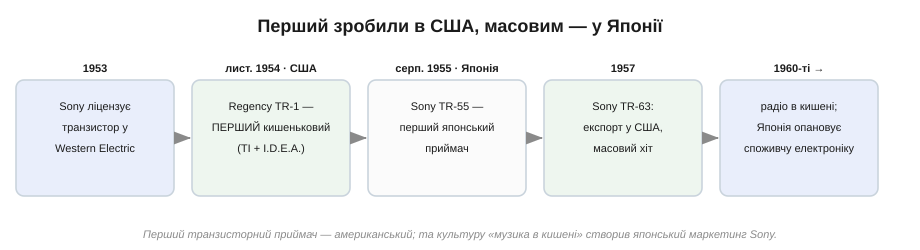
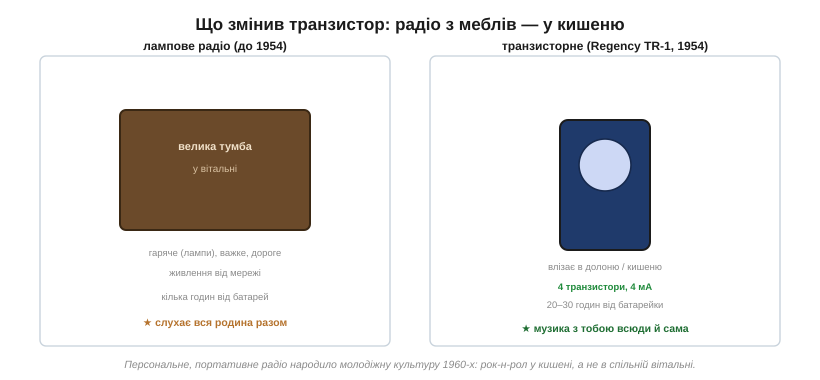
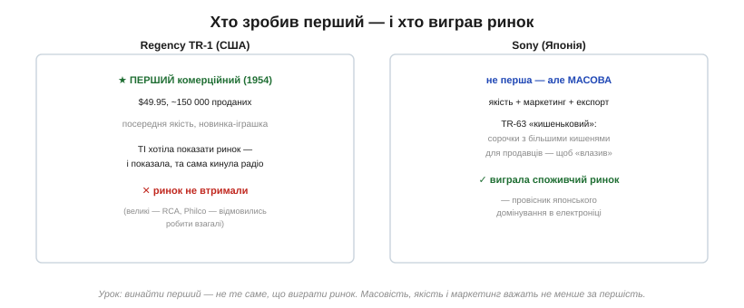

# 📜 Regency TR-1 і шлях Sony: транзистор, що поклав радіо в кишеню

Транзистор — це не лише деталь на платі, яку вибирають за даташитом. Та сама деталь **змінила побут**: саме на ній народився перший масовий споживчий гаджет — кишеньковий радіоприймач. Це історія про чотири крихітні транзистори, що вийняли радіо з вітальні й поклали його в кишеню підлітка — і про те, як перший зробили в Америці, а виграли японці.

*1953 — Sony ліцензує транзистор; листопад 1954 — американський Regency TR-1, перший комерційний; 1955 — японський Sony TR-55; 1957 — експортний хіт TR-63. Першість — американська, масовість — японська.*

## Радіо як меблі

Щоб відчути переворот, варто згадати, чим було радіо **до** транзистора. Лампове радіо (лампа, попередниця [транзистора](book:electronics/transistor-idea), громіздка й гаряча) — це велика тумба у вітальні, важка, дорога, що гріється від ламп розжарення й живиться від мережі. Радіо було **меблями**, спільними для всієї родини, які слухали гуртом увечері.

*Лампова тумба для всієї родини — і транзисторна коробочка в долоні. Чотири транзистори їдять 4 мА й дають 20–30 годин від батарейки замість кількох годин у лампового портативу. Радіо стало персональним.*

Транзистор зламав цю картину одним махом. Він холодний, крихітний, живиться від батарейки — отже, радіо може стати **маленьким, портативним і персональним**. Не меблі для родини, а річ для однієї людини, яку носиш із собою. Це не просто інженерне покращення — це зміна **культури**: незабаром підліток зможе слухати свою музику будь-де, без дозволу й без спільної вітальні. Рок-н-рол і молодіжна культура 1960-х значною мірою виросли саме з цієї кишенькової коробочки.

## Regency TR-1: американський первісток

Першими це зробили в Америці. У травні 1954 року **Texas Instruments** — компанія, що доти робила прилади для нафтової розвідки й для флоту, а нещодавно опанувала [кремнієві](book:physics/semiconductor) транзистори, — захотіла показати світу масовий ринок для свого нового приладу. TI запропонувала великим радіовиробникам зробити транзисторний приймач — і всі, зокрема RCA, Philco та Emerson, **відмовилися**: транзистори здавалися їм дорогою екзотикою. Погодилася лише невелика фірма з Індіанаполіса — **I.D.E.A.** (Industrial Development Engineering Associates).

Результат — **Regency TR-1**, анонсований 18 жовтня 1954 року й випущений у продаж 1 листопада того ж року. Усередині — лише **чотири германієві транзистори** TI й один діод; споживання — 4 мА, тож від батарейки приймач грав 20–30 годин замість кількох у лампового портативу. Коштував він $49.95 (чималі гроші на той час) і продався накладом близько **150 тисяч** штук — попри відверто посередню якість звуку. Люди купували не звук, а **диво**: радіо, що вміщається в долоні. Це був перший широко проданий транзисторний продукт в історії.

## Sony: японці виграють масовість

А далі сталося те, що повториться в електроніці не раз. Першість лишилася за американцями, та **ринок** забрали японці.

*Regency TR-1 — перший, але посередній і недовговічний на ринку; Sony — не перша, зате з якістю, маркетингом і експортом. Винайти перший — не те саме, що виграти ринок.*

У Токіо невелика повоєнна фірма **Tokyo Tsushin Kogyo**, заснована Масару Ібукою (він почав із ремонту радіо в розбомбленому універмазі) і Акіо Морітою, ще 1953 року купила в американської Western Electric ліцензію на транзистор — і поставила на нього все. У серпні 1955-го вийшов **TR-55**, перший японський транзисторний приймач; на ньому вже стояла нова коротка торгова марка, яку фірма обрала для світового ринку, — **Sony** (хоча офіційно компанія перейменувалася на Sony лише 1958-го).

А справжній прорив прийшов 1957 року з моделлю **TR-63** — компактнішим приймачем, який Sony повезла на експорт до США. З ним пов'язана знаменита маркетингова витівка: TR-63 насправді **не влазив** у звичайну нагрудну кишеню сорочки — тож Sony пошила своїм продавцям сорочки з **трохи більшими** кишенями, щоб ті могли демонструвати «перший у світі кишеньковий радіоприймач». Дрібна хитрість, але вона спрацювала: TR-63 став масовим хітом, а Sony — світовим брендом.

## Урок, що повториться

Тут видно ту саму симетрію, що й у суперництві [кремнію та германію](book:physics/semiconductor): і там перемогу здобув не той, хто був першим, а той, хто опанував **масовість**. Regency TR-1 був перший — але Regency недовго протрималася на ринку, а TI повернулася до того, що вміла найкраще, — робити самі напівпровідники. Sony ж побудувала на транзисторі цілу імперію споживчої електроніки; кишеньковий приймач став лише першим у довгій низці (далі будуть магнітофони, Walkman, Trinitron…), а сама Sony — провісником японського домінування в електроніці 1960–80-х років.

І це головний урок цієї історії, ширший за радіо. **Винайти перший — не те саме, що виграти ринок.** Першість дає славу, але виграє той, хто додасть до неї якість, масове виробництво й уміння продати — навіть якщо для цього доводиться шити сорочки з більшими кишенями. Чотири копійчані транзистори, які ми щойно вчилися вибирати за даташитом, у 1954 році вийняли радіо з вітальні назавжди — і заклали модель, за якою споживча електроніка розвивається досі: маленьке, особисте, з тобою всюди.
