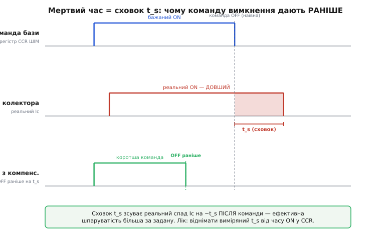
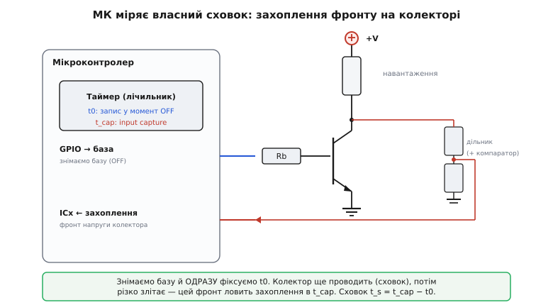

# ⚙️ Керування базою в прошивці: від safe-start до вимірювання сховку

У [детальному розборі цього кроку](root:embedded/bjt-load-driving/detail) ми довели одну незручну річ до кінця: біполярний ключ, що холодний на реле, **гріється на ШІМ**, бо там додається перемикальна втрата `½·Vcc·Ic·(t_r+t_f)·f`, а глибоке насичення, яким ми добивалися малої Vce(sat), роздуває **сховок** t_s — чисту затримку вимкнення. Там ми лишили це знанням: «розумій, де межа». Тут ми перетворюємо його на **робочий модуль прошивки**, який цю межу не просто розуміє, а вимірює й обходить.

Задача вставки вузька й практична. Прошивка, що керує базою BJT-ключа, мусить робити три речі, яких наївний `digitalWrite(HIGH/LOW)` не робить. По-перше — **узгодити шпаруватість ШІМ із реальним мертвим часом ключа**: сховок зсуває реальний спад струму на десятки-сотні наносекунд пізніше за команду, тож ефективна шпаруватість завжди більша за задану, і це видно на виході (яскравіший світлодіод, швидший мотор, ніж наказано). По-друге — **зміряти цей сховок самим мікроконтролером**, не діставаючи осцилографа: таймер захоплення ловить, коли колектор реально відпустив струм. По-третє — **звести бюджет утрат у таблицю** й на її числах вирішити чесно: тягнути цей BJT далі чи вже пора на MOSFET.

Одразу межа, яку тримаємо наскрізь, як і в будь-якому силовому коді: **прошивка не заміняє правильний вибір транзистора й обв'язки**. Резистор бази, гасний діод, запас по Vceo — усе це вже на платі (ми рахували його в базовій і детальній частинах). Код лише витискає з обраного заліза максимум коректності: не бреше шпаруватістю, знає свій сховок і вміє сказати «цей ключ тут не тягне». Якщо транзистор вибрано погано, жоден рядок нижче його не врятує.

## Задача: чому «просто ШІМ» дає не ту шпаруватість

Почнімо з симптому, бо він оманливо тихий. Ви налаштували апаратний таймер на ШІМ 20 кГц, виставили шпаруватість 50% — регістр порівняння CCR стоїть рівно на половині періоду. Осцилограф на **базі** підтверджує: 50%. А мотор крутиться швидше, ніж мав би на половині потужності, і транзистор тепліший за розрахунок. Що сталося?

Згадаймо чотири фази перемикання з детальної частини. Команда «вимкнути» (спад на базі) не вимикає колектор миттєво — спершу мусить стекти надлишковий заряд із бази (сховок t_s), і лише потім струм спадає (t_f). Виходить, реальний струм колектора тече **довше** за команду: від початку наростання до кінця спаду, а не від фронту до фронту команди. На ввімкненні є своя затримка t_d + t_r, але вона зазвичай коротша й стабільніша; головний винуватець перекосу — саме сховок на вимкненні, бо він і найдовший, і найсильніше залежить від того, як глибоко ми загнали базу в насичення.


*Сховок зсуває реальний спад Ic на ~t_s після команди, тож ефективна шпаруватість більша за задану (червона смужка — «зайвий» час проведення). Лік — віднімати виміряний t_s від часу ON у регістрі порівняння: тоді реальний спад лягає туди, куди й наказано.*

Порахуймо перекіс, щоб відчути масштаб. Період ШІМ на 20 кГц — 50 мкс. Хай сховок звичайного дрібного BJT у помірному насиченні t_s ≈ 1.5 мкс (це реальний порядок для 2N2222; для сильно перезалитої бази буває й 5+ мкс).

**Умова: ШІМ 20 кГц, задана шпаруватість 50%, сховок t_s = 1.5 мкс, спад t_f = 0.3 мкс.**
```
Період T = 1 / 20000 = 50 мкс
Заданий час ON (за CCR) = 0.50 · 50 = 25.0 мкс
Реальний струм тече від наростання до КІНЦЯ спаду:
  зайвий «хвіст» ≈ t_s + t_f = 1.5 + 0.3 = 1.8 мкс
Реальний ON ≈ 25.0 + 1.8 = 26.8 мкс
Реальна шпаруватість = 26.8 / 50 = 53.6%        ← замість 50%!
```

Перекіс у 3.6 відсоткові пункти — це не дрібниця для точного керування (яскравість, оберти, нагрів навантаження). І він **нелінійний по частоті**: підніміть ШІМ до 100 кГц (період 10 мкс), і той самий хвіст 1.8 мкс дасть уже +18 пунктів — половина стає двома третинами. Ось чому «просто ШІМ» на біполярному ключі бреше тим сильніше, чим вища частота: фіксований часовий хвіст сховку з'їдає дедалі більшу частку періоду, що коротшає.

> 🔧 **Навіщо це.** Той самий ефект отруює **двотактні** схеми (напівміст, драйвер крокового двигуна на BJT): якщо верхній і нижній ключі мають сховок, а код перемикає їх «впритул», то під час t_s обидва ще проводять — це наскрізний струм (*shoot-through*), який гріє й вбиває ключі. Там мертвий час між ключами беруть **більшим** за найгірший t_s — і щоб його взяти правильно, сховок треба знати числом, а не «на око». Наша вставка дає це число.

## Ідея: виміряти мертвий час, потім його компенсувати

Розв'язок природно ділиться на два кроки, і другий спирається на перший.

**Крок перший — виміряти сховок самим МК.** Ідея проста до краси. Ми командуємо базі «вимкнись» і в ту саму мить защіпуємо час t0 у таймері. Колектор ще проводить (сховок), і напруга на ньому лишається низькою (Vce(sat)). Коли заряд нарешті стече, струм спадає, а напруга колектора **різко злітає** до живлення — цей фронт ловить [вхід захоплення таймера](root:embedded/frequency-measurement-methods/proj-input-capture-freq.md) й защіпує t_cap. Різниця й є мертвий час:

```
t_dead = t_cap − t0        (сховок + частина спаду, тобто затримка «до зникнення струму»)
```

Апаратура робить головне: захоплення знімає лічильник у той самий такт, коли стався фронт, без програмної затримки. Нам лишається дати команду OFF і прочитати різницю — усе в одиницях таймера, які легко перевести в наносекунди.


*Схема самовимірювання. У момент команди OFF записуємо t0; колектор під час сховку ще притиснутий до землі, потім його напруга злітає — цей фронт через дільник (і, як треба, компаратор) заводимо на вхід захоплення. t_dead = t_cap − t0 у тиках таймера.*

**Крок другий — компенсувати.** Знаючи t_dead, ми **вкорочуємо команду** ШІМ рівно на цей час: даємо OFF раніше, щоб реальний спад струму (що настане через t_dead) припав туди, куди наказано. У регістрі порівняння це означає зменшити значення ON на t_dead, переведений у тики ШІМ-таймера. Компенсація перетворює «53.6% замість 50%» назад на чесні 50%.

Обидва кроки дають ще й **діагностику**: якщо виміряний t_dead поповз угору між прогонами — транзистор гріється (сховок росте з температурою) або база перезалита; якщо він завеликий для потрібної частоти — це кількісний сигнал, що ключ не тягне. Саме на цьому числі й будується рішення «BJT чи MOSFET» у кінці.

Розберімо все кодом, від вимірювання до компенсації й таблиці втрат. Орієнтир — STM32 (таймери з input capture — типове залізо), але концепція без змін лягає й на ESP32 (MCPWM +捕获, реєстри звуться інакше).

## Робочий код: вимірювання сховку через захоплення

Спершу — інструмент, що дає число. Ідея вже ясна: команда OFF плюс защіпка t0, потім захоплення фронту колектора в t_cap. Тонкість у тому, **як звести обидві мітки часу до одного таймера**, щоб різниця була чесною.

Найчистіше — коли і t0, і t_cap належать **одному й тому самому** таймеру-лічильнику. Тоді t0 ми знімаємо програмно (читаємо CNT у мить команди OFF), а t_cap апаратура защіпує сама в регістр захоплення CCR на фронті. Обидва — тики того самого лічильника, різниця не потребує жодних перетворень масштабу.

```c
#include <stdint.h>
#include <stdbool.h>

// ── Залізо: один таймер лічить із відомою частотою; канал 1 — захоплення
//    фронту з вузла колектора (через дільник/компаратор). ──
#define MEAS_TIMER_HZ   84000000u   // частота лічби таймера, Гц (напр. 84 МГц)
#define MEAS_ARR        0xFFFFu     // 16-біт лічильник

// База ключа керується окремим GPIO (тут — прямий вивід через Rb).
#define BASE_PORT       GPIOB
#define BASE_PIN        GPIO_PIN_5

extern uint32_t now_cnt(void);          // читання TIMx->CNT (лічильник таймера)
extern void     base_drive(bool on);    // виставити рівень бази (через Rb)

static volatile uint16_t g_t_cap   = 0;     // защіпнутий час фронту колектора
static volatile bool     g_captured = false;

// Переривання захоплення: колектор злетів угору (струм зник) — фіксуємо час.
void MEAS_CC_IRQHandler(void)
{
    if (!(MEAS_TIM->SR & TIM_SR_CC1IF)) return;
    g_t_cap    = (uint16_t)MEAS_TIM->CCR1;  // апаратний знімок (знімає й прапор)
    g_captured = true;
}
```

Тепер сама процедура вимірювання. Вона робить один цикл «увімкнути — дати усталитись — зняти базу й защіпнути t0 — дочекатися захоплення» і повертає мертвий час у наносекундах. Захоплення вже має бути налаштоване на **наростальний** фронт вузла колектора (Vce росте на вимкненні), з фільтром проти дзвону.

```c
// Один вимір мертвого часу ключа, нс. Повертає 0, якщо фронт не спіймано
// (навантаження обірване, поріг компаратора не той, ключ не насичувався).
uint32_t measure_dead_time_ns(void)
{
    // 1. Увімкнути ключ і дати струму усталитись у насиченні.
    base_drive(true);
    delay_us(200);                 // >> постійної часу навантаження й входу в насичення

    // 2. Зняти базу й ОДРАЗУ засікти t0 тим самим лічильником.
    //    Порядок критичний: захоплення вже озброєне, тож спершу озброюємо прапор.
    g_captured = false;
    uint16_t t0 = (uint16_t)now_cnt();   // мітка команди OFF
    base_drive(false);                    // команда «вимкнись»

    // 3. Дочекатися фронту колектора (з таймаутом на випадок несправності).
    uint32_t guard = 0;
    while (!g_captured) {
        if (++guard > 100000u) return 0;  // фронт не прийшов — сигнал діагностики
    }

    // 4. Різниця у тиках (16-біт беззнакова сама «обертається» через переповнення).
    uint16_t ticks = (uint16_t)(g_t_cap - t0);

    // 5. Перевести тики в наносекунди: t = ticks / f * 1e9.
    //    Рахуємо в 64-біт, щоб не переповнити при множенні.
    return (uint32_t)(((uint64_t)ticks * 1000000000ull) / MEAS_TIMER_HZ);
}
```

Три місця, де тут легко помилитися, варті окремого слова.

**Мітку t0 знімаємо саме перед `base_drive(false)`, а не після.** Між читанням CNT і виставленням рівня бази лягає кілька інструкцій — одиниці тактів ядра, десятки наносекунд. Якщо взяти t0 після команди, ця затримка додасться до виміру. Дрібниця на тлі мікросекундного сховку, але для швидкого ключа з t_s у сотні нс вона вже помітна; тому знімаємо t0 упритул до команди й свідомо трохи **недооцінюємо** мертвий час (недооцінка безпечніша: компенсація вийде трохи консервативнішою).

**Захоплення міряє «до зникнення струму», а не рівно t_s.** Компаратор (чи поріг входу) спрацьовує, коли напруга колектора перетне якийсь рівень десь посеред фронту наростання Vce — тобто ми ловимо кінець сховка **плюс** частину спаду струму t_f. Це навіть добре: для компенсації шпаруватості нам і потрібна затримка «доки навантаження реально не знеструмиться», а це саме t_s + (частина t_f). Головне — тримати поріг компаратора **однаковим** між вимірами, щоб число було відтворюваним.

**16-бітне переповнення само собою коректне на короткому інтервалі.** Різниця `(uint16_t)(g_t_cap - t0)` правильна, поки мертвий час коротший за повний оберт лічильника. При 84 МГц оберт 16-бітного таймера — 65536 / 84e6 ≈ 780 мкс; будь-який реальний сховок (одиниці мкс) у це вкладається з колосальним запасом, тож лічба переповнень тут не потрібна (на відміну від [вимірювання довгих періодів](root:embedded/frequency-measurement-methods/proj-input-capture-freq.md), де вона обов'язкова).

Одне вимірювання шумить (дзвін, джитер порогу), тому в діло беруть **медіану кількох**. Медіана, а не середнє, бо вона стійка до поодиноких викидів (один пропущений фронт чи подвійне спрацювання на дзвоні не зіпсують результат):

```c
// Медіана з N вимірів — стійка до поодиноких викидів дзвону/джитера.
static int cmp_u32(const void *a, const void *b) {
    uint32_t x = *(const uint32_t*)a, y = *(const uint32_t*)b;
    return (x > y) - (x < y);
}

uint32_t measure_dead_time_median(uint8_t n)
{
    uint32_t buf[16];
    if (n > 16) n = 16;
    uint8_t got = 0;
    for (uint8_t i = 0; i < n; i++) {
        uint32_t v = measure_dead_time_ns();
        if (v > 0) buf[got++] = v;      // 0 = невдалий вимір, відкидаємо
        delay_us(500);                   // ключ охолонути/навантаженню розрядитись
    }
    if (got == 0) return 0;              // жодного чесного виміру — діагностика
    qsort(buf, got, sizeof(buf[0]), cmp_u32);
    return buf[got / 2];                 // медіана
}
```

> 🔧 **Навіщо це.** Це той рідкісний код, що перетворює параметр із даташита на **виміряну на вашому екземплярі** величину. Даташитний t_s знятий за конкретних Ic, Ib і температури; ваш реальний сховок залежить від вашого резистора бази (отже ODF), вашого навантаження й температури плати. Змірявши його самою прошивкою при старті, ви компенсуєте саме **свій** ключ, а не «типовий». Ба більше — повторний вимір під навантаженням стає безкоштовним датчиком: сховок, що поповз, кричить про перегрів або деградацію бази раніше, ніж це побачить будь-хто інший.

## Робочий код: компенсація мертвого часу в ШІМ

Тепер друге — вкоротити команду ШІМ на виміряний час. Логіка прямолінійна: перевести t_dead у тики **ШІМ-таймера** (у нього своя частота, не плутати з таймером вимірювання) і відняти від значення регістра порівняння, що задає час ON.

Домовимося про полярність, бо тут легко переплутати знак. Нижній NPN-ключ проводить, поки база **висока**; ШІМ-канал у режимі PWM1 тримає вихід високим, поки CNT < CCR. Отже CCR задає час ON бази. Реальний струм тече довше на t_dead — значить, щоб реальний ON дорівнював бажаному, треба **зменшити** CCR на t_dead у тиках:

```c
// ── ШІМ-таймер керує базою; компенсуємо сховок, вкорочуючи час ON. ──
#define PWM_TIMER_HZ    84000000u    // частота ШІМ-таймера (може відрізнятись!)
#define PWM_PERIOD      4200u        // ARR+1: 84e6 / 4200 = 20 кГц

static uint32_t g_dead_ticks = 0;    // мертвий час, переведений у тики ШІМ

// Викликати раз після вимірювання: закешувати t_dead у тиках ШІМ-таймера.
void pwm_set_dead_time_ns(uint32_t t_dead_ns)
{
    // ticks = t_dead_ns * f_pwm / 1e9   (у 64-біт проти переповнення)
    g_dead_ticks = (uint32_t)(((uint64_t)t_dead_ns * PWM_TIMER_HZ) / 1000000000ull);
}

// Виставити БАЖАНУ шпаруватість 0..PWM_PERIOD; всередині вкорочуємо на сховок.
void pwm_set_duty_compensated(uint32_t desired_on_ticks)
{
    uint32_t on = desired_on_ticks;

    // Компенсація: реальний струм тече на g_dead_ticks довше → команду вкоротити.
    if (on > g_dead_ticks) {
        on -= g_dead_ticks;
    } else {
        on = 0;              // бажаний ON коротший за сам сховок — чесний нуль
    }
    // Насичення в межах періоду.
    if (on > PWM_PERIOD) on = PWM_PERIOD;

    PWM_TIM->CCR1 = on;      // апаратно застосується з наступного циклу
}
```

Двоє країв цієї функції — не косметика, а захист від реального зриву.

**Нижній край: бажаний ON коротший за сам сховок.** Якщо ви просите шпаруватість, за якої час ON менший за t_dead, компенсована команда мала б бути від'ємною — а це безглуздя. Фізично це означає, що **ключ не встигає навіть вимкнутися** повністю за такий короткий імпульс: перш ніж стече заряд сховка, уже приходить наступне ввімкнення. Транзистор перестає бути ключем — він зависає напівпровідним, гріється в лінійній зоні. Чесний вихід — віддати нуль (ключ узагалі не вмикати) і, у справжньому коді, **підняти прапор** «мінімальна шпаруватість недосяжна для цього ключа». Це, до речі, ще один кількісний аргумент до заміни на MOSFET: у нього немає сховка, тож мінімальний робочий імпульс на порядки коротший.

**Верхній край: насичення на PWM_PERIOD.** Після вкорочення й будь-яких перетворень значення не повинно вилізти за період — інакше в багатьох таймерів вихід «застрягне» на весь період не в тій полярності. Просте обрізання рятує.

Зберімо вимірювання й компенсацію в один сценарій ініціалізації — так це й виглядає в реальній прошивці при старті вузла:

```c
// Ініціалізація драйвера бази: змірятись і налаштувати компенсацію.
void base_driver_init(void)
{
    capture_setup_rising_filtered();      // захоплення на фронт Vce, з фільтром
    pwm_setup_20khz();                    // ШІМ-канал на базу

    uint32_t t_dead = measure_dead_time_median(9);   // 9 вимірів, медіана
    if (t_dead == 0) {
        fault_raise(FAULT_NO_COLLECTOR_EDGE);   // навантаження/поріг/ключ — розбір окремо
        return;
    }
    pwm_set_dead_time_ns(t_dead);         // закешувати компенсацію

    // Санітарна межа: якщо сховок з'їдає надто велику частку періоду —
    // цей ключ не годиться для такої частоти (див. рішення BJT/MOSFET нижче).
    if (t_dead > (1000000000ull * PWM_PERIOD / PWM_TIMER_HZ) / 4) {
        fault_raise(FAULT_DEAD_TIME_TOO_LARGE);   // t_dead > 25% періоду
    }
}
```

> 🔧 **Навіщо це.** Компенсація мертвого часу — це різниця між «шпаруватість у коді» та «шпаруватість, яку бачить навантаження». Без неї калібрування яскравості чи обертів, зняте на 20 кГц, поїде, щойно ви зміните частоту; ПІД-регулятор, що керує через таку ШІМ, отримає систематичний зсув коефіцієнта передачі й даватиме сталу похибку. З компенсацією модель «команда → дія» знову лінійна й чесна — а це фундамент будь-якого [замкненого керування](root:embedded/pwm-power-control). І та сама виміряна величина одразу дає безпечний мертвий час для двотактних схем.

## Робочий код: бюджет утрат і рішення BJT-чи-MOSFET у числах

Тепер третє, заради чого все й затівалося: **звести втрати в таблицю** й дати прошивці (чи інженеру за столом) вирішити, чи цей ключ доречний. Формула втрат у нас уже є з детальної частини — з'єднаймо обидві її частини в один розрахунок і **прокрутимо по частоті**, бо саме частота розводить біполярний і польовий по різні боки.

```
P(разом) = D·Vce(sat)·Ic  +  ½·Vcc·Ic·(t_r + t_f)·f
             └ провідна ┘      └── перемикальна ──┘
```

Провідна частина від частоти майже не залежить (лише через шпаруватість D), а перемикальна росте **лінійно** з частотою. Для MOSFET перша доданка інша (не Vce(sat), а Rds(on)·Ic², бо у відкритому стані він — опір, а не джерело напруги), зате друга менша: немає сховка, фронти коротші.

Зведімо це в код, що рахує обидва кандидати на сітці частот і друкує таблицю. Це не «прикраса» — це рівно той аркуш, який інженер тримає перед очима, обираючи ключ.

```c
#include <stdio.h>

typedef struct {
    const char *name;
    float von_or_rds;   // BJT: Vce(sat) [В]; MOSFET: Rds(on) [Ом]
    bool  is_mosfet;    // як трактувати von_or_rds
    float tr, tf;       // час фронтів [с] (для MOSFET сюди ж кладемо ефективні)
} switch_dev_t;

// Провідна втрата: BJT — D·Vce(sat)·Ic; MOSFET — D·Ic²·Rds(on).
static float p_cond(const switch_dev_t *d, float ic, float duty)
{
    if (d->is_mosfet) return duty * ic * ic * d->von_or_rds;
    else              return duty * d->von_or_rds * ic;
}

// Перемикальна втрата: ½·Vcc·Ic·(t_r+t_f)·f — однакова форма для обох.
static float p_sw(const switch_dev_t *d, float vcc, float ic, float f)
{
    return 0.5f * vcc * ic * (d->tr + d->tf) * f;
}

// Таблиця втрат по частоті для одного приладу.
void print_loss_table(const switch_dev_t *d, float vcc, float ic, float duty)
{
    static const float freqs[] = { 1e3f, 20e3f, 100e3f, 500e3f };
    printf("=== %s ===  (Vcc=%.0fВ Ic=%.2fА D=%.2f)\n", d->name, vcc, ic, duty);
    printf("  f, кГц | P_пров, Вт | P_перем, Вт | P_разом, Вт\n");
    for (unsigned i = 0; i < sizeof(freqs)/sizeof(freqs[0]); i++) {
        float pc = p_cond(d, ic, duty);
        float ps = p_sw(d, vcc, ic, freqs[i]);
        printf(" %6.0f | %10.3f | %11.3f | %11.3f\n",
               freqs[i] / 1e3f, pc, ps, pc + ps);
    }
}

// Рішення за чітким правилом: BJT простіший і дешевший, тож ЛИШАЄМО його,
// поки він вкладається в тепловий бюджет; на MOSFET переходимо лише тоді,
// коли BJT за бюджет вилітає (саме там перемикальна втрата його вбиває).
const char *choose_switch(const switch_dev_t *bjt, const switch_dev_t *mos,
                          float vcc, float ic, float duty, float f, float p_budget)
{
    float p_bjt = p_cond(bjt, ic, duty) + p_sw(bjt, vcc, ic, f);
    float p_mos = p_cond(mos, ic, duty) + p_sw(mos, vcc, ic, f);

    if (p_bjt <= p_budget) return bjt->name;   // BJT вкладається → простіший вибір
    if (p_mos <= p_budget) return mos->name;   // BJT вилетів, MOSFET тримається
    return "НІ ОДИН: обидва понад тепловий бюджет";
}
```

Прокрутимо на реальних числах — тих самих, що в детальній частині (щоб зчепити виклад), плюс типовий логічний MOSFET для порівняння.

**Умова: Vcc = 12 В, Ic = 0.5 А, D = 50%. BJT (2N2222): Vce(sat)=0.3 В, t_r=t_f=0.3 мкс. MOSFET (логічний): Rds(on)=0.05 Ом, t_r=t_f=0.03 мкс.**

Таблиця, яку надрукує `print_loss_table`:

```
=== BJT 2N2222 ===  (Vcc=12В Ic=0.50А D=0.50)
  f, кГц | P_пров, Вт | P_перем, Вт | P_разом, Вт
      1  |     0.075  |      0.002  |      0.077
     20  |     0.075  |      0.036  |      0.111
    100  |     0.075  |      0.180  |      0.255
    500  |     0.075  |      0.900  |      0.975

=== MOSFET (лог.) ===  (Vcc=12В Ic=0.50А D=0.50)
  f, кГц | P_пров, Вт | P_перем, Вт | P_разом, Вт
      1  |     0.006  |      0.0002 |      0.006
     20  |     0.006  |      0.004  |      0.010
    100  |     0.006  |      0.018  |      0.024
    500  |     0.006  |      0.090  |      0.096
```

Прочитаймо таблицю — у ній уся суть рішення. На **1 кГц** обидва холодні; біполярний цілком годиться, його провідна втрата 75 мВт мізерна, і зайвий MOSFET-драйвер тут — марна складність. На **20 кГц** BJT усе ще терпимий (0.11 Вт), але вже вп'ятеро гарячіший за MOSFET. На **100 кГц** біполярний віддає чверть вата — переважно на перемиканні, — а польовий десятикратно холодніший. На **500 кГц** вирок однозначний: майже ват на BJT проти десятої вата на MOSFET; тут біполярний уже треба на радіатор, а це абсурд для півампера.

Видно й **чому** так. Провідна втрата BJT (0.075 Вт) вища за провідну MOSFET (0.006 Вт) — на малому струмі падіння Vce(sat)=0.3 В програє опору 0.05 Ом (бо Ic²·R = 0.25·0.05 = мізер). Але вирішує не це, а **перемикальна**: у BJT фронти вдесятеро довші (сховок і повільний спад), тож його перемикальна втрата вдесятеро більша на будь-якій частоті, і саме вона злітає з f. Формула зробила видимим те, що детальна частина пояснила словами: біполярний програє польовому **на частоті**, а не в статиці.

```c
// Приклад рішення на робочій частоті з тепловим бюджетом 0.2 Вт.
void decide_example(void)
{
    switch_dev_t bjt = { "BJT 2N2222", 0.30f, false, 0.3e-6f, 0.3e-6f };
    switch_dev_t mos = { "MOSFET лог.", 0.05f, true,  0.03e-6f, 0.03e-6f };

    // На 20 кГц обидва вкладаються в 0.2 Вт → обираємо простіший/дешевший (BJT).
    printf("20 кГц: %s\n", choose_switch(&bjt, &mos, 12, 0.5f, 0.5f, 20e3f, 0.2f));
    // На 100 кГц BJT (0.255 Вт) вилітає за бюджет 0.2 Вт → лишається MOSFET.
    printf("100 кГц: %s\n", choose_switch(&bjt, &mos, 12, 0.5f, 0.5f, 100e3f, 0.2f));
}
```

Ось де замикається петля з початком вставки. Виміряний прошивкою мертвий час — це не абстракція: він **прямо пов'язаний** з t_s+t_f, що входять у перемикальну втрату. Тобто той самий вимір, яким ми компенсували шпаруватість, дає й вхідні дані для цієї таблиці: підставте в `switch_dev_t.tr/tf` не паспортні, а **свої виміряні** фронти — і рішення «BJT чи MOSFET» стане рішенням про ваш конкретний екземпляр на вашій платі. А повне обґрунтування, чому польовий не має сховка й де ще проходить межа між ними, — у кроці [BJT проти MOSFET](root:embedded/bjt-vs-mosfet).

> 🔧 **Навіщо це.** Ця таблиця — протиотрута до двох крайнощів. Перша: «BJT застарілий, скрізь ставмо MOSFET» — на 1 кГц це зайва складність і вартість там, де копійчаний транзистор ідеальний. Друга: «у нас завжди стояв BJT, і тут поставимо» — на 100+ кГц це прихований нагрів, що вилазить улітку. Правильна відповідь — не догма, а **число на робочій частоті проти теплового бюджету**, і код вище рахує саме його. Захотіли врахувати ще й вартість чи наявність на складі — додайте стовпець; каркас той самий.

## Складність і пастки

Зберімо граблі, на які наступають, навіть маючи весь код вище. Кожна перетворює правильну на папері схему на джерело тихих, важко відтворюваних збоїв.

**Логічний рівень фронту бази — найтихіша пастка.** Увесь модуль мовчки припускає **нижній NPN-ключ**, де база висока = провідність, і логічна одиниця МК напряму дає потрібне Vbe (емітер на землі, ми це доводили в детальній частині). Але той самий код на **PNP-верхньому ключі** керує навпаки — там провідність від **низького** рівня бази, — і компенсація, застосована з тим самим знаком, зробить перекіс **удвічі гіршим** замість виправлення. Так само на будь-якій схемі з інвертувальним драйвером між МК і базою полярність перевертається. Перш ніж застосовувати компенсацію, переконайтеся, який рівень вмикає **ваш** ключ, і при потребі інвертуйте як команду ШІМ, так і знак вкорочення. Захоплення теж налаштовуйте на правильний фронт: у нижнього ключа Vce на вимкненні **росте** (наростальний фронт), у верхнього PNP вузол на вимкненні **падає**.

**ODF роздуває сховок — компенсація маскує симптом, не причину.** Спокуса: «сховок великий — не біда, скомпенсуємо». Але великий t_s означає глибоке насичення (завеликий ODF), а це не лише затримка — це ще й **повільніше вимкнення** й вища перемикальна втрата, яку жодна компенсація шпаруватості не прибирає (вона рухає фронт у часі, а не робить його швидшим). Якщо виміряний t_dead неприємно великий, правильна реакція — не тільки компенсувати, а **зменшити ODF** (більший резистор бази — але не за межу насичення) або поставити [кламп Бейкера / Шотткі-транзистор](root:embedded/bjt-load-driving/detail), що взагалі не пускає ключ у глибоке насичення. Компенсація лікує перекіс шпаруватості; корінь (повільне вимкнення) лікують залізом на платі.

**Температурний дрейф зсуває виміряне число.** Сховок росте з температурою (більше носіїв, повільніша рекомбінація), а разом із ним пливе й Vbe (−2 мВ/°C, ми це бачили). Отже t_dead, зміряний на холодному старті, **занизить** компенсацію, коли плата прогріється під навантаженням. Три чесні виходи: (1) міряти не лише при старті, а **періодично** під час роботи (процедура коротка — один цикл ON/OFF); (2) виміряти при старті й додати консервативний **температурний запас** до t_dead; (3) для точних задач — прив'язати компенсацію до [показника термодавача](book:physics/thermal-resistance) плати. Найгірше — зміряти раз на холодну й вважати число вічним: улітку чи під навантаженням воно збреше рівно в найгіршу мить.

**Дзвін на вузлі колектора дає хибне захоплення.** Фронт Vce на вимкненні — не гладка сходинка, а сплеск із дзвоном (паразитна індуктивність навантаження й монтажу). Якщо поріг захоплення стоїть низько, перший же викид дзвону защіпнеться замість справжнього фронту — і t_dead вийде безглуздо малим. Ліки ті самі, що в будь-якому [захопленні фронту](root:embedded/frequency-measurement-methods/proj-input-capture-freq.md): апаратний фільтр каналу (кілька однакових вибірок поспіль), розумний поріг компаратора десь на середині перепаду, і медіана кількох вимірів, що відкидає поодинокі промахи. Без чистого фронту саме вимірювання бреше, і компенсація на його основі — теж.

**Захоплення міряє «до зникнення струму», а компенсуємо шпаруватість — стежте, що з чим порівнюєте.** Ми навмисне ловимо затримку до знеструмлення навантаження (t_s + частина t_f) — саме вона потрібна для шпаруватості. Але якщо ту саму величину без думки підставити в перемикальну втрату як «t_f», буде плутанина: у формулу втрат входять **обидва** фронти (t_r на ввімкненні та t_f на вимкненні), а наш вимір — лише про вимкнення. Для таблиці втрат міряйте (чи беріть із даташита) окремо і фронт ввімкнення; для компенсації досить фронту вимкнення. Не змішуйте два різні числа під одним іменем.

**Вимір під навантаженням гріє ключ — не зловживайте частими прогонами.** Кожен цикл вимірювання проводить повний струм через ключ (хай і на мікросекунди). Сотні вимірів поспіль без пауз самі нагріють транзистор — і ви зміряєте не робочий сховок, а сховок перегрітого ключа. Тому в `measure_dead_time_median` стоїть пауза між вимірами, а періодичні переміри під час роботи роблять **зрідка** (раз на секунди, не в кожному циклі керування). Інструмент діагностики не повинен сам ставати джерелом стресу.

**Float у гарячому шляху й у перериванні.** Розрахунок втрат і переведення тиків у нс — з рухомою комою; тримайте їх **поза** циклом керування й поза ISR (на ядрах без FPU float повільний, з FPU — вимагає збереження регістрів у обробнику). У перериванні захоплення — лише защіпка цілого числа й прапор, як у коді вище. Таблицю втрат рахують раз при налаштуванні (чи взагалі на етапі проєктування), а не в реальному часі.

Зведімо. Прошивка керування базою BJT робить три речі понад голе перемикання, і всі три тримаються на одному виміряному числі — мертвому часі ключа. Вона **компенсує** ним шпаруватість, повертаючи чесність зв'язці «команда → дія»; вона **вимірює** його сама через захоплення фронту колектора, перетворюючи параметр даташита на властивість вашого екземпляра; і вона зводить утрати в **таблицю**, на якій рішення «BJT чи MOSFET» стає числом проти теплового бюджету, а не звичкою. Понад усім цим — те саме залізне правило, з якого ми почали: код витискає максимум коректності з обраного ключа, але не рятує поганий вибір. Коли виміряний сховок завеликий, а таблиця втрат на робочій частоті вилітає за бюджет, найчесніший рядок прошивки — це не хитріша компенсація, а прапор «сюди треба [польовий транзистор](root:embedded/bjt-vs-mosfet)».
