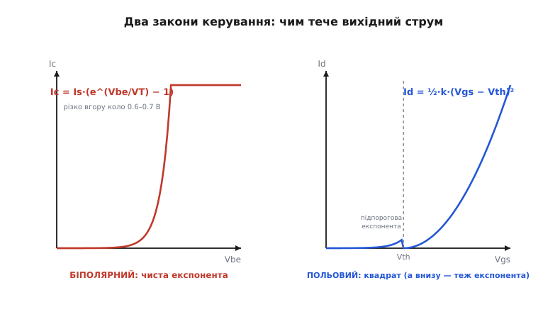
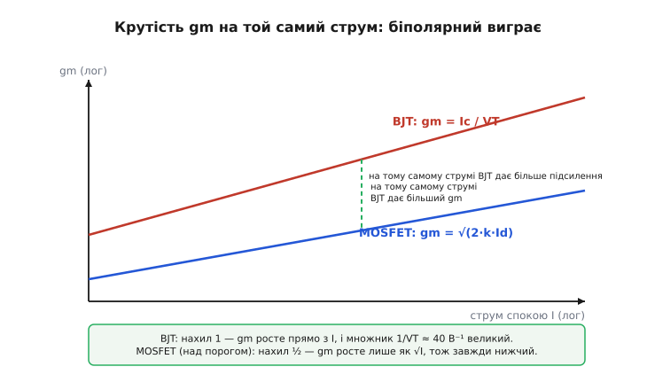
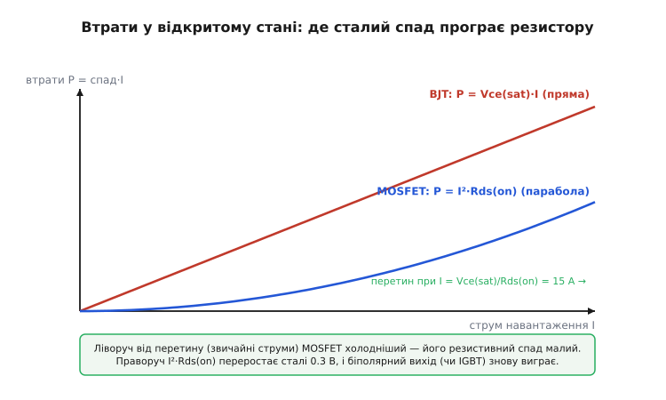
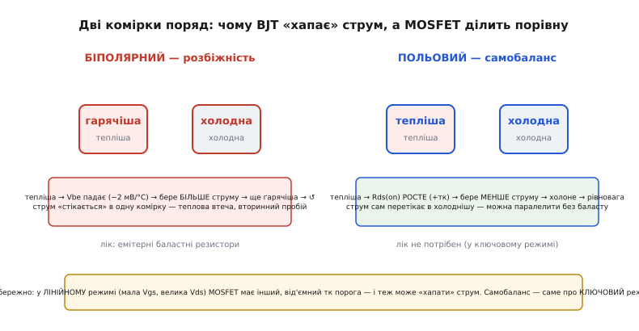
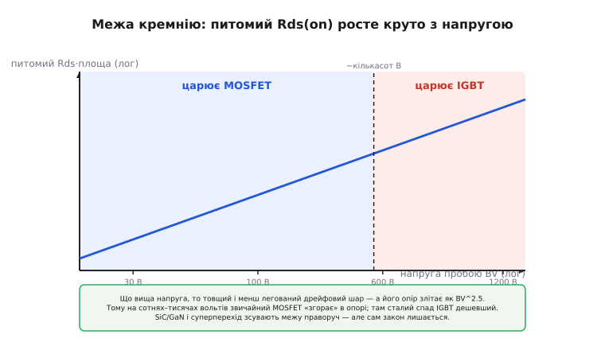

# BJT проти MOSFET: механіка відмінності до дна

У базовому кроці ми звели два транзистори віч-на-віч і витягли одне робоче правило: **силове перемикання й цифра — польовому, точний аналог — біполярному**, а корінь усього — керування **струмом** проти керування **полем**. Того правила вистачає, щоб не помилитися за робочим столом. Але воно лишає низку «чому» без відповіді, і саме ці «чому» відрізняють інженера, який завчив таблицю, від того, хто бачить причину.

Чому спад біполярного **сталий**, а польового — **резистивний**? Звідки береться той самий магічний перетин, де за великих струмів біполярний вихід знову холодніший? Чому один транзистор при паралелі «хапає» струм і згорає, а інший ділить його порівну сам? Чому в аналозі досі люблять біполярний, хоча польовий, здавалося б, зручніший у всьому? І чому на тисячі вольтів звичайний польовий раптом стає безнадійним, і його доводиться замінювати гібридом?

Усі ці відповіді ховаються в одному місці — у **рівняннях, які описують, як тече вихідний струм**. Тут ми ці рівняння виведемо від першопричини, а тоді витягнемо з них геть усе: втрати, теплову поведінку, швидкість, межу за напругою. Домовмося наперед: жодного нового транзистора ми не «вивчаємо» — ми лише розкриваємо ту саму кореневу відмінність глибше, шар за шаром, доки вона не стане очевидною.

### Два рівняння, з яких випливає все

Почнімо з того, що керує вихідним струмом у кожному приладі. Це не таблиця, це два різні закони фізики, і кожна відмінність далі — лише їхній наслідок.

**Біполярний.** У ньому [керує струм бази](topic:electronics/bjt-operation): база — тонкий шар між емітером і колектором, і носії, впорснуті з емітера, проходять крізь неї до колектора. Скільки їх пройде, задає різниця потенціалів на переході емітер-база, але задає її **експоненційно** — бо це прямозміщений p-n перехід, а струм такого переходу росте з напругою за законом Больцмана. Повне рівняння (спрощена модель Еберса-Молла для активного режиму):

```
Ic = Is · (e^(Vbe/VT) − 1) ≈ Is · e^(Vbe/VT)
```

де `Is` — струм насичення (крихітний, порядку 10⁻¹⁵ А), а `VT` — **тепловий потенціал**:

```
VT = k·T / q ≈ 0.0259 В   (при 300 K, тобто ~26 мВ)
```

Тут `k` — стала Больцмана, `T` — абсолютна температура, `q` — [заряд електрона](topic:physics/elementary-charge). Запам'ятаймо це число — 26 мВ; воно ще не раз спливе й пояснить речі, які інакше здаються збігом.

А струм бази? Це та мала частка носіїв, що не долетіла до колектора й рекомбінувала в базі. Вона теж пропорційна тій самій експоненті, тож їхнє відношення — стале:

```
Ic / Ib = β   (його ще звуть hFE — коефіцієнт підсилення за струмом)
```

Ось перший корінь наочно: **щоб тримати Ic, ти мусиш весь час лити Ib = Ic/β**. Педаль, яку тиснуть струмом. Відпустив — заглухло.

**Польовий.** У ньому [керує поле затвора](topic:electronics/field-control): затвор — металева (чи полікремнієва) пластинка над каналом, відділена від нього тонким шаром оксиду. Це буквально **конденсатор**. Напруга на ньому притягує носіїв до поверхні під оксидом і створює провідний канал — але тільки коли перевищить поріг `Vth`, за якого канал взагалі з'являється. У режимі насичення (той, у якому польовий працює як підсилювач) струм росте **квадратично** з перевищенням порога:

```
Id = ½ · μ·Cox·(W/L) · (Vgs − Vth)²  = ½ · k · (Vgs − Vth)²
```

де `μ` — рухливість носіїв, `Cox` — ємність оксиду на одиницю площі, `W/L` — відношення ширини каналу до довжини, а весь передмножник згорнемо в один параметр крутості `k` (його ще звуть коефіцієнтом провідності). Різницю `(Vgs − Vth)` називають **напругою перекриття** *(overdrive)* — це те, «наскільки сильно» відкрито затвор понад поріг.

І ключове: у затвор-конденсатор у сталому стані струм **не тече** — конденсатор постійного струму не пропускає. Ось другий корінь: **напругу поставив — і тримається сама, живлення на утримання нуль**. Перемикач, а не педаль.


*Два закони керування. Біполярний — чиста експонента струму від Vbe, різко вгору коло 0.6–0.7 В. Польовий над порогом — квадрат від перекриття Vgs − Vth; але внизу, у підпороговій ділянці, і він стає експонентою — саме там два прилади сходяться найближче.*

Зверніть увагу на праву панель: під порогом крива польового — не квадрат, а **експонента**. Це не випадковість, і за хвилину ми побачимо, що там польовий буквально стає біполярним. Але спершу вичавимо з цих двох рівнянь найпрактичніше — **крутість**.

> 🔧 **Навіщо це.** Ці два рівняння — не абстракція для іспиту. Коли ви обираєте резистор бази під біполярний ключ, ви користуєтеся `Ic = β·Ib`. Коли рахуєте, яку напругу затвора подати з логіки 3.3 В, щоб MOSFET повністю відкрився, ви користуєтеся тим, що над `Vth` струм росте квадратично й швидко впирається в стелю. Усе подальше в цій статті — лише розкручування цих двох формул.

### Крутість: чому в аналозі досі королює біполярний

**Крутість** *(transconductance, gm)* — це наскільки сильно змінюється вихідний струм на маленьку зміну керувального входу. Для підсилювача це головна цифра: більший gm — більше підсилення з того самого струму. Виведемо gm для обох приладів прямо з рівнянь вище — це один рядок диференціювання.

Для біполярного беремо похідну `Ic` по `Vbe`. Похідна експоненти — та сама експонента, поділена на `VT`:

```
gm(BJT) = dIc/dVbe = Is·e^(Vbe/VT) / VT = Ic / VT
```

Спиніться на цьому результаті — він разючий. Крутість біполярного **не залежить від жодного параметра приладу**: ні від розміру, ні від матеріалу, ні від технології. Вона залежить **лише** від струму, на якому ви його тримаєте, і від температури. Візьміть будь-який біполярний у світі, пропустіть крізь нього 1 мА — і його gm буде рівно `1 мА / 26 мВ ≈ 38 мА/В`. Це фундаментальна властивість фізики p-n переходу, а не характеристика конкретної деталі.

Для польового беремо похідну `Id` по `Vgs`:

```
gm(MOSFET) = dId/dVgs = k·(Vgs − Vth) = √(2·k·Id)
```

(другу форму дістаємо, підставивши `(Vgs − Vth) = √(2·Id/k)` з рівняння струму). Тут усе інакше: gm залежить від параметра приладу `k` і росте лише як **квадратний корінь** зі струму, а не прямо з ним.

Порівняймо їх на однаковому струмі — і побачимо, чому аналогові інженери досі тягнуться до біполярного:

```
на I = 1 мА:
  BJT:    gm = 1 мА / 26 мВ            ≈ 38 мА/В
  MOSFET: gm = √(2·k·1мА), типове k    ≈ 1–5 мА/В
```

Різниця — рази, а часто й на порядок. Причина в множнику `1/VT ≈ 38 В⁻¹`: він великий і дармовий, бо тепловий потенціал малий. Польовому ж, щоб дотягтися до тієї самої крутості, довелося б або гнати набагато більший струм (а gm росте лише як корінь — марудно), або робити прилад величезним (нарощувати `k`).


*Крутість проти струму спокою. Біполярний: нахил 1 (gm росте прямо зі струмом), і множник 1/VT великий — лінія високо. Польовий над порогом: нахил ½ (лише корінь) — завжди нижче. На тому самому струмі біполярний вичавлює більше підсилення.*

Ось звідки любов до біполярного в точному аналозі, про яку ми казали в базовому кроці. Більший gm означає не лише вище підсилення — він означає й **менший вхідний шум**, приведений до входу (шумовий опір падає з ростом gm). Тому вхідні каскади малошумних підсилювачів, точні [дзеркала струмів](topic:electronics/bjt-gain) й опорні джерела історично будували на біполярних: з даного бюджету струму вони дають найбільше «важеля».

Є й друга властивість тієї самої експоненти — **передбачуваність на багато порядків**. Оскільки `Vbe = VT·ln(Ic/Is)`, напруга бази — це **логарифм** струму. Пропустіть крізь біполярний струм, що змінюється в мільйон разів, — і `Vbe` зміниться рівно на `VT·ln(10⁶) ≈ 0.36 В`, гладко й точно. На цьому будують логарифмічні підсилювачі й помножувачі. А ще: два сусідні біполярні на одному кристалі виходять разюче однаковими (їхні `Is` збігаються), тож різниця їхніх `Vbe` при однаковому струмі — майже нуль, а при різних струмах — чистий `VT·ln(I1/I2)`. Це фундамент **бандгап-опори** *(bandgap reference)* — джерела опорної напруги, стабільного до частки відсотка в широкому діапазоні температур.

Детальні виведення всіх цих формул — від рівняння Еберса-Молла й підпорогового нахилу до gm обох приладів і чому саме `VT·ln` дає бандгап — зібрані окремою вставкою, [апарат рівнянь двох транзисторів](root:embedded/bjt-vs-mosfet/math-device-equations.md): там повний хід від фізики переходу до кожної формули, якою ми тут користуємося, з граничними випадками й перевіркою розмірностей.

### Де польовий стає біполярним: підпорогова ділянка

Ми обіцяли повернутися до «коліна» на правій панелі першої фігури. Ось воно.

Квадратичний закон `Id = ½·k·(Vgs − Vth)²` справджується лише **над** порогом, у сильній інверсії, коли канал повністю сформований. А що діється трохи **нижче** порога, коли канал ще не «увімкнувся»? Наївно здається — нуль струму. Насправді ні: там тече малий, але цілком реальний струм, і росте він із `Vgs` **експоненційно**:

```
Id ≈ I0 · e^(Vgs / (n·VT))     (підпорогова ділянка, weak inversion)
```

Погляньте на форму — це **та сама експонента, що й у біполярного**. І це не аналогія: у підпороговому режимі струм польового обмежений дифузією носіїв через потенціальний бар'єр — рівно тим самим механізмом, що жене струм крізь базу біполярного. Польовий у слабкій інверсії **буквально працює як біполярний транзистор**, тільки роль `Vbe` грає `Vgs`, а роль бази — поверхневий потенціал під затвором.

Звідси випливає важлива міра — **підпороговий нахил** *(subthreshold slope)*: скільки додаткової напруги затвора треба, щоб струм зріс удесятеро. Продиференціювавши експоненту, дістаємо фундаментальну межу для кремнію при кімнатній температурі:

```
S = n·VT·ln(10) ≥ 60 мВ/декаду   (при 300 K, ідеально n = 1)
```

Ці **60 мВ/декаду** — одна з найважливіших цифр у сучасній мікроелектроніці. Вона каже: щоб надійно вимкнути транзистор (скажімо, на 5 порядків струму), потрібно щонайменше `5 × 60 мВ = 300 мВ` розмаху на затворі. Це ставить нижню межу на напругу живлення цифрових чипів — і саме тому напруги ядер процесорів застрягли коло 0.7–1 В і не падають далі: опустиш нижче — транзистор перестане чисто вимикатися, потече струм витоку, чип нагріється в спокої. Уся гонитва за транзисторами з нахилом «крутіше 60 мВ» (тунельні FET та інші) — це спроба обійти саме цю межу, що ростe прямо з `VT`.

Ось чому корінь «струм проти поля» насправді тонший, ніж здається: **на великих струмах** прилади різні (квадрат проти експоненти), а **на малих** польовий сам стає біполярним. Різниця в керуванні — у затворі-конденсаторі проти струмової бази — лишається завжди; а от закон струму залежить від того, у якому режимі ви прилад тримаєте.

### Втрати у відкритому стані: сталий спад проти резистора

Тепер від підсилення — до перемикання, де польовий бере гору. Ключове питання ключа: **скільки він гріється, коли повністю відкритий і несе струм навантаження?** Тут два прилади поводяться принципово по-різному, і різниця — знову з їхніх рівнянь.

Коли біполярний заганяють у **насичення** (обидва переходи прямозміщені — режим ключа, а не підсилювача), спад на ньому колектор-емітер майже не залежить від струму. Це `Vce(sat)`, і для звичайних приладів він тримається коло **0.2–0.3 В** у широкому діапазоні струму. Фізично це так, бо в насиченні провідність визначає надлишок носіїв, накачаний у базу, а не омічний опір; спад виходить майже сталим — як пряме падіння на діоді. Тож потужність, що виділяється на біполярному ключі:

```
P(BJT) = Vce(sat) · Ic ≈ 0.3 · Ic     — росте ЛІНІЙНО зі струмом
```

Плюс, не забудьмо, витрата на базу: `Vbe·Ib ≈ 0.7·(Ic/β)`. Для `Ic = 2 А, β = 100` це ще `0.7·20мА = 14 мВт` — дрібниця проти спаду, але вона тече весь час і забирає струм із джерела керування.

MOSFET у відкритому стані — це просто **резистор**. Канал повністю сформований, і від стоку до витоку прилад являє собою опір [Rds(on)](topic:electronics/rds-on). Спад на ньому — за законом Ома, а потужність — квадрат струму на опір:

```
P(MOSFET) = Id² · Rds(on)     — росте КВАДРАТИЧНО зі струмом
```

Ось де корінь відмінності стає грошима й градусами. Лінійна залежність проти квадратичної означає, що є певний струм, на якому вони **рівні**, а по обидва боки від нього виграє то один, то інший. Прирівняймо:

```
Vce(sat)·I = I²·Rds(on)   →   I(перетин) = Vce(sat) / Rds(on)
```

**Приклад: де саме перетин для типового ключа.**

```
Vce(sat) = 0.3 В,  Rds(on) = 20 мОм = 0.02 Ом
I(перетин) = 0.3 / 0.02 = 15 А

нижче 15 А:  P(MOSFET) < P(BJT)  →  польовий холодніший
вище 15 А:   I²·Rds переростає 0.3 В  →  біполярний (чи IGBT) холодніший
```

Перевірмо на числі з базового прикладу — мотор 2 А:

```
BJT:    P = 0.3 · 2       = 0.60 Вт  (+ 14 мВт на базу)
MOSFET: P = 2² · 0.02     = 0.08 Вт
```

Польовий гріється в сім із гаком разів менше — і ми глибоко нижче перетину, тож перевага очевидна. Але піднімімо струм до 30 А (скажімо, потужний привод):

```
BJT:    P = 0.3 · 30      = 9.0 Вт
MOSFET: P = 30² · 0.02    = 18.0 Вт
```

Тепер уже польовий гріється вдвічі більше — бо ми **за перетином**, і квадрат нещадно наздогнав сталий спад. Саме це ми мали на увазі в базовому кроці, кажучи «за дуже великих струмів повертаються до біполярного виходу». Тепер видно **чому** й **де саме** — це не магія, а точка перетину прямої та параболи.


*Втрати у відкритому стані. Пряма біполярного — сталий Vce(sat)·I; парабола польового — I²·Rds(on). Ліворуч від перетину (звичайні струми) MOSFET холодніший; праворуч квадрат переростає сталі 0.3 В, і біполярний вихід виграє знову.*

Важлива тонкість, яку в базовому кроці лишили в дужках: `Rds(on)` **не стала**. Вона росте з нагрівом (про це нижче) — тож у гарячому приладі парабола крутіша, і перетин зсувається ліворуч. У даташиті завжди дивіться `Rds(on)` при **гарячій** температурі кристала (типово 125 °C), а не при 25 °C — на робочій температурі опір буває в півтора-два рази більший, і холодна цифра вводить в оману.

> 🔧 **Навіщо це.** Це не теорія — це прямий розрахунок радіатора. Обираючи ключ, ви рахуєте `P = I²·Rds(on)` (при гарячій `Rds`), множите на [тепловий опір](topic:physics/thermal-resistance) і дивитесь, чи не перегрієте кристал. Якщо струм близький до `Vce(sat)/Rds(on)` вашого MOSFET — це сигнал: або беріть польовий із меншим `Rds(on)`, або на таких струмах вам уже потрібен IGBT. Знати, де саме проходить ваш перетин, — значить не спалити ключ і не переплатити за радіатор.

### Теплова поведінка: чому один хапає струм, а інший ділить

Тепер найкрасивіша відмінність — і найнебезпечніша на практиці. Обидва прилади всередині складаються з тисяч однакових комірок, увімкнених паралельно на одному кристалі. Питання: що буде, якщо одна комірка виявиться трохи гарячішою за сусідів (а це неминуче — кристал ніколи не гріється ідеально рівно)?

Відповідь залежить від **знаку температурного коефіцієнта**, і саме тут два прилади розходяться назустріч катастрофі й назустріч рівновазі.

**Біполярний — додатний зворотний зв'язок, розбіжність.** Пригадаймо `Ic = Is·e^(Vbe/VT)`. Зі зростанням температури тут працюють два чинники, і головний — що `Is` росте з температурою дуже стрімко (як `T³·e^(−Eg/kT)`). У підсумку при **фіксованій** `Vbe` гарячіша комірка проводить **більше** струму — приблизно кажучи, `Vbe`, потрібна для даного струму, падає на ~2 мВ на кожен градус. Тепер простежмо ланцюг:

```
комірка тепліша → її Vbe для даного струму нижча → при спільній Vbe вона бере БІЛЬШЕ струму
→ більший струм → більше тепла (P = Vce·Ic) → ще гарячіша → бере ще більше → ↺
```

Це **додатний зворотний зв'язок**. Струм «стікається» в найгарячішу комірку, вона перегрівається локально — і кристал гине в одній точці, хоча **середня** температура ще в межах норми. Це явище має назву **вторинний пробій** *(second breakdown)*, і воно вбило безліч потужних біполярних. Щоб паралелити біполярні надійно, у кожен емітер вмикають маленький **баластний резистор**: узяв комірка більше струму — на її баласті впав більший спад — її `Vbe` просіла — струм повернувся до сусідів. Це коштує втрат і місця.

**Польовий — від'ємний зворотний зв'язок, самобаланс.** У ключовому режимі MOSFET — це `Rds(on)`, а вона має **додатний** температурний коефіцієнт: гарячіший канал має **більший** опір (бо рухливість носіїв падає з нагрівом). Той самий ланцюг тепер розвертається:

```
комірка тепліша → її Rds(on) РОСТЕ → вона бере МЕНШЕ струму (закон Ома)
→ менше струму → менше тепла → холоне → струм сам перетікає в холоднішу → рівновага
```

Це **від'ємний зворотний зв'язок** — вбудований самобаланс. Гаряча комірка сама себе «підтискає», струм рівномірно розтікається кристалом. Тому потужні MOSFET **паралеляться майже задарма** — без жодних баластних резисторів. Хочете нести 200 А — ставте десять MOSFET по 20 А поряд, вони поділять струм самі. Це велетенська практична перевага в силовій електроніці.


*Дві комірки поряд. Біполярний: тепліша → Vbe падає → бере більше → ще гарячіша (розбіжність, вторинний пробій; лік — емітерні баласти). Польовий: тепліша → Rds(on) росте → бере менше → холоне (самобаланс, паралелиться без баласту). Але це — про ключовий режим.*

І тут — важлива межа, яку недобросовісні пояснення часто замовчують, а вона рятує від дорогої помилки. Самобаланс MOSFET діє **лише в ключовому режимі**, коли транзистор повністю відкритий і працює як `Rds(on)`. А якщо тримати MOSFET **напіввідкритим** — у лінійному режимі, з малою `Vgs` і великою `Vds` (так буває в лінійних регуляторах, обмежувачах пускового струму, гарячій заміні плат) — картина інша. Там струм задає `Id = ½·k·(Vgs − Vth)²`, а **поріг `Vth` має від'ємний** температурний коефіцієнт: гарячіша ділянка має нижчий поріг, отже при спільній `Vgs` бере **більше** струму — рівно як біполярний! Це зветься **ефектом Спіріто** *(Spirito effect)*, і в лінійному режимі MOSFET має свою власну зону вторинного пробою, вужчу за паспортну зону безпечної роботи. Тому для лінійних застосувань беруть спеціальні MOSFET із паспортною лінійною SOA, а не звичайні ключові. Одна деталь — два різні характери залежно від того, як ти її вмикаєш; знати це — значить не спалити «самобалансований» польовий у лінійному вузлі.

### Швидкість: розсмоктування носіїв проти заряду затвора

Обидва прилади мають межу швидкості перемикання, але природа гальма в них геть різна — і це прямо визначає, як їх драйвити.

**Біполярний гальмує накопиченим зарядом.** Коли ви заганяєте біполярний глибоко в насичення (щоб спад був малий), у базі накопичується **надлишок неосновних носіїв** — море зарядів понад те, що треба для проведення. Це добре для малого `Vce(sat)`, але погано для вимикання: перш ніж транзистор почне закриватися, весь цей надлишок треба **розсмоктати** — витягти назад чи дати рекомбінувати. Ця затримка зветься **часом розсмоктування** *(storage time)*, і вона — головне гальмо біполярного ключа. Що глибше загнали в насичення (більший `Ib`), то менший спад, але то довше розсмоктування — прикрий компроміс. Інженери його обходять хитрощами: діод Шотткі між базою й колектором, що не дає зайти в глибоке насичення (так зроблено в логіці Schottky-TTL), або форсований поштовх струму на вимикання.

**Польовий гальмує зарядом затвора.** MOSFET носіїв у каналі не накопичує понад потрібне — його канал зникає, щойно зникло поле. Його швидкість упирається в одне: наскільки швидко ви **зарядите й розрядите затвор-конденсатор**. Уся потрібна цифра зібрана в один параметр — **повний заряд затвора** `Qg` (у нанокулонах). Час перемикання — це просто час, за який драйвер перекачає цей заряд:

```
t(перемикання) ≈ Qg / I(драйвера)
```

Хочеш швидше — дай більший струм драйвера. Ось чому [ємність (заряд) затвора](topic:electronics/gate-capacitance) — центральний параметр силового MOSFET: він каже, який драйвер потрібен.

Але всередині `Qg` ховається найпідступніша частина — **плато Міллера**. Простежмо, що діється на затворі під час увімкнення, по фазах:

```
Фаза 1: Vgs росте від 0 до Vth — струму ще нема, заряджається вхідна ємність
Фаза 2: Vgs від Vth до плато — струм наростає, Vds ще високе
Фаза 3 (ПЛАТО): Vgs СТОЇТЬ на місці, а Vds падає — уся напруга затвора йде
        на перезаряд ємності затвор-стік Cgd (заряд Qgd)
Фаза 4: Vds уже низьке, Vgs добиває до кінця, канал повністю відкритий
```

Третя фаза — та, де `Vgs` начебто «застрягла» на сталому рівні, хоч драйвер ллє струм. Причина — ємність **затвор-стік** `Cgd`: поки падає `Vds`, ця ємність вимагає заряду `Qgd` (його звуть **зарядом Міллера**), і весь струм драйвера йде туди, а не на підняття `Vgs`. Саме під час плато **водночас** великі і струм (`Id` уже повний), і напруга (`Vds` ще падає) — а це означає пік миттєвої потужності. **Плато Міллера — головне джерело втрат перемикання**, і саме його тривалість визначає, скільки енергії згорить за кожне ввімкнення.

Оцінімо ці втрати. Енергія, що губиться за один перехід, — це інтеграл добутку `Vds·Id` за час перекриття `t`, приблизно:

```
E(перехід) ≈ ½ · Vds · Id · t
t ≈ Qgd / I(драйвера)   (тривалість плато)
P(перемикання) = (E_on + E_off) · f_sw   (множимо на частоту перемикання)
```

Звідси проста, але важлива думка: **втрати перемикання ростуть прямо з частотою**. На низьких частотах (ввімкнув мотор і тримаєш) вони мізерні, і головні — втрати провідності `I²·Rds`. А на високих частотах (перетворювач на сотні кГц) плато Міллера домінує, і тоді полюють уже на малий `Qgd` та потужний драйвер, а не на малий `Rds(on)`.

**Приклад: скільки струму треба драйверу, щоб перемкнути за 50 нс.**

```
Qg = 30 нКл (повний заряд затвора з даташита)
хочемо t = 50 нс на перемикання
I(драйвера) = Qg / t = 30·10⁻⁹ / 50·10⁻⁹ = 0.6 А

тобто драйвер має вміти видати/прийняти ~0.6 А пікового струму.
Слабкий вивід логіки (кілька мА) так швидко НЕ перемкне —
потрібен окремий драйвер затвора.
```

Ось чому потужні MOSFET на високій частоті ганяють не прямо з ноги мікроконтролера, а через **драйвер затвора** — мікросхему, здатну на ампери пікового струму. Робочу схему такого драйвера з розрахунком резистора затвора, втрат перемикання й тепловим балансом ми розбираємо окремим проєктом — [драйвер затвора й баланс втрат](root:embedded/bjt-vs-mosfet/proj-gate-driver.md): там код прошивки для керування ключем, вибір резистора затвора під заданий час, і як зважити втрати провідності проти втрат перемикання, щоб обрати частоту.

Підсумуймо швидкість одним рядком причин: біполярний повільний **на вимикання** через розсмоктування накопичених носіїв; польовий швидкий рівно настільки, наскільки потужний його драйвер, — бо йому треба лише перекачати `Qg`, і жодного «хвоста» носіїв він не лишає. Тому на дуже високих частотах польовий знову попереду — як ми й казали в базовому кроці, тепер уже з механізмом у руках.

### Межа за напругою: чому на тисячі вольтів польовий здається

Лишилося пояснити останнє «чому» з базового кроку: чому на високих напругах звичайний MOSFET стає безнадійним, і його заступає IGBT. Тут корінь — не в керуванні, а в тому, як прилад **тримає зворотну напругу**.

Щоб MOSFET витримував високу напругу в закритому стані, всередині потрібен товстий, слабколегований **дрейфовий шар** — область, що «розмазує» електричне поле, аби воно ніде не перевищило пробій. Що вища бажана напруга пробою `BV`, то товщий і чистіший цей шар мусить бути. Але той самий шар у відкритому стані **несе струм** — і його опір додається до `Rds(on)`. А тепер удар: опір слабколегованого шару росте з напругою пробою **страшенно круто**. Для ідеального кремнію (межа Баліги):

```
Rds(on)·площа ∝ BV^2.5     (питомий опір дрейфу)
```

Показник **2.5** — це і є вирок. Подвойте напругу пробою — і питомий опір зросте не вдвічі, а в `2^2.5 ≈ 5.7 раза`. Підніміть із 30 В до 600 В (у 20 разів) — і опір злетить у `20^2.5 ≈ 1800 разів`. Ось чому 30-вольтовий MOSFET має `Rds(on)` у міліоми, а 900-вольтовий за тієї самої площі кристала — уже оми. На високій напрузі звичайний польовий просто **згорає у власному опорі**: щоб дати прийнятний `Rds(on)`, довелося б робити кристал абсурдно великим і дорогим.

Цей же закон зручно міряти **показником якості Баліги** *(Baliga figure of merit)* — `BV² / Rds,sp`: чим він вищий, тим краще матеріал тримає компроміс «напруга проти опору». Саме тому переходять на [широкозонні напівпровідники SiC і GaN](root:embedded/sic-gan-comparison): у них цей показник у сотні разів кращий за кремній, тож MOSFET на них лишається малоопірним і на високих напругах — межа зсувається праворуч, хоч сам закон `BV^2.5` нікуди не дівається.

А що робить **IGBT**? Він обходить закон інакше. Пригадаймо базовий крок: IGBT — це затвор-конденсатор MOSFET, що керує **біполярним** виходом. Біполярна структура заливає той самий дрейфовий шар **неосновними носіями** (модуляція провідності) — і опір шару стає в рази меншим, ніж дав би чистий омічний кремній. За це IGBT платить сталим спадом ~1–2 В (як діод) замість чистого резистора — але на високій напрузі й великому струмі цей сталий спад набагато вигідніший, ніж захмарний `I²·Rds` кремнієвого MOSFET. Це — той самий перетин прямої та параболи, що ми бачили в розділі про втрати, тільки тепер `Rds(on)` роздута законом `BV^2.5` до величезних значень, і перетин зсунувся до малих струмів.


*Межа кремнію. Питомий Rds(on) росте як BV^2.5 — на високій напрузі опір дрейфового шару злітає. До ~кількох сотень вольтів царює MOSFET (малий Rds); вище сталий спад IGBT дешевший. SiC/GaN зсувають межу праворуч, але закон лишається.*

Ось чому орієнтир із базового кроку — «до кількох сотень вольтів MOSFET, вище IGBT» — це не умовність, а місце, де крива `BV^2.5` робить кремнієвий MOSFET дорожчим за модуляцію провідності біполярної частини. І чому межа щороку повзе вгору: MOSFET дешевшають, з'являються суперперехідні структури й SiC, що збивають `Rds,sp` на кожній напрузі, — і перетин зсувається на користь польового.

### Зведімо механіку в один ланцюг

Ми почали з двох рівнянь і з них вивели геть усе. Простежмо ланцюг ще раз, тепер уже як цілість — бо саме нитка причин, а не таблиця, лишається в голові надовго:

- **Керування** різне (струм бази проти поля затвора) → бо різна **фізика входу**: прямозміщений перехід проти конденсатора.
- З фізики входу — різні **закони струму**: експонента `Ic = Is·e^(Vbe/VT)` проти квадрата `Id = ½k(Vgs−Vth)²` (що внизу сам стає експонентою).
- З експоненти — високий і дармовий **gm = Ic/VT** → перевага біполярного в **точному аналозі**, шумі, опорних джерелах.
- З режимів провідності — **сталий спад** проти **резистора** → перетин `Vce(sat)/Rds(on)`, за яким біполярний вихід знову виграє.
- Зі знаків температурних коефіцієнтів — **розбіжність** біполярного (хапає струм) проти **самобалансу** польового (ділить сам) → польовий легко паралелиться в ключовому режимі.
- З механізму гальмування — **розсмоктування** носіїв проти **заряду затвора Qg** та плато Міллера → польовий швидший за потужного драйвера.
- Із фізики блокування напруги — закон `Rds,sp ∝ BV^2.5` → на високій напрузі MOSFET здається, і його заступає **IGBT** (модуляція провідності) або широкозонний SiC/GaN.

Жодної з цих відмінностей не треба зубрити окремо: усі вони — наслідки того, з чого ми почали. Керуєш струмом чи полем; тримаєш прилад у насиченні, лінійному чи підпороговому режимі; несеш малий струм чи великий; низьку напругу чи високу. Відповідь щоразу випадає з рівнянь сама.

І висновок той самий, що в базовому кроці, — але тепер підпертий механікою до дна. **Перемикаєш потужність на звичайних напругах — MOSFET** (холодний резистор, самобаланс, швидкий за драйвера). **Робиш цифру — MOSFET у [КМОН](topic:electronics/cmos)** (у спокої майже не споживає — ось де перемога польового цілковита). **Робиш точний дрібний аналог — біполярний** (високий gm, чесна експонента, узгоджені пари) — а частіше готовий [операційний підсилювач](topic:electronics/ideal-opamp), якому байдуже, що всередині. **Дуже висока напруга й великий струм водночас — IGBT.** Ці межі — не смак і не мода, а місця, де один із виведених тут законів переважує інший.
