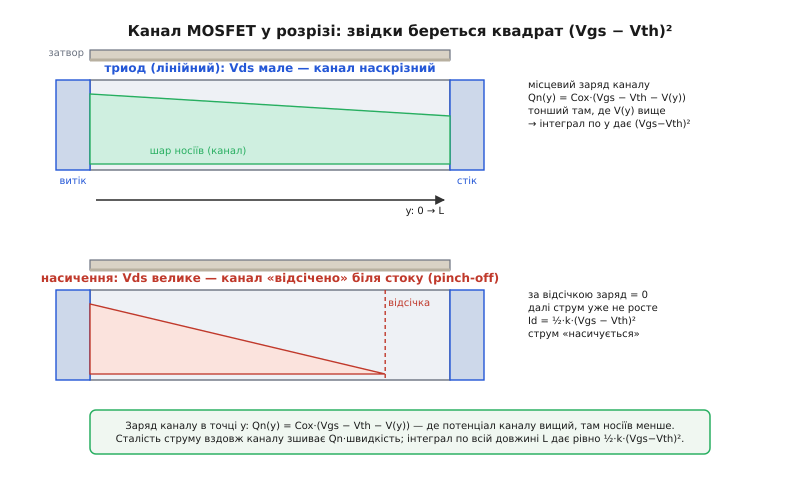
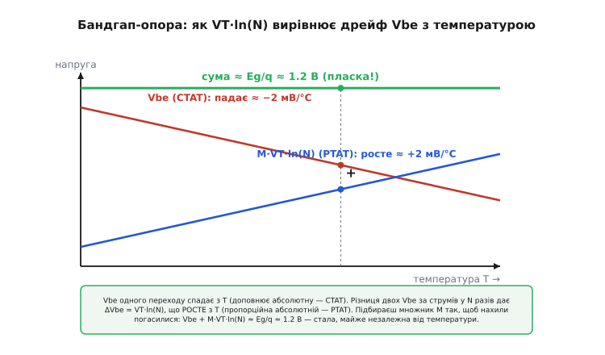

# 🧮 Апарат рівнянь двох транзисторів

У детальному кроці ми **скористалися** цілою жменею формул: струм біполярного росте як `Ic = Is·e^(Vbe/VT)`, польового — як квадрат `Id = ½·k·(Vgs − Vth)²`, крутість одного дорівнює `Ic/VT`, іншого — `√(2·k·Id)`, підпороговий нахил не буває крутіший за 60 мВ/декаду, а різниця двох `Vbe` дає точну опорну напругу. Усім цим ми там **користувалися як готовим**. Тут ми кожну з цих формул **виведемо від першопричини** — від закону Больцмана й фізики каналу — так, щоб жодна не лишилася «магічною». Це не переказ кроку іншими словами: там були готові результати, тут — повний хід до них, з перевіркою розмірностей і граничними випадками на кожному повороті.

Домовмося про одне наперед. Обидва транзистори, попри всю несхожість, ростуть з одного кореня — **як заряджені частинки долають потенціальний бар'єр**. Больцман сказав, скільки частинок здолає бар'єр заввишки в стільки-то енергії; уся електроніка переходів — лише наслідок цього одного речення. Тож почнімо саме з нього, а тоді побачимо, як з одного закону виростають два різні прилади.

## Тепловий потенціал: звідки береться VT ≈ 26 мВ

Перш ніж писати струм будь-чого, треба зрозуміти одне число, що спливе всюди, — **тепловий потенціал** `VT`. Бо саме він задає масштаб напруги, на якому «оживає» будь-який перехід.

Уявіть море вільних електронів у теплому провіднику. Тепло — це хаотичний рух, і енергії окремих електронів розкидані: більшість має середню теплову енергію, але завжди є хвіст тих, кому пощастило з зіткненнями й хто набрав енергії набагато більше. Скільки саме електронів має енергію понад якийсь поріг `E`? На це відповідає **розподіл Больцмана** — наріжний камінь усієї статистичної фізики:

```
частка частинок з енергією понад E  ∝  e^(−E / kT)
```

де `k` — стала Больцмана (`1.381×10⁻²³ Дж/К`), а `T` — абсолютна температура. Читається просто: що вищий бар'єр `E`, то експоненційно менше частинок його долають; що тепліше — то більше. Уся «експоненційність» транзисторів родом звідси й нізвідки більше.

Тепер приберемо енергію на користь напруги — бо інженер міряє не джоулі, а вольти. Щоб перекинути заряд `q` через різницю потенціалів `V`, потрібна енергія `E = q·V`. Підставмо це в показник:

```
e^(−E/kT) = e^(−qV/kT) = e^(−V / (kT/q))
```

Погляньте на знаменник у дужках. Комбінація `kT/q` має розмірність **вольта** (енергія на заряд) і грає роль природного масштабу напруги для теплового руху. Це і є тепловий потенціал:

```
VT = kT / q
```

**Перевірмо розмірність — це звичка, яка рятує від дурних помилок.**

```
[k·T]   = (Дж/К)·К = Дж          (енергія)
[q]     = Кл
[kT/q]  = Дж/Кл = В               ✓ вольт
```

Зійшлося. А тепер число, яке варто закарбувати назавжди:

```
при T = 300 K (кімнатна):
VT = (1.381×10⁻²³ · 300) / 1.602×10⁻¹⁹
   = 4.143×10⁻²¹ / 1.602×10⁻¹⁹
   = 0.02585 В ≈ 25.85 мВ ≈ 26 мВ
```

Ось воно, наше «26 мВ». Це не характеристика якоїсь деталі — це чиста термодинаміка: стільки «важить» один тепловий крок напруги за кімнатної температури. Запам'ятаймо і його температурну чутливість: `VT` росте **прямо пропорційно** абсолютній `T`, тобто при нагріві від 300 до 400 K зросте рівно на третину. Ця пропорційність `VT ∝ T` за хвилину виявиться серцем і підпорогового нахилу, і бандгап-опори.

> 🔧 **Навіщо це.** Кожна експонента в цій статті ділить напругу саме на `VT`. Коли ви бачите в даташиті «нахил 60 мВ/декаду» чи «Vbe повзе −2 мВ/°C», за обома цифрами стоїть це одне число `kT/q`. Знати, звідки воно, — значить розуміти, чому напруги переходів застрягли там, де застрягли, а не деінде.

## Біполярний: від Еберса-Молла до Ic = Is·e^(Vbe/VT)

Тепер — перший прилад. Виведемо його струм так, як його вперше й вивели **Джуелл Джеймс Еберс** (амер. інженер, 1921–1959) і **Джон Молл** у статті «Large-Signal Behavior of Junction Transistors» (Proc. IRE, 1954, лабораторія Bell) — модель, що досі зветься їхніми іменами. *(Усталений факт: авторство й дата підтверджені первинним джерелом.)* Їхня ідея була разюче проста: **дивитися на транзистор як на два діоди спина до спини** — і вивести все з рівняння одного p-n переходу.

Почнімо саме з переходу. Візьмімо межу двох напівпровідників, `p` і `n`, і подивімося, який струм тече, коли ми прикладемо до неї напругу `V`. У рівновазі (без напруги) через межу тече двобічний потік: основні носії намагаються дифундувати на чужий бік, але їх стримує вбудований потенціальний бар'єр. Усталюється баланс — сумарний струм нуль.

Прикладімо тепер пряму напругу `V` (плюс на `p`). Вона **знижує** бар'єр рівно на `V`. За скільки разів побільшає потік носіїв, що його долають? За законом Больцмана — рівно в `e^(V/VT)` разів. А зворотний потік (носії, що скочуються з гори) від висоти бар'єра майже не залежить — він як був малим, так і лишився. Тож повний струм — це «побільшений у e разів» прямий потік мінус незмінний зворотний:

```
I = I₀·e^(V/VT) − I₀ = I₀·(e^(V/VT) − 1)
```

Це **рівняння Шоклі** для діода, і в ньому вже видно все майбутнє біполярного. Розберімо його на очах:

- Множник `I₀` (струм насичення) — це той самий незмінний зворотний потік. Крихітний, бо породжений лише неосновними носіями: у кремнію порядку `10⁻¹⁵ А`. Він шалено залежить від температури (носіїв тим більше, чим тепліше) — запам'ятаймо це для розділу про тепловий розгін.
- Член `−1` важить лише коли `V` мале чи від'ємне. За прямого зміщення на робочих `0.6–0.7 В` показник `V/VT ≈ 0.65/0.026 ≈ 25`, а `e²⁵ ≈ 7×10¹⁰` — десятки мільярдів. Проти такого числа одиниця — пил. Тому для активного режиму сміливо пишемо `≈ e^(V/VT)` без `−1`.

Тепер зробімо з діода транзистор — крок Еберса й Молла. Емітер упорскує носіїв у тонку базу; майже всі вони пролітають її наскрізь і збираються колектором. Скільки впорскне емітер, задає перехід емітер-база — а це діод, тож упорснутий струм росте як `e^(Vbe/VT)`. Колектор же працює простим «збирачем»: він ловить майже все, що долетіло, і від власної напруги `Vce` майже не залежить (поки транзистор в активному режимі). Тому струм колектора — це просто впорснутий струм, ледь урізаний на частку, що загубилась у базі:

```
Ic = Is · (e^(Vbe/VT) − 1) ≈ Is · e^(Vbe/VT)
```

Ось вона, головна формула біполярного — виведена, а не оголошена. `Is` тут — той самий струм насичення переходу емітер-база (зазвичай його так і звуть — струм насичення транзистора). Струм колектора **не залежить** від `Vce` (у першому наближенні) і **експоненційно** залежить від `Vbe`. Це і є «керування напругою переходу» в чистому вигляді.

А струм бази? Це якраз та мала частка носіїв, що не долетіла до колектора, а рекомбінувала дорогою. Вона пропорційна тому самому потоку, тобто тій самій експоненті, — а отже їхнє відношення стале:

```
β = Ic / Ib   (він же hFE)   →   Ic = β·Ib
```

Ось чому `β` — просто число, а не функція струму (у першому наближенні): і чисельник, і знаменник ростуть однаковою експонентою, і вона скорочується. І ось звідки корінь «педалі»: щоб тримати `Ic`, у базу весь час мусить текти `Ib = Ic/β`. Не тому, що так придумали, а тому, що фізично частина впорснутих носіїв **завжди** гине в базі, і цю втрату треба безперервно поповнювати струмом.

**Гранична перевірка — а що при нульовому й зворотному зміщенні?**

```
Vbe = 0:      Ic = Is·(e⁰ − 1) = Is·(1 − 1) = 0            ✓ струму нема
Vbe = −∞:     Ic = Is·(0 − 1) = −Is  ≈ −10⁻¹⁵ А           ✓ крихітний зворотний
```

Обидва випадки фізичні: без напруги струму нема, при зворотній — тече лиш мізерний струм насичення. Формула поводиться розумно на межах — добра ознака, що вивід правильний.

Переставмо цю саму рівність, щоб дістати напругу через струм, — вона нам знадобиться двічі далі (для крутості й для бандгапа):

```
Vbe = VT · ln(Ic / Is)
```

Читається так: **напруга бази — це логарифм струму колектора**. Пропустіть крізь транзистор струм, більший у десять разів, — і `Vbe` зросте рівно на `VT·ln(10) ≈ 60 мВ`, хоч би який був `Is`. Цю логарифмічну точність ми ще використаємо; поки що просто відзначмо її як прямий наслідок експоненти.

## Польовий: квадратичний закон з фізики каналу

Тепер другий прилад — і тут фізика зовсім інша. У біполярного струм задавав **бар'єр**; у польового струм тече крізь готовий **канал**, а напруга затвора лише керує, скільки в тому каналі носіїв. Виведемо `Id` прямо з цієї картини — це найкрасивіший інтеграл у всій статті.

Затвор — металева (чи полікремнієва) пластинка над напівпровідником, відділена тонким шаром оксиду. Це буквально конденсатор: одна обкладка — затвор, друга — поверхня напівпровідника, діелектрик — оксид. Прикладімо до затвора напругу `Vgs`. Як усякий конденсатор, він притягне до протилежної обкладки заряд. Але поки `Vgs` мале, цей заряд іде лише на те, щоб «відштовхнути» основні носії й оголити нерухомі домішки — каналу ще нема. Тільки коли `Vgs` перевищить поріг `Vth`, надлишок напруги починає **притягувати рухливі носії** до поверхні, і під оксидом утворюється тонкий провідний шар — канал.

Скільки носіїв у каналі? Заряд конденсатора — це `Q = C·V`, а «робоча» напруга тут — лише перевищення над порогом, `(Vgs − Vth)`. На одиницю площі:

```
Qn = Cox · (Vgs − Vth)
```

де `Cox` — ємність оксиду на одиницю площі. Це і є **напруга перекриття** `(Vgs − Vth)` у дії: наскільки сильно затвор відкрито понад поріг, стільки й носіїв він натягнув. Поки що просто, бо ми мовчки припустили, що канал усюди однаковий. А він неоднаковий — і саме звідси береться квадрат.

Уся тонкість у тому, що по каналу тече струм, а отже вздовж нього **падає напруга**. Позначмо координату вздовж каналу `y` (0 біля витоку, `L` біля стоку) і місцевий потенціал каналу `V(y)`: біля витоку `V = 0`, біля стоку `V = Vds`. Місцева «робоча» напруга на затворі — це вже не `(Vgs − Vth)`, а `(Vgs − Vth − V(y))`: адже затвор тримає потенціал `Vgs`, а під ним канал уже піднявся до `V(y)`. Тож заряд у точці `y`:

```
Qn(y) = Cox · (Vgs − Vth − V(y))
```

Ось причина клину, який видно на фігурі: біля витоку канал товстий (носіїв багато), а що ближче до стоку, то канал тонший, бо `V(y)` віднімає від перекриття дедалі більше.


*Канал у розрізі. Заряд у точці y дорівнює Cox·(Vgs − Vth − V(y)) — там, де потенціал каналу вищий, носіїв менше, тож канал звужується до стоку. Інтеграл цього заряду по всій довжині й дає ½·k·(Vgs−Vth)². У насиченні канал «відсікається» біля стоку, і струм перестає рости.*

Тепер зшиймо це в струм. Струм — це заряд, що проходить за секунду; локально `Id = Qn(y) · v(y) · W`, де `v(y)` — швидкість носіїв, `W` — ширина каналу. Швидкість у полі — це рухливість на напруженість, `v = μ·E = μ·(dV/dy)` (носії дрейфують уздовж падіння потенціалу). А головне — **струм `Id` той самий у кожному перерізі**: заряд не накопичується, скільки втекло біля витоку, стільки й прибуло до стоку. Це і є ключ, що дозволяє проінтегрувати. Запишімо:

```
Id = W · μ · Cox · (Vgs − Vth − V(y)) · dV/dy
```

`Id` — стала вздовж `y`, тож рознесімо змінні (`dy` ліворуч, `dV` праворуч) і проінтегруймо від витоку до стоку: `y` пробігає `0…L`, а `V` пробігає `0…Vds`:

```
Id · ∫₀ᴸ dy = W·μ·Cox · ∫₀^Vds (Vgs − Vth − V) dV
```

Ліворуч виходить `Id·L`. Праворуч — елементарний інтеграл лінійної функції: первісна від `(A − V)` є `A·V − V²/2`. Підставмо межі `0…Vds`:

```
Id · L = W·μ·Cox · [ (Vgs − Vth)·Vds − Vds²/2 ]
```

Поділимо на `L` і згорнімо сталі геометрії й матеріалу в один параметр крутості `k = μ·Cox·(W/L)`:

```
Id = k · [ (Vgs − Vth)·Vds − Vds²/2 ]     ← ТРИОДНИЙ (лінійний) режим
```

Це повне рівняння для **триодного** режиму — коли канал наскрізний. За малих `Vds` квадратик `Vds²/2` дрібний проти першого члена, і струм майже прямо пропорційний `Vds`: транзистор поводиться як резистор, керований затвором. (Саме тут живе `Rds(on)` відкритого ключа — про це нижче.)

А тепер — де береться квадрат і «насичення». Підіймаймо `Vds`. Місцевий заряд біля стоку — `Qn(L) = Cox·(Vgs − Vth − Vds)` — тане, і коли `Vds` дорівнює перекриттю `(Vgs − Vth)`, він **зникає зовсім**: канал біля стоку «відсікається» (це і є **pinch-off**, відсічка). Далі піднімати `Vds` немає куди — зайва напруга падає на вузькій збідненій ділянці біля стоку, а струм більше не росте: він **насичується**. Значення на порозі відсічки знайдемо, підставивши `Vds = (Vgs − Vth)` у триодну формулу:

```
Id = k·[ (Vgs−Vth)·(Vgs−Vth) − (Vgs−Vth)²/2 ] = k·(Vgs−Vth)²·(1 − ½)

Id = ½ · k · (Vgs − Vth)²     ← НАСИЧЕННЯ  (робочий режим підсилювача)
```

Ось звідки квадрат — і ось звідки та загадкова **½**: вона не постулат, а прямий слід інтеграла `∫V dV = V²/2`. Розгорнімо `k` назад, щоб бачити повну фізику:

```
Id = ½ · μ·Cox·(W/L) · (Vgs − Vth)²
```

**Перевірмо розмірність — знову звичка, що ловить помилки.**

```
[μ]        = см²/(В·с)         (рухливість)
[Cox]      = Ф/см² = Кл/(В·см²) (ємність на площу)
[W/L]      = безрозмірне
[(Vgs−Vth)²] = В²
разом: (см²/(В·с))·(Кл/(В·см²))·В² = Кл/с = А     ✓ ампер
```

Зійшлося до ампера — вивід чистий. І гранична перевірка: при `Vgs = Vth` перекриття нульове, `Id = 0` — каналу нема, струму нема. Нижче порога наївна формула дала б нуль і далі, але — і це найцікавіше — реальний струм там не нуль. До цього переходимо просто зараз.

> 🔧 **Навіщо це.** Із цього виводу випливає практика вибору напруги затвора. Над порогом струм росте **квадратично** й дуже швидко впирається в стелю (обмежену вже опором каналу). Тому «логічного рівня» MOSFET повністю відкривається вже за кількох вольтів перекриття — і тому подати на затвор 5 В замість 4.5 В майже нічого не додасть, а от недодати до порога 0.5 В — фатально: транзистор ледь прочиниться. Розуміти форму `(Vgs − Vth)²` — значить не помилитися з рівнем керування.

## Підпорогова ділянка й межа 60 мВ/декаду

Ми щойно бачили: наївний квадратичний закон нижче порога дає нуль. Але транзистор нижче порога **не мертвий** — крізь нього тече малий струм, і поводиться він там зовсім не як квадрат. Розберімо це, бо саме звідси випливе одна з найважливіших цифр сучасної мікроелектроніки.

Трохи нижче порога канал ще не сформований — носіїв обмаль, і струм тече не дрейфом, а **дифузією** тих кількох носіїв, що змогли перелізти через поверхневий потенціальний бар'єр. Знайоме слово? Це рівно той механізм, що жене струм крізь базу біполярного. А раз бар'єр — то Больцман, і число носіїв над бар'єром росте експоненційно з тим, наскільки ми той бар'єр знизили напругою затвора:

```
Id ≈ I₀ · e^(Vgs / (n·VT))     ← підпорогова ділянка (слабка інверсія)
```

Це **та сама експонента, що й у біполярного** — не аналогія, а той самий закон Больцмана над бар'єром. Роль `Vbe` тут грає `Vgs`, роль бази — приповерхнева ділянка під затвором. У слабкій інверсії польовий буквально працює біполярним транзистором.

Лишився один новий множник — `n` у знаменнику. Звідки він? Затвор керує бар'єром **не напряму**. Між затвором і каналом стоять дві ємності підряд: оксид `Cox` (затвор→поверхня) і збіднений шар `Cdep` (поверхня→глиб напівпровідника). Це **ємнісний дільник**: із поданих на затвор `ΔVgs` до самого бар'єра доходить лише частка, задана дільником. Тому поверхневий потенціал міняється не на весь `ΔVgs`, а на `ΔVgs/n`, де

```
n = 1 + Cdep / Cox     (коефіцієнт неідеальності, завжди ≥ 1)
```

Ось чому в показнику стоїть `n·VT`, а не просто `VT`: частину керувального розмаху «з'їдає» ємнісний дільник. Ідеальний затвор (нескінченно тонкий оксид, `Cox → ∞`) дав би `n = 1`; реальний — трохи більше, типово 1.1–1.5.

Тепер витягнімо головне — **підпороговий нахил** `S`: скільки напруги затвора треба додати, щоб струм зріс **удесятеро** (на декаду). Візьмімо десятковий логарифм струму й продиференціюймо. З `Id ∝ e^(Vgs/(n·VT))` маємо `ln(Id) = Vgs/(n·VT) + const`, а `log₁₀ = ln/ln(10)`. Нахил `S` — це обернена похідна `dVgs/d(log₁₀ Id)`:

```
S = dVgs / d(log₁₀ Id) = n · VT · ln(10)
```

Підставмо числа при кімнатній температурі, в ідеалі `n = 1`:

```
S = 1 · 25.85 мВ · ln(10)
  = 25.85 мВ · 2.3026
  = 59.5 мВ/декаду ≈ 60 мВ/декаду
```

Ось вони, знамениті **60 мВ/декаду** — і тепер видно, що це не якась технологічна цифра, а **термодинамічна стеля**, що росте прямо з `VT = kT/q`. Її навіть прозвали «тиранією Больцмана» *(Boltzmann tyranny)*: жоден звичайний польовий транзистор при 300 K не вимикається крутіше. *(Усталений факт: межа `(kT/q)·ln10` підтверджена як фундаментальна для термоемісії носіїв над бар'єром.)* Реальні прилади через дільник `n` дають гірше — 70–90 мВ/декаду.

Що це означає практично? Щоб надійно **вимкнути** транзистор — придушити струм, скажімо, на 5 порядків, — треба щонайменше:

```
ΔVgs = 5 декад × 60 мВ = 300 мВ
```

розмаху на затворі, і це в найкращому разі. Ось чому напруги живлення цифрових ядер застрягли коло 0.7–1 В і не падають далі: опустиш нижче — транзистор перестане чисто закриватися, потече струм витоку, і чип грітиметься в «спокої». Уся гонитва за приладами «крутіше 60 мВ» (тунельні FET, транзистори з від'ємною ємністю) — це спроба обійти саме цю стелю.

І граничний випадок, що підтверджує коріння в `VT ∝ T`: **охолодіть** прилад. При `T = 200 K`:

```
VT = kT/q = (1.381×10⁻²³ · 200)/1.602×10⁻¹⁹ = 17.2 мВ
S = 17.2 · 2.3026 ≈ 40 мВ/декаду
```

Нахил покращав рівно пропорційно температурі — саме тому кріогенна електроніка вимикається крутіше. Стеля не порушена; вона просто рухається з `T`, як і має, раз народжена з `kT/q`.

## Крутість обох приладів: один рядок диференціювання

Тепер, маючи обидва закони струму, виведемо найпрактичнішу величину підсилювача — **крутість** `gm` (наскільки змінюється вихідний струм на малу зміну керувального входу). У детальному кроці ми навели обидві формули; тут отримаємо їх диференціюванням і, головне, побачимо, **чому** вони такі різні.

**Біполярний.** Беремо похідну `Ic` по `Vbe`. Похідна експоненти — та сама експонента, поділена на сталу в показнику:

```
gm(BJT) = dIc/dVbe = d/dVbe [ Is·e^(Vbe/VT) ] = Is·e^(Vbe/VT) / VT = Ic / VT
```

Спиніться на результаті — він разючий. Крутість біполярного **не залежить від жодного параметра приладу**: ні від розміру, ні від матеріалу, ні від технології. Лише від струму спокою й температури. Візьміть будь-який біполярний у світі, пропустіть 1 мА:

```
gm = 1 мА / 25.85 мВ = 38.7 мА/В
```

І це фундамент фізики переходу, а не характеристика конкретної деталі. Множник `1/VT ≈ 38.7 В⁻¹` тут великий і дармовий — бо `VT` мале.

**Польовий.** Беремо похідну `Id` по `Vgs` у насиченні. Похідна `½·k·(Vgs − Vth)²` — це `k·(Vgs − Vth)`:

```
gm(MOSFET) = dId/dVgs = k · (Vgs − Vth)
```

Це перша форма. Але зручніше виразити її через струм, а не через перекриття (перекриття важко зміряти, струм — легко). З рівняння струму витягнемо перекриття: з `Id = ½k(Vgs−Vth)²` маємо `(Vgs − Vth) = √(2·Id/k)`. Підставмо:

```
gm(MOSFET) = k · √(2·Id/k) = √(k²·2·Id/k) = √(2·k·Id)
```

Ось друга форма — `gm = √(2·k·Id)`. І тут усе інакше: крутість **залежить** від параметра приладу `k` і росте лише як **квадратний корінь** зі струму, а не прямо з ним.

Порівняймо їх на одному струмі — і побачимо різницю, про яку йшлося в кроці. Найчесніше порівняння — через відношення `gm/Id`, тобто «скільки крутості з одного ампера»:

```
BJT:    gm/Id = (Ic/VT)/Ic = 1/VT      = 1/25.85мВ ≈ 38.7 В⁻¹   (стала!)
MOSFET: gm/Id = √(2k·Id)/Id = √(2k/Id) = 2/(Vgs−Vth)
```

Читається так: біполярний дає **сталу** ефективність `1/VT` — найвищу можливу, і на будь-якому струмі. Польовий дає `2/(Vgs − Vth)`, і щоб зрівнятися з біполярним, йому потрібне мізерне перекриття `(Vgs − Vth) = 2·VT ≈ 52 мВ` — тобто робота на самій межі підпорогової ділянки, де струм уже мізерний. За нормальних перекриттів у кілька десятих вольта польовий програє біполярному в кілька разів, а то й на порядок:

```
на I = 1 мА:
  BJT:    gm = 38.7 мА/В                    (завжди)
  MOSFET: gm = √(2·k·1мА), типове k → gm ≈ 1–5 мА/В
```

Ось математичне коріння того, чому в точному аналозі — малошумних входах, дзеркалах струму, опорних джерелах — досі тягнуться до біполярного: з даного бюджету струму він вичавлює найбільше «важеля», і то незалежно від технології. Польовому, щоб дотягтися, треба або гнати набагато більший струм (а `gm` росте лише як корінь — марудно), або роздувати `k`, тобто розмір.

## Чому VT·ln(I₁/I₂) дає опорну напругу до частки відсотка

Лишилося найкрасивіше застосування експоненти — **бандгап-опора** *(bandgap reference)*: джерело напруги, стале до частки відсотка в широкому діапазоні температур. У кроці ми лише згадали, що воно виростає з `VT·ln`; тут виведемо його повністю й побачимо, чому воно працює так надійно.

Постановка задачі: нам потрібна напруга, що **не залежить від температури**. Проблема в тому, що майже все в напівпровіднику з температурою повзе. Пряме падіння `Vbe`, наприклад, спадає приблизно на `−2 мВ` на кожен градус — його звуть **CTAT** *(complementary to absolute temperature)*, бо він іде проти абсолютної температури. Здавалося б, безнадійно. Але ідея бандгапа геніальна: **знайти щось, що росте з температурою рівно так само, як `Vbe` спадає, і скласти їх** — дрейфи погасяться.

Де взяти напругу, що **росте** з `T`? Ось де стає в пригоді логарифм струму, який ми вивели раніше. Візьмімо **два** однакові біполярні переходи й пропустімо крізь них різні струми — `I₁` крізь один, `I₂` крізь другий (нехай `I₁ = N·I₂`, більший у `N` разів). Запишімо `Vbe` кожного через `Vbe = VT·ln(Ic/Is)` і віднімімо одне від одного:

```
ΔVbe = Vbe1 − Vbe2 = VT·ln(I₁/Is) − VT·ln(I₂/Is)
     = VT·[ ln(I₁/Is) − ln(I₂/Is) ]
     = VT·ln(I₁/I₂)
     = VT·ln(N)
```

Погляньте, що сталося. `Is` **зникло** — обидва переходи однакові, тож їхні струми насичення (з усіма їхніми жахливими температурними залежностями) скоротилися начисто. Лишилося чисте `VT·ln(N)`. А `VT = kT/q` **прямо пропорційне абсолютній температурі** — отже `ΔVbe` **росте** з `T`. Це і є шукана напруга, і її звуть **PTAT** *(proportional to absolute temperature)*.

Ось у чому вся краса: різниця двох `Vbe` дає ідеально передбачувану PTAT-напругу, задану лише **відношенням** струмів `N` — числом, яке на кристалі задається геометрією (площами приладів, дзеркалами) точно й стабільно, бо це відношення, а не абсолют. Похибки, спільні для обох переходів, скорочуються.

Тепер складаємо. Візьмімо `Vbe` одного переходу (спадає, CTAT) і додаймо PTAT-напругу `ΔVbe`, помножену на такий множник `M`, щоб їхні нахили точно погасилися:

```
Vref = Vbe + M · VT·ln(N)
        └CTAT┘   └──PTAT──┘
       ↓ з T          ↑ з T
```

Підберімо `M` так, щоб `+2 мВ/°C` від PTAT точно скасували `−2 мВ/°C` від `Vbe`. І ось диво: коли дрейфи гасяться, сума виходить на сталий рівень — і рівень цей дорівнює **екстрапольованій до 0 K ширині забороненої зони кремнію**, `Eg/q ≈ 1.2 В`. Звідси й назва «бандгап»: напруга опори збігається з шириною забороненої зони, бо саме туди сходяться обидві залежності, коли їх правильно зважити.


*Як VT·ln(N) вирівнює дрейф. Vbe одного переходу спадає з температурою (CTAT); різниця двох Vbe за струмів у N разів дорівнює VT·ln(N) і росте з температурою (PTAT). Підбираєш множник M так, щоб нахили погасилися, — сума виходить пласка, коло Eg/q ≈ 1.2 В.*

Ось чому саме `VT·ln` — серце опорних джерел: тільки логарифм струму дає напругу, чисто пропорційну `T` й вільну від `Is`, а отже придатну точно скасувати температурний хід переходу. Цю схему першим побудував **Роберт Відлар** 1971 року (патент США 3617859, разом з Р. Добкіним); згодом **Пол Брокоу** дав уточнену прецизійну комірку, що стала класикою; ще раніше, 1964-го, споріднену ідею опублікував Девід Гілбібер у Fairchild. *(Усталений факт: авторство й дати підтверджені патентом і оглядовими джерелами; винахід колективний, з кількома внесками.)* Відтоді бандгап живе всередині майже кожної мікросхеми, якій потрібна опора, — і працює на тій самій експоненті, що ми вивели на початку.

> 🔧 **Навіщо це.** Коли в даташиті АЦП чи регулятора ви бачите «internal 1.2 V bandgap reference» — це рівно ця схема. Її температурна стабільність (десятки ppm на градус) — прямий наслідок того, що `Is` скоротилося, а нахили `Vbe` й `VT·ln(N)` зважено погашено. Розуміти цей вивід — значить розуміти, звідки береться точність усього, що ви цією опорою міряєте.

## Один корінь, чотири формули: зведімо апарат

Ми почали з одного речення Больцмана — «частка частинок над бар'єром спадає як `e^(−E/kT)`» — і з нього вивели весь апарат обох транзисторів. Простежмо ланцюг як цілість, бо саме нитка виводу, а не окремі формули, лишається в голові:

- **Больцман над бар'єром** → тепловий потенціал `VT = kT/q ≈ 26 мВ`, природний масштаб напруги, що росте прямо з `T`.
- Знижений прямою напругою бар'єр переходу → **рівняння Шоклі** `I = I₀·(e^(V/VT) − 1)` → а з нього, за Еберсом-Моллом, струм біполярного `Ic = Is·e^(Vbe/VT)`.
- Затвор-конденсатор натягує заряд `Qn = Cox·(Vgs − Vth)`, що тане вздовж каналу → інтеграл `∫V dV` уздовж `L` → квадратичний закон `Id = ½·k·(Vgs − Vth)²` з відсічкою й насиченням.
- Той самий Больцман над **приповерхневим** бар'єром → підпорогова експонента → нахил `S = n·VT·ln(10) ≥ 60 мВ/декаду`, стеля живлення цифри.
- Диференціювання обох законів → крутість `gm = Ic/VT` (стала ефективність `1/VT`) проти `gm = √(2·k·Id)` (лише корінь) → перевага біполярного в аналозі.
- Логарифм струму, вільний від `Is` → різниця `ΔVbe = VT·ln(N)` (PTAT) → складена з `Vbe` (CTAT) → **бандгап-опора** `≈ Eg/q ≈ 1.2 В`.

Жодну з цих формул не треба зубрити окремо — усі вони наслідки одного закону про частинки над бар'єром. Перевірка розмірностей на кожному кроці ловила помилки; граничні випадки (`V = 0`, `Vgs = Vth`, охолодження до 200 K) щоразу давали фізично розумну відповідь. Це і є ознака, що апарат правильний: він не просто описує прилади, а **виводиться** з фізики й **поводиться розумно на всіх межах**. Саме на цей апарат спиралися всі якісні висновки детального кроку — від «сталий спад проти резистора» до «на тисячі вольтів польовий здається»; тепер під кожним із них лежить виведена формула, а не оголошений результат.
