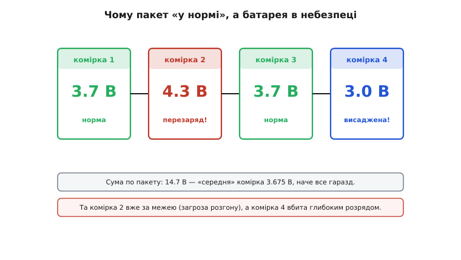
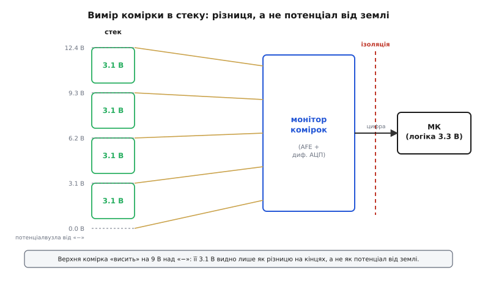
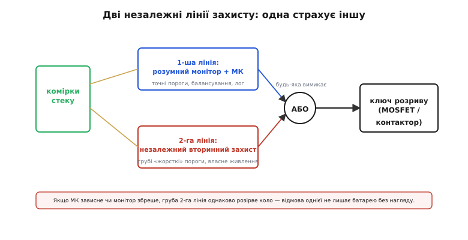
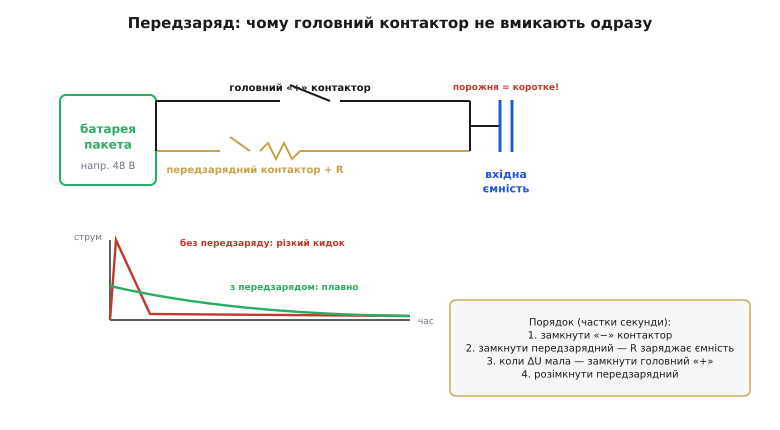

# Архітектура BMS: монітор комірок, ізоляція, контактор

<preknowlist>
- [Гальванічна ізоляція](topic:electronics/galvanic-isolation) — передати сигнал, не пускаючи струм: сторони зв'язані світлом, магнітним полем чи ємністю, а по постійному струму лишаються розв'язаними на тисячі вольтів.
</preknowlist>

Ми вже бачили, чим небезпечний літій: одну комірку не можна заряджати вище ~4.2 В і не можна висаджувати нижче ~2.5 В, інакше — незворотна втрата ємності, а в гіршому разі [**тепловий розгін**](topic:electronics/thermal-runaway) із займанням. Поки комірка одна, її стереже простенький захисний чип. Але щойно комірок стає кілька — а на будь-яку поважну напругу їх ставлять **послідовно**, — простого захисту вже мало. Постає окрема інженерна задача: стерегти не «батарею взагалі», а **кожну комірку зокрема**, та ще й тоді, коли вони висять на різних рівнях напруги й несуть струми в десятки ампер. Систему, що цю задачу розв'язує, називають **системою керування батареєю** (англ. *Battery Management System*, BMS).

Перш ніж розкладати її на вузли, варто чесно відповісти на одне питання: чому пакету недостатньо одного спільного захисту на всю батарею? Відповідь і задає всю архітектуру.

### Чому пакет «у нормі» — це ще не безпека

Уявімо чотири літієві комірки послідовно. Спокусливо міряти лише сумарну напругу пакета: 14.7 В — наче все гаразд, кожній комірці в середньому близько 3.7 В. Та «в середньому» тут і криється пастка.


*Сума по пакету 14.7 В виглядає нормально, а «середня» комірка 3.675 В — наче безпечно. Та комірка 2 насправді на 4.3 В (за межею, кандидат на тепловий розгін), а комірка 4 — на 3.0 В і нижче, вбита глибоким розрядом. Середнє ховає обидві біди.*

Комірки ніколи не бувають **ідентичними**. Вони трохи різняться ємністю від народження, по-різному старіють, по-різному гріються залежно від місця в корпусі. Тому при заряді одна доходить до повного раніше за сусідок, а при розряді інша спорожнюється першою. Якщо керуватися лише сумою, зарядний пристрій спокійно гнатиме струм далі: пакет іще «не повний». А всередині найслабша комірка вже перескочила 4.2 В і повзе в небезпеку — тоді як сума це затуляє, бо решта ще недозаряджені. Дзеркально на розряді: пакет іще «не порожній», а найслабша комірка вже провалилася під 2.5 В і деградує.

Звідси перший і головний висновок, що визначає всю будову BMS: **міряти треба напругу кожної окремої комірки, а не лише пакета**. Захист спрацьовує за **найгіршою** коміркою стеку — за тією, що перша підійшла до будь-якої з меж. Сума по пакету для безпеки майже марна; вона каже про запас енергії, але не про те, чи якась комірка вже за межею.

> 🔧 **Навіщо це.** Це не теорія, а пряме правило монтажу: до BMS заводять **окремий тонкий дріт від кожного міжкоміркового вузла** (англ. *sense wire*). Десять комірок послідовно — це одинадцять сенсних дротів і роз'єм відповідної жильності. Заощадити на цьому, завівши лише кінці пакета, означає зробити батарею сліпою до окремої комірки — а саме окрема комірка її й убиває.

### Монітор комірок: виміряти різницю, а не потенціал

Тут вигулькує перша технічна заковика, і вона тонша, ніж здається. Виміряти напругу однієї комірки легко, коли її «мінус» — це земля схеми. Але в **послідовному стеку** землею є лише найнижчий вузол. Кожна наступна комірка «висить» дедалі вище: у стеку з чотирьох по 3.1 В верхня комірка має на своїх кінцях ті самі чесні 3.1 В, але обидва ці кінці підняті на ~9 В над землею.


*Кожна комірка дає однакові 3.1 В, але «висить» на своєму рівні: верхня — близько 9 В над «−». Виміряти її напругу від землі неможливо; монітор міряє саме **різницю** на двох кінцях кожної комірки (диференційно), оцифровує всі комірки й віддає готову цифру в мікроконтролер.*

Звичайний АЦП мікроконтролера так не вміє: він міряє напругу **відносно своєї землі**, від 0 до якихось 3.3 В. Подати йому на вхід 9 чи 12 В — спалити вхід. Тому всередині стеку працює спеціалізована мікросхема — **аналоговий передній край** (англ. *Analog Front End*, AFE), або просто **монітор комірок**. Її вхід **диференційний**: вона міряє різницю потенціалів між двома сусідніми вузлами, незалежно від того, на якому абсолютному рівні ці вузли сидять. По черзі перемкнувшись на кожну пару вузлів, вона оцифровує всі комірки стеку й віддає мікроконтролеру вже готові числа — «комірка 1: 3.71 В, комірка 2: 4.29 В…». [Цей клас мікросхем-моніторів](root:embedded/bms-architecture/comp-cell-monitor-afe.md) має типову будову й типові граблі, тож розглянемо його окремо.

Той самий монітор зазвичай уміє ще дві речі. По-перше, він читає **давачі температури** (терморезистори на самих комірках) — бо, як ми бачили на температурній осі хімій, заряд літію поза вузьким вікном так само небезпечний, як перенапруга. По-друге, він уміє **розряджати** окрему комірку через вбудований ключ і резистор — це найпростіше, **пасивне балансування**: найзарядженішу комірку придушують, зливаючи її надлишок у тепло, щоб дати сусідкам дозарядитися. Балансування — окрема велика тема з кількома підходами, тож [топології балансування й коли яка варта свічок](root:embedded/active-balancing) розглянемо далі; тут досить знати, що монітор для пасивного варіанта вже має все потрібне.

### Перетнути прірву напруг: ізоляція

Монітор виміряв комірки — тепер ці числа треба донести до мозку системи, мікроконтролера. І тут постає бар'єр, який у малих пристроях не виникає взагалі, а у великій батареї стає центральним.

Мікроконтролер живе у світі низької напруги: 3.3 В, спільна земля з рештою плати, з якою людина спокійно працює. А батарея на сотні вольтів (електромобіль, накопичувач) — це світ, дотик до якого вбиває. З'єднати ці два світи спільним дротом не можна: коротке замикання чи пробій погнали б високу напругу прямо в логіку й на роз'єми, яких торкається людина. Потрібен **гальванічний бар'єр** — спосіб **передати інформацію, не пускаючи струм** між сторонами.

Саме це робить [**гальванічна ізоляція**](topic:electronics/galvanic-isolation): сигнал проходить не дротом, а через посередника — світло (оптрон), магнітне поле (трансформатор) чи ємнісний зв'язок, — тоді як по постійному струму сторони лишаються розв'язаними на тисячі вольтів. У сучасній BMS це найчастіше [**цифровий ізолятор**](topic:electronics/digital-isolator): монітор уже оцифрував комірки, тож крізь бар'єр летить не тендітний аналог, а стійкі до завад цифрові біти.

З ізоляції природно виростає архітектура великого пакета. Сотню комірок не стережуть одним монітором — їх ділять на **модулі** по 8–16 комірок, у кожному свій монітор, а монітори зшивають у **ланцюжок** (англ. *daisy chain*): дані біжать від модуля до модуля вгору по стеку й через один ізольований стик заходять у головний мікроконтролер. Кожна ланка спілкується з сусідньою через свій маленький бар'єр, тож уся гірлянда тягнеться крізь сотні вольтів різниці потенціалів, а мозок системи лишається в безпечному низьковольтному світі. Так одна шина обслуговує весь стек, а ізолятор стоїть лише там, де ланцюжок виходить до логіки.

### Дві лінії захисту: одна страхує іншу

Мозок BMS читає всі комірки й вирішує. Та що він робить, побачивши біду? Він мусить **розірвати коло** — від'єднати батарею від навантаження чи зарядника. І ось тут закладено принцип, без якого жодна серйозна батарея не вважається безпечною: захист **дублюють**.

Поясню чому. Мікроконтролер — складна цифрова система. Він може зависнути, його прошивка може містити ваду, монітор може збрехати через несправність. Якщо безпека батареї тримається лише на цьому одному розумному вузлі, то один його збій — і ніщо не завадить комірці піти в розгін. Для побутового ліхтарика це прикро; для тягової батареї під сидінням людини — неприпустимо.


*Перша лінія — розумний монітор із мікроконтролером: точні пороги, балансування, журнал. Друга — незалежний вторинний захист зі своїми грубими «жорсткими» порогами й власним живленням. Сигнали об'єднані за «АБО»: спрацювала будь-яка — коло рветься. Відмова першої лінії не лишає батарею без нагляду.*

Тому в архітектуру вводять **другу, незалежну лінію** — [простий вузол захисту](topic:electronics/battery-protection), який не програмують і не «розумний». У нього свої грубі, зашиті в залізо пороги (скажімо, «будь-яка комірка вище 4.35 В або весь пакет нижче критичного — рубай»), власне живлення й власний шлях до вимикача. Дві лінії з'єднані за логікою **АБО**: коло розриває **будь-яка** з них. Поки все гаразд, командує точна перша лінія; якщо вона осліпне чи зависне — друга, тупа й надійна, однаково спрацює за своїми межами. Це та сама ідея, що й запобіжник за запобіжником: вони не заважають одне одному, а страхують. Перша оптимізує батарею щодня, друга — остання стіна на випадок катастрофи.

### Чим рвати коло: транзистор чи контактор

Лишилося найфізичніше питання: **що саме** перериває струм за командою захисту? Відповідь залежить від того, скільки потужності тече через батарею, і ділить світ BMS на два різні інженерні режими.

У малих батареях — повербанк, інструмент, дрон — струми це одиниці, від сили десятки ампер, а напруга невелика. Тут ключ робить [**пара польових транзисторів**](topic:electronics/mosfet-back-to-back): два MOSFET-и спина до спини, бо один напівпровідниковий ключ через свій вбудований діод пропускав би струм в один бік навіть закритим, а пара перекриває обидва напрямки — заряд і розряд. Це безшумно, дешево, без рухомих частин і живе мільйони перемикань.

Та коли йдеться про десятки кіловат — електромобіль, велика накопичувальна станція, — кремнієвий ключ уже не годиться: він гріється й коштує надміру. Тут коло рве **контактор** (англ. *contactor*, від лат. *contactus* — «дотик») — по суті могутнє реле з електромагнітом, що фізично зводить і розводить масивні мідні контакти. Він комутує сотні ампер і повністю **розриває** коло металевим зазором (видимий розрив, важливий для безпеки обслуговування), але натомість повільніший, споживає струм на утримання котушки й зношується механічно.

> 🔧 **Навіщо це.** Вибір «транзистор чи контактор» — це не смак, а поріг струму й напруги. До умовних десятків ампер і кількох десятків вольтів — пара MOSFET-ів: тиха, вічна, керована логікою напряму. Вище — контактор: він єдиний дає чесний металевий розрив високовольтного кола, але вимагає драйвера котушки й живлення на її утримання. Сплутати масштаби — поставити транзистор на 400-вольтову шину чи контактор у повербанк — означає або спалити ключ, або роздути дешевий пристрій без потреби.

### Передзаряд: чому контактор не вмикають «в лоб»

З контактором приходить остання, неочевидна тонкість, на якій ламаються початківці. Навантаження високовольтної батареї — інвертор, перетворювач — має на вході велику **ємність** (конденсатори згладжування). Порожній конденсатор для джерела напруги виглядає як **коротке замикання**: у першу мить він не має напруги й готовий проковтнути будь-який струм. Замкнути головний контактор «в лоб» на порожню ємність — це пустити крізь контакти кидок у сотні ампер.

Цей кидок робить одразу дві погані речі. По-перше, він **зварює контакти** контактора: іскра в момент торкання плавить мідь, і контактор лишається замкненим назавжди — а заклинений у замкненому стані контактор робить безглуздим увесь захист, бо коло вже не розірвати. По-друге, такий ривок струму шкодить і самим коміркам, і конденсатору. Тому високовольтну батарею **ніколи** не підмикають одним рухом.


*Паралельно головному «плюсовому» контактору стоїть передзарядна вітка: малий контактор послідовно з резистором. Спершу струм пускають крізь резистор — він обмежує кидок, і вхідна ємність заряджається плавно (зелена крива) замість різкого піку (червона). Лише коли напруга на ємності майже зрівнялася з батареєю, замикають головний контактор, а передзарядний розмикають.*

Розв'язок — **передзаряд** (англ. *pre-charge*). Паралельно головному контактору ставлять другу вітку: малий контактор послідовно з **резистором**. Послідовність увімкнення така (усе за частки секунди):

```text
1. замкнути «мінусовий» контактор          → з'єднали землю пакета з навантаженням
2. замкнути передзарядний контактор         → струм іде крізь резистор, що обмежує кидок;
                                              вхідна ємність заряджається плавно (стала часу R·C)
3. коли напруга на ємності ≈ напрузі батареї → кидок уже не виникне
4. замкнути головний «плюсовий» контактор    → пряме з'єднання, повний струм дозволено
5. розімкнути передзарядний контактор        → резистор більше не потрібен
```

Резистор обмежує початковий струм до `U / R`: за пакета 48 В і резистора 22 Ом перша мить дає лише `48 / 22 ≈ 2.2 А` замість сотень. Ємність набирає напругу за сталою часу `R·C` — за кілька RC вона майже зрівнюється з батареєю, і тоді головний контактор замикає вже на **однаковий** з обох боків потенціал, без іскри. Мозок BMS зазвичай не діє наосліп за таймером, а **вимірює** напругу на навантаженні й замикає головний контактор лише тоді, коли різниця стала малою (типово менш ніж кілька відсотків) — інакше фіксує несправність (наприклад, коротке в навантаженні, коли ємність так і не зарядилася). Уся ця хореографія контакторів, перевірок і реакцій на відмову — це **скінченний автомат**, який і є серцем прошивки BMS; [його стани й переходи розпишемо кодом](root:embedded/bms-architecture/proj-bms-state-machine.md) окремо.

### Як це складають разом

Тепер усі вузли стають на місця, і видно два типові обриси системи — за масштабом батареї.

У **малій** батареї все вміщається в одну мікросхему: один монітор на 3–4 комірки, у ньому ж пороги захисту, балансувальні ключі й драйвер пари MOSFET-ів. Часто там навіть є простий лічильник відданих ампер-годин для [оцінки залишку заряду](topic:electronics/state-of-charge) — бо, як ми бачили, на пласкій кривій LiFePO4 самої напруги для цього мало. Ізоляція не потрібна: напруга низька, земля спільна. Це BMS повербанка чи інструмента — компактна, дешева, цілісна.

У **великій** батареї та сама логіка розгортається в розподілену систему: десятки моніторів по модулях, зшиті ізольованим ланцюжком; окремий вузол вимірювання струму через [шунт](topic:electronics/shunt-resistor) або [давач Холла](topic:electronics/hall-current-sensor); головний мікроконтролер за гальванічним бар'єром; незалежна друга лінія захисту; контактори з передзарядом; зв'язок із рештою пристрою (у транспорті — шиною CAN). Вузли ті самі — їх просто більше, вони рознесені й ізольовані. [Сама ідея керованої батареї виросла саме з великих систем](root:embedded/bms-architecture/hist-bms-origins.md) — авіації та електромобілів, — звідки поступово спустилася в кишенькові пристрої.

А наступний крок — як вирівнювати комірки розумніше за просте зливання надлишку найзарядженішої в тепло: [топології активного балансування](root:embedded/active-balancing).
