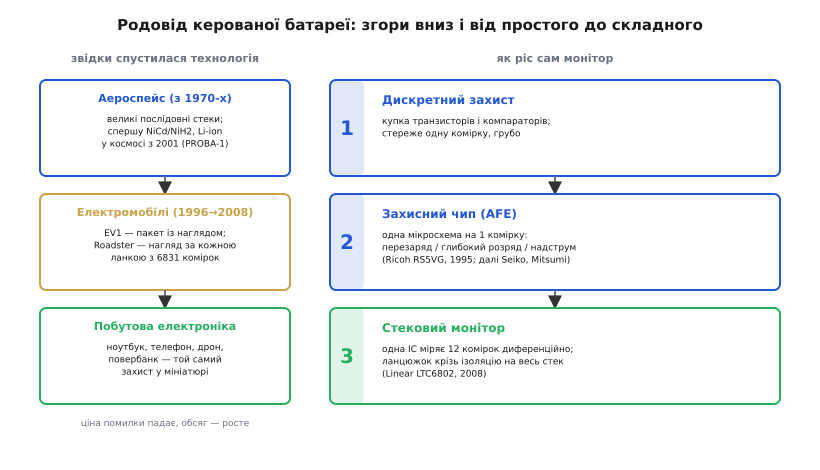

# 📜 Як батарея навчилася стерегти себе

> Сто років батарея була тупою банкою енергії: під'єднав — бере, від'єднав — стоїть. Те, що всередині великого пакета сьогодні сидить власна електроніка, яка щомиті міряє кожну комірку й готова сама розірвати коло, — винахід молодший за компакт-диск. Ця історія про те, **чому** батарея раптом зажадала мозку, і чому мозок цей народився не в кишені, а у великих небезпечних системах — і лише потім спустився в повербанк.

У головній темі ми вже розклали BMS на вузли: монітор комірок, ізоляція, дві лінії захисту, контактор із передзарядом. Усе це виглядає так логічно, що мимоволі здається вічним — ніби батареї завжди так стерегли. Та це зовсім не так. Більшу частину історії електрики батарея жодного нагляду не мала й не потребувала, і саме розуміння, **звідки** взялася потреба в електроніці всередині пакета, найкраще пояснює, чому архітектура BMS саме така. Тож пройдімо цей шлях від початку: спершу — чому раніше було можна без мозку, потім — що змінив літій, і нарешті — як крихітний захисний чип за два десятиліття виріс у розподілену систему на сотні вольтів.

### Доба тупих батарей: чому свинцю й нікелю мозок не був потрібен

Уявімо інженера 1980 року, який живить пристрій від акумулятора. Вибір у нього невеликий: свинцево-кислотний або нікель-кадмієвий. І жоден із них **не вимагає всередині ніякої електроніки** — у цьому вся річ. Не тому, що інженери не вміли її зробити, а тому, що сама хімія була **поблажлива до знущань**.

Подивімося, чому. Нікель-кадмієва комірка спокійно терпить **перезаряд**: коли вона повна, надлишок струму йде не на руйнування, а на нешкідливу побічну реакцію всередині — кисень, що виділяється на одному електроді, тут-таки поглинається на іншому. Тому NiCd навіть **заряджали** легким сталим струмом «до упору» й лишали на підзарядці без жодного контролера — хімія сама гасила надлишок. Свинцево-кислотна батарея поводиться схоже: помірний перезаряд вона зустрічає електролізом води (звідси й потреба доливати воду в старих автомобільних акумуляторах), а не катастрофою. Обидві хімії, по суті, мали **вбудований запобіжник у самій реакції**.

> 🔧 **Чому це головне.** Уся подальша історія тримається на одному контрасті. Стара батарея пробачала межі: вийшов за них трохи — вона погасила це теплом чи газом і вижила. Тому «керування» нею зводилося до простого зарядника зовні, а сама банка лишалася тупою. BMS народжується рівно в тій точці, де з'являється хімія, яка **не пробачає** — і пробачати має натомість електроніка.

Звісно, для дуже великих або відповідальних свинцевих і нікелевих установок — телефонні станції, підводні човни, супутники — нагляд таки був: вимірювали напругу банок, стежили за температурою, вели журнал. Але це був зовнішній **моніторинг** заради довговічності й планового обслуговування, а не вбудований **захист заради виживання**. Різниця принципова: тодішня апаратура спостерігала за батареєю, щоб та служила довше; завтрашня — мусила **втрутитися за мілісекунди**, щоб батарея не загорілася. Перше — зручність, друге — питання життя. І перевів одне в друге саме літій.

### Літій змінює контракт: відтепер межа — це обрив

Коли на зламі 1980–90-х дозрів перезаряджуваний літій-іон (його комерціалізувала Sony 1991 року — це окрема історія, [як збирали літій-іонний акумулятор](root:embedded/linear-vs-switching/hist-lithium.md), варта прочитання), він приніс разючу щільність енергії — і разом з нею новий, нечуваний доти **контракт із користувачем**. Літій не пробачає взагалі.

Перезаряд понад ~4.2 В на комірку не гаситься жодною доброю побічною реакцією: натомість починається незворотний розклад електроліту, виділення газу, ріст металевого літію на аноді — і за певним порогом комірка зривається в [**тепловий розгін**](topic:electronics/thermal-runaway), коли тепло прискорює реакцію, а реакція дає ще більше тепла, аж до займання. Дзеркально й глибокий розряд нижче ~2.5 В руйнує комірку — розчиняється мідний струмознімач, і при наступному заряді можуть вирости внутрішні замикання. Те, що для свинцю було «небажано», для літію стало «**смертельно**». Запас міцності, який хімія раніше дарувала безкоштовно, зник; його тепер мусив забезпечувати хтось ззовні самої реакції.

Звідси й народилася сама ідея, що батарея повинна **активно стерегти себе**. Не зовнішній зарядник «знає міру» — а всередині, поряд із коміркою, має сидіти сторож, який щомиті дивиться на напругу й температуру і **відрубує** коло, щойно щось підходить до межі. Тупа банка більше не годилася. Уперше в історії батареї знадобилася власна електроніка не для зручності, а для того, щоб просто не вбити власника. І першим втіленням цього сторожа став крихітний чип на одну-єдину комірку.

### Перший сторож: захисний чип на одну комірку (Ricoh, 1995)

Найперша масова потреба була проста: один літієвий елемент у телефоні чи камкордері треба вберегти від перезаряду, надмірного розряду й короткого замикання. Розв'язали її **спеціалізованою мікросхемою захисту** (англ. *protection IC*) — дрібним чипом, що сидить просто в батарейному блоці поряд із коміркою.

Документована точка відліку тут конкретна. Японська **Ricoh** (підрозділ, що згодом став Nisshinbo Micro Devices) 1995 року випустила протекторну мікросхему **RS5VG** — за власною заводською хронологією, свій перший захисний чип для літій-іона. Він умів рівно три речі, які й досі складають ядро будь-якого літієвого захисту: ловити **перезаряд** (напруга комірки полізла вище безпечної), **глибокий розряд** (просіла нижче нижньої межі) і **надструм на розряді** (коротке чи перевантаження). Виявивши будь-що з цього, чип розмикав послідовний ключ — і відрізав комірку від світу. По суті, це була та сама «друга лінія» захисту з головної теми, тільки для одної комірки й сама собою — увесь BMS у вигляді однієї дешевої мікросхеми.

> 🔧 **Звідки три межі.** Зверніть увагу, наскільки чіпко той перелік 1995 року тримається й сьогодні. Будь-який сучасний AFE починається з тих самих трьох порогів — перезаряд, глибокий розряд, надструм, — бо вони прямо випливають із трьох способів убити літій. Усе інше (балансування, термометрія, лічба заряду) наросло пізніше зверху; а ядро лишилося тим, яким його окреслили на світанку літієвої доби.

Дуже швидко на цьому полі піднялися ще двоє японських гравців, чиї імена й донині майже синоніми класу: **Seiko Instruments** (його лінія захисних мікросхем, як-от родина S-824x, стала галузевим звичаєм) і **Mitsumi**, що виросла в одного з найбільших постачальників однокоміркових протекторних чипів у світі. Конкуренція цих фірм у 1990-х і відточила той дешевий, надійний, мікроскопічний сторож, який сьогодні непомітно сидить у кожному телефоні й кожному «розумному» акумуляторі. Це **низ** історії — масовий, кишеньковий, тихий.

Але щойно комірок ставало більше за одну й вони ставали в **послідовний** ряд, цей простий чип переставав давати раду. А найперше з великими послідовними стеками зіткнулися зовсім не споживчі пристрої.

### Велика проблема приходить згори: аероспейс і електромобіль

Однокоміркова мікросхема розв'язує задачу, де земля схеми — це «мінус» комірки. У серйозній батареї комірок десятки, з'єднані **послідовно** заради напруги, і кожна «висить» на своєму рівні потенціалу — рівно та заковика з диференційним виміром, яку ми розбирали в головній темі. Уперше з нею в повний зріст зустрілися дві галузі, де великий літієвий стек з'явився раніше, ніж будь-де: **космос** і **електромобіль**. Саме там — а не в кишені — і викували архітектуру керованої батареї.

*Дві осі однієї історії. Ліворуч — звідки технологія спускалася: великі послідовні стеки спершу постали в аероспейсі та електромобілях, де ціна помилки величезна, і лише потім та сама логіка зменшилася до повербанка. Праворуч — як ріс сам монітор: від купки дискретних деталей через однокомірковий захисний чип (Ricoh, 1995) до стекового монітора на 12 комірок із ланцюжком крізь ізоляцію (Linear, 2008).*

Почнімо з космосу, бо там потреба стерегти послідовний стек визріла найраніше. Супутник живиться від сонячних панелей на світлій частині орбіти й від акумулятора — у тіні Землі, і так **тисячі разів** за місію: знеструмити апарат на мільярди гривень через одну вбиту комірку — катастрофа без права на ремонт. Десятиліттями там панували інші хімії — нікель-кадмієва, а з 1970-х нікель-воднева (NiH₂), що добре терпіла цей нескінченний цикл. Перехід на літій-іон у космосі стався помітно пізніше, ніж у споживчій техніці, бо спершу треба було навчитися надійно **керувати** великим літієвим стеком на орбіті. Документований рубіж: першим супутником із літій-іонною батареєю стала європейська **PROBA-1**, запущена 2001 року (її комірки виготовила британська ABSL), а першим апаратом із літієм біля іншої планети — **Mars Express** ЄКА 2003 року. Що тут важливо для нашої історії: у тих ранніх космічних системах вирівнювання комірок часто робили **не автономно**, а через команду з Землі чи бортового комп'ютера — тобто керування батареєю ще не було самодостатнім вузлом, а спиралося на зовнішній мозок. Саме незручність такого підходу й підштовхнула до **автономних** схем нагляду й балансування — прямих предків сучасної BMS.

Друга колиска — **електромобіль**, і тут потреба була масовіша. Показовий ранній приклад — **General Motors EV1**, серійний електромобіль, що пішов у лізинг 1996 року. Його батарея — ще не літій, а 26 свинцевих модулів (герметичних, клапанно-регульованих), — уже жила під наглядом: окремий контролер пакета був одним із кількох бортових комп'ютерів, об'єднаних спільною шиною, і стежив за станом заряду й температурою з активним терморегулюванням. Це ще «моніторинг заради довговічності» в дусі старих хімій, але вже **вбудований у машину як окрема система** — каркас майбутньої BMS на свинцевому змісті.

А по-справжньому сучасну архітектуру явив світу перший **Tesla Roadster** (2008). Його пакет — 6 831 літій-іонна комірка стандартного формату 18650, зібрана в складну послідовно-паралельну структуру, — стеріг розподілений нагляд, що міряв напругу й температуру **кожної ланки** стеку в реальному часі. Така дрібність нагляду в автомобілі тоді була нечуваною — і саме вона стала зразком, з якого виросли BMS усіх наступних електромобілів. Тут уже все з головної теми: модулі, монітори по них, ізоляція, контактори. Велика, небезпечна, відповідальна батарея змусила винайти повноцінну систему керування — а вже звідти готова ідея покотилася вниз, у дедалі менші пристрої.

> 🔧 **Чому згори вниз.** Технології безпеки майже завжди визрівають там, де помилка коштує найдорожче, а потім дешевшають і спускаються в побут — як ремінь і подушка безпеки прийшли в авто з перегонів і авіації. З BMS так само: диференційний вимір стеку, ізоляцію, дублювання захисту й передзаряд виносила інженерія супутників і електромобілів, де ціна відмови — життя чи місія. Кишеньковий повербанк отримав ці ідеї вже готовими й здешевленими — він стоїть на плечах великих систем, хоч сам про це й «не здогадується».

### Чип доганяє стек: монітор на багато комірок і ланцюжок

Лишалася технічна прірва. Однокоміркові протекторні чипи Seiko й Mitsumi були чудові, але рахували одну комірку; стерегти стек із них означало громадити окрему обв'язку біля кожної ланки. Великі системи 2000-х (як той Roadster) будували нагляд за стеком значною мірою з **дискретних** деталей і власних плат — дорого, громіздко, з купою місць для помилки. Бракувало єдиної мікросхеми, що сама виміряла б **багато** послідовних комірок одразу.

Її дала каліфорнійська **Linear Technology** (нині частина Analog Devices), випустивши 2008 року **LTC6802** — мікросхему-монітор цілого стеку (англ. *battery stack monitor*). Один чип міряв до **12** послідовно з'єднаних літієвих комірок: усередині — точний АЦП, опорне джерело й **високовольтний вхідний мультиплексор**, що по черзі перемикається на кожну пару вузлів і знімає різницю диференційно, попри те що вузли сидять на різних рівнях потенціалу. Це і є той самий **аналоговий передній край** (AFE) з головної теми, тільки нарешті зібраний в одну мікросхему й одразу на дюжину комірок.

Та головний винахід був не у вимірі, а в **з'єднанні**. Щоб накрити сотню комірок, такі чипи треба було поставити один над одним — а вони сидять на драматично різних потенціалах (нижній — біля землі, верхній — за сотні вольтів над нею). LTC6802 уміла **зшиватися в ланцюжок** (*daisy chain*) із зсувом рівня: кожна мікросхема спілкувалася з сусідньою згори через свій маленький бар'єр, і дані бігли стеком знизу вгору, виходячи до логіки через єдиний ізольований стик. Це рівно та розподілена, ланцюжкова, ізольована архітектура, яку ми описали для великого пакета, — тепер відлита в кремній. Наступні покоління (LTC6803 у 2010-му, LTC6804 у 2013-му з оновленою архітектурою, LTC6811 у 2016-му) лише шліфували точність і завадостійкість та переводили зв'язок між ланками на стійкий ізольований інтерфейс — але **спосіб** уже був заданий 2008 роком.

З цього моменту коло замкнулося. Велика батарея отримала компактний «цеглинку-монітор», з якої складають нагляд будь-якої довжини; а та сама кремнієва інтеграція, що здешевлює великі системи, дала змогу втиснути весь BMS повербанка в одну дешеву мікросхему. Верх історії (відповідальні стеки) і низ (кишенькові пристрої) зустрілися в одному прийомі — інтегрованому AFE.

### Що з цієї історії варто винести

Якщо стиснути весь шлях у кілька думок, проступає та сама мораль, що й за іншими винаходами в цьому курсі.

По-перше, **BMS — дитя літію, а не батарей узагалі**. Поки хімія сама пробачала перезаряд (свинець, нікель-кадмій), вбудована електроніка захисту була зайвою: банка лишалася тупою, а «керування» жило в зовнішньому заряднику. Літій скасував цю поблажливість — і змусив перенести запас міцності з хімії в кремній. Дата народження BMS у сучасному сенсі — це, по суті, дата, коли літій пішов у маси.

По-друге, **технологія спускалася згори вниз**. Велику, небезпечну, дорогу батарею навчилися стерегти раніше за дешеву — у космосі та електромобілі, де відмова неприпустима. Кишеньковий пристрій дістав ці рішення вже готовими й здешевленими. Тому коли тримаєш у руках повербанк із «розумним» захистом, корисно пам'ятати: ця кмітливість прийшла туди з супутників і електромобілів, а не зародилася в самому повербанку.

По-третє, як завжди в техніці, **це робота багатьох, а не одного імені**. У цій історії немає єдиного «винахідника BMS» і немає однієї тріумфальної дати. Є ланцюг внесків: хіміки, що дали небезпечний літій; японські фірми (Ricoh, Seiko, Mitsumi), що в 1990-х виточили однокомірковий захист; інженери аероспейсу, що першими приборкали великий послідовний стек і відмовилися від керування «з Землі» на користь автономного; команди GM і Tesla, що вбудували нагляд у машину; виробники мікросхем (Linear та інші), що відлили стековий монітор з ланцюжком у кремній. Кожен додав свою цеглинку — і лише разом вони дали ту систему, яку ми розклали на вузли в головній темі. Це й варто тримати в голові, читаючи будь-яку коротку формулу на кшталт «компанія X винайшла BMS»: за нею майже завжди стоїть кілька країн, десятиліть і людей, чиїх імен реклама не згадує.
