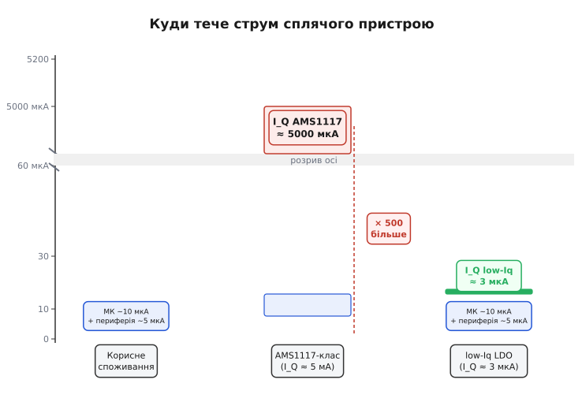
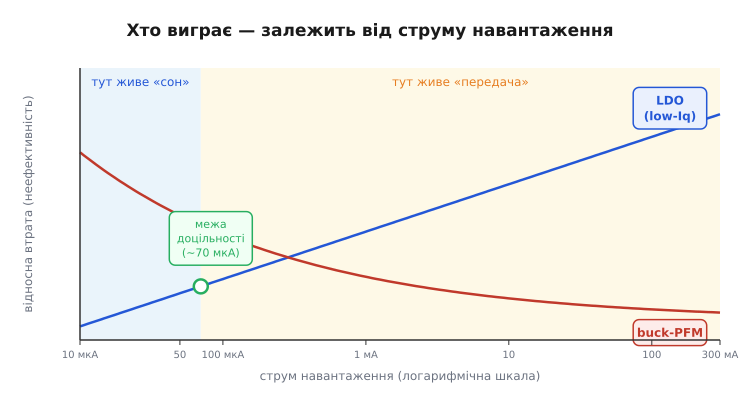

# 🔌 LDO проти buck-конвертера для батареї: quiescent current вирішує

> Сама плата [споживає струм навіть коли МК спить](root:embedded/board-consumption); найбільший і найнепомітніший винуватець — **стабілізатор живлення**. Тут порівнюємо два його класи — лінійний **LDO** та імпульсний **buck** — саме через призму сплячого пристрою. Загальна теорія [«лінійний vs імпульсний»](root:embedded/linear-vs-switching) (ККД, як працює дросель) — окрема розмова; наш кут — **струм спокою (quiescent current, I_Q)**, що тече, поки нічого не відбувається.

## Що це за клас

**Лінійний стабілізатор (LDO, low-dropout regulator)** «спалює» надлишок напруги як тепло на прохідному транзисторі — саме такий AMS1117-клас стоїть на більшості [DevKit-плат з ESP32](root:hw-arch/esp32-architecture). Простий, тихий, без завад. **Імпульсний знижувальний (buck / step-down)** швидко вмикає й вимикає ключ, дроселем «перекачуючи» енергію з меншою тепловою втратою — типовий ККД 85–95 %. Обидва сімейства роблять одне й те саме: з нестабільної напруги батареї (3.0–4.2 В Li-ion або 2×AA ≈ 2.0–3.2 В) дають стабільні 3.3 В для МК. Але для батарейного пристрою вирішальним є не ефективність під навантаженням, а **струм спокою (quiescent current, I_Q)** — те, що стабілізатор споживає просто щоб лишатися увімкненим, **незалежно від навантаження**. Серед поширених сімейств: AMS1117-клас (I_Q ≈ 5 мА), HT7333/ME6211/TPS7A-клас (low-I_Q LDO, одиниці мкА), TPS62-клас (buck з режимом PFM, I_Q ≈ 15–25 мкА).

## Чому I_Q вирішує саме на батареї

Сплячий пристрій проводить 99.9 % часу в deep-sleep, де сам МК споживає близько 10 мкА (скважність і [профіль струму за цикл](root:embedded/duty-cycle-current)). На цьому тлі **5 мА I_Q стабілізатора AMS1117-класу — у 500 разів більше за корисне споживання**: батарея живить переважно стабілізатор, а не пристрій. Жодна оптимізація прошивки цього не перекриє, поки стабілізатор той самий.

> 🔧 **Навіщо це.** Саме I_Q, а не ефективність під навантаженням, перетворює «розрахунковий рік» на «два тижні автономної роботи». Перший рядок, який треба шукати в даташиті для батарейного пристрою, — *Quiescent Current* або *Ground Current*. Ще до вибору МК і RF-модуля.

Щоб відчути масштаб, підставимо числа. Маємо банку 1000 мА·год:

```
── Стабілізатор AMS1117-клас (I_Q ≈ 5 мА) ──────────────────────────
I_корисн   =  10 мкА   (МК deep-sleep)
I_Q        =  5000 мкА (стабілізатор)
I_сер      =  I_корисн + I_Q  =  10 + 5000  ≈  5010 мкА

T_роботи   =  Q / I_сер  =  1000 мА·год / 5.010 мА  ≈  200 год  ≈  8 днів

── Low-I_Q LDO (I_Q ≈ 3 мкА) ───────────────────────────────────────
I_Q        =  3 мкА
I_сер      =  10 + 3  =  13 мкА

T_роботи   =  1000 мА·год / 0.013 мА  ≈  76 900 год  ≈  8.8 років
```

**Різниця — не у відсотках, а в порядках величини:** 8 днів проти 8 років із тієї самої банки. І це ще без урахування активних пробуджень — після них картина лише покращиться для low-I_Q, адже в активному режимі його I_Q незмінно малий.


*Куди тече струм сплячого пристрою. Корисне споживання (МК у deep-sleep) — тонка смужка; струм спокою дешевого LDO накриває її в сотні разів. Замінивши стабілізатор на low-I_Q, повертаємо бюджет пристрою собі.*

## LDO чи buck: де проходить межа

Здавалося б, buck ефективніший — чому не завжди він? Парадокс у тому, що ефективність buck **падає на малих струмах**: власний I_Q контролера та витрати на перемикання стають помітними відносно корисного навантаження. Старий buck без режиму енергозбереження може мати I_Q у сотні мкА — і на сплячому пристрої він програє навіть доброму low-I_Q LDO.

Точніше думати про дві **робочі точки** одного й того самого пристрою. У **режимі сну** (одиниці–десятки мкА) визначає I_Q — і тут перемагає low-I_Q LDO з його одиницями мкА. У **режимі передачі або активного зчитування** (десятки–сотні мА) визначає ефективність — і тут перемагає buck, бо LDO на перепаді 4.2 → 3.3 В «спалює» близько 20 % потужності як тепло:

```
P_loss (LDO)  = (Vin − Vout) · I_load
               = (4.2 − 3.3) В · 200 мА  =  180 мВт  →  тепло
```

Саме тому сучасні buck для батарей мають **режим пропуску імпульсів (PFM/PSM, pulse-frequency/skipping modulation)**: на малому струмі ключ майже стоїть, I_Q контролера падає до ≈ 15–25 мкА — і buck перестає програвати в режимі сну. Серійні представники цього підходу — TPS62-клас.

Із цього випливає практичне правило вибору: **великий перепад напруги** (наприклад, 5 В → 3.3 В) **і значний активний струм** → buck з low-I_Q режимом; **малий перепад** (2×AA ≈ 2.4–3.0 В → 3.3 В не дотягне, але в 1S Li-ion 3.3–4.2 В різниця невелика) або **рідкісні пробудження** → low-I_Q LDO. У складніших схемах застосовують **обидва**: LDO живить «завжди-живу» частину (RTC, датчик присутності), а buck вмикається лише під час активності.


*Хто виграє — залежить від струму. Зліва (сон, мкА) панує струм спокою — бере гору low-I_Q LDO; справа (активність, мА) панує ефективність — бере гору buck. Точка перетину каже, який клас обрати під профіль саме вашого пристрою.*

## «Перший байт»: як виміряти й перевірити

Відкрийте даташит на свій стабілізатор і знайдіть рядок *Quiescent Current* або *Ground Current* — саме для свого Vout і робочої температури. Важливий нюанс: I_Q часто **зростає** з нагрівом і може залежати від рівня навантаження. Якщо рядка немає або значення не влаштовує — це вже відповідь.

Перевірити можна [просто на реальній платі](root:embedded/measure-consumption): перевести МК у deep-sleep і виміряти повний струм пристрою. Якщо «сон» показує міліампери — майже напевно винен стабілізатор, а не прошивка. Мультиметр на імпульсних піках дає хибні показання; для точного виміру потрібен або прецизійний шунт з осцилографом, або спеціалізований інструмент на зразок Nordic PPK2.

Крайній захід для найбюджетніших пристроїв: на час сну **повністю знімати живлення** зі стабілізатора через load switch, який [пробуджується разом із МК](root:hw-arch/wakeup-sources), живлячи МК від невеликого конденсатора або від тієї ж батареї через окремий ультра-low-I_Q LDO лише для RTC.

## Типові граблі

- **«Сон» споживає міліампери, хоча прошивка оптимізована** — на платі стоїть AMS1117-клас із I_Q ≈ 5 мА; цю «базу» не перекрити жодними `esp_sleep_enable_*`. Вихід — замінити стабілізатор на low-I_Q LDO або buck-PFM, а не шукати «зайвий» GPIO, що тягне струм.
- **Поставили buck «бо ефективніший» — а в сні стало гірше** — старий buck без PFM/PSM має I_Q у сотні мкА; на малому струмі він програє навіть посередньому LDO. Перевіряйте не лише ефективність при 100 мА, а й I_Q у специфікації.
- **Dropout не вистачає під кінець розряду** — Li-ion сідає до 3.4–3.3 В, а LDO на 3.3 В потребує ще 100–200 мВ запасу: вихід «провалюється», МК потрапляє в [brownout-скидання](root:hw-arch/reset-causes). Вихід — справжній low-dropout LDO з dropout < 100 мВ або buck (він не залежить від вхідного перепаду в той самий спосіб).
- **Зворотний струм у вимкненому стані** — деякі стабілізатори підтікають з виходу назад на вхід, коли живлення знято або полярність змінена; для відключуваних гілок це непомітно псує бюджет і може пошкодити джерело.
- **Світлодіод «power» і дільник для ADC-вимірювання батареї** — постійний витік поряд зі стабілізатором. Якщо стабілізатор вже замінено, а батарея все одно швидко розряджається — наступне місце шукати саме там, серед [постійних паразитних струмів плати](root:embedded/board-consumption).

## Варіації класу

Сімейство LDO поділяється на **звичайні** (AMS1117-клас, I_Q 5–10 мА, для живлення від мережі або USB) і **батарейні low-I_Q** (HT7333/ME6211/TPS7A-клас, I_Q одиниці мкА, зазвичай мають вивід *enable* для повного вимкнення від МК). Сімейство buck: **фіксований вихід** vs **регульований**; з PFM/PSM для малих струмів (TPS62-клас) vs «силові» без нього; з **інтегрованим дроселем** (µModule) vs **зовнішньою обв'язкою**. Із суміжних класів варто знати назви: **buck-boost** (коли вхід коливається навколо виходу — типова ситуація 1S Li-ion 4.2 ↘ 3.0 В навколо 3.3 В) і **load switch** (не стабілізатор, а вимикач гілки) — докладно про них у [силовій електроніці](root:embedded/linear-vs-switching). Вибір між класами — завжди вибір під **профіль струму** пристрою в часі, а не «який кращий взагалі».
