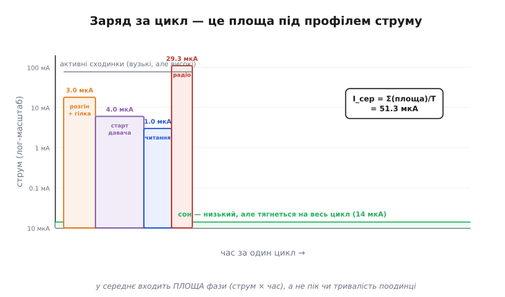

# 🧮 Час життя від батареї: середній струм і поправки, що ламають наївну модель

Детальна стаття вивела головний рядок бюджету — I_сер = D·I_акт + (1−D)·I_сон — і чесно попередила, що це наближення без тертя: воно мовчить про саморозряд батареї, про недоступну під імпульсом ємність і про ККД перетворення. Тут ми доводимо це до кінця. Спершу строго виводимо середній струм із того, що таке заряд узагалі, тоді по черзі вводимо кожну поправку — не як застереження, а як число, що додається до розрахунку, — і зводимо все в одну формулу часу життя, якою справді можна користуватися. Наприкінці — кілька повних обчислень, де видно, коли наївна модель бреше вдвічі, а коли вона точна.

Мета не в тому, щоб завалити читача формулами. Мета — щоб, дивлячись на пристрій, ти міг сказати не «десь місяці», а «стільки-то місяців, і ось що саме обмежує», і знати, **яка поправка** в твоєму випадку вирішальна, бо вони різні для різних пристроїв.

## Означення: чому час життя — це заряд, поділений на середній струм

Почнімо з першопринципу, бо на ньому тримається все решта. **Заряд** (electric charge, від лат. *carrus* — «віз», через ідею «навантаженого») — це те, що батарея зберігає й віддає. Струм — це швидкість, з якою заряд витікає: один ампер означає один кулон за секунду. Отже, заряд, що витік за проміжок часу, — це струм, помножений на час; а коли струм не сталий, а міняється — це інтеграл струму за часом, тобто площа під графіком струму:

```
Q(t) = ∫₀ᵗ I(τ) dτ
```

Ємність батареї — це повний заряд, який вона може віддати, поки не сяде. Її зручно міряти не в кулонах, а в **ампер-годинах** (А·год): один ампер-годину — це заряд, що витікає струмом 1 А протягом 1 год. Перевід простий: 1 А·год = 3600 Кл, бо в годині 3600 секунд. Виробник пише на батареї саме ампер-години (для дрібних — міліампер-години, мА·год), бо це відразу читається як «стільки годин при такому струмі».

Тепер головне питання: пристрій сяде, коли заряд, що витік із батареї, зрівняється з її ємністю. Скільки він до того проживе? Якщо струм сталий, відповідь очевидна — час дорівнює ємності, поділеній на струм. Але струм не сталий: пристрій то спить, то прокидається. Тоді умова «сів» записується через інтеграл:

```
Q_ємн = ∫₀ᵀ_життя I(τ) dτ
```

Ось де на сцену виходить середнє. **Середній струм** за означенням — це весь заряд, що витік, поділений на час, за який він витік. Якщо я знаю середній струм, інтеграл згортається в просте множення, і час життя виходить діленням:

```
I_сер = ( ∫₀ᵀ I(τ) dτ ) / T          (означення середнього струму)

⟹  T_життя = Q_ємн / I_сер
```

Це і є фундамент. Не «приблизно», не «наближено» — це точна тотожність за означенням, поки I_сер — справжнє середнє за весь час життя. Уся подальша інженерія — це боротьба за те, щоб **правильно порахувати I_сер** і **правильно взяти Q_ємн**, бо саме тут ховаються всі поправки. Наївна модель бере обидва числа неправильно: середній струм рахує лише зі сну й активності, забувши саморозряд і ККД, а ємність бере номінальну, забувши, що під імпульсом батарея віддає менше. Виправимо обидва.

> 🔧 **Навіщо це.** Формула T_життя = Q / I_сер — це не одна з можливих оцінок, а означення. Помилитися в часі життя можна лише двома способами: узяти хибний I_сер або хибний Q. Тому весь розрахунок автономності зводиться до двох чесних чисел — скільки заряду батарея реально віддасть і який струм ти реально з неї тягнеш у середньому. Далі — лише як порахувати кожне без самообману.

## Формальний апарат: від інтеграла до зваженого середнього — і до кількох фаз

Детальна вивела двофазний випадок; тут доведімо його строго й одразу узагальнимо, бо реальний цикл рідко має рівно дві фази.

Розгляньмо один повний цикл роботи тривалістю T. Струм у ньому — кусково-стала функція: пристрій проводить фазу i на рівні струму I_i протягом часу t_i. Інтеграл кусково-сталої функції — це просто сума прямокутників «висота × ширина», бо на кожному відрізку струм не міняється й площа під ним — прямокутник:

```
Q_цикл = ∫_цикл I(τ) dτ = Σ_i I_i · t_i

де сума береться по всіх фазах циклу,  T = Σ_i t_i
```

Середній струм за цикл — заряд циклу, поділений на його тривалість. Поділивши кожен доданок на T, дістаємо зважене середнє, де вага кожної фази — **частка часу**, яку вона займає:

```
I_сер = Q_цикл / T = Σ_i I_i · (t_i / T) = Σ_i D_i · I_i

де  D_i = t_i / T — скважність фази i,  причому  Σ_i D_i = 1
```

Ось у чому вся суть, і її варто вимовити словами: **у середній струм кожна фаза входить, помножена на частку свого часу.** Фаза, що триває мить, входить мізерно, хай яка вона висока; фаза, що триває майже весь час, входить майже повністю, хай яка вона низька. Двофазна формула детальної — окремий випадок при двох доданках, де D_акт + D_сон = 1, тобто D_сон = 1 − D:

```
I_сер = D · I_акт + (1 − D) · I_сон          (двофазний випадок)
```

Але навіщо взагалі узагальнювати на багато фаз? Бо реальне пробудження — не один прямокутник. Прокидаючись, пристрій зазвичай проходить кілька сходинок: спершу процесор виходить зі сну й вмикає гілку живлення (кидковий струм, потім очікування стабілізації — десятки міліампер), тоді ініціалізує давач і чекає його готовності (інший рівень), тоді читає (ще інший), і лише тоді вмикає радіо на короткий сплеск передачі (найвищий пік). Кожна сходинка має свій струм і свою тривалість, і кожна входить у середнє зі своєю вагою. Звести їх у «один активний струм» можна, але тоді I_акт — це вже саме́ зважене середнє активних сходинок, і чесніше рахувати їх окремо:

**Приклад-умова: багатофазне пробудження чесно.**

```
Цикл T = 30 с. Фази пробудження й сон:

  фаза              I_i (мА)   t_i          D_i = t_i/T    D_i·I_i (мкА)
  ─────────────────────────────────────────────────────────────────────
  розгін + гілка     18        5   мс        1.67e-4        3.00
  давач: старт       6         20  мс        6.67e-4        4.00
  давач: читання     3         10  мс        3.33e-4        1.00
  радіо: передача    110       8   мс        2.67e-4        29.3
  сон                0.014     29.957 с      0.99857        13.98
  ─────────────────────────────────────────────────────────────────────
  Разом активних піків:                                     37.3 мкА
  Сон:                                                      14.0 мкА
  I_сер = Σ D_i·I_i =                                       51.3 мкА
```

Прикметне тут — не число, а **розклад**. Найвищий струм (радіо, 110 мА) дає 29.3 мкА середнього; а скромний старт давача (6 мА) — 4.0 мкА, бо триває довше. Якби ми злили все в «активна фаза ≈ 40 мА × 43 мс», дістали б інше число, бо неявно припустили б однаковий струм на всіх сходинках. Отже, перший практичний висновок апарату: **бюджет пробудження варто розкладати на сходинки за їхнім реальним струмом і тривалістю**, а не усереднювати на око — часто виявляється, що найдорожча сходинка не та, де струм найбільший, а та, що найдовша (тут — старт давача з його 20 мс очікування).


*Заряд за цикл — це площа під профілем струму, а площа кусково-сталого профілю — сума прямокутників «струм × час». Радіопік високий, але вузький; старт давача нижчий, але ширший; сон майже нульовий, але тягнеться на весь цикл. Середній струм — уся ця площа, поділена на тривалість циклу: кожна фаза входить пропорційно до свого прямокутника.*

**Важлива тонкість інтеграла: заряд не залежить від форми піка.** Скважність каже, що в середнє входить добуток I_i·t_i — тобто **заряд** фази, а не її струм чи тривалість окремо. Звідси нетривіальний наслідок: якщо передати той самий об'єм даних удвічі меншим струмом, але вдвічі довше, — середнє не зміниться, бо добуток той самий. Оптимізувати активну фазу означає зменшувати саме **заряд на пробудження** (Кл на цикл), а не пік і не тривалість поодинці. Радіо, що передає на вищій потужності, але вдвічі коротше, часто виграє в заряді — бо скорочує час дорожче, ніж піднімає струм. Це те, чого «дивлюся на пік» ніколи не покаже.

## Поправка перша: підлога саморозряду батареї

Тепер вводимо перше тертя. Досі ми рахували струм, що витікає **у схему**. Але батарея розряджається й **сама по собі**, без жодного зовнішнього кола: її хімія повільно деградує, активна речовина витрачається на побічні реакції. Це саморозряд (self-discharge), і його треба додати до балансу, бо для батареї немає різниці, витік заряд у схему чи згорів усередині — з ємності він списаний однаково.

Виробник задає саморозряд у відсотках ємності за одиницю часу — звично «% на рік». Щоб додати його до I_сер, переведімо цей відсоток у **постійний струм**. Логіка пряма: якщо за рік іде частка p від ємності Q, то за рік витікає заряд p·Q, а постійний струм, що дає такий самий заряд за рік, — це заряд, поділений на кількість годин у році:

```
I_саморозряд = (p · Q_ємн) / (годин у році)

де  p — частка на рік (напр. 1% = 0.01),
    годин у році = 365.25 · 24 ≈ 8766
```

**Приклад-умова: саморозряд у мікроамперах.**

```
CR2032, Q = 220 мА·год, саморозряд Li-MnO₂ ≈ 1%/рік:
  I_саморозряд = 0.01 · 220 мА·год / 8766 год
               = 2.2 мА·год / 8766 год
               ≈ 0.25 мкА

Li-ion 1S, Q = 1200 мА·год.  УВАГА: у Li-ion саморозряд —
не «%/рік», а 1–2%/МІСЯЦЬ (плюс ~3%/міс з'їдає плата захисту):
  p_міс ≈ 0.02/міс,  годин у місяці ≈ 730
  I_саморозряд = 0.02 · 1200 / 730 ≈ 33 мкА  (лише хімія)
  + плата захисту (~0.03/міс): ще ≈ 49 мкА
  Разом ≈ 80 мкА
```

Зупинімося на цьому контрасті, бо він разючий і його легко проґавити. Первинна літієва «таблетка» (Li-MnO₂, CR2032) саморозряджається менш ніж на 1% **за рік** — тому такі елементи й ставлять у пристрої на десятиліття (годинники, мітки, лічильники), де сама схема спить у наноамперах. А ось акумуляторна банка Li-ion губить одиниці відсотків **за місяць** — на два порядки швидше, — та ще й плата захисту (protection circuit) на ній тягне свій постійний струм. Це усталений факт (Battery University, дані виробників): для Li-ion саморозряд вимірюють у %/місяць, а не %/рік. Тому переносити «2%/рік», як інколи спрощують, на Li-ion — груба помилка в правильний бік у сотні разів: реальна підлога Li-ion — десятки мікроамперів, а не одиниці.

> 🔧 **Навіщо це.** Перевести саморозряд у струм — і порівняти з рештою бюджету — це одна дія, яка одразу каже, чи варто далі воювати за схему. Для CR2032 підлога 0.25 мкА: якщо сон пристрою вже 2 мкА, за неї ще рано перейматися. Для Li-ion підлога — десятки мкА разом із платою захисту: тут воювати за сон нижче цих десятків **безглуздо**, бо банка однаково стече швидше. Хімію обирають під термін життя перш, ніж оптимізують схему: на Li-ion «10 років від одного заряду» фізично неможливі, хоч би яким ідеальним було залізо.

Формально саморозряд входить у баланс як ще один постійний доданок середнього струму — фаза, що «триває завжди» з часткою D = 1:

```
I_сер(повне) = Σ_i D_i · I_i  +  I_саморозряд
```

І ось чому це саме **підлога**, а не просто доданок. Зовнішній струм схеми ти можеш давити оптимізацією скільки завгодно — до нуля в ідеалі. Але коли він спуститься нижче за I_саморозряд, це вже нічого не дасть: у сумі однаково лишиться I_саморозряд, бо його платить сама батарея. Тобто час життя має стелю, задану хімією:

```
T_життя(макс) = Q_ємн / I_саморозряд          (недосяжна межа: схема = 0)

для CR2032:  220 мА·год / 0.25 мкА ≈ 880 000 год ≈ 100 років
```

Сто років — це, звісно, за межами і терміну придатності самого елемента, і стабільності його ущільнень; практично CR2032 «живе» 10–15 років навіть при нульовому навантаженні. Але як **математична межа** воно каже головне: за одиниці мікроамперів сну далі оптимізувати нема сенсу — впираєшся не в схему, а в хімію. Саме цю сіру межу і малює детальна стаття під усіма стовпчиками бюджету.

## Поправка друга: під імпульсом батарея віддає не всю номінальну ємність

Друге тертя стосується вже не I_сер, а Q_ємн — другого числа у формулі життя. Ми досі мовчки брали номінальну ємність зі специфікації. Але це число виміряне за **малого постійного струму розряду** (для CR2032 — типово одиниці кілоомів навантаження, десятки мікроамперів). Тягнутимеш інакше — дістанеш інше, зазвичай менше. Розберімо два різні механізми, бо їх плутають, а вони не одне й те саме.

**Механізм класичний: закон Пейкерта.** Німецький інженер Вільгельм Пейкерт (Wilhelm Peukert) ще 1897 року (стаття «Über die Abhängigkeit der Kapazität von der Entladestromstärke bei Bleiakkumulatoren» в *Elektrotechnische Zeitschrift* — усталений історичний факт) помітив на свинцевих акумуляторах: що більший струм розряду, то менше повної ємності батарея встигає віддати, бо частина активної речовини не встигає прореагувати. Він звів це в емпіричний закон:

```
C_p = Iᵏ · t = const    (C_p — «ємність Пейкерта», стала батареї)

⟹ реально віддана ємність  I·t = C_p / I^(k−1)  ПАДАЄ з ростом струму I

k — «показник Пейкерта»:  k = 1 — ідеальна батарея (I·t = C_p не залежить
    від струму);  свинцеві — k ≈ 1.1…1.6;  що більший k, то гірше
```

Чесне застереження, важливе для точності: **закон Пейкерта — це про свинцеві акумулятори, і на літій він лягає погано.** Для літію показник близький до 1 (ємність слабо залежить від помірного струму), тож механічно застосовувати Пейкерта до Li-MnO₂ чи Li-ion — методологічна помилка. Знати цей закон варто (його всюди згадують), але для наших батарей головний винуватець втрати ємності інший.

**Механізм справжній для наших батарей: провал напруги на внутрішньому опорі.** Будь-яка батарея — це не ідеальне джерело напруги, а джерело з послідовним **внутрішнім опором** (internal resistance, R_вн). Під струмом на цьому опорі падає напруга за законом Ома, і напруга на клемах просідає рівно на це падіння:

```
V_клем = V_хх − I · R_вн

де  V_хх — напруга холостого ходу (без навантаження),
    R_вн — внутрішній опір батареї
```

Це не «втрата ємності» в буквальному сенсі заряду — заряд нікуди не дівся. Але з погляду пристрою ефект той самий: коли V_клем провалюється нижче за поріг, за яким пристрій уже не працює (напруга скидання, brownout), решта заряду в батареї стає **недосяжною**, хоч фізично він там є. Пристрій «сів», маючи ще заряд усередині.

Для CR2032 це болюче, бо її внутрішній опір великий і росте до кінця розряду: свіжа — близько 18–20 Ом, а ближче до розрядженого стану — 30 Ом і вище (усталені дані з datasheet і незалежних вимірів). Порахуймо провал на радіопіку:

**Приклад-умова: чому радіопік валить CR2032.**

```
CR2032 у розрядженому стані:  V_хх ≈ 2.8 В,  R_вн ≈ 30 Ом
Радіопік:  I = 100 мА

  V_клем = 2.8 − 0.100 · 30 = 2.8 − 3.0 = −0.2 В  (!)
```

Від'ємна напруга фізично неможлива — це означає, що батарея **просто не здатна** віддати 100 мА: клема провалиться майже до нуля, пристрій скинеться. Ось чому радіопристрій на голій CR2032 без буферного конденсатора не працює: не тому, що бракує заряду, а тому, що на 30 омах внутрішнього опору 100 мА дають 3 вольти падіння, яких у 2.8-вольтовій батареї просто немає. Рятунок — **буферний конденсатор** поряд: він накопичує заряд у сні й віддає його ривком на пік, беручи кидок струму на себе, поки батарея підживлює його повільно. Розрахунок такого конденсатора — окрема задача:

> 🔌 Скільки саме ємності треба буферному конденсатору, щоб просадка на піку не перевищила запас до brownout, — виводиться з того самого V = Q/C: [підбір конденсатора під імпульсне навантаження](root:embedded/board-consumption/comp-ldo-vs-buck.md) торкається цього з боку стабілізатора, а зв'язок провалу з порогом скидання — у [причинах скидання мікроконтролера](root:hw-arch/reset-causes).

Практичний спосіб урахувати цю поправку без повного моделювання хімії — **коефіцієнт використання ємності** (capacity utilization) η_C: частка номінальної ємності, доступна за твого профілю струму. Для м'якого профілю (малі струми, добрий буфер) η_C ≈ 0.9…0.95; для жорсткого (великі піки на слабкій батареї без буфера) він падає до 0.5 і нижче. Тоді у формулу життя йде не номінал, а доступна ємність:

```
Q_доступ = η_C · Q_ном
```

Число η_C беруть із кривих розряду в datasheet саме для свого струму, або міряють. Головне — не брати наосліп номінал: він завжди виміряний у найлагіднішому режимі, і реальний пристрій майже завжди дістає менше.

## Поправка третя: ККД перетворення — і чому LDO та buck рахуються по-різному

Третє тертя — найтонше, і саме тут наївна модель припускається помилки, якої майже ніхто не помічає. Досі ми рахували струм **навантаження** — те, що споживає пристрій на своїх 3.3 В. Але платить батарея за струм на **вході** стабілізатора, а вхід і вихід — не одне й те саме. І — ключове — **зв'язок входу з виходом фундаментально різний для лінійного стабілізатора й для імпульсного.** Розберімо обидва з першопринципу, бо це визначає, яку формулу життя писати.

**Лінійний стабілізатор (LDO) зберігає заряд, але марнує напругу.** Уяви, що всередині LDO — керований резистор, що гасить надлишок напруги. Заряд крізь послідовний елемент тече наскрізь: скільки електронів увійшло, стільки й вийшло — струм входу дорівнює струму виходу. LDO **не множить струм**. Що він робить — то опускає напругу з V_вх до V_вих, спалюючи різницю як тепло. Тому для LDO:

```
I_вх = I_вих + I_Q          (заряд зберігається: вхід = вихід + власне споживання)

а марнується ПОТУЖНІСТЬ:  P_втрат = (V_вх − V_вих) · I_вих
ККД за енергією:  η = V_вих / V_вх   (тільки відношення напруг!)
```

Наслідок для батареї приголомшливо простий: **у струмовому балансі LDO майже прозорий.** Скільки міліампер тягне навантаження, стільки батарея й віддає (плюс дрібний I_Q). Батарея живе не «менше через ККД» — вона віддає ті самі ампер-години заряду; просто частина енергії в них згоряє на перепаді напруг як тепло. Оскільки час життя рахується в **заряді** (ампер-годинах), а не в енергії (ват-годинах), для LDO поправка на ККД у формулу життя **не входить окремо** — вона вже врахована тим, що ми рахуємо струм виходу, який дорівнює струму входу. Ось чому детальна могла спокійно рахувати I_сер зі струму навантаження: за LDO це і є струм із батареї.

**Імпульсний стабілізатор (buck) зберігає енергію, але множить струм.** Buck працює інакше — він не гасить напругу, а перекачує енергію ключем і дроселем, майже без теплових втрат (ККД 85–95%). Зберігається тут **потужність**, а не струм. А якщо потужність на вході дорівнює потужності на виході (з точністю до ККД), а напруга входу вища за напругу виходу, то струм входу мусить бути **меншим** за струм виходу — buck «обмінює» високу напругу на низьку, піднімаючи струм. Точніше, від батареї (нижчий струм, вища напруга) до навантаження (вищий струм, нижча напруга):

```
P_вх = P_вих / η
V_вх · I_вх = (V_вих · I_вих) / η

⟹  I_вх = I_вих · (V_вих / V_вх) / η          (buck МНОЖИТЬ струм на V_вих/V_вх)
```

Ось де наївна модель ламається на buck. Якщо навантаження тягне I_вих на 3.3 В, а батарея дає 4.2 В, то струм із батареї — **менший**, ніж струм навантаження, у відношенні напруг. Приклад робить це відчутним:

**Приклад-умова: той самий пристрій, LDO проти buck, під навантаженням.**

```
Навантаження в активній фазі: I_вих = 200 мА на 3.3 В.  Батарея 4.2 В.

── LDO (заряд зберігається) ──
  I_вх(batt) = I_вих + I_Q ≈ 200 мА
  P_втрат = (4.2 − 3.3)·0.200 = 0.18 Вт  → тепло
  Тобто батарея віддає ПОВНІ 200 мА.

── buck, η = 0.90 (енергія зберігається) ──
  I_вх(batt) = 200 · (3.3/4.2) / 0.90 = 200 · 0.786 / 0.90 ≈ 175 мА
  Батарея віддає лише 175 мА — на 12% менше заряду за ту саму роботу.
```

Отже, в активній фазі з великим струмом і великим перепадом напруг **buck реально економить заряд батареї** — 175 мА проти 200. А тепер згадаймо парадокс, який детальна лише назвала: чому ж не завжди buck? Бо в **сні** картина обертається. Там струм навантаження мізерний (мікроампери), і множник V_вих/V_вх уже нічого не заощаджує — зате власний I_Q контролера buck (навіть у режимі пропуску імпульсів, PFM) додається до входу як постійний доданок, і він більший за I_Q доброго low-Iq LDO. Тобто:

```
── у СНІ (I_вих ≈ 15 мкА) ──
  LDO:   I_вх ≈ 15 + I_Q(LDO ≈ 3 мкА)  ≈ 18 мкА
  buck:  I_вх ≈ 15·(3.3/4.2)/0.9 + I_Q(buck ≈ 20 мкА) ≈ 13 + 20 ≈ 33 мкА
```

У сні виграє LDO (18 проти 33 мкА), в активній фазі — buck (175 проти 200 мА). Це і є строге, числове пояснення «двох робочих точок» з детальної: перемагає той чи той залежно від того, яка фаза важить більше в зваженому середньому. Повний розбір компромісу з боку класів стабілізатора — [коли I_Q вирішує, а коли ефективність](root:embedded/board-consumption/comp-ldo-vs-buck.md).

> 🔧 **Навіщо це.** Пишучи формулу життя, спершу спитай, що на вході: **LDO — рахуй прямо струм навантаження** (заряд зберігається, ККД усередині вже врахований); **buck — множ кожну фазу на (V_вих/V_вх)/η**, і не забудь додати I_Q контролера в сон. Найчастіша помилка — застосувати «ККД 90%» до buck у сні (де він насправді ~50% через власне споживання) або, навпаки, забути множник V_вих/V_вх для buck під навантаженням і завищити витрату заряду. Різні стабілізатори — різні формули; сплутаєш — помилишся в правильну для себе сторону й розчаруєшся в реальному пристрої.

## Повна формула часу життя — і коли яка поправка вирішальна

Зведімо все в один вираз. Час життя — доступна ємність, поділена на повний середній струм із батареї:

```
                         η_C · Q_ном
   T_життя  =  ─────────────────────────────────────────────
               Σ_i D_i · I_вх,i   +   I_саморозряд

де для кожної фази i:
   I_вх,i = I_вих,i + I_Q                        (якщо на вході LDO)
   I_вх,i = I_вих,i · (V_вих/V_вх) / η + I_Q(buck)   (якщо на вході buck)

   η_C     — коефіцієнт використання ємності (0.5…0.95) під твоїм профілем
   I_саморозряд = p · Q_ном / (годин у періоді p)
```

Це і є калькулятор автономності «без тертя» — на відміну від наївного T = Q_ном / I_сер, який мовчки бере η_C = 1, I_саморозряд = 0 і плутає вхід із виходом. Кожна поправка тягне число в один бік — **униз**, до коротшого життя, — і ось коли яка з них домінує.

**Коли D мала (пристрій майже завжди спить, D_акт < 0.1%).** Тоді Σ D_i·I_i ≈ I_сон, і в бюджеті панує сон. Тут вирішальна поправка — **саморозряд**: щойно I_сон опуститься до рівня I_саморозряд, далі оптимізувати нема куди. ККД і використання ємності майже не важать, бо струми мізерні й провалу напруги немає. Це світ мітки, лічильника, годинника на CR2032.

**Коли D помірна, а піки великі (пристрій спить, але прокидається на потужне радіо).** Тепер активна фаза вносить у середнє стільки ж, скільки й сон, і вирішальними стають **використання ємності** (η_C — бо великі піки просаджують слабку батарею) і **тип стабілізатора** (buck заощаджує заряд на великому струмі). Саморозряд — уже фон. Це світ давача з радіозв'язком на батарейці.

**Коли D велика (пристрій переважно активний).** Σ D_i·I_i ≈ I_акт, панує активний струм. Вирішальний — **ККД перетворення** (тут buck із його економією заряду виграє відчутно) і сам активний струм. Сон і саморозряд — дрібниці. Це світ пристрою, що працює, а не спить.

Отже, апарат не лише рахує число — він каже, **куди докласти зусиль**: та сама формула для різних D висвітлює різну поправку як головну. Оптимізувати «взагалі» не можна; можна лише під свій профіль, а профіль задає D.


*Яка поправка вирішальна — залежить від того, скільки пристрій спить. Ліворуч, у світі сплячих міток (мала D), стелю ставить саморозряд батареї. Посередині, де сон чергується з потужними піками, вирішують доступна ємність під імпульсом і вибір LDO/buck. Праворуч, для переважно активних пристроїв, панує ККД перетворення. Одна формула — але для кожного пристрою в ній «світиться» свій доданок.*

## Worked-приклад: повний розрахунок від наївного до чесного

Пройдімо один пристрій наскрізь — від наївної оцінки до чесної, з усіма трьома поправками, — щоб побачити, наскільки вони зсувають число й де саме.

**Умова.** Давач на CR2032 (Q_ном = 220 мА·год) прокидається щохвилини (T = 60 с), у пробудженні працює 25 мс: старт і читання давача 8 мА × 20 мс, тоді радіопік 90 мА × 5 мс. Сон пристрою 12 мкА. На вході — low-Iq LDO (I_Q = 3 мкА). Буфер поставлено, але слабенький, і батарея не свіжа.

**Крок 1. Наївна модель (як порахував би новачок).**

```
Зіллємо активну фазу в один прямокутник — «≈ 25 мА × 25 мс»:
  D = 0.025 / 60 = 4.17e-4
  I_сер(наївно) = 4.17e-4 · 25000 мкА + (1 − 4.17e-4) · 12 мкА
                = 10.4 + 12.0 = 22.4 мкА
  T = 220 мА·год / 0.0224 мА = 9821 год ≈ 409 діб ≈ 1.12 року
```

Новачок радісно пише «понад рік». Тепер порахуймо чесно.

**Крок 2. Багатофазне середнє (розкладаємо пробудження).**

```
  фаза            I_вих (мА)  t (мс)   D_i         D_i·I_вих (мкА)
  ──────────────────────────────────────────────────────────────
  давач старт+чит  8          20       3.33e-4     2.67
  радіопік         90         5        8.33e-5     7.50
  сон              0.012      59.975   0.99958     11.99
  ──────────────────────────────────────────────────────────────
  Σ D_i·I_вих =                                    22.16 мкА
```

Майже те саме (22.16 проти 22.4) — бо тут злиття фаз випадково майже не збрехало. Але додаймо I_Q LDO до кожної живої фази. За LDO вхід = вихід + I_Q; I_Q тече завжди, тож він додається як постійний доданок 3 мкА:

```
  I_вх = Σ D_i·I_вих + I_Q = 22.16 + 3.0 = 25.16 мкА
```

**Крок 3. Поправка на саморозряд (підлога).**

```
  I_саморозряд = 0.01 · 220 мА·год / 8766 год ≈ 0.25 мкА
  I_повне = 25.16 + 0.25 = 25.41 мкА
```

Тут саморозряд — лише 1% бюджету: пристрій спить у мікроамперах, але не в наноамперах, тож до підлоги ще далеко. Для CR2032 це очікувано — її саморозряд мізерний.

**Крок 4. Поправка на використання ємності (недоступний заряд).**

Батарея не свіжа, R_вн ≈ 28 Ом, буфер слабкий. Перевірмо радіопік:

```
  V_хх ≈ 2.9 В.  Пік 90 мА крізь R_вн:
  V_провал = 0.090 · 28 = 2.52 В  →  V_клем = 2.9 − 2.52 = 0.38 В
```

Провал майже до нуля — буфер рятує пристрій від скидання лише впритул, і робить це коштом того, що наприкінці розряду батарея вже не витягує пік. Тобто пристрій «сяде» помітно раніше, ніж вибере весь номінал: візьмімо реалістичний для такого жорсткого піка η_C ≈ 0.7:

```
  Q_доступ = 0.7 · 220 = 154 мА·год
```

**Крок 5. Чесний час життя.**

```
  T_життя = Q_доступ / I_повне = 154 мА·год / 0.02541 мА
          = 6060 год ≈ 253 доби ≈ 0.69 року
```

**Порівняння наївного й чесного:**

```
  наївно:  1.12 року  (409 діб)
  чесно:   0.69 року  (253 доби)
  завищення наївної моделі:  1.12 / 0.69 ≈ 1.6 раза
```

Наївна модель збрехала в **1.6 раза** — обіцяла рік із гаком, реально трохи більше півроку. І майже вся розбіжність — від однієї поправки: використання ємності (η_C = 0.7 з'їло 30% часу), бо жорсткий радіопік на несвіжій CR2032 недобирає третину номіналу. Саморозряд і I_Q тут дали разом 3.25 мкА — помітно, але не вирішально. Отже, для цього пристрою (мала D, великий пік, слабка батарея) головна поправка — **друга**, і рецепт очевидний: або кращий буфер (підняти η_C), або нижчий радіопік, або свіжіша/сильніша батарея. Формула не лише дала чесне число — вона показала пальцем, що саме його псує.

**А тепер контрприклад — де наївна модель точна.** Той самий давач, але з крихітними струмами: пробудження раз на 10 хв, пік лише 15 мА × 10 мс (буфер добрий, батарея свіжа, R_вн 18 Ом):

```
  V_провал на піку = 0.015 · 18 = 0.27 В — мізерний, η_C ≈ 0.92
  D = 0.010 / 600 = 1.67e-5
  Σ D_i·I_вих = 1.67e-5·15000 + сон 12 = 0.25 + 12 = 12.25 мкА
  I_повне = 12.25 + 3 (I_Q) + 0.25 (саморозряд) = 15.5 мкА
  Q_доступ = 0.92 · 220 = 202.4 мА·год
  T = Q_доступ / I_повне = 202.4 / 0.0155 ≈ 13 060 год ≈ 1.5 року

  Наївно (η_C=1, без I_Q і саморозряду): 220 / 0.01225 ≈ 17 960 год ≈ 2.05 року
  завищення: 2.05 / 1.5 ≈ 1.37 раза — усе ще помітне через η_C і I_Q
```

Навіть у «лагідному» випадку поправки дали 1.37 раза — бо η_C ніколи не дорівнює одиниці на реальній CR2032, а I_Q 3 мкА при сні 12 мкА — це чверть сну. Мораль строга: **наївна модель завищує завжди**, питання лише — на скільки. Для CR2032 з її великим R_вн і скромним номіналом навіть у найкращому разі чекай коефіцієнта 1.3–1.4; за жорсткого піка — 1.6 і гірше. Тому в специфікацію пристрою пиши чесне число з поправками, а не наївне ділення — інакше обіцятимеш замовнику вдвічі більше, ніж пристрій дасть.

> 🔧 **Навіщо це.** Порядок чесного розрахунку: (1) розклади цикл на фази, підсумуй Σ D_i·I_вих; (2) переведи вхід за типом стабілізатора (LDO: +I_Q; buck: ×(V_вих/V_вх)/η +I_Q); (3) додай I_саморозряд як підлогу; (4) перевір провал напруги на найбільшому піку — якщо він близький до brownout, візьми η_C < 0.8; (5) T = η_C·Q_ном / I_повне. І завжди тримай у голові два числа поруч — наївне й чесне: їхнє відношення каже, яка поправка тебе кусає найдужче, а отже — що оптимізувати.

## Що лишається в голові

Час життя від батареї — це не «десь місяці», а точна тотожність: доступна ємність, поділена на повний середній струм. Обидва числа наївна модель бере неправильно, і виправлення їх — це вся інженерія розрахунку.

Середній струм строго виводиться з інтеграла заряду за цикл і згортається в **зважене за скважністю середнє** Σ D_i·I_i, де кожна фаза входить пропорційно до частки свого часу; розкладати пробудження варто на реальні сходинки, бо в середнє входить **заряд** фази, а не пік. До цього середнього додається **підлога саморозряду** — постійний струм p·Q/год, мізерний для первинних літієвих таблеток (~0.25 мкА, стеля ~століття) і відчутний для Li-ion (десятки мкА за місячним саморозрядом плюс плата захисту). Доступна ємність — **не номінал**: під імпульсом батарея просідає на внутрішньому опорі (для CR2032 великому: 90 мА × 30 Ом = 3 В провалу — більше, ніж є в елементі), і поза точкою brownout заряд стає недосяжним; це враховують коефіцієнтом використання η_C < 1, а не законом Пейкерта (той про свинець). І нарешті вхід стабілізатора — не вихід: **LDO зберігає заряд** (I_вх = I_вих + I_Q, ККД уже в струмі виходу), а **buck зберігає енергію** й **множить струм** (I_вх = I_вих·(V_вих/V_вх)/η + I_Q), тож для buck формула життя інша.

Повна формула зводить усе докупи, і її головна цінність не в числі, а в діагнозі: за малої скважності вирішує саморозряд, за помірної з великими піками — використання ємності й вибір стабілізатора, за великої — ККД. Одна формула — але для кожного пристрою в ній світиться свій доданок, і саме він каже, де боротися. Наївне T = Q/I_сер завищує життя завжди — від 1.3 раза в найкращому разі до вдвічі й гірше під жорстким піком; чесне число варте того, щоб його порахувати, перш ніж вписати в специфікацію.
