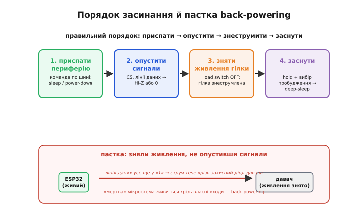
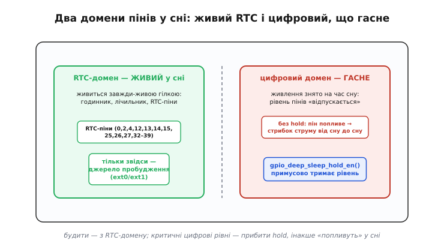

# ⚙️ Чек-лист-як-код: заводимо плату в найглибший сон

Ми вже з'ясували головне: у спокої струм тече не в чип, а в **обвʼязку плати**, і найбільший виграш дають апаратні рішення — прибраний power-LED, low-Iq стабілізатор, знеструмлені гілки. Але апаратура лише **робить можливим** глибокий сон; довести пристрій до нього мусить **прошивка**. І тут ховається прикра асиметрія: заліза правильного мало — треба ще, щоб жоден рядок коду тихо не тримав щось увімкненим.

Бо мікроконтролер, який іде в сон, — це не вимикач «усе згасло». Це господар, що зачиняє великий будинок на ніч: якщо забути одне вікно, тепло витікатиме всю ніч, і байдуже, які товсті стіни. Забутий увімкнений давач, залишений «висіти» пін, знята з гілки напруга при все ще активній лінії даних — кожна така дрібниця тримає струм у сотні мікроампер, а це вже перекриває весь бюджет, за який ми боролися залізом. Гірше: такі помилки **не видно**. Пристрій прокидається, працює, знову «засинає» — а споживає вдесятеро більше за розрахунок, і зрозуміти чому можна лише [прямим виміром струму спокою](root:embedded/sleep-current-audit).

Тому підхід тут — не «викликати `esp_deep_sleep_start()` і сподіватися». Підхід — **систематичний чек-лист, оформлений як код**: пройтися платою вузол за вузлом і для кожного явно сказати, чим він стає в сні. Не покладатися на те, що «воно само вимкнеться», бо саме воно не вимкнеться. Напишемо цей чек-лист на ESP-IDF — реальною прошивкою, яку можна взяти й адаптувати під свою плату, — і на кожному кроці розберемо, чому саме так, а не інакше.

## Задача

Уявіть типовий батарейний пристрій на ESP32: раз на кілька хвилин він прокидається, зчитує давач, шле пакет по радіо й засинає назад. 99.9 % часу — сон, і саме сон з'їдає батарею. Плату вже вичищено апаратно: low-Iq LDO, жодного зайвого світлодіода, зовнішній давач сидить на окремій гілці за перемикачем живлення (load switch — польовий транзистор, що повністю відрізає гілку від шини 3.3 В).

Тепер питання прошивки: що конкретно вона має зробити **перед** засинанням, щоб струм упав до одиниць мікроампер, а не застряг на сотнях? Наївна відповідь — «викликати сон» — не працює, і ось три причини, кожна з яких сама по собі губить увесь бюджет.

**Перше: периферія не засинає разом із процесором.** Зовнішній давач температури чи акселерометр має власне живлення й власний стан. Коли ядро ESP32 іде в сон, давач цього **не помічає** — він продовжує міряти, оновлювати регістри й пити свій струм. Його треба **явно** перевести в найглибший режим командою по шині I²C чи SPI. Це стосується й внутрішньої периферії самого чипа.

**Друге: піни в сні «пливуть».** Кожен пін, що в роботі був виходом чи входом із певним рівнем, у сні може лишитися в невизначеному стані — і потягти струм крізь підтяжки, крізь входи сусідніх мікросхем, крізь захисні діоди. Особливо підступний випадок — пін, що керує зовнішнім навантаженням: якщо його рівень «попливе», навантаження може частково ввімкнутися.

**Третє: домени живлення в сні різні.** У глибокому сні кристал ESP32 ділиться на **домени**: більшість цифрової частини знеструмлюється, а маленький **завжди-живий RTC-домен** лишається під напругою — саме він рахує час і слухає піни пробудження. Це означає дві речі, які легко переплутати: рівень звичайного цифрового піна в сні **не тримається сам** (домен знеструмлено), а розбудити чип може **лише** пін із RTC-домену. Плутанина тут дає або стрибок струму, або пристрій, що не прокидається.

Складімо це в одну вимогу: прошивка мусить пройти **весь периметр плати** — кожну периферію, кожен пін, кожну гілку живлення, джерело пробудження — і для кожного елемента залишити його у стані з найменшим струмом. Пропущений елемент не викине помилки під час компіляції й не впаде в рантаймі; він просто тихо їстиме батарею. Тому чек-лист має бути **повним і явним** — не «що згадав», а «все по колу».

> 🔧 **Навіщо це.** Різниця між «викликав сон» і «пройшов чек-лист» — це різниця між пристроєм, що живе тижні, і тим самим пристроєм, що живе роки. Причому помилку не видно на столі: обидва прокидаються й працюють однаково. Її видно лише на графіку струму або через півроку — коли один пристрій ще працює, а інший давно сів. Оформивши засинання як явний чек-лист у коді, ви перетворюєте «сподіваюся, нічого не забув» на «пройдено кожен пункт, ось вони списком».

## Ідея

Уся хитрість — у **порядку**. Здавалося б, байдуже, у якій послідовності гасити вузли, — усе одно все має згаснути. Але ні: неправильний порядок сам створює витік, якого не було б за правильного. Розберімо, чому порядок жорсткий.

Правильна послідовність — **чотири кроки, і кожен готує наступний**:

1. **Приспати периферію по шині.** Поки шина ще жива, а давач ще живлений, надіслати йому команду переходу в найглибший режим (часто це запис у регістр керування живленням). Це має бути **першим**: команду можна віддати лише поки і чип, і давач працюють, і шина під напругою.

2. **Опустити сигнальні лінії.** Тепер лінії до давача — CS, SCK, MOSI, лінії I²C — перевести або в нуль, або у високий опір (Hi-Z). Це готує ґрунт до наступного кроку.

3. **Зняти живлення гілки.** Аж тепер вимкнути load switch — знеструмити гілку з давачем. Гілки більше немає під напругою; давач мертвий і струму не тягне.

4. **Заснути.** Утримати критичні рівні (hold), вибрати джерело пробудження з RTC-домену — і викликати сон.

Чому саме такий порядок, а не будь-який? Ключ — між кроками 2 і 3, і це головна пастка всієї теми: **back-powering**, зворотне живлення. Якщо зняти живлення гілки (крок 3) **раніше**, ніж опустити сигнали (крок 2), станеться ось що. Живлення давача — нуль, але лінія даних від ESP32 усе ще тримає логічну одиницю, тобто 3.3 В. Кожна цифрова мікросхема має на входах **захисні діоди** до своєї шини живлення (це стандартний захист входу від перенапруги). Діод між входом і живленням давача тепер зміщений у прямому напрямку: 3.3 В на вході, 0 В на живленні. Струм тече з піна ESP32 крізь цей діод **у знеструмлену гілку** — і живить давач через його ж входи. Гілку ніби вимкнено, а вона під напругою; струм тече, давач наполовину живий, увесь виграш від load switch — коту під хвіст.


*Конвеєр із чотирьох кроків і пастка внизу: коли живлення гілки знято, а лінія даних усе ще у «1», струм тече крізь захисний діод давача — «мертва» мікросхема живиться крізь власні входи. Тому сигнали опускають ДО зняття живлення.*

Ось чому порядок жорсткий: спершу **прибираємо напругу з сигналів**, і лише тоді **прибираємо напругу з гілки**. Тоді немає різниці потенціалів, немає струму крізь діоди, гілка справді мертва.

Тепер друга половина ідеї — **утримання рівнів (hold) і домени**. Коли ESP32 іде в глибокий сон, цифровий домен знеструмлюється, і рівень звичайного піна перестає підтримуватися: пін «відпускається». Для більшості пінів це байдуже. Але якщо пін керує чимось важливим — тримає load switch вимкненим, тримає лінію reset зовнішньої мікросхеми, — його рівень **мусить пережити сон**. Для цього є механізм **hold**: він «заморожує» стан піна апаратно, і той тримається навіть коли домен знеструмлено.

Ось де народжується найпідступніша пастка теми — **стрибок струму від запуску до запуску**. Ви налаштували все правильно, виміряли — сон 12 мкА, чудово. Наступного тижня додали функцію, і раптом сон — 300 мкА, хоча «нічого не міняли в засинанні». Причина: критичний пін тепер не утримується — забули hold, або новий код його скинув, — і в сні він поплив, увімкнувши щось частково. Найгірше, що виглядає це як **випадковість**: іноді пін пливе в одну сторону, іноді в іншу, струм стрибає від запуску до запуску. Гоняти таке годинами — класична пастка; лікується вона одним рядком `gpio_deep_sleep_hold_en()`, який робить утримання явним і надійним.

І остання частина — **звідки будити**. Оскільки в сні живий лише RTC-домен, розбудити чип може лише пін, що фізично належить цьому домену. На ESP32 це підмножина пінів (RTC GPIO: 0, 2, 4, 12–15, 25–27, 32–39); звичайний цифровий пін пробудження не дасть. Тут ще одна розвилка: `ext0` будить від одного RTC-піна, але **тримає RTC-периферію ввімкненою** в сні (додатковий струм); `ext1` будить від кількох пінів і працює навіть із **вимкненою** RTC-периферією — тобто економніший. Для найглибшого сну майже завжди правильний вибір — `ext1`. Деталі того, [які взагалі сигнали здатні розбудити чип](topic:programming/wakeup-sources) і чим вони відрізняються, — окрема розмова; нам зараз важливо одне: джерело пробудження береться **із завжди-живого домену**, інакше пристрій засне назавжди.


*Два домени пінів у сні. Ліворуч — завжди-живий RTC-домен: лише його піни (0, 2, 4, 12–15, 25–27, 32–39) тримають рівень самі й лише вони годяться джерелом пробудження. Праворуч — цифровий домен, що знеструмлюється: без `gpio_deep_sleep_hold_en()` рівень піна «відпускається» й може попливти, даючи стрибок струму від сну до сну.*

## Робочий C: чек-лист засинання на ESP-IDF

Зберімо все в одну функцію `enter_deep_sleep()`, що йде рівно за нашими чотирма кроками. Код реальний, під ESP-IDF; підставте свої номери пінів і адреси давача. Спершу — оголошення й карта пінів плати, бо весь чек-лист крутиться навколо неї.

```c
#include "esp_sleep.h"
#include "driver/gpio.h"
#include "driver/rtc_io.h"
#include "driver/i2c.h"
#include "esp_log.h"
#include <inttypes.h>

static const char *TAG = "sleep";

// ── Карта пінів плати ─────────────────────────────────────────────────────
// Уся суть чек-листа — знати КОЖЕН пін і що з ним робити в сні.
#define PIN_SENSOR_PWR   GPIO_NUM_25   // затвор load switch гілки давача
#define PIN_I2C_SDA      GPIO_NUM_21
#define PIN_I2C_SCL      GPIO_NUM_22
#define PIN_WAKE         GPIO_NUM_33   // кнопка/переривання давача — RTC-пін!
#define PIN_STATUS_LED   GPIO_NUM_2    // лишок від DevKit, у сні гасимо

#define SENSOR_I2C_ADDR  0x76
#define SENSOR_REG_CTRL  0xF4          // регістр керування живленням давача
#define SENSOR_MODE_SLEEP 0x00         // "sleep" за даташитом давача

#define I2C_PORT         I2C_NUM_0
```

Тепер **крок 1 — приспати периферію**. Поки шина жива, наказуємо давачу заснути. Це запис одного регістра, але без нього давач лишиться в періодичному вимірі й тягтиме свій струм — байдуже, що ядро спить.

```c
// ── Крок 1: явно приспати зовнішній давач по шині ─────────────────────────
// Поки I2C ще живий і гілка ще під напругою — інакше команду не віддати.
static void sensor_power_down(void)
{
    uint8_t cmd[2] = { SENSOR_REG_CTRL, SENSOR_MODE_SLEEP };
    esp_err_t err = i2c_master_write_to_device(
        I2C_PORT, SENSOR_I2C_ADDR, cmd, sizeof(cmd),
        pdMS_TO_TICKS(50));
    if (err != ESP_OK) {
        // Давач не відповів — це саме по собі проблема бюджету:
        // не приспаний давач з'їсть сон. Логуємо, а не мовчимо.
        ESP_LOGW(TAG, "davach ne zasnuv: %s", esp_err_to_name(err));
    }
    i2c_driver_delete(I2C_PORT);   // звільнити драйвер шини
}
```

Зверніть увагу на дрібницю з великими наслідками: якщо давач не відповів, ми **не мовчимо**. Мовчазний збій тут — саме той випадок, коли пристрій «спить» на сотнях мікроампер, і ніхто не знає чому. Одне попередження в лог рятує години пошуку.

**Крок 2 — опустити сигнальні лінії.** Драйвер I²C ми зняли; тепер лінії SDA/SCL стали звичайними пінами. Переводимо їх у стан, що не тече струмом. І одразу гасимо залишковий status-LED, якщо він лишився від DevKit.

```c
// ── Крок 2: опустити сигнали ДО зняття живлення гілки ─────────────────────
// Якщо зробити навпаки, лінії у "1" живитимуть мертвий давач крізь діоди.
static void quiesce_signals(void)
{
    // Лінії шини до давача — у нуль (підтяжки шини зовнішні, тож нуль безпечний).
    gpio_set_direction(PIN_I2C_SDA, GPIO_MODE_OUTPUT);
    gpio_set_direction(PIN_I2C_SCL, GPIO_MODE_OUTPUT);
    gpio_set_level(PIN_I2C_SDA, 0);
    gpio_set_level(PIN_I2C_SCL, 0);

    // Status-LED — погасити напевно.
    gpio_reset_pin(PIN_STATUS_LED);
    gpio_set_direction(PIN_STATUS_LED, GPIO_MODE_OUTPUT);
    gpio_set_level(PIN_STATUS_LED, 0);
}
```

**Крок 3 — зняти живлення гілки.** Аж тепер, коли сигнали вже внизу, вимикаємо load switch. Гілка знеструмлюється чисто, без зворотного струму крізь діоди — саме тому цей крок стоїть після кроку 2, а не переплутаний з ним.

```c
// ── Крок 3: знеструмити гілку давача (load switch OFF) ────────────────────
// Порядок: сигнали вже опущено (крок 2), тож back-powering не станеться.
static void cut_sensor_branch(void)
{
    gpio_set_direction(PIN_SENSOR_PWR, GPIO_MODE_OUTPUT);
    gpio_set_level(PIN_SENSOR_PWR, 0);   // 0 = гілку вимкнено (для P-канального
                                         // ключа з підтяжкою; полярність — за схемою)
}
```

**Крок 4 — заснути.** Найтонший крок. Спершу **утримуємо** критичні рівні, щоб вони пережили знеструмлення цифрового домену. Потім **ізолюємо** пін пробудження й налаштовуємо його як джерело з RTC-домену. І лише тоді викликаємо сон.

```c
// ── Крок 4: утримати рівні, вибрати пробудження, заснути ──────────────────
static void arm_and_sleep(void)
{
    // 4a. Утримати критичний рівень load switch крізь сон.
    //     Без цього пін "попливе" в сні → гілка може ожити → стрибок струму.
    gpio_hold_en(PIN_SENSOR_PWR);
    gpio_deep_sleep_hold_en();   // увімкнути утримання ЦИФРОВИХ пінів у deep-sleep

    // 4b. Джерело пробудження — з RTC-домену. ext1 працює навіть із
    //     ВИМКНЕНОЮ RTC-периферією, тож економніший за ext0.
    const uint64_t wake_mask = (1ULL << PIN_WAKE);
    esp_sleep_enable_ext1_wakeup(wake_mask, ESP_EXT1_WAKEUP_ANY_HIGH);

    // 4c. Явно вимкнути RTC-периферію: нам потрібен лише RTC-таймер/контролер.
    esp_sleep_pd_config(ESP_PD_DOMAIN_RTC_PERIPH, ESP_PD_OPTION_OFF);

    // 4d. (для WROVER) зняти зайвий струм крізь підтяжку GPIO12.
    //     На WROVER GPIO12 має зовнішню підтяжку + внутрішній pulldown —
    //     у сні крізь них тече струм. rtc_gpio_isolate обриває цей шлях.
    rtc_gpio_isolate(GPIO_NUM_12);

    ESP_LOGI(TAG, "vhodymo v deep-sleep");
    esp_deep_sleep_start();       // сюди код більше не повертається
}

// ── Повний чек-лист засинання: рівно чотири кроки, у жорсткому порядку ─────
void enter_deep_sleep(void)
{
    sensor_power_down();   // 1. приспати периферію по шині
    quiesce_signals();     // 2. опустити сигнали
    cut_sensor_branch();   // 3. зняти живлення гілки
    arm_and_sleep();       // 4. утримати, обрати пробудження, заснути
}
```

Функція `esp_deep_sleep_start()` не повертає керування: після неї чип спить, а прокинувшись — стартує з нуля, як після скидання. Тому весь чек-лист і зібрано в одну функцію, яку викликають **останньою** в циклі роботи.

Розберімо кілька рішень у `arm_and_sleep`, бо саме там сконцентровано суть. Виклик `esp_sleep_pd_config(ESP_PD_DOMAIN_RTC_PERIPH, ESP_PD_OPTION_OFF)` явно вимикає RTC-периферію: за замовчуванням ESP-IDF гасить домени, не потрібні джерелам пробудження, але ми робимо намір **явним** — бо саме `ext1` (на відміну від `ext0`) дозволяє собі цю розкіш, а `ext0` тримав би домен живим. Виклик `rtc_gpio_isolate(GPIO_NUM_12)` — це саме той [шлях витоку крізь підтяжку](topic:programming/current-paths), який офіційна документація ESP-IDF рекомендує обірвати на модулях WROVER: там GPIO12 має і зовнішню підтяжку, і внутрішній pulldown, тож у сні крізь них тече паразитний струм; ізоляція піна цей струм прибирає.

## Складність і пастки

Код вище — це «щасливий шлях». Тепер найважче: місця, де все компілюється, пристрій прокидається, працює — а струм не той. Кожна з цих пасток коштувала комусь днів пошуку.

**Back-powering крізь сигнальні лінії — пастка номер один.** Ми на ній наголошували, але повторимо, бо вона найпідступніша: пристрій **працює бездоганно**, просто споживає забагато. Знеструмили гілку, а лінія даних лишилась у «1» — струм тече крізь захисний діод у мертву мікросхему. Ознака: вимір показує, що load switch «не допомагає» — струм з ним і без нього майже однаковий. Механізм лікування вже в коді (крок 2 перед кроком 3), але пастка ширша за одну гілку. Той самий діод працює й **у зворотний бік**: якщо на вимкнену гілку приходить сигнал ззовні (від сусідньої живої мікросхеми, від зовнішнього роз'єму), він так само нагодує мертву гілку. Тому правило: **жодна лінія до знеструмленої гілки не сміє лишатися під напругою** — ні з боку ESP32, ні з боку сусідів.

**Стрибок струму від запуску до запуску через забутий hold.** Друга за підступністю. Симптом характерний: сон то 12 мкА, то 250 мкА, і закономірності «на око» немає. Причина майже завжди — критичний пін, що не утримується в сні: без `gpio_deep_sleep_hold_en()` цифровий пін у deep-sleep «відпускається», і залежно від зовнішньої обвʼязки він осідає то в одну, то в іншу сторону, іноді частково вмикаючи навантаження. Особливо злий різновид — коли hold **був**, а нова правка коду його зняла: засинання «те саме», а струм стрибнув. Захист: усі піни, чий рівень має пережити сон, утримувати явно, і тримати цей список поруч із картою пінів. І пам'ятайте дзеркальний бік: прокинувшись, hold треба **зняти** (`gpio_hold_dis` для звичайних, `rtc_gpio_hold_dis` для RTC-пінів), інакше пін лишиться «замороженим» і не слухатиметься нового коду — це вже протилежний баг, коли вихід «не реагує».

**Inrush при вмиканні гілки — пастка пробудження, а не засинання.** Про неї забувають, бо думають лише про сон. Коли пристрій прокидається й **вмикає** гілку давача назад, на ній сидять конденсатори розв'язки — і в перший момент вони порожні, тобто виглядають як коротке замикання. Через щойно ввімкнений load switch б'є **кидковий струм** (inrush): десятки-сотні міліампер на частки мілісекунди, поки конденсатори заряджаються. Наслідки бувають злі: просадка напруги на шині може викинути сам ESP32 у [brownout-скидання](topic:programming/reset-causes) — і пристрій замість роботи піде на перезавантаження, спалюючи більше енергії, ніж заощадив. Механізм: миттєвий струм заряду ємності — це

```
I_inrush ≈ C · dV/dt
```

тобто чим різкіше вмикається ключ (менше dt) і чим більша ємність гілки C, тим вищий пік. Лікування — **плавний старт** (soft-start): вмикати load switch не миттєво, а з керованою крутістю фронту. Багато готових перемикачів живлення мають вивід плавного старту (конденсатор на ньому задає час наростання); якщо керуєте дискретним MOSFET — сповільнюють фронт на його затворі. У прошивці це означає: після пробудження не кидатися одразу опитувати давач, а дати гілці **час устоятися** — витримати паузу на заряд ємностей і старт давача, перш ніж перший обмін по шині.

**Хибний вибір джерела пробудження.** Пастка, що дає не зайвий струм, а **мертвий пристрій**. Якщо повісити пробудження на звичайний цифровий пін (не з RTC-домену), у сні цей пін знеструмлено — і сигнал на ньому чип **не почує**. Пристрій засинає й не прокидається; виглядає як «завис у сні». Тому пін пробудження завжди перевіряють по списку RTC GPIO ще на етапі розведення плати. Дзеркальна помилка — узяти `ext0` замість `ext1` там, де хочемо найглибший сон: `ext0` **тримає RTC-периферію ввімкненою**, додаючи струм, якого могло не бути. Обидві помилки тихі: перша ламає пробудження, друга — бюджет.

**Пропущений вузол — узагальнена пастка.** Найчастіша з усіх і найнудніша: просто **забули щось із периметра**. Забули другий давач на тій самій шині. Забули, що АЦП-канал вимірювання батареї тримає під напругою дільник. Забули підтяжку, яку самі ж увімкнули на старті. Кожне таке «забули» — сотні мікроампер повз бюджет, і жодного натяку в коді. Єдиний надійний захист — той, з якого ми почали: **чек-лист має бути повним**, оформленим як явний список у коді, а не «що згадав». Пройти плату по колу, для кожного вузла лишити рядок — навіть якщо цей рядок каже «тут нічого не треба». І звірити результат виміром: правильно заведений у сон ESP32 показує одиниці-десятки мікроампер; якщо вимір дає сотні — якийсь пункт чек-листа тихо провалено, і його треба знайти [прямим аудитом струму спокою](root:embedded/sleep-current-audit), а не вгадуванням.

Підсумок простий і незручний водночас. Глибокий сон — не подія («викликав функцію»), а **стан, у який треба акуратно завести всю плату**, елемент за елементом, у правильному порядку. Апаратура робить його можливим; прошивка мусить його **досягти** й **утримати** до самого пробудження. Оформіть засинання як чек-лист-як-код — повний, явний, з жорстким порядком і утриманням рівнів — і тоді розрахункові місяці автономної роботи стануть реальними місяцями, а не двома тижнями через один забутий пін.
