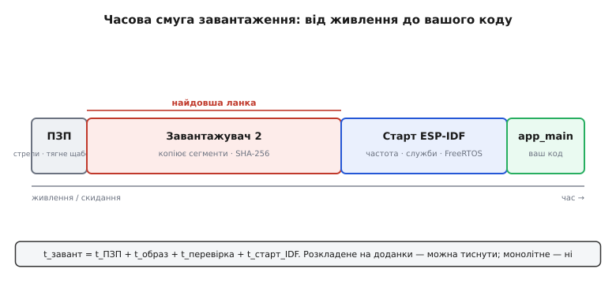
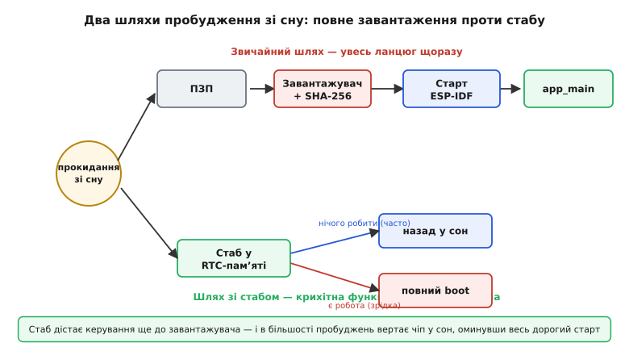

# Бюджет часу завантаження

Ми щойно навчилися [класти байти у Flash і діставати їх назад](root:embedded/esptool-workflow) — тримати чіп у руках. Тепер поставмо інше питання, яке зринає тієї миті, коли пристрій уперше йде «в поле» й живиться від батарейки: **скільки часу минає від натискання кнопки живлення до першого рядка вашого коду — і скільки це коштує?**

Звучить дрібно. Ну, кілька сотень мілісекунд — кого це обходить? Обходить, і дуже, варто згадати одну річ, яку ми вже бачили. Пристрій на батарейці майже весь час **спить**, прокидаючись зрідка, щоб поміряти й передати; саме [рідкісні прокидання й коротка активність](root:embedded/duty-cycle-current) тримають середній струм низьким. Але кожне прокидання — це **новий старт**. І якщо старт триває пів секунди, а корисна робота — двадцять мілісекунд, то двадцять п'ять разів на хвилину ви платите енергією не за вимірювання, а за **сам факт того, що чіп прокидався й заново збирав себе докупи**. Завантаження з дрібниці перетворюється на головного пожирача заряду.

Тож «бюджет часу завантаження» (англ. *boot* — від *bootstrap*, [«самопідняття за власні халяви»](root:embedded/boot-time-budget/hist-bootstrap.md)) — це не academічна цікавість, а реальна стаття витрат, яку інженер міряє, розкладає на частини й тисне вниз. Розберімося спершу, **з чого** цей час складається, бо тиснути наосліп — марна справа.

### Що насправді відбувається до `app_main`

Коли ви пишете прошивку, ваша «перша» функція — `app_main()` (чи `setup()` в Arduino). Та насправді до неї чіп виконує цілий ланцюг чужого коду, і кожна ланка з'їдає свій шматок часу. Розкладемо ланцюг чесно — бо доти, доки він «магія», ви не знаєте, що в ньому коротшати, а що ні.

**Перша ланка — завантажувач у ПЗП** (англ. *ROM bootloader*). Це той самий незнищенний помічник, [з яким ми вже знайомі](topic:programming/bootloader): крихітна заводська програма в масковому ПЗП, яку не стерти. Прокинувшись, чіп завжди починає з неї. Вона дивиться на [стрепувальні ніжки](root:embedded/esptool-workflow) — лити прошивку чи бігти код? — і, якщо бігти, читає з Flash наступну ланку. Окремий, теж важливий випадок: якщо чіп прокидається **з глибокого сну**, ПЗП спершу зазирає в RTC-пам'ять — і тут ховається головний важіль швидкості, до якого ми дійдемо.

**Друга ланка — завантажувач другого щабля** (англ. *second-stage bootloader*), той, що лежить у Flash на зсуві `0x1000` (на новіших чипах — на `0x0`). Це вже ваш, оновлюваний завантажувач від ESP-IDF. Він читає [таблицю розділів](root:embedded/esptool-workflow) (хто де живе у Flash), вибирає, яку прикладну прошивку запускати (а якщо їх кілька — звіряє дані OTA), а тоді робить найдорожчу роботу: **завантажує образ прошивки в пам'ять**. Частину сегментів (код і дані, що мусять бути в ОЗП) він фізично **копіює** з Flash у RAM; іншу частину (код і сталі, що виконуються прямо з Flash) — лише відображає через апаратний блок керування пам'яттю, MMU. І, перш ніж віддати керування, він **перевіряє цілість** прикладного образу — рахує контрольний відбиток SHA-256 і звіряє. Це той самий принцип звірки, що дав нам `Hash of data verified` в esptool, тільки тут чіп звіряє образ **сам перед запуском**.

**Третя ланка — старт самого застосунку**: усе, що ESP-IDF робить **після** того, як завантажувач стрибнув у вашу прошивку, але **до** `app_main`. Тут три кроки поспіль:
- **Підготовка заліза й C-середовища**: переналаштувати винятки процесора, занулити секцію `.bss`, скопіювати початкові значення `.data`, увімкнути PSRAM (якщо є), **підняти тактову частоту** ядра до проєктної, запустити друге ядро.
- **Підняття системних служб**: ініціалізувати купу (heap), консоль, детектор просідання живлення, виконати efuse-перевірки безпеки, **прокрутити всі конструктори C++** і функції-ініціалізатори компонентів.
- **Запуск планувальника FreeRTOS** і створення головної задачі — аж тоді викликається ваш `app_main`.

Ось повна правда про «миттєвий старт»: між живленням і вашим кодом стоять чотири роботи поспіль, кожна зі своєю ціною.


*Ланцюг від живлення до вашого коду, розкладений у часі. Ширина кожного блоку — приблизна частка часу: завантажувач ПЗП дивиться на стрепи й тягне другий щабель; другий щабель читає таблицю розділів, копіює сегменти в RAM і звіряє SHA-256 образу (найдовша ланка); старт ESP-IDF піднімає частоту, служби й FreeRTOS — і лише тоді app_main. Кожна ланка — окрема стаття бюджету, яку можна міряти й тиснути.*

### Бюджет: сума ланок, а не одне число

Тепер головна думка, заради якої все це. **Час завантаження — не монолітне «пів секунди», а сума доданків**, і кожен доданок має свою природу та свій важіль:

```
t_завант = t_ПЗП + t_образ + t_перевірка + t_старт_IDF + t_до_app_main
```

Інженерна цінність такого розкладу — точно та сама, що й у [бюджету струму](root:embedded/duty-cycle-current) чи [бюджету потужності](root:embedded/power-budget): **доки ціле не розкладене на доданки, його не оптимізувати**. Скаржитися «чіп довго стартує» — марно. А ось «копіювання й перевірка образу з'їдають 180 мс із 240, бо Flash крутиться на 40 МГц і образ великий» — це вже діагноз, і з ним можна щось зробити.

Звідки які величини беруться, варто відчути на пальцях, без точних чисел (вони залежать від чипа, розміру образу й налаштувань):
- **`t_образ`** (копіювання сегментів) **росте з розміром прошивки** й **падає зі швидкістю Flash**. Що більший ваш бінарник і повільніша шина SPI до Flash — то довше копіювати.
- **`t_перевірка`** (SHA-256 усього образу) теж **росте з розміром** — гешувати треба кожен байт.
- **`t_ПЗП`** при холодному старті малий і майже сталий; але при пробудженні зі сну він **повністю у ваших руках** через RTC-кеш.
- **`t_старт_IDF`** залежить від того, скільки служб ви піднімаєте та скільки конструкторів і ініціалізаторів накопичилось у проєкті.

> 🔧 **Навіщо це.** Розклад одразу підказує, **куди не варто** кидатися. Новачок, побачивши повільний старт, лізе оптимізувати `app_main` — а він ще навіть не почався. Інженер дивиться на доданки: якщо левову частку забирають копіювання й перевірка образу, то прискорить справу більша частота Flash чи менший бінарник, а не вилизаний код застосунку. Бюджет економить вам години, витрачені не туди.

### Важелі: чим реально коротшати завантаження

Розклавши час на доданки, беремося за кожен. Важелів небагато, і вони чесні — кожен тисне свій доданок.

**Швидша й ширша шина до Flash.** Найбільший доданок, `t_образ`, прямо залежить від того, як швидко байти течуть із Flash. У [заголовку образу, який пише esptool](root:embedded/esptool-workflow), зашито дві речі: **частоту** SPI-Flash (типово 40 МГц, але якщо плата й мікросхема тягнуть — 80 МГц) і **режим** (скільки ліній даних: DOUT/DIO — дві, QIO/QOUT — чотири). Перехід із 40 на 80 МГц і з двох ліній на чотири може майже **вдвічі-вчетверо** скоротити час копіювання й перевірки — бо обидва кроки впираються в швидкість читання Flash. Застереження одне, але серйозне: не кожна плата надійно працює на 80 МГц у QIO; завищите без перевірки — і чіп почне зрідка падати при старті. Тому це важіль «увімкни й переконайся, що працює стабільно», а не «постав максимум наосліп».

**Тихіший завантажувач.** Завантажувач другого щабля за замовчуванням друкує у консоль рядки про себе. Друк — це повільний UART, і кожен рядок коштує часу. Зниження рівня журналу завантажувача (аж до повного мовчання) **скорочує старт на невеликий, але дармовий шматок** — ви ж не читаєте ці рядки в полі. Те саме стосується журналу самого застосунку на старті.

**Менше зайвої роботи на старті.** Не всі кроки `t_старт_IDF` обов'язкові. Журналювання версії й дати збірки, частина efuse-перевірок, ініціалізатори компонентів із низьким пріоритетом — усе це **необов'язкове** й вимикається. А **обов'язкове** — копіювання сегментів, перевірка образу, підняття частоти, ініціалізація C-середовища — не прибрати, не зламавши пристрій. Тож тут правило просте: ріжте те, чим не користуєтесь, і не чіпайте те, без чого нічого не працює.

**Не перевіряти образ там, де це безпечно.** Перевірка SHA-256 — це страховка від зіпсованого образу. На холодному старті вона дешева відносно користі. Але при пробудженні зі сну, де чіп прокидається тисячі разів і образ свідомо той самий, цю перевірку можна **пропускати** — і це підводить нас до найпотужнішого важеля.

**бажаний підпис-умова: оцінити енергію одного завантаження проти корисної роботи**
```c
// Чіп прокидається 4 рази на хвилину виміряти й передати.
// Завантаження триває 240 мс при середньому струмі ~40 мА (boot активний).
// Корисна робота — 20 мс виміру + 30 мс передачі.
const float t_boot_s   = 0.240f;   // час завантаження, с
const float i_boot_mA  = 40.0f;    // середній струм під час boot, мА
const float t_work_s   = 0.050f;   // корисна активність, с
const float i_work_mA  = 80.0f;    // середній струм роботи, мА

float q_boot = i_boot_mA * t_boot_s;   // заряд на одне завантаження, мА·с
float q_work = i_work_mA * t_work_s;   // заряд на корисну роботу, мА·с
// q_boot = 40 * 0.240 = 9.6  мА·с
// q_work = 80 * 0.050 = 4.0  мА·с
float share_boot = q_boot / (q_boot + q_work);   // = 9.6 / 13.6 ≈ 0.71
```
Висновок: **71 % заряду кожного циклу йде на саме завантаження, а не на роботу.** Скоротивши boot удвічі, ви рятуєте більше заряду, ніж якби геть прибрали вимірювання. Ось чому час старту — це питання живучості батарейки, а не лише зручності.

### Стаб пробудження: пропустити завантаження зовсім

Тепер найпотужніший важіль — той, що для періодичних давачів змінює гру. Згадаймо `q_boot ≈ 9.6 мА·с` з прикладу: майже весь час циклу. А що, якби при більшості пробуджень **завантаження взагалі не відбувалося**?

Саме це й дає **стаб пробудження** (англ. *wake stub*) — близький родич того [stub-помічника, що пришвидшує заливання](root:embedded/esptool-workflow). Ідея спирається на одну фізичну особливість: невеликий шматок пам'яті — **RTC fast memory** — **зберігає вміст крізь глибокий сон**, коли решта RAM знеструмлена й уже містить сміття. Якщо покласти крихітну функцію туди, чіп зможе виконати її **миттєво при пробудженні — перш ніж запуститься завантажувач і перш ніж із Flash узагалі щось завантажиться**.

Це переламна різниця. Звичайне пробудження проходить **весь** ланцюг із часової смуги вище: ПЗП → завантажувач → копіювання й перевірка образу → старт ESP-IDF → ваш код. Стаб пробудження **зрізає цей ланцюг біля кореня**: ваша функція в RTC-пам'яті дістає керування одразу й сама вирішує — **чи варто будити весь чіп цього разу**.

Класичний сценарій: давач прокидається щосекунди лише глянути, чи не змінилося щось. У 99 випадках зі ста все спокійно. Стаб швидко зчитує давач (через функції в ПЗП або покладені поруч у RTC-пам'ять), бачить «нічого цікавого» — і **відправляє чіп назад у сон, не запустивши ні завантажувач, ні прошивку**. Повний, дорогий старт трапляється лише в той сотий раз, коли справді є що обробити. Середній заряд на пробудження падає в рази — бо більшість пробуджень тепер коштують крихти.


*Чому стаб пробудження такий потужний. Звичайний шлях (угорі) щоразу проходить увесь ланцюг: ПЗП, завантажувач, копіювання й перевірка образу, старт ESP-IDF. Шлях зі стабом (унизу) виконує крихітну функцію з RTC-памʼяті ще до завантажувача: коли робити нічого — чіп вертається у сон, оминувши весь дорогий старт. Повне завантаження трапляється лише тоді, коли стаб вирішив, що цей раз вартий уваги.*

За потужність платиться суворими обмеженнями, і їх варто знати наперед, бо на них спотикаються. Стаб живе у крихітній RTC-пам'яті, тож має бути **маленьким**. Він може кликати **лише** функції, що сидять у ПЗП або теж покладені в RTC-пам'ять, — звичайні функції прошивки ще не завантажені й кликати їх не можна. Уся решта RAM на цей момент — **неініціалізована**, у ній випадкові байти; покладатися можна тільки на дані, явно збережені в RTC-пам'яті. Це не «ще одне місце для коду», а вузький, особливий простір з власними правилами.

Є й споріднений, простіший важіль для тих самих частих пробуджень: навіть коли повне завантаження таки потрібне, завантажувач може **пропускати перевірку SHA-256** при виході зі сну (бо образ свідомо незмінний, а його адресу він закешував у RTC-пам'яті ще на першому старті). Це не оминає завантажувач цілком, як стаб, але прибирає з гарячого шляху найдорожчий його крок.

> 🔧 **Навіщо це.** Для давача на батарейці, що прокидається часто, стаб пробудження — різниця між тижнями й місяцями автономності. Без нього кожне пробудження тягне повний boot — і, як показав наш приклад, це більшість заряду циклу. Зі стабом більшість пробуджень коштують крихти, а дорогий старт трапляється лише коли є реальна робота. Це той рідкісний важіль, що дає не відсотки, а **рази**.

### Як це поміряти

Усе вищесказане — лише оцінки, доки ви не **поміряли власний** boot. А оптимізувати, не вимірявши, — це гадати; того самого правила ми трималися [для струму спокою](root:embedded/sleep-current-audit) й триматимемось тут.

Найчесніший спосіб поміряти повний boot — той, що не залежить від коду, який ще не запустився: **смикнути ніжку GPIO** у найпершому рядку `app_main` і подивитися осцилографом або логічним аналізатором, скільки минуло від фронту скидання (RESET/EN) до цього смикання. Це міряє **геть усе** — від ПЗП до вашого коду, включно з тим, що жоден програмний таймер усередині прошивки побачити не може, бо його ще не існувало.

**бажаний підпис-умова: позначити ніжкою момент, коли почав виконуватись наш код**
```c
#include "driver/gpio.h"
#include "esp_timer.h"
#include "esp_log.h"

#define BOOT_MARK_GPIO  GPIO_NUM_2   // вільна ніжка під щуп аналізатора

void app_main(void)
{
    // Найперший рядок: підняти ніжку — це «мій код стартував».
    gpio_set_direction(BOOT_MARK_GPIO, GPIO_MODE_OUTPUT);
    gpio_set_level(BOOT_MARK_GPIO, 1);

    // Час від СКИДАННЯ до цієї миті — на аналізаторі (фронт RESET → фронт GPIO).
    // А esp_timer лічить від початку старту ESP-IDF — корисно для відносних замірів.
    int64_t t_since_idf_us = esp_timer_get_time();
    ESP_LOGI("boot", "від старту ESP-IDF до app_main: %lld мкс", t_since_idf_us);

    // ... далі звичайна ініціалізація застосунку ...
}
```
Висновок: фронт на ніжці дає **абсолютний** час повного завантаження (його не підробити зсередини), а `esp_timer_get_time()` — час від початку старту ESP-IDF, зручний, щоб бачити внесок саме третьої ланки. Маючи обидва числа, ви відділяєте «скільки з'їв завантажувач» від «скільки з'їв старт ESP-IDF».

Маючи цифри, далі дієте за бюджетом: великий `t_образ` — гляньте на швидкість Flash і розмір бінарника; велика третя ланка — пройдіться ініціалізаторами; часті пробудження зі сну — стаб або хоча б пропуск перевірки. Зведіть заміри в просту таблицю «ланка → час → важіль» — і оптимізація з гадання стає інженерією; як саме побудувати такий [інструмент профілювання boot прямо в прошивці](root:embedded/boot-time-budget/proj-boot-profiler.md), розберемо окремо.

### Нитка

Завантаження здавалося дрібницею — мовчазною паузою перед «справжнім» кодом. Та варто було розкласти його на ланки — ПЗП, завантажувач, копіювання й перевірка образу, старт ESP-IDF — і виявилося, що це **окрема стаття енергетичного бюджету**, для пристрою на батарейці часто головна. Ми побачили, де ховається час (копіювання й перевірка образу — найбільше), якими важелями його тиснути (швидша Flash, тихіший завантажувач, менше зайвого на старті) і де лежить найпотужніший із них — стаб пробудження, що зрізає весь дорогий ланцюг для частих, коротких прокидань.

Та сама звичка, що вела нас крізь весь модуль: **поміряй, розклади на доданки, тисни найбільший**. Завантаження — лише ще одна її проба. А далі логічне продовження: ми навчилися швидко **вмикатися** — настав час навчитися так само охайно **вимикатися**, бо [впорядковане скидання й зупинка](root:embedded/reset-sequence) бережуть і дані, і саме залізо.
