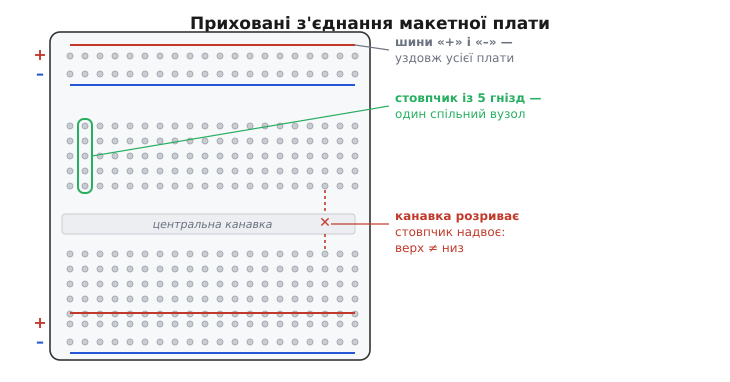

# Макетка й перший монтаж

Дотепер коло існувало для нас лише на папері. Ми навчилися [читати схему](root:embedded/reading-schematics), знаємо закон Ома й дільник напруги, тримали в руках резистор і потенціометр, а поряд уже стоять два прилади — мультиметр і блок живлення. Лишається зробити крок, який відрізняє того, хто *знає* електроніку, від того, хто нею *займається*: перетворити схему на щось, що справді жевріє струмом. І тут одразу постає прикре питання — **як зібрати коло, не паяючи?** Бо паяти ще рано: перше коло майже напевно доведеться кілька разів переробити, а розпаювати й перепаювати кожну спробу — це години марної роботи й обпечені пальці.

Відповідь придумали ще до нас — це **макетна плата** (англ. *breadboard*, буквально «хлібна дошка»). Назва не жарт і не метафора: [колись схему й правда збивали на дерев'яній дошці](root:embedded/breadboard-prototyping/hist-breadboard.md) — прибивали до неї цвяхи й накручували між ними дроти. Сучасна макетка — прямий нащадок тієї дошки, тільки замість цвяхів у ній сотні пружинних гнізд, у які ніжки деталей просто **встромляють**. Вставив — спробував — висмикнув — переставив. Саме ця легкість «переробити за секунду» і робить макетку головним інструментом новачка й швидкого прототипу.

> 🔧 **Навіщо це.** Макетка — це майданчик, де помилка нічого не коштує. На платі з паянням переплутаний дріт означає перепайку; на макетці — просто витягти й переткнути. Тому саме тут варто робити всі перші експерименти, ловити свої «чому воно не працює» і набивати руку, поки ще не задіяно паяльник.

### Що всередині: гнізда вже з'єднані

Уся хитрість макетки в тому, що **частина гнізд з'єднана між собою заздалегідь**, прихованими металевими смужками під пластиком. Користуватися платою — означає точно знати, які саме гнізда вже спаяні всередині, а які ні. Це не деталь для запам'ятовування, а сама суть інструмента: макетка — це набір готових [вузлів](root:hw-analog/nodes-branches-loops), і зібрати схему означає лише правильно з'єднати потрібні вузли.

*Карта прихованих з'єднань. Кожен стовпчик із п'яти гнізд у центрі — один спільний вузол; сусідній стовпчик уже інший. Канавка посередині розриває стовпчик надвоє. Уздовж країв ідуть довгі шини «+» і «–», з'єднані по всій довжині плати.*

Карта проста, щойно її вкладеш у голову:

- **Стовпчик із п'яти гнізд — один вузол.** У центральній зоні гнізда з'єднані вертикальними смужками по п'ять. Усі п'ять гнізд одного стовпчика — електрично **одна точка**; встромивши в них кілька ніжок, ти їх з'єднав. Сусідній стовпчик — уже **інший** вузол.
- **Канавка посередині розриває стовпчик надвоє.** Вертикальні смужки **не** перетинають канавку: верхні п'ять гнізд і нижні п'ять — це **два різні** вузли, хоч і стоять в одному стовпці.
- **Шини живлення тягнуться вздовж усієї плати.** Довгі ряди по краях (зазвичай із червоною «+» і синьою «–» лініями) з'єднані по всій довжині — це довгі вузли, щоб роздавати живлення й землю куди завгодно на платі.

Чому саме така будова, звідки береться поганий контакт і навіщо потрібна канавка — це докладніше розібрано в окремій довідці [про макетку зсередини](root:hw-analog/nodes-branches-loops/comp-breadboard.md); нам зараз досить трьох правил вище, щоб зібрати перше коло.

### Сітка 2.54 міліметра — не випадкове число

Гнізда стоять не абияк, а строгою сіткою з кроком **2.54 мм** — це рівно **одна десята дюйма** (0.1″). Число дивне лише на позір: воно успадковане від класичних мікросхем у корпусі DIP (англ. *dual in-line package* — «здвоєний рядний корпус»), у яких ніжки віддалені саме на 0.1″. Макетку відразу зробили під цей крок, щоб чип сідав у неї ніжка-в-гніздо. Тому й ніжки резисторів, кнопок, роз'ємів у наскрізному монтажі (англ. *through-hole* — «крізь отвір») роблять під ту саму сітку: усе, що має «вивідні ніжки», лягає на макетку природно.

> 🔧 **Навіщо це.** Крок 0.1″ — прихована угода всієї галузі. Через неї макетка, монтажна плата під пайку, гребінки-роз'єми й [корпуси мікросхем](root:hw-components/packages-pinout) сумісні між собою: те, що зібрав на макетці, потім переноситься на плату під пайку майже один-в-один. Тому перший прототип не викидають — він стає кресленням для чистового монтажу.

### Від схеми до плати: перше коло

Тепер найголовніше — **перекласти схему в монтаж**. Прийом простий і надійний: **кожному вузлу схеми віддай окремий стовпчик** макетки. Далі просто поєднуй, що схема велить з'єднати, встромляючи ніжки деталей у той самий стовпчик (вони так стають одним вузлом) або тягнучи перемичку між стовпчиками.

Зберемо коло, яке ми вже вміємо читати: світлодіод, що спалахує по натисканню кнопки. Живлення — 5 В із блока; послідовно зі світлодіодом [струмообмежувальний резистор](root:hw-components/resistor) на 330 Ом (без нього світлодіод згорів би — він сам струм не тримає); а кнопка з підтяжним резистором 10 кОм дає контролеру чіткий сигнал. Порядок монтажу такий:

1. **Роздай живлення на шини.** Проведи перемичку з «+» блока на червону шину плати, з «–» — на синю. Тепер живлення й земля доступні по всій довжині плати — бери звідки зручно.
2. **Постав кожну деталь у свій стовпчик.** Резистор — одним кінцем у стовпчик, з'єднаний із «+», другим у порожній стовпчик A. Світлодіод — довшою ніжкою (анод) у той самий стовпчик A, коротшою (катод) у стовпчик B. Дротик зі стовпчика B — на синю шину («–»).
3. **Простеж коло очима.** «+» → резистор → анод → катод → «–». Це той самий послідовний ланцюжок, який на схемі, тільки тепер він фізичний.

*Той самий переклад «вузол схеми → стовпчик плати». Розкладаючи схему на макетці, ти не вигадуєш нічого нового — лише даєш кожному вузлу фізичне місце й з'єднуєш стовпчики так, як велять лінії схеми.*

Зверни увагу на світлодіод: у нього є **полярність**. Довша ніжка — анод, до «плюсового» боку; коротша — катод, до «мінусового». Переплутаєш — коло замкнене, а світла нема (світлодіод пропускає струм лише в один бік). Це найчастіша причина «зібрав правильно, а не світить»: усе на місці, тільки діод розвернутий.

### Подати живлення — обережно

Коло зібране; лишається ввімкнути. І тут блок живлення показує, навіщо в нього є **обмеження струму** (англ. *current limit*). Перед першим увімкненням незнайомого кола став межу струму низькою — 50–100 мА досить, щоб світлодіод світив, але замало, щоб щось спалити. Якщо десь коротке замикання чи переплутана полярність, блок не віддасть руйнівний струм, а «впреться» в межу й перейде в режим стабілізації струму: напруга просяде, і це видно на його індикаторі. Так одна помилка монтажу перетворюється з диму на просту підказку «щось не так, дивись де».

> 🔧 **Навіщо це.** Виставлена межа струму на [блоці живлення](root:hw-sensing/lab-power-supply) — це страховка прототипу. Коротке замикання на макетці — річ звичайна (зачепив сусідній стовпчик, крива ніжка лягла не туди). З обмеженням струму таке КЗ безпечне: блок сам не дасть спалити ні деталь, ні доріжку. Звичка ставити низьку межу *перед* першим стартом рятує більше схем, ніж будь-яке інше правило.

Увімкнув — світить? Чудово. Не світить — не гадай, а **міряй**. Тут у гру входить [мультиметр](root:hw-sensing/multimeter): у режимі вольтметра прикладай щупи до вузлів і звіряй із тим, що очікуєш. Є 5 В на червоній шині? Доходить напруга до резистора? А після резистора? Рухаючись щупом уздовж кола, ти швидко впираєшся в місце, де очікуване й дійсне розходяться, — саме там і криється помилка.

### Три класичні пастки монтажу

Майже всі «чому воно не працює» на макетці зводяться до трьох повторюваних помилок. Знаючи їх заздалегідь, ти впізнаєш біду з першого погляду.

*Три найчастіші пастки. Кожну видно оком, щойно про неї знаєш: перевір цілість шини, не сплутай боки канавки й переконайся, що ніжки сидять щільно.*

- **Розірвана шина живлення.** На багатьох платах довгі шини «+» і «–» **перервані посередині**. Підключив живлення до одного кінця — а половина плати лишилась знеструмленою. Рятунок простий: з'єднати обидві половини короткою перемичкою (або спершу продзвонити шину мультиметром — чи справді вона суцільна).
- **Через канавку.** Дві ніжки стоять начебто в одному стовпці, але по різні боки центральної канавки. Око бачить «один стовпчик», а електрично це **два різні вузли** — з'єднання нема. Класична пастка, коли деталь ставлять упоперек канавки й забувають, що канавка розриває.
- **Плавучий контакт.** Гнізда з часом розношуються, товсті чи криві ніжки тримаються нещільно — і виникає контакт, який то є, то нема. Схема «то працює, то ні» від найменшого дотику — майже завжди це. Лікується глибшим встромлянням, іншим гніздом або рівнішою ніжкою.

Ще одна корисна звичка, яку варто закласти вже тут: біля кожної мікросхеми, щойно вони з'являться в схемах, ставити [розв'язувальний конденсатор](root:hw-components/decoupling) впритул до її виводів живлення. На макетці, де дротики довгі, а контакти неідеальні, живлення «брудне» — і маленький конденсатор поряд із чипом гасить просадки, від яких той інакше збоїть.

### Коли макетки перестає вистачати

Макетка чудова, але не всесильна, і межі її треба знати, щоб не звинувачувати схему в тому, у чому винен інструмент. Приховані з'єднання — це пружинні затискачі, а не пайка, тож у них є відчутний і **непостійний перехідний опір**; сусідні стовпчики утворюють маленьку паразитну ємність (порядку 2 пФ). Для повільних, слабкострумових кіл це неважливо. Але щойно струми стають великими або сигнали — швидкими, ці дрібниці вилазять боком: макетка надійно працює приблизно до 10 МГц, а вище пружинки й ємності між стовпчиками спотворюють сигнал так, що схема поводиться геть не як на папері.

Тому правило таке: **макетка — для повільного й слабкострумового прототипу**. Перевірив ідею, переконався, що коло робить своє, — і переносиш на монтажну плату під пайку, де контакти надійні, а паразити малі. Для сильного струму (гріються контакти) і для швидкої цифри чи радіо (паразити псують сигнал) макетку взагалі проминають. Але для першого кола, для перших дослідів із законами, які ми щойно вивчили, кращого місця немає — саме тут теорія вперше оживає під пальцями.

Звідси народжується робочий ритм, на який спиратиметься решта курсу: **зібрати, увімкнути обережно, поміряти, виправити**. Кожне наступне коло — складніше за це, але порядок дій той самий, і що раніше він стане рефлексом, то менше згорілих деталей і безсонних «чому воно не працює» попереду.
